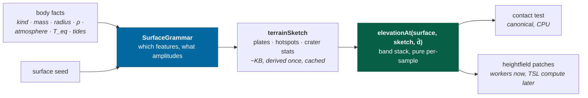

# TERRAIN-PLAN — procedural terrain from orbit to on foot

An engineering plan for the terrain milestone: growing the three-band
heightfield into a geology, the single-level 3×3 patch window into a planet
that holds together from orbit down to standing at the foot of a mountain, and
the field-of-view constant the whole refinement predicate rests on into a lens
with an aperture on it. Written 26 Aug 2026 against a clean `main`, the measured budgets in
[`docs/design/technical.md`](docs/design/technical.md), and a survey of the
2025–26 state of the art (sources inline throughout). Where a claim is a
judgment rather than a measurement, it says so.

The roadmap already names this milestone —
[roadmap § terrain](docs/roadmap.md#terrain) — and the design bible already
commits to derived biomes and rock scatter
([content § terrain](docs/design/content.md#terrain)). This plan is the
engineering sequence for both, plus the geology neither of them specifies.

---

## 1. Scope

**In:** solid bodies — rocky and icy — that render from `SurfaceParameters`
alone. That is every body in a generated system, every projected exoplanet
world, and every Sol body with no shipped map. The gate is mechanical, not a
list: a body whose `BodyAppearance.texture` resolves to a vendored map keeps
today's rendering path untouched; the new pipeline owns the rest. One flag on
the render side, no schema change.

**Out, each with its seam named:**

| Deferred                           | Why now is wrong                                                                                                                                                                          | The seam that waits for it                                                                                                                                                                         |
| ---------------------------------- | ----------------------------------------------------------------------------------------------------------------------------------------------------------------------------------------- | -------------------------------------------------------------------------------------------------------------------------------------------------------------------------------------------------- |
| Mapped Sol bodies (Earth, Mars, …) | Their macro relief is _published_, and the art doctrine requires using it verbatim ([art](docs/design/art.md)) — that is a DEM-ingest workstream, not a generator                         | The same band stack with the macro band read from an ingested tile set instead of noise                                                                                                            |
| Gas and ice giants                 | No surface. The `surface` LOD tier must never fire for them                                                                                                                               | The streamer gates on body kind                                                                                                                                                                    |
| Figured bodies at walking distance | A figure's datum is a measured radius grid, not the cube-sphere's near-sphere; their seeded shape fields already carry close-range detail ([ADR-0013](docs/adr/0013-measured-figures.md)) | The streamer carves them out — a body with a `figure` streams nothing, because a spherical-datum patch floats around the measured ellipsoid; deep terrain on figures is a later projection problem |
| Caves, overhangs, arches           | A radial heightfield cannot hold two surfaces per ray, and the fix is a bounded volumetric overlay, not a different planet                                                                | § 4, the density reframe — designed in now, built later                                                                                                                                            |
| River _networks_, vegetation       | Valley networks need a per-region drainage graph (Génevaux-style), flora needs biomes to exist first                                                                                      | Phase 6                                                                                                                                                                                            |

One honest consequence of the carve-out: `elevationAt` is a single canonical
function shared by rendering and the contact test, so the generator version
bump in Phase 2 moves the procedural ground under _mapped_ bodies too — their
maps are visual, their terrain has always been seeded. Their visual treatment
stays untouched; their ground changes once, with everyone else's, under one
version bump ([ADR-0005](docs/adr/0005-procedural-seeds.md) § versioning).

---

## 2. What exists and holds

The foundations are real and none of them move.

| Foundation                                                | Where                                                                   | Keep because                                                                                                                 |
| --------------------------------------------------------- | ----------------------------------------------------------------------- | ---------------------------------------------------------------------------------------------------------------------------- |
| Cube-sphere quadtree addressing, levels 0–24              | `packages/universe/src/terrain.ts` (`RegionAddress`, `regionDirection`) | A stable integer address for every patch of ground at every LOD — streaming, seeds and scatter all hang off it               |
| Elevation as a pure function of (seed, direction)         | `terrain.ts:165` `elevationAt`                                          | The whole determinism regime; also the only thing that makes planetary scale storable at all (§ 4)                           |
| `BodyFixedDirection` brand                                | `terrain.ts:49`                                                         | Sampling in inertial axes has shipped twice as a bug                                                                         |
| One owner of the sea clamp                                | `terrain.ts:206` `groundElevation`                                      | Physics and mesh agree on where the ocean is                                                                                 |
| Worker-generated heightfields, transferred not copied     | `packages/workers/src/tasks.ts:199`                                     | Capability check 10 proves worker ≡ main thread. The cost is **12.8 ms/patch**, not the ≤ 8 ms the budget claimed — see § 11 |
| Reconciling streamer, heightfield cache across rebases    | `apps/game/src/engine/terrainStreamer.ts`                               | Loading is an ordinary operation, not a mode                                                                                 |
| Body-fixed, anchor-relative patch vertices                | `packages/rendering/src/terrainMesh.ts:62`                              | Baking pose into vertices was ~865 m/frame of ground slide                                                                   |
| Eye-relative log compression, angular size exact          | `packages/rendering/src/placement.ts:115`                               | Measured from anywhere else, small bodies vibrate                                                                            |
| LOD tiers by angular size                                 | `packages/rendering/src/lod.ts:36`                                      | A gas giant at 1e9 m and a boulder at 10 m deserve the same treatment                                                        |
| `renderTime`, never `clock.time`, for anything in a frame | [ADR-0006](docs/adr/0006-simulation-clock.md)                           | The streamer already learned this the hard way                                                                               |

And the layering: quadtree arithmetic and patch building stay in
`packages/rendering` as plain data with Node tests; Three.js objects and TSL
materials exist only in `apps/game`; `packages/universe` may not read a file.

---

## 3. The gap

What stands between today and "rich terrain from orbit to on foot":

| Gap                                                                                               | Consequence today                                                                                                                                                                                                                                                                                                                                                                                                                                     |
| ------------------------------------------------------------------------------------------------- | ----------------------------------------------------------------------------------------------------------------------------------------------------------------------------------------------------------------------------------------------------------------------------------------------------------------------------------------------------------------------------------------------------------------------------------------------------- |
| One LOD level, 3×3 patches, no cross-face wrap (`terrainWindow.ts`, `windowRadius` and `clipped`) | ~~The visible ground is a few patches wide; face edges are holes; the horizon is the datum sphere~~ — closed by Phase 1's whole-disk quadtree; the window is retired                                                                                                                                                                                                                                                                                  |
| No stitching or morphing (`terrainMesh.ts:174` one-sided edge normals)                            | ~~Hairline seams now; cracks the moment two levels coexist~~ — closed by Phase 1: bordered patches, the CDLOD morph, and the 2:1 restriction                                                                                                                                                                                                                                                                                                          |
| Three noise bands                                                                                 | No craters, no tectonics, no volcanism — every world is the same rolling fBm at a different amplitude                                                                                                                                                                                                                                                                                                                                                 |
| One flat color per body                                                                           | Terrain reads as geometry, never as a place; no biomes, no materials                                                                                                                                                                                                                                                                                                                                                                                  |
| Procgen bodies are featureless at `sphere` tier                                                   | The world you approach is not the world you land on — relief appears only below the streaming threshold                                                                                                                                                                                                                                                                                                                                               |
| No scatter                                                                                        | Nothing at human scale; the last octave of noise is the smallest thing that exists                                                                                                                                                                                                                                                                                                                                                                    |
| Planetarium clamps at 1.5 radii (`observer.ts:98`)                                                | ~~No way to _inspect_ a surface without flying a ship to it~~ — closed by Phase 0's surface arm                                                                                                                                                                                                                                                                                                                                                       |
| No terrain perf baseline                                                                          | ~~The 1.0 ms terrain line is designed, not enforced~~ — measured by Phase 0; see § 11                                                                                                                                                                                                                                                                                                                                                                 |
| **The streaming rules measure altitude from the datum**                                           | ~~`terrainLevelFor` and `terrainOpacity` take `distance − radius`, which for a camera on the ground is `groundElevation + height`. A summit streams a level coarse; a summit above `radius · 2^(5.5 − maxLevel)` is **not drawn at all** — two of Miranda's six survey sites are ground that cannot be looked at, at any altitude.~~ Found by Phase 0, closed by Phase 1: distance is measured to the shell of ground itself, and both rules are gone |
| **There is no lens, so the screen-space-error predicate guesses one**                             | ~~The engine states its field of view in nine places and three values, and `selectTerrain` reads none of them — it assumes 60° over 1080 px, which is neither the flight lens nor the cinematic one.~~ Closed by Phase 1.5: the predicate reads the lens the picture is taken with, in display pixels, and aperture, f-number, focus and exposure exist. [ADR-0017](docs/adr/0017-the-lens.md)                                                        |

---

## 4. What the state of the art settles

Four decisions fall straight out of the survey. Sources are the load-bearing
ones; the full trail lives in this plan's PR.

**The planet stays a radial heightfield. Voxels are not the core.** The
storage arithmetic is unforgiving — an Earth-sized body voxelized at 1 m in a
±128 m shell is ~10¹⁷ cells — so every shipped planetary engine derives
content from a pure function and stores only deltas and caches:
[Outerra](https://outerra.blogspot.com/2009/02/procedural-terrain-algorithm.html)
and [Star Citizen](https://starcitizen.tools/Planet_Tech_v4) ship orbit-to-boots
with no voxels at all; [Space Engineers 2](https://blog.marekrosa.org/2025/08/mareks-dev-diary-august-21-2025/)
keeps a cube-projected heightmap as the base and spawns _small local voxel
volumes_ for overhangs and caves; No Man's Sky
([GDC 2017](https://www.gdcvault.com/play/1024265/Continuous_World_Generation_in__No_Man_s_Sky_))
evaluates everything from the seed on demand. The one preparatory move made
now: state the elevation function as the base term of a density —
`density(p) = elevation(seed, d̂) − r` — so a future cave or arch is a bounded
SDF overlay CSG-combined into it, meshed per-chunk with
[Transvoxel](https://transvoxel.org/) (whose 2:1 transition cells assume
exactly the restricted quadtree this engine already has). That is a comment
and a function signature today, not a system.

**LOD is a morphing quadtree, not clipmaps and not CBT.**
[CDLOD](https://aggrobird.com/files/cdlod_latest.pdf) (Strugar) morphs each
vertex toward its parent-grid position over a per-level distance band, so a
patch is tessellation-identical to its parent before the switch — no cracks,
no pops, no neighbor bookkeeping, by construction. Refinement uses the
chunked-LOD screen-space-error predicate
([Ulrich 2002](https://tulrich.com/geekstuff/chunklod.html); shipping daily in
[Cesium](https://github.com/CesiumGS/quantized-mesh)) with the cube-face
distortion correction from
[Zucker & Higashi, JCGT 2018](https://jcgt.org/published/0007/02/01/).
Patches carry a border row so normals never need a neighbor
([Proland's](http://proland.inrialpes.fr/doc/proland-4.0/core/html/index.html)
cheapest seam-killer), and each level adds only its own octave band over the
upsampled parent, so a mountain seen from orbit _sharpens_ on descent rather
than appearing. The morph closes a **one-level** gap and nothing wider — it
lands a patch on its parent's grid, not on its grandparent's — so the tree has
to be restricted to 2:1; Phase 1 measured gaps of up to six without it.
Geometry clipmaps are viewer-centric and fight tile
addressing; [concurrent binary trees](https://arxiv.org/abs/2407.02215)
(KSP2's terrain) are the end-game only after generation itself lives on the
GPU. Both rejected here, the second with a revisit condition.

**Geology is pure feature fields plus one per-body sketch.** Craters,
tectonics and volcanism all decompose into (a) a _sketch_ — a small per-body
structure derived once from the surface seed (plate nuclei and motions,
hotspot list, crater-field statistics), and (b) _per-sample evaluation_
against it — lattice-hashed feature placement with radial profile functions,
O(cells × levels) per sample, no state, no order. That is Elite: Dangerous's
published shape ([80.lv](https://80.lv/articles/generating-the-universe-in-elite-dangerous)),
Space Engine's shader construction, and it is exactly compatible with
ADR-0005: the sketch is a pure function of the seed, cached, never saved.
Stateful erosion simulation is rejected for canonical terrain — it is order-
and resolution-dependent — and its _look_ is bought analytically with
derivative-damped fBm and domain warping
([Quilez](https://iquilezles.org/articles/morenoise/),
[de Carpentier](https://www.decarpentier.nl/scape-procedural-extensions),
No Man's Sky's ["uber noise"](https://www.gdcvault.com/play/1024514/Building-Worlds-Using)).

**The GPU is a presentational cache; the CPU stays canonical.** The installed
three (0.182) has the full TSL compute surface — `Fn().compute()`, storage
buffers, storage textures, indirect draw — and WebGPU marching-cubes-class
meshing is proven fast
([Usher 2024](https://www.willusher.io/graphics/2024/04/22/webgpu-marching-cubes/)).
But the [WGSL spec](https://www.w3.org/TR/WGSL/) permits reassociation and
fusion, so the same kernel yields different bits on NVIDIA, Apple and Adreno.
Anything gameplay-visible — the contact test, spawn heights, the state hash —
derives from the CPU function, exactly as now; GPU tile production (Phase 5)
mirrors it within a tested tolerance, and every _structural_ decision (which
crater exists, which cell a plate nucleus sits in) is integer-lattice hashing
([Jarzynski & Olano, JCGT 2020](https://www.jcgt.org/published/0009/03/02/paper.pdf))
that is bit-identical everywhere. The WebGL2 fallback keeps the CPU worker
path — its compute emulation has no storage textures and no atomics, and it
already runs this pipeline today.

---

## 5. Architecture

**`SurfaceGrammar`** (`packages/universe`) is derived, never stored: surface
gravity from mass and radius, bulk density separating rock from ice at
~2000 kg/m³, equilibrium temperature from the star and the orbit, atmosphere
presence and depth, a tidal-heating proxy for moons from the parent's mass and
the orbit — every input is already on `Body` or derivable from the system. It
decides which bands exist and their scales. It is also what the dossier reads,
in the universe's voice per [ADR-0014](docs/adr/0014-the-record-with-holes-in-it.md):
a projected world's geology is a claim about the place, not about the
generator.

**`terrainSketch`** is the coarse structure a per-sample function cannot
express: 8–30 plate nuclei on the sphere with motion vectors (spherical
Voronoi by cell hashing — F2−F1 gives distance-to-boundary free), a hotspot
list, per-band crater statistics. Kilobytes, derived from the seed in
milliseconds, memoized per body wherever elevation is evaluated — each worker
derives and caches its own, so the task payload does not change shape. It is
regenerable content and therefore cache, never save.

**The band stack** replaces the three bands in `elevationAt`. Each band is a
pure field with an amplitude floor, evaluated coarse-to-fine with early-out,
so orbital patches pay for continents and basins but not for boulder-scale
noise:

1. **Hypsometry** — continents from plate identity (a plate is continental or
   oceanic), giving plate worlds the bimodal elevation histogram Earth has
   (means near +0.8 km and −3.7 km) and one-plate worlds a unimodal one.
2. **Tectonic belts** — uplift and trench fields from boundary type and the
   distance field: convergent → ridged ranges and trenches, divergent → rifts
   and mid-ocean ridges, transform → scarps.
3. **Volcanic edifices** — hotspot shields with caldera notches; arc cones
   gated on convergent boundaries; on stagnant-lid worlds a few enormous
   shields (the Tharsis pattern) instead of chains.
4. **Crater fields** — § 6; the highest payoff per line of code on the bodies
   this plan targets.
5. **Erosion-flavored relief** — derivative-damped, domain-warped fBm whose
   damping strength comes from the grammar (atmosphere and temperature), so
   airless worlds keep razor rims and thick-atmosphere worlds read as worn.
6. **Micro relief** — the render-only tail below the canonical floor.

**Canonical versus presentational, stated once and tested:** the canonical
`elevationAt` — the one the contact test integrates against — includes every
band down to a floor of roughly 0.5 m amplitude at ~8 m wavelength. Below
that, detail is synthesized at render time (per-vertex at deep levels,
per-pixel in the material) and may differ between backends by design. This is
the same shape of honesty as the figured-body datum: the divergence is
bounded, named, and measured, not denied. A landing ship spans tens of
meters, so the bound is invisible to flight gameplay; when on-foot arrives
([design](docs/design/onfoot.md)), the floor drops and the canonical cost is
re-measured — that is a version bump, and it is named in that phase, not
smuggled in.

**Determinism and versioning:** the existing golden-vector regime holds. The
new noise primitives (integer-lattice pcg3d hashing, analytic-derivative
noise returning value and gradient) are _added_ to `packages/procedural`
alongside the existing `noise3`/`fbm3`/`ridged3` — nothing existing changes
output. Terrain moves to algorithm version 2 in one deliberate bump in
Phase 2; the save loader already knows how to say "written with terrain v1"
([ADR-0005](docs/adr/0005-procedural-seeds.md)). One bump, not five: phases
after 2 refine presentation, not the canonical field, precisely so the ground
moves under saves once.

**Where the pieces live** (the layer rules are unchanged):

| Piece                                                                                                         | Package                                        |
| ------------------------------------------------------------------------------------------------------------- | ---------------------------------------------- |
| Hashes, analytic-derivative noise, profile primitives                                                         | `packages/procedural`                          |
| Grammar, sketch, band stack, `elevationAt` v2                                                                 | `packages/universe`                            |
| Quadtree selection, SSE metric, morph parameters, borders, cross-face adjacency, horizon culling, patch build | `packages/rendering` (plain data, Node-tested) |
| Streamer v2, TSL terrain material, orbital face bake, scatter                                                 | `apps/game`                                    |
| Heightfield task v2 (borders, version)                                                                        | `packages/workers`                             |

---

## 6. The geology

The crater band is specified here because it carries most of the character of
the bodies in scope; the other bands follow the same construction.

**Placement** is L overlapping lattices in direction space, cell size halving
per level; each cell hashes (seed, level, cell) to existence, center jitter,
diameter within the level's band, age, and type. A sample sums the 3×3
neighborhood per level — O(9L), pure, and the same crater exists from every
patch that can see it, at every LOD, because nothing about it depends on who
is asking.

**Statistics are published, not invented.** Size–frequency follows a power
law (cumulative slope near −2 at saturation — the lunar highlands — with the
production slope steeper; [Robbins 2018](https://onlinelibrary.wiley.com/doi/10.1111/maps.12990)
is the reference). Fresh simple craters carry depth/diameter ≈ 0.2 and rim
height ≈ 4% of diameter with an ejecta apron falling off as ~r⁻³. The
simple-to-complex transition scales inversely with surface gravity — ~18 km
on the Moon, ~3 km on Earth — so the grammar computes it from g; above it,
floors flatten and a hash-gated central peak appears, and the largest few
carry ring structure. Age drives degradation: rim decay, floor infill,
profile softening, and whether younger fields overprint. Rays are albedo, not
height — they belong to Phase 3's material, where a young crater writes a
brightness field, which is how Tycho actually reads.

**Per-archetype grammar**, with the published anchors the tuning aims at:

| Archetype          | Selected by                | Signature features                                                                                                                                                                                                                                  |
| ------------------ | -------------------------- | --------------------------------------------------------------------------------------------------------------------------------------------------------------------------------------------------------------------------------------------------- |
| Rocky, airless     | ρ ≳ 2000, no atmosphere    | Saturation cratering, basins, lobate scarps, sharp relief — no damping                                                                                                                                                                              |
| Rocky, atmosphered | ρ ≳ 2000, atmosphere       | Crater erasure rising with pressure and age, eroded ranges, dune seas (anisotropic noise) where the grammar says wind, oceans via `seaLevel` with shelf-and-abyss hypsometry                                                                        |
| Icy, dead          | ρ ≲ 2000, low tidal proxy  | Saturated craters with viscous relaxation — large old craters flatten toward palimpsests, which is why Callisto is smooth at large scales and rough at small                                                                                        |
| Icy, active        | ρ ≲ 2000, high tidal proxy | Sparse craters (young surface), chaos terrain (Voronoi block rafts, ~100 m relief at ~10 km scale), sulci bands (anisotropic ridged noise), tiger-stripe troughs (great-circle primitives ~500 m deep, ~2 km wide, tens of km apart), double ridges |

Peak relief obeys the strength limit: maximum mountain height scales as
strength/(ρg) — Olympus Mons stands 21.9 km on Mars where Everest's massif
manages 9 on Earth — so `maxElevation` becomes a grammar output rather than
an independent dial, and cryogenic ice counts as rock-strength material,
which is why 20 km relief on a small icy moon is _right_ (Iapetus's ridge)
rather than a bug.

---

## 7. Rendering, orbit to foot

**One field at every distance.** A procgen solid body's `sphere` tier is
replaced by the level-0–2 shell of the same quadtree: coarse displaced
patches whose silhouette _is_ the terrain, with a per-face baked normal +
albedo tile carrying the octaves below mesh resolution (generated in workers
like any patch, cached, regenerable). Descent then refines what is already
there — each deeper level adds only its own octave band, morphed in à la
CDLOD, so nothing pops; it sharpens. The fallback datum sphere and its
one-relief sink ([`datum.ts:42`](packages/rendering/src/datum.ts)) remain
only for the far side and the pre-stream instant. `terrainOpacity`'s fade-in
retires with the single-level window that needed it.

**Selection** walks the quadtree once per frame against the presentation eye:
screen-space error, neighbor levels restricted to ±1 because that is what the
morph can close, horizon-occlusion-point culling
([Cesium's construction](https://cesium.com/blog/2013/04/25/horizon-culling/))
so the far half of the planet costs nothing, and a per-frame generation
budget with a velocity-extrapolated prefetch so a fast descent queues ahead
instead of bursting. Patch keys stay `body|face.level.i.j`; the request set
stays stable while hovering, exactly as now.

**Material.** The biome is the design bible's lookup — latitude, altitude,
slope, plus grammar — over the eight authored material sets
([content § biomes](docs/design/content.md#biomes)). The terrain material
extends the existing lunar-Lambert photometry (a regolith world backscatters;
`planet.ts` already knows this), splats by biome with
[hex-tiling](https://jcgt.org/published/0011/03/05/paper-lowres.pdf) to kill
repetition, triplanar on steep slopes, and carries the crater-ray and ejecta
albedo fields from the geology. Normals come analytically — the new noise
returns gradients, so patch normals are exact and border rows stop being a
seam risk — with detail normals synthesized per-pixel below the canonical
floor.

**Ground level.** Deep levels run to ~1 m sample spacing (level ~22 on an
Earth-radius body; the address space reaches 24). Below that, relief is
per-pixel. Scatter converts the heightfield into a place: boulders, outcrops
and debris instanced from the `r:` region seed, addressed as `o:` objects,
concentrated where the geology says they belong — young ejecta blankets get
the boulder fields Bennu has. Scatter at flight scale ships in Phase 4;
collision for it waits for on-foot.

**Precision.** Nothing new is needed and one rule is restated: patch vertices
are anchor-relative in body-fixed axes, all subtraction happens in float64 on
the CPU, and no shader ever sees an absolute planetary coordinate. At level
22 an anchor-relative patch spans meters; float32 is comfortable. The
floating origin and eye-relative compression are untouched.

---

## 8. The lens

The screen-space-error predicate is a statement about optics, and the engine
has no lens to make it with.

`selectTerrain` refines while one grid cell of a patch subtends more than
`cellPixels`, which is `pixelsPerRadian(viewport) / cellPixels` against the
node's distance. Every patch count in this plan, the 1.0 ms line, the
`maxPatches` cap and the level the horizon settles at are functions of that one
number — and it arrives from `DEFAULT_VIEWPORT`, a 60° vertical field over
1080 pixels that is neither the flight lens (65°), nor the cinematic one (45°),
nor anything the field-of-view slider's 20–110° passes through except in
transit. The seam is already there and correctly documented; what is missing is
the object to put in it.

### The lens is stated nine times, in three values

| Site                                                         | Says                               | For                           |
| ------------------------------------------------------------ | ---------------------------------- | ----------------------------- |
| `apps/game/src/engine/GameEngine.ts:90` `DEFAULT_FOV`        | 65°                                | the flight camera             |
| `apps/game/src/App.tsx:557` the `<Canvas camera>` prop       | 65°                                | R3F's camera at construction  |
| `packages/devtools/src/observatory.ts:190` `#fovDeg`         | 65°, re-pushed every step          | the framing solver's standoff |
| `packages/devtools/src/cutscenes/tngIntro.ts:103` `FOV`      | 45°                                | the cinematic lens            |
| `apps/game/src/render/flare.ts:380`                          | `camera.fov ?? 65`                 | flare placement               |
| `apps/game/src/render/warpEffects.ts:333` and `:512`         | `camera.fov ?? 45`                 | the streaks                   |
| `apps/game/src/planetarium/project.ts:40`                    | `camera.fov ?? 65`                 | label projection              |
| `packages/rendering/src/terrainSelect.ts` `DEFAULT_VIEWPORT` | 60° over 1080 px                   | **the SSE predicate**         |
| `packages/rendering/src/lod.ts:37`                           | "~0.2 mrad ... at a 60 degree FOV" | the representation thresholds |

Three of those are fallbacks that fire exactly when the camera is not a
`PerspectiveCamera` — which is when the picture is least like the one they
assume — and two of them disagree with each other by 20°. The one that matters
most for this plan is the eighth, because it is not a fallback: it is the
predicate's only source of optics, and it is a guess.

### What the guess costs, in patches

Arithmetic from the shipped constants — `pixelsPerRadian = height / (2·tan(fov/2))`,
`scale = pixelsPerRadian / cellPixels` at `cellPixels` 6 — not a measurement. A
node refines while `distance < spacing · scale`, so doubling `scale` is one more
level of refinement everywhere on the visible disk, and the patch count goes as
its square.

| Configuration                                         | Lens | Pixels | px/rad | `scale` | vs assumed | Patch demand |
| ----------------------------------------------------- | ---- | ------ | ------ | ------- | ---------- | ------------ |
| `DEFAULT_VIEWPORT` — what the baseline measures       | 60°  | 1080   | 935    | 156     | 1.00×      | 1.00×        |
| Flight default, 1000×760 window on a 2× display       | 65°  | 1520   | 1193   | 199     | 1.28×      | 1.63×        |
| The same, if the 4× AA drawing buffer is used instead | 65°  | 3040   | 2386   | 398     | 2.55×      | 6.5×         |
| Telephoto end of the shipped slider                   | 20°  | 1520   | 4310   | 718     | 4.61×      | 21×          |
| Wide end of it                                        | 110° | 1520   | 532    | 89      | 0.57×      | 0.32×        |
| Wide, on a 760 px buffer at device ratio 1            | 110° | 760    | 266    | 44      | 0.28×      | 0.08×        |

Sixteen times, four levels of refinement, and 263× the patches between the two
ends of controls a player reaches with two sliders — against a `maxPatches` of
384 whose whole job is to be a safety net rather than a working limit. The
field-of-view slider reaches it on its own, and what the cap does when it is
reached is degrade the entire disk by a level, silently. § 11's 12.8 ms is the
cost of one patch; how many there are is the number nothing currently states.

None of this is an argument for clamping the slider. It is the argument for the
predicate reading the lens the picture is actually taken with, and for the
baseline measuring the same one.

### The decisions

**A lens is a lens, not an angle.** The canonical fields are focal length,
sensor gauge, zoom, f-number, focus distance, shutter and gain; the field of
view is derived from the first three. The reverse does not work: an angle cannot
produce a depth of field, an Airy disk, or an exposure, and
[art](docs/design/art.md) commits to all three — _"aperture and focal length —
real depth of field and real diffraction"_, and exposure _"quoted in real
units"_. Given 65° there is no f/2.8 and no 19 mm; given 18.84 mm on a 24 mm
gauge, 65° is one line.

**The gauge is the sensor's vertical extent, and it is fixed.** Three's
`filmGauge` is the _long_ side and `getFilmHeight()` divides it by the aspect
ratio, so `setFocalLength` yields an angle that changes when the window does —
correct for a strip of 35 mm film cropped to a format, wrong for a sensor. A
lens whose angle moved on a resize would move the terrain selection, the
observatory's standoff and every composed shot with it. `CameraRig` therefore
writes `camera.fov`, which Three treats as vertical and aspect-independent, and
never touches `filmGauge` or `setFocalLength`. The horizontal field is derived
where it is needed, from the viewport, which is where the aspect ratio lives.

**Every shipped composition keeps its exact angle.** A 24 mm gauge puts the
flight lens at 18.84 mm and the cinematic one at 28.97 mm, and neither is a
round number. Taking the nearest millimeter for tidiness moves the flight field
from 65° to 64.6°, and `framingDistance` goes as `1/tan(fov/2)`, so every framed
body and every `SHOTS` bookmark stands off 0.85% further for a reason that
appears nowhere in the diff. `tng-intro`'s beats are worse than that: they are
fitted frame by frame against a reference edit whose measured criteria are
tests. So the conversion is a change of representation with the angle held
bit-identical, and `lensForFov(deg, gauge)` is what every existing call site
converts through, once.

**Zoom multiplies the focal length. It is not the dolly, and neither is
framing.** Three distinct acts, currently sharing one control:

| Act         | Changes                  | Parallax | Where it is today                     |
| ----------- | ------------------------ | -------- | ------------------------------------- |
| **Zoom**    | focal length × `zoom`    | no       | the field-of-view slider, unnamed     |
| **Dolly**   | the camera's distance    | yes      | the planetarium's wheel and pinch     |
| **Framing** | distance, to hold a size | yes      | `frameTarget`, on `F` and on a preset |

`planetarium/ViewPanel.tsx:135` tells the player that narrowing the lens "pulls
the camera back rather than magnifying" and that "the subject stays the same
size". It does not: `Observatory.setFov` records the angle and nothing
re-solves the standoff until the next `focus` or `frameTarget`. The copy
describes a coupling nobody wired, which is what happens when three acts share
one number and no object owns it. Phase 1.5 gives the panel all three and makes
the sentence true of the one it belongs to.

**The circle of confusion is a display pixel, not a film convention.** The
1/1500-of-the-diagonal rule is a claim about a 10×8 print at 25 cm; this image
is looked at through whatever drawing buffer the browser has. `c` is therefore
`gauge · tolerance / heightPixels`, which on a 24 mm gauge over 1520 px at a
1.5 px tolerance is 23.7 µm — close enough to the 29 µm full-frame convention
to be a sanity check rather than a coincidence, and it moves with the display
the way the blur it predicts actually does.

**The terrain viewport is display pixels, not the drawing buffer's.**
`App.tsx` multiplies the device ratio by `aaDprFactor`, so at 4× AA the buffer
is twice the display in each axis. Supersampling raises the sample count, not
the detail a viewer can resolve, and feeding the raw buffer height into the SSE
predicate asks for 6.5× the patches to render geometry the resolve filter
averages away. The lens divides `aaDprFactor` back out; the place to spend on
sharper terrain is `cellPixels`, where it is a decision with a number on it.

**One producer, one lens.** `AGENTS.md` already forbids a second producer of
the camera pose, with the precedence **cutscene, then observatory, then the
ship**. The lens follows the same order through the same code: a
`CinematicSample` carries a lens rather than a bare `fov`, the observatory reads
`engine.lens` instead of being pushed a scalar every step, and the flight lens
is the fallback. The three `?? 65` / `?? 45` fallbacks are deleted rather than
reconciled — a consumer that cannot see the lens is a bug, not a case to have a
default for.

### What the model produces

Derived, in `packages/rendering/src/lens.ts` — arithmetic, no Three.js,
Node-tested, the same bargain `cinematic.ts` and `observer.ts` make.

| Quantity                 | From                         | At the flight lens (18.84 mm, f/2.8, 1520 px) |
| ------------------------ | ---------------------------- | --------------------------------------------- |
| Vertical field of view   | `2·atan(gauge / 2f)`         | 65.0°                                         |
| Aperture diameter        | `f / N`                      | 6.7 mm                                        |
| Circle of confusion      | `gauge · 1.5 / height`       | 23.7 µm                                       |
| Hyperfocal distance      | `f²/(N·c) + f`               | 5.3 m                                         |
| Near limit, focused at ∞ | `H`                          | 5.3 m                                         |
| Airy disk on the sensor  | `2.44·λ·N`, λ = 550 nm       | 3.8 µm against a 15.8 µm pixel                |
| Diffraction-limited past | `pitch / (2.44·λ)`           | f/11.8                                        |
| Angular resolution       | `1.22·λ / D`                 | 0.10 mrad                                     |
| Exposure value           | `log₂(N²/t) − log₂(ISO/100)` | EV 8.9 at 1/60 s, ISO 100                     |

Two of those settle scope on the spot.

**Depth of field can never affect terrain.** The hyperfocal distance is 5.3 m at
the flight lens and 70 m at the telephoto end, so at any planetary distance
everything is at infinity and sharp. Defocus is a near-field and photo-mode
effect — the hull, the cockpit, a rock two meters away — which is why the blur
_pass_ can be deferred without blocking a single terrain phase while the
_parameters_ cannot: diffraction and exposure act at every scale, and the
photo-mode brief in [art](docs/design/art.md#photo-mode) needs all of them.

**The representation thresholds have a real number to be measured against.**
`lod.ts:37` reads "~0.2 mrad is roughly a pixel at a 60 degree FOV on a 1080p
display". A pixel there is `atan(1/935)` — 1.07 mrad, five times larger — so the
`billboard` threshold's angular _radius_ of 2e-4 is a body about a third of a
pixel across. The constant is doing a real job, because a star is always
sub-pixel and must still draw; the sentence beside it is not arithmetic. Once
the lens exists, `LOD_THRESHOLDS.billboard` is `pixelAngle(lens, viewport)`
scaled by a stated tolerance, and the tier a body draws at follows the lens it
is being looked at through, which is what it was always claiming to do.

### What Phase 1.5 lands

1. **`packages/rendering/src/lens.ts`** — the `Lens` record, a `Viewport` in
   display pixels, and every derivation in the table above. `LENS_PRESETS`
   carries `flight` and `cinematic`; `lensForFov` is the one-way bridge every
   existing angle converts through.
2. **`engine.lens` replaces `engine.fov`**, resolved by the pose's own
   precedence. `CinematicSample.fov` becomes a lens; `Observatory` reads one.
3. **The fallbacks die.** `flare.ts`, `warpEffects.ts` and `project.ts` take the
   engine's lens. `CameraRig` writes `camera.fov` from it and nothing else does.
4. **`selectTerrain` takes the lens.** `TerrainViewport` is derived by one
   function so there is a single conversion, and `DEFAULT_VIEWPORT` becomes the
   flight lens at a stated baseline resolution rather than an unrelated 60°.
5. **The streamer passes the live lens**, with `aaDprFactor` divided out.
   `ir.terrain()` reports the lens the selection was made against.
6. **The HUD panels become lens panels** — focal length with the angle beside
   it, zoom, f-stop, focus, and the derived readouts. The planetarium gets
   zoom, dolly and hold-framing as three controls.
7. **The persisted `camera.fov` migrates to `camera.lens`**, guarded the way
   every restored preference is, with the old scalar read once.
8. **`ir.lens()`**, the lens in `ir.status()`, and the lens on a shot bookmark —
   which is the record the photo-mode metadata seam eventually stamps.

**Deferred, with the seam named:** the defocus pass (numbers now, blur in the
art milestone — it cannot touch terrain); exposure _adaptation_ and the
Direct/Composite modes ([art](docs/design/art.md#the-two-camera-modes) owns
them, and the lens is what they will read); diffraction spikes driven by
`blades` in `flare.ts`, which already draws the artifact and only needs the
parameter; anamorphic squeeze, distortion and chromatic aberration.

**Done means:** one producer of the lens, provable by grep; the terrain baseline
re-measured against the flight lens with the delta from the old assumption
written down rather than adjusted for; every shipped composition's standoff
unchanged to the last bit; the selection's patch count across the whole slider
range differing by the ratio the arithmetic above predicts, with `saturated`
false at both ends or the number that makes it true recorded.

---

## 9. Landing controls, harnesses, and sims

This is deliberately Phase 0, not an afterthought: every later phase is
judged through this rig.

**The planetarium gets a surface arm.** The observatory currently clamps at
1.5 radii (`packages/rendering/src/observer.ts:98`). A new pose solver in
`surfaceStance.ts` takes (latitude, longitude, height above terrain, heading,
pitch), and `Observatory.stand` asks the world for the spin pose at
`renderTime`, samples `surfaceRadius`, and returns a camera pose — read-only,
exactly as the planetarium invariant requires: no teleport, no clock, no entity
write. The terrain streamer already keys off the presentation eye, so descending
in the planetarium streams ground with no ship and no physics anywhere near it.
Its ceiling is `(MIN_DISTANCE_RADII − 1)` radii, which is exactly the orbit
arm's floor, so the two meet with no band that is both or neither.

The controls are a **Surface panel** in the planetarium registry — a site
picker, an altitude scrub from orbit to 2 m, and a compass. Not an action on the
dossier, which is where this plan first put it: that panel is the _record_, and
[`.claude/rules/record.md`](.claude/rules/record.md) is explicit that nothing
about the camera belongs on it. Range, fill and the orbit angles were moved off
it once already for that reason.

**Sites are generated, not authored.** Each body derives a handful of named
survey sites from its own sketch — highest peak, deepest basin, youngest
large crater, a plate boundary, a chaos margin — findable by a coarse
deterministic search over the sketch, addressed by region, described in the
universe's voice. They serve the planetarium UI and the test suite equally:
a "youngest large crater" bookmark is a regression fixture that survives
regeneration by construction.

**Harness verbs** (`packages/devtools/src/harness.ts`; `ir.orbit`, `ir.land`
and `ir.shot` already exist):

| Verb                                              | Does                                                                                                                                                                                  |
| ------------------------------------------------- | ------------------------------------------------------------------------------------------------------------------------------------------------------------------------------------- |
| `ir.sites(address)`                               | The derived survey sites, with region addresses                                                                                                                                       |
| `ir.visit(address, site \| lat/lon, alt)`         | Observatory surface pose — no ship, no physics                                                                                                                                        |
| `ir.descend(address, { site \| lat/lon, steps })` | Scripted descent orbit→2 m on paper — the selection rule and a cache model, deterministic; the unit of perf measurement and plates. Degrees at this boundary, like every harness verb |
| `ir.terrain()`                                    | Live streamer state: patches built and placed this frame, vertices, triangles, levels, pending, cached, and the traversal's own counters                                              |

**The terrain zoo** is a fixture, not a save: one named seed whose generated
system demonstrably contains all four archetypes (asserted by a test over the
grammar, so catalog or generator drift cannot silently empty the zoo), with
stable addresses recorded in the fixture file. Every visual phase lands with
before/after plates of the same zoo sites via `ir.shot` and the drive skill's
capture rig.

**Headless and CI.** `apps/headless` gains a descent scenario: run
`ir.descend` against the zoo through the in-process worker fake, asserting
request-set stability, cache behavior, level churn bounds, and budget
adherence — no GPU required, so it runs in `pnpm sim --self-test`. Capability
checks grow: quadtree selection is deterministic and order-independent
(shuffled generation ≡ sequential, extended to mixed levels); worker ≡ main
thread at every level (check 10 generalized); and — browser-only, since CI
has no GPU — GPU tiles match CPU tiles within the stated tolerance once
Phase 5 lands.

**Property tests** (the property-tester agent's territory):

- Shared-edge elevations agree across patch boundaries, across faces, and
  across levels at coincident samples — the mesh cannot crack because the
  field cannot disagree with itself.
- Morph endpoints are exact: a fully-morphed child tessellation equals its
  parent's, vertex for vertex.
- A crater overlapping two patches is the same crater from both; the measured
  SFD slope of a generated field sits within tolerance of the grammar's
  target; the bound names the sample count that limits it.
- The contact test lands on the rendered ground: mesh radius equals canonical
  `surfaceRadius` at shared samples, above the canonical floor.
- Physics unchanged where terrain is unchanged: the state hash of a flying
  session is bit-identical before and after every rendering-only phase.
- The lens round-trips: `verticalFov(lensForFov(θ))` returns θ across the
  slider's whole 20–110° range, and the vertical field is invariant under every
  aspect ratio while the horizontal one follows it exactly.
- `pixelsPerRadian(lens, viewport) · pixelAngle(lens, viewport)` is 1, which is
  the one identity the SSE predicate and the LOD thresholds both stand on.
- Depth of field is monotonic in focal length and in f-number, the far limit is
  infinite at and beyond hyperfocal focus, and the near limit never exceeds it.
- **Every shipped composition is unmoved by the conversion**: the standoff
  `framingDistance` solves, each `SHOTS` bookmark's placement, and every
  `tng-intro` beat's framing are identical before and after the lens exists.
  This is the test that protects criteria fitted frame by frame against a
  reference edit, and it is why the angles are preserved exactly rather than
  rounded to tidy focal lengths.
- The terrain selection is a function of the lens and not of the drawing
  buffer: at a fixed display size, `aaDprFactor` changes no patch it returns.

---

## 10. Phases

Each phase is a shippable PR train with its own plates and its own green
gate; nothing waits for the whole plan.

**Phase 0 — the rig. Landed 26 Aug 2026.** Observatory surface arm, harness
verbs (`ir.sites`, `ir.visit`, `ir.ascend`, `ir.descend`, `ir.terrain`,
`ir.zoo`, `ir.terrainBaseline`), the Surface panel, the zoo, the headless
descent scenario and `pnpm sim --terrain-baseline`. No generator changes. The
numbers and the three defects it found are in
[`CONTEXT.md`](CONTEXT.md#the-terrain-rig-and-the-three-defects-it-found-on-its-first-run-26-aug-2026);
the two that change this plan are folded into § 3 and § 11 above.

Two things it could not deliver as written, stated rather than quietly dropped.
**Frame cost and draw calls are still unmeasured** — they are browser facts, the
baseline runs in Node, and a fabricated figure is worse than none; what the
browser did confirm is the live streamer's own readout, 9 patches / 38,025
vertices / 73,728 triangles at level 12. And **the zoo is a set of bodies rather
than one system**, because no generated system within 25 ly of Sol contains an
`icy-active` body: generated moons come out on orbits too circular for the
eccentricity tide to register.

**Phase 1 — the quadtree. Landed 27 Aug 2026.** Per-patch level selection by
SSE, whole-disk coverage to the horizon, cross-face adjacency (the i/j rotation
arithmetic, property-tested), bordered patches, CDLOD morph in the vertex
stage, prefetch and budget; the 3×3 window and the opacity fade retired.
Today's three-band field, unchanged — infrastructure and geology do not land
in one PR. [ADR-0015](docs/adr/0015-terrain-level-of-detail.md) is the
decision record — including the one line of this plan that did not survive
contact — and the measurements are in [`CONTEXT.md`](CONTEXT.md): no cracks
and no pops on descent, horizon coverage, selection at 0.11–0.31 ms against
the 0.5 ms line. The 1.0 ms terrain-cost criterion is answered obliquely
rather than directly: the whole frame standing on Miranda's summit is 2.04 ms
at 63.9 fps, and terrain's own share of it is not broken out. The sphere-tier
shell also did not survive as written: unconditional, it painted five flat
tinted patches over Earth's photograph, so terrain is gated on relief covering
eight pixels until Phase 3's albedo bake gives the shell something to wear.

**Phase 1.5 — the lens. Landed 28 Aug 2026.** § 8, in full: `packages/rendering/src/lens.ts` and
its derivations, `engine.lens` under the pose's own precedence, the three
`?? 65` / `?? 45` fallbacks deleted, `selectTerrain` and the streamer reading
the real lens in display pixels, `LOD_THRESHOLDS.billboard` derived from the
pixel angle, the lens panels, the preference migration and `ir.lens()`. No
generator changes and no new geometry.

It is half a phase and it is numbered like one because it is _between_ the
quadtree and the geology rather than beside them. After Phase 1 the predicate
that decides how much terrain exists is live and reads a guess; before Phase 2
the geology is measured, plated and signed off against whatever that predicate
selected. A band stack tuned against a 60° assumption and then looked at
through a 20° lens is 21× the patches at four levels finer, and the taste
judgment in Phase 2 — "reads as a Moon, not as noise" — is made from plates
that would have been composed through the wrong optics. The cheap moment to
fix that is after the machinery exists and before anything is judged with it.

_Done means:_ § 8's "done means", plus the terrain baseline re-run and its
numbers restated against the flight lens rather than adjusted toward it. Both
are in [ADR-0017](docs/adr/0017-the-lens.md) and
[`CONTEXT.md`](CONTEXT.md#the-camera-gets-a-lens-and-every-terrain-number-is-re-measured-through-it-28-aug-2026):
the flight lens is 848 px/rad against the guess's 935 and costs 2–10% fewer
patches, the wide end costs fewer again, and the telephoto end saturates the
768-patch cap on 60–84% of a descent's steps.

**One line of § 8 did not survive contact, and it is the arithmetic above.** The
patch table predicts 21× at the telephoto end from `scale²`. Measured, the
uncapped demand is 1.9–3.2×: refinement runs out of _levels_ before it runs out
of budget, because `surfaceDetailFloor` puts the zoo's floor at level 9 or 10
and a balanced whole-disk tree has a floor of its own. A predicate bounded above
by the field's own detail cannot spend the square. The direction of every
conclusion in § 8 holds; the magnitude at the narrow end does not.

**Phase 2 — the geology.** New procedural primitives, grammar, sketch, band
stack, archetypes; terrain algorithm v2 in one bump; golden vectors extended;
zoo plates reviewed body by body against § 6's anchors. This is the phase
with taste in it: the acceptance criterion for "reads as a Moon, not as
noise" is the plate review, and it says so honestly.

**Phase 3 — the face.** Biome lookup, splat material with hex-tiling and
triplanar, crater rays and ejecta in albedo, analytic normals end to end,
orbital normal+albedo bake, ocean surface treatment for `seaLevel` worlds.
_Done means:_ the approach view and the landed view are recognizably the
same world in a single uncut descent capture.

**Phase 4 — the ground.** Levels to ~1 m spacing, per-pixel micro relief
below the canonical floor, rock scatter from region seeds as `o:` objects.
_Done means:_ a plate at 2 m altitude that has something at every scale in
frame, and the canonical/presentational divergence bound measured and
written down.

**Phase 5 — the GPU producer.** TSL compute tile production (heightfield +
normal tiles into a texture-array cache, Proland's shape in WebGPU terms),
CPU workers retained as canon and as the WebGL2 path, tolerance test in the
browser checks. Adopt only if Phase 0's measurements say the worker path is
the binding constraint at Phase 4 patch volumes — the recipe is proven, the
need is not yet.

**Phase 6 — named seams, not scheduled work.** Hydrology graphs (Génevaux)
for valley networks; the density-overlay cave/overhang layer with Transvoxel
meshing; belts as an `o:` population; the DEM workstream that ends the
mapped-body carve-out; CBT if draw submission ever dominates.

---

## 11. Risks, stated as such

- **Per-sample cost, and it is already over.** Phase 0 measured **12.8 ms** per
  65×65 patch against a documented ≤ 8 ms that carried no machine and no date —
  60% over, on today's fourteen octaves, before a single band is added. The band
  stack is plausibly 3–5× that. Amplitude floors and early-outs are the lever;
  the baseline is what makes the regression visible. This moves Phase 5 from
  "adopt only if the measurements say so" to a condition the measurements have
  already met once, and it is still not a reason to thin the geology.
- **Draw calls.** A whole-disk mixed-level selection is a few hundred patches
  where today draws nine. Measured before optimized; per-level merging and
  the GPU producer are the known outs.
- **Face-corner seams.** Three faces meet at eight points and the adjacency
  arithmetic there is the classic cube-sphere bug farm. It is property-tested
  in Phase 1 or it will be discovered by a player.
- **The version bump moves the ground.** Every save's landed ship sits on
  v1 terrain. The loader's version record makes this a stated migration, and
  doing it once is the reason geology is one phase.
- **Taste risk.** Craters and plates can be statistically correct and still
  read as texture. The zoo plate reviews are the control; the published
  anchors in § 6 are what "correct" means; the judgment is acknowledged as
  judgment.
- **Every terrain number moves on the day the lens lands**, because they were
  all measured through a lens the game does not use. That is the point of the
  phase and it is still a risk: the honest response is to re-measure and
  restate, and the dishonest one — scaling the old figures by the ratio in
  § 8's table — would look identical in a diff. The baseline command is what
  makes re-measuring cheaper than arithmetic.
- **The cutscene is the one file with fitted numbers in it.** `tng-intro`'s
  beats are solved against a frame-analyzed reference and its criteria are
  tests, so the lens conversion there is a representation change with the angle
  held bit-identical, proved by the compositions test above. A rounded focal
  length is the way this becomes a week of re-fitting.
- **A derived `billboard` threshold changes what the sky draws.** Deriving it
  from the pixel angle is right and it moves the point at which a distant star
  becomes a billboard, which is visible in exactly the picture nobody diffs.
  It is a plate review at two lenses, not a unit test.
- **The lens is presentation and must stay there.** It lives in
  `packages/rendering`, never on an entity, never in a save beyond a
  preference, and the state hash of a flying session does not know it exists.

---

## 12. Documentation obligations

An ADR for the terrain architecture (grammar/sketch/band-stack, the
canonical-versus-presentational floor, the density reframe, the GPU-as-cache
rule) — the decisions here that a future change would otherwise relitigate.
`docs/concepts/streaming.md` and `docs/concepts/rendering.md` rewritten where
the quadtree obsoletes them; [roadmap § terrain](docs/roadmap.md#terrain) and
the content bible updated as phases land; a `CONTEXT.md` entry per phase with
the numbers that settled it; golden vectors extended at the v2 bump.

A second ADR for the lens, because § 8 settles things a later change would
otherwise relitigate one call site at a time: that focal length and gauge are
canonical and the field of view is derived, that the gauge is vertical and
fixed so the angle survives a resize, that zoom, dolly and framing are three
acts, that the circle of confusion is a display pixel, and that the lens has
one producer under the pose's own precedence. `AGENTS.md` gains the last of
those as an invariant beside the camera-producer rule it mirrors, with the
path-scoped one-liner in `.claude/rules/rendering.md`;
[art § photo mode](docs/design/art.md#photo-mode) and
[planetarium § the camera](docs/design/planetarium.md#the-camera) are updated
to describe the controls that exist rather than the one slider that stood in
for them.

---

## Related

- [Roadmap § terrain](docs/roadmap.md#terrain) — the milestone this plan sequences
- [Content § terrain](docs/design/content.md#terrain) — what it has to produce
- [Streaming](docs/concepts/streaming.md) · [Rendering](docs/concepts/rendering.md) — the systems it grows
- [ADR-0005](docs/adr/0005-procedural-seeds.md) · [ADR-0013](docs/adr/0013-measured-figures.md) · [ADR-0014](docs/adr/0014-the-record-with-holes-in-it.md)
- [On foot](docs/design/onfoot.md) — the mode the canonical floor eventually answers to
- [Art](docs/design/art.md) — the sensor fiction § 8 implements, and the photo mode that spends it
- [ADR-0010](docs/adr/0010-cinematic-director.md) — the other camera the lens has to serve
