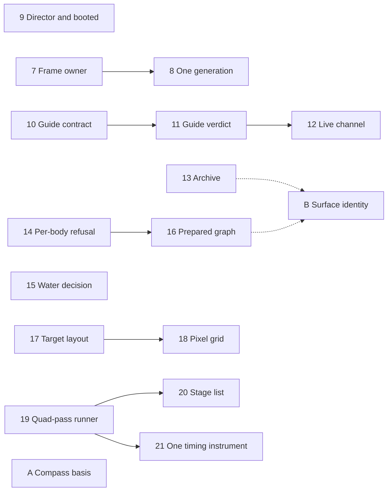

# The deepening plan: what is left, in the order it lands

This page is the architecture work still open in the tree: every deepening a
review has found that has not landed, written as one pull request each and
numbered in the order they are worth landing. Each section says what it builds
on and what it unblocks, the friction and the evidence for it, the shape the
change takes, the decisions the pull request has to make, and the gate that
closes it. A pull request that lands takes its section with it — the decision
moves to an ADR or the build log — and the numbers of the rest do not change,
so "builds on 7" keeps meaning the same thing.

The vocabulary is the design skill's: a **module** has an interface and an
implementation; it is **deep** when a small interface hides a lot of behavior;
a **seam** is where the interface lives, an **adapter** is what satisfies it
there, and one adapter is a hypothetical seam where two make a real one. Depth
buys callers **leverage** and maintainers **locality**. The deletion test —
does deleting the module concentrate complexity, or just move it — is what
separates a candidate from a pass-through.

Every figure and line reference below is read from the tree at `96bdc2fd`, and
nothing was run unless the section says so. Line numbers drift; the symbol
beside each one is the reference.

---

## In the tree

The deepenings already landed, each carrying its reasoning in its own file:

| Landed                                                       | Where                                                                                                           |
| ------------------------------------------------------------ | --------------------------------------------------------------------------------------------------------------- |
| The band stack's composition is one description              | [`packages/universe/src/bandStack.ts`](../../packages/universe/src/bandStack.ts), ADR-0023 § Consequences       |
| A mesh that wears the ground is dressed in one place         | [`apps/game/src/render/groundWear.ts`](../../apps/game/src/render/groundWear.ts), `render/wear.ts`              |
| The harness is built over one host                           | `Host` and `renderHost` in [`packages/devtools/src/harness.ts`](../../packages/devtools/src/harness.ts)         |
| The preference registry owns every knob the frame loop reads | [`apps/game/src/state/engineKnobs.ts`](../../apps/game/src/state/engineKnobs.ts)                                |
| The entity store hands out its read half                     | `EntityView` in [`packages/simulation/src/entity.ts`](../../packages/simulation/src/entity.ts), `spawnShip`     |
| The heightfield request carries the surface                  | `HeightfieldSource.submit(surface, request)` and `WireSurface` in `packages/workers/src/tasks.ts`, ADR-0023 § 3 |
| A body's visual residency is a policy that runs in Node      | [`apps/game/src/scene/bodyResidency.ts`](../../apps/game/src/scene/bodyResidency.ts) and its test               |
| On foot is a session verb                                    | [`packages/devtools/src/onFoot.ts`](../../packages/devtools/src/onFoot.ts), ADR-0047                            |
| The flying verbs are a module                                | [`packages/devtools/src/maneuvers.ts`](../../packages/devtools/src/maneuvers.ts) and its test                   |
| Time has one writer                                          | [`apps/game/src/hud/time.ts`](../../apps/game/src/hud/time.ts) and its test                                     |
| The ground under a walker is one module                      | [`packages/rendering/src/ground.ts`](../../packages/rendering/src/ground.ts), `supportUnder`, rule 53           |
| The walker's presentation is a function                      | [`apps/game/src/engine/onFootPresentation.ts`](../../apps/game/src/engine/onFootPresentation.ts) and its test   |
| A body's uniforms are a pure mapping                         | [`apps/game/src/render/bodyUniforms.ts`](../../apps/game/src/render/bodyUniforms.ts) and its test               |

---

## The order

| #   | Pull request                                                                                                                                           | Track                    | Builds on | Strength        |
| --- | ------------------------------------------------------------------------------------------------------------------------------------------------------ | ------------------------ | --------- | --------------- |
| 7   | [The frame's owner is named once](#7-the-frames-owner-is-named-once)                                                                                   | The walker and the frame | —         | Strong          |
| 8   | [The engine's derived state keys on one generation](#8-the-engines-derived-state-keys-on-one-generation)                                               | The walker and the frame | 7         | Strong          |
| 9   | [The director is a sub-object, and the driver asks whether the app booted](#9-the-director-is-a-sub-object-and-the-driver-asks-whether-the-app-booted) | The harness              | —         | Strong          |
| 10  | [The guide's wire contract lives in `packages/protocol`](#10-the-guides-wire-contract-lives-in-packagesprotocol)                                       | The guide                | —         | Strong          |
| 11  | [One owner for the guide verdict](#11-one-owner-for-the-guide-verdict)                                                                                 | The guide                | 10        | Strong          |
| 12  | [The Live channel speaks in verbs](#12-the-live-channel-speaks-in-verbs)                                                                               | The guide                | 11        | Worth exploring |
| 13  | [The heightfield archive is one object](#13-the-heightfield-archive-is-one-object)                                                                     | The terrain              | —         | Strong          |
| 14  | [A body the kernel cannot pack goes to the pool alone](#14-a-body-the-kernel-cannot-pack-goes-to-the-pool-alone)                                       | The terrain              | —         | Strong          |
| 15  | [One water decision per patch](#15-one-water-decision-per-patch)                                                                                       | The terrain              | —         | Worth exploring |
| 16  | [The drainage graph is prepared off the draw thread](#16-the-drainage-graph-is-prepared-off-the-draw-thread)                                           | The terrain              | 14        | Worth exploring |
| 17  | [The scene target's layout is one table](#17-the-scene-targets-layout-is-one-table)                                                                    | The picture              | —         | Strong          |
| 18  | [The sensor publishes the frame's pixel grid](#18-the-sensor-publishes-the-frames-pixel-grid)                                                          | The picture              | 17        | Worth exploring |
| 19  | [One quad-pass runner](#19-one-quad-pass-runner)                                                                                                       | The picture              | —         | Strong          |
| 20  | [The optical chain is a list of stages](#20-the-optical-chain-is-a-list-of-stages)                                                                     | The picture              | 19        | Worth exploring |
| 21  | [GPU timing is one instrument](#21-gpu-timing-is-one-instrument)                                                                                       | The picture              | 19        | Worth exploring |
| A   | [One compass basis](#a-one-compass-basis)                                                                                                              | Optional                 | —         | Speculative     |
| B   | [Surface identity is stated once](#b-surface-identity-is-stated-once)                                                                                  | Optional                 | 13, 16    | Speculative     |

**Every pull request builds only on ones numbered before it, and within a track
the numbering is the order to take them in. Across tracks the only edges are
the two optional items.** So the tracks fan out across worktrees, and
the numbering is the order for one pair of hands. Where a pull request builds
on nothing and still has a place in the order, the place is about collision,
and its section says so. Three files are edited by more than one pull request,
and the order is what keeps them apart:

- `apps/game/src/engine/GameEngine.ts` — the frame's owner and the derived
  state in 7 and 8, and the archive's wiring in 13. Different regions of it: a rebase, not
  a design dependency.
- `apps/game/src/render/sensor.ts` — 17 through 21, in that order.
- `apps/game/src/render/terrainProducer.ts` — 13, 14 and 16.

**Start with 7.** The walker's arm of `#step` is one call and Bodies' uniforms
are a mapping, so what is left of the track is the frame around them: 7 names
the frame's owner once.

---

## 7. The frame's owner is named once

**Track:** the walker and the frame · **Strong** · in-process

**Builds on:** nothing left open. Bodies' consumer is the build-ahead in the
frame closure, beside `bodyUniforms`'s caller. The walker's arm is one call,
`presentOnFoot`, and `OnFoot.ship()` already answers "the player's ship" on
foot. **Unblocks:** 8.

**Files.** `apps/game/src/engine/GameEngine.ts` (`#step`: the `eye`,
`#presentedPose`, the `buildScene` eye argument at `:1662–1664`, the
camera-less frame at `:1503–1509`, the no-player return at `:1643`),
`apps/game/src/scene/CameraRig.tsx` (`:89`), `scene/Bodies.tsx`,
`scene/ShipModel.tsx`, `scene/SunFlare.tsx`, `scene/ThrusterFx.tsx`,
`engine/engineStore.ts`, `hud/CutsceneOverlay.tsx`, `hud/NavBall.tsx`,
`packages/rendering/src/scene.ts` (`buildScene`'s `cameraEntity`).

**The friction.**

- **Four arms, and their order is written four times.** Cutscene, observatory,
  walker and ship, in the precedence ADR-0047 keeps. `#step` spells it out
  three times — the eye, `#presentedPose`, the `buildScene` argument — and
  `CameraRig` a fourth, as
  `cinematic ?? engine.observer ?? engine.characterCamera`.
- **Six consumers re-derive ownership** from `engine.cinematic === null`:
  `Bodies`, `ShipModel`, `SunFlare`, `ThrusterFx`, `engineStore` and
  `CutsceneOverlay`.
- **A frame no arm owns clears two of three eyes.** It publishes `cinematic`
  and `observer` as null and leaves `characterCamera`, which `CameraRig` reads
  as its third fallback — the stale-eye failure the comment beside the clear
  names. Not reproduced.
- **"The player's ship" has two answers.** `ShipModel` uses `character.ship`
  on foot; `ThrusterFx` and `NavBall` use `isCamera`, which on foot is the
  walker.
- **The scene needs an entity it does not use.** `buildScene` requires a camera
  entity by invariant, though the arms resolve an eye, so `#step` returns
  before the scene when there is no player and a playerless observatory frame
  draws a stale one.

**The shape.** `#step` resolves one owner per frame — the arm, its pose and the
player's ship — and publishes it. `buildScene` takes the owner's eye, with the
entity optional. `CameraRig` and the six consumers switch on the arm, and a
frame nobody owns clears every eye.
[ADR-0010](../../docs/adr/0010-cinematic-director.md) chose the null check and
ADR-0047 fixes the precedence; this states the same precedence in one place.

**Gate.**

- `cinematic === null` appears only in `GameEngine.ts`, and the precedence is
  written once.
- A playerless observatory frame produces a scene (`gameEngine.test.ts`).
- A camera-less frame leaves every published eye null.
- With a walker beside a landed ship, `ShipModel`, `ThrusterFx` and `NavBall`
  name the same ship.

---

## 8. The engine's derived state keys on one generation

**Track:** the walker and the frame · **Strong** · in-process

**Builds on:** 7, whose `buildScene` already takes an eye. **Unblocks:**
nothing.

**Files.** `apps/game/src/engine/GameEngine.ts` — the starfield survey
(`#maybeSurveyStars`, `#starFieldWorld`, the sweep), the orbit-trace cache
(`#maybeTraceOrbits`) and `#invalidateDerived`;
`apps/game/src/scene/Starfield.tsx` and `OrbitTraces.tsx`, one consumer each;
`packages/devtools/src/session.ts` (`onWorldReplaced`).

**The friction.** `#invalidateDerived` clears seventeen fields by hand and bumps
a counter beside them. Its own comment says why the list is one method: split
across `replaceWorld` and `load`, the starfield survives a jump of four light
years. The orbit-trace cache keys on `#starFieldWorld`, a counter named for the
starfield. The survey and the cache are private methods of a 1,995-line class
with one consumer apiece, so neither can be tested alone.

**The shape.** Two modules with one consumer each: `engine/starSurvey.ts`,
whose interface is `update(generation, eye)` → `StarField` with the hysteresis
and the in-flight-world guard inside, and `engine/orbitTraces.ts`, keyed on the
generation and the scope. The engine names the world generation once, bumped
where the world is replaced, and hands it to both; `#invalidateDerived` becomes
the bump and the `reset()` calls. `player()` has no caller outside the engine
but the tests, which can read the session, so it goes. `pool()` stays until `scene/Bodies.tsx` and
`render/preload.ts` read the session for it.

**Gate.** The survey and the cache get unit tests over a fake pool and a fake
generation. A test replaces the world and asserts every derived field cold —
all of them, counted, so the count is the gate — and the starfield does not
survive the four-light-year jump the comment names. `pnpm knip` is clean.

**Go/no-go.** If an entry keys on something the generation cannot see, the
list keeps that entry and the test names it. `reset()` writes no canonical
state — the flight grant is the session's `replaceWorld`, and the held keys the
game's `load` — so this is the pull request that finds out whether any entry
still keys on something the generation cannot see.

---

## 9. The director is a sub-object, and the driver asks whether the app booted

**Track:** the harness · **Strong** · in-process

**Builds on:** nothing left open — exposing a sub-object is the move the
harness makes for `OnFoot` and `Maneuvers`. **Unblocks:** nothing.

**Files.** `packages/devtools/src/harness.ts` (eight director forwards;
`new CutsceneDirector(host, CUTSCENES)` at `:555`),
`apps/game/src/engine/GameEngine.ts` (the eight `CutsceneHost` closures),
`apps/game/src/cinema/session.ts` (the interface at `:50`, the playhead's `mine`
guard at `:157`), `packages/devtools/src/cutscenes/index.ts`,
`scripts/drive.mjs` (`:597`, `:661`).

**The friction.**

- **The director is reached through three seams of the same eight verbs:**
  eight harness forwards, eight `CutsceneHost` closures, and the playhead's
  `mine` guard defending against the console it sits on. The script registry is
  `CUTSCENES`, a module constant the harness constructor imports, so no test
  can hand the director a script of its own. The director also calls
  `host.render.declareCut()`.
- **The driver holds two app facts as strings.** Readiness is
  `window.engine.gl`, and the boot cover is the selector
  `.hud-bleed.z-50.bg-black`. A rename costs twelve silent seconds on a cold
  boot.

**The shape.** The director is exposed as `ir.cutscene`, the way
`ir.observatory` is; `CutsceneHost` takes it; the scripts are a session option.
`ir.status()` gains a `booted` answer from the presentation host, which has
`firstLight`'s phase, and the driver reads it the way `--settle` already reads
`ir.settled()`.

**Gate.** A cutscene test drives a fake script through a session option.
`tngIntro` plays to the same beats. Neither string appears in
`scripts/drive.mjs`, and a cold `--status` boot reports ready no later than it
does today — measured, not assumed.

---

## 10. The guide's wire contract lives in `packages/protocol`

**Track:** the guide · **Strong** · ports and adapters (the Worker is remote
and owned)

**Builds on:** nothing. **Unblocks:** 11.

**Files.** `packages/protocol/src/net.ts` (`ACCOUNT_PATH`,
`decodeAccountStatus`, `askServer` — the pattern to follow),
`apps/server/src/tour/routes.ts`, `apps/server/src/tour/openaiLive.ts`,
`apps/server/src/routes.ts`, `apps/game/src/tour/capabilities.ts`,
`apps/game/src/tour/access.ts`, `apps/game/src/tour/runtime.ts`,
`apps/game/src/tour/GuideControls.tsx`, `apps/game/src/tour/scene.ts`
(`openingLine`), and the three tests that build the wire shape:
`apps/server/src/tour/routes.test.ts`, `apps/game/src/tour/capabilities.test.ts`,
`apps/game/src/tour/runtime.test.ts`.

**The friction.**

- `net.ts` says paths live in one place, and `/api/tour/capabilities` is written
  in `routes.ts`, `runtime.ts` and `access.ts`.
- The capabilities answer is an object literal on the Worker and a hand-written
  reader in the game. The Worker sends `voices` from `GUIDE_VOICES`; the game
  reads `readonly string[]`.
- The session request and response are checked by hand on each side.
- **The limits are written twice on the Worker, in two units.** The SDP bound is
  `65_536` in `routes.ts` and `64 * 1024` in `openaiLive.ts`. The scene bound
  is 1,500 UTF-16 units in `routes.ts` (`boundedString` compares `.length`) and
  1,500 encoded bytes in `openaiLive.ts`. `openingLine`, which writes the scene,
  knows neither.
- "Sign in to use the guide." and "This account does not have the guide." are
  each written in `routes.ts`, `runtime.ts` and `GuideControls.tsx`.
- Three tests each build their own wire shape, so renaming `authorized` on the
  Worker fails none of them.

**The shape.** `packages/protocol` holds the guide's paths; a verdict decoder —
granted with its voices, or refused with a reason code — and a table from each
reason to its sentence; and the session request and response, with their limits
in one unit, bytes. The Worker's answers `satisfies` those types; the game
decodes through the same decoders with an injected fetcher. Nothing
vendor-specific enters the package (rule 20), consistent with
[ADR-0042](../../docs/adr/0042-the-guide-speaks-in-one-voice.md) and
[ADR-0048](../../docs/adr/0048-accounts-are-clerks-and-the-worker-decides-who-is-asking.md).

**Gate.**

- The path and each refusal sentence are written once.
- `routes.test.ts` decodes its own answers with the protocol decoder, which is
  the contract test across the network.
- A test holds `openingLine`'s longest output under the scene limit.
- `capabilities.test.ts` moves into `packages/protocol`, and `runtime.test.ts`'s
  fake Worker is built from the protocol types.

---

## 11. One owner for the guide verdict

**Track:** the guide · **Strong** in the game, **worth exploring** on the
Worker · in-process

**Builds on:** 10 — the verdict is read through its decoder.
**Unblocks:** 12.

**Files.** `apps/game/src/tour/access.ts`, `apps/game/src/tour/runtime.ts`
(`inspect`, `adopt`, `:214–265`), `apps/game/src/planetarium/PlanetariumMode.tsx`
(`:263–274`), `apps/game/src/planetarium/registry.tsx` (`:132`),
`apps/game/src/tour/GuidePanel.tsx`, `apps/game/src/tour/GuideControls.tsx`,
`apps/game/src/tour/guide.ts`; on the Worker, `apps/server/src/tour/routes.ts`,
`apps/server/src/tour/access.ts`, `apps/server/src/account.ts`.

**The friction.**

- **The game holds the verdict twice:** the access hook's copy and the runtime's
  snapshot. `inspect()` and `adopt()`, about fifty lines, keep the two in step,
  including a read a newer one replaced.
- `grantsGuide` is evaluated twice, in `PlanetariumMode` and in the registry.
- **The harness cannot see a refusal.** With no runtime loaded, `ir.guideStatus`
  reports `available: true, state: 'idle'`, so a visitor without the grant reads
  as available.
- Two behaviors have no test: the per-user guard that discards an answer for a
  previous account, and ending a live session when the grant disappears.
- The Worker decides "configured" in three places: `routes.ts`,
  `tour/access.ts` and `account.ts`.

**The shape.** In the game, one verdict per mode, keyed on the user and created
beside `GuideLifetime`. It asks through 10's decoder and answers in one of
three states: checking, granted with voices, or refused with a reason. The
registry, the end-on-loss effect, the controls, `runtime.start` (through
`GuideHost`) and `ir.guideStatus` read it, and the runtime loses its
`capabilities`, `adopt` and `inspect`. On the Worker,
`guideAccess(request, env)` returns the same union with "not configured" as one
of the reasons, and the route maps each reason to a status code. The Worker half can be a pull
request of its own.

**Gate.** `runtime.ts` has no `inspect` or `adopt`, and `grantsGuide` is called
once. New cases: an account switch discards the old answer; losing the grant
ends a live runtime; `ir.guideStatus` reports a refusal. `routes.test.ts` stops
mocking `access.ts` for the configuration cases.

---

## 12. The Live channel speaks in verbs

**Track:** the guide · **Worth exploring** · true external (the provider),
mocked at the adapter

**Builds on:** 11 — the runtime has lost the verdict, and what is left is the
channel and the lifecycle. **Unblocks:** nothing.

**Files.** `apps/game/src/tour/runtime.ts` (`send`, pause and resume, the
status line, the list of moves at `:527–531`), `apps/game/src/tour/loop.ts`
(`send` at `:39`), `apps/game/src/tour/media.ts` (`LiveConnection`'s allow
list), and `runtime.test.ts`, `loop.test.ts`, `media.test.ts`.

**The friction.**

- **Provider events are sent by name through an untyped
  `send(event: Record<string, unknown>)`** — eight literals in `runtime.ts`
  alone. The allow list is enforced only inside `LiveConnection`, and both test
  fakes accept any event, so a misspelled event passes `tsc` and
  `runtime.test.ts` and then fails as `event_not_allowed` in a live, billed
  session.
- Pause and resume are each four calls across two interfaces.
- Each test file rebuilds the provider's event envelope.
- **State is held as display text.** `snapshot.status === 'You have the camera'`
  is read back as state, and the diagnostics' `state` is the lowercased label,
  so a wording change changes what the harness reports.
- **Which tools count as moves is a third classification**, beside
  `GUIDE_CAMERA_TOOLS` and `GuideArrival['tool']`, and whether `adjust_view` or
  `set_time` cancels a linger is stated nowhere.

**The shape.** A channel adapter owns the provider's vocabulary and offers
verbs — instruct, think, comment, mute input, close — with `send` typed on
`GuideClientEvent`. One shared in-memory fake enforces the allow list and emits
the event shapes recorded in ADR-0042's probe sessions. The session lifecycle
is a discriminated union, and the status line is derived from it. Each tool's
output states its effect, so the runtime stops matching on tool names. The seam
already has two adapters — `media.ts` and the fakes — so it is real.

**Gate.** No provider event literal outside the adapter. The fake refuses an
event off the allow list, and a test proves it. The diagnostics' state survives
a label change. The move classification is written once.

---

## 13. The heightfield archive is one object

**Track:** the terrain · **Strong** · ports and adapters (IndexedDB and SQLite
are the two real adapters)

**Builds on:** nothing. **Unblocks:** [B](#b-surface-identity-is-stated-once).

**Files.** `packages/workers/src/heightfieldCache.ts`
(`HEIGHTFIELD_CACHE_REVISION`, `HEIGHTFIELD_CACHE_VERSION`, the module-level
`WeakMap` at `:204`), `apps/game/src/engine/GameEngine.ts` (the cache wiring at
`:1021–1033`; `#archive` and the `'terrain-tsl@1'` namespace at `:1115–1156`),
`apps/headless/src/main.ts` (`:150–164`),
`apps/game/src/render/terrainProducer.ts`, `.github/workflows/check.yml` (the
`.data/heightfields` cache), `scripts/terrainArchive.mjs`.

**The friction.**

- **Two adapters share hidden state.** The CPU and GPU cache adapters share the
  clear epoch, the counters and the pending writes through a module-level
  `WeakMap<HeightfieldStore, CacheState>`. `GameEngine` carries "clear through
  an adapter, never the store" as a comment and an `#archive` getter that picks
  either one.
- **A tile's identity rests on four versions in three packages:**
  `HEIGHTFIELD_CACHE_REVISION`, bumped by hand; `TERRAIN_ALGORITHM.version`;
  `generateHeightfieldTask.version`; and the GPU namespace `'terrain-tsl@1'`, a
  string literal in the engine. The `'cpu'` namespace is written in
  `GameEngine.ts`, in `apps/headless/src/main.ts` and in a test.
- **Nothing detects a missed revision.**
  [ADR-0023](../../docs/adr/0023-the-gpu-producer.md) leaves a drawn-tail change
  unversioned because the tail is not canon, and CI restores
  `.data/heightfields` keyed on the version. A change to the tile arithmetic
  that no version covers runs the slow descent suite on stale tiles, and it
  passes.
- `scripts/terrainArchive.mjs`'s header prints version `1-5-3`; the task is at
  version 7.

**The shape.** An archive built over a store owns the epoch, the pending
writes, the counters, `flush`, `clear`, `close` and `stats`. `archive.wrap(source)`
reads a revision each source declares next to its own arithmetic — the pool's
task, and the GPU kernel's module. A fingerprint gate hashes a few CPU tiles
from a dry body and a generated wet body, pinned beside the version, and its
failure message says to spend the revision. The GPU revision stays manual,
because GPU output varies by adapter. `close()` flushes, which ends the
unflushed close [terrain § 2](terrain.md#2-open-work) records in the slow
descent suite; the archive's write lock and the cross-app import stay there.

**Gate.**

- No module-level map of cache state remains.
  `heightfieldCache.test.ts`'s shared-state case becomes a test of the
  archive.
- The engine's clear and stats path has a test over a fake store.
- The fingerprint test exists, and fails on a one-ulp change to the CPU field,
  demonstrated against a scratch copy rather than a checkout of the tracked
  file.
- `'terrain-tsl@1'` and `'cpu'` are each written once.
- The slow descent suite closes through the archive.

The fingerprint is a deliberate golden vector. `micro.test.ts` avoids golden
vectors because they go stale; here going stale is the signal to spend the
revision. The pull request amends
[ADR-0045](../../docs/adr/0045-generated-terrain-is-a-disposable-cache.md),
whose manual obligation it makes mechanical.

---

## 14. A body the kernel cannot pack goes to the pool alone

**Track:** the terrain · **Strong** · in-process, with Dawn for the kernel

**Builds on:** nothing; placed after 13 because both edit `terrainProducer.ts`.
**Unblocks:** 16.

**Files.** `apps/game/src/render/terrainProducer.ts` (`pump`, `fail`),
`packages/universe/src/terrainKernel.ts` (`packDrainage`'s invariants against
`MAX_KERNEL_DRAINAGE_NODES` and `MAX_KERNEL_DRAINAGE_LISTS`).

**The friction.** A graph over either cap throws inside `packDrainage`; `pump`
catches it and calls `fail()`, which marks the producer unavailable for the
session, so every body after it goes to the pool. The kernel's own comment says
a body over the cap "fails at pack time … and the producer falls back to the
pool", which describes one body, not the session. A body the kernel cannot pack
is not a device that cannot run. [Erosion](erosion.md#4-the-defects-ranked)
defect 2's ninth binding is a device failure, and retiring the producer is
right for that one.

**The shape.** The producer tells the two apart. A body it cannot pack sends
that surface's requests to the pool and keeps the GPU for every other body; a
device or pipeline failure retires the producer, which is the right answer to a
device that cannot run.

**Gate.** A producer test with a surface whose graph exceeds the node cap: that
body's tiles come from the pool, and the next dry body's come from the GPU.

---

## 15. One water decision per patch

**Track:** the terrain · **Worth exploring** · in-process

**Builds on:** nothing. **Unblocks:** nothing.

**Files.** `apps/game/src/engine/terrainStreamer.ts` (`:1497–1503`, `:1556`),
`apps/game/src/render/orbitalBake.ts` (`:269–303`),
`packages/rendering/src/terrainPalette.ts` (`:270–285`),
`packages/universe/src/terrain.ts` (`:539–551`),
`packages/rendering/src/terrainMesh.ts` (`:439–460`).

**The friction.** Rule 53 makes "a sheet is drawn" and "this tile is the
seabed" one decision. Each of the two callers computes it as two expressions —
`seabed` on the request and `seaLevel` on the patch build — so it lives at four
sites, whose comments vouch for each other. On a mapped wet body with a graph,
such as Earth, "no sheet" is stated nowhere; it follows from the clamped ground
never falling below the water level in `terrainMesh.ts`. Nothing tests
`RenderPatch.water` ([erosion](erosion.md#4-the-defects-ranked) defect 6).

**The shape.** One pure function in `packages/rendering` returns the request
half and the build half together, and the streamer and the orbital bake call
it.

**Gate.** Erosion defect 6's fixture lands here — a lake over part of the grid
and a river across it — with one case per body class: dry, generated wet with a
graph, mapped wet, mapped dry. The erosion plan loses defect 6.

---

## 16. The drainage graph is prepared off the draw thread

**Track:** the terrain · **Worth exploring**, **measure first** ·
local-substitutable (the inline pool)

**Builds on:** 14 — a surface the kernel cannot pack is already a per-body
answer, and preparation is what gives it. **Unblocks:**
[B](#b-surface-identity-is-stated-once).

**Precondition.** [Perf](perf.md#the-first-tile-of-a-wet-body-builds-its-drainage-graph-on-the-draw-thread-unmeasured)
has the measurement this waits on. If the build lands behind the boot cover or
an arrival cut rather than in a frame a player is watching, the pull request is
the tests below and nothing moves.

**Files.** `packages/universe/src/drainage.ts` (`drainageGraph`, memoized per
thread up to `DRAINAGE_CACHE_LIMIT`, twelve), `packages/universe/src/terrainKernel.ts`
(`surfaceKernel`), `apps/game/src/render/terrainProducer.ts` (`pump`),
`apps/game/src/engine/scatterField.ts`, `apps/game/src/engine/terrainStreamer.ts`
(the detail floor's off-thread protocol, `:1422–1471`).

**The friction.** Nothing says whether a body's graph is ready; each thread
builds one on first use. On the draw thread the first asker pays: the GPU
producer's `pump` calls `surfaceKernel`, which builds and packs the graph
synchronously — 50 to 110 ms a body, cold in Node
([ADR-0043](../../docs/adr/0043-the-rivers-drain.md)); the browser figure is not
measured. The streamer already runs a hand-built off-thread protocol with a
fallback for the detail floor, and none of its three failure branches has a
test.

**The shape.** Per-surface preparation: `prepare(surface)` answers ready,
pending or refused. It builds the floor, the graph and the packed kernel record
off the draw thread and transfers the typed arrays to seed the draw thread's
memo, and the producer asks it per surface.

**Gate.** A build counter shows the draw thread builds no graph during a
headless descent onto a wet body. The floor's three failure branches get tests
over the inline pool. The perf figure is re-measured at the same operating
point after.

---

## 17. The scene target's layout is one table

**Track:** the picture · **Strong** · local-substitutable (Dawn)

**Builds on:** nothing. **Unblocks:** 18, and makes
[the upscaler](the-upscaler.md#the-velocity-attachment-does-not-mask-its-overlays)'s
velocity-overlay defect one change.

**Files.** `apps/game/src/render/sensor.ts` (`declareSceneTarget` at `:106`,
the warm-up stand-in at `:198–220`, the live pass patch at `:305–354`),
`apps/game/src/render/sensorMrt.ts`, `apps/game/src/render/warmup.ts`
(`:171–194`), `apps/game/src/render/createRenderer.ts` (`:250–255`), and the GPU
tests that declare their own targets: `cameraSensor`, `sensor`, `galaxyVolume`,
`galaxyVolumeCache`, `galaxyDaylight`, `optics`, `sensorMotion`, `upscale` and
`warmup`, plus `radianceReactivity`, which builds one by hand.

**The friction.**

- **Each attachment's name, format and blend is written three times:** the
  warm-up stand-in sets the count, the names and the formats; `createSensor`
  sets the formats again on the live pass's textures; `sensorMrt` sets the names
  and the blend modes. Production builds five — `output`, `motion`,
  `meterMask`, `velocity`, `reactive`.
- **The layout is ambient.** Only `createRenderer` declares `optics: true`, and
  the sensor reads the shape from a module-level map keyed on the renderer, so
  the GPU suite declares its own: eighteen `declareSceneTarget` calls across
  nine files. `upscale.gpu.test.ts` ties `optics` to whether a frame callback was
  passed, which production never does, and `radianceReactivity.gpu.test.ts`
  builds its target by hand.

**The shape.** A pure layout derived from the resolved picture and the backend
— rows of name, format and blend — builds the stand-in, the live pass, the MRT
node and the byte count, and `createSensor` takes the layout as an argument
instead of reading the map. [ADR-0044](../../docs/adr/0044-the-sensor-reconstructs-the-display.md)
already says `declareSceneTarget` carries the samples, formats and layout to
both the stand-in and the live pass; this makes it one table they are built
from.

**Gate.** A Node test over the rows: an attachment whose blend reads alpha has
four channels, the constraint Dawn enforces and the upscaler plan names. The GPU
tests take production's layout. No module-level renderer map remains. The
velocity-overlay fix, whichever candidate the upscaler plan picks, is then one
row.

---

## 18. The sensor publishes the frame's pixel grid

**Track:** the picture · **Worth exploring**, **measure first** · in-process

**Builds on:** 17 — the layout and the grid are derived from the same resolved
picture. **Unblocks:** nothing.

**Files.** `apps/game/src/render/sensor.ts` (`:322`),
`apps/game/src/render/upscale.ts` (`:192`), `apps/game/src/render/picture.ts`
(`pictureDimensions`), `apps/game/src/scene/Sensor.tsx` (`:80–84`),
`apps/game/src/render/createRenderer.ts` (`:246`),
`apps/game/src/scene/TerrainPatches.tsx` (`:140–146`),
`apps/game/src/scene/WaterPatches.tsx` (`:79–84`),
`apps/game/src/render/terrain.ts` (the detail fade, `:501–508`).

**The friction.**

- **Two formulas for the render size.** Three's pass computes `floor(w·(1/r))`
  and the upscaler `floor(w/r)`. They agree for every width from 1 to 7,999 at
  the four ratios — checked in Node — by the behavior of the floats, not by
  construction.
- The picture is resolved three times, and "does this picture upscale" is
  written twice.
- **The pixel angle may not match the grid the samples land on.** Terrain and
  water divide the display's pixel angle by the drawing buffer's height. Under a
  reduced render scale the samples land on a grid `r` times coarser than that
  angle assumes, so the detail fade may under-filter — for spatial FSR at least;
  temporal reconstruction may justify the display-rate figure. Not measured.

**The shape.** The sensor resolves the render size, the sample-grid ratio and
the upscale path once and publishes them, and the pixel-angle writers read
that. `RENDER_AA` and the screen-resolution multiplier stay where they are; see
[below](#what-the-landed-deepenings-left-deliberately).

**Precondition.** Plates at a reduced render scale, in daylight, at Sol and at a
generated world, show whether the under-filtering is visible. If it is not, the
pull request is the one formula and the one resolution, and the pixel angle
stays.

**Gate.** A Node test of the resolved grid and the per-sample angle at each
ratio. If the angle changes, plates either side at the same two operating
points.

---

## 19. One quad-pass runner

**Track:** the picture · **Strong** · local-substitutable (Dawn)

**Builds on:** nothing; placed after 17 and 18 because all three edit
`sensor.ts`. **Unblocks:** 20, 21.

**Files.** `apps/game/src/render/psf.ts`, `motion.ts`, `defocus.ts`,
`galaxySkyCache.ts`, `galaxyVolume.ts`, `galaxyTemporal.ts`,
`galaxyStructure.ts`, `passTimeline.ts` (`namePass`).

**The friction.** Seven modules save and restore the render target by hand
around their quad draws, and a missing restore leaves the picture one transfer
too dark — the defect [ADR-0029](../../docs/adr/0029-the-sensor-spine.md)
records.
Naming is uneven: `defocus` calls `namePass`, `psf` names its textures and
materials, `motion` names only its materials. Read, not run: `motion`'s two tile
passes are the same size, so `ir.passes` would label both "target W×H" and
merge them into one row.

**The shape.** One runner owns the resize, the restore in `finally`, and the
pass's name, and the seven modules draw through it.

**Gate.** Outside tests and `gpuHarness.ts`, `setRenderTarget` appears in
`render/` only in the runner, the sensor and the warm-up. A GPU test over `ir.passes` finds every
optical and galaxy pass by name. `sensor.gpu.test.ts`'s restore-on-throw case is
unchanged.

---

## 20. The optical chain is a list of stages

**Track:** the picture · **Worth exploring** · local-substitutable (Dawn)

**Builds on:** 19. **Unblocks:** nothing.

**Files.** `apps/game/src/render/sensor.ts` (`:289–739`), the three optical
stages, `docs/guides/harness.md` (the pass list), `optics.gpu.test.ts`.

**The friction.** Adding an optical stage touches about nine places: in
`sensor.ts`, construction, the next stage's input, the dependency sum, warm-up,
disposal, `SensorDiagnostics` and the per-frame writes; then the timeline name,
the pass list in `harness.md`, and a GPU test.

**The shape.** A stage exposes its name, its output, a per-frame update, warm,
dispose and diagnostics, and the sensor walks the list for each. Chain wiring
and bypass become testable in Node with fake stages, and
[ADR-0031](../../docs/adr/0031-the-sensor-response.md)'s sensor already calls
`warm` and reads `outputTexture` without looking inside a pass.

**Weigh it.** Three stages make the seam real and also make the list close to a
framework. Take it with the fourth stage, not before.

**Gate.** `optics.gpu.test.ts`'s "warms every pass" becomes a check over the
list: every stage warmed, named and disposed.

---

## 21. GPU timing is one instrument

**Track:** the picture · **Worth exploring** · local-substitutable (Dawn), and
true external for `@pmndrs/upscaler`'s private timer

**Builds on:** 19 — every pass has a name to be timed under; 20 if it has
landed. **Unblocks:** nothing.

**Files.** `apps/game/src/render/gpuTiming.ts` (`RenderTimestampDrain`,
`installGpuTiming`, `beginGpuTiming`, `endGpuTiming`),
`apps/game/src/render/passTimeline.ts` (`summarize`),
`apps/game/src/render/upscale.ts` (the private `_timer` read at `:170`),
`apps/game/src/render/measure.ts`, `apps/game/src/hud/PerfPanel.tsx`,
`docs/guides/harness.md`.

**The friction.** Three timestamp mechanisms, with two meanings.

- `gpuTiming.ts` turns on three's timestamp tracking and drains it every frame.
  `measure.ts` records that three's own timestamp figure double-counts when
  there is a canvas output pass, and there always is one.
- `passTimeline` installs over the backend and cannot see the upscaler's compute
  passes; `harness.md` says they show only as gaps.
- The upscaler reads raw begin-to-end pairs from the package's private `_timer`
  and `PerfPanel` shows them. `passTimeline` argues that on Apple GPUs a raw
  pair measures latency, not cost, and ADR-0044's reconstruction figures are
  raw pairs.

**The shape.** One instrument per renderer, with an adapter that feeds the
upscaler's intervals into `summarize`, so `ir.passes` includes reconstruction.
`gpuTiming.ts` goes unless the pull request finds a reader that needs three's
own figure.

**Gate.** `summarize` over foreign intervals is tested in Node. On the GPU, a
temporal sensor's busy time is close to its wall time. ADR-0044's reconstruction
figures are re-measured through the one instrument and the ADR amended. Rule 65
binds: the instrument never changes the frame or stops it.

**Open before starting.** Whether the package's `takeSamples()` exposes raw
begin and end timestamps is not checked. Removing three's timestamps touches
what ADR-0044 promises for `ir.timing('full')`. The private field is re-tested
on every bump of the package.

---

## A. One compass basis

**Optional** · **Speculative** · in-process

**Slots in:** anywhere. `OnFoot.site` steps out at heading 0; a walker that
steps out facing the way its ship faces needs this first.

**The friction.** "East" at a surface point is derived four ways. `placementBasis`
(`packages/simulation/src/surfacePlacement.ts`) takes `cross(+Y, up)`;
`installSurfaceFrame` (`packages/universe/src/frames.ts`) takes
`(-up.z, 0, up.x)`, its negation; `spawnCharacter` re-derives the basis in
another closed form; `OnFoot.site` computes a third; the camera's
tests use `localTriad`. Nothing is wrong today, because every heading derived
this way is 0. It is a trap for the first heading taken from a landed ship.

**The shape.** `compassBasis(latitude, longitude, heading)` in
`packages/universe`, read by all four.

---

## B. Surface identity is stated once

**Optional** · **Speculative** · in-process

**Builds on:** 13 and 16, whose keys it would replace.

**The friction.** Four keys answer "which surface is this": the drainage memo's,
the survey's, the archive's and the sketch's. The drainage and survey keys list
the five `SurfaceParameters` fields by hand plus `JSON.stringify(grammar)`,
which turns NaN and ±∞ into `null` — the archive module's own comment says so —
so distinct surfaces can share a key. The complete serializer, `stable()`, is in
`packages/workers`, out of `packages/universe`'s reach by layer. `sketch.ts`'s
comment names the collision a hand-listed key produces (the `air` field).
The DEM work in [terrain § 1](terrain.md#1-scope) adds a surface input.

**The shape.** `surfaceIdentity(surface)` in `packages/universe`, memoized per
object; the drainage, survey and archive keys read it, and the sketch keeps its
deliberately narrower key. One fast-check property — perturbing any field moves
the identity — replaces the hand-written key cases in
`heightfieldCache.test.ts`.

---

## What the landed deepenings left, deliberately

- **The band stack's bodies are still two.** The kernel does not walk
  `BAND_STACK`; it reads its gates from it. A kernel that walked the table would
  be the scalar mirror ADR-0023 refuses, one level up, and the tolerance test is
  left holding exactly the arithmetic only it can hold.
- **The world-replaced rule is still six checks.** The director's identity
  checks, the observatory's guards and the engine's derived-state list each
  answer a different consequence of the same event, and each is correct
  locally. The session's `onWorldReplaced` option is the engine's subscription;
  letting the director and the observatory register on it instead of checking
  is a separate design, built on the generation 8 names.
- **`RENDER_HDR` and `RENDER_AA` stay in `App`.** Both are facts about the
  renderer it builds — a constructor argument and the drawing buffer's ratio —
  and the canvas key reads them. `RENDER_AA` is also bound by the registry, for
  the supersample factor the terrain predicate divides back out; 18 reads that
  and does not move it.
- **The streamer still caches the palette for the renderer.** `TerrainState`
  carries `palette`, `datumRadius`, `orientation`, `center` and `lens` so the
  renderer has them in the frame the drawn set is empty. Small, and its home is
  `TerrainPatches` reading the body.
- **The Saturn frame-spike figure is not re-measured:** worst main-thread frame
  2.3 ms across a warm Saturn approach, zero over 8 ms. `ir.profile` over a
  Saturn approach with `?presentation=occluded` reads it, and the caveats in
  [perf](perf.md) apply.

---

## Judged deep, and left alone

Each was walked and found deep enough that lifting anything out would move
complexity rather than concentrate it.

- **`apps/server/src/account.ts`** — `verifySession`, `identify` and
  `privateMetadata` over key-set freshness, the abandoned fetch and the grant's
  one-minute hold. Clerk is imported there and under `apps/game/src/account/`
  only, and the tests sign real RS256 tokens (`testTokens.ts`).
- **`GuideLifetime` and `mountGuide`** — a small interface, with the StrictMode
  and late-import cases tested; `GuideHost` and `GuideLoop`'s channel already
  have in-memory implementations, so the tool loop is tested without a
  provider.
- **The dock's `suppressed` flag** — generic; only the registry knows about the
  guide.
- **`stepCharacter` behind `CharacterGround`** — deep, with two real adapters,
  the world and the motion tests' fakes. The motor stays one module.
- **The relief table and `surfaceSupportRadius`'s two-stage miss** — pure and
  well placed; 4 adds only the GLB cross-check.
- **`CharacterInput` and `PointerLock`** — small, and each holds real behavior:
  the held set, the double tap, lock ownership.
- **`render/rendererLifetime.ts`** — the teardown order is the module, its
  mechanisms are handed in, and seven Node tests hold the ordering.
- **`passTimeline.summarize`** — pure, and tested against stale query slots and
  overlapping passes.
- **The sensor's state restore in `finally`** — `sensor.gpu.test.ts` holds it
  with a real throw.
- **The `Heightfields` router** — three adapters (pool, GPU, the cache) behind
  a small interface, with direct tests; the streamer never sees the cache.
- **`terrainStreamer.ts`'s selection, budgets and epochs** — deep where it
  matters and driven through `update()` and `summary()`. Its one drainage
  coupling is a boolean.
- **CPU/GPU parity for the drainage cut** — held at one seam: `uploadSurface`
  feeds the producer and both tolerance tests, and both sides read
  `DRAINAGE_SHAPE`.

---

## Settled, not reopened

Named here so a later review does not relitigate them; each has a home that
carries the argument.

- **Per-route Open Graph at request time** — settled by prerendering: Astro
  renders every public route's head at build time through
  `src/documentHead.ts`, and [`docs/hosting.md`](../../docs/hosting.md) names
  request-time rendering as an adapter choice nothing has configured.
- **Generating the document** — there is no `index.html` to generate:
  `src/documentHead.ts` renders the head and `scripts/brand/checkHead.mjs`
  gates it without a build. The brand assets are the one generated set, and
  [`scripts/brand/build.mjs`](../../scripts/brand/build.mjs) carries the
  reasoning.
- **Anything multiplayer** —
  [ADR-0008](../../docs/adr/0008-multiplayer-partitions.md) is design-only, and
  the single `AuthorityPort` adapter cannot rot because no `if (online)` branch
  exists.
- **Wiring `World.updateInterest`** — a gameplay decision, per the build log.
- **A kernel that walks the band stack's table** — the scalar mirror
  [ADR-0023](../../docs/adr/0023-the-gpu-producer.md) refuses; the table is a
  description.
- **A whole-store write verb on the world** — the store's write half is the
  world's alone by `EntityView`; a ship that starts moving is spawned moving,
  and every later write is a verb that carries its bookkeeping.

---

## Related

- [ADR index](../../docs/adr/README.md) — the decisions each pull request sits
  under
- [Terrain](terrain.md) · [Erosion](erosion.md) — the terrain track's
  neighbors: the archive's write lock and cross-app import, defects 2, 6 and 15
- [Perf](perf.md) — the measurement 16 waits on
- [The upscaler](the-upscaler.md) — the velocity-overlay defect 17 makes one
  change
- [Harness](../../docs/guides/harness.md) — the surface 9 reshapes
