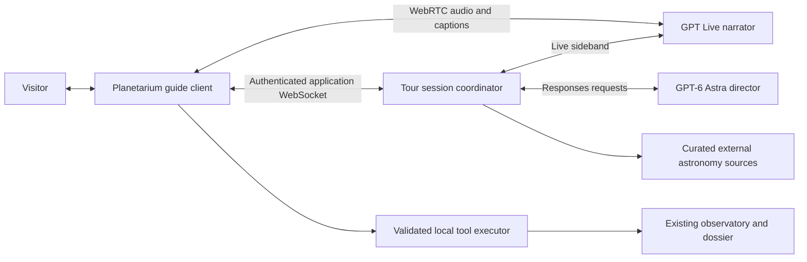
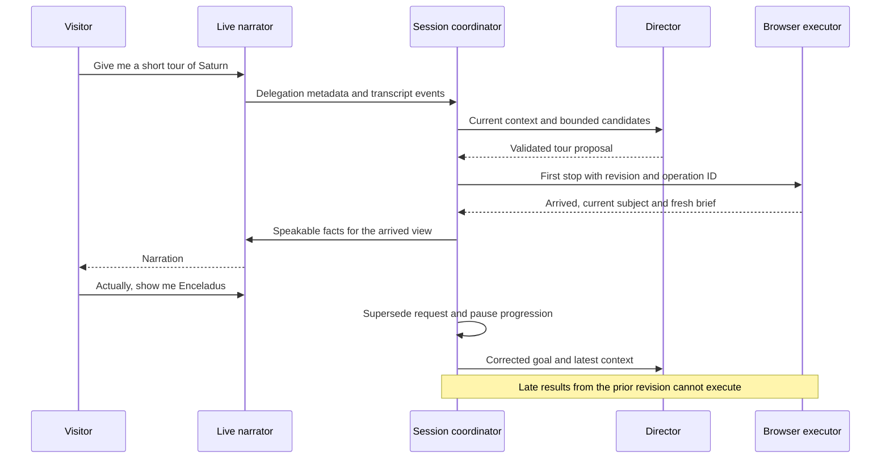

# The agentic tour guide

## Implementation status, 13 September 2026

Core code for phases 1 through 5 is implemented: the bounded contract, numeric
briefs, deterministic itineraries, observatory executor, application session
coordinator, frontier director, Guide panel, conversational Live adapter,
controlled narration, and private alpha admission. The architecture is recorded
in [ADR-0041](../../docs/adr/0041-the-guide-requests-the-view.md).

Headless and provider-fixture checks cover core behavior. The release gates
remain separate: actual provider transport and closure, listening, repeated
model evaluation, browser/device behavior, and an authenticated deployed
environment. An implemented adapter does not satisfy phase 0's spoken-reply
gate. Live uses explicit Next; automatic progression uses controlled clips and
their actual playback completion. Sol/Terra routing comparisons remain
evaluation work. Phases 6 and 7, including all image capture and visual
composition assistance, are deferred and absent from core capabilities.

Research spike and implementation plan. Researched 13 September 2026 against
repository commit `0d9262d` and the official API documentation linked below.
This is a proposed implementation. No model calls, voice auditions, latency
measurements, or account-access checks accompany this research.

Build an optional Planetarium guide with **GPT Live as the narrator and GPT-6
Astra as the director**, connected through an application-owned backend. The
director chooses subjects, builds an itinerary, and requests bounded camera
actions. The narrator talks with the visitor, explains the current view, and
handles interruptions. The existing observatory executes every movement. The core guide uses scene
metadata and registered camera controls. Image-based questions and visual
composition are optional later additions, described in phases 6 and 7.
Images are sent only for a current user question about the view or an explicit
request to improve its framing, never automatically during a tour.

Start with Astra to establish the quality baseline the feature wants. Compare
GPT-5.6 Sol and Terra on the same tasks before choosing cheaper routing. Simple
navigation, itinerary execution, fact formatting, and progress updates run in
code. A frontier model is consulted when a request needs interpretation,
selection or explanation. It does not steer continuously or run once per frame.

The first useful demonstration is a short Saturn tour: an overview, a ring
composition, and Titan. A visitor can interrupt with a question, change the
destination, take over the camera, and resume. The guide describes the view
that actually arrives and leaves the simulation untouched.

## 1. What the research establishes

GPT Live is unusually close to the requested architecture. Its conversational
voice frontend delegates work to an independently selected backend. The Live
guide recommends client delegation when the application needs control over
context, execution, or result delivery. That is the fit here: a camera command
must survive validation and return an execution receipt before it becomes a
claim about the view. [Getting started with GPT-Live](https://developers.openai.com/api/docs/guides/live),
[delegation and tools](https://developers.openai.com/api/docs/guides/live-delegation).

The model ID is `gpt-live-1`. Its published price is $0.05 per minute, billed
per second, with backend usage separate. It accepts audio and text, but no
images or video. The listed Tier 1 limit is 25 concurrent sessions; project
access and actual limits still need checking. A model card is evidence of an
API offering, not evidence that this application's project can use it.
[GPT-Live 1 model](https://developers.openai.com/api/docs/models/gpt-live-1).

The implementation uses Live's own session protocol. Realtime snippets using
`/v1/realtime/calls`, ephemeral Realtime credentials, or `call_id` are not
interchangeable with Live examples, even when the documentation presents both
on the same page. Verify the selected tab and SDK types before copying a
connection example. [WebRTC with GPT-Live](https://developers.openai.com/api/docs/guides/voice-webrtc?api=live).

### Model and voice choices

| Role or alternative             | Proposed use                  | Reason and qualification                                                                                                                               |
| ------------------------------- | ----------------------------- | ------------------------------------------------------------------------------------------------------------------------------------------------------ |
| `gpt-live-1`                    | Primary narrator              | Conversation, expressive delivery, and interruptions belong together. A listening test decides the voice and prompt.                                   |
| `gpt-6-astra` through Responses | Director baseline             | Current flagship with function calling and structured outputs. Use for a themed itinerary, a substantial question, or a changed goal.                  |
| `gpt-5.6-sol`                   | Director comparison           | A lower-priced frontier option. Promote only if it meets the same task and factuality gates.                                                           |
| `gpt-5.6-terra`                 | Routine-director comparison   | Worth testing for narrow requests after the Astra baseline exists.                                                                                     |
| `gpt-realtime-2.1`              | Voice architecture comparison | Combines voice, reasoning, and tool use. It is a fallback candidate if Live access or behavior prevents the preferred split. It needs its own adapter. |
| `eleven_v3_conversational`      | Controlled-narration audition | A text-driven expressive voice candidate for prepared stop narration. The documented Text to Dialogue WebSocket supports this model family.            |
| `gpt-4o-mini-tts`               | Controlled-narration baseline | A simpler single-provider path from validated text to audio, with delivery instructions.                                                               |

Astra and Sol both support structured output and tool calling. Their model
cards list standard input/output rates of $10/$50 and $4/$20 per million
tokens respectively. Sol's listed pricing is promotional at least through
21 November 2026. The catalog lists Terra at $2/$12. These are research-date
prices, not constants to hide in application code.
[Astra](https://developers.openai.com/api/docs/models/gpt-6-astra),
[Sol](https://developers.openai.com/api/docs/models/gpt-5.6-sol),
[model catalog](https://developers.openai.com/api/docs/models).

The Realtime comparison is based on its documented reasoning and tool support,
not a claim that it sounds better or worse than Live.
[GPT-Realtime-2.1](https://developers.openai.com/api/docs/models/gpt-realtime-2.1).
ElevenLabs' current streaming guide distinguishes the v3 Text to Dialogue
endpoint from the older Text to Speech WebSocket. Do not reject all v3 speech
on the basis of an older help page saying it is unsuitable for conversation.
The current conversational model is a separate candidate whose pronunciation,
cost, and interruption behavior still need measuring.
[Eleven v3 streaming dialogue](https://elevenlabs.io/docs/eleven-api/guides/how-to/websockets/realtime-tdd),
[OpenAI text to speech](https://developers.openai.com/api/docs/guides/text-to-speech).

No extra speech-to-text model sits in the normal Live path. A chained voice
fallback needs transcription and turn handling of its own; adding a TTS
provider does not provide a complete conversational agent.

## 2. The code that already exists

The related [companion plan](the-companion.md) develops the same two personas
around Transformers.js, browser inference, and later local speech. Its useful
ideas are the bounded tools, factual brief, itinerary data, and user takeover.
Its model loading, GPU fit, cache consent, and download phases do not belong to
this cloud implementation.

Some capability claims in that plan do not describe the current checkout.
Inspect the code before turning its phases into tickets.

| Existing implementation                                                                                                                          | How this plan uses it                                                                                                    |
| ------------------------------------------------------------------------------------------------------------------------------------------------ | ------------------------------------------------------------------------------------------------------------------------ |
| [Observatory](../../packages/devtools/src/observatory.ts)                                                                                        | `focus`, `compose`, `stand`, status, tracking, photographic time, and the existing safe framing rules.                   |
| [GameHarness](../../packages/devtools/src/harness.ts)                                                                                            | `dossier`, `sites`, `presets`, and cancelable `findWorlds`. Expose a narrow guide adapter rather than the whole harness. |
| [Dossier](../../packages/devtools/src/dossier.ts)                                                                                                | Body identity, provenance, fact groups, null values with reasons, and satellites.                                        |
| [World search UI](../../apps/game/src/planetarium/useWorldSearch.ts)                                                                             | Existing search behavior and cancellation to reuse, not a new catalog sweep.                                             |
| [Planetarium mode](../../apps/game/src/planetarium/PlanetariumMode.tsx) and [panel registry](../../apps/game/src/planetarium/registry.tsx)       | Guide admission and a panel inside the existing workspace. The mode and canvas keep their current ownership.             |
| [Presentation clock selector](../../apps/game/src/hud/time.ts)                                                                                   | Documents a trap: its live-time branch returns the simulation clock. The guide cannot call it blindly.                   |
| [Worker entry](../../apps/server/src/index.ts), [routes](../../apps/server/src/routes.ts), and [configuration](../../apps/server/wrangler.jsonc) | Same-origin API hosting, uncached responses, secret binding, and a place for the session coordinator.                    |
| [Vite configuration](../../apps/game/vite.config.ts)                                                                                             | `/api` is proxied, but WebSocket upgrade is enabled only for `/ws`. Add an explicit guide-socket proxy.                  |

There is no guide runtime, itinerary runner, model adapter, or guide UI in the
inspected source. There is also no image-capture method in `RenderHost`.
`Observatory.capture()` records framing, not pixels. The
[browser driver](../../scripts/drive.mjs) captures through Chrome's DevTools
Protocol, which cannot be the production guide's screenshot mechanism.
The [scene projection](../../apps/game/src/planetarium/project.ts),
[sensor chain](../../apps/game/src/render/sensor.ts), and
[GPU readback helper](../../apps/game/src/render/gpuHarness.ts) provide useful
building blocks. The optional final phases add the missing capture port and composition tools; neither blocks the core guide.

The server currently serves health and media and reserves
`/ws` with a 501 response. There is no implemented authentication adapter in the inspected source or
Durable Object binding to reuse merely because routes and comments reserve
them. Authentication and session coordination are implementation work.

### The invariants that govern the feature

The guide operates only in the Planetarium. It calls the observatory; it adds
no camera or lens producer. No generated script receives `window.ir`, access
to arbitrary properties, JavaScript evaluation, or renderer internals.
Canonical addressing stays with the resolver. Models select returned
candidate IDs and registered compositions, not coordinates or guessed body
ordinals. [Shell ownership](../../docs/adr/0011-application-shell-and-modes.md),
[camera and lens invariants](../../docs/agents/invariants.md#rule-31).

Every fact about placement uses `observatory.time`, the same photographic
instant that the view uses. The guide's time controls first hold that instant
with `setTime(observatory.time)`, then call `setTimeScale` or
`setTimePaused`. They never call `harness.timeWarp`, world pause/resume, or
the live branch of `presentationClock`. Returning to live view is
`setTime(null)`. [Photographic presets](../../docs/adr/0033-presets-hold-a-photographic-instant.md),
[canonical-state boundary](../../docs/agents/invariants.md#rule-37).

Provider SDKs and Cloudflare bindings stay in `apps/`. Shared wire types and
pure tour policy contain no third-party runtime dependency. Tour history and
billing records are application data, separate from simulation saves.
[Server rules](../../.claude/rules/server.md),
[package rules](../../.claude/rules/packages.md).

## 3. The visitor's experience

The Planetarium offers a closed-by-default Guide panel. Opening it offers
three starting requests: a short tour of the current system, an explanation
of the current object, or a typed request. Starting voice is a deliberate
action with a visible microphone control and an AI voice disclosure.

The guide has one audible personality. The director is backstage; visitors
do not choose between agents or hear them debating. Controls say Start tour,
Pause tour, Next, Back, Resume, End, Mute microphone, and Mute guide. Tour pause,
microphone mute, and audio mute have separate state because they do different
things. Muting the guide leaves captions available.

The narrator sounds interested in the subject: varied rhythm, clear emphasis,
room for a view to register, and precise answers to follow-up questions. Start
with a target of 20 to 40 seconds per stop and fewer words for transitions.
Avoid relentless commentary. A quiet look at the rings belongs in a tour.

The product direction is an expressive guide in this mode. Update the
Planetarium, world, and audio design pages together during implementation to
state that scope. The current [audio](../../docs/design/audio.md#voice) and
[world](../../docs/design/world.md) pages reserve voice for annunciation and
rule out a narrator. Do not claim a performed guide is merely another fixed
annunciator. This plan proposes an explicit Planetarium exception while
keeping the simulation's own audio direction separate.

Use the existing dock, action registry, keymap, focus handling, and preferences
adapter. Captions and controls occupy the HUD's content area and respect safe
areas. Each React component gets its own file. The guide does not enter the
renderer preload census or make a network request on an ordinary page visit.

## 4. Responsibilities and transport

| Owner               | Responsibilities                                                                                                                    |
| ------------------- | ----------------------------------------------------------------------------------------------------------------------------------- |
| Browser             | Microphone and audio output, captions, the current view, local execution, manual takeover, and playback evidence.                   |
| Session coordinator | Authentication, quotas, session lifetime, transcript context, request revisions, director calls, validation, and the action ledger. |
| Director            | Interpret the request, choose among available subjects and tools, draft or revise the itinerary, and select supported facts.        |
| Narrator            | Spoken conversation, pacing, clarification, and explaining current verified results. It has no direct scene authority.              |
| Pure tour policy    | State transitions, limits, reference validation, deterministic fallback itineraries, and rejection of stale work.                   |

Use one Cloudflare Durable Object per active tour session, behind the existing
Worker. This gives one owner for ordering, cancellation, and browser reconnects.
Keep a separate authenticated-user quota record so opening a second session
cannot reset the allowance. A private alpha uses an authenticated access gate;
public anonymous session creation is outside the first release.

The coordinator owns the outbound Live sideband and direct Responses requests.
The browser's application socket carries context and local action receipts.
It does not relay arbitrary OpenAI commands. Browser and backend may observe
the same Live event, but only the coordinator schedules director work.

In optional phases 6 and 7, the coordinator also handles images requested for a
user's visual question or framing request. Core tour admission, navigation,
stop arrival, and narration never trigger image capture. The optional image
path and its budgets are specified in section 17.

The sideband attaches to
`wss://api.openai.com/v1/live/sessions/{session_id}/attach`; it joins a running
session and does not send another start command. It also receives reflected
audio. Discard those payloads immediately unless an explicitly enabled
evaluation needs them. Audio is not automatically private from the backend
just because WebRTC carries the primary stream.
[Live server-side controls](https://developers.openai.com/api/docs/guides/voice-server-controls?api=live).

An outbound WebSocket prevents Durable Object hibernation while active, so
budget active duration and close idle sessions. Hibernating browser sockets
alone do not make an active Live session free. Use Web Standard connections
for this first coordinator and benchmark the deployed workerd path.
[Cloudflare WebSockets](https://developers.cloudflare.com/durable-objects/best-practices/websockets/).

If the Live SDK's WebSocket helper assumes Node APIs, use the documented HTTP
and WebSocket protocol through a small workerd adapter. Do not add a Node
server or blanket compatibility flags without first identifying the missing
capability. A Node-hosted coordinator is the fallback if the deployed adapter
fails the initial transport gate; keep the same application protocol.

## 5. Session creation, security, and closure

The following `/api/tour` routes are proposed application endpoints.

| Endpoint                            | Contract                                                                                                                                     |
| ----------------------------------- | -------------------------------------------------------------------------------------------------------------------------------------------- |
| `GET /api/tour/capabilities`        | Availability, allowed voices, admission status, duration limit, and enabled guide features. No secrets or upstream raw errors.               |
| `POST /api/tour/sessions`           | Validate the user, origin, quota reservation, SDP size, protocol version, and universe manifest. Create one session for the idempotency key. |
| `GET /api/tour/sessions/:id/events` | Authenticated WebSocket upgrade for context, typed requests, tool requests/receipts, and status. Bind to one controlling tab.                |
| `POST /api/tour/sessions/:id/close` | Idempotently revoke further work and start provider finalization. Report pending versus completed closure.                                   |

Creation sends a server-authored Live configuration with `model: gpt-live-1`,
`delegation: { type: client }`, `store: false`, the selected allowed voice,
and the narrator prompt. The Worker exchanges the browser SDP through
`POST /v1/live/sessions` and returns the required session identity and
`transport.sdp`. The browser installs listeners before negotiation and waits
for `session.started`; it does not send `session.start` over the data channel.
[Live WebRTC startup](https://developers.openai.com/api/docs/guides/voice-webrtc?api=live).

Implementation requirements:

- Keep `OPENAI_API_KEY` in Worker secrets, absent from `vars`, client build
  variables, source maps, local preferences, and responses. Separate preview
  and production projects and spending limits.
- Authorize every route and every socket message against the session owner.
  Same-origin checks complement authentication; they do not replace it. Use
  secure session cookies, CSRF protection where applicable, and exact allowed
  origins for both production hosts and explicit development origins.
- Fix provider, model, tool inventory, prompt versions, and token limits on the
  server. Accept a bounded preference such as voice choice, not arbitrary
  session configuration, URLs, tool definitions, or model IDs.
- Verify the current Live frontend-permission schema in phase 0. Restrict
  browser session mutations where supported. A sideband is not a permissions
  firewall. Regardless of upstream controls, a forged browser event cannot
  authorize backend spending beyond its lease or expand the tool inventory.
- Reserve the maximum allowed director spend before starting each call.
  Enforce per-user concurrency, per-user daily spend, global concurrency, and
  session duration. A signed session identifier without server-side accounting
  is insufficient.
- Bound inbound JSON size, SDP size, transcript history, candidate counts, and
  outstanding operations. Reject unknown fields and unsupported protocol or
  catalog/generation versions before executing a command.
- Return `Cache-Control: no-store`; verify the service worker bypasses all
  guide endpoints. Enable WebSocket upgrade for the new `/api/tour` socket
  path in development without repurposing multiplayer's reserved `/ws`.

The server attaches before admitting conversation. If early events can precede
attachment, retain a bounded browser startup buffer and reconcile it once by
event identity or transcript interval. Test that race explicitly. The interface
says Connecting until both the media connection and coordinator are ready.
If one half fails, close the other half and release the admission reservation.

On End, mode exit, or expired lease, block new work, invalidate pending local
actions, and silence playback immediately. Send `session.close`, drain to
`session.closed`, then release connections. Keep a bounded finalization timeout
and record incomplete closure separately. Cumulative `usage.seconds` values
replace earlier values; they are not summed.
[Live lifecycle and usage](https://developers.openai.com/api/docs/guides/live-conversations).

Browser unload is best effort. A server lease and Durable Object alarm perform
cleanup after browser loss. Start with a ten-minute session ceiling and a
30-second reconnect allowance, both tunable. On failed creation or uncertain
closure, reconcile the existing record before retrying. Session creation can
incur initialization charges, so automatic reconnect loops are bounded.

## 6. The shared protocol and factual context

Add a versioned guide contract to `packages/protocol`. It uses independently
declared wire types and decoders, following that package's current layer.
It cannot import `Dossier` from higher-layer `devtools` or move provider event
types into the shared package. The browser converts domain records into this
wire representation; host adapters translate provider events.

The proposed records are:

| Record           | Required content                                                                                                                                                                             |
| ---------------- | -------------------------------------------------------------------------------------------------------------------------------------------------------------------------------------------- |
| `ViewContext`    | Protocol version, catalog and generation identity, view revision, photographic time, mode, subject reference, framing ID, motion status, visible/tracked subjects, and bounded capabilities. |
| `SubjectBrief`   | Address, name, provenance, classification, selected facts with stable IDs, unknown-field reasons, source IDs, and a separate observer section.                                               |
| `TourPlan`       | Plan ID/version, user goal, duration budget, ordered stops, and the permitted source/candidate set.                                                                                          |
| `TourStop`       | Stop ID, subject reference, registered framing or survey site, teaching objective, fact IDs, and minimum viewing time.                                                                       |
| `ToolRequest`    | Session, request revision, operation ID, expected view revision, expiry, tool name, and validated arguments.                                                                                 |
| `ToolReceipt`    | Operation ID, accepted/rejected/canceled/arrived status, actual subject and view revision, photographic time, and a bounded failure reason.                                                  |
| `NarrationBrief` | Request/stop/view IDs, confirmed action outcome, selected facts, uncertainty, pronunciation hints, and one speaking objective.                                                               |

A fact has a stable ID and a source, not only a label and a formatted string.
The existing dossier does not provide that complete claim contract. Add a
guide-specific extractor with explicit quantity, unit, display wording,
speech wording, and provenance where numeric checking needs them. Derive
quantities from existing domain helpers. Do not reverse-engineer rounded
numbers by parsing dossier display strings.

Keep astronomical and observer facts separate. A body's radius is a record
fact; its apparent size, altitude, illuminated view, and whether it has arrived
are facts about this camera at this instant. The model must not turn one into
the other. Null values and their reasons survive extraction.
[The record with holes](../../docs/adr/0014-the-record-with-holes-in-it.md).

Send context at admission, meaningful selection changes, arrival, photographic
time changes, and delegation. Coalesce rapid input. Do not stream the 8 Hz
engine snapshot, the entire catalog, a canvas video, or every orbit sample.
Dynamic geometric claims are recomputed for the narration request. This
metadata is sufficient for the core guide. The optional visual path sends an
image to the director only when it helps answer the user's current visual
question or explicit composition request. Opening the guide or starting a tour
does not authorize automatic image sampling. See section 17.

Treat browser context as untrusted input at the server. Validate shapes,
allowlists, manifest identity, and bounds. A modified browser can falsify its
own view; that does not authorize an external action or a larger budget.
The first release makes no discovery claims, shared writes, or account changes
based on a local tool receipt. Server-owned curated sources remain separately
identified from client-supplied facts.

## 7. The director's bounded work

`GuideDirector` is the proposed name for the backend role. It is separate from
the existing cinematic director and never emits `CutsceneScript` code.

Use direct Responses calls in client delegation. Start with Astra at low
reasoning effort and a strict schema for the final decision. A request can
produce a clarification, an explanation brief, an itinerary, or a bounded
action sequence. The application validates that result before dispatch.
Schema compliance does not establish semantic validity; refusals and
incomplete output are separate terminal outcomes.
[Structured outputs](https://developers.openai.com/api/docs/guides/structured-outputs).

| Tool                  | Execution and limits                                                                                                                                               |
| --------------------- | ------------------------------------------------------------------------------------------------------------------------------------------------------------------ |
| `resolve_subject`     | Browser resolver returns a small candidate set with opaque selection IDs and canonical addresses. Ambiguity remains explicit.                                      |
| `read_subject`        | Read one bounded brief at the relevant photographic instant. Return missing data honestly.                                                                         |
| `find_worlds`         | Adapt existing `findWorlds`, including cancel, progress, total count, and result cap. Start with a small allowed radius; expansion requires a new bounded request. |
| `show_subject`        | Focus one returned candidate through the observatory. Receipt distinguishes accepted movement from arrival.                                                        |
| `compose_view`        | Choose from the current registered compositions and allowed presets for that subject. No arbitrary numeric camera pose.                                            |
| `stand_at_site`       | Choose a returned survey site on a suitable body. Reject gas surfaces and incompatible sites.                                                                      |
| `set_picture_time`    | Hold, pause, resume, or change the photographic instant/rate through the observatory. No simulation-clock access.                                                  |
| `read_astronomy_note` | Server lookup in the curated source collection for known observed objects and general concepts.                                                                    |

Tour start, pause, resume, next, back, and end are application commands against
the runner. The director can propose a plan or interpret a spoken command;
buttons and exact typed commands reach the runner without an LLM round trip.

A bare unambiguous object name resolves locally. A standard system tour can
use a deterministic itinerary template. Model-selected themed tours use the
same returned candidates and framing inventory. Enumerate available stops,
score/order those candidates, then validate the itinerary. The model does not
invent `s:` or `b:` addresses.

Initial execution budgets are hypotheses to test:

- At most three model rounds and six tool operations per user request.
- At most one scene-changing operation in flight, executed in order.
- At most eight stops in the first tour, with a requested duration ceiling.
- At most 8,000 input and 2,000 output tokens per director round, including
  reasoning within the provider's output accounting. Start with a 12-second
  overall deadline; tune it from actual Astra results.
- A single bounded schema-repair attempt, charged to the same limits. No
  autonomous retry loop after a refusal or timeout.

Independent reads can run concurrently inside those limits. Camera actions
cannot. The server sends a concise verified result directly to Live; it does
not pay for another model simply to turn a tool receipt into a sentence.

## 8. Delegation, corrections, and stale results

Live client delegation emits metadata identifying a delegation, rather than
the user's task text. Assemble the director request from transcript intervals,
typed input, prior task context, and the latest view. Match returned updates to
the opaque delegation ID. Use `session.thinking.append` for quiet context and
`session.commentary.append` for speakable results; include `delegation_id`,
using null for a proactive tour update. Appends are plain strings limited to
500 tokens. Keep the full structured result in the application.
[Client delegation contract](https://developers.openai.com/api/docs/guides/live-delegation).

The coordinator keeps one request revision for the current goal and a separate
view revision for presentation changes. Every async stage carries both.
Before tool execution, before committing a receipt, and before narrating a
result, compare them with current state. An obsolete result is discarded even
if aborting its network request fails.

Transcript fragments are evidence, not commands. Preserve raw deltas and their
timestamps; revisable display grouping cannot itself execute an action.
On delegation, assemble the available utterance through its timestamp and
allow a short bounded wait for late fragments. If the request remains
ambiguous, ask for clarification. Do not implement a guessed turn boundary
that moves the camera after "show me Titan... actually, Enceladus."

For a spoken interruption, pause automatic progression promptly. Distinguish
three intents in application state:

| Visitor intent                     | Result                                                                                          |
| ---------------------------------- | ----------------------------------------------------------------------------------------------- |
| A question about the view          | Hold the current stop, answer, then offer or honor resume.                                      |
| A changed destination or tour goal | Supersede the pending request, cancel local jobs, and prepare a new plan.                       |
| Stop or end                        | Revoke pending actions immediately, halt tour progression, and close voice if ending the guide. |

Speech interruption alone does not cancel director work. Conversely, a
backchannel such as "mm-hmm" does not automatically cancel it. The server owns
that distinction; the UI's explicit Stop always wins. The executor deduplicates
operations across retransmission. If the camera arrives but its receipt is
lost, query the current view and operation ledger instead of moving again.

## 9. Grounding astronomy and the narrator's voice

The narrator receives a compact prompt defining its role, cadence, interruption
behavior, and delegation conditions. Detailed workflows remain with the
director. Audition `marin`, `gleam`, `meridian`, and `vesper` with the same
material; these include documented default and additional Live voices. Voice
selection happens at session creation, so a settings change reconnects at an
explicit boundary. No preference silently restarts a speaking session.
[Live prompting](https://developers.openai.com/api/docs/guides/live-prompting),
[Live voices](https://developers.openai.com/api/docs/guides/live-conversations).

Proposed narrator direction, written for this product:

> You guide a visitor through the Planetarium. Speak with curiosity and clear
> emphasis, and leave pauses for looking. Explain one visible idea at a time.
> Use the current verified brief for facts and for what is on screen. Delegate
> requests that need a new view, a new fact, or careful reasoning. While work
> runs, avoid guessing its result. Acknowledge a correction briefly and let
> the backend resolve it. Say when a value is unknown or projected. Let the
> visitor interrupt and take control.

Keep the full prompt under a proposed 600-token budget, with short worked
examples only when evaluation shows they help. Add pronunciation hints for
Io, Enceladus, Iapetus, and astronomical units through tested context. Do not
assume Live accepts SSML, exact timing markers, or phoneme controls that the
API has not documented.

Use three sources of knowledge:

1. The application record supplies object properties and current view facts.
2. A small, cited astronomy-note collection supplies mission history and
   physical explanations for the first tour subjects. Each note records its
   source URL, retrieval date, applicable object, and whether it is timeless
   or needs refreshing. Start with primary NASA, JPL, ESA, and observatory
   sources during implementation.
3. A bounded server-side web lookup can answer an explicitly current question
   in a later phase. Search results are untrusted evidence. They cannot add
   tools, rewrite prompts, or override the app's measurements.

This release does not use model memory as the only source for a physical
quantity or mission claim. `observed` provenance does not mean every property
of a body is measured. For a projected world, the brief distinguishes an
inferred property from a confirmed observation and does not invent missions,
discoveries, or named surface features.

The director references fact IDs in its plan and explanation. Validate those
references mechanically, check allowed numerical conversions and rounding,
and reject unsupported exact claims in prepared narration. A number-pattern
test is useful but cannot prove semantic correctness. Evaluation must catch
unit swaps, wrong subjects, inappropriate certainty, and an accurate fact
applied to a projected world.

Display source cards beside the relevant explanation. Captions show what Live
actually says, derived from output transcripts. They do not display a director
draft as if the visitor heard it. Preserve interruption history and support
overlapping speaker rows without continuously reordering the transcript.

## 10. Narration timing and automatic touring

There are two delivery paths with one tour model.

**Live narration** is the preferred interactive experience. A verified
`NarrationBrief` reaches Live after arrival, and Live decides how to express
it. This creates the conversation the feature wants, including spontaneous
questions and corrections.

**Controlled narration** sends validated text to a speech API, then plays the
result through application-owned audio. It is the fallback when exact wording
or reliable end-of-stop timing matters. An audio completion signal advances
the same itinerary runner. This path also supports a listen-only tour when
microphone access is denied or unnecessary.

Live paraphrases commentary. Its transcript arrives during speech, and an
append acknowledgment is not playback completion. Monitoring transcripts
cannot guarantee that an unsupported sentence is caught before it is heard.
An application requiring approval before playback needs an audio buffer or
controlled clips and pays the latency cost.
[Live delegation](https://developers.openai.com/api/docs/guides/live-delegation),
[playback controls](https://developers.openai.com/api/docs/guides/voice-server-controls?api=live).

The first Live slice uses explicit Next. Phase 0 and the voice evaluation
determine whether a reliable automatic progression rule is available. Do not
invent a `narration.done` provider event or treat a gap in transcript fragments
as one. An experimental rule may combine the current stop revision, minimum
dwell, audio activity, output timestamps, and a silence interval, but pauses
inside a sentence must not advance the camera. If that rule fails the tests,
automatic touring uses controlled clips and Live remains the conversational
mode. Automatic touring is a release requirement, not something silently
dropped when the voice API lacks a completion event.

The pure runner has explicit states:

`idle → planning → moving → awaiting-narration → presenting → awaiting-next`

`paused`, `failed`, and `ended` are reachable from the appropriate active
states. Narration completion and minimum dwell are independent conditions.
Movement completion comes from observatory status, with a timeout and the
expected target checked. A renderer-ready signal is separate from merely
accepting focus; test cold target loading before saying "Here is Titan."

Manual drag, a user-selected preset, time scrub, or another navigation action
revokes the guide's current control and pauses progression. Guide-originated
actions carry an origin tag so they do not cancel themselves. On resume, read
the current view and decide whether to return to the stop or continue. Never
restore a stale captured view over the visitor's newer choice.

Temporary orbit/label changes use a presentation stance and release it on exit.
If the guide changes photographic time, restore it only while the guide still
owns that change. Manual time changes supersede that ownership. Dwell consumes
injected presentation deltas; it does not enter the canonical clock or hash.

For controlled clips, stopping discards queued audio and stale completion
callbacks. For Live, local audio mute provides immediate silence while the
server redirects or closes the session. Unmuting cannot replay obsolete
buffered speech. Test the recovery against what was actually played, not just
what the provider generated.

## 11. Privacy, reliability, and observability

Starting voice explains that microphone audio goes to OpenAI and that the
server processes conversation and scene context to run the guide. The optional image feature separately explains scene-image sharing before its first use. Mic status
stays visible. End releases capture. Mute microphone disables capture in the
browser as well as applying the selected upstream input policy; server-side
input mute alone does not stop local capture or reflected input audio.

Set `store: false` for Live and Responses requests. Keep session transcripts
in memory by default. Persist only short-lived operation outcomes and quota
records required for correctness. Do not put transcripts, scene images, or audio in analytics,
ordinary Worker logs, game saves, or R2. Raw audio fixtures and recordings are
explicit evaluation artifacts with their own retention choice.

Provider retention is distinct from application storage. The Live data page
states that session storage is disabled by default, stored recordings last
30 days when enabled, and Zero Data Retention is eligible but must be configured.
It also states that there is no public stored-session deletion endpoint.
Do not promise immediate provider deletion or zero retention merely because
the application sends `store: false`. Backend models and tools have separate
data controls. [OpenAI data controls](https://developers.openai.com/api/docs/guides/your-data).

Record operational metrics without conversation content: prompt/model version,
request and view revisions, delegation/operation IDs, durations, token usage,
session seconds, stop count, rejected/stale operations, disconnect reason,
and finalization completeness. Tracing is off for prompt bodies by default.
The browser's timing adapter follows the existing centralized timing rule.

| Failure                              | Expected behavior                                                                                            |
| ------------------------------------ | ------------------------------------------------------------------------------------------------------------ |
| Missing server key or model access   | Capabilities report unavailable. Manual Planetarium and deterministic local tours still work.                |
| Microphone denied                    | Typed guide remains usable; controlled voice playback is offered if enabled. No repeated permission prompt.  |
| Director timeout or malformed output | Hold the current view, show a concise failure, and allow retry or local Next. No partial plan executes.      |
| No search match                      | Report the searched scope and offer a bounded expansion. Do not invent a nearby result.                      |
| Local action fails or expires        | Send a failed receipt and narrate that outcome. Never claim arrival.                                         |
| Sideband lost                        | Pause director scheduling and scene changes. Reattach with the ledger and current view or close the session. |
| WebRTC fails                         | Stop automatic motion and offer text or controlled speech. Bound reconnect attempts.                         |
| Browser hidden or device sleeps      | Pause progression and apply the idle/lease policy. Do not keep touring unseen.                               |
| Session limit or budget reached      | Finish or stop the current bounded segment, close Live, and preserve the local itinerary for manual use.     |
| New generation/catalog version       | Reject incompatible context, refresh the source candidates, and require a fresh plan.                        |

## 12. Cost and latency budgets

Live bills active session duration, including silence and time spent waiting
on tools. A ten-minute connection therefore has a $0.50 voice component.
WebRTC creation bills 15 seconds at initialization and credits it against
duration once the session runs; do not add those seconds again to a completed
session estimate. Failed startups and reconnects need separate accounting.
[Live cost accounting](https://developers.openai.com/api/docs/guides/voice-latency-cost?api=live).

Illustrative ten-minute text-context baseline, **not a measured workload**: eight director calls,
4,000 input tokens and 1,000 output tokens per call. Output includes reasoning
tokens. Assume standard pricing, no cache benefit, no web search, and no
explicit cache-write premium. Actual service tier and cache charges belong in
the measured ledger.

| Director strategy               | Director calculation                         | Voice plus director |
| ------------------------------- | -------------------------------------------- | ------------------- |
| Eight Astra calls               | 32,000 × $10 / 1M + 8,000 × $50 / 1M = $0.72 | $1.22               |
| One Astra plan, seven Sol calls | $0.09 + 7 × $0.036 = $0.342                  | $0.842              |
| Eight Sol calls                 | 32,000 × $4 / 1M + 8,000 × $20 / 1M = $0.288 | $0.788              |
| Eight Terra calls               | 32,000 × $2 / 1M + 8,000 × $12 / 1M = $0.16  | $0.66               |

These totals exclude vision inputs and additional composition rounds, hosting, search, tax, retries, controlled speech, and any other provider. An extra provider's advertised per-minute rate may describe
speech generation rather than connected session duration; compare measured
whole-tour cost. The pricing inputs are the model cards in section 1.

For optional phases 6 and 7, budget user-requested visual assistance separately. If ten additional Astra inspections each
consume a hypothetical 2,000 billed image-input tokens, 1,000 text-input tokens,
and 500 output tokens, they add $0.55 at the listed standard rates. That makes
the all-Astra example $1.77 before hosting and other exclusions. The image
token count is a budgeting assumption, not a conversion from image dimensions;
measure it for the chosen detail setting. Reused images are charged again when
included without an applicable cache benefit. If those inspections add two
minutes of open Live time, the voice component also rises by $0.10.

The $2 allowance below is an initial private-alpha target. Optional visual
requests consume the same remaining allowance, including images, extra
reasoning, and elapsed time; they are not automatic per-stop costs.

Start the private alpha with a proposed $2 session allowance, one active guide
per user, and a configurable daily allowance. Reserve against worst-case call
limits before dispatch, rather than assuming the illustrative average. Stop
new work before the allowance is exhausted. Set a global ceiling independently
of per-user quotas. Manual Next and fact extraction need no director call;
the Live connection still costs money while open.

All latency numbers below are targets to test on the named devices and network,
not provider promises:

| Measurement                                     | Initial target                                      |
| ----------------------------------------------- | --------------------------------------------------- |
| Voice admission through first useful audio      | p95 below 5 seconds after permission                |
| Live reply with current facts already available | p95 below 1.5 seconds after a usable user utterance |
| Director decision for a simple request          | p95 below 3 seconds, separate from camera travel    |
| Themed tour plan                                | p95 below 8 seconds                                 |
| Explicit local Stop through audible silence     | p95 below 150 ms                                    |
| Spoken interruption through audible silence     | p95 below 300 ms                                    |
| Added frame cost during a steady conversation   | p95 below 1 ms on the reference desktop             |

Measure input, delegation, director start/completion, local action acceptance,
arrival, first generated audio, first played audio, and last played audio
separately. A friendly acknowledgment is not the completed answer. Compare
Astra, Sol, and Terra at the same quality threshold before changing the default.

## 13. File ownership and implementation boundaries

Paths in this table are proposed unless section 2 identifies them as existing.

| Files                                                                         | Responsibility                                                           |
| ----------------------------------------------------------------------------- | ------------------------------------------------------------------------ |
| `packages/protocol/src/tour.ts` and tests                                     | Versioned wire types, validation, size/count limits, and stable IDs.     |
| `packages/devtools/src/tour/brief.ts`                                         | Extract facts and observer context with source/provenance preservation.  |
| `packages/devtools/src/tour/itinerary.ts`                                     | Candidate enumeration, deterministic templates, and plan validation.     |
| `packages/devtools/src/tour/runner.ts`                                        | Pure transition policy with injected time and completion signals.        |
| `apps/game/src/tour/runtime.ts`                                               | Session lifetime and coordination outside React.                         |
| `apps/game/src/tour/executor.ts`                                              | Narrow observatory adapter, revisions, cancellation, and receipts.       |
| `apps/game/src/tour/liveAudio.ts`, `captions.ts`, `transport.ts`              | WebRTC, playback state, transcript assembly, and the application socket. |
| `apps/game/src/tour/GuidePanel.tsx`, `GuideControls.tsx`, `GuideCaptions.tsx` | One component per file, built from existing controls.                    |
| `apps/server/src/tour/session.ts`, `director.ts`, `policy.ts`                 | Coordinator, bounded model orchestration, and admission/spend policy.    |
| `apps/server/src/tour/openaiLive.ts`, `openaiResponses.ts`                    | Provider adapters with fakeable ports.                                   |
| `apps/server/src/tour/knowledge/`                                             | Small curated astronomy notes and source metadata.                       |
| `scripts/tour/evaluate.mjs` and fixtures                                      | Explicitly invoked model/voice evaluation and report generation.         |

Modify the existing server route table, Worker export/configuration, generated
Worker types, Vite proxy, Planetarium registry, preferences, input actions,
package exports, and harness help only as their phases require. Add no new
`Worker` constructor; search uses the existing pool. Keep the complete guide
runtime lazy and absent from static shell rendering.

Expose proposed diagnostic verbs such as `ir.guideStatus()` and
`ir.guideAsk(text)` through an optional host adapter. Headless tests install a
fake adapter. Ordinary `openSession` remains the single session constructor;
network and voice dependencies do not become canonical session requirements.

## 14. Implementation sequence and acceptance gates

Estimates assume one engineer and working provider access. They are planning
allowances, not measured delivery promises. The critical path is roughly
three to four weeks for core phases 0 through 5, including voice evaluation
and failure handling. Optional phases 6 and 7 add roughly four to six working
days after the core guide passes its release gates.

### Phase 0. Prove the Live contract, one to two days

Build an opt-in transport probe in the existing app/server adapters. Connect
Live to a static Saturn brief, then delegate one typed and one spoken request
to Astra. Save sanitized event fixtures and the exact SDK/model configuration.

Use structured scene context in this probe. Image capture is deferred to optional phase 6.

Verify project access, voices, startup order, sideband attachment, transcript
timing, late fragments, append acknowledgments, close/usage behavior, and
frontend permissions. Test workerd locally and on an authenticated preview.
Check listen-only behavior separately; the Live greeting guidance expects an
active input audio stream, so a microphone-free WebRTC tour is not assumed.

Listen to the voice candidates with headphones and laptop speakers. Test an
interruption mid-sentence and a correction while Astra is running. Compare one
prepared narration through OpenAI TTS and Eleven v3 Conversational if needed.

Acceptance: one actual spoken reply, one verified delegated result, clean
closure with usage, and an explicit decision on automatic narration completion.
A successful `session.started` event alone does not pass this gate. If access
is missing, keep the core phases moving with fixtures and record the voice
gate as unverified; do not relabel a different model as GPT Live.

### Phase 1. Build the pure tour contract, two to three days

Implement briefs, candidate references, plan validation, deterministic Saturn
and current-system tours, and the runner with injected events. Add the narrow
executor against the existing observatory and photographic time. Use the registered compositions and current scene metadata; visual capture and new framing math belong to the optional final phases.

Acceptance: a headless tour reaches valid stops, cancellation prevents later
movement, rejected plans do nothing, and state hashes match a control session
under identical canonical inputs. Include a paused-world hash test and an
equal-tick comparison with the simulation running. Looking around is not
expected to freeze an otherwise running simulation.

### Phase 2. Add the server coordinator, two to three days

Implement authenticated admission, the Durable Object, provider ports, the
application socket, request revisions, operation receipts, spend reservation,
idempotent create/close, and lease cleanup. Add required bindings and migrations
and regenerate `worker-configuration.d.ts`. Keep image upload routes and image budgets out of this core phase.

Acceptance: a typed request runs through the real coordinator and fake model;
duplicate delivery executes once; another user's session is inaccessible;
unbounded/unknown commands are rejected; disconnect cleanup releases the lease.
Verify the new socket through `pnpm dev` and the preview Worker.

### Phase 3. Add the frontier director, two to three days

Connect Astra, strict output, bounded tool rounds, curated notes, and factual
validation. Implement direct local handling for Next/Back/Pause and object
names. Add the themed-tour path and one changed-goal path.

The director uses subject briefs, scene metadata, and existing camera controls. It does not capture or upload images in this phase.

Acceptance: the evaluation set passes with no unsupported action and no
unresolved exact factual error in release fixtures. Compare Sol and Terra and
record quality, latency, usage, and failure examples. Routing changes need those results; cost alone does not select the director.

### Phase 4. Deliver voice and the first automatic tour, three to four days

Add the Guide panel, Live transport, transcript display, microphone/audio
controls, takeover, and contextual narration. Implement the selected automatic
completion path, including controlled clips if phase 0 requires them.

Acceptance: the Saturn tour progresses with audio, a visitor interrupts and
asks a question, the camera holds, and Resume continues the correct itinerary.
Changing the subject during a slow response never produces stale movement or
stale narration. Captions describe played speech, and the manual Planetarium
remains responsive throughout.

### Phase 5. Reliability and private alpha, two to three days

Test browsers and mobile constraints, reconnects, hidden tabs, budget limits,
blocked microphones, audio devices, and repeated start/end cycles. Add the
operational dashboard or report needed to inspect costs and failure rates.
Record the accepted architecture in an ADR and update the related design pages,
hosting guide, and context log. New docs pages join `scripts/docs/wings.mjs`.

Acceptance: a bounded private alpha can be disabled through capabilities
without rebuilding the renderer. No secret appears in a client artifact; no
orphan session survives its lease; no required operation depends on a hidden
prompt instruction for authorization. Reassess public access after measured
usage and an account/quota design exist.

### Phase 6. Optional visual questions and image capture, two to three days

Start after core acceptance. Prototype the in-product scene capture at the
sensor boundary, bind annotations to the captured frame, and add bounded
observation uploads and image-spend reservations. This phase supports questions
such as "What is that bright point beside Saturn?" A question answered by
existing metadata or a dossier does not need an image.

Acceptance: an explicit user question can supply a real scene image to Astra,
the answer refers to the correct frame and subject, and the capture matches
the browser's view. Normal touring, arrival at a stop, silence, timers, and
proactive narration produce zero captures and zero image uploads. Test the
feature-disabled path as well as a failed or stale capture.

### Phase 7. Optional composition help on request, two to three days

Build on phase 6 when visual questions work. Add bounded framing/viewpoint
intent and any missing pure solver. Only an explicit request such as "Frame
Saturn and Titan together" or "Improve this composition" starts an
observe/adjust/verify cycle. A routine navigation request uses existing tools
without images.

Acceptance: requested reframing improves the relevant composition in a bounded
number of steps, preserves the accepted view on failure, and stops when the
user takes over. Check a Saturn-and-moon layout, a crescent, and a surface
horizon. Compare image-assisted results with the same request using metadata
alone, and keep the image path only where it adds value. This phase is not a
prerequisite for the guide's private alpha.

## 15. Verification and evaluation

Use deterministic tests for behavior, explicit provider evaluations for model
quality, and browser/audio checks for delivery. None substitutes for another.
CI uses provider fakes and recorded protocol fixtures and spends no API money.

| Test layer                            | Required cases                                                                                                                                                                             |
| ------------------------------------- | ------------------------------------------------------------------------------------------------------------------------------------------------------------------------------------------ |
| Protocol/property tests               | Unknown fields, NaN/infinite times, oversized payloads, invalid references, unknown framing IDs, duplicate operations, stale revisions, and every event ordering relevant to cancellation. |
| Headless session tests                | Tour progression, photographic time, invalid landable targets, missing facts, preset/time takeover, cancelable search, and canonical hash equivalence.                                     |
| Coordinator tests                     | Admission, per-user quota across sessions, server restart, expired lease, partial provider failure, lost receipt, reconnect, duplicate delegation, and uncertain creation/closure.         |
| Live adapter fixtures                 | Transcript overlap and late fragments, metadata-only delegation, appended/error responses, audio mute distinctions, cumulative usage, and finalization timeout.                            |
| Browser tests through the drive skill | Cold target arrival, view/caption consistency, responsive controls, route exit, overlay dialogs, no duplicate StrictMode session, and no guide load during ordinary boot.                  |
| Listening tests                       | Pronunciation, expressive range, long numbers, silence, interruption, echo, noise, headset/device changes, and unwanted speech after Stop.                                                 |

Start with 60 curated requests across direct navigation, comparisons, tours,
unknown/projection questions, interruption/correction, and boundary attacks.
Include "Io" transcription errors, "the one on the left", "show me Titan,
actually Enceladus", a land-on-Saturn request, a current-mission question,
and injected instructions inside a quoted astronomy note. Run each model on
the same fixtures with at least three repetitions and inspect every failure.

Initial release gates are at least 95% intended-task success, zero executed
out-of-scope operations, zero executed superseded operations, and zero
unresolved critical factual errors in the release set. Publish denominators
and failures. Passing 180 runs does not prove universal correctness.

Score voice quality through blinded listening where practical: clarity,
interest, pronunciation, pacing, fatigue, and interruption recovery. Use the
same short briefs and a longer five-minute tour. Do not select a voice from a
single greeting. Record device, browser, network, prompt, voice, model, and
sample count with latency and cost results.

Run `pnpm check` before source changes and at the required completion gate;
use focused tests while each phase is implemented. Commit coherent reversible
steps before lengthy verification. Renderer or browser tests are warranted by
the implementation, not by this prose-only research spike.

## 16. Decisions to settle with the prototype

The recommended defaults are Astra director, Live narrator, client delegation,
WebRTC media, a Cloudflare session coordinator, an authenticated private alpha,
and record-grounded astronomy. The remaining questions are concrete tests:

- Can the selected project use Live and the preferred voices at its required
  concurrency, and can the backend constrain frontend session controls?
- Does workerd support the chosen adapter and sideband lifetime without
  unexpected buffering, disconnects, or cost?
- For the optional final phases, does image assistance improve answers or requested compositions enough to justify its image and iteration budget?
- Can Live satisfy the factuality and automatic-stop timing gates, or do
  prepared stops need controlled narration?
- Which voice remains pleasant after five minutes and pronounces the actual
  object names correctly?
- Does Sol or Terra preserve the director's quality while reducing total tour
  cost or waiting time enough to justify routing?
- Does an eight-stop candidate budget give the director enough choice without
  adding unnecessary context or search work?

The first implementation step is the Live transport and voice probe beside a
sourced Saturn brief and structured scene context. It settles the highest-risk
voice assumptions before the guide grows a full tool inventory. Image capture
and visual composition remain optional work after the core guide is useful.

## 17. Optional image assistance, after the core guide

This section specifies phases 6 and 7. It is a nice-to-have extension, not a
core implementation or release requirement. The default guide uses no images.
A current user question about something visible or an explicit composition
request can enable a bounded image task when the optional capability is on.
No tour event, elapsed interval, or autonomous model curiosity can start one.

A visual question usually needs one observation and an answer, with no camera
movement. The adjustment loop below applies only when the user asks for
composition help. All images in that loop must serve the same active request;
a correction or cancellation expires its observation tickets.

The composition loop is **observe, propose, execute, observe again**. A named
preset starts a composition, and the director can improve it for the actual
aspect ratio, lighting, visible moons, and visitor request. Examples include
putting Saturn off-center with Titan separated from its limb, finding a
crescent that leaves room for the rings, lowering a surface horizon, or
pulling back until a moon and its parent both fit.

Astra receives a Responses message containing the actual scene image and
structured frame context. Use `input_image` with a bounded data URL so no
public image bucket or durable file upload is necessary. Choose `detail`
explicitly and test a larger image only when small-object composition needs
it. Vision can misidentify objects and struggle with exact localization, so
geometry and identity remain the application's responsibility.
[OpenAI image input and limitations](https://developers.openai.com/api/docs/guides/images-vision).

Add these tools and records to the contracts above:

| Addition                                   | Contract                                                                                                                                                                             |
| ------------------------------------------ | ------------------------------------------------------------------------------------------------------------------------------------------------------------------------------------ |
| `observe_view` tool                        | Capture a settled scene and matching annotations, or return unavailable/not-ready.                                                                                                   |
| `reframe_view` tool                        | Request subject placement, fill, and pair separation against a current observation. A pure solver derives a bounded observatory adjustment.                                          |
| `set_viewpoint` tool                       | Request a bounded phase and elevation around the current subject, or a returned surface viewpoint. The observatory owns the pose and safe distance.                                  |
| `ViewObservation` record                   | Observation ID, request/view revisions, frame and photographic time, image size/crop/color transform, camera/lens state, subject annotations, readiness, and image reference.        |
| `CompositionIntent` record                 | Returned subject IDs, desired normalized screen positions and fill, phase/viewpoint constraints, movement budget, and the observation ID it is based on.                             |
| `POST /api/tour/sessions/:id/observations` | Upload one requested scene image with frame/context identity. Require a current observation ticket, bounded dimensions/bytes, and allowed image type. No arbitrary remote image URL. |

Implement an on-demand capture port in the browser render adapter. Request a
copy of the displayed scene's processed color into an owned, bounded render
target during the render lifecycle, then read it asynchronously and encode
outside the critical frame path. The capture represents the current camera
and sensor settings. It must not render a second simulation frame, advance
sensor temporal history, or change the visitor's exposure to make a prettier
image for the model.

The driver documents that a delayed `canvas.toDataURL()` can return transparent
black after the WebGPU swap-chain image expires. Do not build the production
capture around that call. The exact tap in the sensor chain is a phase-6
prototype item. Compare captured pixels with the driver's composited
screenshot, and extend the render adapter if the current chain cannot expose
a faithful copy. The production browser requires neither CDP nor a browser
extension, desktop capture permission, or access to another tab.

Capture the scene only. Exclude the transcript, account UI, other dock panels,
and browser chrome. Normalize to a declared SDR sRGB representation for image
input, using a documented transform for an HDR/P3 presentation. Retain the
original aspect ratio and identify any crop. Captures must not silently
brighten a dark frame or imply that a tone-mapped export is identical to the
HDR display. Verify the conversion in daylight, night-side, bright-star, and
faint-sky cases.

`ViewObservation` couples the image to metadata from the same rendered frame:

- Camera and resolved lens, photographic time, viewport aspect ratio, and
  view/request revisions. Domain poses use the existing precise formats,
  never absolute `Vec3` coordinates.
- Stable subject IDs with normalized screen centers, approximate bounds,
  apparent size, and projection/visibility diagnostics. Mark approximations.
  A projected center or radius alone does not prove complete visibility of
  rings, an irregular limb, or terrain.
- Selected subject, tracking target, framing mode, camera motion, renderer
  readiness, and whether terrain or texture work is still pending.
- Crop and resize transforms so a suggested image location maps back to the
  same frame. Normalized coordinates use a documented top-left origin and
  the range zero to one.

Return a clean image plus structured annotations first. A second annotated
image is an evaluated option for ambiguous small targets, clearly marked as
an annotation. Do not ask the model to guess which single-pixel point is
Enceladus. If DOM sky labels are absent from the scene capture, identify that
difference and supply their positions as metadata rather than silently
pretending the image includes them.

The model outputs `CompositionIntent`, not mouse gestures or raw camera
matrices. Adapt existing `frameTarget`, `track`, `framePair`, `setAngles`,
`setLook`, and `setPhase` where they express the request. Add a pure framing
solver when off-center placement or constrained pair layout is not already
supported. That solver uses the resolved lens, target-relative geometry, and
existing distance/terrain constraints. The observatory remains the pose writer.

Do not treat an API no-op as success. Several observatory orbit setters decline
to act while a surface stance or fixed galaxy view is active. Publish current
camera capabilities, reject unsupported intents, and use the appropriate
surface heading/pitch or instrument action when available. Prove composition
algebra with property tests across aspect ratios and zoom.

Start with two adjustments and three observations per composition request.
The first image proposes a change, the next checks it, and the final image
checks an optional correction. This shares the director's model-round and
spend limits. At the limit, keep the best valid view and report any remaining
constraint. The model cannot repeatedly capture or orbit until a self-assigned
aesthetic score improves.

Capture only to answer a current user question about the view or to complete
an explicitly requested composition change. A permitted verification capture
must belong to that same request. Starting a tour, arrival at a stop, and
scheduled intervals never request images. Initially allow one outstanding
readback, at least two seconds between images, and at most 16 observations
across user requests in a ten-minute session.
Start with a 1,024-pixel long edge and a 512 KiB upload ceiling; measure quality
and encoding cost before changing them. A higher-resolution crop uses the
same allowance. No continuous video stream enters the model.

After each adjustment, wait for the matching arrival and readiness receipt,
then capture again. Manual drag, an aspect-ratio change, a new time, or a new
target invalidates the pending judgment. Continuous scenes carry a captured
time and freshness limit; a director cannot apply a five-second-old pixel
correction to a fast-moving moon. Hold photographic time temporarily for
composition when appropriate, under the guide's existing ownership rules.

The director judges composition from pixels and supported geometry, then gives
Live a short description of the verified result. The narrator can say the moon
is separated from the ring silhouette only after the new observation supports
it. Screenshots do not establish atmospheric chemistry, real dimensions, or
other scientific facts absent from the record. If capture is unavailable,
declare that limitation and use a named composition without claiming inspection.

### Optional implementation files

Visual capture also adds proposed `apps/game/src/render/guideCapture.ts`,
`apps/game/src/tour/observe.ts`, and
`packages/devtools/src/tour/composition.ts`. The first owns GPU resources and
readback, the second binds image/annotations to a frame, and the third solves
bounded composition intent. Extend the existing render-host port with an
explicit unavailable result for headless adapters. A capture request is a
presentation operation and never a new session constructor.

### Optional visual acceptance

Add visual evaluation fixtures for dark frames, cold loading, tiny moons,
partial ring occlusion, off-center subjects, extreme aspect ratios, held dates,
and frames invalidated during inference. Measure visibility, requested
placement/fill error, bounds violations, stale actions, and human preference
against the registered-preset baseline. Use renderer tests for pixel readback
and color correctness and property tests for projection/placement math.
Prove capture does not advance simulation or sensor history twice, and measure
frame cost while capture and encoding are active.

Enforce the request gate on both browser and server. An observation upload must
match an unexpired ticket issued for an eligible user request. A model tool
call cannot mint that eligibility. Verify zero captures and zero image bytes
for an uninterrupted tour, including every automatic transition and narrated
stop. Disabling optional image assistance removes these tools and routes from
the admitted session capabilities.
