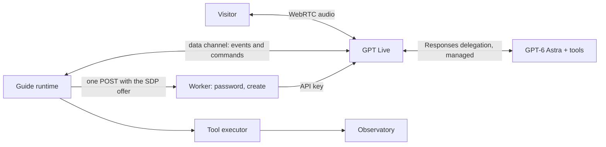

# The guide in one voice

One model talks. One model thinks. The browser moves the camera and keeps the
clock. The server holds the key and the password, and nothing else.

The visitor opens the Guide panel, picks a voice, and presses Start. From then
on there is one conversation: GPT Live listens and speaks, and every request
that needs the scene, the record, or careful reasoning goes to GPT-6 Astra
through **Responses delegation**, the managed mode in which the Live service
supplies Astra with the conversation and returns Astra's results to the voice.
Astra sees the current view, holds a rich tool inventory against the
observatory, composes a tour on the spot, and paces it with the browser's
clock. The browser executes every tool call itself over the WebRTC data
channel. There is no authored itinerary, no separate speech model, no plan
panel, no relay socket, and no hand-off between a narrator and a director. The
controls are Start, Pause, End, and the voice picker.

This plan replaces the director/narrator split, the controlled mini-TTS clips,
the authored tour scripts, the plan panel, and the application WebSocket
described in [the agentic tour guide](the-agentic-tour-guide.md) and recorded
in [ADR-0041](../../docs/adr/0041-the-guide-requests-the-view.md). It keeps
that work's execution boundary: the observatory executes every movement, the
executor validates every argument, and arrival is a receipt. Researched
13 September 2026 against the official GPT Live guides and API reference
linked below.

## 1. Why the split cannot be made smooth

The split has three clocks, two mouths, and a relay, and the seams between
them are the instability.

- **Client delegation delivers metadata, not a request.** A
  `session.delegation.created` event carries an ID and a timeline offset. The
  application reassembles the utterance from transcript fragments partitioned by
  start time, waits 300 ms for late fragments, and hopes the boundary is right.
  The docs say the same: "A transcript fragment is not a complete user turn."
  Every misheard boundary is a delegation about the wrong words.
- **The director answers a different question than the narrator asks.** Astra
  returns a strict JSON decision (explanation, clarification, plan, or actions)
  the coordinator validates, then the coordinator turns it into a
  `NarrationBrief`, then Live paraphrases that brief. Three rewrites of one
  answer; the semantic validators reject a correct answer as often as a wrong
  one, and the visitor hears "the guide could not produce a supported answer."
- **Two speakers share one speaker.** Live is muted while a mini-TTS clip
  plays, then unmuted, then told through a thinking append not to repeat the
  clip. A question during the clip stops the clip and the runner; Live answers;
  the runner needs Resume. The audible result is one voice interrupting another.
- **The prompt tells Live when to delegate, and the coordinator second-guesses
  it.** Spoken "next" is matched by regex on the assembled transcript; "give me
  a demo" is matched against an authored preset before Astra runs. Each shortcut
  is another place a request can be routed wrong.
- **The relay socket mirrors state it cannot see.** Every tool request crosses
  browser to Durable Object to Live and back, and the object keeps its own copy
  of the view revision, the operation ledger, and the pending narration so it
  can decide what the browser should do. Two copies of one state drift; the
  code that keeps them aligned is most of `coordinator.ts`.

Responses delegation removes the first and last seam by contract; removing the
mini-TTS path and the plan removes the second and third; executing tools in the
browser removes the relay.

## 2. What the documentation establishes

Every claim here is from the [prompting](https://developers.openai.com/api/docs/guides/live-prompting),
[sessions](https://developers.openai.com/api/docs/guides/live-conversations),
[delegation](https://developers.openai.com/api/docs/guides/live-delegation),
[migration](https://developers.openai.com/api/docs/guides/live-migration),
[server-side controls](https://developers.openai.com/api/docs/guides/voice-server-controls?api=live),
and [WebRTC](https://developers.openai.com/api/docs/guides/voice-webrtc?api=live)
guides, and the [API reference](https://developers.openai.com/api/reference/resources/live).

**The server's only required role is the key.** A Live WebRTC session starts
with `POST /v1/live/sessions`, authenticated with the project API key, carrying
the browser's SDP offer and the whole session configuration. Live has no
ephemeral client-secret endpoint; that mechanism belongs to the Realtime API.
The Live endpoints are create, accept, fork, hangup, refer, reject, and
recording download. After creation, the browser holds the session through its
peer connection and data channel, and the server's remaining lever is
`POST /v1/live/sessions/{id}/hangup`.

**The browser data channel can carry every command.** The reference states
that omitting `client.data_channel.allowed_client_events` "preserves the
existing allow-all behavior," and that the list, when given, names the client
event types the frontend may send. The server-side controls guide says outright
that "Responses delegation also works without a sideband. The browser can
forward function-call events from its data channel to an authenticated backend
for execution." Here the authenticated backend is the browser's own executor,
because every tool is a call into the harness the browser already owns.

**Responses delegation is the documented single-brain mode.** The session
declares `delegation: { type: 'responses', responses: { model, instructions,
tools, tool_choice, parallel_tool_calls, reasoning, service_tier, text,
max_output_tokens } }`. When Live decides a request needs backend work, the
Live service calls that model with the conversation context and speaks what
comes back. Nobody assembles the request. The reference names the fields
exactly; `reasoning.effort` accepts `none` through `xhigh`, `service_tier`
accepts `auto`, `default`, `flex`, `priority`, and `text.verbosity` accepts
`low`, `medium`, `high`.

**The backend's tools are ordinary Responses function tools, and the client
executes them.** A function call arrives as a `response.event` envelope whose
nested event is `response.output_item.done` with an item of
`type: 'function_call'` carrying `call_id`, `name`, and `arguments`. The client
answers with `response.item.create` carrying a `function_call_output` for that
`call_id`, then sends `response.create` to continue. "Appending a function
result does not automatically continue the response." Lifecycle snapshots such
as `response.completed` deliberately carry `output: []`, so function calls are
collected from the item events, never from the terminal snapshot.

**The client can start backend work itself.** `response.item.create` with a
`message` item (roles `user`, `developer`, `system`, `assistant`) followed by
`response.create` runs the backend without a spoken request. The docs use it
for typed input; it is equally the way the scene reaches the backend and the
way a clock nudges it.

**Backend configuration can change mid-session; the voice's cannot.**
`session.update` accepts sparse changes to `session.delegation.responses`.
Live's own `instructions`, `voice`, `input`, and delegation type are fixed at
creation. Whether the browser is allowed to send `session.update` is a
permission decision in § 9.

**Live is steered with three appends, all session-wide in this mode.**
`session.instructions.append`, `session.thinking.append`, and
`session.commentary.append` take a plain string of at most 500 tokens and
`delegation_id: null`; the reference states non-null delegation IDs "are not
accepted with Responses delegation." Thinking appends carry UI context the voice
can use without delegating. Instruction appends interrupt speech.

**There is no cancel.** The client event list is `session.start`,
`session.update`, `session.input_audio.*`, the three appends,
`response.item.create`, `response.create`, and `session.close`. A pending
function call is answered with a superseded or canceled output; nothing else
stops a response, and "sending session.close cancels queued Responses."

**Speech completion is not an event.** "GPT-Live has no corresponding event
marking the end of each spoken response. Track playback in your client." On
WebRTC the generated speech is a media track the browser plays, so the browser
is the one witness that can measure it. The data channel carries no audio.

**Usage and cost.** Live bills $0.05 per minute of open session, metered per
second, silence and tool waits included; a WebRTC creation bills 15 seconds
credited against the running session. Backend usage arrives in the nested
`response.completed` event's `usage`, counted once per response ID, and
cumulative voice seconds arrive in `session.usage.updated` and
`session.closed`. Every session carries a provider-assigned `expires_at`.

**The reference lists 22 voices**, including `marin`, `cedar`, `gleam`,
`meridian`, `vesper`, `willow`, `stone`, `quartz`, `ripple`, `sage`, and
`coral`. The voice is chosen at creation and cannot change; a new voice is a
new session.

## 3. The shape



| Owner   | Owns                                                                                                                                                                                                             |
| ------- | ---------------------------------------------------------------------------------------------------------------------------------------------------------------------------------------------------------------- |
| Live    | Listening, speaking, interruptions, backchannels, deciding when to delegate, pacing its own sentences.                                                                                                           |
| Astra   | Understanding the request, choosing views and subjects, composing a tour beat by beat, writing what to say, asking for a quiet moment, reading records, searching worlds.                                        |
| Browser | Microphone and speaker, the data channel, the tool loop, executing tool calls against the observatory, the scene the backend sees, UI context for Live, the pacing clock, takeover, the three controls, closure. |
| Worker  | The alpha password, authoring the session configuration, and the SDP exchange with the API key. Nothing else.                                                                                                    |

The Worker is two stateless routes: sign in, and create a session. It holds
no Durable Object, no ledger, no lease, and no socket. The `TourSession` and
`TourAdmission` objects, the application WebSocket, the coordinator, the
sideband, the spend ledger, and the wire protocol between browser and server
are gone. With no Durable Object class in the Worker, Cloudflare version
preview URLs work for it again. The executor, the operation ledger, the view
revision, and the takeover rule are unchanged in kind and now sit next to the
connection that uses them.

## 4. Session creation

The Worker creates the session from the browser's SDP offer with this
configuration. Nothing in it is client-supplied except the voice, checked
against the allowed list, and the opening scene line, bounded and treated as
data.

```jsonc
{
  "session": {
    "model": "gpt-live-1",
    "instructions": "<the Live prompt, § 8>",
    "audio": { "output": { "voice": "marin" } },
    "input": [
      {
        "type": "message",
        "role": "developer",
        "content": [{ "type": "input_text", "text": "<opening scene line>" }],
      },
    ],
    "delegation": {
      "type": "responses",
      "responses": {
        "model": "gpt-6-astra",
        "instructions": "<the backend prompt, § 8>",
        "tools": ["<the inventory, § 5, as strict function tools>"],
        "tool_choice": "auto",
        "parallel_tool_calls": false,
        "reasoning": { "effort": "low" },
        "service_tier": "priority",
        "text": { "verbosity": "low" },
        "max_output_tokens": 1200,
      },
    },
    "client": {
      "data_channel": {
        "allowed_client_events": [
          "response.item.create",
          "response.create",
          "session.thinking.append",
          "session.instructions.append",
          "session.commentary.append",
          "session.input_audio.mute",
          "session.input_audio.unmute",
          "session.close",
        ],
        "allowed_server_events": "all",
      },
    },
    "store": false,
  },
  "transport": { "type": "webrtc", "sdp": "<offer>" },
}
```

The client allow list is exactly the tool loop, the scene, the greeting, mute,
and close. `session.update` is absent so the browser cannot change the backend
model, tools, or instructions; the probe confirms the provider refuses it from
the data channel with `event_not_allowed`. `session.commentary.append` is
present only because the documented greeting recipe needs it.
`allowed_server_events` is `all` because the browser is the only client and
the WebRTC data channel carries no audio. `parallel_tool_calls` is false
because two camera operations cannot be in flight at once. `service_tier:
'priority'` is the documented latency lever and a per-response cost the
browser's usage display records; the probe ran on the default tier. The Worker
returns `session.id`, `expires_at`, and `transport.sdp`; the browser applies
the answer, waits for `session.started`, sends `session.instructions.append`
asking the guide to greet in one sentence and then listen, waits for its
acknowledgment, and sends `session.commentary.append` with "Begin the
conversation now, following the instructions provided." The instruction alone
greets sometimes; the pair greets within two seconds every time.

## 5. The tool inventory

Every tool is a strict-schema function. Arguments name things the way a
visitor would; the executor resolves names to addresses through the search
index and rejects an unknown name with an output that lists the nearest
matches. Astra never sees or produces an address, a coordinate, or a JavaScript
string. No tool blocks on the camera: a move returns `moving` at once, and the
browser reports the arrival later as a developer message (§ 7), so a backend
response never waits on travel and a correction is never queued behind one.
The tool definitions live in `packages/protocol`, shared by the Worker that
declares them and the browser that validates their arguments.

| Tool            | Arguments                                                                                            | Executes                                                                                                                                                          | Returns                                                                                           |
| --------------- | ---------------------------------------------------------------------------------------------------- | ----------------------------------------------------------------------------------------------------------------------------------------------------------------- | ------------------------------------------------------------------------------------------------- |
| `go_to`         | `subject`, optional `framing`, optional `motion` (`hold`, `orbit`, `push-in`, `pull-back`, `reveal`) | `observatory.focus` and `compose`, or a registered preset; the motion runs as a finite gesture after arrival. Returns at once.                                    | `moving` with the subject, framing, and an estimated travel time; or a rejection with the reason. |
| `adjust_view`   | Optional `azimuth_deg`, `elevation_deg`, `distance_radii`, `zoom_factor`                             | `setAngles`, `setDistance`, `zoom`, each clamped to the observatory's bounds.                                                                                     | The resulting pose.                                                                               |
| `frame_pair`    | `subject`, `companion`                                                                               | Focus the subject, `framePair` with the companion in view.                                                                                                        | Arrival with both subjects' screen positions.                                                     |
| `stand_at`      | `subject`, `site` (a returned site ID or `summit`, `shore`, `basin`, `pole`)                         | `stand` on a solid body at a survey site; rejected for gas giants, ice giants, and stars.                                                                         | Arrival with the local horizon, time of day, and the sky above.                                   |
| `look_around`   | `heading_deg`, `pitch_deg`                                                                           | `setHeading`, `setPitch` while standing.                                                                                                                          | The new heading and what the horizon holds.                                                       |
| `leave_surface` | none                                                                                                 | `leaveSurface`.                                                                                                                                                   | Arrival in orbit.                                                                                 |
| `set_time`      | `mode` (`live`, `hold`, `set`, `rate`), optional `instant` (ISO 8601), optional `rate`               | Photographic time through the observatory only: `setTime`, `setTimeScale`, `setTimePaused`. Never simulation pause, warp, or teleport.                            | The picture time and rate now in effect.                                                          |
| `hold_view`     | none                                                                                                 | `stopMotion`, `hold`.                                                                                                                                             | The held pose.                                                                                    |
| `linger`        | `seconds` (3 to 45), `reason`                                                                        | Declares the quiet look that follows this beat. Returns at once; the browser prompts the backend again after the beat is spoken and the seconds have passed.      | `scheduled` with the seconds.                                                                     |
| `describe_view` | none                                                                                                 | Projects the scene: which subjects are on screen, their normalized positions, apparent sizes, lit fraction, and the lens.                                         | A short structured description; no image.                                                         |
| `read_subject`  | `subject`, optional `fields`                                                                         | The full record from `subjectBrief`: quantities with units, display and speech wording, provenance, and the reason for every missing value; curated notes if any. | The record.                                                                                       |
| `list_subjects` | `scope` (`system`, `moons`, `nearby_stars`), optional `of`, optional `limit`                         | Bodies of the current or named system, a body's moons, or stars within a bounded radius, with kind, provenance, and available framings and sites.                 | Names and one-line summaries.                                                                     |
| `find_worlds`   | The existing `WorldQuery` fields, `radius_light_years` (≤ 8), `limit` (≤ 16)                         | The cancelable worker search.                                                                                                                                     | Matches with names, kinds, and distances, or the searched scope and no match.                     |
| `resolve_name`  | `query`                                                                                              | The search index.                                                                                                                                                 | Candidates with kinds and systems, or none.                                                       |

Three tools deserve a note.

`linger` is what makes a tour a tour, and it is a declaration rather than a
wait, because a backend response that is waiting on a tool result is a
response Live will not voice and a delegation Live will queue behind. Astra
calls it before writing a beat's words; the browser waits for the words to be
spoken, then the declared seconds, then prompts the backend to continue. If
Astra does not call it, the tour is over and nothing prompts. The beat length
is the model's decision; the clock is the browser's. Folding the seconds into
`go_to` as a `look_seconds` argument saves one backend round trip per beat and
is the first optimization to try once the shape is in the app.

`describe_view` replaces the plan panel as the model's eyes. It reads the same
projection the planetarium uses for labels, so "the bright point to the left of
Saturn" has an answer without an image. It is the tool the visitor's "what is
that?" reaches.

`read_subject` carries the speech wording the brief already computes:
"Saturn's equatorial radius is about sixty thousand kilometers." Astra is told
to prefer those sentences for measurements and its own knowledge for stories.

Web search (`{ type: 'web_search' }`) is a one-line addition to the tool list
and is left out of the alpha. Search results are untrusted text that cannot
move the camera or override a record, and the backend prompt says so before
the tool is ever enabled.

## 6. What the model sees

Astra sees three things, and each has a channel sized to its rate of change.

**The scene block** is a developer message the browser queues with
`response.item.create` whenever the view revision changes, debounced to
500 ms and skipped when unchanged. It sits in the backend conversation, so the
next delegated response, whether Live starts it or the browser does, reads the
latest one as its most recent state. It is under 1,200 bytes:

```
Current view: Saturn (gas giant, observed), framing "wide", orbit at 9.4 radii,
fill 0.31, picture time 2026-09-13T21:04:10Z live. Not traveling.
Standing: no. Guide motion: none.
On screen: Saturn (center), Titan (upper left, small), Rhea (right edge, point).
This system: Sol; planets Mercury … Neptune; Saturn's moons Titan, Rhea,
Enceladus, Iapetus, Mimas, Dione, Tethys.
Framings for Saturn: portrait, wide, half-lit, crescent, backlit, preset:the-rings.
Sites: none (no solid surface).
```

A queued developer item reaches a delegation Live initiates: the probe queued
a scene naming Iapetus as the only moon on screen, asked aloud "which moon is
on screen right now?", and Astra answered Iapetus through Live. The role
matters. A queued `user` item makes Live respond as though the visitor had
spoken it ("Yeah, hi! I'm here."); a `developer` item is read as state and
draws no such reply. Every message the browser queues is a developer message.
The stable prompt and tool definitions come first, so prompt caching keeps
them cached across responses; the probe's later responses reported about 2,000
cached input tokens of 2,100 to 2,900.

**Records** arrive on demand through `read_subject` and `list_subjects`. The
context never carries twelve facts for sixteen candidates; it carries names,
and the model asks for the numbers it is about to say.

**UI context for Live** is one sentence through `session.thinking.append`
with `delegation_id: null` on the same debounced view change: "The visitor is
now looking at Titan as a crescent from orbit." It lets the voice answer "what
am I looking at?" without delegating, and it tells the voice not to claim a
move happened until the tool result says so. Takeover sends "The visitor has
taken the camera; the view is now …" and pause sends "The visitor paused;
stay silent until resumed."

**The opening line** is a developer message in `session.input` at creation:
what is on screen and the local time, so the greeting can be specific.

## 7. The tour, corrections, takeover, pause, and end

**Live voices only the terminal response of a delegation.** A backend response
that emits a tool call completes with that call pending, and any text it
wrote before the call is never spoken; the continuation the browser starts
with `response.create` is a new response, and only the one that ends without a
tool call reaches the voice. An empty terminal message produces no speech at
all. So a beat is a short chain: tool calls first, words last, stop.

**A tour is a series of beats, and the browser is the metronome.** "Give me a
tour of Saturn" makes Live delegate. Astra calls `go_to` (Saturn,
preset:the-rings), gets `moving`, and writes one sentence about where we are
heading; Live speaks it while the camera travels. When the observatory reports
arrival and the renderer is ready, the browser queues a developer message
("Arrived: Saturn, framing preset:the-rings, not traveling. On screen: …
Narrate this stop now.") and sends `response.create`. Astra calls `linger`
(10 s), writes two or three sentences about what is on screen, and stops; Live
speaks them. The browser waits for that speech to end, then the ten seconds,
then queues "The visitor has looked quietly for 10 seconds. Continue the tour
with the next stop." and sends `response.create`. Astra calls `go_to` for the
next stop, and the beat repeats. No `linger` means the tour is over. Measured
in the probe: arrival message to the first narrated word, 4.8 s, of which the
two backend responses are 4 s and Live's own filler covers the rest.

**The clock** is the remote audio track. The browser attaches an
`AnalyserNode` to the track Live sends and treats the guide as speaking while
its level is above a floor; the guide is quiet after 1.5 s below it. Output
audio is a continuous stream whether or not the guide is talking, so the
presence of audio is no signal and the level is the only one. The clock waits
for speech to begin after the terminal response before it measures silence:
Live fills the wait for backend work with an acknowledgment ("Mmm, good
question! I'm double checking."), and a clock that starts at the end of that
filler fires inside the beat it was meant to follow. Output transcript deltas
on the data channel are the second witness for the trace. The interval is
tuned against recorded conversations in phase 3.

**A correction while moving.** Live queues a new delegation behind one that is
still in flight, and a delegation is in flight until its chain ends without a
tool call. With a move that blocks on arrival, "actually, Enceladus" waited
22 s behind the pending call in the probe; releasing the call the moment the
visitor started speaking ended the chain mid-utterance instead, Live spoke
the release's one-word result, and the correction was never delegated. With a
move that returns `moving` at once, the backend is idle when the utterance
ends, and the probe measured 60 ms from the last visitor fragment to the
delegation and 209 ms to the first spoken word of the reply ("Ah, pivoting to
Enceladus."). Astra calls `go_to` (Enceladus); the browser's request revision
cancels the pending Titan move and its arrival, and the Enceladus arrival is
narrated instead. An arrival message is queued with `response.create` only
while no delegation is in flight and the visitor is not speaking; otherwise it
is queued as a developer message alone, and the next response reads it as
state. When the probe let a stale arrival through during the correction, Astra
answered it with an empty message and Live said nothing, which is the right
outcome, and the rule keeps it from being needed.

**Takeover.** A drag, a preset, a time scrub, or a lens change advances the
mutation revision. The executor cancels pending work and stops its gesture,
the browser returns a canceled output for any pending call, `linger` returns
`taken-over`, and Live receives the thinking append. The guide's next sentence
is about the view the visitor chose.

**Pause.** Pause mutes the microphone locally, sends
`session.input_audio.mute`, mutes the guide's output element, holds the camera,
returns `interrupted` to any pending `linger`, and appends the pause
instruction. Resume reverses each. The session clock keeps billing while
paused; a pause longer than three minutes ends the session, and the panel says
so.

**End.** End stops the microphone, sends `session.close` on the data channel,
waits for `session.closed` under a bounded timeout, closes the peer
connection, and releases the executor's photographic time if the guide changed
it. The WebRTC guide's own browser example ends its session exactly this way.
A `pagehide` handler sends the same close as a best effort. A created session
carries an `expires_at` two hours out, but a browser that vanishes does not
run for two hours: when the probe's page closed its peer connection without
`session.close`, a sideband attach three seconds later returned 404, and the
same happened after a primary WebSocket was terminated. A vanished client ends
its session, so the Worker keeps no timer. A visitor who leaves the tab open
and silent is the case the three-minute pause rule covers.

## 8. The prompts

Both prompts follow the documented template: a short voice prompt with the
three delegation labels, and a backend prompt that carries every rule about
the scene. Both are versioned constants in `apps/server/src/tour/prompts.ts`
and are the subject of the listening evaluation, not the code.

**Live** (target 450 tokens):

```
You are the guide in a planetarium, sharing the sky with one curious visitor.
You are an AI voice. Sound like a friendly astronomy nerd: warm, lightly
playful, delighted by an odd detail, never a fact list. Short sentences. One
idea at a time. Leave room to look. Say when you are unsure.

Backchannel policy: Use moderate backchannels. Acknowledge naturally without
competing with the main response.

Interruption policy: Stop speaking when the visitor interrupts. Listen to what
they say.

Delegation policy:
Backend tools:
- The view: move the camera to any object, framing, surface site, or pair;
  adjust the angle and distance; hold; change the photographic time.
- The record: measurements, properties, and what is on screen right now.
- Tours: compose and pace a visit of several stops, with quiet moments.
- The sky: find objects by name or by description, near and far.

Delegate to the backend when:
- The visitor asks to see, go to, frame, land on, orbit, or compare anything.
- The visitor asks for a tour, a demonstration, or "show me around."
- The visitor asks what is on screen, how big, how far, how hot, or any
  measurement.
- A correction changes where we are going or what we are looking at.
- The visitor asks to pause, resume, skip, go back, or stop the tour.

Do not delegate to the backend when:
- The visitor greets you, thanks you, or asks you to repeat something.
- The answer is established astronomy or history you know well and needs no
  measurement and no camera.
- You need a brief clarification to understand the request.

Delegate before giving an answer that depends on backend work.
Do not guess the result while waiting. Never say the camera has moved, landed,
or arrived until the backend says so. Application context about the view is
authoritative; never recite it unasked. When the backend hands you the words
for a tour stop, speak them and then stop; do not add offers or questions
after a stop.

Pronunciation: Io is EYE-oh; Enceladus is en-SELL-uh-dus; Iapetus is
eye-APP-eh-tus; Uranus is YOOR-uh-nus.
```

The last sentence about tour stops earns its place: without it Live appended
"And if you'd like, I can center Saturn and let that spin sink in" to a beat.
Respelled pronunciations reach the output transcript as written
("en-SELL-uh-dus"), which matters only if captions return.

**Backend** (target 900 tokens):

```
## Voice conversation context
You are the mind behind a planetarium guide in a live voice conversation.
Transcripts can contain mistakes, unfinished phrases, and later corrections.
Use the latest context. If a needed detail is unclear, ask for it instead of
guessing. Messages from the developer describe the scene, arrivals, and the
clock and are authoritative; they are never the visitor speaking.

## The scene and the camera
The most recent "Current view" or "Arrived" message describes what is on
screen, the objects near it, and the framings and sites available. go_to
starts a move and returns at once; the camera arrives a few seconds later and
the developer tells you when it has, with what is on screen. Do not describe a
view before its arrival message. Names, not addresses: refer to objects by the
names the scene and tools give you. Never invent a site, framing, or object;
use list_subjects, resolve_name, or find_worlds to learn what exists.

## How speech works
Only the text you return at the very end of a turn is spoken, after every tool
call has returned. Do all tool calls first, then write the words, then stop.
Words written before a tool call are lost.

## Tours
A tour is a series of beats. When asked for a tour or to show the visitor
around: call go_to for the first stop and say one short sentence about where
we are heading, then stop. When an arrival message comes: call linger with
the seconds the visitor should have to look if the tour continues after this
stop, then write two or three sentences with one idea about what is on
screen, then stop. When the developer says the quiet time has passed: call
go_to for the next stop and say one short sentence, then stop. Do not call
linger on the final stop. Three to six stops; vary framing and motion. Adapt
when the visitor interrupts; the latest request wins.

## Speaking through the voice
Return prose the voice will paraphrase: short, specific, conversational, at
most eighty words per beat. No lists, no markdown, no IDs, no long numbers.
For measurements, use the speech wording read_subject returns. Established
Solar System history, discoveries, and analogies from your own knowledge are
welcome for real, observed objects. Projected worlds have no missions or
discoveries: describe their supplied properties as projected. Never invent a
citation, current news, or a scene claim the tools have not confirmed.

## Return the result
Say what the visitor should hear now. If work failed, say what happened and
what you can do instead. Do not claim an action succeeded before its tool
result says so. If there is nothing to say, return nothing.
```

This is the prompt the probe's final run used, with the record and search
tools added. Astra followed the beat structure on every beat of that run,
declared ten seconds of quiet, and answered a stale arrival with an empty
message.

## 9. What the application still enforces

Prompts steer; code decides. These hold no matter what either model says, and
they hold in the browser, because that is where the only thing a tool can
touch lives.

- The tool names, argument shapes, bounds, and the name-to-address resolution
  are the executor's. An unknown tool or an argument outside its schema is
  answered with an error output, never executed. The model never receives
  `window.ir`, a harness verb outside the inventory, or renderer internals.
- One camera operation in flight. The executor rejects a second, and the loop
  serializes calls even if `parallel_tool_calls` is later enabled.
- Arrival is a receipt from the observatory, gated on the renderer's
  readiness, never a timer, and it reaches the backend only as the arrival
  message the browser writes. No tool output ever claims arrival.
- The view revision and the request revision are checked before execution,
  before a receipt is committed, and before a tool output is returned.
- Time changes go through the observatory's photographic instant. No tool can
  reach `timeWarp`, world pause, or a teleport.
- Every append to Live is browser-authored text about application state. Tool
  output, search results, and transcripts are data and never become an
  instruction.

What the Worker enforces is two things, and they are the whole of what a
tampered browser could abuse.

- Authorization: the alpha password issues the signed cookie, and only a
  request carrying it can create a session. There is no per-user ledger,
  because without a sideband the Worker never sees a backend usage event and
  a browser's report of its own spend would be advisory. The spending bound is
  the OpenAI project's limit, and the duration bound is the provider's own
  session expiry.
- The configuration: prompts, tools, model, reasoning effort, service tier,
  and the data-channel allow list are authored at creation and cannot be
  changed by the browser because `session.update` is not in the list.

What a modified browser can still do with its own session is feed the backend
messages of its choosing and call `response.create` in a loop. The blast
radius is that session's backend tokens until it expires, on a project with a
spending limit, behind a password held by a few people. Allowing
`session.update` would widen that to switching the backend model or enabling
web search for the same span. That is the cost the scene-block fallback in § 6
carries, and it is the reason the developer-item path is tried first. Neither
path can move the camera anywhere the executor would not go, and nothing a
session does reaches another visitor, a save, or the simulation.

## 10. The panel

The Guide panel is a voice picker and three controls.

| Element | Behavior                                                                                                                            |
| ------- | ----------------------------------------------------------------------------------------------------------------------------------- |
| Voice   | The voices the reference lists, shown by name; disabled while a conversation is open. The persistent preference is the last choice. |
| Start   | Requests the microphone, posts the offer, applies the answer, and shows Connecting until `session.started` arrives.                 |
| Pause   | Becomes Resume while paused. Mutes both directions and holds the camera.                                                            |
| End     | Closes the session and waits for its final usage.                                                                                   |

A one-line status ("Listening", "Speaking", "Moving to Titan", "Paused") and
the AI disclosure sit beneath the controls. The private-alpha password form
appears only while unauthenticated. Captions, source cards, the plan, the
typed request box, and the transport buttons are gone; transcripts still reach
the data channel for the opt-in trace. The keymap keeps `guide.pause` and
`guide.end`.

## 11. Files

**New.**

| File                                  | Responsibility                                                                                                        |
| ------------------------------------- | --------------------------------------------------------------------------------------------------------------------- |
| `packages/protocol/src/guideTools.ts` | The inventory as strict function tools, argument decoders, and output shapes, shared by the Worker and the browser.   |
| `packages/devtools/src/tour/view.ts`  | `describe_view`: the on-screen projection as a bounded record.                                                        |
| `apps/server/src/tour/prompts.ts`     | The two prompts, versioned.                                                                                           |
| `apps/game/src/tour/loop.ts`          | The tool loop over the data channel: collect function calls per response, execute, return outputs, continue, correct. |
| `apps/game/src/tour/scene.ts`         | The scene block and the one-line UI context from the harness.                                                         |
| `apps/game/src/tour/clock.ts`         | The remote-track silence witness behind `linger` and the status line.                                                 |

**Rewritten.** `apps/server/src/tour/routes.ts` keeps capabilities, login,
and create; `openaiLive.ts` keeps `createLiveSession`;
`apps/game/src/tour/media.ts` gains data-channel sending under the allow
list; `executor.ts` gains the new tools and returns tool outputs instead of
receipts; `runtime.ts` shrinks to connect, loop, pause, end, and the snapshot
the panel reads; `packages/protocol/src/tour.ts` keeps `TourContext`,
`SubjectBrief`, and the limits, and drops every wire message.

**Deleted.** `session.ts` and `admission.ts` with both Durable Object
bindings, `coordinator.ts`, `policy.ts`, `director.ts`, `presets.ts`,
`narratorContext.ts`, `trace.ts` on the server, `hangupLiveSession`,
`synthesizeSpeech` and the `/speech` route, the `TranscriptAssembler` and
`LiveSideband`, `ControlledPlayback`, `TourRunner`, `deterministicTour`,
`design/narration/*.json`, `GuidePlan.tsx`, `GuidePlanStop.tsx`,
`GuideSources.tsx`, `GuideTransport.tsx`, `GuideTranscript.tsx`,
`planPresentation.ts`, the director evaluation fixtures under `scripts/tour/`,
and their tests. The curated astronomy notes stay as cited facts
`read_subject` can return. `wrangler.jsonc` drops both bindings through a
migration that lists the two classes under `deleted_classes`, and the
generated `worker-configuration.d.ts` follows.

## 12. Phases

### Phase 0. Prove the loop: done, 13 September 2026

Five real sessions against `gpt-live-1` with Responses delegation to
`gpt-6-astra`: four over the primary WebSocket with synthetic spoken clips
from `gpt-4o-mini-tts`, and one over WebRTC from a headless Chrome page served
by a local key-holding server. The scripts are
`scripts/tour/live-probe/beats.mjs` and `webrtc.mjs`; the traces and
summaries are under `.scratch/live-probe/`, with audio payloads dropped and no
credentials. The questions, answered:

1. A developer message queued with `response.item.create` is visible to a
   delegation Live initiates. The scene stays a queued developer item and the
   browser is never allowed `session.update`.
2. Live speaks only a delegation's terminal response. Text emitted before a
   tool call in the same response is never spoken. A beat is tool calls
   first, words last.
3. Live queues a delegation behind one whose chain has not ended. A move that
   blocks on arrival costs 22 s of stale tail on a correction; a move that
   returns at once costs 60 ms. Tools never block on the camera.
4. A developer message plus `response.create` runs the backend and Live
   speaks the result with no visitor utterance. A `user` message in the same
   position makes Live answer as if the visitor had spoken.
5. From a WebRTC page under the § 4 allow list, the data channel receives
   `response.event` function calls, accepts `response.item.create` and
   `response.create`, completes the loop with spoken output, acknowledges
   `session.instructions.append` and `session.input_audio.mute`, and refuses
   `session.update` with `event_not_allowed`. No `info` notice arrives.
6. `session.instructions.append` acknowledges in about 535 ms. The greeting
   follows it in one of two runs; with the documented `session.commentary.append`
   prompt after it, the greeting follows within two seconds in three of three.
7. `expires_at` is two hours after creation. A closed peer connection or a
   terminated primary socket ends the session within three seconds, measured
   by a sideband attach returning 404. The Worker keeps no timer.

Two more findings shaped the design. Output audio streams continuously whether
or not the guide is speaking, so speech is an energy level, and the clock must
wait for speech to begin after the terminal response before measuring silence.
And Live composes rather than reads: it merged a beat's words with the answer
to a question asked during it, and it adds offers after a beat unless the
prompt says to stop. Per-response usage ran 1,700 to 2,900 input tokens with
about 2,000 cached once the prefix was warm and 15 to 80 output tokens;
reasoning tokens appeared once, 56, at low effort. Five sessions totaled about
500 billable voice seconds. At the recorded rates the whole phase cost about
one dollar; that is an estimate from reported usage, not an invoice.

### Phase 1. The browser loop: done, 14 September 2026

`guideTools.ts`, `loop.ts`, `scene.ts`, data-channel sending in `media.ts`,
the executor's tool outputs, and the Worker reduced to sign-in and create,
with a fake data channel that replays the phase-0 event shapes
(`loop.test.ts`, `runtime.test.ts`). Acceptance met: a delegated `go_to`
starts a move through the harness, returns `moving`, and its arrival reaches
the backend as a developer message with `response.create`; a correction
during travel replaces the pending arrival and is answered at once; a
redelivered function-call event executes once; both object classes and their
tests are gone and `pnpm check` is green. Two findings changed details. The
provider refuses a tool schema that carries a fractional bound ("Invalid AVAS
session_data: Type is not JSON serializable: decimal.Decimal"), so the schema
states bounds in words and the decoders enforce them; `guideTools.test.ts`
guards it. And a version upload refuses a Worker with a pending Durable Object
migration (error 10211), so the preview URL needed one ordinary
`pnpm run deploy:worker` to apply `tour-v2` first; after that deployment on
14 September, `wrangler versions upload` produces a preview URL under the
account's `jaquers.workers.dev` subdomain, and the origin rule names that
subdomain so a preview can sign in.

### Phase 2. Tools, the view, and the panel: done, 14 September 2026

Every tool executes headlessly through the harness with the canonical hash
unchanged (`executor.test.ts`); the panel is eleven voices and Start, Pause
and End at 1600 × 900 and 390 × 844; a takeover cancels the pending move and
the guide's next line reads the new view. The first real session from the
drive rig on 14 September — a typed "short tour of Saturn with two stops"
through `ir.guideAsk` with a silent microphone — ran the whole beat: `go_to`
returning `moving`, the arrival prompted, `linger` for five seconds, the words
measured as a spoken beat by the remote-track clock, the quiet prompt, the
second stop, its narration, and End closing the session with its usage. That
session cost 59 voice seconds and 11 backend responses (44,546 input tokens
of which 39,342 cached, 377 output), about fifteen cents at the recorded
rates. Phase 3 tunes the clock against traces like it.

### Phase 3. Pacing and the first real tour, one to two days

`linger`, the remote-track clock, pause and end semantics, and the
drive-script acceptance: a synthetic "give me a short tour of Saturn" produces
at least three camera moves with speech between them and quiet intervals the
trace can measure; "actually, Enceladus" during a move produces no stale
movement; Pause silences within 150 ms; End receives `session.closed` with
its final usage and leaves no open peer connection or microphone track.

### Phase 4. Listening and the record, one day

Headphone listening across four voices with the same requests; the ADR that
supersedes the split and the relay; the context-log entry; the plan and report
status; the hosting guide's note that the Worker implements no Durable Object
and preview URLs apply to it. The evaluation script becomes a conversation
replay rather than a director grader.

## 13. Cost

Extrapolated from the probe, not measured on a full tour. A ten-minute
conversation with thirty backend responses at the probe's 2,500 input tokens
with 2,000 cached and 50 output tokens, at the recorded Astra rates of $10 and
$50 per million and the cached-input discount: under $0.30 for the backend,
plus $0.50 of voice. Priority service tier adds its multiplier. The provider's session expiry and the
project's spending limit are the hard bounds; the browser's usage display,
not this paragraph, decides whether Sol or Terra
replaces Astra for routine beats.
