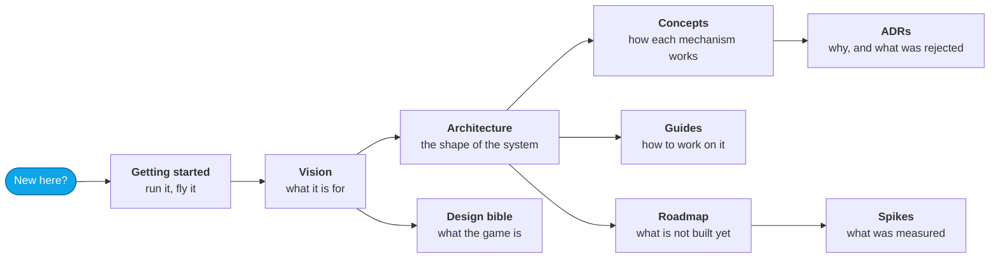
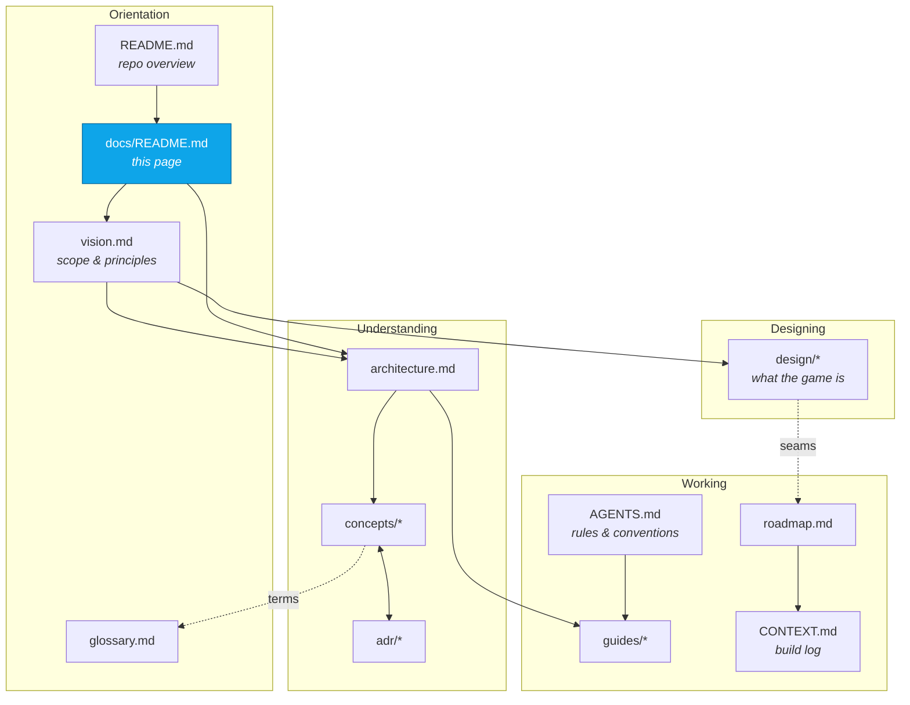

# InertialRef documentation

InertialRef is a browser-based 6-DoF simulation of the Milky Way that spans
galactic distances down to inch-scale interaction on a planetary surface.

This directory explains **how it works and why it is built that way**. The code
is the authority on _what_ it does; these pages exist so that the code reads as
a set of deliberate decisions rather than a pile of clever tricks.

## Start here

| If you want to…                                                     | Read                                                      |
| ------------------------------------------------------------------- | --------------------------------------------------------- |
| Know what this project is for                                       | [Vision and scope](vision.md)                             |
| Know what the **game** is, and why each mechanic is shaped that way | [Design bible](design/README.md)                          |
| Run it and fly around                                               | [Getting started](guides/getting-started.md)              |
| Understand the system in one sitting                                | [Architecture](architecture.md)                           |
| Know why a decision was made                                        | [ADRs](adr/README.md)                                     |
| Drive the game from code or a console                               | [The harness](guides/harness.md)                          |
| Add a feature without breaking an invariant                         | [Extending](guides/extending.md)                          |
| Know what is deliberately not built                                 | [Roadmap](roadmap.md)                                     |
| Know how it gets deployed, and what a server would cost             | [Hosting](hosting.md) — a plan, not a description         |
| See what was measured, and what it changed                          | [Spikes](spikes.md) — five measurements, with the numbers |
| Look up a term                                                      | [Glossary](glossary.md)                                   |

## Concepts

The ten mechanisms that carry the architecture. Each page explains the
problem, the mechanism, the numbers, and what breaks if you get it wrong.

| Page                                       | The question it answers                                                |
| ------------------------------------------ | ---------------------------------------------------------------------- |
| [Coordinates](concepts/coordinates.md)     | How can one number line hold both a galaxy and an inch?                |
| [Reference frames](concepts/frames.md)     | What does "3 m above the pad" mean while the planet orbits at 30 km/s? |
| [Determinism](concepts/determinism.md)     | How is the universe the same every time, in any order, on any machine? |
| [Identity](concepts/identity.md)           | How does a star have a name before it is generated?                    |
| [Simulation time](concepts/time.md)        | Why does 144 Hz produce the same universe as 60 Hz?                    |
| [Rendering](concepts/rendering.md)         | How do canonical coordinates become something a GPU can draw?          |
| [Streaming](concepts/streaming.md)         | How is only the relevant slice of a galaxy in memory?                  |
| [Workers](concepts/workers.md)             | How does expensive generation stay off the main thread?                |
| [Persistence](concepts/persistence.md)     | What is worth storing when everything can be regenerated?              |
| [Observability](concepts/observability.md) | How do you debug a coordinate system you cannot see?                   |

## The design bible

[`design/`](design/README.md) is the game-design counterpart to this
documentation: what the player does, and why each mechanic is shaped the way it
is. Twenty-two cross-linked pages. Start with
[charter](design/charter.md) and [loops](design/loops.md) — together they are the
whole game in about twenty minutes.

| Page                                                    | What it settles                                           |
| ------------------------------------------------------- | --------------------------------------------------------- |
| [charter](design/charter.md)                            | High concept, the four pillars, positioning               |
| [loops](design/loops.md)                                | The micro, macro and meta loops                           |
| [flight](design/flight.md) · [ships](design/ships.md)   | The Reference Drive, travel regimes, modules, power, heat |
| [galaxy](design/galaxy.md)                              | Real astronomy, catalogue revisions, the two maps         |
| [exploration](design/exploration.md)                    | Scanning, discovery credit, the data economy              |
| [onfoot](design/onfoot.md) · [combat](design/combat.md) | The first-person layer, and conflict                      |
| [art](design/art.md)                                    | The photorealism doctrine and the no-pop-in specification |
| [production](design/production.md)                      | Milestones M2–M7 and the named MVP                        |

Where the bible and [vision.md](vision.md) disagree, vision.md wins.

## Guides

| Page                                         | What it covers                                                  |
| -------------------------------------------- | --------------------------------------------------------------- |
| [Getting started](guides/getting-started.md) | Install, run, fly, and the first things to try                  |
| [The harness](guides/harness.md)             | Driving the simulation from a console, a test or an agent       |
| [The star catalogue](guides/catalogue.md)    | Where the real astronomy comes from, and how to rebuild it      |
| [Testing](guides/testing.md)                 | What to test, which style, and how to write an honest assertion |
| [Extending](guides/extending.md)             | Adding generated content, a worker task, a body type, a frame   |

## Decision records

Nine decisions are expensive to reverse. Each has an ADR with context,
alternatives and consequences — see the [index](adr/README.md).

## How these documents relate

- **[`../README.md`](../README.md)** — what the project is, and the proof it works.
- **[`../AGENTS.md`](../AGENTS.md)** — the rules for changing it. Read before editing.
- **[`../CONTEXT.md`](../CONTEXT.md)** — the build log: what exists, what was decided, which bugs were found and must not return.

## A note on accuracy

Where these pages quote a number — 2^40 m sectors, 64 Hz, 0.24 mm — it came from
the implementation or a test, not from an estimate. Where a page describes a
tradeoff as _measured_, there is a test that measures it. If you find a
discrepancy, the code wins and the page is a bug.
