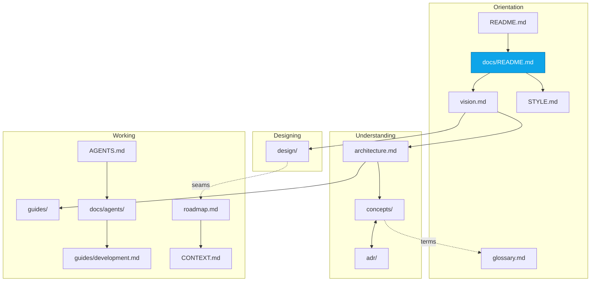

# InertialRef documentation

InertialRef is a browser-based 6-DoF simulation of the Milky Way, from
galactic distances down to inch-scale interaction on a planetary surface.

This directory explains **how it works and why it is built that way**. The
code is the authority on what it does. These pages exist so the code reads as
a set of decisions rather than a pile of tricks.

Writing voice, American English, and where each audience should look:
[`STYLE.md`](STYLE.md). It covers every surface prose reaches — these pages, code
comments, and commit messages — and it is the reason none of them describe a
previous version of the system.

---

## Start here

| If you want to…                                  | Read                                                                                                   |
| ------------------------------------------------ | ------------------------------------------------------------------------------------------------------ |
| Know what this project is for                    | [Vision](vision.md)                                                                                    |
| Know what the **game** is                        | [Design bible](design/README.md)                                                                       |
| Run it and fly around                            | [Getting started](guides/getting-started.md)                                                           |
| Understand the system in one sitting             | [Architecture](architecture.md)                                                                        |
| Know why a decision was made                     | [ADRs](adr/README.md)                                                                                  |
| Drive the simulation from code or a console      | [The harness](guides/harness.md)                                                                       |
| Add a feature without breaking an invariant      | [Extending](guides/extending.md)                                                                       |
| Work on the client, the toolchain, or a cutscene | [Development](guides/development.md) · [Client](guides/client.md) · [Cinematics](guides/cinematics.md) |
| Know what is deliberately not built              | [Roadmap](roadmap.md)                                                                                  |
| Know how it is deployed                          | [Hosting](hosting.md)                                                                                  |
| See what was measured                            | [Spikes](spikes.md)                                                                                    |
| Look up a term                                   | [Glossary](glossary.md)                                                                                |
| Change the code (human or agent)                 | [`AGENTS.md`](../AGENTS.md) · [Agent handbook](agents/README.md)                                       |

---

## Concepts

The ten mechanisms that carry the architecture. Each page explains the
problem, the mechanism, the numbers, and what breaks if you get it wrong.

| Page                                       | The question it answers                                                |
| ------------------------------------------ | ---------------------------------------------------------------------- |
| [Coordinates](concepts/coordinates.md)     | How can one number line hold both a galaxy and an inch?                |
| [Reference frames](concepts/frames.md)     | What does "3 m above the pad" mean while the planet orbits at 30 km/s? |
| [Determinism](concepts/determinism.md)     | How is the universe the same every time, in any order, on any machine? |
| [Identity](concepts/identity.md)           | How does a star have a name before it is generated?                    |
| [Simulation time](concepts/time.md)        | Why does 144 Hz produce the same universe as 60 Hz?                    |
| [Rendering](concepts/rendering.md)         | How do canonical coordinates become something a GPU can draw?          |
| [Streaming](concepts/streaming.md)         | How is only the relevant slice of a galaxy in memory?                  |
| [Workers](concepts/workers.md)             | How does expensive generation stay off the main thread?                |
| [Persistence](concepts/persistence.md)     | What is worth storing when everything can be regenerated?              |
| [Observability](concepts/observability.md) | How do you debug a coordinate system you cannot see?                   |

---

## The design bible

[`design/`](design/README.md) is the game-design counterpart to this
documentation: what the player does, and why each mechanic is shaped the way
it is. Start with [charter](design/charter.md) and [loops](design/loops.md).

Where the bible and [vision.md](vision.md) disagree, vision.md wins.

---

## Guides

| Page                                         | What it covers                                                                                           |
| -------------------------------------------- | -------------------------------------------------------------------------------------------------------- |
| [Getting started](guides/getting-started.md) | Install, run, fly, and the first things to try                                                           |
| [Development](guides/development.md)         | Commands, toolchain, and conventions                                                                     |
| [Client](guides/client.md)                   | Canvas, modes, camera, dock                                                                              |
| [Cinematics](guides/cinematics.md)           | Authoring scripted scenes                                                                                |
| [The harness](guides/harness.md)             | Driving the simulation from a console, a test, or an agent                                               |
| [The star catalog](guides/catalogue.md)      | Where the real astronomy comes from — stars, planets, surface maps, shape models — and how to rebuild it |
| [Testing](guides/testing.md)                 | What to test, which style, and how to write an honest assertion                                          |
| [Extending](guides/extending.md)             | Adding generated content, a worker task, a body type, a frame                                            |

---

## For coding agents

[`agents/`](agents/README.md) is the handbook for agents. [`AGENTS.md`](../AGENTS.md)
at the repository root is the auto-loaded working card — invariants and
definition of done. Claude Code setup lives in [`CLAUDE.md`](../CLAUDE.md).
The visual design system is [`DESIGN.md`](../DESIGN.md). The product brief is
[`PRODUCT.md`](../PRODUCT.md). The build log is [`CONTEXT.md`](../CONTEXT.md).

---

## How these documents relate

---

## Accuracy

Where these pages quote a number — 2^40 m sectors, 64 Hz, 0.24 mm — it came
from the implementation or a test, not from an estimate. Where a page
describes a tradeoff as measured, there is a test that measures it. If you
find a discrepancy, the code wins and the page is a bug.
