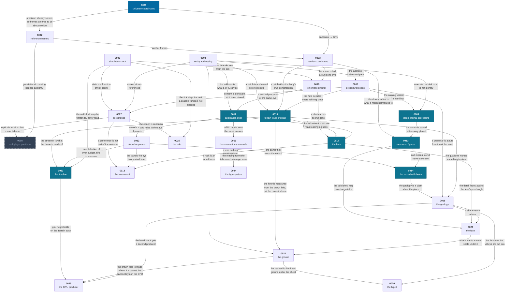

# Architectural decision records

Twenty-five decisions that are expensive to reverse. Each records the **context**, the
**decision**, the **alternatives that were rejected**, and the **consequences**
— including the ones that turned out to be costs.

> These were written after the implementations, from the measurements those
> implementations produced. That makes them less a plan and more a record of
> what each decision actually cost, which is the more useful artifact.

| #                                           | Decision                    | Status       | One-line summary                                                                                                                                                                                                                                                                                                                                                                                                                                                                                |
| ------------------------------------------- | --------------------------- | ------------ | ----------------------------------------------------------------------------------------------------------------------------------------------------------------------------------------------------------------------------------------------------------------------------------------------------------------------------------------------------------------------------------------------------------------------------------------------------------------------------------------------- |
| [0001](0001-universe-coordinates.md)        | Universe coordinates        | accepted     | Int32 sector index + float64 offset in a 2^40 m sector. Sub-millimeter anywhere in 249,000 ly.                                                                                                                                                                                                                                                                                                                                                                                                  |
| [0002](0002-reference-frames.md)            | Reference frames            | accepted     | Frames carry the semantics of motion, not precision — the coordinates already handle that.                                                                                                                                                                                                                                                                                                                                                                                                      |
| [0003](0003-render-coordinates.md)          | Render coordinates          | accepted     | Floating origin on a power-of-two grid, plus logarithmic depth compression that preserves angular size.                                                                                                                                                                                                                                                                                                                                                                                         |
| [0004](0004-entity-addressing.md)           | Entity addressing           | accepted     | Identity is a path through containment, and that path is also the seed path.                                                                                                                                                                                                                                                                                                                                                                                                                    |
| [0005](0005-procedural-seeds.md)            | Procedural seeds            | accepted     | Hierarchical derivation, never a shared stream. xoshiro128** over exact integer ops.                                                                                                                                                                                                                                                                                                                                                                                                            |
| [0006](0006-simulation-clock.md)            | Simulation clock            | accepted     | 64 Hz fixed timestep, because 1/64 is exact in binary. Wall clock decides only how many.                                                                                                                                                                                                                                                                                                                                                                                                        |
| [0007](0007-persistence.md)                 | Persistence                 | accepted     | A save is the seed, the tick, and what could not be regenerated — under 800 bytes.                                                                                                                                                                                                                                                                                                                                                                                                              |
| [0008](0008-multiplayer-partitions.md)      | Multiplayer partitions      | **proposed** | Authority partitions by star system. Design only; multiplayer is a later phase, though the partition key is already a live debug field.                                                                                                                                                                                                                                                                                                                                                         |
| [0009](0009-issue-ordinal-addressing.md)    | Issue-ordinal addressing    | accepted     | A body index is the ordinal it was issued at, not its orbital position — so real astronomy can add a planet without renaming every world outward of it.                                                                                                                                                                                                                                                                                                                                         |
| [0010](0010-cinematic-director.md)          | Cinematic director          | accepted     | Scripted scenes are presentation borrowed from a running world and returned intact — the camera overridden, nothing canonical written, time from the tick.                                                                                                                                                                                                                                                                                                                                      |
| [0011](0011-application-shell-and-modes.md) | Application shell and modes | accepted     | The canvas lives outside every route; the mode is a pure function of the path; the camera has one precedence order — cutscene, observatory, ship.                                                                                                                                                                                                                                                                                                                                               |
| [0012](0012-dockable-panels.md)             | Dockable panels             | accepted     | Panels move between four zones. The layout is a value and the moves are property-tested arithmetic; the drag library is only an input device.                                                                                                                                                                                                                                                                                                                                                   |
| [0013](0013-measured-figures.md)            | Measured figures            | accepted     | A body gravity never rounded off carries its measured figure as a radius grid, and the generated case and the measured case are the same case.                                                                                                                                                                                                                                                                                                                                                  |
| [0014](0014-the-record-with-holes-in-it.md) | The record with holes in it | accepted     | A field nothing has measured is a row saying so, with the reason — written in the universe's voice, never the engine's.                                                                                                                                                                                                                                                                                                                                                                         |
| [0015](0015-terrain-level-of-detail.md)     | Terrain level of detail     | accepted     | A restricted, morphing quadtree over a detail floor measured from the field — and the morph closes one level, which is why the tree is restricted at all.                                                                                                                                                                                                                                                                                                                                       |
| [0016](0016-documentation-as-a-mode.md)     | Documentation as a mode     | accepted     | The docs are a mode of the application, rendered at build and fetched at runtime — TypeDoc's model drawn by our components, so the reference is one site with the rest.                                                                                                                                                                                                                                                                                                                         |
| [0017](0017-the-lens.md)                    | The lens                    | accepted     | The camera carries focal length, gauge, aperture, focus and gain; the field of view is derived. One producer, under the pose's own precedence.                                                                                                                                                                                                                                                                                                                                                  |
| [0018](0018-the-instrument.md)              | The instrument              | accepted     | The aim is an offset on the pose; compositions are one list with two placers; the keymap has one dispatcher and contexts that may share a chord; preferences are a registry with one storage call site.                                                                                                                                                                                                                                                                                         |
| [0019](0019-the-geology.md)                 | The geology                 | accepted     | Terrain is a grammar derived from body facts, a per-body sketch, and a band stack of shares that sum to one; `maxElevation` is a strength limit rather than a dial; craters are placed on a cubic lattice in ℝ³; one field at every level, because the morph is exact only if two patches evaluate the same function.                                                                                                                                                                           |
| [0020](0020-the-face.md)                    | The face                    | accepted     | The ground carries four bytes of cover a vertex for what a shader cannot derive; the palette is ratios against the body's own colour; a mapped body's terrain wears its published map and the invented channels switch off; deposits are layered rather than splatted, and everything shades in body-fixed axes.                                                                                                                                                                                |
| [0021](0021-the-ground.md)                  | The ground                  | accepted     | The drawn field is the canonical one plus a presentational tail, 1.25 m at worst; the tail's amplitude is above the refinement tolerance, which is the only reason the detail floor moves; a rock is an address, and it wears the ground's own material.                                                                                                                                                                                                                                        |
| [0022](0022-the-timeline.md)                | The timeline                | accepted     | Canonical code emits to a timeline and cannot read one — `Span.end` returns void; the host capability is a port and one file names the platform APIs; two APIs behind a three-valued level, off by default because feature detection cannot be a `typeof`; the phases tile the engine step from one clock read per boundary.                                                                                                                                                                    |
| [0023](0023-the-gpu-producer.md)            | The GPU producer            | accepted     | The GPU produces the drawn heightfield tiles and the CPU function stays canon and fallback; the precision lives in a float64-packed per-tile frame, not in the float; a source is a port the pool also implements; the tolerance is a test on the physical adapter, per body and per band.                                                                                                                                                                                                      |
| [0024](0024-the-type-system.md)             | The type system             | accepted     | The Record and Instrument registers are the IBM Plex pair — one program, matched x-height, true italics; the mathematical operators are vendored Plex subsets under the same family names and the sigils are Noto subsets, all unicode-range-gated, with `☉` and `⊕` still uncovered; the display face stays Archivo, hand-kerned at poster size.                                                                                                                                               |
| [0025](0025-the-rails.md)                   | The rails                   | accepted     | A coasting entity's state at any tick is the two-body propagation of a canonical epoch, so a frame jumps the ticks nothing integrates; eligibility is physical, never the warp; sphere-of-influence tests run at fixed boundaries and are skipped by a triangle-inequality bound; the clock plans and settles rather than budgets.                                                                                                                                                              |
| [0026](0026-the-liquid.md)                  | The liquid                  | accepted     | A sea is a liquid the ground temperature admits; valleys are the zero-level strip of a warped noise cut to a depth that shallows toward the datum; the coast is a C¹ remap either side of it; the sea is a sheet over a seabed the heightfield now carries, refracting the frame behind it; a world is drawn in families off its seed; every per-pixel octave is a fetch of one baked 3D texture; the sphere wears a cube map the ground material bakes; and the surface has four named levers. |

---

## How they connect

Four dependencies are worth noticing because they are not obvious:

- **0001 → 0002.** Because coordinates are precise everywhere, frames did _not_
  have to be a precision mechanism, which is the opposite of how most engines at
  this scale are built. That freed frames to be about the semantics of motion.
- **0005 + 0004 → 0007.** Determinism plus stable identity is what makes a save
  a few hundred bytes instead of gigabytes. Persistence did not need a clever format; it
  needed the other two decisions to have been made correctly.
- **0004 → 0009.** ADR-0004's own consequences section admitted that bodies are
  addressed by orbital index and that changing the layout renames them. That was
  acceptable while the only thing changing the layout was us. It stops being
  acceptable when real astronomy is a generation input, which is what 0009
  corrects — and it is free to correct only while there is no save corpus.
- **0010 → 0011.** The cinematic director needed one thing from the renderer: an
  eye that is not the ship's. Having built that seam, the planetarium was a
  _second producer of the same shape_ rather than a new mechanism — which is why
  a whole mode cost a nullable field and six lines of precedence.

---

## Writing a new one

Add an ADR when a decision would be expensive for a future engineer to reverse,
or when they would otherwise have to reverse-engineer _why_ from the code.

Keep the four headings: **Context**, **Decision**, **Alternatives considered**,
**Consequences**. The alternatives section is the one that ages best — it is the
difference between a record and a rationalisation.

Prefer real numbers over adjectives. "0.24 mm anywhere in 249,000 ly" is a
decision record; "very precise" is a mood.

---

## Related

- [Concepts](../README.md#concepts) — how these decisions work in practice
- [Architecture](../architecture.md) — where they meet
- [Roadmap](../roadmap.md) — what they are load-bearing for next
