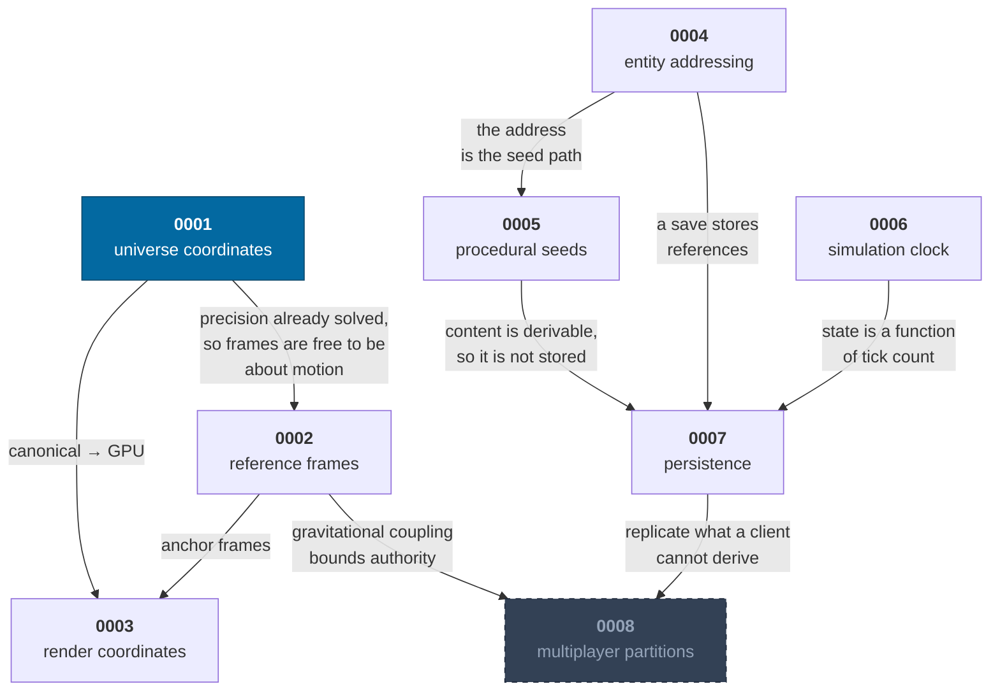

# Architectural decision records

Eight decisions that are expensive to reverse. Each records the **context**, the
**decision**, the **alternatives that were rejected**, and the **consequences**
— including the ones that turned out to be costs.

> These were written after the implementations, from the measurements those
> implementations produced. That makes them less a plan and more a record of
> what each decision actually cost, which is the more useful artefact.

| # | Decision | Status | One-line summary |
|---|---|---|---|
| [0001](0001-universe-coordinates.md) | Universe coordinates | accepted | Int32 sector index + float64 offset in a 2^40 m sector. Sub-millimetre anywhere in 249,000 ly. |
| [0002](0002-reference-frames.md) | Reference frames | accepted | Frames carry the semantics of motion, not precision — the coordinates already handle that. |
| [0003](0003-render-coordinates.md) | Render coordinates | accepted | Floating origin on a power-of-two grid, plus logarithmic depth compression that preserves angular size. |
| [0004](0004-entity-addressing.md) | Entity addressing | accepted | Identity is a path through containment, and that path is also the seed path. |
| [0005](0005-procedural-seeds.md) | Procedural seeds | accepted | Hierarchical derivation, never a shared stream. xoshiro128** over exact integer ops. |
| [0006](0006-simulation-clock.md) | Simulation clock | accepted | 64 Hz fixed timestep, because 1/64 is exact in binary. Wall clock decides only how many. |
| [0007](0007-persistence.md) | Persistence | accepted | A save is the seed, the tick, and what could not be regenerated — under 700 bytes. |
| [0008](0008-multiplayer-partitions.md) | Multiplayer partitions | **proposed** | Authority partitions by star system. Design only; multiplayer is a later phase, though the partition key is already a live debug field. |

---

## How they connect

Two dependencies are worth noticing because they are not obvious:

- **0001 → 0002.** Because coordinates are precise everywhere, frames did *not*
  have to be a precision mechanism, which is the opposite of how most engines at
  this scale are built. That freed frames to be about the semantics of motion.
- **0005 + 0004 → 0007.** Determinism plus stable identity is what makes a save
  a few hundred bytes instead of gigabytes. Persistence did not need a clever format; it
  needed the other two decisions to have been made correctly.

---

## Writing a new one

Add an ADR when a decision would be expensive for a future engineer to reverse,
or when they would otherwise have to reverse-engineer *why* from the code.

Keep the four headings: **Context**, **Decision**, **Alternatives considered**,
**Consequences**. The alternatives section is the one that ages best — it is the
difference between a record and a rationalisation.

Prefer real numbers over adjectives. "0.24 mm anywhere in 249,000 ly" is a
decision record; "very precise" is a mood.

---

## Related

- [Concepts](../README.md#concepts) — how these decisions work in practice
- [Architecture](../architecture.md) — where they meet
- [Roadmap](../roadmap.md) — what they are load-bearing for next
