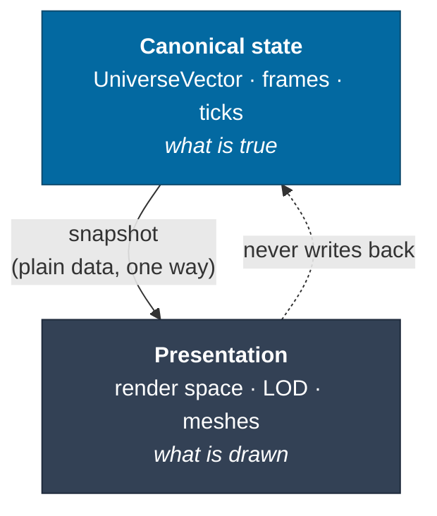
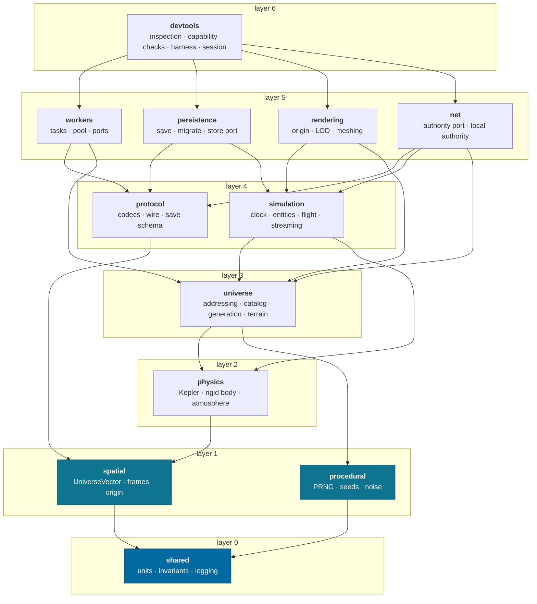
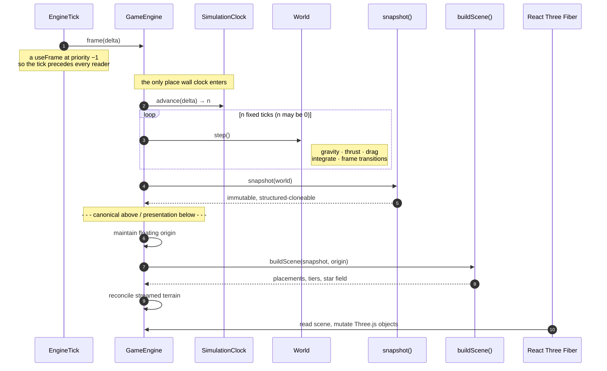
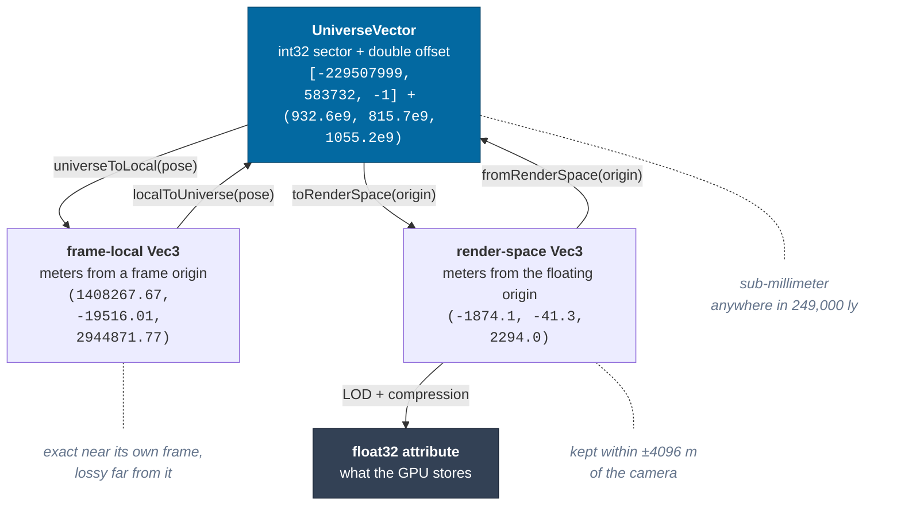
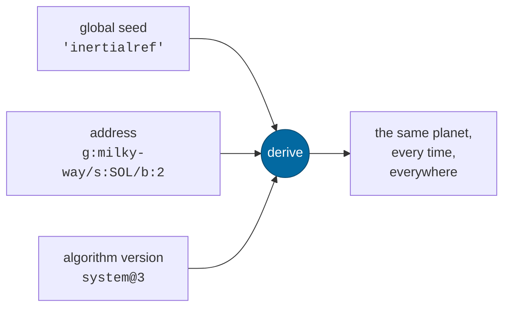
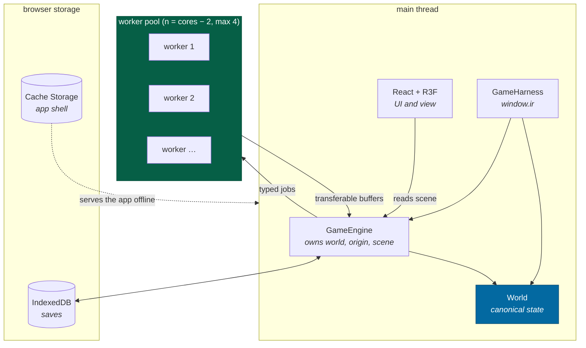

# Architecture

How InertialRef is put together, in one sitting. Individual mechanisms have
their own [concept pages](README.md#concepts); this page is the map that shows
where they meet.

---

## The one idea

Everything else follows from a single separation:



The renderer is a _reader_. It can be replaced, moved to another thread, or
deleted, and the universe is unchanged. A Three.js coordinate is never the truth
about where anything is — [ADR-0001](adr/0001-universe-coordinates.md).

That is why the simulation runs identically in a browser, a Web Worker and Node,
and why `apps/headless` exists: it steps the same core with no DOM, no React and
no WebGL, so the claim breaks loudly instead of quietly.

---

## The stack, top to bottom



A package may depend only on **strictly lower** layers. `pnpm graph` enforces
that and rejects cycles; the layer number lives in each `package.json` under
`inertialref.layer`.

The rule earns its keep in a specific way: `spatial` cannot learn what an orbit
is, `universe` cannot learn what a ship is, and nothing below `rendering` can
learn what a pixel is. When a lower package needs a capability from a higher one
it declares a **port** and the host implements it — see
[workers](concepts/workers.md#the-port-pattern).

### What each package is for

| Package       | Owns                                                        | Never knows about               |
| ------------- | ----------------------------------------------------------- | ------------------------------- |
| `shared`      | units, brands, invariants, structured logging               | anything domain-specific        |
| `spatial`     | absolute position, frame graph, floating origin             | orbits, bodies, rendering       |
| `procedural`  | PRNG, seed derivation, noise, algorithm versions            | what is being generated         |
| `physics`     | Kepler solutions, 6-DoF integration, drag, thrusters        | which body, which ship          |
| `universe`    | addressing, catalog, generation, terrain, frames-for-bodies | entities, ticks                 |
| `simulation`  | clock, entities, flight, frame transitions, streaming       | React, Three.js, the DOM        |
| `protocol`    | validated wire/save shapes                                  | where bytes come from           |
| `workers`     | typed tasks, job pool, transport ports                      | `Worker` (the class)            |
| `persistence` | save capture/restore, migrations                            | IndexedDB (a port)              |
| `net`         | who owns the simulation this client does not                | sockets, Cloudflare, transports |
| `rendering`   | canonical→render bridge, LOD, terrain meshing               | Three.js                        |
| `devtools`    | inspection, capability checks, harness, session wiring      | — (it may depend on everything) |

`rendering` deliberately does **not** import Three.js. It emits positions,
scales, orientations and vertex buffers as plain data; `apps/game` applies them.
That is what makes the render pipeline testable in Node, and it is why the
"where should this be drawn" logic has tests at all.

---

## One frame, end to end

The tightest loop in the system. Everything above the dashed line is canonical;
everything below is presentation.



Three properties of this loop are load-bearing:

1. **`delta` reaches the clock and stops.** The number of ticks is the only
   thing wall time decides. It is handed over raw, from a component whose only
   job is to step the simulation — the tick runs at an explicit R3F priority so
   that the components reading the result are not depending on JSX sibling
   order. [Simulation time](concepts/time.md)
2. **`n` may be zero, or eight.** The loop is not "one tick per frame", and a
   step budget inside the clock prevents a backgrounded tab from returning and
   freezing the page. That budget lives in exactly one place: a second clamp in
   the view changed nothing and corrupted the dropped-tick count the HUD shows.
3. **The snapshot is a copy.** The renderer holding it cannot mutate the world,
   and the same structure crosses a worker boundary unchanged if the simulation
   ever moves off the main thread.

---

## Where a position lives

A single position passes through four representations. Each conversion is
lossless _in the direction it is used_, and each has a reason to exist.



The middle box carries the subtlety worth internalising: **a frame-local `Vec3`
is only precise near its own frame.** Expressing a point in a frame four
light-years away degrades to meters, because a `Vec3` is a double. That is not a
defect to be fixed; it is why canonical state is a `UniverseVector` and why an
approaching ship is re-framed into the system it is entering.

There is a test that asserts the degradation rather than hiding it —
`packages/spatial/src/frame.test.ts`, "degrades predictably when a position is
expressed in a far-away frame".

Details: [coordinates](concepts/coordinates.md) · [frames](concepts/frames.md) ·
[rendering](concepts/rendering.md)

---

## Where the universe comes from

Nothing is stored. Content is a pure function of a seed and an address.



Because the address is also the seed path, a body's content depends only on its
own identity — not on what was generated before it, in what order, or in how
many workers. [Determinism](concepts/determinism.md) ·
[identity](concepts/identity.md)

**Except where somebody measured it.** The catalog is a second generation input
(`docs/design/galaxy.md` Rule 1), and so are `packages/universe/src/solar/` and
`data/shapes/` — 7,123 real stars, 702 confirmed exoplanets, the Solar System's
129 bodies, and twenty-five published shape models. The split is not per object
but per _field_: an `observed` body uses the published number for everything
somebody published and derives the rest from its own seed, and the absence of a
value is what decides which. Phobos's whole shape is a measurement; 67P's is a
draw on measured half-extents; a generated moon is a draw all the way down.
[ADR-0013](adr/0013-measured-figures.md)

The consequence for storage is stark: a save is the seed, the tick and the
handful of things with no address to regenerate from — **just under 800 bytes
for a flown session**. [Persistence](concepts/persistence.md)

---

## The runtime picture



- **Workers** run terrain generation and galaxy surveys. One module constructs a
  `Worker`; everything else talks to a port. [Workers](concepts/workers.md)
- **The harness** is the same object the headless runner uses, so a bug
  reproduced in Chrome replays in a test. [Harness](guides/harness.md)
- **The service worker** precaches the four mode documents. With the server
  stopped the game still loads and passes all twelve capability checks — there
  is nothing else to fetch, because content comes from the seed. A
  documentation page nobody has opened is the browser's offline page.

---

## Applications

| App             | What it is for                                                                                                                     |
| --------------- | ---------------------------------------------------------------------------------------------------------------------------------- |
| `apps/game`     | The client. Astro owns the document; React islands own the canvas and the chrome.                                                  |
| `apps/headless` | The same core in Node — no DOM, no React, no WebGL. Proves the boundary and runs the capability checks via `pnpm sim --self-test`. |

Both open a session through the same `Session` in `devtools`, which owns the
seven steps of standing a world up. Before it existed there were five copies of
that sequence and they had already drifted — the client spawned the ship at 2.5
body radii and everything else at 3, a difference that would make a bug
reproduce in one runtime and not the other.

---

## Invariants

The short list. Violating one of these is a rewrite later, not a refactor.
The full set is in [AGENTS.md](../AGENTS.md); each rule's technical home is
in the [invariant map](agents/invariants.md).

| #   | Invariant                                                            | Enforced by                                                    |
| --- | -------------------------------------------------------------------- | -------------------------------------------------------------- |
| 1   | Only `UniverseVector` is an absolute position                        | convention + review                                            |
| 2   | No `Math.random`, `Date.now` or `performance.now` in canonical paths | golden vectors, determinism tests                              |
| 3   | Generation never depends on order                                    | shuffled-order tests                                           |
| 4   | Canonical state is never in a React component                        | components read snapshots; `packages/*` has no DOM lib         |
| 5   | One module constructs a `Worker`                                     | port interface in `workers`                                    |
| 6   | Nothing regenerable is persisted                                     | save-size test                                                 |
| 7   | No vendor SDK below the adapter layer                                | `pnpm graph` — `packages/*` may have no third-party dependency |
| 8   | Terrain is sampled in body-fixed axes                                | a branded `BodyFixedDirection` type                            |
| 9   | Landedness is a consequence, never asserted                          | `teleport` has no `landed` flag                                |
| 10  | Entity state is written through `World`, not `entities.update`       | `teleport`, `setControl`, `setFlightAssist`, `killRotation`    |

Invariant 8 is worth calling out as a pattern. It began as a bug — terrain was
sampled with an inertial direction, so the mountains stood still while the
planet rotated underneath them, and a ship landed 83 m above the ground it had
just touched. The fix was correct code, and it was applied to one of the two
terrain samples in `stepFlight`; the other went on feeding the atmosphere an
inertially-sampled altitude, where nothing rendered wrong and no test failed.
The _durable_ fix was giving the body-fixed direction its own type, so the wrong
vector no longer compiles. Adding the brand immediately surfaced a third call
site nobody had found by reading.

Invariants 9 and 10 have the same shape. `teleport` used to take a `landed`
boolean, and the harness used it to declare a ship landed three meters above the
pad — `stepFlight` short-circuits for an already-landed entity, so the contact
test never ran and the ship hovered there for the rest of the session while the
overlay reported an altitude of zero. Removing the parameter makes the state
unreachable rather than merely discouraged.

---

## Verification

```bash
pnpm check   # graph → brand → presets → format → lint → typecheck (5 projects) → tests → build
```

| Stage           | What it proves                                                                              |
| --------------- | ------------------------------------------------------------------------------------------- |
| `graph`         | layering intact, no cycles                                                                  |
| `brand:check`   | generated brand artifacts match their source                                                |
| `presets:check` | every picture still has a plate, and every composition it names still resolves              |
| `format:check`  | committed files match Prettier                                                              |
| `lint`          | oxlint across the workspace                                                                 |
| `typecheck`     | five tsconfig projects — portable packages, client, Node runner, Worker, and offline ingest |
| `test`          | the full Vitest suite runs in plain Node — `packages/*` and `apps/*` alike                  |
| `build`         | the client actually bundles, workers included                                               |

On top of that, twelve **capability checks** execute the milestone's claims
against the live build — in Node via `pnpm sim --self-test`, and in the browser
via `await ir.selfTest()`. They are the definition of done made executable
rather than described. [Testing](guides/testing.md)

---

## Reading on

- [Concepts](README.md#concepts) — how each mechanism actually works
- [ADRs](adr/README.md) — why, and what was rejected
- [Development](guides/development.md) — commands, toolchain, conventions
- [Agent handbook](agents/README.md) — how to change it
- [Roadmap](roadmap.md) — what is deliberately not built yet
