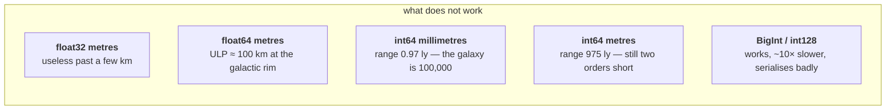
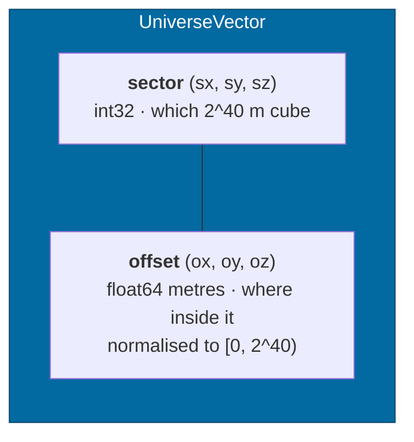
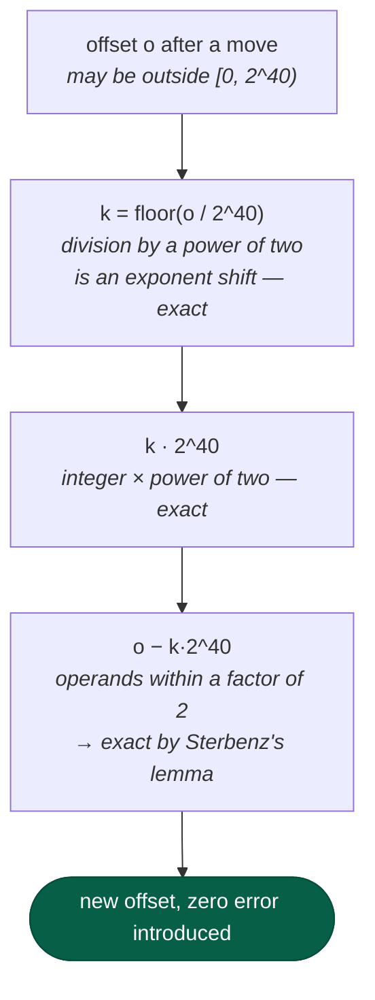
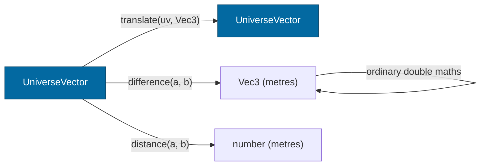

# Coordinates

> **The question:** how can one representation hold both a galaxy and an inch?
> **The answer:** an integer sector index per axis, plus a double offset inside
> that sector — with the sector size a power of two so the carry is exact.
>
> Decision record: [ADR-0001](../adr/0001-universe-coordinates.md) ·
> Code: `packages/spatial/src/universeVector.ts`

---

## The problem, in numbers

InertialRef has to place a bolt on a hull and a star at the far rim of the
galaxy in the same universe.

| Thing | Scale |
|---|---|
| Milky Way diameter | ~1e21 m |
| Distance to Alpha Centauri | 4.13e16 m |
| 1 AU | 1.496e11 m |
| Earth radius | 6.37e6 m |
| A person | 1.8 m |
| An inch | 2.54e-2 m |

That is **23 orders of magnitude**. Every naive representation dies somewhere in
that span:



The float64 line is the one that surprises people, so it is worth making
concrete. In JavaScript, at 8 kiloparsecs from the galactic centre:

```js
8000 * PARSEC + 0.0254 === 8000 * PARSEC   // → true
```

An inch simply vanishes. There is no arrangement of doubles-as-metres that both
reaches the rim and resolves a hand tool.

---

## The representation



A position is the sector index *plus* the offset. The invariant — every offset
in `[0, SECTOR_SIZE)` — is maintained by every constructor, so two equal
positions are always represented identically and `equals` is a field comparison.

### The numbers that fall out

| Quantity | Value | |
|---|---|---|
| `SECTOR_EXPONENT` | 40 | |
| `SECTOR_SIZE` | 2^40 m ≈ 1.0995e12 m | ≈ 7.35 AU |
| Sector index range | int32 | ±2,147,483,648 sectors |
| `UNIVERSE_HALF_EXTENT` | 2^71 m ≈ 2.36e21 m | **≈ 249,000 ly** |
| `POSITION_RESOLUTION` | 2^40 × 2^-52 m | **≈ 0.24 mm, everywhere** |

The Milky Way is ~100,000 ly across, so the addressable volume holds the galaxy
plus a wide halo, and a quarter of a millimetre is below anything a player can
interact with.

---

## Why a power of two, specifically

This is the part that makes the scheme safe to use as *canonical state* rather
than as a rendering trick.

When an offset runs past the sector edge it has to be carried into the sector
index. With `SECTOR_SIZE = 2^40`, every step of that carry is **exact** in
IEEE-754:



So **crossing a sector boundary costs nothing**. A ship can fly across the
galaxy through millions of sector boundaries and accumulate no drift from the
representation itself. Had the sector size been, say, 1e12 m — a rounder number
— each carry would round, and the error would be a function of how far you had
travelled, which is exactly the property a canonical coordinate must not have.

### The residual error, and where it comes from

Precision is bounded by the *offset*, not by the absolute magnitude:

| Where | Offset magnitude | ULP |
|---|---|---|
| Just inside a sector | ~1 m | 2e-16 m |
| Middle of a sector | ~5e11 m | 6e-5 m |
| Just below the edge | ~1.1e12 m | **1.22e-4 m** |

Worst case ≈ 0.12 mm, and `POSITION_RESOLUTION` (0.24 mm) is the conservative
bound the tests assert against. Measured in capability check 7: an inch-scale
displacement 8.18 kpc from the galactic centre resolves to within **9.4 µm**.

There is one place the error is slightly larger — two points straddling a sector
boundary, where the difference is computed as `Δsector · 2^40 + Δoffset` and the
two terms nearly cancel. It stays inside the same bound, and
`universeVector.test.ts` has a case pinned on it.

---

## Working with positions

The API is small on purpose. Absolute positions support very few operations,
which is itself a safety property.



- **`translate`** — move by a displacement. Exact carry, as above.
- **`difference`** — subtract two positions into a plain `Vec3` in metres. Valid
  at any separation: a galaxy-crossing difference quantises to ~1e5 m, while the
  near-field differences that feed physics and rendering keep full double
  precision.
- **`distance`** — the magnitude of that.

Notice what is missing: there is no "add two positions", no "scale a position",
no "interpolate between two positions in absolute space". Those are meaningless
or lossy operations on an absolute coordinate, and leaving them out means nobody
writes them by accident. All the arithmetic happens on the `Vec3` side, where
double precision is ample.

`approxMeters` exists for display and coarse culling and is documented as lossy
by construction — that is the whole point of the type.

---

## Why the origin is the galactic centre

The universe origin sits at the centre of the Milky Way, so Sol lands 8.178 kpc
out rather than at zero. That is deliberate: an origin at the player's home
system would have to move the moment the game modelled anywhere else, and every
sector index would be a relative quantity pretending to be absolute.

Catalogue stars are converted ICRS → galactic → simulation axes on the way in.
The conversion validates itself: Proxima and Alpha Centauri are placed from
*independent* right ascension / declination / parallax entries and land **0.2025
ly** apart, matching the published separation.

---

## What this buys, and what it costs

**Buys**

- Sub-millimetre resolution anywhere, with no special cases and no modes.
- JSON- and structured-clone-friendly: six plain numbers, no BigInt, no classes.
- Free to send to a worker; trivially comparable; trivially hashable.
- Exact carries, so long journeys do not accumulate representation error.

**Costs**

- 0.24 mm is a floor. Millimetre-scale assembly gameplay would need a smaller
  sector, which costs range.
- Constructing from absolute metres (`fromMeters`) is limited by the double you
  hand it — at 1e19 m the input has already lost ~2 km before the call. It is
  the right tool for placing catalogue stars, whose published positions are far
  more uncertain than that, and the wrong tool for anything else.
- Six numbers rather than three, everywhere.

---

## Related

- [Reference frames](frames.md) — what frames are for, given that precision is
  already solved
- [Rendering](rendering.md) — how these become float32 coordinates a GPU can use
- [ADR-0001](../adr/0001-universe-coordinates.md) — the alternatives that were
  rejected, and why
