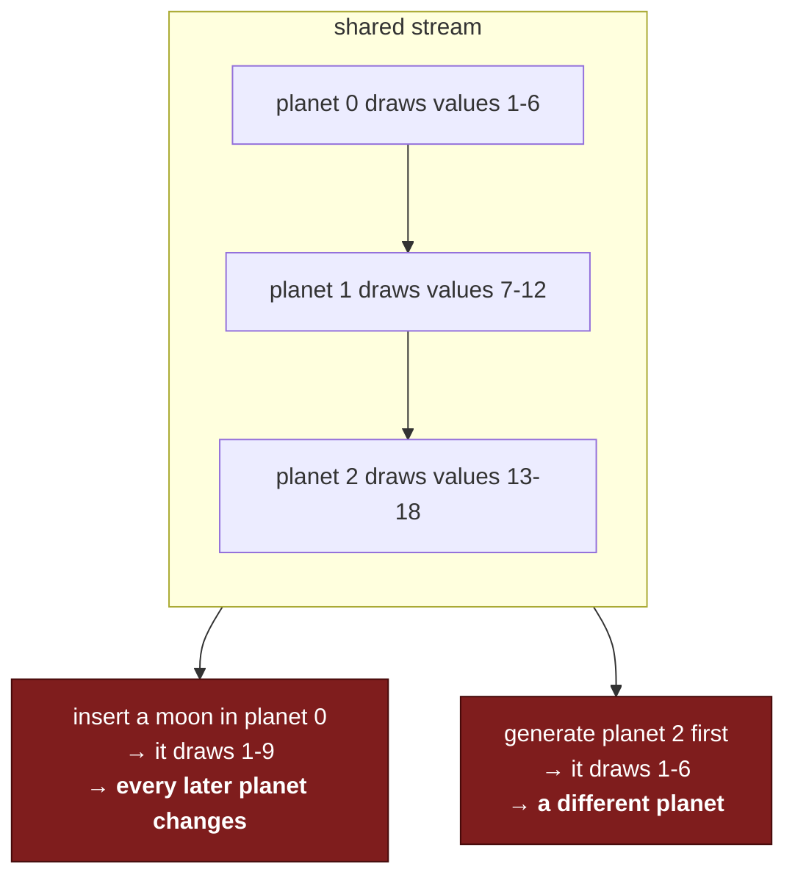
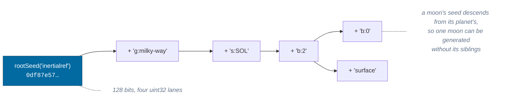
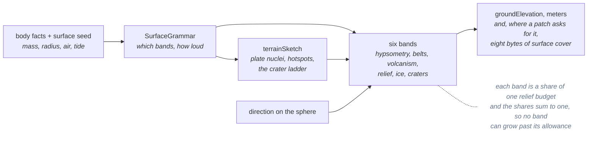

# Determinism

> **The question:** how is the universe identical every time, generated in any
> order, on any machine, with any number of workers?
> **The answer:** content derives from a seed **path**, never from a shared
> stream; the PRNG uses only exactly-specified integer operations; and golden
> vectors make an accidental change fail loudly.
>
> Decision record: [ADR-0005](../adr/0005-procedural-seeds.md) ·
> Code: `packages/procedural/`

---

## The failure this design exists to prevent

Here is the tempting version:

```ts
const rng = new Rng(systemSeed)
for (const planet of planets) {
  planet.mass = rng.next()
  planet.radius = rng.next()
}
```

It is deterministic in the narrow sense — same seed, same output. It is also
unusable, for two reasons:



The second one is fatal for a streaming world: patches are generated in whatever
order workers pick them up, so the planet would depend on which way the player
flew around it.

---

## Path derivation

Content derives from a seed **path** — the [address](identity.md), which is
already the stable identity of the thing being generated.



A body's properties therefore depend **only on its own address**. Not on
traversal order, not on worker count, not on how much of the universe happens to
be loaded, not on what a neighboring client has visited.

The tests assert exactly that, rather than asserting a value:

- Generate the whole star catalog sequentially, then again in **shuffled
  order**, and compare.
- Generate a galactic cell's contents; generate its nine neighbors; regenerate
  the original and compare.
- Sample noise at 200 points in order, then in shuffled order, and compare.

---

## The PRNG, and why this one

**xoshiro128\*\*** — 32-bit state, 2^128 period, and expressible entirely in
`Math.imul`, shifts and XOR.

That last property is the reason. ECMAScript specifies those operations
_exactly_, so Chrome, a Web Worker, Node and a future server produce identical
streams bit for bit. Floating-point-derived randomness makes no such promise,
and a universe that differs subtly between a client and a server is a class of
bug that only appears in production.

| Rejected                               | Why                                                                                                 |
| -------------------------------------- | --------------------------------------------------------------------------------------------------- |
| `Math.random` with a seeded shim       | Not reproducible across engines; the global stream is the order-dependence trap by construction     |
| PCG64 / splitmix64 via BigInt          | Better statistics, ~10× slower — not viable in the terrain inner loop                               |
| One RNG per system, drawn sequentially | Order-independent _between_ systems but not within one; adding a planet still rewrites its siblings |

### Seed derivation has to avalanche

Sibling addresses differ by one character — `b:3` and `b:4`. If their seeds
correlated, adjacent planets would come out suspiciously similar, which reads to
a player as "the generator is fake".

Every lane absorbs every code unit of the label. Measured over 5,000 sibling
derivations: **64.0 of 128 bits differ on average, with no collisions.** The test
asserts the mean lands between 56 and 72.

---

## Stateless noise

Terrain is a pure function of `(surface parameters, direction on the sphere)` —
no stream, no cursor, no accumulated state. The two derivations between the seed
and the field, the grammar and the sketch, are memoized rather than stored: a
cache, never a save ([ADR-0019](../adr/0019-the-geology.md)).



**Stateful erosion is what this rules out**, and it is the one thing that would
buy the look for free. Hydraulic erosion is order- and resolution-dependent: two
patches of the same ground at different levels, or the same patch generated
after a different neighbor, come out different, and ground whose value depends
on who asked first is not a function of an address. The look is bought
analytically instead — each octave damped by how steep the sum already is.

Because it is stateless, the same patch generated on the main thread and in a
worker are byte-identical — which capability check 10 asserts by comparing the
whole response: all 4,761 elevations of a bordered 65×65 patch and all 33,800
bytes of surface cover beside them. The cover matters to the claim rather than
riding along with it, because it is the half that decides what the ground is
_made of_: a worker whose sketch had diverged would draw a different planet
through an identical heightfield.

---

## Golden vectors

`procedural.test.ts` pins exact outputs: the root seed, two derivations, the
first four `uint32`s of a stream, and a noise and an fBm sample.

These are **not** testing that the numbers are right — any stream would do. They
are testing that the numbers _never change_. A silent tweak to the mixing
function would regenerate every player's universe out from under their save
file, and this is the tripwire.

> Changing a golden vector is a deliberate act, and it comes with an algorithm
> version bump in the same commit.

---

## Algorithm versioning

Generators carry an `AlgorithmVersion`. The version is part of what defines the
universe, and a save records the versions it was written with:

```
generation: { galaxy: 2, system: 3, terrain: 2, photometry: 1 }
```

`system` went to 3 when generated systems gained a belt — six to eighteen small
bodies each, issued after every planet. Nothing a save could already point at
moved, because [issue ordinals](../adr/0009-issue-ordinal-addressing.md) are
exactly what stops that; but a system now _contains_ things it did not, and a
manifest that did not say so would let two builds of the game disagree about the
contents of one address space with nothing to notice.

`terrain` went to 2 with the band stack, and `system` deliberately did not move
with it: `makeSurface` draws the same three values in the same order from the
same stream, so the ground under a landed ship is a different number while every
other property of every body in the galaxy is exactly where it was.

So "this save was made with terrain v2" is a statement the loader can act on,
rather than a mystery about why the coastline moved. Deciding _what_ to do about
it — regenerate, pin the old version, migrate content — is future work, but the
information is captured now, which is the part that cannot be added
retroactively.

---

## Determinism in the simulation, not just generation

Generation determinism is only half. The simulation half is enforced by a single
comparison value:

```ts
world.stateHash() // 'f38e988a'
```

A hash over the tick, the seed, and every entity's frame, position, velocity,
orientation, angular velocity, control input, flight assist, landed state and
rails epoch — the instant a coasting entity is propagated from
([ADR-0025](../adr/0025-the-rails.md)). The epoch is in there for the same
reason as the rest: two worlds that agree on a state and not on its epoch agree
about the present and part in the low bits on the next tick, each propagating a
slightly different rounding of the same conic.

Control input, flight assist and landedness were not always in it, and the
docstring said "everything canonical" anyway — so two worlds that differed only in the fields `killRotation`
and flight assist write hashed identically at the instant they diverged, and only
drifted apart hundreds of ticks later once the difference had leaked into
position. That is where a shipped bug had already lived: a save taken mid-burn
resumed coasting, and the persistence test caught it only by stepping 300 further
ticks. If you add a field to canonical state, add it here too.

Every determinism test in the suite is an assertion about it:

| Test                                      | Asserts                                       |
| ----------------------------------------- | --------------------------------------------- |
| 60 Hz vs 144 Hz                           | same hash at the same tick                    |
| jittery frames (4–60 ms) vs steady        | same hash at the same tick                    |
| 1× for 100 s vs 100× for 1 s              | same hash, same simulated time                |
| a coast stepped vs jumped vs 100,000×     | same hash at the same tick                    |
| save → step → load                        | hash returns to the saved value               |
| a coasting save → load → 300 ticks        | same hash, on the same conic                  |
| a descent save → load → 400 ticks         | same hash — the reused ground sample is exact |
| worlds differing only in control input    | different hashes                              |
| worlds differing only in flight assist    | different hashes                              |
| worlds differing only in angular velocity | different hashes                              |
| replay with identical inputs              | same hash                                     |

See [simulation time](time.md) for why the clock makes this possible.

---

## The rules, restated

1. No `Math.random()` in anything canonical.
2. No `Date.now()` or `performance.now()` in anything canonical. Wall clock
   enters at exactly one call.
3. Derive from an address; never draw from a shared stream.
4. If generating object B first can change object A, it is wrong.
5. Changing a generator changes its version, in the same commit.
6. Draw, then override. A `??` that skips the draw makes every later value for
   that object depend on whether the override happened to be present.

---

## Related

- [Identity](identity.md) — the address that doubles as the seed path
- [Time](time.md) — the other half of determinism
- [Persistence](persistence.md) — why determinism means saves are tiny
- [ADR-0005](../adr/0005-procedural-seeds.md) — PRNG selection in full
