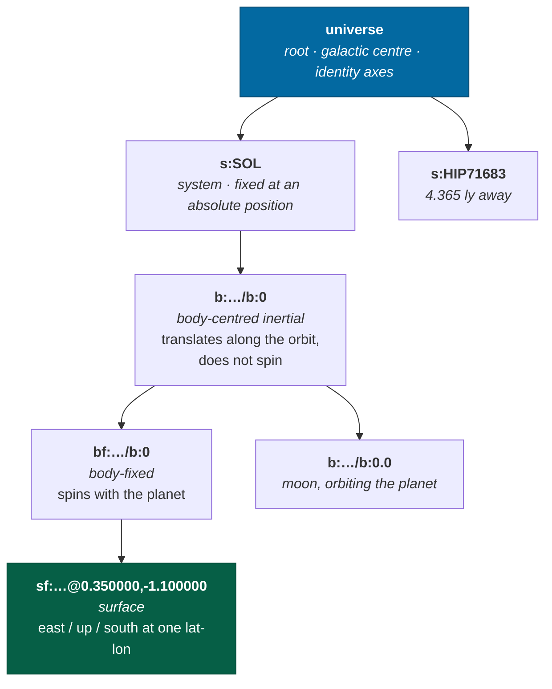
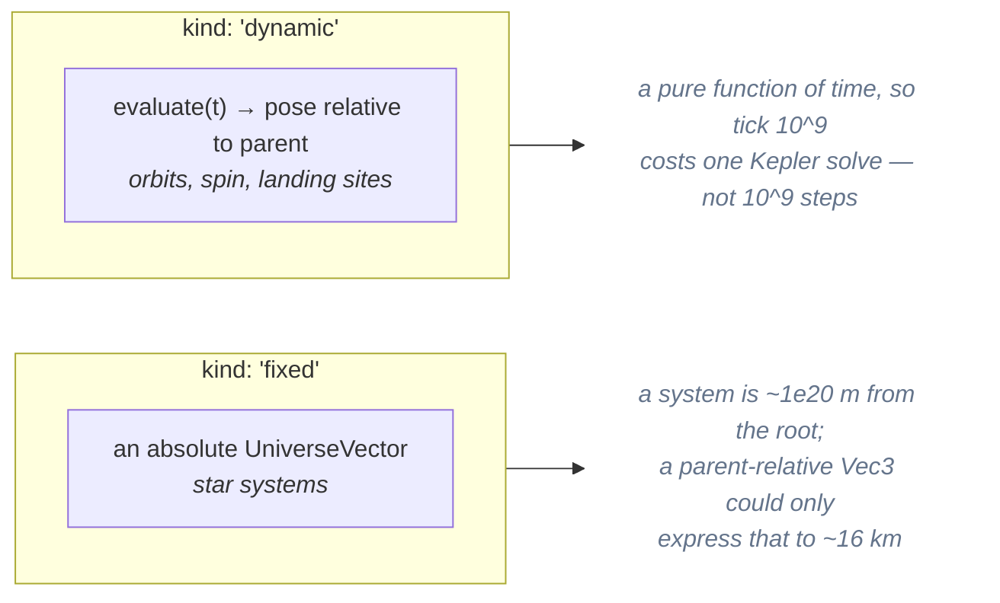
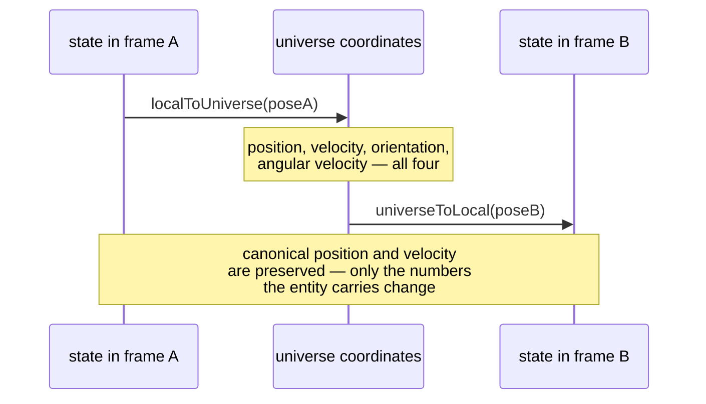
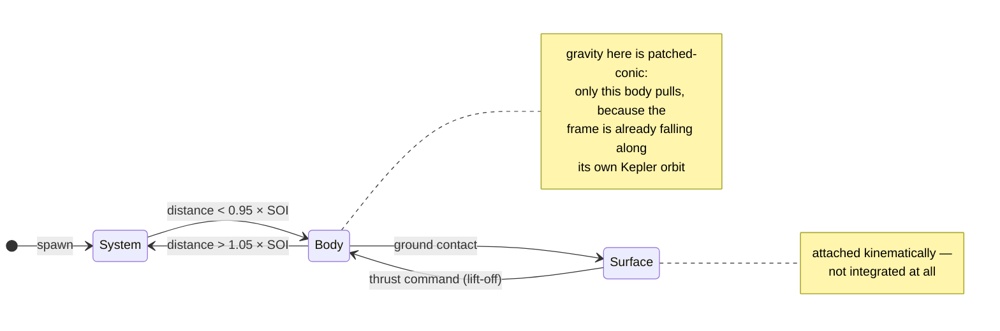

# Reference frames

> **The question:** what does "3 m above the landing pad" mean, while the planet
> orbits its star at 30 km/s and rotates underneath at 465 m/s?
> **The answer:** a tree of frames, where a frame's pose is either an absolute
> position or a pure function of time, and re-expressing a state in another
> frame provably does not move it.
>
> Decision record: [ADR-0002](../adr/0002-reference-frames.md) ·
> Code: `packages/spatial/src/frame.ts`, `packages/universe/src/frames.ts`

---

## Frames are not the precision mechanism

Most engines that span large scales use nested frames to *rescue* floating-point
precision — coordinates stay small because they are relative to something
nearby. InertialRef does not need that, because
[coordinates](coordinates.md) are already sub-millimetre everywhere.

That changes what frames are for. Here they exist for two jobs:

1. **The semantics of motion.** A point at rest on a rotating planet is not at
   rest. Something has to carry that.
2. **A stable local origin** for physics and rendering to work near.

And it produces the property the vertical slice had to demonstrate: because
precision does not depend on which frame you are in, **a frame change is a pure
re-expression**. The numbers an entity carries change; where it is does not.

---

## The tree



Three frames exist per body, and the distinction is load-bearing:

| Prefix | Frame | Spins? | Who lives here |
|---|---|---|---|
| `b:` | body-centred **inertial** | no | satellites, approaching ships, anything integrating |
| `bf:` | body-**fixed** | yes | terrain, anything bolted to the ground |
| `sf:` | **surface** tangent plane at one lat/lon, +Y up | with the body | landed ships, metre-scale gameplay |

A ship's frame chain reads top-down in the debug overlay, which is often the
fastest way to understand what the simulation thinks is happening:

```
universe › s:SOL › b:g:milky-way/s:SOL/b:0 › bf:g:milky-way/s:SOL/b:0 › sf:g:milky-way/s:SOL/b:0@0.350000,-1.100000
```

---

## How a frame knows where it is

Two kinds of anchor, and the split matters:



`spatial` never learns what an orbit is. The evaluator is a closure supplied by
`universe`, which is where Kepler lives. Installing a whole system's frames is
therefore cheap — it defines closures, it does not evaluate them — so a system
can be installed on approach and removed when it leaves the interest set with no
generation work at the boundary.

Poses are cached per instant, because a tick resolves the same handful of frames
for every entity in them, and an orbital frame's evaluator runs a Kepler solve.

---

## Composition, and the term everyone forgets

Composing a parent's universe pose with a child's parent-relative pose is not
just adding positions and multiplying quaternions. The **transport theorem** term
is what makes standing still on a planet work:

```
velocity = parentVelocity
         + rotate(parentOrientation, localVelocity)
         + cross(parentAngularVelocity, offset)     ← this one
```

That third term is the tangential velocity a child inherits from a rotating
parent. With it, a point at rest in a body-fixed surface frame automatically
moves at orbital-plus-rotational speed in universe axes — **nothing integrates
it, and nothing has to know the number 465 m/s**.

You can watch this in the HUD: a landed ship reads `0.0 m/s local` and
`51,853 m/s universe` at the same instant. Both are true; they are answers to
different questions.

---

## Frame transitions

`reframe(graph, state, target, t)` re-expresses a state in another frame at the same
instant, via universe coordinates:



The simulation does this automatically as a ship crosses a **sphere of
influence** boundary, with hysteresis so a grazing pass cannot flap:



Descent is checked before ascent: being inside a moon's SOI is more specific
than being inside its planet's, and checking children first gets that ordering
right without a special case.

Verified in the browser, mid-flight:

```
b:g:milky-way/s:SOL/b:0 → s:SOL (left sphere of influence)
```

---

## Two rules that follow

### Ships integrate only in non-rotating frames

Integrating in a rotating frame without Coriolis and centrifugal terms is simply
wrong, and adding those terms is a lot of subtle code to support one case. So a
landed ship is **attached kinematically** to a surface frame and not integrated
at all. Lifting off hands it back to the body-centred inertial frame, and
`reframe` supplies the ground speed it inherits.

That is the machinery paying for itself: the ship leaves the pad already doing
several hundred metres per second, and no line of code computes that.

### Local coordinates are only meaningful near their frame

A frame-local `Vec3` is a double. Express a point in a frame four light-years
away and it degrades to metres. This is documented by a test rather than hidden:

> `frame.test.ts` → *"degrades predictably when a position is expressed in a
> far-away frame"* — asserts the error is **greater than** the coordinate
> resolution and bounded, and that canonical position is preserved regardless.

If that test ever starts passing with a tiny error, something has started
treating a frame-local vector as canonical.

---

## Surface frames and the identity trap

Surface frames are minted on landing, named after their body and lat/lon, and
**regenerated from their id** when a save is loaded. That imposes a requirement
that took three attempts to get right:

> **The id must determine the frame completely.**

Two bugs came from violating it:

1. Angles were formatted with `toFixed(6)`, but `(-1e-9).toFixed(6)` is
   `"-0.000000"`, which re-parses to `-0`, which formats as `"0.000000"`. The id
   was not idempotent, and a ship landed a hair south of the equator could not be
   restored at all.
2. The frame's *geometry* was built from unrounded angles while its id was
   rounded, and the ground elevation was passed in by the caller. A restored
   landing site sat half a metre — then 21 mm — from the original.

Both are fixed by the same principle: quantise the angles, derive the elevation
from the quantised direction, and let the entity's local position absorb the
residual.

The formatter and the parser now sit in the same module —
`surfaceFrameId` and `parseSurfaceFrameId`, both in `universe/frames.ts` — which
is what makes the round trip expressible as a property test rather than a
convention. The parser used to be open-coded in `World.ensureFrame`, a package
below, with a `lastIndexOf('@')` and a `split(',')` and no counterpart to the
`-0` collapse the formatter carries a comment about. It was on the load path for
every save with a landed ship, which is precisely the path both bugs above broke.

---

## Related

- [Coordinates](coordinates.md) — why frames do not need to carry precision
- [Time](time.md) — frames are evaluated at a simulation instant, including
  fractional render times
- [Streaming](streaming.md) — installing and removing a system's frames
- [ADR-0002](../adr/0002-reference-frames.md) — alternatives and consequences
