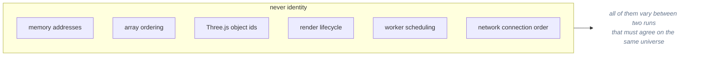
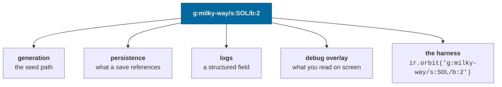
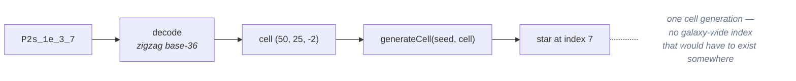
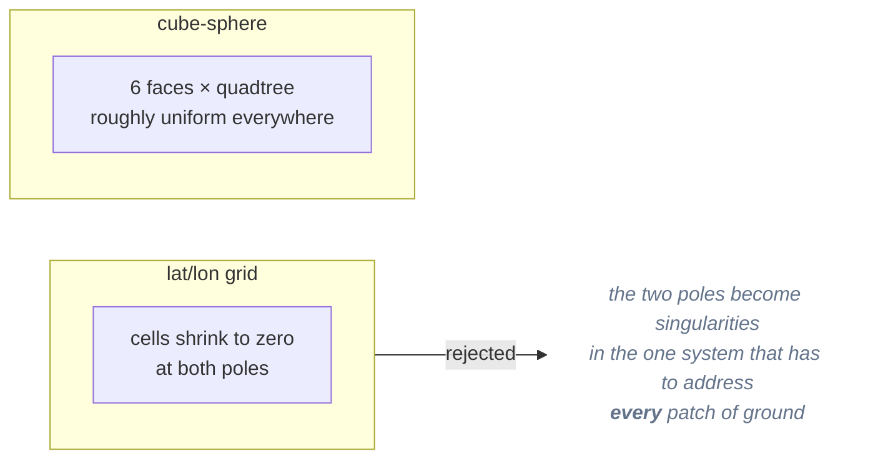

# Identity and addressing

> **The question:** how does a star have a stable name before it is generated,
> after it is unloaded, and in a save file written a year ago?
> **The answer:** identity _is_ a path through the containment hierarchy — which
> is also the seed path, the save reference, the log field and the console
> argument.
>
> Decision record: [ADR-0004](../adr/0004-entity-addressing.md) ·
> Code: `packages/universe/src/address.ts`

---

## The constraint

A procedurally generated universe has no database to hand out ids from. And the
spec is explicit about what identity must **not** derive from:



The thing that _is_ stable is where something sits in the universe.

---

## The scheme

Slash-separated, typed segments:

```
g:milky-way                                       a galaxy
g:milky-way/s:HIP71683                            a star system
g:milky-way/s:HIP71683/b:2                        the third planet
g:milky-way/s:HIP71683/b:2.0                      its first moon
g:milky-way/s:HIP71683/b:2/r:3.6.12.44            a surface region
g:milky-way/s:HIP71683/b:2/r:3.6.12.44/o:7        an object in that region
```

| Segment | Meaning                                                          |
| ------- | ---------------------------------------------------------------- |
| `g:`    | galaxy id                                                        |
| `s:`    | system id — a catalogue designation or an encoded cell reference |
| `b:`    | orbital index path; `2.0` is "third planet, first moon"          |
| `r:`    | cube-sphere region: `face.level.i.j`                             |
| `o:`    | object index within a region                                     |

Parsing and formatting round-trip exactly, which a property test asserts across
randomly generated addresses of every kind.

---

## One string, five jobs



This is the property that pays off daily: **anything nameable is scriptable**. A
bug report can be a single string, pasted into a console, reproducing the exact
body in the exact universe.

---

## Two flavours of entity id

Runtime entities carry an `EntityId`, distinguishable at a glance:

| Form                     | Meaning                                                            |
| ------------------------ | ------------------------------------------------------------------ |
| `@g:milky-way/s:SOL/b:2` | a **generated** thing — its identity _is_ its address              |
| `#7`                     | a **dynamic** thing (a player ship) with no address to derive from |

Dynamic ids come from a counter stored in the save, not a UUID. A random id
would make two replays of the same session disagree; the counter is exactly as
unique while staying deterministic.

---

## Resolution without an index

A procedural star's id encodes the generation cell it lives in plus its index
within that cell:



Catalogue stars use their real designation (`HIP71683`), so the two id spaces
coexist and `resolveSystem` tries the catalogue first.

The consequence: a save can reference a system nobody has ever visited, and
loading it costs one cell generation rather than a lookup in a table that would
have to have been built by exhaustively enumerating a galaxy.

---

## Regions: a cube-sphere, not lat/lon

Surface regions are quadtree cells on a cube projected onto a sphere.



Level _n_ has 2^n cells per side per face. `regionForDirection(direction, level)`
maps a direction to its region, and `regionDirection(region, s, t)` maps back.

The 1e-12 property test is on the layer below — `directionToFace` ⇄
`faceToDirection`. `regionForDirection` is checked against
`regionCentreDirection` to within one region's angular half-width, which is the
strongest thing that can be true of a map that quantises.

Both `regionDirection` and `faceToDirection` return a branded
`BodyFixedDirection`, which is what makes it impossible to hand `surfaceRadius`
an inertial direction.

---

## The tradeoffs

**Buys**

- Identity exists before generation and survives unloading.
- Generation, persistence, logging and tooling share one vocabulary.
- No registry, no id allocation, no synchronisation between clients.

**Costs**

- Addresses are long: 28 characters where an integer would be 4. They compress
  well and appear once per entity in a save.
- Bodies are addressed by **orbital index**, so changing how a system lays out
  its orbits renames its planets. That is what
  [algorithm versioning](determinism.md#algorithm-versioning) is for: the rename
  becomes deliberate and detectable rather than silent.

---

## Related

- [Determinism](determinism.md) — the address as seed path
- [Persistence](persistence.md) — what a save stores instead of content
- [ADR-0004](../adr/0004-entity-addressing.md) — rejected alternatives
