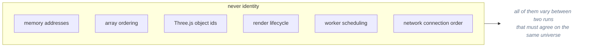
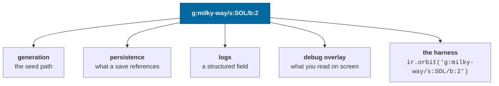
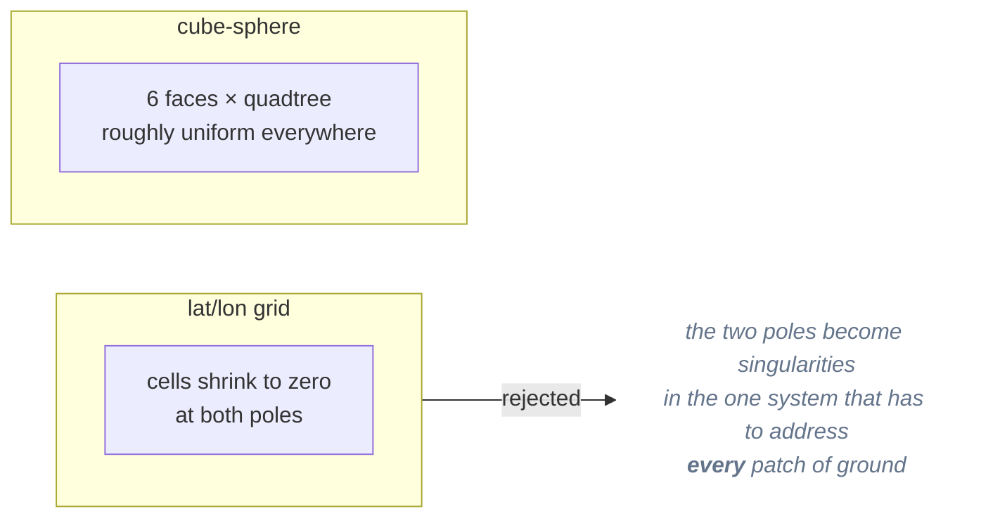

# Identity and addressing

> **The question:** how does a star have a stable name before it is generated,
> after it is unloaded, and in a save file written a year ago?
> **The answer:** identity _is_ a path through the containment hierarchy — which
> is also the seed path, the save reference, the log field and the console
> argument.
>
> Decision records: [ADR-0004](../adr/0004-entity-addressing.md),
> [ADR-0038](../adr/0038-the-stars-and-the-diffuse-sky.md) ·
> Code: `packages/universe/src/address.ts`

---

## The constraint

A procedurally generated universe has no database to hand out ids from. And the
spec is explicit about what identity must **not** derive from:



The thing that _is_ stable is where something sits in the universe.

---

## The scheme

Slash-separated, typed segments:

```
g:milky-way                                       a galaxy
g:milky-way/s:HIP71683                            a star system
g:milky-way/s:HIP71683/b:2                        the third body issued
g:milky-way/s:HIP71683/b:2.0                      its first moon
g:milky-way/s:HIP71683/b:2/r:3.6.12.44            a surface region
g:milky-way/s:HIP71683/b:2/r:3.6.12.44/o:7        an object in that region
```

| Segment | Meaning                                                        |
| ------- | -------------------------------------------------------------- |
| `g:`    | galaxy id                                                      |
| `s:`    | system id — a catalog designation or an encoded cell reference |
| `b:`    | issue-ordinal path; `2.0` is the first moon of the third body  |
| `r:`    | cube-sphere region: `face.level.i.j`                           |
| `o:`    | object index within a region                                   |

Parsing and formatting round-trip exactly, which a property test asserts across
randomly generated addresses of every kind.

---

## One string, five jobs



This is the property that pays off daily: **anything nameable is scriptable**. A
bug report can be a single string, pasted into a console, reproducing the exact
body in the exact universe.

---

## Two flavors of entity id

Runtime entities carry an `EntityId`, distinguishable at a glance:

| Form                     | Meaning                                                            |
| ------------------------ | ------------------------------------------------------------------ |
| `@g:milky-way/s:SOL/b:2` | a **generated** thing — its identity _is_ its address              |
| `#7`                     | a **dynamic** thing (a player ship) with no address to derive from |

Dynamic ids come from a counter stored in the save, not a UUID. A random id
would make two replays of the same session disagree; the counter is exactly as
unique while staying deterministic.

---

## Resolution without an index

Procedural systems use two address families. The active population uses `Q`
ids containing a luminosity level, spatial cell and ordinal. Nine luminosity
levels have cell widths that double from 20 light-years. A bright source can
therefore be found without generating every faint star between it and the eye.
`resolveSystem` decodes the id and regenerates that level's cell plan; there is
no galaxy-wide index.

A source's seed uses its population and its index within that population. Its
address uses the combined ordinal within the level and cell. Those are different
numbers: changing a population count can move address ordinals even when a
source's own seed path stays fixed. The active `galaxy@5` and `galaxy-field@5`
revisions declare that generation policy. Versions identify drift; they do not
select an archived generator. An ordinal absent from the current plan fails
resolution explicitly. [ADR-0038](../adr/0038-the-stars-and-the-diffuse-sky.md)
owns this contract.

Legacy `P` ids, such as `P2s_1e_3_7`, encode a 20 light-year cell and an index.
They retain their legacy generator so existing destinations remain resolvable.
New surveys issue `Q` ids. Catalog systems keep measured designations such as
`HIP71683`, and `resolveSystem` tries the explicit catalog before either
procedural family.

Stable identity requires the seed, generation manifest and catalog input to
agree. A save may name an unvisited system without storing its generated
contents, but the address alone cannot promise the same world across a change
of those inputs. See [persistence](persistence.md) for drift reporting.

---

## Regions: a cube-sphere, not lat/lon

Surface regions are quadtree cells on a cube projected onto a sphere.



Level _n_ has 2^n cells per side per face. `regionForDirection(direction, level)`
maps a direction to its region, and `regionDirection(region, s, t)` maps back.

The 1e-12 property test is on the layer below — `directionToFace` ⇄
`faceToDirection`. `regionForDirection` is checked against
`regionCentreDirection` to within one region's angular half-width, which is the
strongest thing that can be true of a map that quantizes.

Both `regionDirection` and `faceToDirection` return a branded
`BodyFixedDirection`, which is what makes it impossible to hand `surfaceRadius`
an inertial direction.

---

## The tradeoffs

**Buys**

- Identity exists before generation and survives unloading.
- Generation, persistence, logging and tooling share one vocabulary.
- No registry, no id allocation, no synchronization between clients.

**Costs**

- Addresses are long: 28 characters where an integer would be 4. They compress
  well and appear once per entity in a save.
- A body's index is the ordinal it was **issued** at, not its orbital position
  ([ADR-0009](../adr/0009-issue-ordinal-addressing.md)). That is what keeps a
  newly confirmed planet from renaming every world outward of it — but it means
  indices are sparse, they accumulate tombstones, and `b:2` is not "the third
  planet" and must never be presented as one. Sol shows the cost plainly: its
  fifty-nine dwarf planets, asteroids and comets are issued _after_ the eight
  planets, so Ceres is `b:8` and orbits between `b:3` and `b:4`.

---

## Related

- [Determinism](determinism.md) — the address as seed path
- [Persistence](persistence.md) — what a save stores instead of content
- [ADR-0004](../adr/0004-entity-addressing.md) — rejected alternatives
