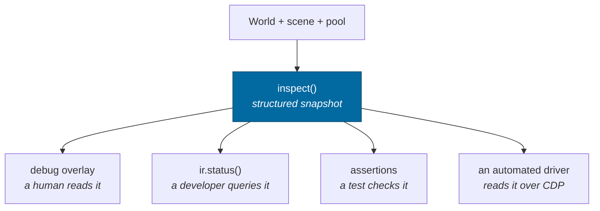
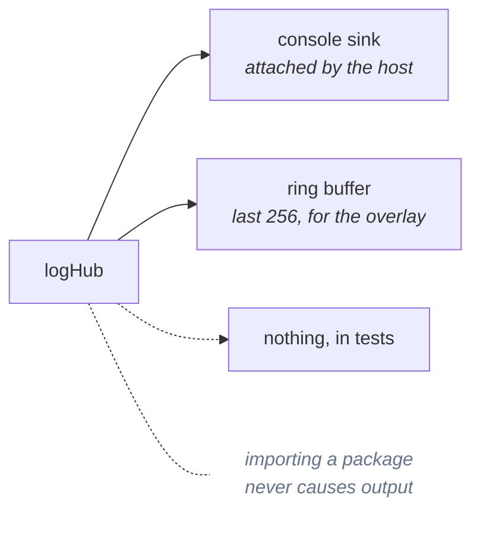

# Observability

> **The question:** how do you debug a coordinate system you cannot see, content
> that does not exist until it is asked for, and work happening on four other
> threads?
> **The answer:** build the tooling first. Every invisible thing is a structured
> field, and the same structure feeds the on-screen overlay, the console, the
> tests and an automated driver.
>
> Code: `packages/devtools/`, `packages/shared/src/log.ts`

---

## One structure, four consumers



Because the overlay and the tests read the *same* structure, what a human sees
and what a check asserts cannot drift apart. Adding a field to the inspection
makes it visible in all four places at once.

---

## What is inspectable

Twelve things have to be visible for this architecture to be debuggable at
all. All twelve are:

| | Field | Example |
|---|---|---|
| 1 | canonical entity id | `#0` |
| 2 | universe address | `(dynamic)` or `g:milky-way/s:SOL/b:2` |
| 3 | reference frame | `sf:g:milky-way/s:SOL/b:0@0.350000,-1.100000` |
| | frame **chain** | `universe › s:SOL › b:… › bf:… › sf:…` |
| 4 | local coordinates | `0.00, 3.00, 0.00 m` |
| 5 | canonical coordinates | `[-229507999,583732,-1]+(932659…, …)` |
| 6 | velocity | `0.0 m/s local · 51853.5 m/s universe` |
| 7 | simulation tick | `257334 · 1.12 h` |
| 8 | seed | `inertialref · 0df87e571806…` |
| 9 | active LOD | `Sol I  surface · 2865.046 km` |
| 10 | loaded region | `g:milky-way/s:SOL/b:0` |
| 11 | network authority | `s:SOL` (partition key — no networking yet) |
| 12 | worker queue state | `4w · 0 active · 0 queued · 25 done · q 9.2ms · run 11.3ms` |

Plus the state hash, dropped ticks, origin rebase count, frame timing and a
rolling event log.

### The one that keeps paying off

Showing **local and universe velocity side by side**. A landed ship reads
`0.0 m/s local · 51853.5 m/s universe`, and that single line explains the entire
frame system to a newcomer in a way no paragraph does. It also caught a bug: a
test asserted the wrong one, which is how frame-relative speed came to be
reported at all.

---

## Structured logging

Records carry fields, not interpolated prose:

```
[simulation.world] system loaded { seed: 'inertialref', system: 'HIP71683', planets: 9 }
```



**Records have a sequence number and no wall-clock timestamp.** Wall time is the
one field guaranteed to differ between two runs that are otherwise identical, so
including it would make logs undiffable — and diffing two runs is the single
most useful thing you can do with a log in a deterministic system. The console
sink adds elapsed time for humans; the ring buffer, which is what gets dumped
into a bug report, does not.

---

## The state hash

```
state hash  f63b48a4
```

Eight characters that answer "are these two universes the same?". It is the
comparison every determinism test makes, it is on screen so a human can compare
two tabs, and it is the natural desync check if a server ever appears.

---

## The harness

`window.ir` in the browser; the same object in the Node runner. Set up a
scenario, step deterministically, read structured state back.

```js
ir.summary()                     // one line
ir.status()                      // everything, structured
ir.orbit('g:milky-way/s:SOL/b:2', 400)
ir.step(20000)
await ir.selfTest()              // the twelve capability checks
```

Full reference: [guides/harness.md](../guides/harness.md).

The reason it lives in a package rather than the app: **a scenario that
reproduces a bug in Chrome replays in a test.** That has already happened
several times during development — the frame-transition and save-round-trip bugs
were both found by driving the browser and then pinned by a Node test.

---

## Capability checks

Twelve executable assertions about the architecture, runnable against the live
build:

```
PASS  7. Precision near the surface — 1 inch resolved to 9.4 µm, 8.18 kpc from the galactic centre
PASS  9. Origin rebasing — 500 rebases, 2560 km of origin travel, zero drift
PASS 10. Worker task — 4225 terrain samples generated in a worker, identical to local generation
```

They report **measurements, not "OK"**. That distinction is not cosmetic: check
5 originally passed while reporting *"fell from 57287 km to 57287 km"* — a
vacuously green tick. It now compares the fall against the analytic free-fall
prediction and agrees to 0.03%.

> A self-test that cannot fail informatively is worse than no self-test, because
> it converts an unknown into a false assurance.

---

## Related

- [Testing](../guides/testing.md) — where these ideas turn into test style
- [Harness](../guides/harness.md) — the full API
- [Determinism](determinism.md) — what the state hash is for
