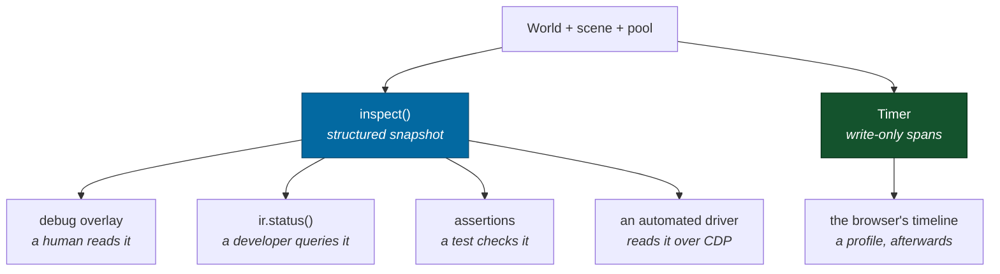
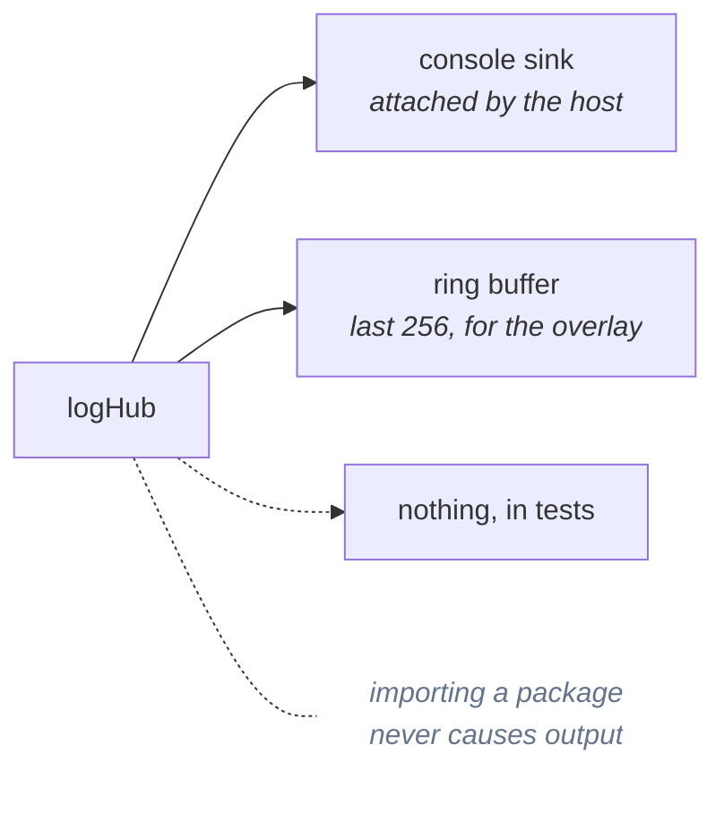

# Observability

> **The question:** how do you debug a coordinate system you cannot see, content
> that does not exist until it is asked for, and work happening on four other
> threads?
> **The answer:** build the tooling first. Every invisible thing is a structured
> field, and the same structure feeds the on-screen overlay, the console, the
> tests and an automated driver.
>
> Code: `packages/devtools/`, `packages/shared/src/log.ts`

---

## One structure, five consumers



Because the overlay and the tests read the _same_ structure, what a human sees
and what a check asserts cannot drift apart. Adding a field to the inspection
makes it visible in all four of those at once.

**The fifth consumer is the timeline, and it is a different shape on purpose.**
`inspect()` answers "what is true now" and hands the answer back; a `Timer`
answers "when did that happen" and hands nothing back at all — `Span.end()`
returns `void`, which is what lets canonical code emit to it without any
canonical value becoming a function of wall time. Everything else here is a
structure something reads; this is a structure something writes.

It exists because the instruments above share no time axis. A worker job's
9–37 ms lives in a mean over the last 64 jobs and the frame it starved lives in
a p95 over the last 240 frames, so "the frame at _t_ was slow" and "a heightfield
landed at _t_" cannot be put beside each other. The timeline is not a seventh
instrument; it is the shared axis the other six are missing.

The split to hold on to: the performance panel answers _"is it fast right now"_
while you fly, and the timeline answers _"why was that frame slow"_ afterwards.
The panel is better at p95 against a drawn budget and at stating an absence
honestly; a timeline reproduces both badly. `ir.profile(ms)` is the terminal's
door onto it, and `pnpm timing` reads a recorded trace.
[ADR-0022](../adr/0022-the-timeline.md) has the reasoning.

---

## What is inspectable

Twelve things have to be visible for this architecture to be debuggable at
all. All twelve are:

|     | Field                 | Example                                                     |
| --- | --------------------- | ----------------------------------------------------------- |
| 1   | canonical entity id   | `#0`                                                        |
| 2   | universe address      | `(dynamic)` or `g:milky-way/s:SOL/b:2`                      |
| 3   | reference frame       | `sf:g:milky-way/s:SOL/b:0@0.350000,-1.100000`               |
|     | frame **chain**       | `universe › s:SOL › b:… › bf:… › sf:…`                      |
| 4   | local coordinates     | `0.00, 3.00, 0.00 m`                                        |
| 5   | canonical coordinates | `[-229507999,583732,-1]+(932659…, …)`                       |
| 6   | velocity              | `0.0 m/s local · 51853.5 m/s universe`                      |
| 7   | simulation tick       | `257334 · 1.12 h`                                           |
| 8   | seed                  | `inertialref · 0df87e571806…`                               |
| 9   | active LOD            | `Sol I  surface · 2865.046 km`                              |
| 10  | loaded region         | `g:milky-way/s:SOL/b:0`                                     |
| 11  | network authority     | `s:SOL` (partition key — no networking yet)                 |
| 12  | worker queue state    | `4w · 0 active · 0 queued · 25 done · q 9.2ms · run 11.3ms` |

Plus the state hash, dropped ticks, origin rebase count, frame timing and a
rolling event log.

### The one that keeps paying off

Showing **local and universe velocity side by side**. A landed ship reads
`0.0 m/s local · 51853.5 m/s universe`, and that single line explains the entire
frame system to a newcomer in a way no paragraph does. It also caught a bug: a
test asserted the wrong one, which is how frame-relative speed came to be
reported at all.

---

## Structured logging

Records carry fields, not interpolated prose:

```
[simulation.world] system loaded { seed: 'inertialref', system: 'HIP71683', planets: 9, bodies: 18 }
```



**Records have a sequence number and no wall-clock timestamp.** Wall time is the
one field guaranteed to differ between two runs that are otherwise identical, so
including it would make logs undiffable — and diffing two runs is the single
most useful thing you can do with a log in a deterministic system. The console
sink adds elapsed time for humans; the ring buffer, which is what gets dumped
into a bug report, does not.

---

## The state hash

```
state hash  f38e988a
```

Eight characters that answer "are these two universes the same?". It is the
comparison every determinism test makes, it is on screen so a human can compare
two tabs, and it is the natural desync check if a server ever appears.

---

## The harness

`window.ir` in the browser; the same object in the Node runner. Set up a
scenario, step deterministically, read structured state back.

```js
ir.summary() // one line
ir.status() // everything, structured
ir.orbit('g:milky-way/s:SOL/b:2', 400)
ir.step(20000)
await ir.selfTest() // the twelve capability checks
ir.timing('trace') // off | trace | full — what reaches the timeline
await ir.profile(2000) // arm, record, disarm; `.text` is the answer
```

Full reference: [guides/harness.md](../guides/harness.md).

The reason it lives in a package rather than the app: **a scenario that
reproduces a bug in Chrome replays in a test.** That has already happened
several times during development — the frame-transition and save-round-trip bugs
were both found by driving the browser and then pinned by a Node test.

What makes that possible is that every host is assembled the same way, by
`openSession`: seed → system → target → ship → pool → store → harness, once,
instead of five times. And the host port is split so a host answers only what it
has a concept of — `SimulationHost` (`world`, `player`, `pool`, `replaceWorld`)
for everyone, `PresentationHost` (`scene`, `frameStats`) only for a host that
draws. The headless runner used to satisfy a single wide port by returning
`null` twice and throwing once.

One detail on that port is an observability property rather than a style choice:
`world` is a **getter**. A host that captured the reference kept the debug
overlay reporting on the world a load had just discarded, while the frame loop
ran the new one — which looked exactly like "load silently does nothing".

---

## Capability checks

Twelve executable assertions about the architecture, runnable against the live
build:

```
PASS  7. Precision near the surface — 1 inch resolved to 9.4 µm, 8.18 kpc from the galactic center
PASS  9. Origin rebasing — 500 rebases, 2560 km of origin travel, zero drift
PASS 10. Worker task — 4761 elevations and 16900 cover bytes generated in a worker, identical to local generation
```

They report **measurements, not "OK"**. That distinction is not cosmetic: check
5 originally passed while reporting _"fell from 57287 km to 57287 km"_ — a
vacuously green tick. It now compares the fall against the analytic free-fall
prediction and agrees to 0.03%.

> A self-test that cannot fail informatively is worse than no self-test, because
> it converts an unknown into a false assurance.

---

## Related

- [Testing](../guides/testing.md) — where these ideas turn into test style
- [Harness](../guides/harness.md) — the full API
- [Determinism](determinism.md) — what the state hash is for
