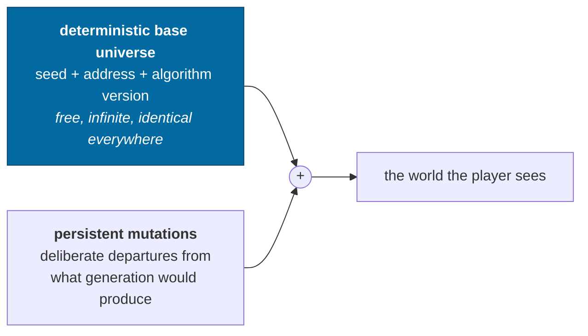
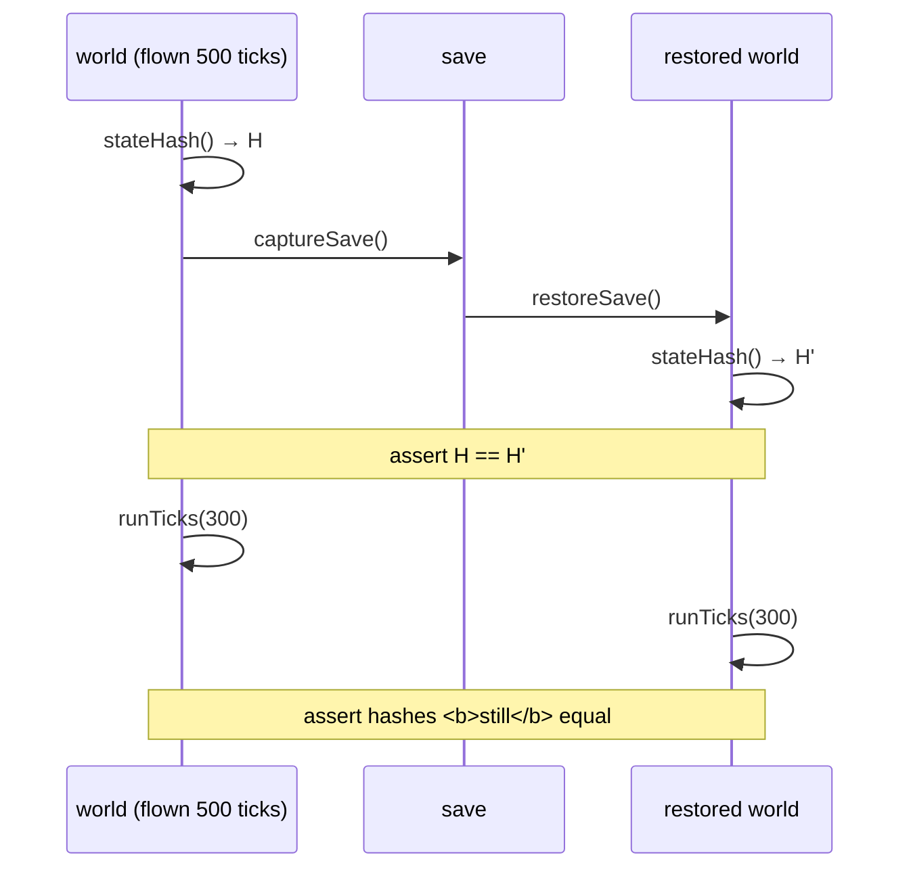
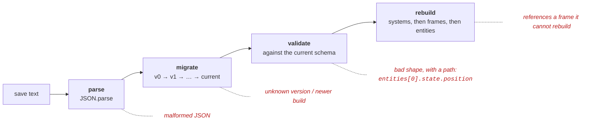
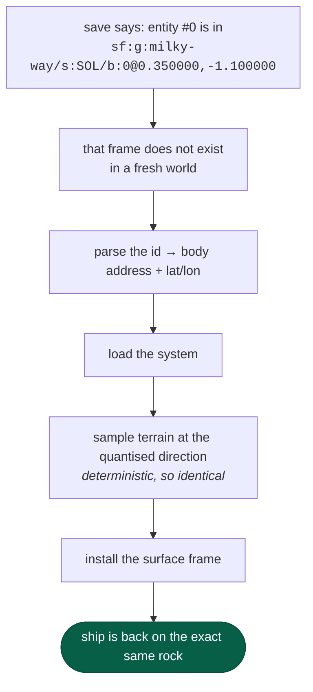
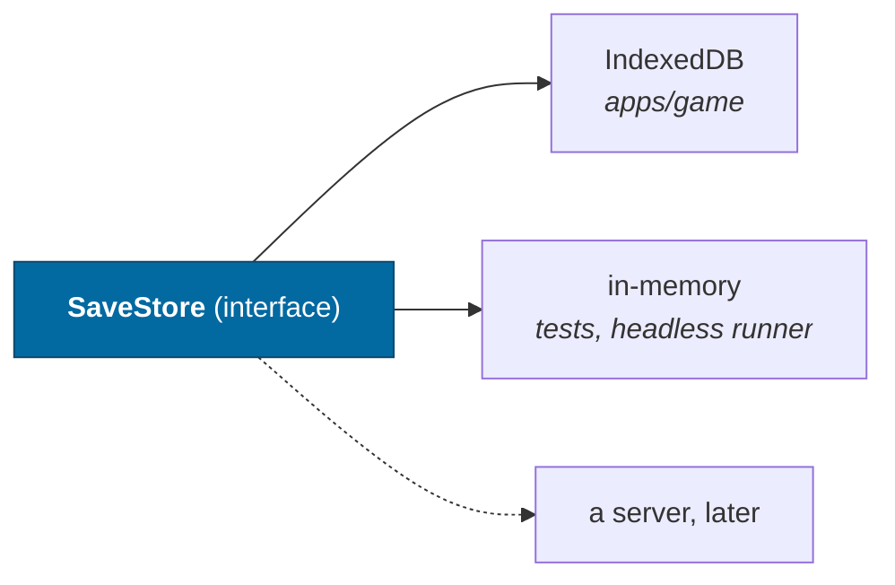

# Persistence

> **The question:** what is worth storing, when the entire universe can be
> regenerated from a seed?
> **The answer:** the seed, the tick, and the handful of things that have no
> address to regenerate from. Under **a kilobyte** — 998 in the self-test's
> save — of which the coasting ship's epoch is about 180, because the instant
> it is propagated from is canonical too
> ([ADR-0025](../adr/0025-the-rails.md)).
>
> Decision record: [ADR-0007](../adr/0007-persistence.md) ·
> Code: `packages/persistence/`, `packages/protocol/src/save.ts`

---

## The model



Storing generated content would be storing a **cache** — one that goes stale the
moment a generator changes, and that is measured in terabytes if the player
travels. So a save contains:

| Stored                    | Not stored                |
| ------------------------- | ------------------------- |
| global seed, galaxy id    | every planet, moon, orbit |
| simulation tick           | every star                |
| algorithm versions        | any heightfield           |
| dynamic entities (ships)  | any terrain mesh          |
| a coasting ship's epoch   |                           |
| which systems were loaded | anything with an address  |
| mutations                 |                           |

A test asserts the shape of that claim rather than trusting it: the serialized
save must be **under 2 KB** and must not contain the string `elevations`.

---

## The test that actually matters

Not "does the file have the right fields". This:



Round-tripping to an identical [state hash](determinism.md#determinism-in-the-simulation-not-just-generation),
and then _staying in step_ when both are stepped further. The second half is
what catches state that was restored but not restored _completely_.

It caught exactly that: **control input** was missing from the save, so a save
taken mid-burn resumed coasting. The hashes matched at rest and diverged 300
ticks later. Control input is canonical state, not a UI detail.

**A coasting ship's epoch is in the save for that same reason.** It is the
instant the two-body propagation runs from ([ADR-0025](../adr/0025-the-rails.md)),
and a world that dropped it and re-anchored on the restored state would follow a
marginally different rounding of the same conic — identical at rest, apart in
the low bits three hundred jumped ticks later. The second half of the test is
what makes that a failure rather than a curiosity.

---

## Loading is three separable stages



Each stage fails distinguishably, and every failure is a `Result` rather than a
throw — data arriving from storage is not programmer error, and the caller must
be made to consider it.

**Migrations operate on raw, unvalidated data** and are never typed against the
current interfaces. A migration written against today's `SaveGame` silently
changes meaning the day that interface changes. Keeping them separate lets the
validator stay strict instead of decaying into "these fields are probably
there".

A save from a **newer** schema is refused, not best-effort loaded. It may
contain state this build cannot represent, and silently dropping it loses a
player's progress.

### The v0 migration exists on purpose

v0 never shipped to anyone; it was the shape the game had for about an hour. It
is kept because **a migration chain with no migrations in it is a chain nobody
has ever run**, and the first real migration should not be the first one
executed in anger.

---

## Regeneration on load

Anything a save references must be rebuildable from its identifier:



This is the persistence model working as intended — _store the reference,
regenerate the content_ — and it is why the frame id has to determine the frame
completely. See [frames](frames.md#surface-frames-and-the-identity-trap) for the
two bugs that taught us so.

---

## Storage is a port



IndexedDB rather than localStorage: localStorage is a synchronous 5 MB box that
blocks the main thread — fine for 750 bytes, wrong the moment terrain mutations
arrive. Starting there avoids a migration later.

Verified in Chrome: save → step 500 ticks → load → hash returns to the saved
value.

---

## Preferences are not a save

A save stores references and mutations to a universe. Where somebody put a
panel, which lens they chose and what they rebound `F` to are none of those, so
they are not in one — and the two have opposite requirements. A save must be
portable between machines and versions and is therefore validated as a whole; a
preference must survive a rename of the thing it names, individually, because
losing a layout to a changed panel id is a worse outcome than losing the panel.

`apps/game/src/state/preferences.ts` is the registry, and **it holds the only
`localStorage` call in `apps/game/src`**. That is an invariant rather than a
convention. Every key is declared there once — default, guard, `revive`,
`migrate`, and a group — and a call site takes the _definition_ rather than a
key string, so naming a preference that does not exist is a name that does not
resolve rather than a typo that silently reads `undefined`.

The reason the calls cannot be spread out is that three things each need the
whole set:

- **The census.** An export is a list of what is stored, so something has to be
  able to enumerate the keys. Guarding each one on the way in is not enough on
  its own: without a list, a layout somebody arranged lives on one browser
  profile and nowhere else.
- **The import.** Every entry is validated by its own guard and the ones that
  fail are named, because a file from another build carries keys this one has
  never heard of and "2 dropped" with no list is a dialog nobody can act on.
- **The live subscription.** Applying an import reaches every mounted hook
  through `usePersistentState`, so nothing reloads — and a reload here rebuilds
  the `WebGPURenderer` and loses the camera, which is the cost this app pays to
  avoid everywhere else.

An export carries what somebody **chose**, never the defaults. An absent key
means the default and has to keep meaning that; exporting the defaults would
turn a fresh profile's file into a snapshot that pins today's values on every
machine it reaches, so a later change of default would arrive for nobody who had
ever exported. Keys this build no longer knows are dropped rather than carried,
because they cannot be validated on the way back in.

`/settings/data` is the page. `import(export())` is the identity and a garbage
import is a no-op, both as properties in `state/preferences.test.ts` — reachable
because storage falls back to a `Map` with no `window`, which is the same path a
private window takes. [ADR-0018](../adr/0018-the-instrument.md).

---

## Offline-first

Persistence is half of it. The other half is the **service worker** caching the
app shell — navigation is network-first (a deploy reaches an online player),
everything else same-origin is cache-first (Vite content-hashes filenames, so a
cached asset cannot be stale).

Together they mean the game needs no server at all. Demonstrated rather than
asserted: with the preview server **stopped** and `fetch()` failing, the page
loads, the game runs, terrain streams from real workers, and all twelve
capability checks pass.

There is nothing else to fetch, because content comes from the seed.

---

## What mutations will look like

The `mutations` array is empty today and its shape is provisional — but the
field exists so that adding the first one is a migration of _data_ rather than a
change of _model_:

```
{ address, kind: 'discovered' | 'destroyed' | 'placed' | 'terrain', data, tick }
```

Those four are `SAVE_MUTATION_KINDS`, an exported `as const` array that
`SaveMutationKind` derives from and the decoder validates against with
`decodeEnum(...SAVE_MUTATION_KINDS)`. That matters because the decoder used to
declare `kind: decodeString` and then _cast_ the result to the four-literal
union — accepting any string at the trust boundary while telling the compiler it
had checked. The list above and the schema can no longer drift apart.

See the [roadmap](../roadmap.md#persistent-mutations).

---

## Related

- [Determinism](determinism.md) — why so little needs storing
- [Identity](identity.md) — what a save references
- [ADR-0007](../adr/0007-persistence.md) — the full decision
