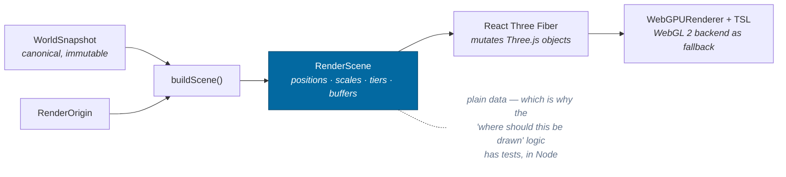
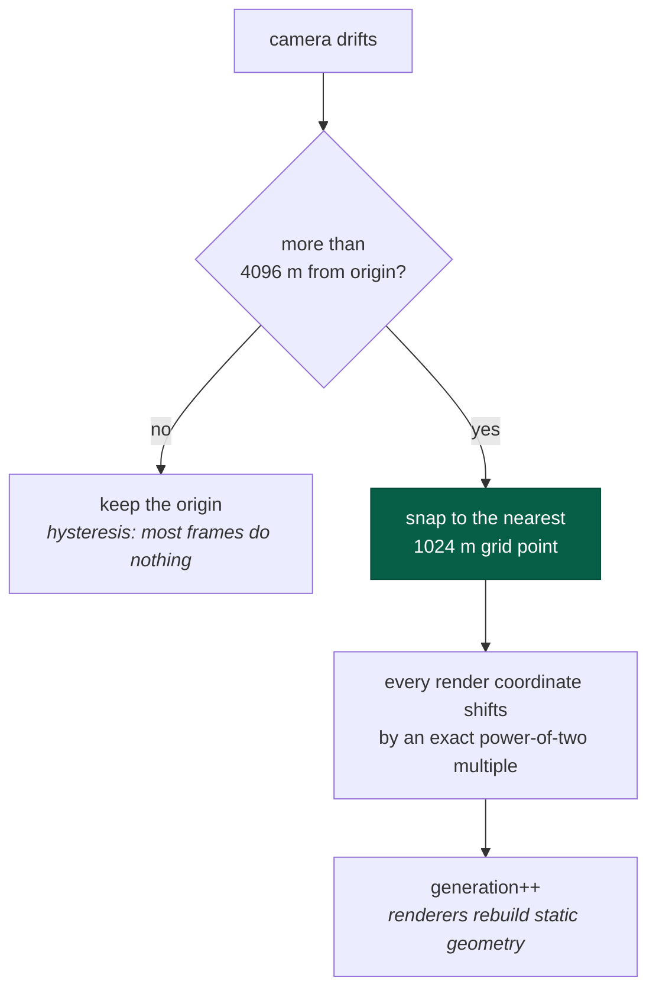
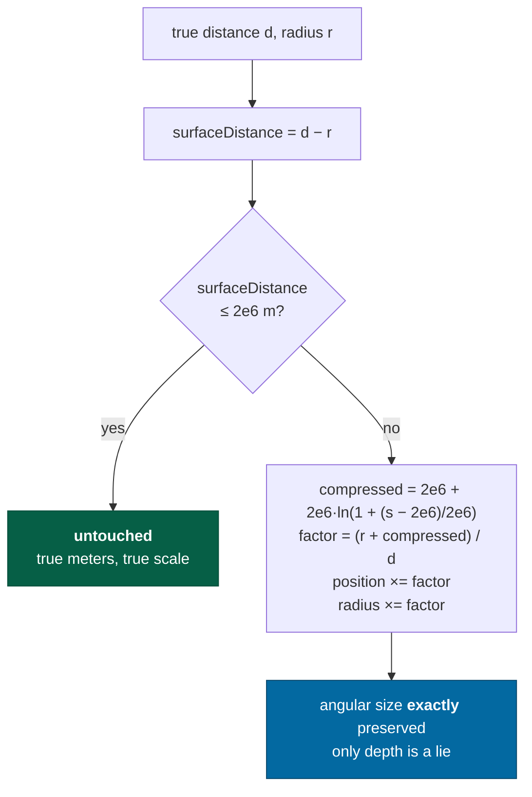
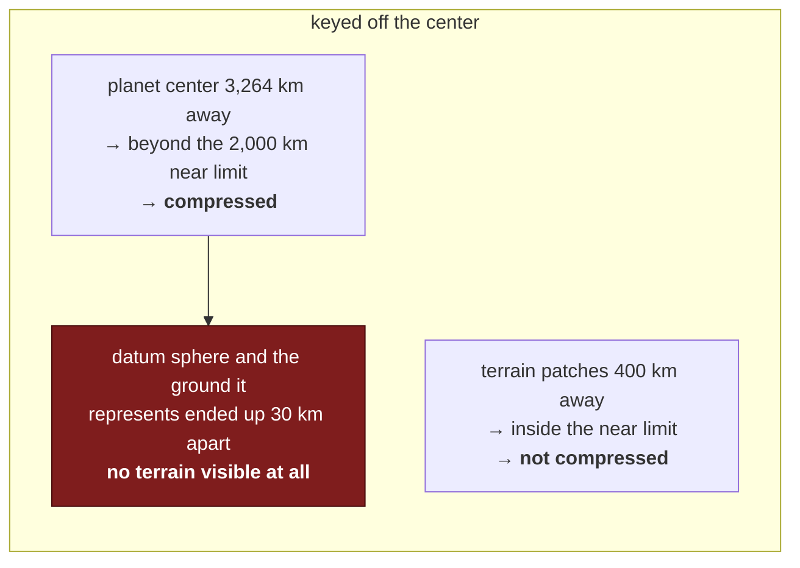
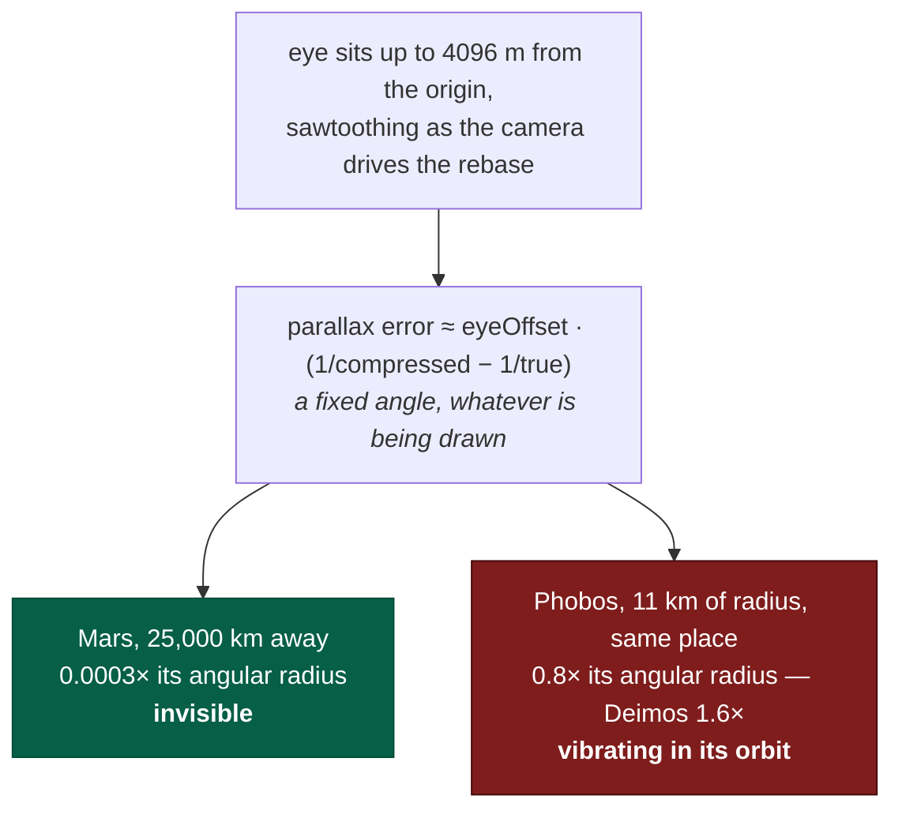
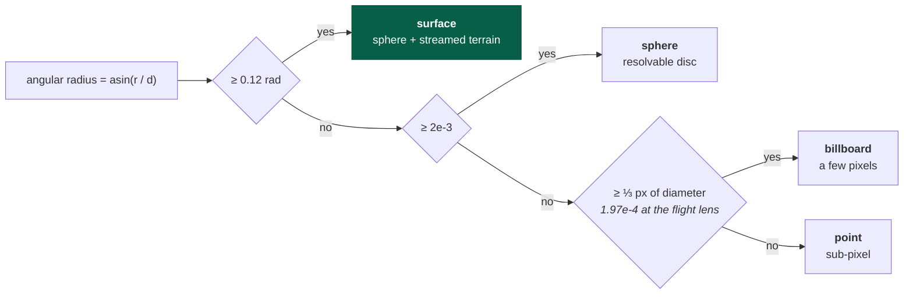
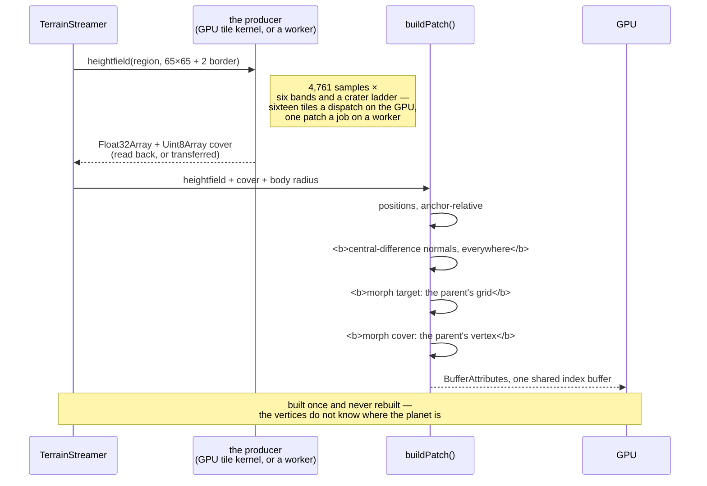
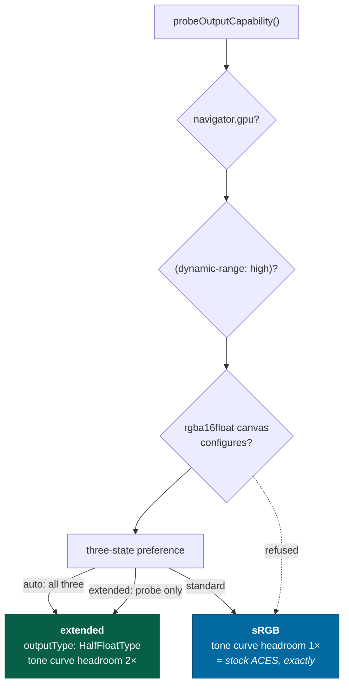
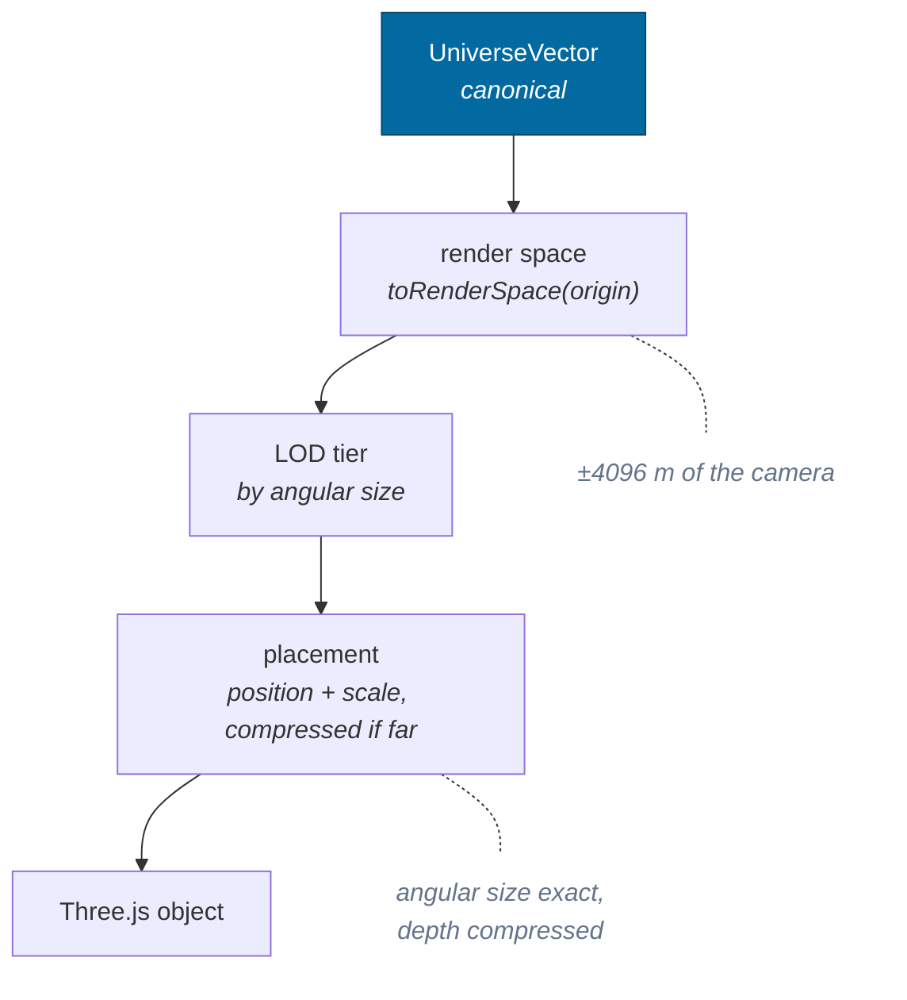

# Rendering

> **The question:** a bolt is 1 m away and a star is 4 light-years away. How do
> both end up in one float32 scene with a usable depth buffer?
> **The answer:** a floating origin that follows the camera and snaps to a power-
> of-two grid, plus logarithmic distance compression that preserves angular size
> exactly and lies only about depth.
>
> Decision record: [ADR-0003](../adr/0003-render-coordinates.md) ·
> Code: `packages/rendering/`, `packages/spatial/src/origin.ts`

---

## `rendering` does not import Three.js

Worth stating first, because it explains the shape of everything below. The
package computes _what should be drawn, where, at what size, at which level of
detail_ and emits it as plain data. `apps/game` turns that into Three.js objects.



---

## The floating origin

Render space is a metric space whose origin sits at some `UniverseVector`. The
origin follows the camera; everything the GPU sees is relative to it.



**Snapping is what makes it exact.** The shift is an integer multiple of 1024,
so it is exactly representable in float64 _and_ float32. Ten thousand rebases
accumulate zero drift rather than ten thousand roundings — asserted directly:

> `origin.test.ts` → after 10,000 rebases along a flight path, the origin is
> still _exactly_ on the grid and the canonical position decoded back from render
> space is unchanged.

Within ±2048 m of the origin float32 resolves 0.24 mm, and better than half a
millimeter all the way out to the ±4096 m rebase threshold — which is why a
meter-scale object beside the ship is exact no matter where in the galaxy the
ship is. Capability check 8 measures it: two points 1 m apart at 8.18 kpc render
1.000 m apart _after_ rounding to float32.

And because the origin is a **view** onto canonical state — nothing is written
back — a rebase cannot move an entity. That is capability check 9.

---

## Distance compression

The origin solves precision. It does not solve _range_: a star is still 4e16 m
from the camera, and no depth buffer spans 1e16:1.

Anything whose **surface** is beyond the near limit (2e6 m) is moved onto a
logarithmic radial scale, and its radius is scaled by the same factor:



Because position and radius scale together, the object subtends **exactly** the
angle it should. The image is correct; only the depth value is fictional. A
property test asserts the rendered angle matches the true angle to within 1e-9
relative across ten orders of magnitude of distance.

### Three properties, and one honest limitation

| Property                                                                                                | Status                                                                                                 |
| ------------------------------------------------------------------------------------------------------- | ------------------------------------------------------------------------------------------------------ |
| Angular size preserved                                                                                  | exact, property-tested                                                                                 |
| Continuous at the boundary                                                                              | factor is exactly 1 there                                                                              |
| **C¹** at the boundary (no change in apparent rate of approach)                                         | requires `SHELL_SPAN === NEAR_LIMIT` — which is how they are now defined, as                           |
| module constants rather than a config object nothing ever varied — it was _not_ C¹ until a test said so |
| Strictly increasing (depth ordering)                                                                    | non-decreasing **everywhere**; strictly increasing only while the separation survives double precision |

That last row is a real limitation stated honestly rather than papered over.
Past ~1e17 m the compression slope is ~1e-11, so two objects 100 m apart map to
the same depth. They are also the same pixel. The tests say exactly this: one
asserts _never inverts_ with no preconditions, and a second asserts _strictly
increasing_ given a relative separation above 1e-9.

A first version of that test asserted strict monotonicity everywhere and was
**intermittently red** — which was the mapping telling the truth about itself.

### The bug that made terrain invisible

Compression originally keyed off the distance to a body's **center**. In a
400 km orbit around a 2,864 km planet:



Keying off the **surface** distance fixes it and is also what makes the
transition continuous — at the boundary the factor is exactly 1, so a planet
neither pops nor changes its apparent rate of approach as you arrive.

### The bug that made the small moons vibrate

Compression is radial, so the point it is measured **from** is the one place in
the image that stays honest. That point is the **eye**, and for a long time it
was the render origin instead — which is a different point. The origin is the
snapped grid point above: it lags the camera by up to 4096 m and then jumps a
whole grid step to catch up.



The error is scale-free in meters, so what decides whether anyone sees it is how
big the object is on screen — which is why it was reported as a fact about the
two smallest bodies in the Solar System model rather than as a fact about the
whole scene. `placeAt` therefore takes the eye in render space, `buildScene`
computes it once, and the property is stated as an angle: the drawn direction
from the eye is the true direction from the eye, at any separation.

It also restores the independence of the two mechanisms. A rebase is a rigid
translation of render space and nothing else; measured from the origin,
compression made it a distortion as well.

---

## Level of detail

LOD is chosen by **angular size**, not distance — a gas giant at 1e9 m and a
boulder at 10 m subtend the same angle and deserve the same treatment.



**Only the first step is a claim about pixels, and it follows the lens.**
`lodThresholds(lens, viewport)` puts the point-to-billboard boundary at a third
of a pixel of diameter — sub-pixel on purpose, because a star is always smaller
than a pixel and must still draw, so what the threshold decides is when a point
cloud stops being an honest description, not when something becomes resolvable.
A constant can only be right at one lens: the boundary at the telephoto end of
the slider is an eighth of the boundary at the wide end
([ADR-0017](../adr/0017-the-lens.md)), which is why Atlas at 104,146 km draws as
a point at 110° and as a billboard at 20°. `sphere` and `surface` stay
constants, because they are claims about _representation_ — a disk with a
terminator on it, and ground close enough to be the picture — and a player who
fits a telephoto has not moved closer to the planet. A caller with no lens gets
the flight one over 1920×1080.

The architectural point: **representation is separate from identity**. A planet is the same planet — same address, same entity, same
canonical position — whether it is one pixel or ground you are standing on. Only
which renderer draws it changes, and nothing downstream may branch on the tier
for any purpose other than drawing.

Stars beyond the local system are drawn as a point cloud projected onto a fixed
shell around the camera. Direction is what matters; their distance is neither
representable nor observable.

The projection is `placeOnStarShell(origin, position)` with
`STAR_SHELL_RADIUS = 8e7`, and it lives here rather than in the R3F layer for a
concrete reason. It used to be open-coded in the component over the raw sector
fields, with `2 ** 40` written out by hand — the sector size `spatial` owns — and
that copy skipped the origin's **orientation**, which `toRenderSpace` applies and
every body therefore got. Whenever the origin was anchored to an oriented frame,
the stars were rotated out of alignment with the planets in front of them.

---

## Terrain meshing

This section is the geometry; [the ground's own material](#the-grounds-own-material)
is what shades it.

Patches are built from a heightfield into vertex buffers in **body-fixed axes,
relative to the patch's own anchor** — the datum-sphere point at its middle. The
pose goes back on at draw time, which is why a rebase costs nothing and why the
ground does not slide away from a ship landed on a world orbiting at 52 km/s.
The resolution is `HEIGHTFIELD_RESOLUTION` (65), exported once and shared by the
streamer, the worker task and capability check 10 — which compares worker output
to main-thread output sample by sample, and would otherwise be capable of
comparing two differently sized grids and calling them equal.

The heightfield is `drawnGroundElevation`, not the bare `elevationAt`: the
presentational tail below the canonical floor, and **no sea clamp** where a
sheet is drawn — the mesh is the seabed, and the sea is a sheet drawn over it
at the datum. The request carries the flag (`seabed`), and a body that gets no
sheet — a mapped one, whose photograph is its sea — is built from the clamped
`drawnElevation` instead, or its ocean floor is a trench under the photograph
kilometers below the datum the ship lands on. The clamp
still has exactly one owner, `groundElevation`, and `drawnElevation` keeps it
for the two readers that stand on the water rather than look through it — the
observatory's stance and the detail-floor search. The tail is the one term the
mesh has that the contact test does not, it is bounded by `drawnDivergence` at
1.25 m, and [streaming](streaming.md#two-fields-and-which-one-each-reader-gets)
has why the two fields have to be two.

A patch the sea reaches carries a second grid, `RenderPatch.water`: the datum
sphere on the patch's own vertices, anchor-relative, with the water depth over
each and a morph target for both, so the sheet hands over to its parent where
the seabed does. `render/water.ts` draws it, and
[ADR-0026](../adr/0026-the-liquid.md) says how.



### The normals bug

`buildPatch` originally emitted **radial** normals — each vertex's normal
pointing straight out from the planet's center. That shades a mountain range
_exactly_ like a smooth sphere.

Real relief was being generated, transferred, and drawn, and it was completely
invisible. The fix is a second pass computing central differences over
neighboring vertices. It is not a polish detail: without it, terrain generation
has no observable effect.

The difference has to be central **everywhere**, including the edge. A one-sided
difference there is half the gradient over half the span, which draws as a lit
hairline along every patch boundary — so a patch is generated with two rings of
border outside it and the loop never asks where its edge is. Taking those rows
from the neighboring _patch_ is the other way to get them and is strictly worse:
it makes a patch's geometry depend on which of its neighbors happen to be loaded,
which is an order dependency in a system whose premise is that a patch is a pure
function of its address.

### The morph, and why the shader's share of it is one `mix`

Every patch also carries where each of its vertices goes when it hands over to
its parent. That is the CDLOD morph: a vertex slides toward the position the
parent's coarser grid holds for it, arriving exactly as the parent takes over, so
the switch has nothing left to pop.

It is exact rather than approximate, and for a reason worth stating. A child
covers half its parent's side, 64 quads halved is 32, so **every even index of
the child lands on a parent grid point** — and the field is a pure function of
direction, so the elevation there is the same number both patches computed.
Snapping each vertex to the even index below it therefore lands the whole patch
on its parent's vertices. The normals morph too, over _two_ cells, which is one
of the parent's: shading has to hand over with the geometry or the switch trades
a pop for a shimmer.

**The surface cover makes the same journey**, and for the same reason one step
further out. A fully morphed child sits exactly where its parent sits; if it is
still wearing its own vertex's cover when it gets there, the frame the parent
takes over is the frame every crater ray and every mare margin jumps by one
child cell. That is worse than a pop, because it slides continuously as the
camera moves rather than happening once. `morphCover` is the parent's vertex's
eight bytes, and it indexes off the patch's own grid rather than the bordered
one — the cover carries no border, because the border rows exist to be
differenced against and nothing differences the cover.

The arithmetic lives here rather than in the shader so that the claim needs no
GPU: the shader's whole share of it is one `mix` between two attributes, and
the endpoint is a claim about two `Float32Array`s that `terrainPatch.test.ts`
checks on any Node. The graph itself is compiled and run on the real GPU by
`pnpm test:gpu` ([testing](../guides/testing.md)), which is where the
attribute set a patch has to supply is held.

### Two things a couple of hundred patches made matter

The **index buffer** is a function of the resolution alone — 24,576 indices,
98 KB — so it is built once and shared. Per patch it was 20 MB of identical
numbers and, worse, two hundred GPU buffers where one will do.

The **inner loops are written in scalars against flat arrays**, which is not a
style choice. The readable version — a `Vec3` per direction, per scaled position,
per difference, and a pair of three-element arrays per normal — allocated about
forty thousand short-lived objects per patch and cost **6.26 ms**, which is six
frames of terrain budget for one patch. It is 0.25 ms now.

### The datum sphere sits _below_ the terrain

Terrain dips below the datum as often as it rises above it. A sphere drawn at
exactly the datum radius hides every valley on the planet — and with only a few
patches streamed, that means hiding most of the terrain. So the fallback sphere
is drawn one full relief below the datum, and patches always win.

---

## Planetary surfaces

A body is shaded from its own photometry, and from measured maps where a map
exists. `apps/game/src/render/planet.ts` is the material;
[the catalog guide](../guides/catalogue.md#planetary-surface-maps) is where the
maps come from.

### The lighting is hand-written, and the reason is not performance

A point light and a standard material would be less code. It would also be the
wrong model, and not by a little:

> **Planetary surfaces are not Lambertian.** The full Moon is famously _flat_ —
> no limb darkening at all — because regolith backscatters. A Lambertian moon has
> a bright center and a dark rim, which is what every naive renderer produces and
> what nobody has ever photographed.

So the diffuse term is the **lunar-Lambert** function planetary scientists use, a
blend of Lambert and Lommel-Seeliger:

```
I = albedo · μ₀ · [ (1 − k) + k · 2/(μ₀ + μ) ]
```

`k = 0` is Lambert, right for a thick atmosphere. `k → 1` is Lommel-Seeliger,
right for airless regolith. It is set per body from whether the body has air, and
it is the single largest difference between a moon that looks photographed and
one that looks like a billiard ball.

### What the maps carry

| map      | carries                                                              |
| -------- | -------------------------------------------------------------------- |
| `albedo` | the surface, sRGB                                                    |
| `normal` | tangent-space normals, with an **ocean mask in alpha**               |
| `night`  | city lights, revealed just _before_ the terminator                   |
| `clouds` | coverage in alpha, on its own shell — and its shadow, on the surface |

The tangent frame is built analytically from the body's spin axis rather than
from a UV channel: geographic north is the axis with its radial part removed, and
east is `north × up`. Every _shadowing_ decision uses the geometric normal rather
than the mapped one, because a mountain on the night side is still on the night
side — letting a normal-mapped slope catch the sun across the terminator produces
lit specks floating in the dark, which is the classic normal-map-on-a-planet
artifact.

Normal maps are exaggerated, and the honest name for it is in `tuningFor`. At
4096 across, one texel of Earth is ten kilometers and the real slope across ten
kilometers is a fraction of a degree — the map's standard deviation is 2.4 out of 255. `docs/design/art.md` licenses exactly this ("roughness and detail are art")
and forbids the thing next door to it: the elevation is the published one and the
terrain is where it really is; only how sharply it catches the light is turned up.

A body with none of them is most of the galaxy, and it wears the ground. The
orbital bake ([ADR-0026](../adr/0026-the-liquid.md)) draws the streamed ground
material from the body's center into six faces of reflectance and a sea mask,
and the sphere samples them by direction, so what the sphere shows from orbit
is the geology the descent arrives at rather than a base color standing in for
it. The bake carries no relief: the sphere is flat-shaded under the same
photometry, and the eight-pixel gate is where the ground's own normals take over.

### Two shapes, and which one is not a rendering choice

A body is drawn as an **oblate spheroid** or as a **measured figure**, and what
decides is whether gravity rounded it off.

**Spheroids** are the unit sphere scaled on the spin axis, so the quaternion
tilts the bulge with it. Saturn is 9.8% flattened and Jupiter 6.5%, which reads
as wrong long before anyone can say why. Real bodies carry their measured polar
radius; generated ones derive it from their own rotation, because the
uniform-density relation that does so overstates Jupiter's by 70% and there is
nothing better to derive it from — and a sphere is not the neutral choice here,
it is the wrong one.

**Figures** are for everything below about 200 km, where self-gravity loses to
material strength and the body keeps whatever the last collision left. That is
92 of the Solar System's 129 bodies and a large fraction of every generated
system. Phobos is 27 × 22 × 18 km with a nine-kilometer crater in one end;
216 Kleopatra is a dog bone; Bennu is a spinning top with a ridge its own
rotation raised. A sphere is not an approximation of those, it is a different
object.

`Body.figure` is present **exactly when a body is not a spheroid**. Null means
round, not unknown — a renderer that read it as "no data" and fell back to a
sphere would be right by accident. `flattening` is not applied to a body that
has one: the mesh already carries all three half-extents, and applying both
squashes it twice, which on Phobos is 26%. [ADR-0013](../adr/0013-measured-figures.md).

### Shape models are radius grids

A figure is a latitude/longitude grid of radii — `packages/rendering/src/shape.ts`
holds the format, the decoder, the mesh builder and the generator, and
`data/shapes/` holds twenty-five measured ones from the NASA Planetary Data
System. The mesh is built in **Three.js's own `SphereGeometry` layout**, and that
is load-bearing rather than incidental: every surface map in the project is
equirectangular and was written for that sphere, so a grid mesh _is_ that sphere
with the radii moved, and Phobos takes an albedo map through the same material as
Mars — seam, poles and all.

It buys three more things a mesh would not. Level of detail is **subsampling**,
so a coarse tier is the fine one's own samples rather than a decimation with its
own error and a body cannot change size when it crosses a tier. The **file is the
data** — sixteen bytes of header and one `uint16` per sample, 65 KB for Phobos.
And the **generated case and the measured case are the same case**: a body with
no shipped model gets a field out of its own address seed on its measured
half-extents, through the same builder, so there is one code path for "not a
sphere" and it does not know which kind it is holding.

What it cannot represent is an overhang, which is the cost and is measured
rather than assumed — see the [catalog guide](../guides/catalogue.md#shape-models)
for the volume check that refuses a model the format cannot hold.

### Exposure, at both ends

A star **stops down** as it fills the frame: a sun across the whole viewport is
exposed for its surface, not for the scene it lights. A very dark body does the
same thing in reverse. Bennu reflects 4.4% of the light that reaches it and
Halley's nucleus 4% — darker than charcoal — and an eye that spends a minute
looking at one from five hundred meters adapts to it, which a renderer with one
exposure for the whole scene cannot.

`adaptationFor` opens `albedoScale` toward a 0.12 target, scaled by how much of
the frame the body covers, and returns **exactly 1 above 0.12 geometric albedo**
— below Mercury at 0.142 and the Moon at 0.136, so no planet and no major moon
ever sees anything but 1. It is applied as an _exposure_: the albedo is still the
published one and the body is still the darkest thing in the frame.

### Rings

Three things have to be right or a ring system reads as a decal, and all three
are geometry rather than art:

- **The planet's shadow falls on the rings.** A cylinder test along the sun
  direction, with a soft edge because the Sun has an angular diameter.
- **The rings' shadow falls on the planet.** Follow the sun ray from a surface
  point to the equatorial plane; if it lands between the ring radii, sample the
  ring's opacity there. Three dot products, and it is what makes Saturn look
  photographed.
- **The lit and unlit faces are different pictures.** The sunward face shows
  single scattering and the dense B ring is the brightest thing on it; cross the
  plane and you are looking at transmitted light, so the dense parts go dark and
  the thin ones glow. The whole image inverts.

The scattering is the standard slab result rather than a Lambert stand-in:

```
I/F = (ω₀/4) · μ₀/(μ₀ + μ) · [1 − e^(−τ(1/μ₀ + 1/μ))]
```

which gets saturation, edge-on brightening and the seasonal fade to nothing as
the rings turn edge-on to the sun, all from one expression.

### Tessellation

Spheres are tiered by angular radius: **512×256 for a body filling the view**,
down to 32×16 for a body that is a few pixels. A planet from orbit is a
silhouette problem before it is a shading one — no amount of normal mapping hides
a faceted limb, and the limb is exactly where the eye goes. Ring meshes are 768
segments around, because a ring seen nearly edge-on is a straight line a thousand
pixels long and any faceting shows as a scalloped edge.

Figures are tiered the same way but one step coarser across the board, and by
**stride** rather than by segment count: a shape mesh at 128 columns already has
its silhouette right, because the silhouette is where its samples _are_. The
reason a sphere needs 512 is that a sphere's error is entirely in its limb, and
a figure does not have that problem to begin with.

### The haze is not the atmosphere

`Atmosphere.ceiling` is a physics number — where the drag model stops
integrating — and for a gas giant it is a thousand kilometers of "there is no
surface". Rendered as a shell that thick, Saturn wore a halo 3% of its own radius
wide _and_ Earth's Rayleigh blue, because the scattering color was a constant.
Both are now per body: `BodyAppearance.haze` carries a rendered thickness and the
published limb colors, and Titan's haze is orange in every direction because
tholins are.

---

## The ground's own material

`apps/game/src/render/terrain.ts` is a hand-written node graph, not a
`MeshStandardNodeMaterial`, and it does not see the scene's `ambientLight` — the
sun reaches it through its own uniform, the way it reaches every planet and
every atmosphere. The reason is the same one that put the quadtree there:
**the ground is the picture of the planet**, so a rough dielectric sphere under
a uniform fill is not what a regolith world looks like at any phase angle.

It shades from the same [lunar-Lambert split](#the-lighting-is-hand-written-and-the-reason-is-not-performance)
`render/planet.ts` uses, because a descent crosses between the two at the
eight-pixel gate and that switch has to be invisible. Measured either side of
it, the streamed ground and the archive's sphere are 3.1% apart in mean value on
Mars and 1.5% apart on Earth. Anything added to one of the two materials and
not the other is a step at the switch — the aerial veil is the case that proves
it, because the atmosphere shell is a back-side sphere and only survives the
depth test _outside_ the planet's silhouette. Everything the air does in front
of the ground therefore happens in the surface material, on both sides.

**The lookup is split by who can answer.** Latitude is the direction against the
spin axis, altitude is the radius, slope is the normal against the radial — a
fragment has all three for free, and shipping them per vertex would be paying to
send the renderer something it is standing on. What a shader cannot derive is
the body's _past_: whether this plain is flood basalt, whether this ground was
excavated last week or three billion years ago, which way the crust's
composition varies, where the volatiles have condensed, where the liquid runs
and where something grows beside it. Those six are the cover — eight bytes a
vertex, two attributes of four, through `render/groundWear.ts` —
generated with the heightfield.

**Deposits are layered rather than splatted** — seven `mix`es in the order the
material is laid down: regolith wherever a slope holds it, basalt in the flooded
basins, wind-sorted fines on the low flat ground, evaporite on the flattest and
lowest, silt on the seabed, the biosphere's pigment over every soil it grows
in, volatiles on top. A six-way normalized splat has to invent a rule for
what happens when three weights all say 0.4; a stack says the ice is on the
sand, which is true. The angle of repose does most of the visible work, and 33°
is a fact about friction rather than about a planet.

**The palette is ratios against the body's own published color, never absolute
values.** `packages/rendering/src/terrainPalette.ts` holds it. Absolute colors
make every rocky world the same sandstone, and they make the ground disagree
with the datum sphere, the orbital tier and the dossier swatch, all of which
read `appearance.colour`. As ratios, Mars stays ochre and Callisto stays grey
while both get the same internal contrast — lunar mare is 0.07 geometric albedo
against 0.13 for the highlands, so basalt is 0.54 of the reference.

**A mapped body's ground wears its published map**, sampled by direction in
`SphereGeometry`'s own layout: the same photograph the sphere in front of it is
drawn from. On those bodies the cover's _invented_ channels switch off, because
the maria and the ray systems are in the photograph already and a second set on
top of them is two disagreeing planets in one frame. **The ocean is an invented
channel too** — the generated field and the archive's photograph disagree about
where Earth's land is, and that disagreement _is_ the carve-out, so painting sea
wherever the generated datum says water goes puts open water over the map's
continents.

Where a photograph exists it supplies the albedo outright, and the deposits keep
only what a map at ten kilometers a texel has no opinion on: the roughness, the
grain, the bump, and which of them the slope under the camera exposes. Halving
their brightness instead of dropping it was still 9% of the drawn value across
the gate on Mars, almost all of it evaporite lifting ground the photograph had
already drawn pale.

Everything in the graph is in body-fixed axes — the normal because the geometry
is, the eye because the morph already needed it, and the sun because the host
rotates one vector on the CPU rather than transforming a normal per fragment.
Skylight comes _out of_ the direct beam rather than beside it: light scattered
into the sky is light that did not arrive along the sun ray, and added beside it
the streamed ground came out 15% brighter than the photograph of the same
planet. [ADR-0020](../adr/0020-the-face.md) has the alternatives.

**Below a mesh cell there is a grain band, and its domain is the interesting
part of it.** A patch at the detail floor is 0.35 to 1.41 m a cell, and from a
two-meter stance one of those cells is two hundred display pixels across — so
everything between a cell and a pixel is per-pixel or it is nothing at all. The
band runs from 0.7 m down to 9 cm, at about fifteen degrees of slope, which is
what lunar regolith measures at centimeter baselines. What it may not use is
either of the two positions already in the graph. `positionLocal` is
_patch_-local, so a noise on it jumps phase at every patch edge — invisible at
the seven-meter octave above it, and a straight line across the ground at seventy
centimeters. The body-fixed position is continuous and useless: 1.7 × 10⁶ on
Luna, where float32 resolves 0.1 m and quantizes a nine-centimeter octave out of
existence. So the anchor is reduced modulo `GRAIN_PERIOD` wavelengths **in
float64 on the CPU** and the noise is written out to be periodic over that
period — exact, continuous across every boundary, and repeating every 45 m of
ground, which is further than the band survives to. It is hand-written rather
than taken from `mx_*` because periodicity is the one property none of the
built-ins has.

**The rocks wear this material rather than one of their own**, which is what
keeps a boulder and the regolith it is lying on agreeing about the palette, the
photometry, the terminator, the aerial veil and the published photograph. They
are the same body's surface seen a meter apart. Sharing costs nothing and needs
no branch, because Three's node material inserts the instancing _before_
`positionNode` runs — `instancedMesh( object )` assigns into `positionLocal` and
`normalLocal`, and this graph reads exactly those — so the altitude, the
latitude, the map's UV and the footprint the detail fades on are all right for
the rock rather than for the field's anchor. A rock comes out bedrock on its
steep faces and regolith on its top, in the palette of the ground under it, by
the same slope term that decides the ground.
[ADR-0021](../adr/0021-the-ground.md).

### Two float32 rules that only a planetary shader needs

Both were reported as one defect — a coastline warping several times a second,
seen from two kilometers up over an island chain.

**Never subtract two planetary radii from each other in a shader.**
`length(anchor + local) − datumRadius` puts both terms at 6.4 × 10⁶ on Earth,
where one float32 step is half a meter, so an altitude computed that way arrives
quantized to half a meter — inside a water band four meters wide. The shoreline
becomes a stair, and the morph walks `local` across those steps every frame, so
the stair crawls. The cancellation is avoided rather than tolerated:
`|p|² − |a|² = 2(a·l) + l·l` exactly, and `|p| − |a|` is that over `|p| + |a|`,
so the large numbers never meet.

**Never take a screen-space derivative of a planetary position.** It is worse
than the value: half a meter of quantization against a pixel covering a few
meters is a tenth of noise in the derivative and a constant bias per patch, so
the map's mip level changed at every patch boundary. And `local` is _linear_
across a triangle, which means `dFdx(local)` is constant over the whole of one —
a detail fade measured that way steps per polygon. Both are analytic instead:
the UV gradient from the tangential part of a precise step, the fade from
distance times the lens's own pixel angle.

Two more are backend facts rather than numerical ones, and they fail the same
way: a message on a channel the page console does not carry, and a planet that
draws nothing.

**A varying may not take an attribute's name.** `varying(vec4(), 'terrainCover')`
beside `attribute('terrainCover')` is a redeclaration in the generated shader,
and it surfaces as `[Invalid ShaderModule "vertex"]`.

**And two attribute names may not share one `BufferAttribute` object.** The
backend builds its vertex layout by asking the geometry for each attribute the
graph names, and keys the GPU buffer on the object it gets back — so one object
answering to two names is one buffer at two shader locations, and the pipeline
does not build at all. It reports `[Invalid ShaderModule "fragment"] is invalid
due to a previous error`, and `warmCompile` swallows its rejection, so a
compile-ahead making the same mistake fails silently before the real draw hits
the same wall. Two attribute objects over one array is a few bytes and one fewer
trap; `ScatterRocks` gives its rocks their morph targets that way, because the
terrain graph reads morph attributes a rock has no coarser version to morph to.
[ADR-0021](../adr/0021-the-ground.md).

---

## Depth buffer settings

```
logarithmicDepthBuffer: true
near: 0.05 m
far:  1e10 m
```

A linear depth buffer over that range has no usable precision anywhere in it.
The logarithmic buffer costs a fragment shader instruction and makes the range
workable. Reversed-Z is complementary and can be added later.

---

## The renderer

`WebGPURenderer` with TSL, built in `apps/game/src/render/`. The reasoning is in
[`docs/design/technical.md`](../design/technical.md#the-webgpu-migration); what
matters here is the shape.

**WebGL is a backend, not a second renderer.** `WebGPURenderer` carries its own
WebGL 2 backend and swaps to it when the device request fails. So the fallback
runs the same node graphs, and there is no second set of materials to keep in
sync — which is what "retained as a reduced-fidelity fallback" has to mean if it
is to survive contact with a deadline. What the fallback loses is extended-range
output, because that is `rgba16float` canvas configuration and WebGL 2 has no
equivalent.



Two of those three signals are opinions and one is a fact.
[Spike 1](../spikes.md#1--hdr-display-detection) put them in front of three
browsers on one physical panel: `(dynamic-range: high)` came back true, true and
**false** for the same display, and there is no headroom API anywhere, so the page
cannot tell a 2×-EDR laptop from an XDR display. The `configure()` probe is the
only signal that cannot be argued with, which is why `extended` may overrule the
media query and may not overrule the probe.

### One curve, two ranges

The tone curve is three's `acesFilmicToneMapping` exactly, up to its final clamp,
and the _only_ difference between the two paths is how far that clamp goes. At
headroom 1 it is bit-identical to the stock tonemapper; above 1, values the sRGB
path would have clipped are re-expanded and nothing below the shoulder moves.
That is the mechanism behind [art](../design/art.md#hdr)'s requirement that the
SDR render be _a tonemapped version of the same image_, never a differently
authored one — and it is why the stock tonemapper could not simply be selected:
it ends in `color.clamp()`, which throws away exactly the range extended output
exists to carry.

### Three passes that stayed separable

Terrain, atmosphere and the star field are the three places
[technical](../design/technical.md#the-path) says a hand-written pipeline might
one day be worth it, so each is a self-contained material that reaches into
nothing else.

The atmosphere is the interesting one. It integrates along the view ray rather
than shading a surface: the shell is drawn back-side, so the fragment is always on
its far wall and the opaque planet has already depth-killed the middle. What is
left is a ray–sphere intersection with the near end clamped to the camera, which
is what lets one expression serve both an orbital limb and a sky seen from the
ground. It is _not_ scattering — uniform density, a path length, authored
constants — and the replacement is named:
[Bruneton's precomputed LUTs](../spikes.md#2--tsl-and-the-atmosphere-integral),
which spike 2 promoted from optimization to requirement when a 256-sample raymarch
measured 7.27 ms against a 3.0 ms budget.

The star field is instanced sprites rather than a point cloud, and that is not a
stylistic choice: **WebGPU renders point primitives at exactly one pixel**, so
`PointsNodeMaterial.sizeNode` is silently ignored on a `Points` object under the
WebGPU backend and honored under the WebGL one. The field would have shrunk on
the primary backend and looked correct on the fallback.

---

## The full path, one more time



---

## Related

- [ADR-0013](../adr/0013-measured-figures.md) — why a body that gravity never rounded off carries a radius grid rather than a sphere
- [ADR-0020](../adr/0020-the-face.md) — the cover field, the palette and the one terrain material
- [ADR-0021](../adr/0021-the-ground.md) — the grain band, and the rocks that wear the same material
- [Coordinates](coordinates.md) — what render space is derived from
- [Streaming](streaming.md) — how terrain patches are chosen and reconciled
- [Time](time.md) — where the interpolation alpha comes from
- [ADR-0003](../adr/0003-render-coordinates.md) — alternatives considered
