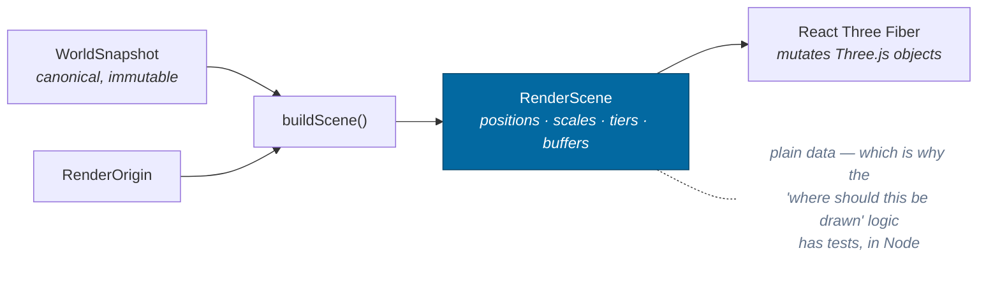
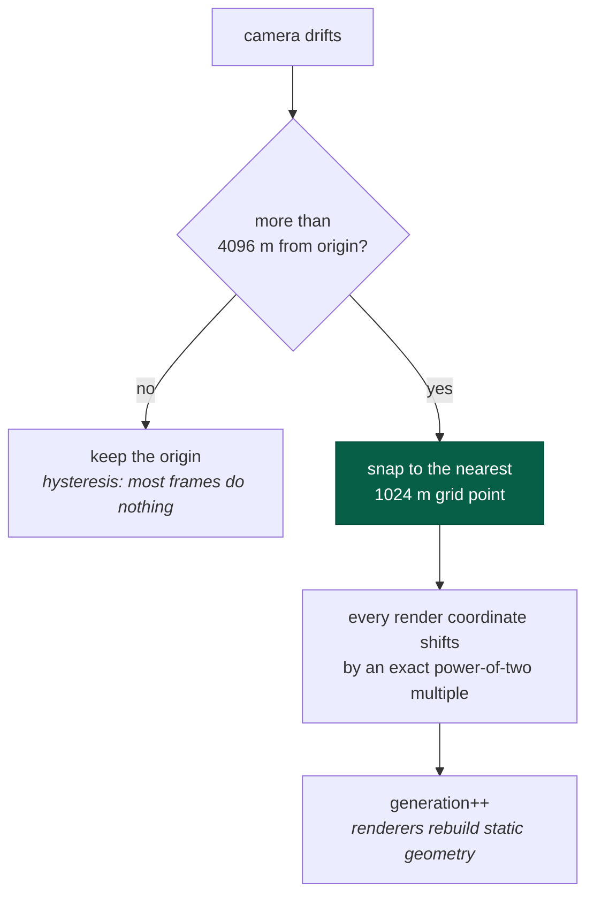
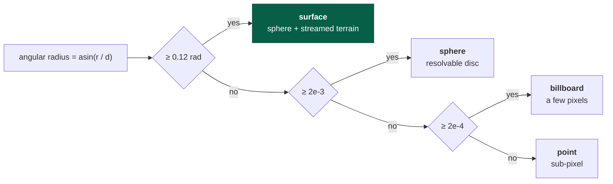
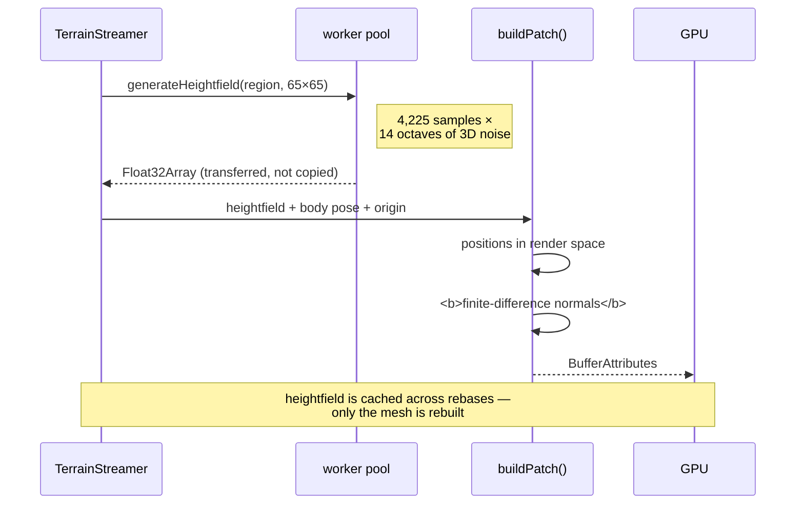
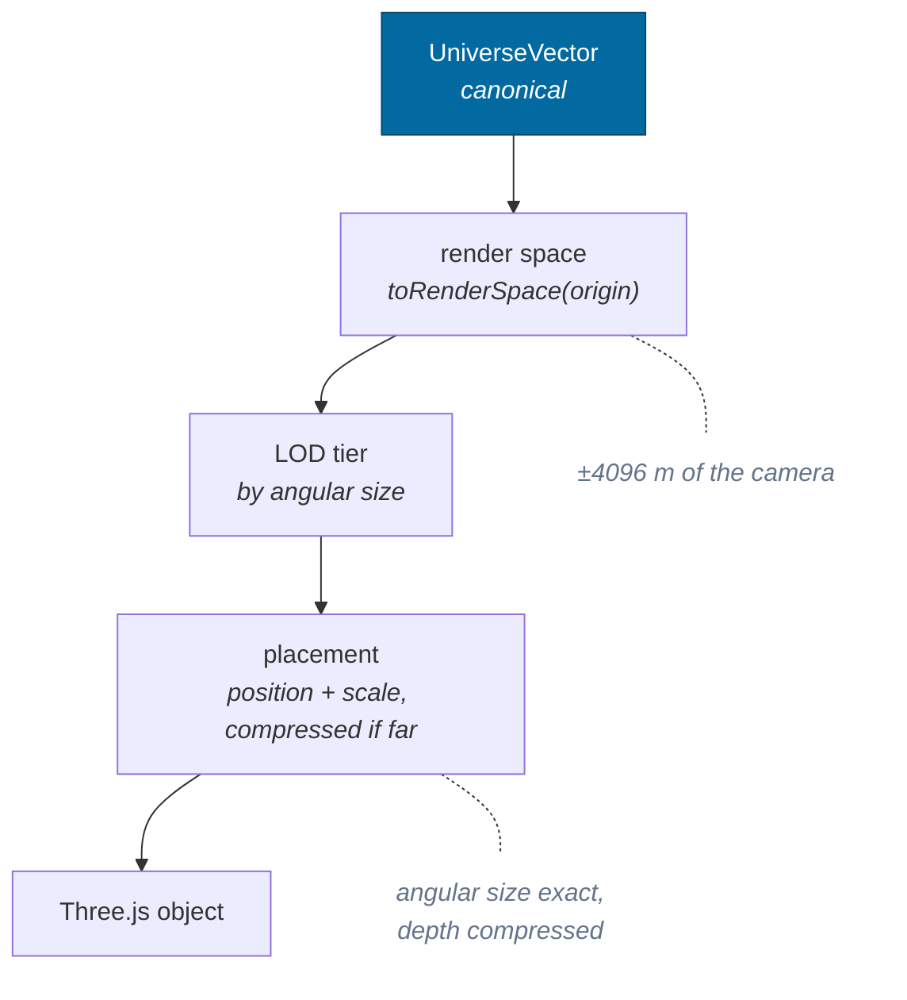

# Rendering

> **The question:** a bolt is 1 m away and a star is 4 light-years away. How do
> both end up in one float32 scene with a usable depth buffer?
> **The answer:** a floating origin that follows the camera and snaps to a power-
> of-two grid, plus logarithmic distance compression that preserves angular size
> exactly and lies only about depth.
>
> Decision record: [ADR-0003](../adr/0003-render-coordinates.md) ·
> Code: `packages/rendering/`, `packages/spatial/src/origin.ts`

---

## `rendering` does not import Three.js

Worth stating first, because it explains the shape of everything below. The
package computes *what should be drawn, where, at what size, at which level of
detail* and emits it as plain data. `apps/game` turns that into Three.js objects.



---

## The floating origin

Render space is a metric space whose origin sits at some `UniverseVector`. The
origin follows the camera; everything the GPU sees is relative to it.



**Snapping is what makes it exact.** The shift is an integer multiple of 1024,
so it is exactly representable in float64 *and* float32. Ten thousand rebases
accumulate zero drift rather than ten thousand roundings — asserted directly:

> `origin.test.ts` → after 10,000 rebases along a flight path, the origin is
> still *exactly* on the grid and the canonical position decoded back from render
> space is unchanged.

Within ±2048 m of the origin float32 resolves 0.24 mm, and better than half a
millimetre all the way out to the ±4096 m rebase threshold — which is why a
metre-scale object beside the ship is exact no matter where in the galaxy the
ship is. Capability check 8 measures it: two points 1 m apart at 8.18 kpc render
1.000 m apart *after* rounding to float32.

And because the origin is a **view** onto canonical state — nothing is written
back — a rebase cannot move an entity. That is capability check 9.

---

## Distance compression

The origin solves precision. It does not solve *range*: a star is still 4e16 m
from the camera, and no depth buffer spans 1e16:1.

Anything whose **surface** is beyond the near limit (2e6 m) is moved onto a
logarithmic radial scale, and its radius is scaled by the same factor:


Because position and radius scale together, the object subtends **exactly** the
angle it should. The image is correct; only the depth value is fictional. A
property test asserts the rendered angle matches the true angle to within 1e-9
relative across ten orders of magnitude of distance.

### Three properties, and one honest limitation

| Property | Status |
|---|---|
| Angular size preserved | exact, property-tested |
| Continuous at the boundary | factor is exactly 1 there |
| **C¹** at the boundary (no change in apparent rate of approach) | requires `SHELL_SPAN === NEAR_LIMIT` — which is how they are now defined, as
module constants rather than a config object nothing ever varied — it was *not* C¹ until a test said so |
| Strictly increasing (depth ordering) | non-decreasing **everywhere**; strictly increasing only while the separation survives double precision |

That last row is a real limitation stated honestly rather than papered over.
Past ~1e17 m the compression slope is ~1e-11, so two objects 100 m apart map to
the same depth. They are also the same pixel. The tests say exactly this: one
asserts *never inverts* with no preconditions, and a second asserts *strictly
increasing* given a relative separation above 1e-9.

A first version of that test asserted strict monotonicity everywhere and was
**intermittently red** — which was the mapping telling the truth about itself.

### The bug that made terrain invisible

Compression originally keyed off the distance to a body's **centre**. In a
400 km orbit around a 2,864 km planet:


Keying off the **surface** distance fixes it and is also what makes the
transition continuous — at the boundary the factor is exactly 1, so a planet
neither pops nor changes its apparent rate of approach as you arrive.

---

## Level of detail

LOD is chosen by **angular size**, not distance — a gas giant at 1e9 m and a
boulder at 10 m subtend the same angle and deserve the same treatment.



The architectural point: **representation is separate from identity**. A planet is the same planet — same address, same entity, same
canonical position — whether it is one pixel or ground you are standing on. Only
which renderer draws it changes, and nothing downstream may branch on the tier
for any purpose other than drawing.

Stars beyond the local system are drawn as a point cloud projected onto a fixed
shell around the camera. Direction is what matters; their distance is neither
representable nor observable.

The projection is `placeOnStarShell(origin, position)` with
`STAR_SHELL_RADIUS = 8e7`, and it lives here rather than in the R3F layer for a
concrete reason. It used to be open-coded in the component over the raw sector
fields, with `2 ** 40` written out by hand — the sector size `spatial` owns — and
that copy skipped the origin's **orientation**, which `toRenderSpace` applies and
every body therefore got. Whenever the origin was anchored to an oriented frame,
the stars were rotated out of alignment with the planets in front of them.

---

## Terrain meshing

Patches are built from a heightfield into vertex buffers in render space. The
resolution is `HEIGHTFIELD_RESOLUTION` (65), exported once and shared by the
streamer, the worker task and capability check 10 — which compares worker output
to main-thread output sample by sample, and would otherwise be capable of
comparing two differently sized grids and calling them equal.

The heightfield is `groundElevation`, not the bare `elevationAt`: the same
sea-level clamp the physics uses. Before that had one owner, `seaLevel` was
carried from the generator through the worker to the mesh and then ignored, so on
an ocean world the landing pad sat on the water datum while the mesh drew the
seabed underneath it. A test now asserts the mesh is drawn at the radius the
contact test stops at.



### The normals bug

`buildPatch` originally emitted **radial** normals — each vertex's normal
pointing straight out from the planet's centre. That shades a mountain range
*exactly* like a smooth sphere.

Real relief was being generated, transferred, and drawn, and it was completely
invisible. The fix is a second pass computing central differences over
neighbouring vertices. It is not a polish detail: without it, terrain generation
has no observable effect.

Patch edges use one-sided differences, which leaves a hairline seam between
neighbouring patches — [roadmap item](../roadmap.md#terrain).

### The datum sphere sits *below* the terrain

Terrain dips below the datum as often as it rises above it. A sphere drawn at
exactly the datum radius hides every valley on the planet — and with only a few
patches streamed, that means hiding most of the terrain. So the fallback sphere
is drawn one full relief below the datum, and patches always win.

---

## Depth buffer settings

```
logarithmicDepthBuffer: true
near: 0.05 m
far:  1e10 m
```

A linear depth buffer over that range has no usable precision anywhere in it.
The logarithmic buffer costs a fragment shader instruction and makes the range
workable. Reversed-Z is complementary and can be added later.

---

## The full path, one more time



---

## Related

- [Coordinates](coordinates.md) — what render space is derived from
- [Streaming](streaming.md) — how terrain patches are chosen and reconciled
- [Time](time.md) — where the interpolation alpha comes from
- [ADR-0003](../adr/0003-render-coordinates.md) — alternatives considered
