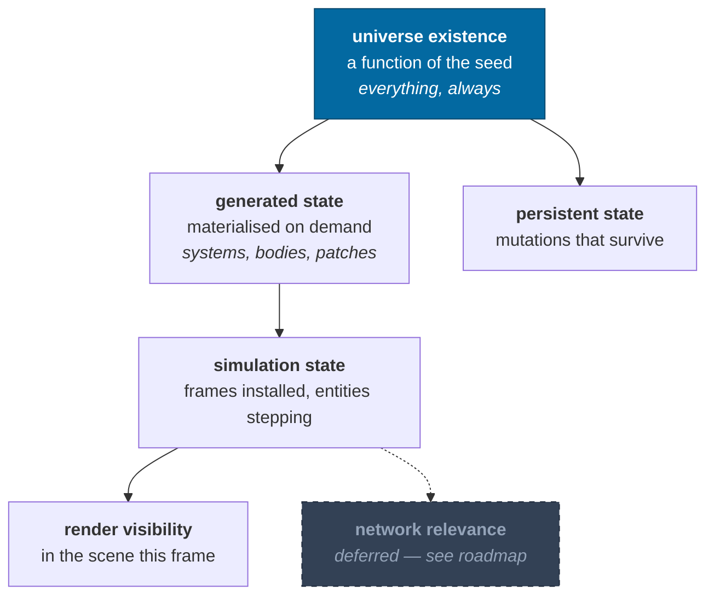
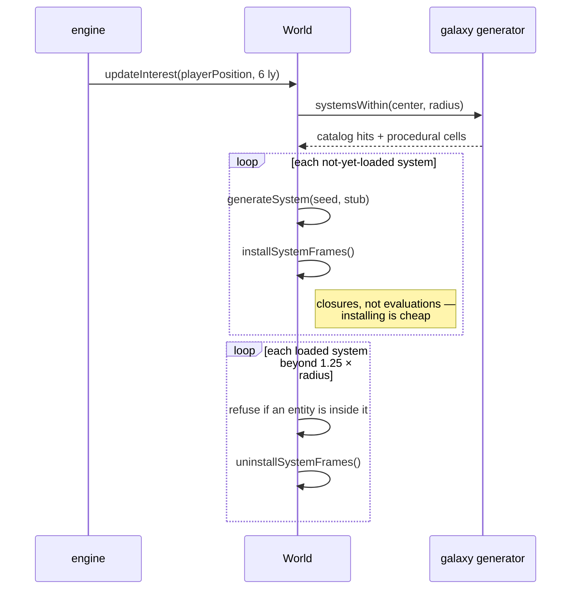
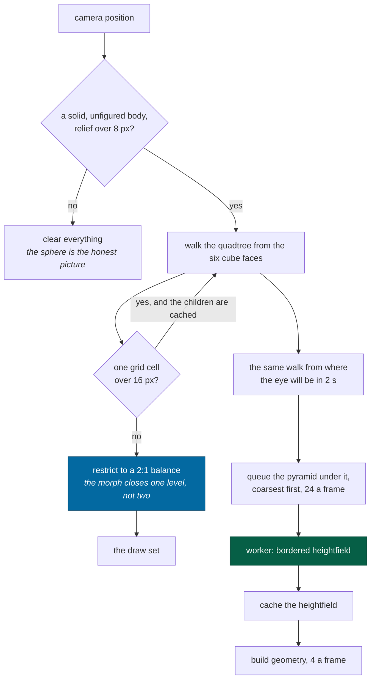

# Streaming

> **The question:** how is only the relevant slice of a galaxy in memory, without
> "loading screens" or a space-mode/planet-mode split?
> **The answer:** loading and unloading are ordinary methods called every so
> often, and existence is separated from being loaded.
>
> Code: `packages/simulation/src/world.ts` (`updateInterest`),
> `packages/rendering/src/terrainSelect.ts`,
> `apps/game/src/engine/terrainStreamer.ts`

---

## Existence is not residency

Six things have to stay distinct, or streaming turns into a cache-coherency
problem. Five of them exist today:

An object can exist canonically — be addressable, be describable, be referenced
by a save — with no frames installed and no Three.js object anywhere. "Where is
the third planet of HIP71683?" is answerable without loading HIP71683.

---

## System streaming

Two details that make this safe:

- **Unloading refuses** if any entity's frame chain passes through the system.
  You cannot pull the floor out from under a ship.
- **Regeneration is exact.** Unload a system, reload it, and the JSON is
  byte-identical — asserted by a test. Unloading is therefore free of
  consequence, which is what makes it usable as an ordinary operation rather
  than a risky one.

The 1.25× hysteresis on the unload radius stops a system thrashing when the
player hovers at the boundary.

---

## Terrain streaming

The streamer is asked, every frame, what should be visible, and reconciles.

**The selection rule is not in the streamer.** Everything above the queue — the
traversal, the error predicate, the horizon cull, the balance and the morph
bands — is `selectTerrain` in `packages/rendering`: a pure function of a body's
radius and relief, an eye distance and a body-fixed direction. The streamer
calls it twice a frame and owns only the cache, the worker jobs and the meshes.
That split is what makes "what would this camera ask for?" answerable without a
GPU, and it is why the terrain budget has measured numbers in it at all — the
browser asks the question once a frame, `ir.descend` asks it a few hundred times
in a millisecond ([harness](../guides/harness.md#measuring-terrain)).

### The four rules the traversal follows

**Refine while a patch's own grid cell is coarser than the screen can tell.**
Ulrich's screen-space-error predicate wants the mesh's true vertical deviation,
and on a planet that number is startlingly small — Earth's relief is two parts
in a thousand of a cube face, and a patch's 64 quads cut it by another 64. So
the error is a patch's _sample spacing_, the way Cesium's shipping tiles carry
it: the size of the smallest thing a patch can express.

"What the screen can tell" is a statement about optics, and it reads the lens
the picture is actually taken with — [ADR-0017](../adr/0017-the-lens.md). A
fixed angle would be right for exactly one setting of the field-of-view slider
and three levels wrong across it — six once the zoom channel is counted; the
patch demand climbs steeply with the pixels-per-radian, so the assumption would
decide how much terrain exists rather than the picture deciding it. Not as its
square, which is what the arithmetic suggests: refinement runs out of _levels_ at
`surfaceDetailFloor` before it runs out of budget, and the telephoto end of the
slider measures 1.9× to 3.2× the flight lens's demand rather than thirteen times
it. Racking the zoom out on top of that is the one corner where the floor is
reached and the square bites again — a telephoto held on a subject wants an order
of magnitude past any cap, so the disk goes a level coarse on every step and says
so. The viewport is
in **display** pixels with any supersampling divided back out: 4× AA raises the
sample count, not the
detail a viewer can resolve, and feeding the raw buffer in asks for 6.5× the
patches to draw geometry the resolve filter averages away.

**Stop where the field stops.** Past some level a patch is a bilinear upsample of
its parent. `surfaceDetailFloor` measures that per body from the field itself
rather than assuming it, and it lands at level 10 to 16 across the zoo — 10 on
Iapetus, 16 on the atmosphered rocky world, as `pnpm sim --terrain-baseline`
prints it against each body's descent. The
[band stack](rendering.md#terrain-meshing) puts crater rims in the field, a rim
is about a seventh of its crater wide, and resolving one to half a meter takes
samples seven times finer again. It moved there from 7–10 the day the geology
landed, with no constant to raise, which is what measuring it from the field buys.

Two things settle the walk rather than one. A quiet level counts only if its
stencils touched dry ground — the sea clamp manufactures exact zeros over open
water, so a submerged probe set is the clamp talking rather than the field, and
an ocean world read that way streams its islands, with kilometers of relief, as
six patches forever. And it takes **three consecutive** quiet levels, because a
crater ladder is discrete: a stencil that straddles nothing at one level lands on
a rim at the next, so the first quiet level is not a floor and taking it returned
one whose own residual was twice the tolerance.

**Measure to the ground, not the datum.** A node is a cone of directions crossed
with the shell `[radius − relief, radius + relief]` that ground can occupy, and
the distance is to the nearest point of _that_ — zero when the eye is inside the
shell, which is what standing on the ground means.

**Keep neighbors within one level.** The [CDLOD](rendering.md#terrain-meshing)
morph slides a patch onto its _parent's_ grid, so it closes a one-level gap
exactly and a two-level gap not at all. An unrestricted tree produced gaps of up
to six, drawn as dashed black arcs along every level ring; the tree is restricted
to 2:1, which is the classical answer and the rule Transvoxel's transition cells
assume.

**What is cached, and why that split:** heightfields are cached and so is the
geometry built from them. A [floating-origin rebase](rendering.md#the-floating-origin)
invalidates neither: patch vertices are body-fixed and anchor-relative, so the
pose goes back on at draw time rather than into the buffer.

A cache smaller than the working set does not degrade, it **oscillates** — and
the streamer holds two selections at once, the drawn one and the request one,
which diverge because the second is taken from where the eye is going. Sized at
a flat 512 against a working set of six hundred, every frame evicted ground the
next frame wanted: the draw set collapsed from 350 patches to 19 and refined
back, over and over, which is terrain strobing at every altitude. Both caps come
from the selection's own ceiling now, and eviction keeps everything the frame's
request list names — the drawn set, the starved children, the whole pyramid —
because the pyramid is re-asked for every frame: a keep set of the two
selections' leaves alone turns the cap into a treadmill that evicts a rung,
re-requests it, and regenerates it at 9 to 37 ms a patch.

Patch keys are `body|face.level.i.j` — `terrainPatchKey`, one definition and
three readers — so the same patch is never requested twice concurrently, and the
request set is stable while the player hovers.

### What is drawn while it loads

Refinement only enters ground that is already in the cache, so a patch whose
field has not arrived is never a hole: its parent is drawn instead, covering the
same ground more coarsely. A descent therefore _sharpens_ rather than filling
in. The request set is taken from where the eye will be in two seconds and asks
for the whole pyramid under it, coarsest first — without the ancestors it would
climb one worker round trip per level, and a streamer starting empty would draw
six cube faces and stay there until a level-nine patch arrived. The velocity
behind that extrapolation is measured in body-fixed axes, because a hovering
camera co-moves with the body at its orbital velocity — 47 km/s at Mercury —
so a universe-frame drift pushed two seconds ahead aims the request set ~94 km
along the orbit rather than along the camera's track over the ground.

**Twenty-four requests go out a frame**, because that ladder is strictly serial:
a level cannot refine until all four children of every node on it have arrived,
so a frame that under-asks is a frame the next level waits for, and with the
detail floor twelve to sixteen levels down that is most of a landing. More
would queue rather than work — the requests go to a pool, and a queue is what a
camera turn has to throw away.

### Where terrain is not drawn

A body's relief has to cover more than eight pixels before any of this runs.
Past that distance the mesh and the datum sphere are the same picture, and the
sphere already carries a normal map and, on four bodies in Sol, a photograph —
so drawing generated ground over it replaces a measured picture with an invented
one. Earth draws its map down to 2,000 km of altitude and its ground below that;
Miranda, with 10 km of relief on a 236 km radius, keeps terrain out to eight
thousand kilometers, because there the relief _is_ the shape of the body.

A body with a measured figure streams no terrain at all. Every patch is built
on the spherical datum, but a figured body's ground — the contact test,
`surfaceRadius`, the standing camera — is its measured ellipsoid, up to half a
radius inside that sphere on Haumea, so streamed patches would be a spherical
shell floating around the shape model with the standing camera inside the mesh.
Deep terrain on figures is a projection problem the terrain plan defers; until
it is solved, the figure's own shape model is the honest ground.

---

## What makes this possible at all

Streaming is only tractable because of two properties established elsewhere:

| Property                              | Why streaming needs it                       | Where                         |
| ------------------------------------- | -------------------------------------------- | ----------------------------- |
| Content is a pure function of address | Unloading loses nothing; reloading is exact  | [determinism](determinism.md) |
| Generation is order-independent       | Patches can arrive from workers in any order | [determinism](determinism.md) |
| Identity exists without residency     | A save can reference an unloaded system      | [identity](identity.md)       |
| Frames install as closures            | Installing a system costs no generation      | [frames](frames.md)           |

Take away any one of them and streaming becomes a cache-coherency problem
instead of a memory-management one.

---

## Two things worth knowing

**No pool means no terrain.** `TerrainStreamer` returns early without one, so a
browser that cannot construct module workers gets main-thread starfield surveys
and no streamed ground at all. That is the real degradation path; there is no
inline-worker fallback in the browser.

**Rebasing is handled in one place.** A patch records the origin generation it
was built against and `#ensure` rebuilds it when that goes stale — for the ~9
patches that should be visible, and nothing else. An explicit `rebuild()` used to
run alongside it from the frame loop, walking the whole 64-entry heightfield
cache and re-adding patches `update()` had just pruned: a frame of off-screen
geometry uploads on every rebase, which is every 4096 m of camera travel. It is
gone.

---

## Current limits

| Limit                                            | Consequence                                                                 | Roadmap                                      |
| ------------------------------------------------ | --------------------------------------------------------------------------- | -------------------------------------------- |
| Interest is a radius scan over generation cells  | Fine at 6 ly; a spatial index is needed for large radii                     | [roadmap](../roadmap.md#streaming-and-scale) |
| The selection is not frustum-culled              | A whole disk is generated, of which the renderer draws about a third        | [roadmap](../roadmap.md#terrain)             |
| Vertex attributes are float32                    | 203 KB a patch, so a whole-disk selection is 85–205 MB at the flight lens   | [roadmap](../roadmap.md#terrain)             |
| The mesh is built on the main thread             | 0.25 ms a patch, budgeted at four a frame; the worker already has the field | [roadmap](../roadmap.md#terrain)             |
| One flat color per body                          | The ground has a geology and no face — no biomes, no materials              | [roadmap](../roadmap.md#terrain)             |
| A mapped body's terrain is not its published map | Procedural ground under a photographic albedo, near the surface only        | [roadmap](../roadmap.md#terrain)             |

**The morph closes one level, and that is a constraint rather than a setting.**
A vertex slides toward the position its _parent's_ grid holds for it, so where
two levels meet the finer patch arrives exactly on the coarser one's vertices.
Where three levels meet it arrives on a grid the coarser patch has no vertex on,
and the difference is a hairline of open sky. A wide enough LOD band removes the
possibility by construction — measured, the tree balances itself once a level's
band is 3.7 patches wide — but that costs 500 to 1,000 patches for one disk
against 300 to 600, so the band stays narrow and the tree is restricted instead.

---

## Related

- [Determinism](determinism.md) · [Identity](identity.md) · [Workers](workers.md)
- [Rendering](rendering.md#terrain-meshing) — what happens to a heightfield
