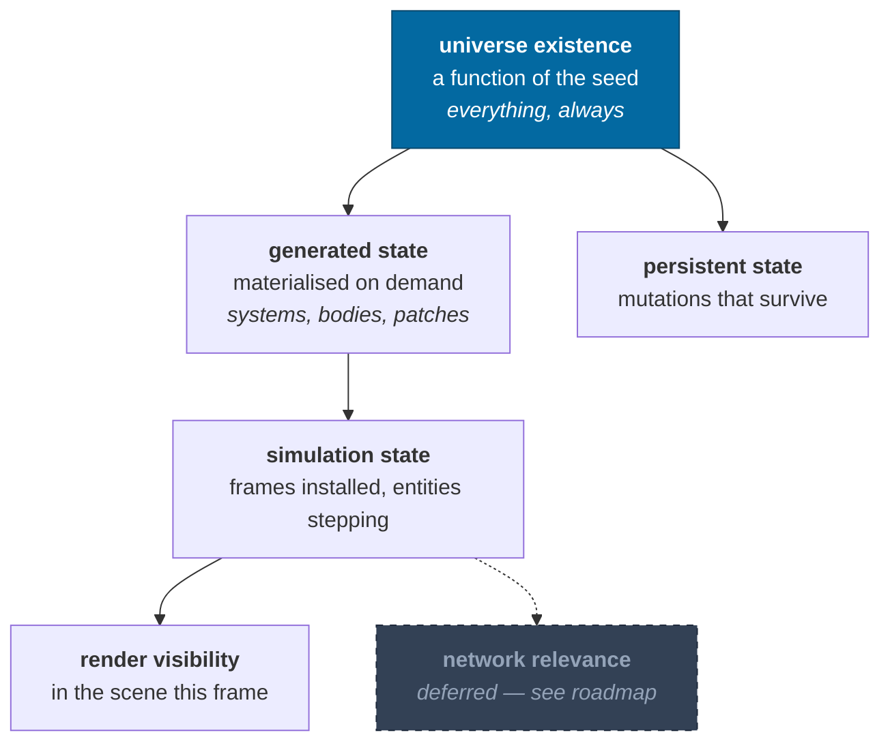
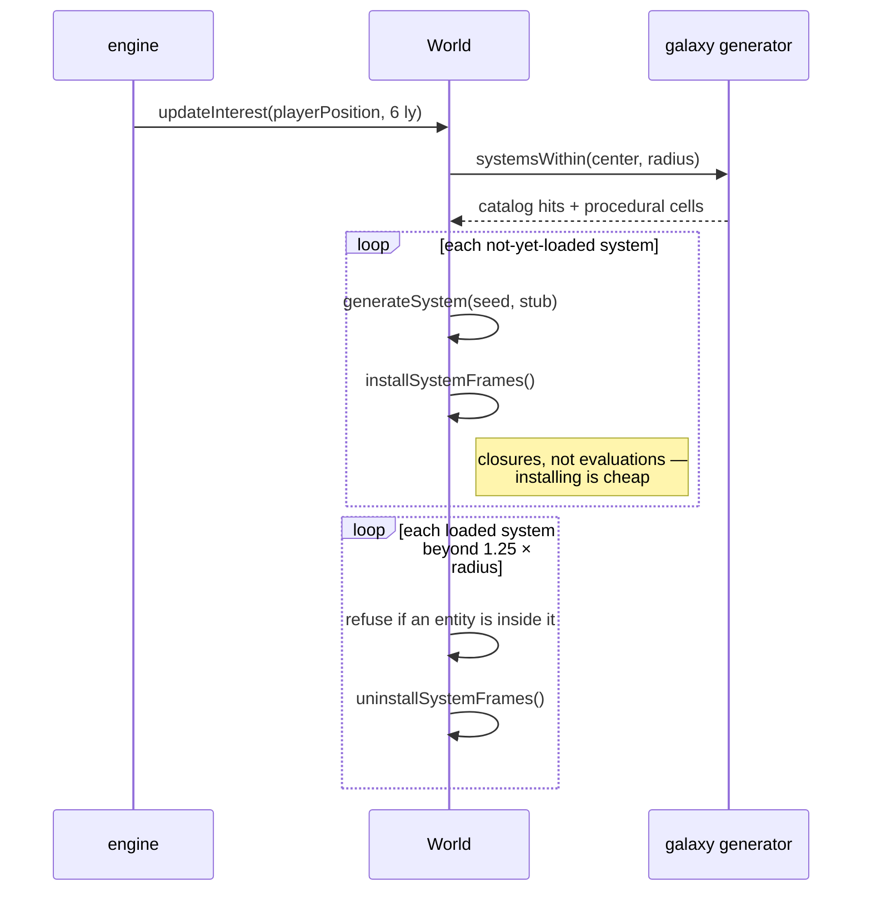
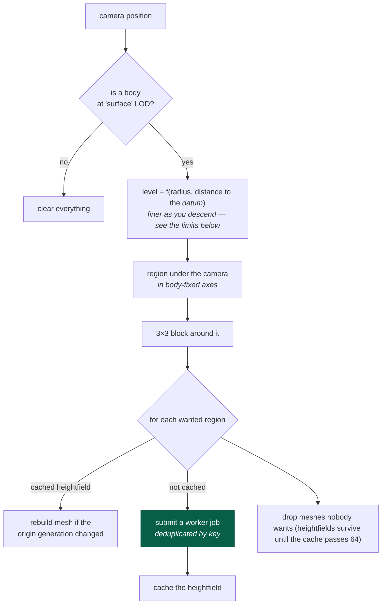

# Streaming

> **The question:** how is only the relevant slice of a galaxy in memory, without
> "loading screens" or a space-mode/planet-mode split?
> **The answer:** loading and unloading are ordinary methods called every so
> often, and existence is separated from being loaded.
>
> Code: `packages/simulation/src/world.ts` (`updateInterest`),
> `packages/rendering/src/terrainWindow.ts`,
> `apps/game/src/engine/terrainStreamer.ts`

---

## Existence is not residency

Six things have to stay distinct, or streaming turns into a cache-coherency
problem. Five of them exist today:

An object can exist canonically — be addressable, be describable, be referenced
by a save — with no frames installed and no Three.js object anywhere. "Where is
the third planet of HIP71683?" is answerable without loading HIP71683.

---

## System streaming

Two details that make this safe:

- **Unloading refuses** if any entity's frame chain passes through the system.
  You cannot pull the floor out from under a ship.
- **Regeneration is exact.** Unload a system, reload it, and the JSON is
  byte-identical — asserted by a test. Unloading is therefore free of
  consequence, which is what makes it usable as an ordinary operation rather
  than a risky one.

The 1.25× hysteresis on the unload radius stops a system thrashing when the
player hovers at the boundary.

---

## Terrain streaming

The streamer is asked, every frame, what should be visible, and reconciles.

**The selection rule is not in the streamer.** Everything above the reconcile
step — the level, the fade, the region under the camera and the block around it —
is `terrainWindow` in `packages/rendering`: a pure function of radius, distance
and a body-fixed direction. The streamer calls it once a frame and owns only the
cache, the worker jobs and the meshes. That split is what makes "what would this
camera ask for?" answerable without a GPU, and it is why the terrain budget has
measured numbers in it at all — the browser asks the question once a frame,
`ir.descend` asks it a few hundred times in a millisecond
([harness](../guides/harness.md#measuring-terrain)).

Both of the rule's limits are named there rather than implied. `windowRadius` is
the 1 that makes the block 3×3. `clipped` counts the patches that fall off the
edge of a cube face — zero almost everywhere, and five of nine over a face
corner, where three faces meet and the window is a third of the ground it should
be. A count rather than a boolean, because the count is the size of the hole.

**What is cached, and why that split:** heightfields are cached; meshes are not.
A [floating-origin rebase](rendering.md#the-floating-origin) invalidates every
vertex position but not a single elevation sample — and the elevations are the
expensive half (14 octaves of 3D noise per sample). So a rebase rebuilds meshes
from cached noise, which is cheap.

Patch keys are `body|face.level.i.j` — `terrainPatchKey`, one definition and
three readers — so the same patch is never requested twice concurrently, and the
request set is stable while the player hovers, meaning most frames submit nothing
at all.

---

## What makes this possible at all

Streaming is only tractable because of two properties established elsewhere:

| Property                              | Why streaming needs it                       | Where                         |
| ------------------------------------- | -------------------------------------------- | ----------------------------- |
| Content is a pure function of address | Unloading loses nothing; reloading is exact  | [determinism](determinism.md) |
| Generation is order-independent       | Patches can arrive from workers in any order | [determinism](determinism.md) |
| Identity exists without residency     | A save can reference an unloaded system      | [identity](identity.md)       |
| Frames install as closures            | Installing a system costs no generation      | [frames](frames.md)           |

Take away any one of them and streaming becomes a cache-coherency problem
instead of a memory-management one.

---

## Two things worth knowing

**No pool means no terrain.** `TerrainStreamer` returns early without one, so a
browser that cannot construct module workers gets main-thread starfield surveys
and no streamed ground at all. That is the real degradation path; there is no
inline-worker fallback in the browser.

**Rebasing is handled in one place.** A patch records the origin generation it
was built against and `#ensure` rebuilds it when that goes stale — for the ~9
patches that should be visible, and nothing else. An explicit `rebuild()` used to
run alongside it from the frame loop, walking the whole 64-entry heightfield
cache and re-adding patches `update()` had just pruned: a frame of off-screen
geometry uploads on every rebase, which is every 4096 m of camera travel. It is
gone.

---

## Current limits

| Limit                                           | Consequence                                                                                                  | Roadmap                                      |
| ----------------------------------------------- | ------------------------------------------------------------------------------------------------------------ | -------------------------------------------- |
| Interest is a radius scan over generation cells | Fine at 6 ly; a spatial index is needed for large radii                                                      | [roadmap](../roadmap.md#streaming-and-scale) |
| Terrain is a 3×3 block at a single level        | No mixed-resolution quadtree, so the horizon is limited                                                      | [roadmap](../roadmap.md#terrain)             |
| Patches do not stitch across faces or levels    | Hairline seams at boundaries                                                                                 | [roadmap](../roadmap.md#terrain)             |
| The level and the fade measure from the datum   | A summit streams a level coarse, and one above `radius · 2^(5.5 − maxLevel)` is not drawn at all — see below | [roadmap](../roadmap.md#terrain)             |
| No prediction of where the player is going      | Patches pop in rather than pre-loading                                                                       | [roadmap](../roadmap.md#streaming-and-scale) |

**The datum is not the ground, and the streaming rules measure from it.**
`terrainLevelFor` and `terrainOpacity` are handed `distance − radius`; for a
camera standing on the surface that is `groundElevation + height`, not `height`.
On a body with real relief the two are kilometers apart, and three things follow.
A summit streams one level coarser than a basin at the same height above the
ground. A level pass at fixed height coarsens and re-refines as the ground below
rises and falls. And a mountain can be too tall to draw at all: the fade ends one
octave above `radius · 2^(4.5 − maxLevel)`, which on Miranda is 2,605 m against a
highest point of 4,826 m, so standing on that summit the streamer asks for
nothing, draws nothing, and leaves the datum sphere on screen. Any body whose
relief exceeds `2^(5.5 − maxLevel)` of its radius has the hole somewhere, and
Miranda's 4.2% is Verona Rupes rather than an exotic case. The fix is a
screen-space error metric, which measures against the patch instead —
[roadmap](../roadmap.md#terrain).

---

## Related

- [Determinism](determinism.md) · [Identity](identity.md) · [Workers](workers.md)
- [Rendering](rendering.md#terrain-meshing) — what happens to a heightfield
