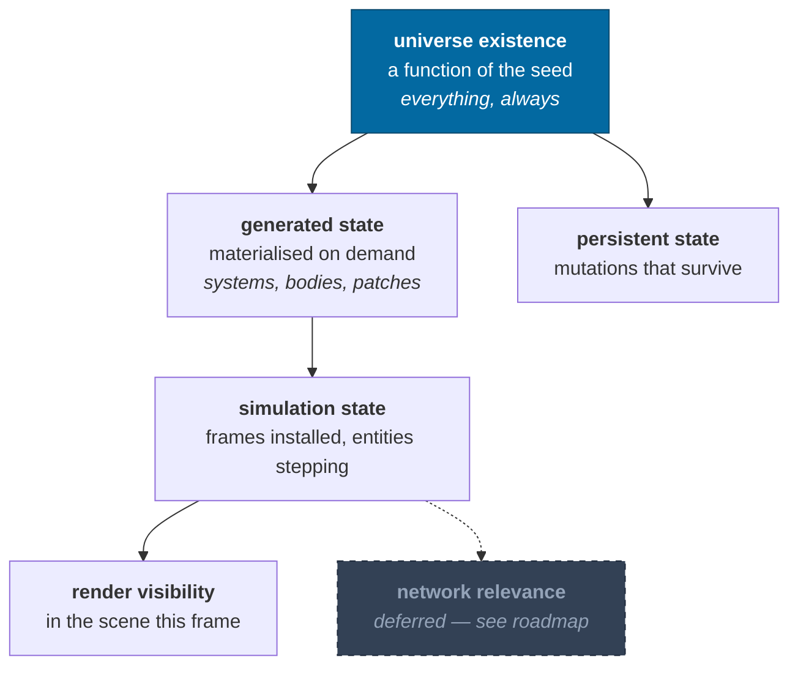
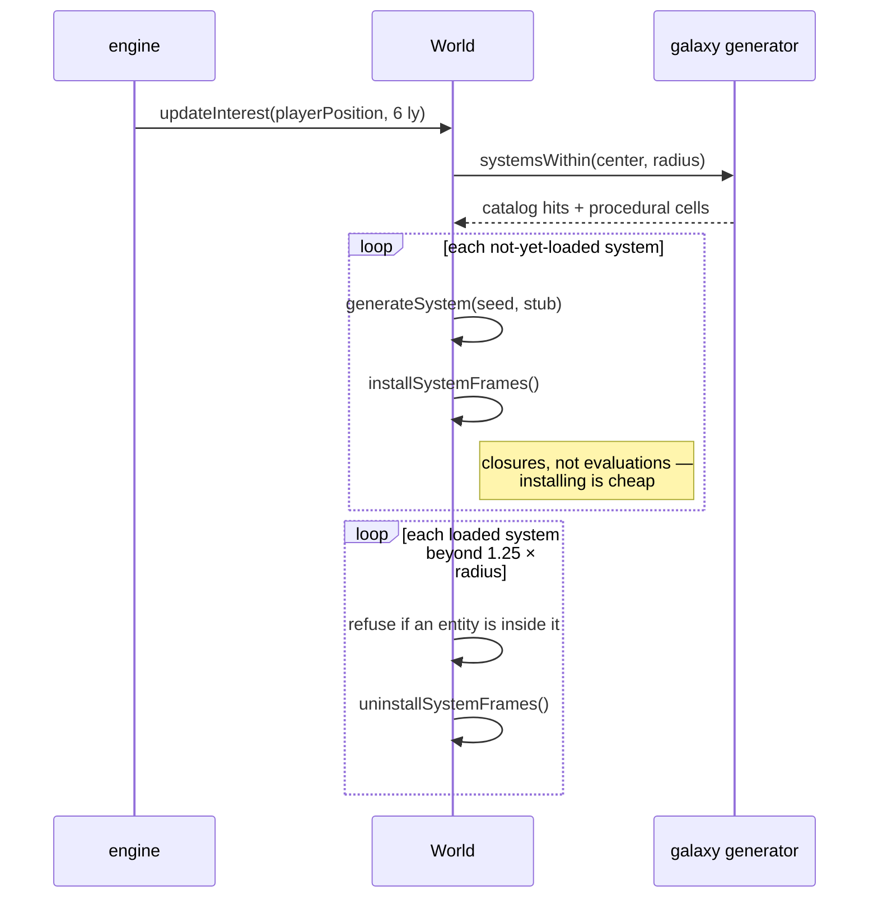
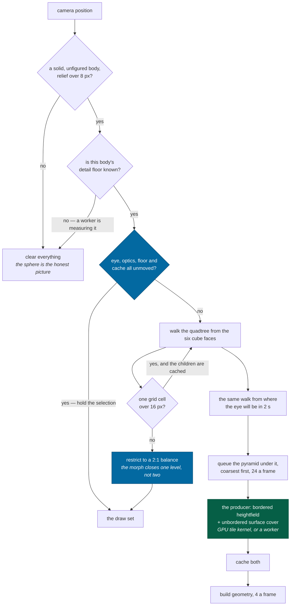

# Streaming

> **The question:** how is only the relevant slice of a galaxy in memory, without
> "loading screens" or a space-mode/planet-mode split?
> **The answer:** loading and unloading are ordinary methods called every so
> often, and existence is separated from being loaded.
>
> Code: `packages/simulation/src/world.ts` (`updateInterest`),
> `packages/rendering/src/terrainSelect.ts`,
> `apps/game/src/engine/terrainStreamer.ts`,
> `apps/game/src/engine/scatterField.ts`

---

## Existence is not residency

Six things have to stay distinct, or streaming turns into a cache-coherency
problem. Five of them exist today:

An object can exist canonically — be addressable, be describable, be referenced
by a save — with no frames installed and no Three.js object anywhere. "Where is
the third planet of HIP71683?" is answerable without loading HIP71683.

---

## System streaming

Two details that make this safe:

- **Unloading refuses** if any entity's frame chain passes through the system.
  You cannot pull the floor out from under a ship.
- **Regeneration is exact.** Unload a system, reload it, and the JSON is
  byte-identical — asserted by a test. Unloading is therefore free of
  consequence, which is what makes it usable as an ordinary operation rather
  than a risky one.

The 1.25× hysteresis on the unload radius stops a system thrashing when the
player hovers at the boundary.

---

## Terrain streaming

The streamer is asked, every frame, what should be visible, and reconciles.

**The selection rule is not in the streamer.** Everything above the queue — the
traversal, the error predicate, the horizon cull, the balance and the morph
bands — is `selectTerrain` in `packages/rendering`: a pure function of a body's
radius and relief, an eye distance and a body-fixed direction. The streamer
calls it twice per walk and owns only the cache, the worker jobs and the meshes.
That split is what makes "what would this camera ask for?" answerable without a
GPU, and it is why the terrain budget has measured numbers in it at all — the
browser asks the question once a frame, `ir.descend` asks it a few hundred times
in a millisecond ([harness](../guides/harness.md#measuring-terrain)).

**Per walk, and a converged view does not walk.** Both selections are a pure
function of the eye in body-fixed axes, the optics, the level floor and the
geometry cache, so at a stance or a hover none of them move: the camera rides
the body, and the eye's whole motion is the ~0.15 mm of jitter left by the pose
round trip through universe coordinates, which a five-millimeter epsilon
absorbs. The held answer is reused, and the request list is topped up from it so
a slot freed by a finished job is still spent. Walking anyway cost 2.1 ms a
frame standing on Earth's summit — the largest single item in the engine step,
recomputing an answer that could not have changed. A frame that builds geometry
or evicts any invalidates its own selection, which is what lets refinement
advance at all. The consequence for anyone reading the counters: `visited`,
`culled`, `starved` and `level` describe the last frame that walked, and
`selections` is what says whether this one did.

### Two fields, and which one each reader gets

The mesh, the detail floor, the material and the observatory's standing camera
read `drawnElevation`. The contact test, the saves and the survey sites read
`groundElevation`. The first is the second plus a presentational tail, and
`drawnDivergence` publishes how far apart they may get: **1.25 m**.

They are two functions rather than one because of a single line of arithmetic.
`surfaceDetailFloor` refines while the middle of a grid cell differs from the
bilinear of its corners by more than `TERRAIN_DETAIL_TOLERANCE`, and that
tolerance **is** `CANONICAL_AMPLITUDE_FLOOR` — deliberately, so that the level
past which refining stops buying detail is the level past which the field stops
having any. The loop that closes is this: a term whose amplitude stays under
that floor cannot deepen the floor, however fine its wavelength, because the
search calls every level of it quiet. What buys the last levels is that an
eight-meter crater is 1.6 m deep, which is over the tolerance — and a term that
size cannot go in the canonical field without moving the ground every save's
landed hull was written against.

So a reader on the wrong side of the line is a category error rather than a
rounding difference. Physics reading the drawn ground puts a landing behind a
term the renderer is free to change; a mesh reading the canonical ground draws a
plane at two meters. [ADR-0021](../adr/0021-the-ground.md) has the alternatives,
including the one that reads as obvious and does nothing.

### The four rules the traversal follows

**Refine while a patch's own grid cell is coarser than the screen can tell.**
Ulrich's screen-space-error predicate wants the mesh's true vertical deviation,
and on a planet that number is startlingly small — Earth's relief is two parts
in a thousand of a cube face, and a patch's 64 quads cut it by another 64. So
the error is a patch's _sample spacing_, the way Cesium's shipping tiles carry
it: the size of the smallest thing a patch can express.

"What the screen can tell" is a statement about optics, and it reads the lens
the picture is actually taken with — [ADR-0017](../adr/0017-the-lens.md). A
fixed angle would be right for exactly one setting of the field-of-view slider
and three levels wrong across it — six once the zoom channel is counted; the
patch demand climbs steeply with the pixels-per-radian, so the assumption would
decide how much terrain exists rather than the picture deciding it. Not as its
square, which is what the arithmetic suggests: refinement runs out of _levels_ at
`surfaceDetailFloor` before it runs out of budget, and the telephoto end of the
slider measures 1.9× to 3.2× the flight lens's demand rather than thirteen times
it. Racking the zoom out on top of that is the one corner where the floor is
reached and the square bites again — a telephoto held on a subject wants an order
of magnitude past any cap, so the disk goes a level coarse on every step and says
so. The viewport is
in **display** pixels with any supersampling divided back out: 4× AA raises the
sample count, not the
detail a viewer can resolve, and feeding the raw buffer in asks for 6.5× the
patches to draw geometry the resolve filter averages away.

**Stop where the field stops.** Past some level a patch is a bilinear upsample of
its parent. `surfaceDetailFloor` measures that per body from the field itself
rather than assuming it, and it lands at level 12 to 19 across the zoo — 12 on
Miranda, 19 on the airless rocky world, as `pnpm sim --terrain-baseline` prints
it against each body's descent. That is a grid cell of 1.41 m down to 0.35 m,
which is the difference between standing on a world and standing on a plane. The
[band stack](rendering.md#terrain-meshing) puts crater rims in the field, a rim
is about a seventh of its crater wide, and resolving one to half a meter takes
samples seven times finer again; the presentational tail below it is worth the
last two to three levels on its own. Nothing in any of that is a constant to
raise, which is what measuring it from the field buys.

The measuring is a pool task, `universe.surfaceDetailFloor`, because it is about
1,500 samples of the same band stack — 33 to 43 ms cold, and cold exactly once
per body, in the frame the streamer first has that body underfoot. So a body
whose floor has not come back yet has **no ceiling to select against**, and the
streamer holds the ground back for those frames rather than guessing one: the
same shape as waiting for the heightfields themselves. A host with no pool
measures it inline, which is every host that has no frame to drop.

Two things settle the walk rather than one. A quiet level counts only if its
stencils touched dry ground — the sea clamp manufactures exact zeros over open
water, so a submerged probe set is the clamp talking rather than the field, and
an ocean world read that way streams its islands, with kilometers of relief, as
six patches forever. And it takes **three consecutive** quiet levels, because a
crater ladder is discrete: a stencil that straddles nothing at one level lands on
a rim at the next, so the first quiet level is not a floor and taking it returned
one whose own residual was twice the tolerance.

**Measure to the ground, not the datum.** A node is a cone of directions crossed
with the shell `[radius − relief, radius + relief]` that ground can occupy, and
the distance is to the nearest point of _that_ — zero when the eye is inside the
shell, which is what standing on the ground means.

**Keep neighbors within one level.** The [CDLOD](rendering.md#terrain-meshing)
morph slides a patch onto its _parent's_ grid, so it closes a one-level gap
exactly and a two-level gap not at all. An unrestricted tree produced gaps of up
to six, drawn as dashed black arcs along every level ring; the tree is restricted
to 2:1, which is the classical answer and the rule Transvoxel's transition cells
assume.

**What is cached, and why that split:** heightfields are cached and so is the
geometry built from them. A [floating-origin rebase](rendering.md#the-floating-origin)
invalidates neither: patch vertices are body-fixed and anchor-relative, so the
pose goes back on at draw time rather than into the buffer.

A cache smaller than the working set does not degrade, it **oscillates** — and
the streamer holds two selections at once, the drawn one and the request one,
which diverge because the second is taken from where the eye is going. Sized at
a flat 512 against a working set of six hundred, every frame evicted ground the
next frame wanted: the draw set collapsed from 350 patches to 19 and refined
back, over and over, which is terrain strobing at every altitude. Both caps come
from the selection's own ceiling now, and eviction keeps everything the frame's
request list names — the drawn set, the starved children, the whole pyramid —
because the pyramid is re-asked for every frame: a keep set of the two
selections' leaves alone turns the cap into a treadmill that evicts a rung,
re-requests it, and regenerates it at 22 to 50 ms a patch.

**The cap has to clear that keep set, and neither selection measures it.** The
request set is two independently capped selections — the drawn one and the one
taken at the look-ahead eye — plus the starved rung, so no multiple of the
selection cap bounds it: geometry is held at twice the cap and heightfields at
three times, and both numbers are measurements rather than derivations. Under
the keep set the streamer builds four patches a frame and evicts four it wanted
a moment earlier, `starved` never falls to zero, and every twenty-sixth frame
the eviction takes a patch the traversal is refining through: the disk snaps
from 760 patches at level 7 to four at level 1 and back, two to three times a
second.

What decides whether that happens is the **ratio of keep set to cap**, and it
grows with the camera's speed over the ground as much as with the drawing
buffer — the two selections coincide at a hover and separate as the lead
lengthens. Measured over Luna, Ganymede and Triton: 957 regions hovering at
1600×900, 1,824 at a 20 km ground-track lead at 5120×2880. So a hover at a small
buffer is the case that never shows it, not a buffer size below which it cannot
happen. Only the geometry count shows it either way, because refinement gates on
the mesh while the heightfield cache sits at its steady value.

Patch keys are `body|face.level.i.j` — `terrainPatchKey`, one definition and
three readers — and that spelling belongs to the renderer's mesh cache, the one
cache that retains across a retarget. The streamer's own caches key by
`regionKey`, packed arithmetic with no body in it, because the request filter
names over a thousand regions a frame and building that many template strings
was most of what the filter cost. Either way the same patch is never requested
twice concurrently and the request set is stable while the player hovers.

The body-free key has one consequence, and it is why `clear()` does two things
rather than one: a job still in flight for the world just discarded names the
_same_ key the new body's roots do, so it filters the nearest-first head of the
new request list out until it lands, and the ground arrives a heightfield's
latency late on every retarget. `clear()` drops the whole in-flight set, and
cancels it — dropping the key discards only the answer, while cancelling reaches
the majority still sitting in the pool's queue, where the work never happens at
all ([workers](workers.md#cancellation)).

### What is drawn while it loads

Refinement only enters ground that is already in the cache, so a patch whose
field has not arrived is never a hole: its parent is drawn instead, covering the
same ground more coarsely. A descent therefore _sharpens_ rather than filling
in. The request set is taken from where the eye will be in two seconds and asks
for the whole pyramid under it, coarsest first — without the ancestors it would
climb one worker round trip per level, and a streamer starting empty would draw
six cube faces and stay there until a level-nine patch arrived. The velocity
behind that extrapolation is measured in body-fixed axes, because a hovering
camera co-moves with the body at its orbital velocity — 47 km/s at Mercury —
so a universe-frame drift pushed two seconds ahead aims the request set ~94 km
along the orbit rather than along the camera's track over the ground.

### Where the heightfields come from

The streamer asks a `HeightfieldSource` and gets back the same
`HeightfieldResponse` either way — the bordered elevations, the cover, the
extremes — and there are two. The worker pool runs `generateHeightfield`
itself, which is the canonical field: 22 to 50 ms a patch across the zoo on one
core, and a pool of eight does not divide a landing's nine hundred patches far
enough. The GPU tile producer (`apps/game/src/render/terrainProducer.ts`) runs
`terrainKernel.ts`, a TSL port of `drawnElevation` and the cover, one
invocation per bordered sample: sixteen tiles a dispatch, one dispatch in
flight at a time, one body per batch, and a readback that is a copy — measured
through Dawn on an M5, a batch of sixteen Luna tiles at the detail floor is
10 ms from dispatch to readback against 806 ms for the same sixteen on this
thread. [ADR-0023](../adr/0023-the-gpu-producer.md) is the record.

The producer outranks the pool while it can answer, and only for the
heightfields: the level floor is `surfaceDetailFloorTask` on the pool whichever
draws the ground, because it is the canonical field's own measurement. A
producer that stops — a kernel Tint refused at boot, a lost device — reports
itself unavailable, its window rejects with `producer unavailable`, and the next
request goes to the pool; `ir.terrain().producer` names where the next one goes.
The GPU tile is held to the CPU tile by `terrainKernel.gpu.test.ts`: within
3 × 10⁻⁵ of the budget plus eight sample offsets, which is under 4 cm on Earth
from level 12 down and 1.21 m at level 0, where a sample's own position is held
in float32 across a quarter of a face. Nothing canonical is affected: the
contact test integrates `elevationAt` on the CPU, always.

**Twenty-four requests go out a frame**, because that ladder is strictly serial:
a level cannot refine until all four children of every node on it have arrived,
so a frame that under-asks is a frame the next level waits for, and with the
detail floor twelve to nineteen levels down that is most of a landing. More
would queue rather than work — the requests go to a pool, and a queue is what a
camera turn has to throw away.

### The rocks stream too, and not through the quadtree

Scatter is a second streamer — `apps/game/src/engine/scatterField.ts` — and it is
a much smaller one, because a rock has no tree in it. It lives at one level, so
there is no morph to close and no coarser version to hand over to; the whole
population is inside 212 m at the flight lens, which a descent crosses in seconds
and a stance never crosses at all; and a dozen regions of a thousand slots is a
few hundred kilobytes against the quadtree's hundreds of megabytes, so there is
no eviction pressure worth the name either.

What it does share is the budget problem. `regionScatter(surface, region, slots)`
answers "does `r:…/o:837` hold a rock" with a hash over 1,024 candidate slots in
a 256 m region, and **resolving one candidate is a field sample** — the same band
stack a heightfield vertex pays for — so a whole region is eight and a half
milliseconds and cannot land inside a frame. The slot range is half-open for
exactly that reason, 128 slots go out a frame, and a region is drawn only once it
is whole: half a region drawn and then completed is rocks appearing out of
nothing in the middle of the frame, which is worse than a region that arrives
late. Slot 837 is slot 837 whichever call resolves it.

It runs on the main thread rather than through the pool, which is the one place
this differs from the heightfields, and it is affordable only at that budget:
128 field samples is 1.8 ms. `ir.terrain().scatter` reports what it holds —
regions, regions still resolving, rocks drawn, and the range they are drawn to
([harness](../guides/harness.md#measuring-terrain)).

### What the streamer hands the renderer

`TerrainState` is the whole interface, and it carries more than the meshes.
Beside `patches` it states the body's `palette` — the deposit reflectances,
roughnesses and grains [ADR-0020](../adr/0020-the-face.md) derives from the
body's own facts — its `orientation` and `centre` in render space, the
`datumRadius` the vertices were measured from, and the `lens` the selection was
made against. `apps/game/src/scene/TerrainPatches.tsx` writes all five into the
material's uniforms.

Four of those five are on the state rather than read off `patches[0]`, and that
is deliberate. The frame a body is acquired is a frame with a palette and no
patches, and the uniforms are written before there is anything to draw with
them. The reverse also has to hold: the four nullable ones go back to `null`
when the streamer clears, because a palette reported beside `patches: 0`
describes a body nothing is drawing and the material would go on wearing the
last world's ground. `datumRadius` is a number and keeps its last value — there
is nothing to read it with while the palette is null, and a sentinel radius
would be a second thing to be wrong about.

`datumRadius` is `body.radius`, the equatorial one, because that is what
`buildPatch` measures every vertex from. Not the mean radius: on Earth they are
7 km apart, which is twenty times the ocean datum, so read against the mean an
altitude of "at sea level" comes out at 7,356 m and no water is ever detected.

### Where terrain is not drawn

A body's relief has to cover more than eight pixels before any of this runs.
Past that distance the mesh and the datum sphere are the same picture, and the
sphere already carries a normal map and, on four bodies in Sol, a photograph —
so drawing generated ground over it replaces a measured picture with an invented
one. Earth draws its map down to 2,000 km of altitude and its ground below that;
Miranda, with 10 km of relief on a 236 km radius, keeps terrain out to eight
thousand kilometers, because there the relief _is_ the shape of the body.

A body with a measured figure streams no terrain at all. Every patch is built
on the spherical datum, but a figured body's ground — the contact test,
`surfaceRadius`, the standing camera — is its measured ellipsoid, up to half a
radius inside that sphere on Haumea, so streamed patches would be a spherical
shell floating around the shape model with the standing camera inside the mesh.
Deep terrain on figures is a projection problem the terrain plan defers; until
it is solved, the figure's own shape model is the honest ground.

---

## What makes this possible at all

Streaming is only tractable because of two properties established elsewhere:

| Property                              | Why streaming needs it                       | Where                         |
| ------------------------------------- | -------------------------------------------- | ----------------------------- |
| Content is a pure function of address | Unloading loses nothing; reloading is exact  | [determinism](determinism.md) |
| Generation is order-independent       | Patches can arrive from workers in any order | [determinism](determinism.md) |
| Identity exists without residency     | A save can reference an unloaded system      | [identity](identity.md)       |
| Frames install as closures            | Installing a system costs no generation      | [frames](frames.md)           |

Take away any one of them and streaming becomes a cache-coherency problem
instead of a memory-management one.

---

## Two things worth knowing

**No source means no terrain.** `TerrainStreamer` asks the GPU tile producer
if it has one and the pool otherwise, and returns early with neither — so a
browser that cannot construct module workers gets main-thread starfield surveys,
and streamed ground only if it is a WebGPU page, with the level floor measured
on the main thread once per body. There is no inline-worker fallback in the
browser.

**Rebasing is handled in one place.** A patch records the origin generation it
was built against and `#ensure` rebuilds it when that goes stale — for the ~9
patches that should be visible, and nothing else. An explicit `rebuild()` used to
run alongside it from the frame loop, walking the whole 64-entry heightfield
cache and re-adding patches `update()` had just pruned: a frame of off-screen
geometry uploads on every rebase, which is every 4096 m of camera travel. It is
gone.

---

## Current limits

| Limit                                            | Consequence                                                                                                                       | Roadmap                                      |
| ------------------------------------------------ | --------------------------------------------------------------------------------------------------------------------------------- | -------------------------------------------- |
| Interest is a radius scan over generation cells  | Fine at 6 ly; a spatial index is needed for large radii                                                                           | [roadmap](../roadmap.md#streaming-and-scale) |
| The selection is not frustum-culled              | A whole disk is generated, of which the renderer draws about a third                                                              | [roadmap](../roadmap.md#terrain)             |
| Vertex attributes are float32                    | 237 KB a patch, so a whole-disk selection is 113–255 MB at the flight lens                                                        | [roadmap](../roadmap.md#terrain)             |
| Scatter resolves on the main thread              | A candidate slot is a field sample, so a 1,024-slot region is 8.5 ms and cannot land inside a frame; 128 slots go out a frame     | [roadmap](../roadmap.md#terrain)             |
| The mesh is built on the main thread             | 0.25 ms a patch, budgeted at four a frame; the worker already has the field                                                       | [roadmap](../roadmap.md#terrain)             |
| A generated body's sphere is a flat tint         | Its ground has maria, rays and caps below the eight-pixel gate, and none above it                                                 | [roadmap](../roadmap.md#terrain)             |
| Deposits are chosen from the mesh, not the field | Two patches at different levels report different slopes for the same ground, so a deposit weight steps by ~4% at a level boundary | [roadmap](../roadmap.md#terrain)             |

**The morph closes one level, and that is a constraint rather than a setting.**
A vertex slides toward the position its _parent's_ grid holds for it, so where
two levels meet the finer patch arrives exactly on the coarser one's vertices.
Where three levels meet it arrives on a grid the coarser patch has no vertex on,
and the difference is a hairline of open sky. A wide enough LOD band removes the
possibility by construction — measured, the tree balances itself once a level's
band is 3.7 patches wide — but that costs 500 to 1,000 patches for one disk
against 300 to 600, so the band stays narrow and the tree is restricted instead.

---

## Related

- [Determinism](determinism.md) · [Identity](identity.md) · [Workers](workers.md)
- [Rendering](rendering.md#terrain-meshing) — what happens to a heightfield
- [ADR-0021](../adr/0021-the-ground.md) — the drawn field, the divergence bound, and the rocks
