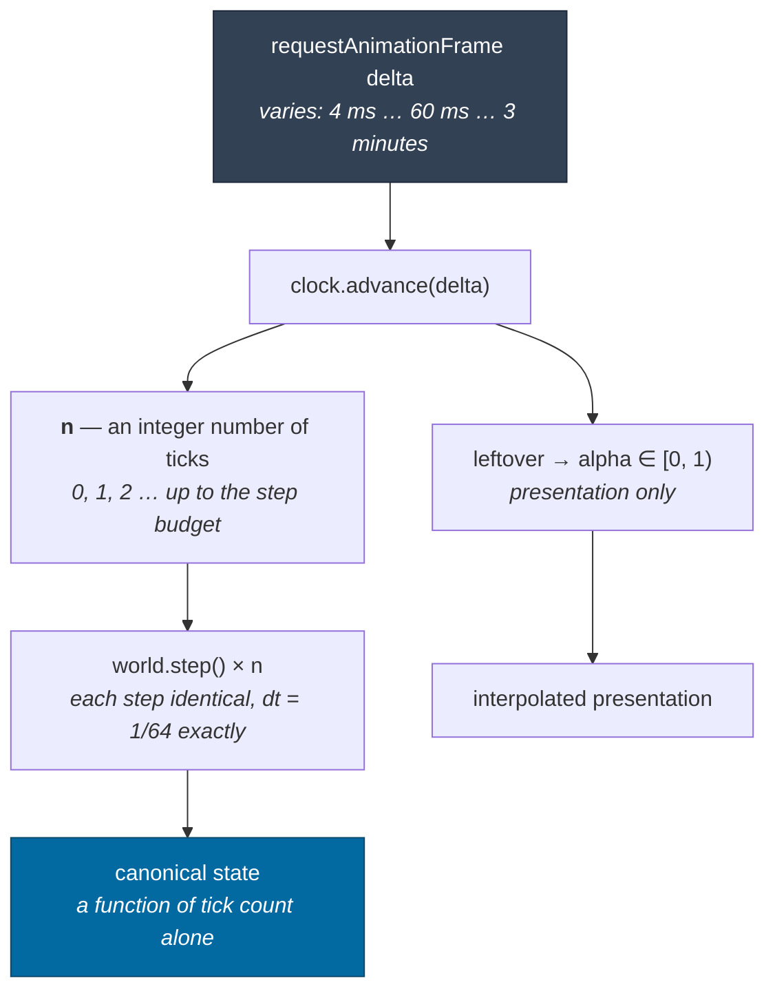
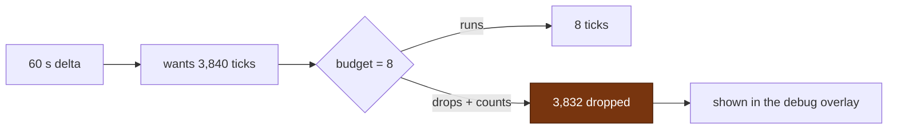
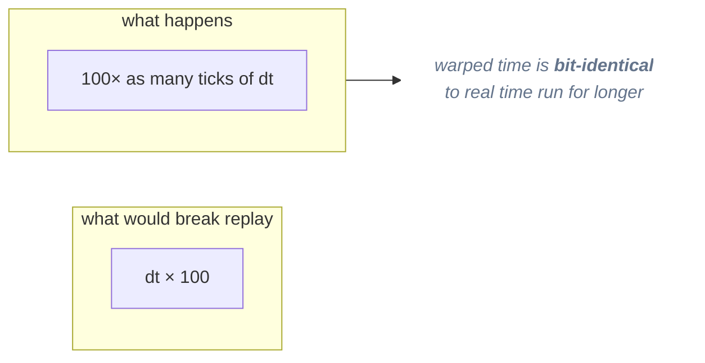
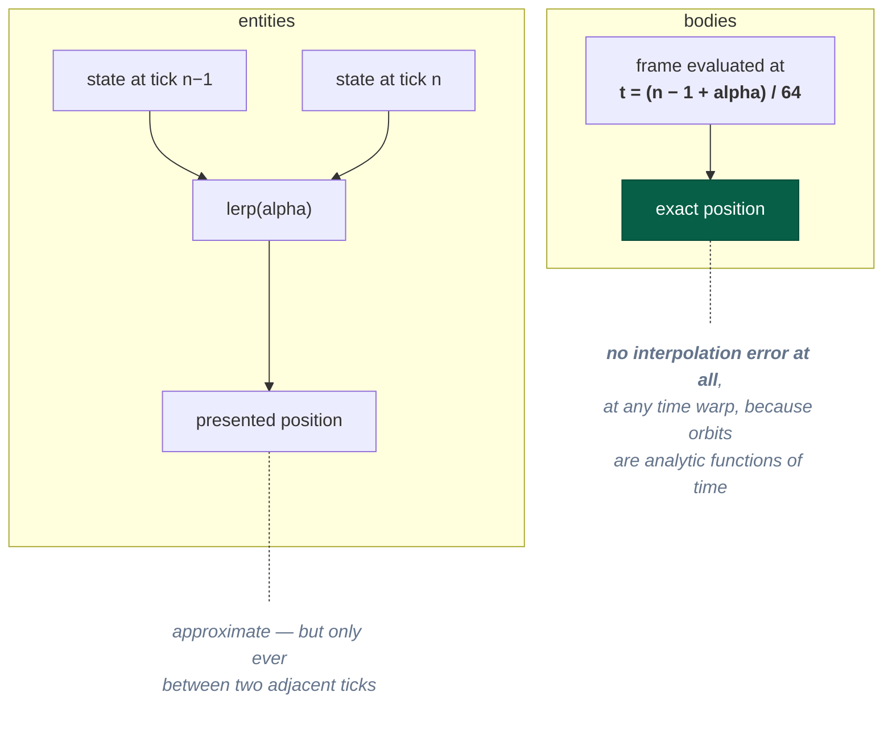
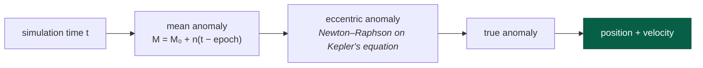

# Simulation time

> **The question:** why does rendering at 144 Hz produce the same universe as
> rendering at 60 Hz — and the same universe as running at 100× time warp?
> **The answer:** canonical state depends only on an integer tick count, and
> wall clock reaches exactly one function whose only output is *how many ticks
> to run*.
>
> Decision record: [ADR-0006](../adr/0006-simulation-clock.md) ·
> Code: `packages/simulation/src/clock.ts`

---

## 64 Hz, and why not 60

The tick rate is **64 Hz**. That is not a performance choice.

`1/64` is exactly representable in binary. `1/60` is a repeating binary
fraction. So:

```js
// 64 Hz — exact, forever
timeOfTick(10_000_000) === 10_000_000 / 64   // exact, no residue

// 60 Hz — two clients reaching the same tick by different
// routes disagree in the low bits
```

Simulation time is derived as `tick / TICK_RATE` rather than accumulated, so at
64 Hz the conversion never rounds. A test asserts `clock.time === 3` exactly
after 192 ticks — an assertion that fails in the low bits at 60 Hz.

The side benefit: 64 Hz is 6.7% more simulation than 60 Hz for the same
architecture.

---

## Where wall clock is allowed to exist



Nothing downstream of `advance` ever sees `delta`. That single constriction is
what makes every determinism claim in the project checkable.

---

## The step budget

A tab backgrounded for a minute comes back with a 60-second delta. Without a
cap, the loop tries to run 3,840 ticks in one frame, freezes the page, and tries
again next frame — the classic **spiral of death**.



Dropped ticks are **counted and displayed**, not silently swallowed. Simulation
time falls behind wall time, which is the correct tradeoff — but the player and
the developer can both see that it happened.

---

## Time warp is more ticks, never longer ticks



Because the tick duration never changes, a session played at 100× and the same
session played at 1× reach identical state. The test runs one world at 100× for
32 frames and another with `runTicks(n)` and compares the hash.

Warp steps in the client are `1 → 5 → 25 → 100 → 1,000 → 10,000 → 100,000`.

---

## Interpolation, and the asymmetry that matters

Rendering presents **one tick in the past**, so there is always a pair to
interpolate between.



This is a direct dividend of [analytic orbits](#analytic-orbits): a planet's
position at a fractional time is *computable*, so it is computed rather than
guessed. A test asserts the half-alpha sample sits exactly midway between the
whole ones.

One guard: if an entity changed frame between the two ticks, its local
coordinates are incomparable, so presentation snaps to the newer frame for one
frame. Interpolating across a frame change would fling the entity across the
system.

---

## Analytic orbits

Bodies are not integrated. Their positions are closed-form solutions of the
two-body problem, evaluated at whatever time is asked for.



Three consequences, all structural rather than cosmetic:

1. **The state of the universe at tick 10^9 does not require having stepped
   through 10^9 ticks.** Time warp and save/load are drift-free by construction.
2. **An unloaded system can still answer where its planets are** — needed for
   the map and, later, for interest management.
3. **No integration error accumulates in orbits**, ever. Energy and angular
   momentum are conserved to 1e-12 over a full orbit because they are never
   integrated in the first place.

The ship, which *is* integrated, uses semi-implicit (symplectic) Euler —
velocity first, then position from the new velocity. Explicit Euler pumps energy
into every orbit, so a coasting ship would slowly climb out of a gravity well: a
failure invisible for minutes and obvious after an hour of time warp.

---

## What is asserted

| Property | How |
|---|---|
| Frame rate does not matter | 60 Hz and 144 Hz worlds compared by state hash at the same tick |
| Jitter does not matter | random 4–60 ms frames vs `runTicks` |
| Warp does not matter | 100× vs 1× |
| Ticks convert exactly | `clock.time === 3` after 192 ticks |
| Stalls do not spiral | 60 s delta runs ≤ 8 ticks and records the drops |
| Pause does not drift | 5 s while paused advances zero ticks |
| Replay is exact | identical scripted inputs → identical hash |

---

## Related

- [Determinism](determinism.md) — the generation half of the same guarantee
- [Rendering](rendering.md) — what happens with the interpolation alpha
- [ADR-0006](../adr/0006-simulation-clock.md) — the full decision
