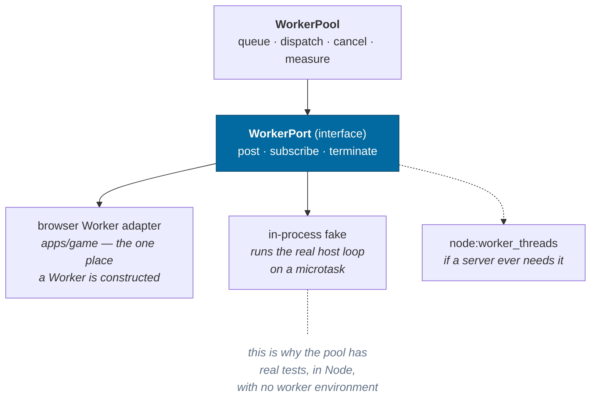
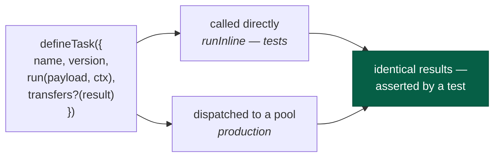
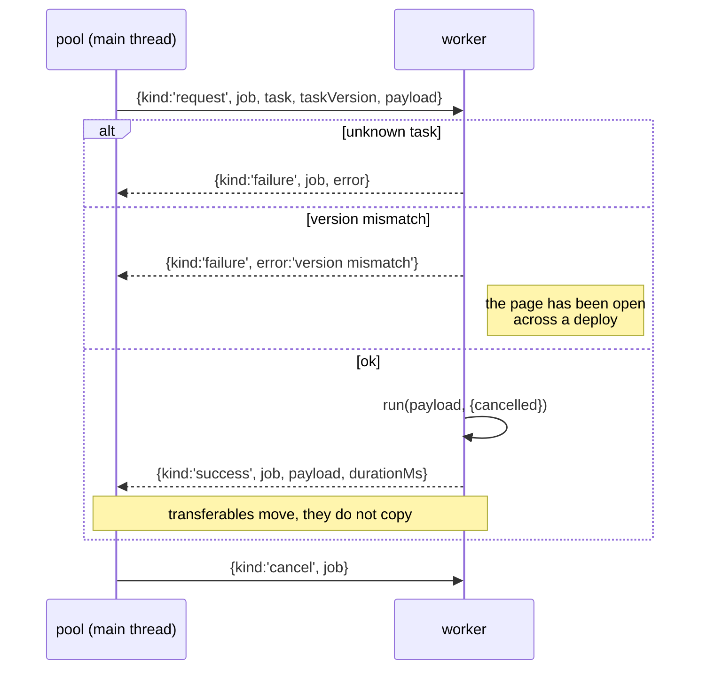
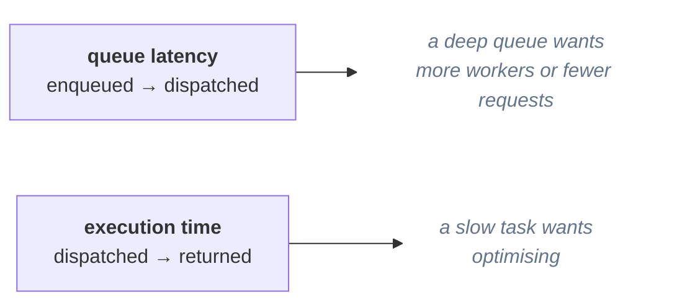

# Workers

> **The question:** how does expensive generation stay off the main thread
> without scattering `new Worker()` through the codebase?
> **The answer:** one abstraction — typed, versioned tasks dispatched by a pool
> that owns job ids, cancellation and instrumentation — behind a **port** so the
> same code runs with no worker at all.
>
> Code: `packages/workers/`

---

## The port pattern

`packages/*` has no DOM lib, deliberately. So this package cannot mention
`Worker` — and it does not need to.



The inline worker is not a mock. It runs the same host loop against the same
registry, serialising through the same envelopes — so a bug that only appears
when something is not structured-cloneable still shows up in a Node test.

It is **not** the browser's fallback, though it used to say so. A browser
without module workers gets *no pool at all*: the starfield survey runs on the
main thread and terrain streaming stops until a pool exists, because
`TerrainStreamer` returns early without one. The inline worker's four callers are
all Node — the headless runner and three test files. It does go through
`structuredClone` and honour its transfer list, so a payload that a real `Worker`
could not clone fails here too.

---

## A task is a function that happens to run elsewhere



Both sides of the boundary import the same definition, so the request shape
cannot drift from the handler shape.

Today's tasks:

| Task | Work |
|---|---|
| `universe.generateHeightfield` | 65×65 samples × 14 octaves of 3D noise → transferable `Float32Array` |
| `universe.generateCell` | every star in one 20 ly generation cell |
| `universe.surveyRegion` | a block of cells — tens of thousands of stars |
| `universe.surveySystem` | a whole system's bodies, for the map |

---

## The envelope, and why versions travel with it



The worker also posts `{kind:'ready', tasks}` when it starts, so the pool can log
which tasks a worker actually serves.

The version check matters more than it looks. An offline-first app is *designed*
to be left open across a deploy. Without the check, a page could generate half a
planet with algorithm v1 and half with v2 and never notice. With it, the job
fails loudly.

The envelope is now **validated** rather than discriminated: the host runs
`decode(decodeWorkerRequest, message)` and drops anything malformed with a log
line. It previously checked only `kind === 'request'`, so `job`, `task` and
`taskVersion` were read off an unvalidated object and `payload` reached
`task.run` as `never` — a trust boundary that trusted everything. `protocol`
exists for exactly this, and now the boundary uses it.

---

## Instrumentation: two numbers, not one



They fail differently, so the pool measures them separately, over a rolling
64-job window, and the debug overlay shows both:

```
workers  4w · 0 active · 0 queued · 25 done · q 9.2ms · run 11.3ms
```

The clock is **injected**, so the pool has no host API dependency and timing
tests are exact rather than flaky.

---

## Cancellation

A job can be cancelled whether or not it has started:

- **Queued** — removed from the queue, promise rejects immediately.
- **Running** — a `cancel` envelope is posted; the task polls
  `context.cancelled()` at a sensible granularity (per cell in a region survey,
  not per star — the check should not cost more than the work).

---

## What is deliberately not here

| Not used | Why |
|---|---|
| `SharedArrayBuffer` | Requires cross-origin isolation headers, which constrains hosting. Nothing yet needs shared mutable memory; transferables cover the current traffic. |
| The simulation itself in a worker | Plausible rather than proven: `apps/headless` shows the core runs unchanged with no DOM, no React and no WebGL — but nothing yet requires it. [Roadmap](../roadmap.md#simulation-in-a-worker). |
| A second pool for a different priority class | One pool, FIFO. Priorities become interesting when terrain competes with something else. |

---

## Related

- [Streaming](streaming.md) — the main consumer
- [Determinism](determinism.md) — why worker order cannot change the universe
- [Persistence](persistence.md) — the same codec discipline at the storage boundary
