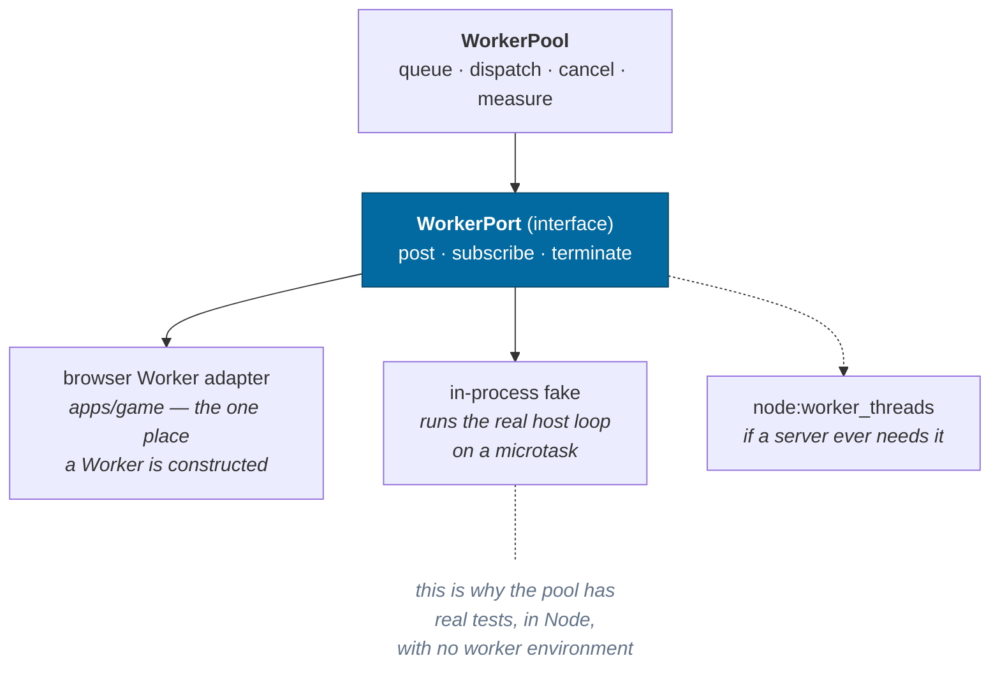
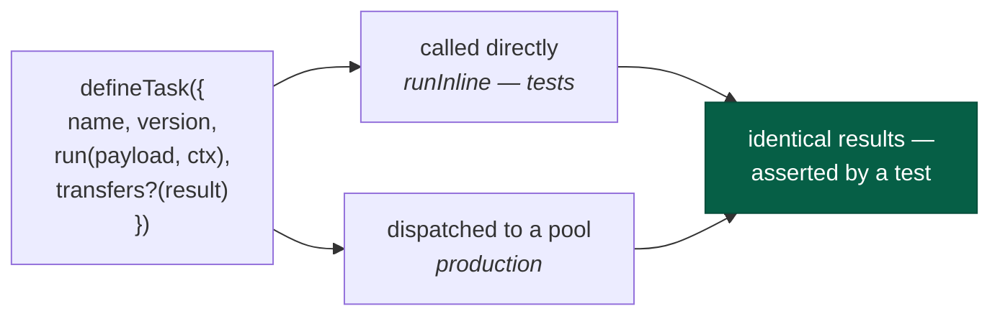
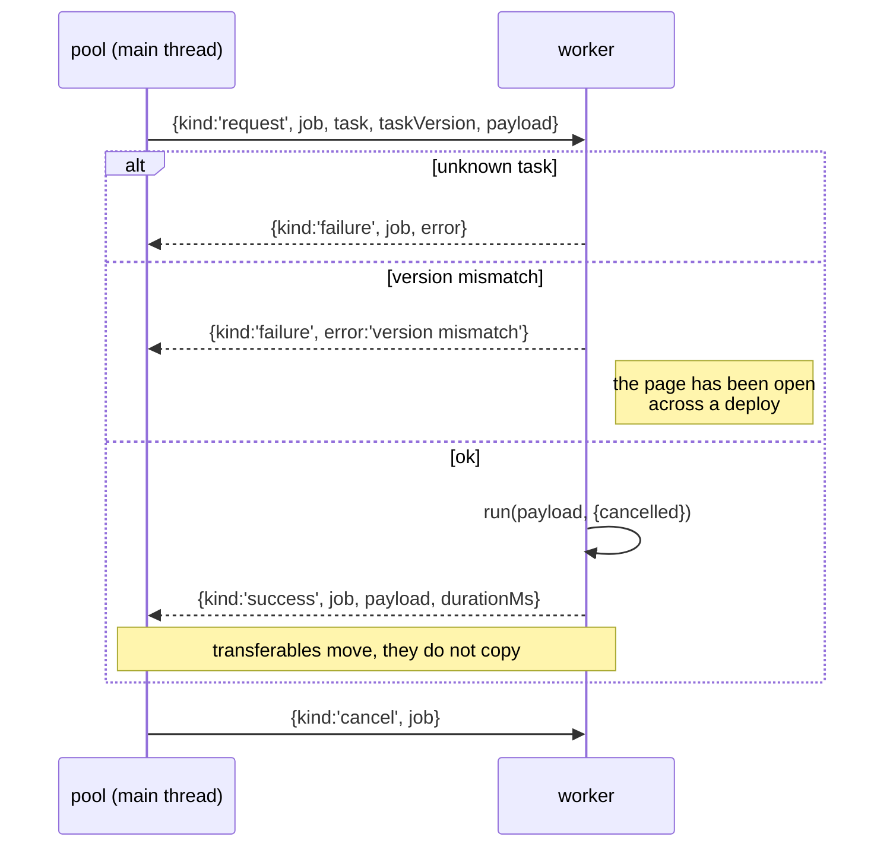

# Workers

> **The question:** how does expensive generation stay off the main thread
> without scattering `new Worker()` through the codebase?
> **The answer:** one abstraction — typed, versioned tasks dispatched by a pool
> that owns job ids, cancellation and instrumentation — behind a **port** so the
> same code runs with no worker at all.
>
> Code: `packages/workers/`

---

## The port pattern

`packages/*` has no DOM lib, deliberately. So this package cannot mention
`Worker` — and it does not need to.



The inline worker is not a mock. It runs the same host loop against the same
registry, serializing through the same envelopes — so a bug that only appears
when something is not structured-cloneable still shows up in a Node test.

It is **not** the browser's fallback, though it used to say so. A browser
without module workers gets _no pool at all_: the starfield survey runs on the
main thread and terrain streaming stops until a pool exists, because
`TerrainStreamer` returns early without one. The inline worker's four callers are
all Node — the headless runner and three test files. It does go through
`structuredClone` and honor its transfer list, so a payload that a real `Worker`
could not clone fails here too.

---

## A task is a function that happens to run elsewhere



Both sides of the boundary import the same definition, so the request shape
cannot drift from the handler shape.

Today's tasks:

| Task                           | Work                                                                                                                            |
| ------------------------------ | ------------------------------------------------------------------------------------------------------------------------------- |
| `universe.generateHeightfield` | 65×65 samples × six bands and a crater ladder → a transferable `Float32Array` of elevations and a `Uint8Array` of surface cover |
| `universe.surfaceDetailFloor`  | the level past which a patch is an upsample of its parent — ~1,500 samples of the same bands, once per body                     |
| `universe.generateCell`        | every star in one 20 ly generation cell                                                                                         |
| `universe.surveyRegion`        | a block of cells — tens of thousands of stars                                                                                   |
| `universe.surveySystem`        | a whole system's bodies, for the map                                                                                            |

`surfaceDetailFloor` is on the pool because it reads nothing a heightfield
request does not already carry, and paying it on the main thread paid it inside
the frame a body arrives — 85% of a 40 ms spike on Earth, on the one frame a
player is watching the ground appear. The consequence a caller has to know is
that a body whose floor is not measured yet has no ceiling to select against, so
the streamer holds the ground back for the frames it takes rather than guessing
one. A host with no pool computes it synchronously; none of those have a frame
to drop.

---

## The envelope, and why versions travel with it



The worker also posts `{kind:'ready', tasks}` when it starts, so the pool can log
which tasks a worker actually serves.

The version check matters more than it looks. An offline-first app is _designed_
to be left open across a deploy. Without the check, a page could generate half a
planet with algorithm v1 and half with v2 and never notice. With it, the job
fails loudly.

The envelope is now **validated** rather than discriminated: the host runs
`decode(decodeWorkerRequest, message)` and drops anything malformed with a log
line. It previously checked only `kind === 'request'`, so `job`, `task` and
`taskVersion` were read off an unvalidated object and `payload` reached
`task.run` as `never` — a trust boundary that trusted everything. `protocol`
exists for exactly this, and now the boundary uses it.

---

## Instrumentation: two numbers, not one


They fail differently, so the pool measures them separately, over a rolling
64-job window, and the debug overlay shows both:

```
workers  8w · 0 active · 0 queued · 25 done · q 9.2ms · run 11.3ms
```

The clock is **injected**, so the pool has no host API dependency and timing
tests are exact rather than flaky.

---

## Cancellation

A job can be canceled whether or not it has started:

- **Queued** — removed from the queue, promise rejects immediately.
- **Running** — a `cancel` envelope is posted; the task polls
  `context.cancelled()` at a sensible granularity (per cell in a region survey,
  not per star — the check should not cost more than the work).

**The terrain streamer is the caller that makes this pay.** `submit` hands it a
`JobHandle` rather than a bare promise, it holds one per in-flight heightfield,
and `clear()` cancels the whole window on a retarget. Dropping the answer is not
enough: at the 128-job cap all but `poolSize()` of those are still queued, where
cancelling is a splice and the work never happens, and leaving them there put up
to 50 s of ground nobody will see ahead of everything the next view wants. The
few actually running finish — `generateHeightfield` polls nothing and cannot be
interrupted mid-field — and their answers are discarded by the streamer's epoch.
A cancellation arriving back at its own caller is that caller's decision, not a
failure, so the rejection is matched on and not logged.

---

## A source is a port over the pool

The streamer does not ask the pool for heightfields. It asks a
`HeightfieldSource` — `kind`, `available`, an optional `maxLevel`,
`submit(payload) → JobHandle` — and `poolHeightfieldSource(pool)` is the pool
wearing that interface. The
other implementation is `createTileProducer(renderer)` in
`apps/game/src/render/terrainProducer.ts`: a TSL compute kernel that produces
sixteen tiles a dispatch on the GPU, installed by `App` once the renderer is
ready and its pipeline has compiled behind the boot cover
([ADR-0023](../adr/0023-the-gpu-producer.md)).

The port is what makes the two interchangeable in the one place that
matters. `submit` returns the same `JobHandle` either way, so `clear()`
cancels a GPU batch's queue exactly as it cancels the pool's, and the epoch
discards a late answer from either. A source that fails — a lost device, a
pipeline that will not build — sets `available = false`, the streamer's next
request goes to the pool, and the session continues on the canon.
`?producer=cpu` refuses the GPU source outright, which is how the pool's own
figures are re-measured; `ir.terrain().producer` says which one answered.

The interface lives here, in `packages/workers`, rather than beside the
renderer, because the pool implements it and this layer cannot see the one
above. Nothing in it names a renderer, a device or a buffer: a payload in, a
handle out, the same envelope the worker task already speaks.

---

## What is deliberately not here

| Not used                                     | Why                                                                                                                                                                                                                                                                 |
| -------------------------------------------- | ------------------------------------------------------------------------------------------------------------------------------------------------------------------------------------------------------------------------------------------------------------------- |
| `SharedArrayBuffer`                          | Requires cross-origin isolation headers, which constrains hosting. Nothing yet needs shared mutable memory; transferables cover the current traffic.                                                                                                                |
| The simulation itself in a worker            | Plausible rather than proven: `apps/headless` shows the core runs unchanged with no DOM, no React and no WebGL — but nothing yet requires it. [Roadmap](../roadmap.md#simulation-in-a-worker).                                                                      |
| A second pool for a different priority class | One pool, FIFO — and terrain does compete with the star survey, which read 4–8 s of queue behind a landing's heightfields. Cancelling the window the streamer no longer wants is what that needed; a priority class would have reordered work nobody wanted at all. |

---

## Related

- [Streaming](streaming.md) — the main consumer
- [Determinism](determinism.md) — why worker order cannot change the universe
- [Persistence](persistence.md) — the same codec discipline at the storage boundary
