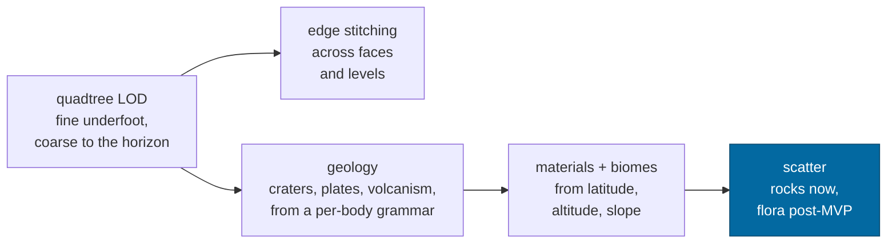

# Content

What exists in the galaxy, in what quantity, and generated how — because with
[one person and coding agents](charter.md#the-honest-constraints), _generated
how_ is the only question that determines whether it exists at all.

---

## The rule

> **If it cannot be generated, it is not content. If it must be authored, it is a
> part, and parts are assembled by generation.**

Everything in this game is one of three things:

|               | What it is                             | How many can exist             | Example                                                     |
| ------------- | -------------------------------------- | ------------------------------ | ----------------------------------------------------------- |
| **Generated** | A pure function of seed and address    | Unbounded                      | Planets, terrain, asteroids, ship variants                  |
| **Observed**  | Ingested from a real catalog           | As many as astronomy has found | Stars, confirmed exoplanets                                 |
| **Parts**     | Hand-authored, assembled by generation | Tens, not thousands            | Room modules, hull sections, weapon models, biome materials |

The third row is the entire art budget. Twelve room modules and a layout grammar
produce every ship interior in the game; forty hull sections produce every ship.
The moment a design requires a hundred hand-made unique things, it is not a
design this project can build, and it should be cut or restated as a parts
problem.

---

## Status against the roadmap

Mirrors [`docs/roadmap.md`](../roadmap.md#content-the-rest-of-the-vision), which
is the engineering-facing view of this same table.

| Thing                  | Status | Launch target                        | Notes                                                                                                                                                                                                                                     |
| ---------------------- | ------ | ------------------------------------ | ----------------------------------------------------------------------------------------------------------------------------------------------------------------------------------------------------------------------------------------- |
| Galaxy, systems, stars | ✅     | Catalog + procedural fill            | 7,123 real systems within 150 ly, from the [ingest pipeline](galaxy.md#ingest-pipeline)                                                                                                                                                   |
| Planets, moons         | ✅     | Full                                 | Deterministic from address                                                                                                                                                                                                                |
| Planetary terrain      | 🟡     | Quadtree LOD, biomes, materials      | The visible ceiling on everything — see [production](production.md)                                                                                                                                                                       |
| Ships                  | 🟡     | 6 hulls, ~60 modules                 | One debug ship today                                                                                                                                                                                                                      |
| Rings                  | ✅     | All bodies that warrant them         | Saturn's, Jupiter's, Uranus's, Neptune's, and Haumea's, Quaoar's, Chariklo's and Chiron's — the seven without a published map are looked up rather than drawn; a procedural giant gets a 1-in-6 chance and a strip from its own character |
| Asteroids / belts      | 🟡     | 2–4 belts per system where warranted | 50 real asteroids and comets in Sol and 6–18 generated per system, as addressable `b:` bodies. A belt you can _see_ still wants a **population generator**: many small bodies from one cell seed, addressed as `o:` objects               |
| Body figures           | ✅     | Everything below the rounding radius | 92 of Sol's 129 bodies are not spheres; 25 carry measured shape models — [ADR-0013](../adr/0013-measured-figures.md)                                                                                                                      |
| Star clusters, nebulae | ⬜     | Post-MVP                             | Density modulation in the galaxy generator + volumetric rendering                                                                                                                                                                         |
| Exotic remnants        | ⬜     | Post-MVP                             | White dwarfs, neutron stars, black holes — a body kind; the hard part is rendering                                                                                                                                                        |
| Vegetation, flora      | ⬜     | Post-MVP                             | Region-seeded scatter; the `o:` address segment exists for it                                                                                                                                                                             |
| Rocks, surface scatter | 🟡     | **MVP**                              | Region-seeded boulders addressed as `o:` objects, four generated shapes instanced in the terrain's own material — [ADR-0021](../adr/0021-the-ground.md). No outcrops, no debris, no collision                                             |
| Structures, outposts   | ⬜     | 3 kinds, parts-assembled             | First real consumer of [persistent mutations](../roadmap.md#persistent-mutations)                                                                                                                                                         |
| Humanoids              | ⬜     | Post-MVP                             | Needs a character controller on a surface frame                                                                                                                                                                                           |
| Small physical objects | 🟡     | Samples, tools, debris               | Debug cubes render at correct scale today; no interaction                                                                                                                                                                                 |

---

## Bodies

### Distribution

Where the catalog is silent, generation fills in — and it should fill in
_plausibly_, which means the generator's statistics should look like the real
ones rather than like a designer's preferences.

| Property                             | Target distribution                  | Real basis                                                                                                                                                                |
| ------------------------------------ | ------------------------------------ | ------------------------------------------------------------------------------------------------------------------------------------------------------------------------- |
| Spectral class                       | M ≫ K > G > F > A > B > O            | The stellar initial mass function [Source: Chabrier, _Galactic Stellar and Substellar IMF_, 2003]                                                                         |
| Planets per system                   | 0–12, median ~3                      | Kepler occurrence rates `[Assumption: approximate; validate against current occurrence-rate literature at ingest]`                                                        |
| Rocky : giant ratio                  | ~2 : 1 within 10 AU                  |                                                                                                                                                                           |
| Moons per giant                      | 4–60, log-distributed                | Sol's giants as the reference                                                                                                                                             |
| Landable fraction                    | ~55% of solid bodies                 | Airless and thin-atmosphere worlds; thick-atmosphere worlds are not landable in the MVP                                                                                   |
| Systems with belts                   | 100%                                 | Every system that formed planets has leftovers. 6–18 bodies each, which is a _sample_ of a population that runs to millions                                               |
| Small-body sizes                     | `dN/dD ∝ D^-3.5`                     | Dohnanyi's collisional cascade [Source: Dohnanyi, _Collisional model of asteroids_, JGR 74, 1969]                                                                         |
| Small-body rotation                  | ≥ `sqrt(3π/Gρ)`, log-normal above it | The rotation barrier a strengthless rubble pile flies apart at — 2.13 h for rock, 4.26 h for a comet nucleus. Measured populations pile up against it and do not cross it |
| Elongation, `b/a`                    | 0.43–0.99, median 0.74               | The 25 measured shape models in `data/shapes/`                                                                                                                            |
| Roughness about the fitted ellipsoid | 0.023–0.61, median 0.090             | The same 25                                                                                                                                                               |

**The generator already does the astrophysics honestly** — main-sequence
mass–luminosity, a frost line that scales with luminosity, densities that separate
rocky worlds from giants — and its own comment says the point is that swapping in
something better later is a change to one file. That is the right posture.

### Body kinds

| Kind              | Landable | Notes                                                                                                                                                                |
| ----------------- | -------- | -------------------------------------------------------------------------------------------------------------------------------------------------------------------- |
| Rocky             | ✅       | The default. Terrain, no or thin atmosphere.                                                                                                                         |
| Ice               | ✅       | Terrain with an ice material set; often outer-system                                                                                                                 |
| Gas giant         | ❌       | Approachable, ring systems, moons. A destination without a surface.                                                                                                  |
| Ice giant         | ❌       |                                                                                                                                                                      |
| Moon              | ✅       | Anything orbiting a body rather than a star                                                                                                                          |
| Asteroid          | ⬜       | Modeled and drawn with its real figure; **not landable yet** — micro-gravity is still the most interesting on-foot environment in the game and nothing implements it |
| Comet             | ⬜       | The nucleus is modeled and drawn. The coma and tail — the part anybody has ever seen — are a rendering problem nobody has started                                    |
| Dwarf planet      | ✅       | Round, and a world. Pluto has its heart; Haumea is a genuine tri-axial ellipsoid because it turns in 3.9 hours                                                       |
| Exotic remnant ⬜ | ❌       | White dwarf, neutron star, black hole. Hazard and spectacle.                                                                                                         |

Below about 200 km a body stops being a spheroid and starts being a _shape_ —
see [ADR-0013](../adr/0013-measured-figures.md). That is a rendering and data
distinction rather than a gameplay one today, but it is the thing that makes an
asteroid feel like a place rather than a small planet, and the on-foot design
should assume an irregular surface with a gravity vector that does not point at
the center.

---

## Terrain

The single most visible shallowness today and the natural next milestone. The
engineering sequence is in
[`docs/roadmap.md`](../roadmap.md#terrain); this is what it has to produce.

### Geology

Derived, never authored, from the same facts the record already carries.
[ADR-0019](../adr/0019-the-geology.md) is the decision record: a
`SurfaceGrammar` turns mass, radius, air, temperature and the tide a primary
raises into which bands a body has and how loud each is, a per-body sketch
places plate nuclei and hotspots and sets the crater field's lattice ladder, and
six bands evaluate against them. What that produces is a body that looks like
itself — Mercury saturated with craters under one unmoving lid, Earth with
plates and orogens along their margins, Venus the same size and stagnant because
it has no ocean to weaken its lithosphere, Enceladus with four parallel
fractures across a shell nothing has had time to hit.

### Biomes

Derived, never authored. A biome is a **lookup from three values the generator
already computes per vertex** — latitude, altitude, slope — plus body-level
properties (temperature, atmosphere, water presence).

| Biome        | Conditions                                           | Material set                                      |
| ------------ | ---------------------------------------------------- | ------------------------------------------------- |
| Regolith     | Airless, any latitude                                | Fine gray-brown dust, high-frequency crater noise |
| Basalt plain | Airless or thin, low slope, low altitude             | Dark, low roughness variance                      |
| Highland     | High altitude, high slope                            | Exposed rock, scree at the base of slopes         |
| Polar ice    | High latitude, temperature below freezing            | Bright, low roughness, wind-scour patterning      |
| Sand sea     | Thin+ atmosphere, low slope, warm                    | Dune-scale noise, wind-aligned                    |
| Salt flat    | Thin+ atmosphere, low altitude, evaporite conditions | Bright, cracked, very low slope                   |
| Seabed       | Under a sea the ground temperature admits            | Silt, seen through a sheet that refracts it       |
| Riverbed     | The floored channel of a valley, with liquid to run  | The liquid painted on its bed                     |
| Biosphere    | Liquid water, air, a temperate band; thins at height | The body's own pigment as a deposit, no geometry  |
| Tundra ⬜    | Atmosphere, cold, water                              | First biome with flora                            |
| Temperate ⬜ | Atmosphere, moderate, water                          | Post-MVP                                          |

Eight biomes, six of them airless or near-airless, is the right MVP set: it
covers the great majority of landable real bodies, and it avoids the flora
problem entirely until after launch. The three rows between them are what
[ADR-0026](../adr/0026-the-liquid.md) added without geometry — a seabed, a
riverbed and a pigment are colors the cover carries, and a temperate world
reads as one from orbit before a single plant is modeled.

**Materials are the art budget.** Each biome needs a PBR material set —
albedo, roughness, normal, and a detail layer — and those are the few dozen
authored assets the whole game rests on. See [art](art.md).

Until they exist, [ADR-0020](../adr/0020-the-face.md) draws the six from a
parameterized palette: a reflectance ratio, a roughness, a grain and a bump per
deposit, expressed against the body's own published colour so that Mars stays
ochre and Callisto stays grey while both get the same internal contrast. The
lookup is split by who can answer — latitude, altitude and slope per pixel from
the mesh, and an eight-byte _cover_ per vertex for what only the generator knows:
where the flood basalt is, where a young crater has thrown fresh material, which
way the crust's composition varies, where the volatiles have condensed. A body
with a published map wears it, and the invented channels switch off, because the
maria are in the photograph already.

### Scatter

Rocks before plants, and the rocks are built —
[ADR-0021](../adr/0021-the-ground.md) is the record. A boulder is an _address_
rather than an entry in a list: `regionScatter` answers "does `r:…/o:837` hold a
rock" with a hash over 1,024 candidate slots in a 256 m region, gated by the
surface cover the vertex already carries, and slot 837 is slot 837 whichever call
resolves it. Four generated shapes are instanced with **the terrain's own
material**, so a rock comes out bedrock on its steep faces and regolith on its
top, in the palette of the ground it is lying on.

The cheapness is the point and it holds: a handful of instanced meshes with a
rotation and a scale apiece do more for the feeling of standing on a world than
any amount of additional terrain frequency, and the whole population inside 212 m
is a few hundred kilobytes against the quadtree's hundreds of megabytes.

Not yet here: outcrops and debris beside the boulders, the fade that scales a
rock in from zero rather than popping it in at two pixels
([art](art.md#also-required)), and collision — a rock is presentational, and the
contact test does not know it exists. [On foot](onfoot.md) is the layer that
changes the last of those.

---

## Systems and stations

| Kind                        | Count at launch                      | Placed how                                                   |
| --------------------------- | ------------------------------------ | ------------------------------------------------------------ |
| **Survey outposts**         | ~1 per 8 inhabited systems           | Generated placement in real nearby systems; parts-assembled  |
| **Independent stations**    | ~1 per 20                            |                                                              |
| **Automated installations** | 0–3 per system, sparse beyond 200 ly | Fully generated                                              |
| **Wrecks** ⬜               | Rare, log-distributed with distance  | The setting's only narrative surface — see [world](world.md) |

Inhabited space is deliberately **small** — a bubble of a few hundred light-years
around Sol, thinning outward, with nothing beyond it. That is both the honest
consequence of a setting that has had the Reference Drive for a short time and
the reason the frontier means something.

---

## Content volume at launch

For the [MVP](production.md#the-mvp-the-explorer), the numbers that have to be
true:

|                                | Target                                | How it is met                        |
| ------------------------------ | ------------------------------------- | ------------------------------------ |
| Star systems reachable         | Effectively unbounded                 | Generated; ~119k cataloged via HYG   |
| Systems with real catalog data | ~119,000                              | HYG ingest                           |
| Confirmed exoplanets           | ~6,000 `[Assumption: read at ingest]` | NASA Exoplanet Archive               |
| Landable bodies                | Millions                              | Generated                            |
| Biomes                         | 8                                     | Authored material sets               |
| Ship hulls                     | 6                                     | Parts-assembled                      |
| Ship modules                   | ~60 across 12 lines × 5 grades        | Parametric                           |
| Suit modules                   | ~18                                   | Parametric                           |
| Room modules                   | 12                                    | Authored parts                       |
| Rock / scatter meshes          | 4 today, ~20 eventually               | **Generated** — displaced icospheres |
| Weapons                        | 12 across 4 classes                   | Post-MVP                             |
| Structures                     | 3 kinds, parts-assembled              | Post-MVP                             |

**The authored column totals roughly 20 meshes and 8 material sets.** The rock
shapes are generated rather than modeled, which is twenty meshes the art budget
does not have to spend. That is the number that has to be affordable, and it is.
Everything else in the table is a function.

---

## Related

- [galaxy](galaxy.md) — where the real data comes from
- [art](art.md) — what the material sets have to look like
- [production](production.md) — when each row lands
- [`docs/roadmap.md`](../roadmap.md#content-the-rest-of-the-vision) — the engineering view of this table
