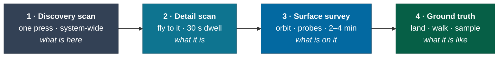

# Exploration

The three scanning tiers, the Almanac, discovery credit, and the data economy —
which is the whole economy, because there is no money.

> This page is both §5 (a core mechanic) and §14 (the economy). That they are the
> same page is the point: in this game the reward loop and the progression loop
> are one loop.

---

## The scan ladder

Three tiers, escalating in cost and in what they give back. Each is a distinct
verb with a distinct feel, and the ladder is what turns "arrive at a system" into
thirty to ninety minutes of structured activity.



### Tier 1 — Discovery scan

**Input.** One key. No cost, no cooldown, no aiming.

**System.** Resolves the system's body manifest: how many bodies, their classes,
their orbits, and their [provenance](galaxy.md#the-three-layer-body-model). It
does **not** resolve composition, atmosphere, mass, or anything on a surface.

**Feedback.** A rising sweep tone and the system map populating outward from the
star, bodies appearing in orbital order over about four seconds. Observed bodies
land solid; projected bodies land dashed.

**Rationale.** Elite's "honk" is the single best-designed moment of arrival in the
genre: it costs nothing, takes no skill, and produces a complete change in what
the player knows. It converts arrival from "look around" into "read the map and
choose", which is where the interesting decision is. Taken directly, with the
addition that provenance is visible immediately — so a player arriving at a
system with three _confirmed_ planets knows instantly that they are somewhere
astronomically real.

| Parameter  | Value                                 |
| ---------- | ------------------------------------- |
| Range      | Entire system                         |
| Duration   | ~4 s reveal, non-blocking             |
| Cost       | None                                  |
| Data yield | Small, flat: 1 unit per body revealed |

### Tier 2 — Detail scan

**Input.** Target a body, fly within range, hold alignment for the dwell.

**System.** Requires proximity — within **0.35 × body radius above the surface**,
scaled by scanner grade — and alignment within 20°. Yields mass, radius, density,
rotation, axial tilt, atmospheric composition and pressure, surface temperature
range, and landability. This is the scan that converts a _projection_ into a
_surveyed_ body and is the atomic unit of discovery credit.

**Feedback.** A progress ring on the target reticle, a rising harmonic as it
fills, and a hard, satisfying resolve when it completes: the body's dashed outline
snaps solid, the panel fills in, and the Almanac entry writes itself with a
visible timestamp.

| Parameter           | Class 1E | Class 3A | Notes                            |
| ------------------- | -------- | -------- | -------------------------------- |
| Required altitude   | 0.6 R    | 0.20 R   | Better scanners work further out |
| Dwell time          | 45 s     | 22 s     |                                  |
| Alignment tolerance | 12°      | 25°      |                                  |
| Power draw          | PAY bank |          | Cannot scan with PAY starved     |

> 🎮 Designer's Note: The dwell time is doing emotional work, not gating work.
> Twenty-two seconds of holding a planet in the reticle while the ring fills is
> long enough to _look at the planet_, which is the thing we want. Shortening it
> to five seconds would make the game faster and worse.

**A body's figure is a Tier 2 yield, and on a small body it is the headline
one.** Below about 200 km gravity has not rounded a body off, so its _shape is
its identity_ — and unlike mass or rotation, a shape is something a player can
recognize rather than read. The scan that resolves 216 Kleopatra from a dashed
point into a dog bone is a better moment than the one that fills in its density.
Sol's small bodies are already `observed` and carry measured shape models
([ADR-0013](../adr/0013-measured-figures.md)); everywhere else, the projection
is an ellipsoid on the projected half-extents and the survey is what puts the
real relief on it.

That also gives the ladder a natural extra rung on exactly the bodies that
currently have the least to scan: a 500 m asteroid has no atmosphere, no
landability question and no temperature range worth a panel, and it does have a
silhouette.

### Tier 3 — Surface survey

**Input.** Establish orbit inside 3 body radii. Deploy probes.

**System.** Probes map the surface at region resolution — the same cube-sphere
`r:` addressing the terrain generator and persistence layer already use, so a
survey result is literally a set of region addresses with properties attached.
Yields biome distribution, elevation extremes, notable geology, resource sites,
and **anomalies**: the flagged points of interest that give a landing somewhere to
go.

**Feedback.** Probes are physical objects, launched, arcing away under their own
momentum, visibly impacting. Coverage fills in on the body as a growing patchwork,
and the player can watch it from orbit.

| Parameter                | Value                     | Notes                                    |
| ------------------------ | ------------------------- | ---------------------------------------- |
| Orbit required           | ≤ 3 R, eccentricity < 0.3 | Enforced; the survey aborts if you leave |
| Probes for full coverage | 8–20, by body radius      | The mini-game is placing them well       |
| Duration                 | 2–4 min                   | Runs while you do other things           |
| Anomalies per body       | 0–6                       | From terrain seed; rarer on dull worlds  |

**Resolved:** probes are aimable, and a one-key auto-distribute is always
available at ~40% more probes. Skill is optional and rewarded rather than
mandatory — players who enjoy the placement puzzle engage with it, and players
who do not pay a small resource tax instead of their attention.

### Tier 4 — Ground truth

Land, get out, walk. Covered in [onfoot](onfoot.md). Samples taken on foot are
the highest-value data in the game and the only way to resolve certain body
properties at all — which is the mechanical reason the first-person layer exists
rather than being a bolted-on novelty.

---

## The Almanac

The player's permanent record. Every body they have personally scanned, with what
they found, when, and under which catalog version.

```
┌─ ALMANAC ─────────────────────── 1,204 bodies · 3,391 ly traveled ─┐
│                                                                      │
│  HIP 71683 · Alpha Centauri                        7 bodies · 4 ⌾   │
│  ├ b:3   rocky · 1.09 M⊕ · thin CO₂ · LANDABLE                      │
│  │       surveyed 2026-09-14 · hyg-4.1 · ★ FIRST                    │
│  │       ground truth: 2 samples · 1 anomaly resolved                │
│  ├ b:4   gas giant · 312 M⊕ · 3 moons                               │
│  │       surveyed 2026-09-14 · hyg-4.1                              │
│  └ b:2   ⓘ RETIRED — projection superseded by hyg-4.2               │
│          surveyed 2026-09-14 · discovery credit retained             │
└──────────────────────────────────────────────────────────────────────┘
```

Three properties that matter:

**It works offline.** The Almanac is local state, in the save. It is complete in
[solo offline](modes.md#solo-offline) and it never requires a server. This is not
a compromise — it is the point. A record of where you have been should not be
something you can be logged out of.

**It is versioned.** Every entry stamps the catalog version it was made under,
so a [revision](galaxy.md#catalog-revisions) can change the galaxy without
falsifying your record. You saw what you saw.

**It is the second [progression ratchet](progression.md#ratchet-2--knowledge)**,
and the only one that cannot be lost. Ships are lost. Data is lost. The Almanac
is not.

---

## Discovery credit

The reward model. In a game with no money, no levels and no loot, this carries
almost all of the extrinsic motivation, and it is deliberately the cheapest thing
in the backlog to build.

> **The first player to detail-scan a body — and successfully bank the data —
> attaches their handle to it, permanently, for everyone.**

### Why this is the right reward

**It is the proven one.** Elite Dangerous's first-discovery tag has driven
hundreds of hours per player of an activity with no material reward whatsoever,
for over a decade. Players fly for weeks to reach places nobody has been, for a
name on a screen.

**It costs nothing to store.** [ADR-0008](../adr/0008-multiplayer-partitions.md)
establishes that an authority only has to replicate what a client cannot derive
— entity states and persistent mutations — and the
[roadmap](../roadmap.md#persistent-mutations) already names `discovered` as the
trivial first mutation, needing only a player-state blob. **The core reward loop
of this game is the single cheapest item in the engineering backlog.** That is a
rare and fortunate alignment and it should be exploited immediately.

**It scales to an empty galaxy.** With one player, everything is a first
discovery, which is correct and feels right. With a hundred thousand, the local
bubble is picked clean and the frontier is somewhere real. The mechanic needs no
tuning between those states.

### Banking

Discovery data is **provisional until banked** at a station. This is the single
best source of tension in the design and it is entirely self-imposed.

```
                                      ┌─ death ─→ ALL UNBANKED DATA LOST
                                      │           (Almanac entries retained,
   [ scan ]──→[ carry ]──→[ bank ]    │            credit and value are not)
      ↑          │           │        │
      │          └───────────┴────────┘
      │                      │
      └──────────────────────┘
              the loop tightens the further out you go
```

An explorer four hundred light-years from anywhere is carrying hours of
irreplaceable work. Every jump outward raises both the value of the return and
the cost of failing it. **No timer, no decay, no expiry** — the pressure is the
player's own assessment of risk, which is why it works and why adding a mechanic
to it would ruin it.

**Resolved: the relay beacon.** A one-shot transmitter that banks everything you
are carrying, remotely, at full value — and is consumed doing it.

It is **manufactured from banked survey data at a station**, which is what keeps
[the one-resource rule](flight.md#fuel) intact: data is the resource, and a
beacon is data spent in advance against a risk. Carrying one is a deliberate
decision made before departure, not a routine, and using it is a decision made in
the field. The default state of an expedition is still _no way out but home_.

| Parameter    | Value                                                                             |
| ------------ | --------------------------------------------------------------------------------- |
| Cost         | 1,200 units of banked data                                                        |
| Carried      | 1 by default; more occupy cargo space and therefore [jump range](flight.md#range) |
| Value banked | 100% — it is a real transmitter, not a lossy compromise                           |
| Consumed     | Yes, entirely                                                                     |

---

## The data economy

### The one currency

**Survey data**, measured in _units_. It is earned by scanning and spent on module
access. There is no second currency, no credits, no premium anything.

```
value = base(bodyClass) × novelty × completeness × remoteness

Where:
  base           4 (asteroid) … 90 (terrestrial with atmosphere) … 140 (exotic)
  novelty        4.0 first discovery · 1.0 known body · 0.15 already in your Almanac
  completeness   0.2 detail only · 0.6 + surface survey · 1.0 + ground truth
  remoteness     1.0 + (distance from nearest station in ly) / 500, capped at 3.0
```

Every term is doing deliberate work:

| Term            | Pushes the player toward                                                                  |
| --------------- | ----------------------------------------------------------------------------------------- |
| `base`          | Interesting bodies over abundant ones                                                     |
| `novelty` × 4.0 | The frontier, hard                                                                        |
| `completeness`  | Going down rather than moving on — a fully ground-truthed world is worth 5× a detail scan |
| `remoteness`    | Outward, and it is capped so that distance alone is never the whole answer                |

**Worked example.** A previously undiscovered terrestrial world with an
atmosphere, fully surveyed and walked on, 600 ly out:
`90 × 4.0 × 1.0 × 2.2 = 792 units`. The same body, detail-scanned only,
already known, 30 ly out: `90 × 1.0 × 0.2 × 1.06 = 19 units`. **Forty-one times
the difference**, and every factor of it is a choice the player made.

### Faucets and sinks

|            | Source / drain          | Rate                                 |
| ---------- | ----------------------- | ------------------------------------ |
| **Faucet** | Detail scans            | ~20–800 units per body               |
| **Faucet** | Surface surveys         | ×3 multiplier on the bodies surveyed |
| **Faucet** | Ground truth samples    | ×1.67 further multiplier             |
| **Faucet** | Commissions (optional)  | 1.5× on requested categories         |
| **Sink**   | Module access unlocks   | 400 – 45,000 units, one-time         |
| **Sink**   | Hull access unlocks     | 8,000 – 220,000 units, one-time      |
| **Sink**   | Module repair and refit | Small, recurring                     |

**There is no inflation problem, by construction.** Data is not held as a
spendable balance that grows unbounded; **lifetime banked total** is what gates
unlocks, and unlocks are one-time. A player with everything unlocked has nothing
to spend on, and that is fine — at that point they are playing for
[the Almanac and for standing](progression.md), which is what the design intends
and what Elite's long-term explorers actually do.

> 🎮 Designer's Note: The instinct, in a game with a currency, is to add a
> recurring sink so the currency keeps mattering. Resist it here. A recurring
> sink in a non-commercial game is a grind with no purpose — nobody is paying to
> skip it and nobody is being retained by it. Let the meter fill and let the
> reason to keep playing be the map.

### Directed goals — Commissions

Optional, standing requests from research institutions. _"Detail-scan five
confirmed exoplanets under 2 M⊕"_, _"return ground samples from three worlds with
liquid-water surface temperatures"_.

They exist to give players who want a target a target, without ever gating
anything behind them. They are generated from the **real** catalog, so a
commission is genuinely answerable and its difficulty is a real fact about the
sky — a commission for confirmed exoplanets under 2 M⊕ is hard because such
detections are hard.

**Resolved: generated targets, authored voice.** The target set is a catalog
query; the framing is drawn from a written pool of institutional correspondence
with real personality — dry, competent, slightly overworked. Specificity comes
from the real sky, and the voice makes it feel addressed to someone. A commission
for sub-2-M⊕ confirmations is genuinely hard because such detections are
genuinely hard, and the institution asking knows it.

---

## Anomalies

The thing that gives a landing a destination. Flagged by a
[surface survey](#tier-3--surface-survey), seeded from the terrain seed, and
resolvable only on foot.

| Kind              | What it is                                          | Resolves to                                               |
| ----------------- | --------------------------------------------------- | --------------------------------------------------------- |
| **Geological**    | Vents, geysers, crystalline formations, impact melt | Sample; high data value                                   |
| **Compositional** | An unexpected material signature                    | Sample; may unlock a module line                          |
| **Structural** ⬜ | Something built                                     | See [world](world.md) — the setting's only narrative hook |
| **Biological** ⬜ | Something living                                    | Deliberately rare and deliberately not answered yet       |

Anomalies are the seam where this design meets the
[roadmap's scatter and structure work](../roadmap.md#content-the-rest-of-the-vision),
and they are what makes ground truth worth the twenty minutes it costs.

---

## Related

- [galaxy](galaxy.md) — provenance, and what a scan does to a projection
- [progression](progression.md) — the three ratchets this feeds
- [onfoot](onfoot.md) — tier 4, and why it exists
- [modes](modes.md) — how discovery credit differs across the three modes
- [`docs/roadmap.md`](../roadmap.md#persistent-mutations) — the `discovered` mutation this is built on
