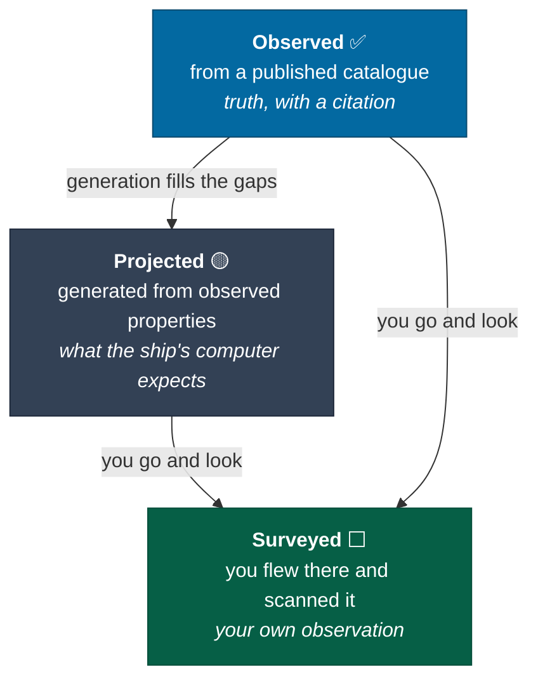
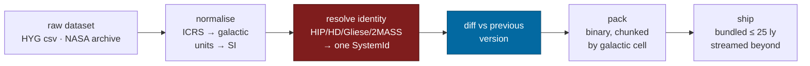

# Galaxy

Real astronomy as the substrate, procedure as the filler, and the design that
lets published data change underneath a running game without breaking it.

> This page owns [pillar 2](charter.md#pillar-2--the-sky-is-real). It also
> contains the one mechanic in this bible that no other game in the genre could
> implement, because it depends on the universe being a versioned pure function.

---

## The three-layer body model

Every object in the galaxy is exactly one of three things, and the player can
always tell which.



The distinction is not cosmetic. It is the fiction that makes procedural content
honest, and it is the mechanism that lets real data arrive later without lying to
anyone:

> **The game never claims a generated planet is real. It claims the ship's
> computer projects one, from the star's mass, luminosity and metallicity.
> Projections are drawn dashed and dimmed. When astronomy resolves one — or
> contradicts it — that is not a retcon, it is science.**

Every body carries `provenance`, and the UI shows it everywhere the body appears:

| Provenance | Drawn as | Panel shows |
|---|---|---|
| `observed` | Solid, full colour | Catalogue name, designation, source, release |
| `projected` | Dashed outline, 60% opacity | "Projected from stellar parameters — not confirmed" |
| `surveyed` | Solid, with your survey stamp | Your scan date, tick, and catalogue version |

> 🎮 Designer's Note: This is the single highest-leverage idea in the bible.
> Every procedural space game has to choose between claiming its content is real
> (dishonest, and it breaks the moment a player checks) and admitting it is fake
> (which deflates it). The third option — *it is a stated prediction, and going
> to look is the game* — turns the seam into the premise. It also means the
> project can ship with a thin catalogue and get better forever without a single
> design change.

---

## Data sources

The catalogue is an **ingest**, not a hand-transcription. Today
`packages/universe/src/catalog.ts` holds 18 hand-entered nearby stars with real
ICRS positions, parallaxes, spectral types and component counts — deliberately
shaped, as its own comment says, so that swapping the source changes nothing
downstream.

| Dataset | Provides | Scale | Licence posture |
|---|---|---|---|
| **Gaia DR3** (ESA) | Astrometry, parallax, photometry, radial velocity | ~1.8 billion sources [Source: ESA Gaia Data Release 3, June 2022] | ESA/Gaia open data with attribution — `[OPEN QUESTION: confirm exact terms and attribution string before ingest]` |
| **HYG v4** | Merged Hipparcos + Yale + Gliese, pre-cleaned, game-sized | ~119,000 stars [Source: astronexus/HYG-Database] | CC BY-SA — attribution required |
| **NASA Exoplanet Archive** | Confirmed exoplanets, orbital elements, masses, radii | ~6,000 confirmed planets `[Assumption: approximate as of ingest; the archive updates weekly — read the count at ingest time, never hard-code it]` | US Government work, public domain |
| **CNS5 / Gliese** | Completeness within 25 pc | ~5,900 objects [Source: Golovin et al., *The Fifth Catalogue of Nearby Stars*, 2023] | Open, attribution |
| **Open Exoplanet Catalogue** | Cross-check, community corrections | — | MIT |

**Start with HYG.** It is the right size to ship in a browser, it is already
merged and cleaned, and it covers exactly the volume where players will spend
their first hundred hours. Gaia is a later, larger ingest that gets streamed
rather than bundled.

### The horizon of knowledge

Gaia's completeness falls off with distance. Within ~25 parsecs the catalogue is
close to complete; at a few kiloparsecs it holds only the intrinsically bright,
and the great majority of the Milky Way's estimated 100–400 billion stars
[Source: standard estimates; see NASA/ESA Milky Way summaries] has never been
individually catalogued by anyone.

**The galaxy map draws that boundary.** A visible, irregular shell — the surface
beyond which everything is projection. Inside it, the sky is a record. Outside
it, the sky is a hypothesis.

And it **moves outward** as astronomy improves. A player who returns after a
Gaia data release watches the frontier of human knowledge expand around them.
That is not a feature anybody has to build twice; it is the same ingest pipeline,
rendering its own coverage.

---

## Catalogue revisions

The hard problem the whole three-layer model exists to solve.

**The problem.** Generation is a pure function of seed and address, which is what
makes the universe reproducible, streamable and 696 bytes to save. But the
catalogue is an *input* to generation, and the catalogue changes. A star with no
known planets today may have three confirmed next year. If that shifts every
generated body around it, then every save, every Almanac entry and every
discovery record referring to those bodies is silently wrong.

### The four rules

**Rule 1 — the catalogue version is an explicit generation input.**

```
bodies(system, seed, catalogueVersion) → BodyManifest
```

Same seed and same catalogue version produce the same universe, forever, on any
machine, offline. Determinism is completely preserved; it simply now has two
inputs instead of one. `packages/procedural` already versions generation
algorithms through `algorithm()` and `manifest()` — the catalogue version joins
that manifest and rides the same machinery.

**Rule 2 — address indices are issue ordinals, not orbital ordinals.**

This is the load-bearing change and it deserves an ADR. Today `b:2` reads as
"the third planet". It must instead read as "the third body ever issued in this
system", with orbital order computed for display. Then a newly confirmed planet
interior to everything else takes the *next free index* rather than index 0, and
nothing renumbers.

```
g:milky-way/s:HIP71683/b:2      ← always this body, forever, whatever its orbit
```

*Why not just sort by semi-major axis?* Because then confirming a hot Jupiter
inside every known orbit shifts every index in the system by one, and every save
in existence now points at the wrong world. An orbital ordinal is derived data
wearing an identity's clothes. See
[ADR-0004](../adr/0004-entity-addressing.md), whose first stated property —
addresses derive from containment, never from order — this rule extends to
containment order itself.

**Rule 3 — the body manifest is append-only. Retirement is a tombstone.**

```
{ index: 4, provenance: 'projected', status: 'retired',
  retiredIn: 'hyg-4.2', supersededBy: 6 }
```

A retired body stops being generated and stops being rendered. Its address
remains valid, resolvable and meaningful forever. Saves that reference it load.
Almanac entries that describe it still describe something.

**Rule 4 — projections yield to observations, never the reverse.**

When a revision confirms a real body whose orbit overlaps a projected one, the
projection is retired and the observation is issued at a new index. Overlap is
defined generously — within a factor of 1.5 in semi-major axis — because the
point is to avoid two bodies visibly occupying the same orbit, not to be precise
about a projection that was always a guess.

### What the player sees

The mechanic. A revision is a **diegetic event**, not a patch note.

```
┌─ CATALOGUE REVISION ────────────────────────── hyg-4.1 → hyg-4.2 ─┐
│                                                                   │
│  3 systems in your Almanac are affected.                          │
│                                                                   │
│  HIP 71683 · Alpha Centauri            ▸ 1 confirmed, 1 retired   │
│    + b:6   confirmed planet, 1.07 M⊕, 0.04 AU     [observed]      │
│    − b:2   projected body retired, superseded                     │
│      your survey of 2026-09-14 is retained as a historical entry  │
│      discovery credit retained                                    │
│                                                                   │
│  HIP 8102 · Tau Ceti                   ▸ 2 confirmed              │
│  HIP 16537 · Epsilon Eridani           ▸ 1 orbit refined          │
│                                                                   │
│                              [ REVIEW ]        [ ACKNOWLEDGE ]    │
└───────────────────────────────────────────────────────────────────┘
```

**Discovery credit is never revoked.** You were the first to survey what was
believed to be there, and that remains true. The Almanac keeps the historical
entry with its catalogue version stamped on it, and adds the new body as a fresh,
unsurveyed target — which is a reason to go back.

**What this buys, for free:**

| | |
|---|---|
| Recurring content | Real astronomy publishes continuously, forever, at no cost to this project |
| A reason to revisit | A surveyed system can become unsurveyed again, honestly |
| A defence against staleness | The galaxy improves without anyone authoring anything |
| Something genuinely novel | It requires the universe to be a versioned pure function, which is precisely what milestone 1 proved |

**Resolved: continuous ingest, event-shaped delivery.**

Revisions land in the pipeline whenever astronomy publishes them, so the game is
always exactly current with the real record. But **the player receives them on
sync** — when they next dock or connect — as a single accumulated notice covering
everything that changed since their last sync. Publication is continuous;
*arrival* is an event, which is what the drama needed.

This is the harder option and it should be built knowing that. It makes every
ingest a live compatibility surface, so the [diff gate](#ingest-pipeline) between
versions is not a nicety — it is the thing standing between continuous ingest and
silently corrupting a hundred thousand saves. It needs to fail loudly on any
identity change and it needs to run on every single ingest, automatically.

**Resolved: the persistent universe runs one global catalogue version, advanced
on an announced schedule.**

Ingest stays continuous behind it. Solo modes are therefore the bleeding edge —
current with astronomy the moment it publishes — and the shared world lags on a
stable, well-tested version that everyone in it agrees on. Two players in a system
always see the same planets.

The divergence is real and worth stating plainly: a player who surveys a body in
solo may find the persistent universe has not caught up yet. Their Almanac stamps
the version, so the record stays honest, and the shared world corrects on the next
scheduled advance.

### What real data buys

Worth stating plainly, because it is easy to assume real data is merely flavour.

- **Systems are unequal, truthfully.** Sol has eight planets and hundreds of
  moons. Barnard's Star, six light-years away, has nothing confirmed. That
  variance is not a difficulty curve; it is a fact, and it makes arrival
  genuinely uncertain in a way a designed distribution never is.
- **Routes have real texture.** Class M dwarfs dominate the neighbourhood and
  scoop slowly, so the good refuelling stars are sparse and their positions are
  not negotiable.
- **Players can check.** Someone will fly to Tau Ceti, read the panel, and open
  Wikipedia. If the numbers match, the game has earned a kind of trust that no
  amount of art direction buys.
- **Multiple-star systems are real and currently simplified.** α Cen, Sirius,
  Procyon, 61 Cyg and 40 Eridani are all multiples and are modelled as single
  stars today; `components` records the truth so the simplification is visible
  rather than hidden. Binaries are a [content](content.md) item, not an
  architectural one — a binary is two bodies in one system frame.

---

## The galaxy map ⬜

A 3D representation of the Milky Way. Elite Dangerous's is the reference and it
is the best interface in the genre; this one has more real data to show and
should show it.

### Scale tiers

Rendering 1.8 billion stars is not possible and not desirable. Three tiers, and
the transition between them is a cross-fade, not a mode switch
([pillar 1](charter.md#pillar-1--one-continuous-space) applies to interfaces
too):

| Tier | Range | What is drawn | Source |
|---|---|---|---|
| **Local** | 0 – 150 ly | Every catalogued star individually, at true position, coloured by blackbody temperature from its real spectral class | Catalogue |
| **Regional** | 150 ly – 5 kly | Catalogued bright stars individually; the rest as a sampled point cloud | Catalogue + generated |
| **Galactic** | 5 kly – 100 kly | A density volume — arms, bar, bulge, halo | Generated |

The **horizon of knowledge** shell is drawn across all three as a translucent,
irregular boundary with a completeness readout: *"catalogue completeness at this
distance: 4%"*.

### Interactions

| Action | Input | Result |
|---|---|---|
| Orbit / pan / zoom | Drag, right-drag, wheel | Camera; the cockpit is still visible and still running behind it |
| Select system | Click a star | Info panel: real data, provenance, citation, your survey status |
| Plot route | Select destination | Route computed; see below |
| Bookmark | `B` on a selected system | Saved to a personal list, syncs online, works offline |
| Search | `/` then type | Name, designation (HIP/HD/Gliese/2MASS), or catalogue id |
| Filter | Panel, multi-select | See table below |
| Measure | Shift-click two systems | Straight-line distance and minimum jump count |

**Filters** — each one is a real data field, not a game-invented tag:

`spectral class` · `scoopable` · `has confirmed planets` · `has projected planets`
· `distance from here` · `distance from Sol` · `visited by me` · `surveyed by me` ·
`first-discovered by me` · `first-discovered by anyone` · `within jump range` ·
`within N jumps` · `binary/multiple` · `catalogue completeness`

`first-discovered by anyone` is the one that will matter most socially. Turning it
on beyond a few hundred light-years should render the map almost entirely dark,
and that darkness is the invitation.

### Route planning

Two routes, always both offered, and the difference between them is the strategy:

```
   ┌───────────────────────────────────────────────────────────────┐
   │  SOL → HIP 91262 (Vega)                          25.04 ly     │
   ├───────────────────────────────────────────────────────────────┤
   │  ⚡ FASTEST          3 jumps    11.2 t fuel    ⚠ 1 dry leg    │
   │     max-range hops; leg 2 ends at a class T dwarf             │
   │                                                               │
   │  ◆ ECONOMICAL       7 jumps     2.4 t fuel    ✓ all scoopable │
   │     threads G and K stars; 4 min longer                       │
   └───────────────────────────────────────────────────────────────┘
```

**The router is constrained by real spectral classes.** Its cost function:

```
cost(leg) = fuel(d) + λ_time · jumpTime + λ_dry · dryPenalty(destination)

Where:
  fuel(d)     = C · (M/100) · d^2.2      — see flight.md
  jumpTime    ≈ 18 s charge + tunnel + realign
  dryPenalty  = ∞ if the tank cannot reach a scoopable star from there
```

Because fuel cost is superlinear in distance (exponent 2.2) while jump *time* is
roughly constant per jump, the two routes genuinely diverge, and the choice is
real. A player with a full tank and somewhere to be takes the fast route; a
player 300 ly out takes the economical one and does not think twice.

**Hard refusal.** The router will not plot a route it cannot complete. If no
route exists, it says which leg fails and why — *"no scoopable star within 8.4 ly
of leg 4"* — rather than plotting something that strands you.

---

## The system map ⬜

Deliberately **abstract**, per the brief. The galaxy map is about truth; the
system map is about navigation, and navigation wants legibility over realism.

```
      HIP 71683 · Alpha Centauri A                    G2V   1.079 M☉
      ─────────────────────────────────────────────────────────────
      scan: DISCOVERY ✓   detail 3/7   surface 1/7

          ☉ ──○──────●─────────◐──────────○────────────◑
              b:0    b:1       b:3        b:4          b:2
              0.4AU  0.9AU     1.7AU      4.2AU        11.6AU
              ▲      ▲         ▲          ▲            ▲
              │      │         │          │            └ ring system
              │      │         │          └ gas giant · 3 moons
              │      │         └ ⌾ SURVEYED · landable · thin CO₂
              │      └ ● detail scanned · rocky · no atmosphere
              └ ○ projected · not confirmed

      ● observed   ○ projected   ⌾ surveyed by you   ◐ partially surveyed
```

Log-scaled distance so both a hot Jupiter at 0.04 AU and an ice giant at 30 AU
are visible at once. Selecting a body plots a burn to it and closes the map;
that is the primary path from *deciding* to *going*, and it must be one click and
under 200 ms.

| Element | Shows |
|---|---|
| Body row | Provenance, scan state, class, landability, atmosphere, moon count |
| Orbit line | Semi-major axis, log-scaled; eccentricity as line thickness |
| Gravity shading | Sphere-of-influence extent, and the capture geometry a burn has to arrive into |
| Distance / TTA | Live from the ship's current position, updating |
| Ring / belt bands | Drawn as bands, selectable as regions |

**Resolved: two tiers of the same overlay.** Both keep the cockpit running behind
them — the map is a HUD layer, never a place you go.

| Tier | For | Behaviour |
|---|---|---|
| **Compact** | Routine target selection; the common case | A strip over the lower canopy at 70% opacity. Bodies, scan state, distance. One click plots a burn and it closes. Must be under 200 ms open-to-plotted. |
| **Planning** | Long routes, multi-leg expeditions, cargo and passenger runs | Expands to fill the canopy. Full orrery, filters, route comparison, multi-leg sequencing, fuel and time projected across the whole itinerary. |

The compact tier is used hundreds of times a session and has to be instant. The
planning tier is used once per expedition and can take as long as it needs; it is
where the thinking happens.

---

## Ingest pipeline ⬜

Not a design question so much as a named piece of work, because it is on the
critical path for everything above.



The red box is the hard one. **Cross-catalogue identity resolution** — deciding
that HIP 71683, HD 128620, GJ 559 A and a 2MASS designation are one system — is
the step where an ingest silently corrupts itself, and it is what
[Rule 2](#the-four-rules) depends on. It gets its own tests, golden vectors, and a
manual review list for the nearest few hundred systems.

The blue box is what makes revisions possible at all: a **structured diff**
between catalogue versions is the input to the revision notice, and it must be
generated by the pipeline rather than reconstructed at runtime.

`[OPEN QUESTION: bundle size budget. The client is 1.15 MB today. A packed 25 ly sphere is a few thousand stars and should be well under 200 KB; a 150 ly sphere is a different conversation. Needs measurement before the local tier is specified.]`

---

## Related

- [flight](flight.md#jump-) — jump range and fuel, which the router consumes
- [exploration](exploration.md) — what scanning does to a projection
- [content](content.md) — what generation puts in the gaps
- [ADR-0004](../adr/0004-entity-addressing.md) — the addressing rules Rule 2 extends
- [ADR-0005](../adr/0005-procedural-seeds.md) — the seed derivation Rule 1 rides on
- [`docs/concepts/determinism.md`](../concepts/determinism.md) — why the catalogue version has to be an explicit input
