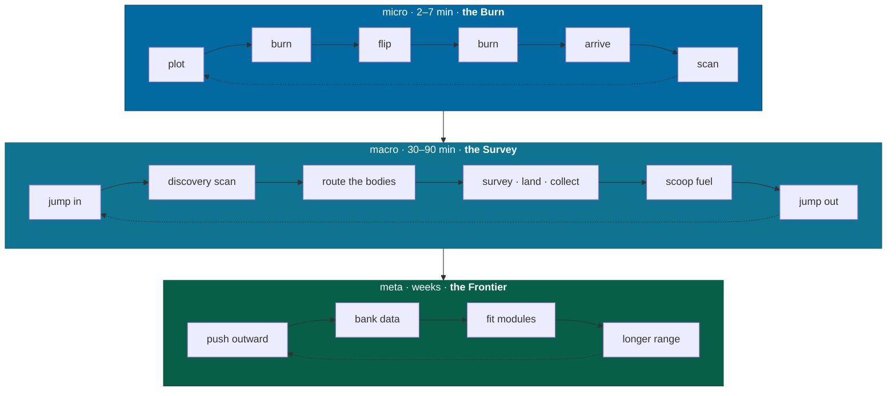
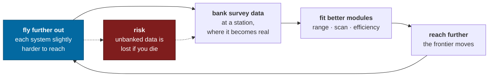

# Loops

What the player actually does, at three timescales, and what makes them start
again.

> [charter](charter.md) says what the game is. This says what it *feels like* on
> a Tuesday evening.

---

## The three loops



Each loop feeds the one below it and is fed by it. The Burn is the atom;
everything else is composed of Burns.

---

## Micro loop — the Burn (2–7 minutes)

The single most-repeated action in the game, performed thousands of times. If
this is not satisfying nothing else matters, and if it *is* satisfying the game
survives having very little else.

Mechanically it is a [brachistochrone transfer](flight.md#the-burn): accelerate
toward the target for half the distance, flip, decelerate onto it for the other
half. Every part of that is real, and none of it needed inventing.

```
   PLOT ────────── BURN ────────── FLIP ────────── BURN ────────── ARRIVE ── SCAN
   pick a target,   accelerate.     ~4 s of        decelerate.      at rest,
   choose how       "down" is aft;  freefall       "down" is        relative
   hard to burn     the ship has    while the      forward;         to the
                    a floor         ship turns     the floor        target
        │                │          180°           reverses
        │                │             │               │
        │                │             │               └─ under-burn and you
        │                │             │                  arrive at 3 c. Turn,
        │                │             │                  re-plot, lose 40 s.
        │                │             └─ the game's best four seconds:
        │                │                silence, weightlessness, and the
        │                │                destination swinging into view.
        │                └─ thrust gravity. You are being pushed into
        │                   the seat, and so is everything loose.
        └─ <b>the decision, made once, up front:</b> halving the trip
           time doubles the fuel. Every trip, with a tank you
           have to get home on.
```

**Input.** Select a target. The nav computer solves for a burn and shows the trip
time and fuel cost at your chosen acceleration; the throttle changes both, live.
Commit. Hold alignment. At the flip cue, rotate — or let the autopilot do it
slower. Hold alignment again. Arrive.

**System.** `t = 2√(d/a)`, `Δv = 2√(a·d)`, `fuel = k·M·Δv`. Targets *move*, so
the solution leads the destination and drifts if you dawdle. There is no drag and
no assistance: what the first half of the burn gave you, the second half must
take back.

**Feedback.** Three instruments carry it, and all three must be readable in
peripheral vision:

| Instrument | Shows | Why it is the one |
|---|---|---|
| Burn plan | A timeline — burn, flip, burn — with time-to-flip counting down | The whole trip as one legible object |
| Δv tape | Velocity change spent against velocity change required | The quantity actually being managed |
| g-meter | Felt acceleration, and the compensation margin | The cost of being in a hurry, on your body |

The **burn plan** is the important one. It converts an abstract transfer into a
shape the player reads once and then executes, and it is what makes the trip a
*plan* rather than a continuous correction.

**Parameters.**

| Parameter | Default | Notes |
|---|---|---|
| Nominal inner-system trip (Earth → Mars, full burn) | 2 min 24 s | The pacing target the whole mechanic is tuned around |
| Nominal outer-system trip (Earth → Saturn, full burn) | 9 min 42 s | A deliberate commitment, not a routine hop |
| Flip duration | 3.5–5 s by hull | Freefall throughout |
| Flip window | ±8 s | Outside it, the solution needs re-plotting |
| Arrival tolerance | ≤ 1.5 km/s relative | Above this the nav computer reports an overshoot |
| Fuel, typical inner-system burn | 0.05–0.15 t | Roughly an order of magnitude below a jump |

**Rationale.** The v0.1 design used an Elite-style cruise in which a gravity
gradient throttled your top speed and the skill was a throttle correction against
an overshoot. Two things were wrong with it. The fiction had to be *told* to
produce the behaviour — a drive that mysteriously weakens in a well — where a
burn produces it from Newton and needs no explanation at all. And
throttle-correction is a weak verb: it is fiddly, it is continuous, and Elite
itself shipped a Supercruise Assist module because players found it tedious.

A burn moves the interesting decision **to the front**, where the player makes it
deliberately, and leaves the execution with three real skills — the flip, the
moving target, and the thermal budget — instead of one micro-correction.
*The Expanse* is the reference, and it is the reference because flip-and-burn is
the most legible piece of orbital mechanics ever put on screen.

### The two quiet moments

The v0.1 design leaned on a long silent coast as the game's emotional core.
Under a burn that changes shape, and improves.

**The flip** is four seconds of freefall. The engine stops, the sound drops to the
hull's own noise, everything unsecured lifts, and the ship rotates — so the
destination swings across the canopy and the origin swings away. Then the drive
lights and the floor arrives from the other direction. It happens on every trip,
it costs almost nothing to build, and it is the thing people will record.

**The burn itself** is not quiet, and that is the point. You are under thrust
gravity with the drive running, watching a planet grow. It is a different feeling
from Elite's silent coast — heavier, more industrial, more like being inside a
machine that is working.

> 🎮 Designer's Note: The old design asked the player to sit through 30–90
> seconds with nothing to do and called it the product. Some of that instinct was
> right — scale is communicated by duration, and a gas giant growing from a dot to
> a wall is worth watching. But it is a much easier sell when the ship is
> *audibly doing something* and the player made a decision that determined how
> long it takes. Duration that the player chose is not the same as duration
> imposed on them, even when it is the same duration.

---

## Macro loop — the Survey (30–90 minutes)

One system, start to finish. The unit of "I got something done tonight."

```
   ARRIVE                                                          DEPART
     │                                                                ↑
     ▼                                                                │
  [ discovery scan ]──→[ read the system map ]──→[ pick a route ]     │
   one press, reveals     bodies, classes,         order matters:     │
   what is here           what's worth the trip    fuel and time      │
                                                        │             │
                                                        ▼             │
                              ┌────────── [ BURN ] ──────────┐        │
                              │              │               │        │
                              ▼              ▼               ▼        │
                        [ detail scan ]  [ orbital ]   [ land and    ]│
                        30 s, any body    survey        walk out      │
                                          2–4 min       10–40 min     │
                              │              │               │        │
                              └──────────────┴───────────────┘        │
                                             │                        │
                                             ▼                        │
                                     [ scoop fuel at the star ]───────┘
                                      the gate on leaving
```

**The fuel gate is the pacing device.** You cannot leave a system without fuel,
and you cannot get fuel unless the star is scoopable. Every decision in the loop
is measured against a tank. Spend twenty minutes landing on a moon and you have
spent nothing but time; jump three systems in the wrong direction and you have
spent the ability to continue.

**Session shape.** A survey resolves cleanly in 30–90 minutes and can be
abandoned at any point without loss, because the save is a reference rather than
a copy and restores exactly. There is no "must reach a checkpoint" pressure
anywhere in the design and there never will be.

**What varies it.** Real systems are not uniform. A survey of Sol is eight
planets, a hundred-plus moons and a belt; a survey of Barnard's Star is one dim
red dwarf and, currently, nothing else confirmed. That variance is *real* and it
is the content — see [galaxy](galaxy.md#what-real-data-buys).

---

## Meta loop — the Frontier (weeks to months)

The ratchet. Everything above compounds into one long outward push.



**The tension that makes it work:** survey data is worthless until banked, and
banking requires returning to inhabited space. An explorer four hundred
light-years out is carrying hours of irreplaceable work, and every jump outward
increases both the value of the return trip and the cost of failing it. Elite
Dangerous discovered this loop somewhat by accident and it produces the most
emotionally invested playerbase in the genre.

**Three things ratchet, and only three** — see [progression](progression.md):

| Ratchet | What it is | Where it lives |
|---|---|---|
| **Capability** | Modules and hulls: jump range, scan resolution, fuel efficiency | Ship, lost if the ship is |
| **Knowledge** | The Almanac — every body you have personally scanned | Player, permanent, works offline |
| **Standing** | Discovery credit; your handle attached to bodies you found first | Universe, online only, permanent |

There is no experience bar and no level. The reason is
[pillar 4](charter.md#pillar-4--you-are-one-person): a level is a number about
*you*, and there is no screen in a cockpit where a number about you belongs.

---

## What brings a player back

Five hooks, in descending order of how much weight they carry. None of them is a
timer, a streak, or a daily.

**1. The unvisited system.** The map shows what you have and have not been to, and
the frontier of your own exploration is a visible, ragged edge. This is the
strongest hook in the genre and it costs nothing to build — it is a rendering of
data the player generated.

**2. Unbanked data.** Ending a session with four hours of unsold survey data
creates a genuine, self-imposed obligation to come back and land it. Deliberately
not a mechanic — no expiry, no decay. The pressure is entirely the player's own,
which is why it works.

**3. Catalogue revisions.** New astronomy is published continuously. When a
revision lands, systems you have surveyed can genuinely change — a confirmed
planet appears where an inferred one stood, and your record of the inferred one
becomes a historical citation. This is recurring content that costs the project
nothing to author, and no other game can do it. Full design in
[galaxy](galaxy.md#catalogue-revisions).

**4. Something seen and not reached.** A ringed giant noted in passing, a body the
discovery scan flagged as anomalous, a moon whose survey was interrupted. The
game should always leave one of these on the table when a session ends.
**Resolved: no seeding.** The galaxy is large enough that unfinished business
happens naturally, and engineering it deliberately is exactly the manipulation the
[non-commercial posture](charter.md#business-posture) exists to avoid. If the
player always has something left, let it be because they genuinely do.

**5. Someone else's name.** In the online modes, arriving somewhere and finding it
already carries a handle is a small, sharp feeling — and arriving somewhere that
does *not* is a sharper one. Discovery credit does more social work than any chat
system would.

> 🎮 Designer's Note: What is deliberately absent — daily rewards, login streaks,
> limited-time events, battle passes, energy timers, and any notification. The
> non-commercial posture means there is no reason for them to exist, and every
> one of them would fight hook 1, which is the only hook that needs to work.

---

## The first hour

Detailed screen-by-screen in [ux](ux.md#first-time-experience). The shape:

| Time | What happens | What it teaches |
|---|---|---|
| 0:00–0:02 | Cockpit, powered down, in orbit of Earth. Earth fills the canopy. | Scale. Nothing else. |
| 0:02–0:08 | Power up, RCS, attitude, translate. No objective. | Momentum is law |
| 0:08–0:20 | Plot a burn to the Moon. First flip, probably a first overshoot. | The micro loop |
| 0:20–0:35 | Land. Get out. Walk. Look up at Earth. | One continuous space |
| 0:35–0:50 | Detail scan, first Almanac entry. Return to orbit. | The reward model |
| 0:50–1:00 | Jump to Proxima Centauri. Fuel is now finite. | The frontier |

Sol first is not sentiment. It is the one system where every player already knows
what the answer should look like, which makes it the only place where *the sky is
real* can be verified by the player rather than asserted by us.

---

## Related

- [flight](flight.md) — the mechanics inside the Burn
- [exploration](exploration.md) — scanning, discovery credit, and the data economy
- [progression](progression.md) — the three ratchets in full
- [ux](ux.md) — where every one of these readouts lives
