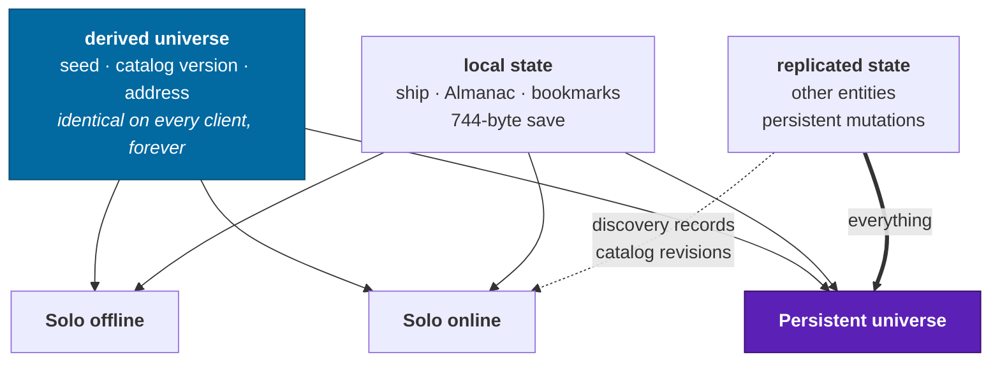

# Modes

Solo offline, solo online, the persistent universe — and the architectural
reason all three are the same build. Plus the two modes that have no ship at
all.

---

## The five, at a glance

| Mode                                                  | What it is                                 | Status |
| ----------------------------------------------------- | ------------------------------------------ | ------ |
| [Solo offline](#solo-offline)                         | The complete game, no network of any kind  | ✅     |
| [Solo online](#solo-online)                           | The same game, plus other people's records | ⬜     |
| [Persistent universe](#persistent-universe--deferred) | Other players, present                     | ⛔     |
| [Planetarium](planetarium.md)                         | Free navigation. No ship, no fuel          | ✅     |
| [Cinema](cinema.md)                                   | A player for scripted scenes               | ✅     |

The first three are the game and differ only by what a server adds. The last two
are the same universe with the ship taken away, and they share a build with the
first three for exactly the reason the first three share one: **the world is
derived, so there is only ever one of it.** You can leave a ship in orbit, spend
ten minutes in the planetarium, and come back to the same state hash.

Who owns the camera in each is [ADR-0011](../adr/0011-application-shell-and-modes.md);
the URL each answers to is in [ux](ux.md#the-routes).

---

## The one idea

> **Offline is not a degraded mode. It is the base case.**

Because the universe is a deterministic pure function of a seed, a catalog
version and an address, a client can derive the entire galaxy on its own. There
is nothing to download and nothing to ask a server for. **Online adds a mutation
stream on top of a complete game**, rather than online being the game and offline
being a cut-down copy of it.

That is unusual and it is worth stating loudly, because it is why a
[non-commercial project](charter.md#business-posture) can credibly promise a
persistent universe at all: the server's job is small.

This is exactly [ADR-0008](../adr/0008-multiplayer-partitions.md)'s stated
principle: _an authority only has to replicate what a client cannot derive —
entity states and persistent mutations. That is the same set a save file
contains, which is not a coincidence and is worth preserving._

---

## Solo offline

✅ **Built and proven** (foundation) · ⬜ **Designed, not built** (asset caching)

The complete game, with no network of any kind.

|                               |                                                                                |
| ----------------------------- | ------------------------------------------------------------------------------ |
| **Universe**                  | Fully derived. Identical to every other player's.                              |
| **Discovery credit**          | Local. Everything you find is a first discovery, because there is nobody else. |
| **Catalog**                   | Whatever version was cached. Revisions arrive when you next connect.           |
| **Almanac, bookmarks, saves** | Local, IndexedDB, complete                                                     |
| **Cost to run**               | Zero, forever                                                                  |

**Already proven.** With the server stopped, the app loads from its service
worker, streams terrain from its own GPU and worker pool, and passes 12/12 capability checks
— demonstrated rather than asserted, in both dev and a production build.

**What is still needed:** an explicit **offline preparation** step. The brief
calls for it and it is a real piece of work — the player chooses to cache the
client, the catalog chunks for a chosen volume, and the material sets, and the
UI shows what is cached and how large it is.

| Cache tier              | Contents                 | Size                                                                                                        |
| ----------------------- | ------------------------ | ----------------------------------------------------------------------------------------------------------- |
| Client                  | App, workers, shaders    | ~2–4 MB `[Assumption: measured at 1.19 MB raw / 260 KB brotli on 2026-08-19, pre-WebGPU and pre-materials]` |
| Catalog, 25 ly          | 166 stars, 84 planets    | **~5 KB brotli** ✅ measured                                                                                |
| Catalog, 150 ly         | 7,529 stars, 861 planets | **~159 KB brotli** ✅ measured — [spike 3](../spikes.md#3--catalog-bundle-size)                             |
| Material sets, 8 biomes | Textures                 | 40–120 MB, the dominant cost                                                                                |

**The catalog tier collapsed.** It was estimated at ~2 MB and measured at 159 KB
— small enough that there is nothing to choose about it. The preparation screen
does not need a catalog-volume slider; **it ships the whole 150 ly sphere as
part of the client** and the screen is entirely about material sets.

> 🎮 Designer's Note: The material sets are now the _only_ thing in this game that
> resembles a traditional asset download, and therefore the only thing that
> threatens the "it's a link" pitch. That is a simplification worth having: one
> download decision, not two. Budget them hard, stream them by biome rather than
> all at once, and make the offline preparation screen honest about the size.

---

## Solo online

⬜ **Designed, not built.**

The same game, connected. **No other players are present in your instance.**

| Adds                          |                                                                               |
| ----------------------------- | ----------------------------------------------------------------------------- |
| **Global discovery credit**   | Your first discoveries are checked against everyone's and attributed publicly |
| **Catalog revisions**         | Delivered as they are published                                               |
| **Bookmark and Almanac sync** | Across devices                                                                |
| **Commissions**               | Issued and completed against a shared pool                                    |

**This is the recommended default mode**, and it is the one the MVP ships. It
delivers the entire social reward of discovery credit — the thing that actually
motivates exploration — with none of the cost, latency, security or moderation
burden of a live instance.

The server for this mode is a **database and an API**, not a simulation. That
distinction is what makes it affordable indefinitely for a non-commercial
project.

---

## Persistent universe ⛔ deferred

Other players, present, in a shared, continuously-running galaxy.

**Deliberately deferred**, matching [`docs/roadmap.md`](../roadmap.md#multiplayer).
What exists today is seams only: `partitionForAddress` and
`partitionForPosition` map to opaque string keys, authority follows an entity's
frame chain, no vendor SDK appears anywhere in `packages/*`, and the partition
key is a live debug field on every entity inspection.

### The topology

Per [ADR-0008](../adr/0008-multiplayer-partitions.md): **a star system is the
unit of authority**, for a physical rather than an architectural reason — under
patched conics, two ships in different systems cannot influence each other at
all, so nothing has to be reconciled across a partition boundary. Interstellar
space partitions by generation cell for the same reason.

| Piece                                       | Status                         |
| ------------------------------------------- | ------------------------------ |
| `AuthorityPort` with a local implementation | ⬜                             |
| Entity replication                          | ⬜                             |
| Client prediction and reconciliation        | ⬜                             |
| Interest management                         | ⬜                             |
| Handoff between partitions                  | ⬜                             |
| Mutation conflict resolution                | ⬜                             |
| Net protocol versioning                     | ⬜                             |
| **Input log / replay recording**            | ⬜ — a prerequisite, see below |

**Replay recording is the prerequisite worth naming.** The
[roadmap](../roadmap.md#replay-and-reconciliation) observes that everything
needed for it already exists — canonical ticks, a state hash, persisted control
input — and that what is missing is an input **log** of `(tick, entityId,
controlInput)` plus a driver. That log is also the foundation for client
prediction, so building it is not multiplayer work deferred, it is multiplayer
work brought forward cheaply.

### Design decisions this mode forces

| Question            | Position                                                                                                                                                                                                                                                                                                                                                                                                                                                                                                                                            |
| ------------------- | --------------------------------------------------------------------------------------------------------------------------------------------------------------------------------------------------------------------------------------------------------------------------------------------------------------------------------------------------------------------------------------------------------------------------------------------------------------------------------------------------------------------------------------------------- |
| **PvP consent**     | Opt-in, and off by default. A survey game whose players carry hours of unbanked data cannot have non-consensual PvP without becoming a different game — the [banking tension](exploration.md#banking) only works if the risk is one the player chose. **Resolved: opt-in, off by default.** PvP-enabled players can see and engage each other; everyone else is present and non-hostile. The fragmentation cost is accepted, and it is smaller here than in Elite: there is no economy for PvP to distort and no competitive ladder for it to feed. |
| **Catalog version** | All clients in a partition must run the same version. It becomes a protocol handshake.                                                                                                                                                                                                                                                                                                                                                                                                                                                              |
| **Cheating**        | The universe is derivable, so a client knows everything anyway — there are no secrets to protect. What must be authoritative is _mutation writes_: discovery records and placements. Validate those server-side and the rest does not matter.                                                                                                                                                                                                                                                                                                       |
| **Hosting cost**    | The real constraint. See [sustainability](sustainability.md#the-hosting-question).                                                                                                                                                                                                                                                                                                                                                                                                                                                                  |
| **Population**      | With few players, a shared galaxy is indistinguishable from solo online. That is fine, and it means the mode degrades gracefully rather than failing.                                                                                                                                                                                                                                                                                                                                                                                               |

---

## What is identical across all three

Stated explicitly, because it is the design's biggest advantage and the easiest
thing to erode by accident:

- The universe, exactly, bit for bit
- The ship, the modules, the physics, the flight model
- The Almanac and every local record
- Save format and save compatibility
- Progression and unlocks
- **The build.** There is no separate offline client.

**Nothing is exclusive to an online mode except other people's records.** No
mode-gated content, no online-only ships, no reason to be online except the
reason to be online.

---

## The modes with no ship

Both are documented in full on their own pages, and both obey one rule that
matters here: **neither writes canonical state.** No clock, no ship, no entity,
no save. That is what lets them share a running world with a flight session
rather than being a separate application, and it is also what keeps the
planetarium from becoming a free way to play the survey game — discovery credit
is earned by _going_ somewhere, and looking at Vega is not going.

| Mode                          | Owns the camera via                                                   | Writes anything?              |
| ----------------------------- | --------------------------------------------------------------------- | ----------------------------- |
| [Planetarium](planetarium.md) | The observatory                                                       | No                            |
| [Cinema](cinema.md)           | The cutscene director ([ADR-0010](../adr/0010-cinematic-director.md)) | No — it captures and restores |

---

## Related

- [planetarium](planetarium.md) · [cinema](cinema.md) — the two modes with no ship
- [ADR-0011](../adr/0011-application-shell-and-modes.md) — the shell, the routes, who owns the camera
- [ADR-0008](../adr/0008-multiplayer-partitions.md) — the partition topology
- [`docs/roadmap.md`](../roadmap.md#multiplayer) — the engineering gap list
- [exploration](exploration.md#discovery-credit) — the one thing that differs
- [sustainability](sustainability.md) — who pays for the persistent universe
