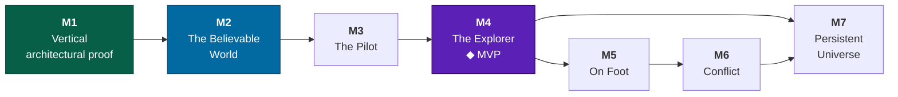

# Production

Six milestones, one named MVP, and the gate each one has to pass.

> This is the design-facing view of the same work
> [`docs/roadmap.md`](../roadmap.md) sequences from the engineering side. Where
> they disagree, the roadmap is the one that has to be right about seams and this
> one has to be right about what the player gets.

---

## The shape

**M1 is complete.** 12/12 capability checks pass in Node and in Chrome, in dev
and in a production build, online and offline.

---

## The MVP: The Explorer

**M2 + M3 + M4.** The first releasable product, and it is a complete game rather
than a slice of one.

> **You fly a ship through the real solar neighbourhood. You can go to any star
> you can see. You can land on nearly anything solid and it looks like a place.
> You survey what you find, your name goes on what you found first, and the
> catalogue gets better over time because real astronomy does.**

**No combat. No on-foot layer. No multiplayer beyond discovery records.**

### Why this is the right MVP

**It is the only slice where the pillars are all fully expressed.** Continuity,
reality, momentum and first-person are all load-bearing in the survey loop and
none of them needs combat or a character controller to be true.

**It is a whole game to a large audience.** A substantial share of Elite
Dangerous players spend nearly all of their time exploring, with no combat and no
trading. That is not a niche within the audience; for this design it *is* the
audience.

**It is the shortest path to the thing nobody else has.** Combat is where we
compete with Elite's decade of tuning. Exploration on real, versioned astronomy
is where nobody competes at all.

**It defers the two hardest scope risks** — humanoid animation and netcode —
past the first release, where they can be evaluated against real players rather
than against optimism.

---

## M2 — The Believable World

*The single hardest milestone, and the one that determines whether any of this
looks like anything.*

| | |
|---|---|
| **Delivers** | Terrain that holds up from orbit to underfoot, in a WebGPU renderer with physically-correct lighting |
| **Scope** | Quadtree terrain LOD · geomorphing · edge stitching · cube-face wrapping · 8 biomes with PBR material sets · rock scatter · WebGPU migration · **HDR output to extended-range displays** · multiple-scattering atmosphere · auto-exposure across eleven orders of magnitude · LOD hysteresis and cross-fade · sphere-derived impostors · predictive streaming with a generation budget · **a benchmark harness** |
| **Depends on** | Nothing. Everything lands on an existing seam. |
| **Gate** | **The 90-second acceptance test**: one continuous recording, 400 km orbit to a walking player picking up a rock, reviewed frame by frame, with no visible discontinuity. Pass/fail. Plus: 60 fps at 1080p on the target laptop, and `pnpm check` green. |
| **Estimate** | `[Assumption: 4–7 months at this team size. The WebGPU migration and the atmosphere integral are the two items most likely to overrun.]` |

**The benchmark harness is scope, not overhead.** Every performance figure in
[technical](technical.md) is currently "unmeasured", and a rendering milestone
without measurement cannot be evaluated or defended.

> 🎮 Designer's Note: M2 has no new gameplay in it at all, which will make it feel
> unrewarding for months. It is still correct to do first. The
> [roadmap](../roadmap.md#what-would-be-next) reaches the same conclusion from a
> different direction: terrain is the visible ceiling on everything
> surface-related, it exercises streaming and LOD properly, and every later
> content system sits on top of it.

---

## M3 — The Pilot

*The ship becomes a machine you operate.*

| | |
|---|---|
| **Delivers** | The cockpit, the three travel regimes, and every simulated ship system |
| **Scope** | Cockpit interior and HUD · the Canopy and its two camera modes · the module system, 6 hulls, ~60 modules · power pips · heat · damage and subsystem model · [the burn, flip and nav solver](flight.md#the-burn) · inertial compensation and the g-meter · [jump](flight.md#jump) · fuel and scooping · targeting · burn assist · the three control schemes · **flight assist off** |
| **Depends on** | M2 for the world to fly through; the parts-assembly system for hulls |
| **Gate** | A pilot can fly Sol end to end — Earth orbit to a Titan landing — plotting and flying burns, managing heat and fuel, with no debug tooling. Inner-system burn pacing verified against the ~2:24 Earth–Mars target. Full control-scheme parity. |
| **Estimate** | `[Assumption: 3–5 months. The parts-assembly system for hulls and interiors is the least-understood item.]` |

---

## M4 — The Explorer ◆ MVP

*The loop closes and the game becomes releasable.*

| | |
|---|---|
| **Delivers** | The galaxy, the maps, the reward model, and a reason to keep playing |
| **Scope** | [Catalogue ingest pipeline](galaxy.md#ingest-pipeline) with HYG + NASA Exoplanet Archive · catalogue versioning in the generation manifest · **issue-ordinal addressing** (needs an ADR) · body manifests with tombstones · [galaxy map](galaxy.md#the-galaxy-map) with three scale tiers and the horizon of knowledge · [system map](galaxy.md#the-system-map) · route planning, both routes · [scan ladder](exploration.md#the-scan-ladder) tiers 1–3 · the Almanac · discovery credit · the data economy and unlock curve · [solo online](modes.md#solo-online) sync · [offline preparation](modes.md#solo-offline) · the [FTUE](ux.md#first-time-experience) · accessibility |
| **Depends on** | M3 for a ship worth flying |
| **Gate** | A new player reaches the [28-minute mark](ux.md#first-time-experience) — standing on the Moon, looking up at Earth — with no tutorial and no assistance. A 10-hour session produces a filled Almanac and a fitted ship. A simulated catalogue revision produces a correct notice, retains discovery credit, and does not invalidate a single save. |
| **Estimate** | `[Assumption: 4–6 months. Cross-catalogue identity resolution is the item most likely to be underestimated — see galaxy.md.]` |

**Ship it here.** Not as early access with a promise of combat, but as a complete
exploration game that may grow.

---

## M5 — On Foot

| | |
|---|---|
| **Delivers** | Get out of the ship, anywhere |
| **Scope** | Character controller on a rotating surface frame · the [suit](onfoot.md#the-suit) and its five gauges · gravity-scaled locomotion across five regimes · EVA thrusters · interaction, mass-carried inventory · ship interiors from room modules · airlocks · [ground-truth sampling](exploration.md#tier-4--ground-truth) · anomalies · structures and outposts · persistent `placed` mutations |
| **Gate** | Cockpit to planetary surface and back, continuously, with no transition — verified by the same frame-by-frame method as M2. A full excursion under a radiation budget. |
| **Estimate** | `[Assumption: 4–6 months]` |

---

## M6 — Conflict

| | |
|---|---|
| **Delivers** | Something to be afraid of |
| **Scope** | Weapons, 4 classes · shields, armour, countermeasures · [subsystem targeting](combat.md#subsystem-targeting--why-combat-is-about-disabling) · silent running · mass lock and interdiction · opponent AI, 4 types · encounter placement |
| **Gate** | An evenly-matched engagement lasts 45–90 s and is resolvable by disabling, by destruction, **or by escape** — all three viable, all three satisfying. |
| **Estimate** | `[Assumption: 3–5 months]` |

---

## M7 — The Persistent Universe

| | |
|---|---|
| **Delivers** | Other people |
| **Scope** | Input log and replay recording *(prerequisite)* · `AuthorityPort` with a local implementation · entity replication · client prediction and reconciliation · interest management · partition handoff · mutation conflict resolution · net protocol versioning · opt-in PvP · moderation and naming policy |
| **Gate** | Two clients in one system see a consistent world under 150 ms of latency, with a partition handoff mid-flight producing no visible discontinuity. |
| **Estimate** | `[Assumption: 6–12 months, and the widest error bar on this page by a large margin]` |

---

## Cadence and post-launch

After M4 ships, the project has a property almost nothing else has: **it improves
without anyone authoring content.** A [catalogue revision](galaxy.md#catalogue-revisions)
is new content generated by the astronomy community, and the pipeline that
delivers it is built once.

| Cadence | Item |
|---|---|
| Per major catalogue release | A Revision — new confirmed bodies, refined orbits, expanded horizon of knowledge |
| Continuous | Biome material sets, ship parts, rock meshes — each independently contributable |
| Per milestone | M5, M6, M7 as free updates |

There is no season, no battle pass, no live-ops calendar and no event schedule.
See [charter](charter.md#business-posture).

---

## Critical path and the things that will go wrong

| Item | Milestone | Why it is on the critical path |
|---|---|---|
| **WebGPU migration** | M2 | Everything visual depends on it and the fallback path doubles the surface area |
| **Atmosphere at all altitudes** | M2 | One shader from orbit and from the ground, or [pillar 1](charter.md#pillar-1--one-continuous-space) breaks visibly |
| **HDR output path** | M2 | Three.js has a working `ExtendedSRGBColorSpace` path, but display detection and SDR parity are unverified — see [art](art.md#hdr) |
| **Benchmark harness** | M2 | Without it, no performance claim can be evaluated |
| **Parts-assembly for hulls and interiors** | M3 | The whole content strategy rests on it and it has never been built |
| **Cross-catalogue identity resolution** | M4 | Silent corruption here poisons addressing, saves and discovery records simultaneously |
| **Issue-ordinal addressing** | M4 | A change to the addressing model that touches saves. [ADR-0009](../adr/0009-issue-ordinal-addressing.md) accepted; **free only while there is no save corpus**, so land it early rather than at M4 |
| **Character controller on a rotating frame** | M5 | Correctness here is subtle and the failure mode is nausea |
| **Client prediction** | M7 | The hardest single piece of engineering in the plan |

**Total to MVP:** `[Assumption: 11–18 months at one maintainer with coding
agents, assuming sustained effort. Treat the lower bound as unlikely.]`

> 🎮 Designer's Note: The plan's real risk is not any single item — it is M2's
> length. Four to seven months with no new gameplay, on the hardest technical
> work in the project, is exactly where solo projects stop. The mitigation is the
> 90-second acceptance test: a concrete, visual, binary gate that produces
> something worth watching the moment it passes, and that can be attempted in
> partial form long before it is met.

---

## Related

- [`docs/roadmap.md`](../roadmap.md) — the engineering sequence
- [technical](technical.md) — what each milestone requires of the platform
- [risk](risk.md) — what could stop each one
- [charter](charter.md#the-honest-constraints) — why the plan is shaped like this
