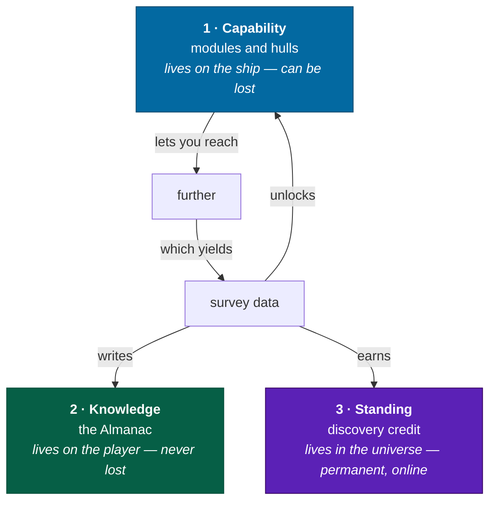

# Progression

Three ratchets, no experience bar, and the reasoning for why a simulation should
progress through equipment and knowledge rather than statistics.

---

## The three ratchets

Only the first is a power curve. The other two are records, and they are what the
long-term player is actually playing for.

---

## Why there is no level

A level is a number about _you_, and
[pillar 4](charter.md#pillar-4--you-are-one-person) says there is no screen in a
cockpit where a number about you belongs. That is the pillar argument. There are
two better ones.

**A simulation's difficulty should come from the situation, not from a
multiplier.** If a level-30 pilot lands more gently than a level-1 pilot, the
landing is not a simulation. Every skill in this game is a real skill the player
has, exercised through equipment whose behavior is transparent. A player who
comes back after a year is exactly as good as they were.

**Statistics fight the physics that already exists.** The engine computes real
thrust, real mass, real drag. Layering a `+12% handling` stat on top of that means
two systems now decide how the ship moves, and one of them is lying. Elite
Dangerous, Kerbal Space Program and DCS all progress through equipment and
knowledge for the same reason.

_What is given up:_ the reliable dopamine of a filling bar, and the ability to
gate content by level. Both are real losses and both are acceptable, because the
[non-commercial posture](charter.md#business-posture) means no retention metric
needs defending.

---

## Ratchet 1 — Capability

Modules and hulls, unlocked with [survey data](exploration.md#the-data-economy)
and fitted at any station.

**The shape of the curve** — deliberately front-loaded, then long and flat:

| Banked data (lifetime) | Roughly unlocks                             | Jump range | Character of play                                                 |
| ---------------------- | ------------------------------------------- | ---------- | ----------------------------------------------------------------- |
| 0                      | _Bessel_, grade E core modules              | **7.5 ly** | A dense web; every leg is forced                                  |
| 2,500                  | _Cannon_ hull, grade D drive                | **18 ly**  | Choices appear. The cage phase ends here, early and deliberately. |
| 15,000                 | Grade C/B across the board, better scanners | **28 ly**  | Routes become plans rather than chains                            |
| 60,000                 | Class 4A drive, large fuel scoop            | **42 ly**  | Sustainable frontier operation                                    |
| 200,000                | _Hertzsprung_ / _Herschel_ hulls, hangar    | **52 ly**  | Multi-day expeditions with an interior                            |
| 600,000+               | Class 5A long-range fit                     | **58 ly**  | The sparse outer regions open up                                  |

**The curve is steep early and long at the top.** The jump from 7.5 ly to 18 ly
arrives quickly, because Elite's real problem is not its top end — it is the hours
spent at the bottom, where every route is forced and nothing is a decision. After
that the curve keeps climbing, slowly, all the way to 58 ly.

| Ratio                                     | Value                     | Notes                                                      |
| ----------------------------------------- | ------------------------- | ---------------------------------------------------------- |
| Jump range, first ship → best ship        | **~7.7×**                 | Comparable to Elite. Revised from v0.1's 2.2× — see below. |
| Time to leave the cage (7.5 → 18 ly)      | ~6–10 hours `[PLAYTEST]`  | The number that actually matters                           |
| Scan speed, first → best                  | ~2.0×                     |                                                            |
| Effective survey throughput, first → best | ~4×                       | Combined effect                                            |
| Time to "can go anywhere"                 | ~40–60 hours `[PLAYTEST]` | Longer than v0.1, because there is more to climb           |

> 🎮 Designer's Note, revised in v0.2: v0.1 argued for a flat 2.2× curve on the
> grounds that with no retention metric to defend, the first ship should be nearly
> as good as the last. That reasoning was about _fairness_, and it missed what
> actually matters. A large range spread changes the **character** of the game,
> not merely its speed: at 8 ly you thread a dense web and every leg is forced; at
> 55 ly you leap between chosen anchors and the sparse outer regions become
> reachable for the first time. Wanting a faster ship is a legitimate, well-earned
> desire, not a retention hook — and designing it out made the game smaller. What
> survives from the old argument is the _shape_: steep at the bottom, so the cage
> phase is short, which is the part Elite gets wrong.

### Loss

Ships are lost. A destroyed ship costs the hull and everything fitted, and the
player restarts in a _Bessel_ at the last station — but **capability unlocks are
permanent**. Losing a ship costs the time to refit, not the progress.

**Resolved: nothing beyond unbanked data.** You restart at the last station in a
Bessel; unlocks are permanent, so refitting is minutes of clicking. The data loss
is already a heavy punishment, and a second cost would punish one mistake twice
and turn death into an errand.

---

## Ratchet 2 — Knowledge

The [Almanac](exploration.md#the-almanac). Every body personally scanned, stamped
with when and under which catalog version.

It is never lost, it works offline, it is not a power curve, and it is the thing
most likely to still matter to a player after two hundred hours. It is also the
only progression that survives everything: a destroyed ship, a wiped save
restored from a 744-byte reference, a catalog revision that retires a world you
found.

**Milestones exist but are not rewards.** _1,000 bodies. Every planet in Sol.
A body of every class. 10,000 light-years traveled. A confirmed exoplanet
ground-truthed._ They are recorded, they are displayed, and they unlock nothing —
because the moment they unlock something they become a checklist, and a checklist
is a different game.

---

## Ratchet 3 — Standing

Discovery credit: your handle attached to bodies you found first, permanently, in
the shared universe. Online only; see [modes](modes.md).

There is no rank, no title, no ladder position and no leaderboard on the front
page. There is a number — how many bodies carry your name — and there are the
bodies themselves, which anyone arriving will see.

**Resolved: personal statistics, no ranking.** Bodies surveyed, light-years
traveled, firsts, worlds walked on — displayed for you, compared against nobody.
A galaxy-wide ranking would reward volume over curiosity and push players toward
efficient scan-and-move rather than the slow ground-truth surveys this design
values most. Per-body attribution stays the social layer; it is social without
being competitive.

---

## The RPG layer

The brief asks for secondary RPG elements. What that means here, precisely:

**What exists:** equipment with real tradeoffs, a personal record that persists,
directed optional goals ([commissions](exploration.md#directed-goals--commissions)),
faction standing with the research institutions that issue them, and a
progression of _access_ rather than power.

**What does not exist:** attributes, skill trees, classes, dialogue trees,
quests, experience points, or levels of any kind.

The distinction is that this game's RPG layer is about **who you have become in
the record** rather than **what numbers you have accumulated**. A player who has
ground-truthed four hundred worlds is a different player from one who has
ground-truthed four, and every bit of that difference is legible in the Almanac
and in their fitted ship — with not one stat between them.

**Kept, minimal.** Standing accrues per institution and unlocks that
institution's higher-value commissions and its module lines. Three rules keep it
from becoming a meter with no fiction behind it: **institutions have permanent
specialties** (one wants exoplanet confirmations, one geology, one extreme
environments), so who you serve follows what you enjoy surveying; **standing never
decays**; and **nothing is exclusively gated behind it** — standing changes what
is offered first, never what is reachable at all.

---

## Player archetypes

Three timelines, for pacing the curve. All three assume the
[MVP scope](production.md#the-mvp-the-explorer).

|          | **Casual** — 3 h/week            | **Regular** — 8 h/week             | **Dedicated** — 20 h/week            |
| -------- | -------------------------------- | ---------------------------------- | ------------------------------------ |
| Week 1   | Sol, the Moon, first jump        | Sol fully surveyed, 4 systems      | 20 systems, first 100 ly             |
| Month 1  | ~12 systems, _Cannon_ hull       | ~50 systems, grade D fit           | ~200 systems, grade B fit            |
| Month 3  | ~40 systems, still in the bubble | Grade A drive, 400 ly out          | 1,000+ ly out, capability curve flat |
| Month 6  | Beyond the catalog horizon       | Deep frontier; Almanac is the game | Somewhere nobody has been            |
| The wall | Never hits one                   | ~month 4, when capability flattens | ~month 2, same                       |

**"The wall" is not a failure.** When capability flattens, the game becomes
purely about the map and the record — which is precisely what Elite's long-term
explorers describe as the point at which the game got good. The design should
make that transition explicit and celebrated rather than something the player
discovers by running out of upgrades.

---

## Related

- [exploration](exploration.md#the-data-economy) — the faucet feeding all three ratchets
- [ships](ships.md#modules) — what capability actually buys
- [modes](modes.md) — where standing exists and where it does not
- [loops](loops.md#meta-loop--the-frontier-weeks-to-months) — the ratchet in motion
