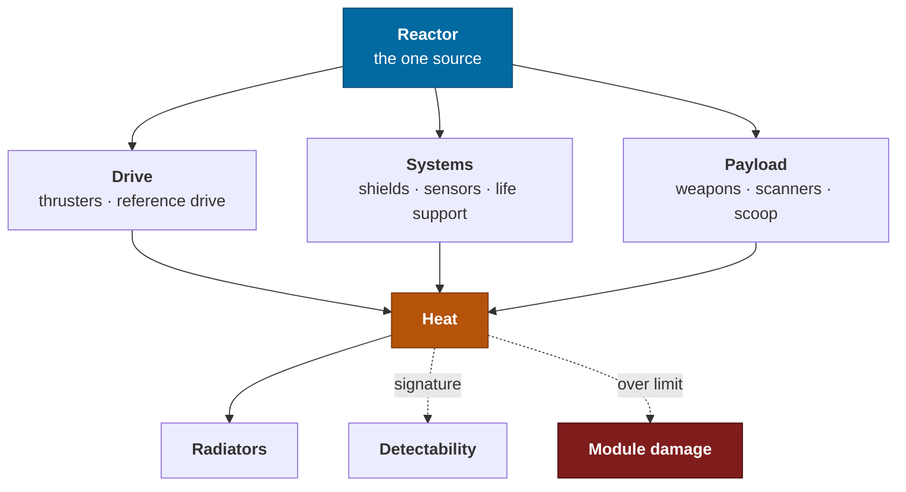

# Ships

Hulls, the module system that augments them, and the four simulated systems —
power, heat, damage and sensors — that make a ship something you operate rather
than something you drive.

> A ship in this game is not a stat block with a model attached. It is a set of
> coupled systems with one shared budget, and flying it well means managing that
> budget under pressure.

---

## What a ship is



One reactor, three consumers, one waste product. Every interesting decision in a
ship — combat, refuelling, stealth, a long descent through an atmosphere — is a
decision about where that budget goes and how fast the heat leaves.

---

## Hulls

Six hulls at launch. They are **procedurally assembled from parts** — a spine,
hull sections, nacelles, a cockpit module and greebling — rather than modelled,
because [one person and coding agents](charter.md#the-honest-constraints) cannot
author a ship pipeline. The parts are hand-designed; the assemblies and their
variants are generated, seeded from the hull id so a given ship always looks the
same everywhere.

| Class | Named for | Role | Mass (dry) | Core | Optional | Hardpoints | Utility | Interior |
|---|---|---|---|---|---|---|---|---|
| ***Bessel*** | Friedrich Bessel — the first stellar parallax, 61 Cygni, 1838 | Starter, minimal | 22 t | 6 | 3 | 2 × S1 | 2 | Cockpit only |
| ***Cannon*** | Annie Jump Cannon — the OBAFGKM spectral classification | Long-range survey | 44 t | 6 | 6 | 2 × S1 | 4 | Cockpit + 1 bay |
| ***Kapteyn*** | Jacobus Kapteyn — stellar statistics and star streams | Cargo and logistics | 96 t | 6 | 8 | 2 × S2 | 3 | Cockpit + 2 bays |
| ***Cutter*** | *Independent lineage — a maritime armed working vessel* | Combat | 68 t | 6 | 4 | 4 × S3, 2 × S1 | 6 | Cockpit only |
| ***Hertzsprung*** | Ejnar Hertzsprung — the H–R diagram | Multi-role medium | 120 t | 6 | 7 | 3 × S3 | 5 | Cockpit + 3 bays |
| ***Herschel*** | Caroline and William Herschel — the first great sky surveys | Large, mobile base | 340 t | 6 | 11 | 4 × S4 | 8 | Full deck + hangar |

The ***Cannon*** is the design's centre of gravity — the ship the
[MVP](production.md#the-mvp-the-explorer) is balanced around, and every number in
[flight](flight.md) is quoted for it. That the survey vessel is named for the
astronomer whose spectral classification the
[fuel scooping system](flight.md#scooping) actually runs on is not a coincidence
and should not be smoothed away.

### The naming convention

**A class is named for an astronomer; a ship is named by its captain.** The
class/name split is Star Trek's, the class names are the people whose work the
game's data actually rests on, and individual ship names follow maritime
tradition — one word, plain, aspirational. You fly a *Cannon*-class survey vessel
called the *Meridian*.

| Lineage | Class names | Why |
|---|---|---|
| **Survey** | Astronomers — Bessel, Cannon, Kapteyn, Hertzsprung, Herschel | An institution names its vessels after its own history, and the Survey's history is the catalogue |
| **Independent** | Maritime working vessels — Cutter, Tender, Packet, Dory | Armed and commercial hulls are not Survey-built, and the naming says so before anything else does |

**The convention is therefore information.** A hull's class name tells you where
it came from — which is worth more than any amount of invented backstory, and
costs one table.

**Naming your own ship is the game's only cosmetic personalisation**, it is free,
and it appears in the Almanac, on discovery records, and on any distress beacon
you ever transmit.

### Interiors

Walkable interior volume is a hull property, not a feature bolted on later — see
[onfoot](onfoot.md#ship-interiors). A *Bessel* has a cockpit you can stand up in and
nothing else. A *Herschel* has a deck, a hangar, and a reason to walk to the other
end of it. Interiors are assembled from the same parts system: a bay is a
generated room from a small set of module types, laid out along the spine.

---

## Modules

Everything except the hull is a module. Modules are the whole of
[capability progression](progression.md#ratchet-1--capability), and there is no
other stat on a ship.

### The Reference Drive is one module

Worth stating explicitly because it does four jobs that other games split across
three or four systems: manoeuvre thrust, transit acceleration, **inertial
compensation**, and the interstellar jump. Its rating therefore sets how fast you
turn, how quickly you cross a system, how much g you feel doing it, and how far
you can jump — which makes it the single most consequential fitting decision on
the ship. Full numbers in [flight](flight.md#drive-ratings).

### Slots

| Slot type | What goes in it | Notes |
|---|---|---|
| **Core** (6, mandatory) | Reactor, Reference Drive, Thrusters, Life Support, Sensors, Fuel Tank | Cannot be empty. A ship with a dead core module does not fly. |
| **Optional** | Cargo, shield, fuel scoop, scanners, repair, extra tank, hangar, quarters | Sized; a size-4 module needs a size-4-or-larger slot |
| **Hardpoint** | Weapons | Sized S1–S4; retractable |
| **Utility** | Countermeasures, heat sinks, point defence, surface scanner | Small, external, always exposed |

### Size and grade

Two independent axes, which is what makes fitting a real decision rather than a
ladder.

**Size 1–8** is physical. A bigger module does more and weighs more, and cannot
be fitted to a smaller slot.

**Grade A–E** is the engineering tradeoff, and deliberately **A is not simply
best**:

| Grade | Performance | Mass | Power draw | Integrity | Use it when |
|---|---|---|---|---|---|
| **A** | 1.00 | 1.00 | 1.00 | 1.00 | Reference |
| **B** | 0.92 | 1.30 | 0.94 | 1.60 | You expect to be shot at |
| **C** | 0.86 | 0.85 | 0.86 | 1.00 | Balanced default |
| **D** | 0.78 | **0.55** | 0.75 | 0.70 | **Exploration — mass is range** |
| **E** | 0.68 | 0.75 | **0.55** | 0.85 | Power-starved builds |

*Rationale.* Elite Dangerous's A/B/C/D/E system is the best-designed fitting
economy in the genre precisely because D-rated modules — the *worst* performing —
are the correct choice for the game's most popular activity, since
[jump range depends on mass](flight.md#range). A player who understands that
their exploration ship should be built almost entirely from low-grade parts has
understood something real, and understanding it feels good. Taken directly.

> 🎮 Designer's Note: The temptation will be to flatten this into a linear
> upgrade path because it is easier to explain. Don't. The moment grade A is
> strictly best, fitting stops being a decision and becomes a shopping list, and
> an entire layer of the game evaporates.

### Acquisition

Modules are not bought — there is no money, see
[charter](charter.md#business-posture). They are **unlocked with survey data**
and fitted at any station. Data is the only currency, which means every module
in the game is paid for with exploration, which means the reward loop and the
progression loop are the same loop. See
[exploration](exploration.md#the-data-economy).

---

## Power

⬜ **Designed, not built.**

Six pips, three subsystems, redistributable at any moment.

```
    DRIVE  ████░░       SYS  ██░░░░       PAY  ░░░░░░
           2 pips             1 pip             0 pips     ← 3 unassigned
```

| Bank | Feeds | Starved effect |
|---|---|---|
| **DRIVE** | Thrusters, Reference Drive | Manoeuvre thrust, transit acceleration and inertial compensation all scale with allocation; at 0 pips, 45% of rated. **Starving DRIVE mid-burn raises felt g**, which is a real and unpleasant surprise. |
| **SYS** | Shields, sensors, life support, radiators | Shield recharge stops; sensor range halves |
| **PAY** | Weapons, scanners, fuel scoop | Weapons will not fire; scoop rate scales linearly |

Total reactor output is a module property, and a fitted ship can easily demand
more than it produces — which is the constraint that makes the pips matter. A
ship that draws 108% of reactor output at full allocation is a legitimate and
common build; it just cannot run everything at once.

| Parameter | Value | Notes |
|---|---|---|
| Pips | 6 | Elite's number; enough granularity, few enough to manage under load |
| Reallocation | Instant, 4 keys | Must be muscle memory, never a menu |
| Effect curve | Linear in pips | Deliberately not a curve; players need to predict it |
| Priority failover | Per-module, 1–5 | On reactor damage, low-priority modules shut down first |

**Rationale.** Elite's pip system is the deepest cheap mechanic in the genre: four
key presses, no UI, and it changes the outcome of every engagement and every fuel
scoop. It costs almost nothing to build and it is the difference between a ship
that is driven and a ship that is *operated*.

---

## Heat

⬜ **Designed, not built.**

The system that ties everything together, and the one most likely to be
under-built.

```
dH/dt  =  Q_reactor + Q_drive(throttle) + Q_weapons + Q_scoop
        + Q_stellar(r, L) + Q_atmospheric(ρ, v)
        − Q_radiators(A, ε, T_env)
```

**Sources.** A baseline from the reactor. **A sustained burn, which is the
largest routine thermal load in the game** — a full-power transit is the drive
running flat out for minutes, and radiators do not care that you are in a hurry.
Weapons, heavily. Fuel scooping, dangerously. Stellar irradiance, which is why
[scooping is a skill](flight.md#the-scoop). Atmospheric friction on entry, which
is where the roadmap's missing reentry heating lands.

**This is what stops maximum burns from being the automatic choice.** The fuel
cost is one constraint and the thermal budget is the other, and the second bites
first on a long haul: a full-power run to the outer system will cook you before
it empties your tank. The correct play is often a slower burn you can actually
sit through.

**Sink.** Radiators, whose effectiveness falls as environment temperature rises —
so a radiator is nearly useless near a star, exactly when it is most needed.

**Consequences.**

| Heat | Effect |
|---|---|
| 0–80% | Nominal |
| 80–100% | Warning tone; efficiency of the hottest module falls |
| 100–120% | Module integrity loss, ~1.5%/s, on the highest-draw module first |
| > 120% | Cascading module failure; hull damage |

**And detectability.** A ship's sensor signature is dominated by heat:

```
signature = k_H · H_current + k_M · mass + k_E · activeEmissions
```

Which gives **silent running** for free: shut the radiators, take the heat, and
become nearly invisible for as long as you can stand it. That is a genuinely good
mechanic and it emerges from the thermal model rather than being bolted on.

Heat sinks are a **utility module with a 20-second cooldown**, not a consumable.
No ammunition economy — see [flight](flight.md#fuel).

---

## Damage

⬜ **Designed, not built.**

**Hull integrity** is a single 0–100% value. At 0 the ship is destroyed. Nothing
else keys off it.

**Module condition** is per-module and carries two independent numbers —
impact and thermal wear, specified below. A module at 0% impact is **offline, not
destroyed**, and can be repaired. Losing individual modules produces the
situations worth having:

| Module lost | Consequence |
|---|---|
| Reference Drive | Cannot jump, and transit power is gone. Manoeuvre thrust remains, so you are not stranded — you are *hours* from anywhere instead of minutes. |
| Sensors | No targeting, no scanning, no contacts list. Fly on the window. |
| Life Support | A countdown, measured in the oxygen in the cockpit. |
| Fuel Tank | Leaking. The countdown is the tank. |
| Thrusters | Partial attitude authority; one axis may be dead. |
| Reactor | Priority failover sheds modules in order until draw fits output. |

**Shields** are an optional module: a rechargeable buffer that absorbs damage
before the hull and recharges from SYS. They are not mandatory, and an explorer
who fits none in exchange for range is making a defensible choice.

**Resolved: two scales.** Impact damage and thermal wear are tracked separately.

| | Accrues from | Recovers | Reads as |
|---|---|---|---|
| **Impact** | Weapons, collision, hard landings | Repair, fully | Something happened |
| **Thermal wear** | Sustained heat over hours — hard burns, close scooping, silent running | Refit only, and only partially | Something has been happening |

The reason to accept the extra readout: they are genuinely different problems. A
shot-up drive is an emergency; a drive that has been run hot for three hundred
hours is a **maintenance history**, and a ship that carries one is a ship with a
past. It also gives the thermal budget a consequence that outlives the burn, which
is what makes managing it matter beyond the next ten minutes.

Module integrity therefore displays as `impact% / wear%`, and effective
performance is the product of the two.

---

## Sensors and targeting

⬜ **Designed, not built.**

The hardware. What it *does* for exploration is in
[exploration](exploration.md); what it does in a fight is in
[combat](combat.md).

| Function | Range (Class 3A) | Notes |
|---|---|---|
| **Contacts** | 12 km passive, 40 km active | Ships, structures, signal sources. Active sweep raises your own signature. |
| **Body targeting** | Unlimited within system | Any body in the system map can be targeted; the nav computer solves a burn to it |
| **Ship targeting** | 8 km for subsystem lock | Sub-targeting requires closer range than plain lock |
| **Discovery scan** | System-wide, instant | See [exploration](exploration.md#tier-1--discovery-scan) |
| **Detail scan** | 0.35 × body radius above surface | Requires alignment and dwell |
| **Surface survey** | Orbital, ≤ 3 body radii | Probe-based mapping |

**Subsystem targeting.** With a lock inside 8 km, individual modules on a target
ship can be selected and damaged specifically — drives to strand, sensors to
blind, fuel tank to force a decision. This is what makes ship combat a
*disabling* problem rather than a health-bar problem, and it is why
[combat](combat.md) can be interesting with very few weapon types.

---

## Autopilot

⬜ **Designed, not built.**

Requested in the brief, and worth being careful about, because a badly-scoped
autopilot deletes the game.

> **The rule: autopilot executes a plan you made. It never makes the plan.**

| Function | What it does | What it refuses to do |
|---|---|---|
| **Attitude hold** | Holds current orientation or a selected vector | Choose a vector |
| **Burn assist** | Executes a burn solution *you plotted* — holds alignment, calls and performs the flip, manages the decelerating half | Choose the target, choose the acceleration, or re-plot after an interruption |
| **Orbital insertion** | Circularises at a commanded altitude | Choose the altitude |
| **Docking** | Final approach on an accepted landing pad | Request the pad |
| **Station-keeping** | Holds relative position to a selected object | — |

Each is a module, each occupies a slot, and each **disengages the moment
something unexpected happens** — a contact, a heat warning, an interruption —
handing control back with an audible cue rather than trying to cope.

*Rationale.* Elite's supercruise assist is well-liked because it removes tedium
without removing the decision of where to go. Its docking computer is more
contentious because it removes an entire skill. The distinction between them is
exactly the rule above, so it is stated as a rule rather than discovered
per-feature.

Under [the burn model](flight.md#the-burn) this lands more cleanly than it did
under cruise, because the interesting decision — *how hard, and therefore how much
fuel* — happens before the burn starts and assist never touches it. Assist
automates the holding, not the choosing.

**Resolved: assist never performs the flip.** It holds the burn vector for
minutes at a time — which is the actual tedium — and hands the flip back with a
five-second cue on every single trip.

The flip is the game's signature moment and it is performed thousands of times.
A pilot should get better at it, and that is only possible if they always do it.

---

## Related

- [flight](flight.md) — every coefficient on this page feeds a formula there
- [combat](combat.md) — power, heat and subsystem targeting under fire
- [exploration](exploration.md) — what the sensor suite is actually for
- [progression](progression.md) — how modules are earned
- [onfoot](onfoot.md#ship-interiors) — the inside of all of this
