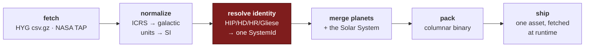

# The star catalog

How real astronomy gets into the game, how to rebuild it when astronomy
publishes something, and the things that will bite you if you change it.

> [galaxy](../design/galaxy.md) is _why_ the catalog is shaped this way —
> the three-layer body model, the revision rules, the horizon of knowledge.
> This page is _how to operate it_.

---

## What ships

```
data/catalog/
  stars-150ly.irsc     7,123 systems and 702 confirmed planets, 458 KB
  manifest.json        version, counts, and the digest of each source
  LICENSE.md           CC BY-SA 4.0 and the attribution it requires
```

All three are **committed**. The raw downloads they are built from are not:
34 MB of HYG to produce a 458 KB asset, and the asset is what the game needs.
`.data/raw/` is gitignored and `pnpm catalog:fetch` refills it.

| Over the wire                                    |                               |
| ------------------------------------------------ | ----------------------------- |
| `stars-150ly.irsc`                               | 458 KB raw, **179 KB brotli** |
| the client bundle beside it                      | 2.49 MB raw, 736 KB gzip      |
| the decoder and tables this added to that bundle | **15 KB**                     |

---

## Commands

```bash
pnpm catalog:fetch             # download the sources into .data/raw
pnpm catalog:report            # build and print the counts, without writing
pnpm catalog:build             # build and write data/catalog
pnpm catalog:build --refresh   # ...re-downloading rather than using the cache
```

`report` is the one to run first. Everything the ingest did is printed —
how many rows it dropped, how many ids it could only derive from HYG's own row
numbering, how many planets it failed to match and why. **An ingest that quietly
drops a third of the catalog looks exactly like one that does not**, so the
counts are the output and the file is a side effect.

---

## The pipeline



| Stage                                   | Lives in                                        |
| --------------------------------------- | ----------------------------------------------- |
| fetch, with pinned URLs and a digest    | `apps/ingest/src/sources.ts`                    |
| CSV, normalize, group, match            | `apps/ingest/src/build.ts`                      |
| choosing the name that goes on screen   | `apps/ingest/src/naming.ts`                     |
| the Solar System, transcribed           | `packages/universe/src/solar/`                  |
| the JPL reference it is checked against | `apps/ingest/src/solarReference.ts`             |
| shape models, downloaded and resampled  | `apps/ingest/src/shapes.ts`                     |
| **the codec, both halves**              | `packages/universe/src/catalog/format.ts`       |
| identity resolution                     | `packages/universe/src/catalog/identity.ts`     |
| measured → physical                     | `packages/universe/src/catalog/photometry.ts`   |
| spectral type parsing                   | `packages/universe/src/catalog/spectral.ts`     |
| designations and search                 | `packages/universe/src/catalog/designations.ts` |

The packer and the unpacker are **the same file**, imported by the ingest and by
the game. There is no second description of the layout to fall out of step with
the first.

---

## The sources

| Source                                                                            | Provides                                                                          | License                                       |
| --------------------------------------------------------------------------------- | --------------------------------------------------------------------------------- | --------------------------------------------- |
| [HYG v4.4](https://codeberg.org/astronexus/hyg)                                   | 119,614 stars: positions, parallaxes, magnitudes, spectral types, designations    | **CC BY-SA 4.0**                              |
| [NASA Exoplanet Archive](https://exoplanetarchive.ipac.caltech.edu/) `pscomppars` | confirmed planets with published orbits, masses and radii                         | none stated; acknowledgment requested         |
| `packages/universe/src/solar/`                                                    | the Solar System's 129 bodies, transcribed into source                            | JPL measurements — facts, not a dataset       |
| [JPL Solar System Dynamics](https://ssd.jpl.nasa.gov/)                            | the reference that transcription is checked against, and every small body's orbit | NASA/JPL-Caltech, public domain               |
| [PDS Small Bodies Node](https://sbn.psi.edu/pds/)                                 | 25 measured shape models                                                          | United States Government works, public domain |
| [USGS Astrogeology](https://astrogeology.usgs.gov/)                               | surface mosaics for Pluto, Charon, Ceres, Vesta, Phobos and Bennu                 | NASA / USGS, public domain                    |

**Gaia is deliberately absent.** Its data are CC BY-NC 3.0 IGO, and a
non-commercial clause on the data the game cannot run without would attach that
restriction to the shipped artifact. [Spike 4](../spikes.md#4--gaia-and-hyg-attribution-terms)
has the verbatim terms.

### Two things about HYG that cost an afternoon each

**The files are git-lfs pointers.** Codeberg's `raw/` path serves the _pointer_ —
a valid, 133-byte text file that a downloader reports as a success and a CSV
parser reports as a catalog with zero rows. Use the `media/` path. The fetcher
asserts on the decompressed size for exactly this reason.

**`dist >= 100000` is a sentinel, not a distance.** 10,224 rows carry it, meaning
"no usable parallax". They must be dropped, not clamped: a clamped one lands
326,000 light-years away, outside the galaxy and inside every distance query that
does not think to exclude it.

---

## Identity: the step that corrupts an ingest silently

HIP 71683, HD 128620, HR 5459 and GJ 559 A are one star. α¹ Cen and α² Cen are
two stars in one system. A save written last year has to keep pointing at
whichever the player actually visited. Getting this wrong does not throw — it
renames a place, and every address that referred to it is now wrong.

**Grouping** uses HYG's own `comp_primary`, which is the row key of a system's
primary. Deriving it from proximity was considered and rejected: two unrelated
stars can sit 0.1 ly apart on the sky, and a positional rule would merge them
permanently.

**The id** is a priority ladder ordered by _stability_, not by fame — nobody
reads an id and everything depends on it not moving:

|     |                                                                    | Coverage within 150 ly |
| --- | ------------------------------------------------------------------ | ---------------------- |
| 1   | `SOL` — the one hard-coded identity                                | 1                      |
| 2   | `HIP…` — Hipparcos, assigned once in 1997                          | 78%                    |
| 3   | `GJ…` — Gliese, which covers the faint red dwarfs Hipparcos missed | most of the rest       |
| 4   | `HD…`, then `HR…`                                                  | the remainder          |
| 5   | `HYG…` — the source row key, and a **liability**                   | **50 systems, 0.7%**   |

Rung 5 is the one to watch. Those ids move if HYG renumbers, and a moved id is a
save pointing at nothing. `pnpm catalog:report` prints the count; a test asserts
it stays under 1%.

`Gl` and `GJ` fold to one prefix. They are the same catalog written two ways,
and HYG v4.4 itself merged five duplicate pairs that existed because one spelling
had not been recognized as the other.

---

## Names: the id is not the name

Three separate jobs, and conflating them is how a star ends up displayed as
`HIP71683`:

- **`id`** — stable forever, never shown.
- **`name`** — the one that goes on the HUD. **Not stable**: a catalog revision
  can give a star an IAU proper name it did not have, and that must change what is
  on screen without changing any address.
- **`designations`** — every alternate, so search finds the star by any of them
  and the panel can cite what it is claiming.

The common name is chosen at ingest, not at load, because the choice needs to see
the **whole system** and a decoder holding one row cannot. Two clauses in it are
not obvious and both were arrived at by looking at what came out:

**More than one component named → use the designation.** α Centauri's components
are _Rigil Kentaurus_ and _Toliman_; neither names the system, so the shared Bayer
designation is the only name that refers to the whole thing. `Castor` and
`Castor B` are one name, not two, and are compared with the component letter
stripped.

**A proper name loses below naked-eye prominence.** HYG's proper names come from
the IAU Working Group on Star Names, which contains both `Sirius` and `Ran` — and
nobody has ever called ε Eridani "Ran". Brightness distinguishes them: the
classical names attached to stars people could see, while the 2015–2018
assignments largely went to fainter stars whose designations were already the name
in use. The threshold is magnitude 3.

|                                      | comes out as       |                                         |
| ------------------------------------ | ------------------ | --------------------------------------- |
| Sirius (−1.4)                        | `Sirius`           | classical name wins                     |
| α¹/α² Cen                            | `Alpha Centauri`   | two named components                    |
| ε Eri, named Ran in 2015 (3.7)       | `Epsilon Eridani`  | designation wins                        |
| 40 Eri, named Keid (4.4)             | `40 Eridani`       | designation wins                        |
| ρ¹ Cnc, named Copernicus (6.0)       | `55 Cancri`        | Flamsteed beats a superscripted Bayer   |
| τ Cet (3.5), no proper name          | `Tau Ceti`         | Bayer expanded through the genitive     |
| Barnard's Star (9.5), no designation | `Barnard's Star`   | nothing else to call it                 |
| Alcor (4.0)                          | `80 Ursae Majoris` | **the known miss** — findable by search |

Expanding a Bayer designation through the constellation genitive is what turns
`Tau Cet` into `Tau Ceti` and `61 Cyg` into `61 Cygni`. Only 214 systems within
150 ly carry an IAU proper name; 649 carry a Bayer or Flamsteed designation, so
that one table roughly quadruples the number of stars with a name a human
recognizes.

---

## What the file stores, and what it does not

**Store measurements, derive everything else.** HYG ships a `lum` column that is
exactly `10^((4.85 − absmag)/2.5)` — the absolute magnitude restated, in V band,
labeled as if it were bolometric. Packing it would spend bytes to repeat the
file and would freeze the V-band error in place.

So the file carries a position, an absolute magnitude, a color index, a spectral
string and a handful of catalog numbers. Temperature, bolometric luminosity,
radius, mass and blackbody color are computed at load by
`catalog/photometry.ts`. Same for names: a Bayer designation is a Greek letter
plus a constellation, both small integers, and `Alpha Centauri` is reconstructed
from tables the client already contains.

**What is deliberately not stored:** proper motion and radial velocity. HYG
carries both, and nothing needs them — a position at J2000 is what a renderer
draws, and the sky changing over centuries is not a mechanic that exists. Adding
them is two columns and a `positionAt(epoch)`; the ingest already knows about
the `9999.99 mas/yr` "not measured" sentinel it would have to handle, because
Barnard's Star of all stars carries one.

**The derivations are a generation input.** A system's planets are laid out from
its star's luminosity, so changing a bolometric correction moves every frost line
in the cataloged half of the galaxy. `PHOTOMETRY_ALGORITHM` is in the generation
manifest for that reason; it looks like presentation and it is not.

### How accurate is it

Measured against seventeen stars with published values:

|                       | mean absolute error |
| --------------------- | ------------------- |
| effective temperature | **1.3%**            |
| bolometric luminosity | 12%                 |
| radius                | 6%                  |

The luminosity error concentrates in late-M dwarfs, where the bolometric
correction is steep and the published values themselves disagree; Proxima
Centauri is the worst case in the catalog at roughly half its cataloged
luminosity, and it is a flare star at the edge of the calibration.

Two findings worth keeping:

- **The spectral classification beats the color index** as a temperature source —
  2.8% against 4.7%, and 5% at the worst case against 18%. B−V is a photometric
  proxy whose fit bends badly at the red end, where most of the neighborhood
  lives. The exception, also measured: for giants the color index is better.
- **The two tables must come from one source.** An early version paired a
  Pecaut & Mamajek bolometric correction with an older temperature scale. Both are
  individually defensible and they are not interchangeable inputs to the same
  calculation: the disagreement put Proxima Centauri at a third of its real
  luminosity.

---

## Rebuilding when astronomy publishes

```bash
pnpm catalog:build --refresh
pnpm check
```

The NASA archive updates weekly, so `--refresh` will usually change something.
What to look at, in order:

1. **The report.** Compare `systems`, `planets matched` and `ids only HYG can
supply` against `data/catalog/manifest.json` from the previous build. A large
   move in any of them is the story.
2. **`apps/ingest/src/ingest.test.ts`.** It asserts the nearest stars by name
   and distance, the eight planets and the sixty-two moons of the Solar System,
   and that no procedural star is invented closer than Proxima Centauri. If it
   fails, the ingest changed the universe. That is allowed — astronomy
   publishes — but it is never allowed to be a surprise, which is what those
   numbers are written down for.
3. **The version string.** It digests the _packed output_, not the downloads, so
   it changes exactly when the shipped data changes. Hashing the sources was the
   first attempt and it churns: the NASA archive's TAP service returned two
   different digests an hour apart for a query whose 702 matched planets were
   identical, and a version that moves on its own turns a revision notice into
   noise. It rides in every save (`SaveGame.catalog`) and is what a future
   revision notice will diff against.

> **Not yet built:** the structured diff between two catalog versions, which is
> what [galaxy § catalog revisions](../design/galaxy.md#catalog-revisions)
> needs to turn an ingest into an in-game event. The version is recorded on both
> sides; nothing yet compares them.

---

## Things that will bite you

**The catalog is an argument, never a global.** Every function that can produce
a cataloged system takes it explicitly — `resolveSystem`, `systemsWithin`,
`new World({ catalog })`. A module-level singleton would be smaller and would make
the catalog version a hidden input to generation, which
[Rule 1](../design/galaxy.md#the-four-rules) exists to prevent.

**Workers do not have it.** Shipping a 458 KB table to every worker so it can
compute one integer is the wrong trade, so tasks take what they need: a cell's
cataloged _count_, or a whole resolved stub. See the header of
`packages/workers/src/tasks.ts`.

**Procedural fill subtracts, and stops.** The density model says how many stars
there _are_, not how many are _unknown_. Generating the full expected count on top
of the catalog would double the solar neighborhood; generating none would leave
it five times too sparse. So the fill is the difference — and it is switched off
entirely inside `completeRadiusLightYears` (25 ly), because the first version
without that put an invented M dwarf 3.4 light-years away, closer than Proxima
Centauri and a discovery that would have made the news.

**Addresses are issue ordinals.** `b:0` is the first body ever _issued_ in a
system, not the innermost. Confirmed planets are issued first, in discovery order —
which the exoplanet letters already encode — and projected ones fill after.
`orbitalOrder(system)` is what sorts them for display. Sorting the array itself by
semi-major axis would mean that confirming a hot Jupiter renumbers every world in
the system and every save pointing at them.

**Spectral types are not MK strings.** `dM4` is an M dwarf, `sdM4` is a subdwarf,
`DA2` is a white dwarf, `A0m...` is an A0 with a peculiarity, and 571 entries
within 150 ly are the single lowercase letter `m`. A `spect[0]` parse classifies
87% of the catalog and is quietly wrong about the rest. `catalog.test.ts` has a
golden vector for every one of those shapes.

**The procedural fill's IMF does not know what the catalog is missing.** It
draws B stars at their true frequency, so a sweep can put an invented 5,000 L☉ B
star in the sky brighter than anything real in it — and real B stars that close do
not exist, which is exactly why the catalog has none. Conditioning the fill on
per-spectral-class completeness is the fix, and it is the same curve the
[horizon of knowledge](../design/galaxy.md#the-horizon-of-knowledge) wants.

**A spectral string can parse cleanly to the wrong answer.** Capella's HYG row is
`M1: comp`, so a G-type giant binary renders as a red dwarf. Two rows in 7,123
fail to parse at all and are counted; this class is not, because nothing
distinguishes it from a correct parse.

**HYG's completeness is not a sphere.** It holds about 59% of the known stars
within 25 pc and none of the brown dwarfs, and its character changes with
distance: volume-complete inside ~50 ly, magnitude-limited by 150 ly. 178
confirmed planets around 117 hosts are dropped because HYG does not contain the
host at all — TRAPPIST-1 among them, at V = 18.8. That is not a matching failure.
It is [the horizon of knowledge](../design/galaxy.md#the-horizon-of-knowledge),
and the star map is supposed to draw it.

---

---

## Planetary surface maps

The same app, a different artifact, and deliberately a separate command:
the catalog is 34 MB in and 458 KB out and takes seconds; this is 600 MB in
and 11 MB out and takes minutes. Bundling them would re-download the Voyager
archive every time NASA publishes an exoplanet.

```bash
pnpm textures:build     # download, process, and write data/textures
```

```
data/textures/
  earth_albedo.webp  earth_night.webp  earth_clouds.webp  earth_normal.webp
  luna_albedo.webp   luna_normal.webp
  io_albedo.webp     europa_albedo.webp  ganymede_albedo.webp  callisto_albedo.webp
  mercury_albedo.webp  venus_albedo.webp  venus_clouds.webp  mars_albedo.webp
  jupiter_albedo.webp  saturn_albedo.webp  saturn-ring_ring.webp
  uranus_albedo.webp   neptune_albedo.webp
  pluto_albedo.webp    charon_albedo.webp  ceres_albedo.webp  vesta_albedo.webp
  phobos_albedo.webp   bennu_albedo.webp
  manifest.json      LICENSE.md
```

**25 maps, 25.0 MB**, all 4096×2048 except the ones with no source that large.
The six at the end arrived with the dwarf planets and the small bodies and are
why the set went from 10.7 MB to 25.0 MB: Pluto and Charon are New Horizons at
300 m, Ceres and Vesta are Dawn, Phobos is Mars Express SRC, and Bennu is
OSIRIS-REx OCAMS at **25 cm per pixel** — a global map with individual boulders
in it, and the highest-resolution map of anything anywhere.

Committed, and streamed per body at runtime — `planetTextures.ts` fetches a
body's maps the first time it is drawn as more than a few pixels, and the
service worker caches them like any other content-hashed asset.

### Where they come from

**NASA and USGS wherever a global map exists in a form this pipeline can read**,
because it is public domain and it is the actual measurement: all of Earth, the
Moon at LRO and LOLA resolution, and the four Galilean moons from Voyager and
Galileo. **Solar System Scope (CC BY 4.0) for the rest** — and the gap is real
rather than lazy. USGS publishes Mars at 232 m/px and Mercury at 166 m/px, which
are a 12 GB and a 4 GB GeoTIFF; the gas giants have no authoritative global map
at all, because Jupiter's belts move and every "map of Jupiter" is a mosaic from
one particular week.

Titan, Enceladus, Iapetus, Triton, Phobos, Deimos and the Uranian moons have no
vendored map and render from their measured albedo and color.

### Two transforms that are not a resize

**Elevation to normals.** Not the textbook Sobel: on an equirectangular grid a
degree of longitude at 80° north is a sixth of a degree at the equator, so the
horizontal gradient is divided by cos(latitude) or the poles come out as
vertical smear. The scale calibrates itself against the height field's own range
rather than a documented unit, which is the fix for a bug that produced a valid
file and a **perfectly flat Moon**: `toColourspace('b-w')` is 8-bit in libvips,
so it silently downcast LOLA's 16-bit product and every gradient came out 256
times too small. `grey16` is the one that preserves it.

**Luminance to alpha.** A cloud map published as a grayscale JPEG is a coverage
mask wearing a color image's clothes. Drawn as color it is a gray shell over
the whole planet; moved into alpha it is weather.

Earth's ocean mask rides in the **alpha of its normal map** — one bit per texel,
always sampled at the same coordinate, and it is what makes sun-glint land on
water rather than on the Sahara. It is a threshold rather than a sign test
because GEBCO_08 turns out to have no bathymetry: 77.5% of it is exactly zero.
Measured, and the mask comes out at 69% ocean coverage against a true 71%.

---

## Shape models

```
pnpm shapes:build              # download, resample, and write data/shapes
pnpm shapes:build --refresh    # ...re-downloading rather than using the cache
```

Twenty-five measured figures from the NASA Planetary Data System Small Bodies
Node, resampled to latitude/longitude grids of radii. Public-domain United
States Government works: there is no license to comply with, only provenance,
which for a shape model matters more — a body's figure is a measurement and a
measurement with no citation is a guess. `data/shapes/manifest.json` records the
source URL, the publication, the reconstructed volume against the source's own,
and the output digest for each.

The ingest **refuses a model it cannot represent**. A radius grid is
single-valued in radius per direction, so it needs the surface to be star-shaped
about the body's centroid; the build measures the enclosed volume against the
source mesh's and fails past ±6%. Every current model reconstructs between 99.8%
and 100.6%, including 216 Kleopatra, whose waist is a saddle rather than a roof.

## The Solar System reference

```
pnpm solar:fetch               # rewrite data/reference/solar-system.json from JPL
pnpm solar:fetch --refresh     # ...re-downloading rather than using the cache
```

Not an asset the game loads. `packages/universe/src/solar/` carries the Solar
System's measurements transcribed into source, because facts are not a licensed
database; this writes the same numbers straight out of JPL's planetary,
satellite and small-body tables so that
`apps/headless/src/solarSystem.test.ts` can tell a typo from a decision. It is
committed rather than fetched at test time — a test that reaches the network
fails on a plane, and a reference that changes between two runs of one commit is
not a reference. Re-run it when JPL publishes; the diff is the news.

## Related

- [galaxy](../design/galaxy.md) — the design this implements
- [rendering](../concepts/rendering.md) — what the maps are used for
- [spikes 3 and 4](../spikes.md) — the measurements that chose HYG and ruled out Gaia
- [determinism](../concepts/determinism.md) — why the catalog version is a generation input
- [ADR-0004](../adr/0004-entity-addressing.md), [ADR-0009](../adr/0009-issue-ordinal-addressing.md) — the addressing rules the issue ordinals extend
