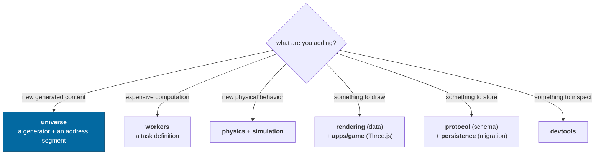
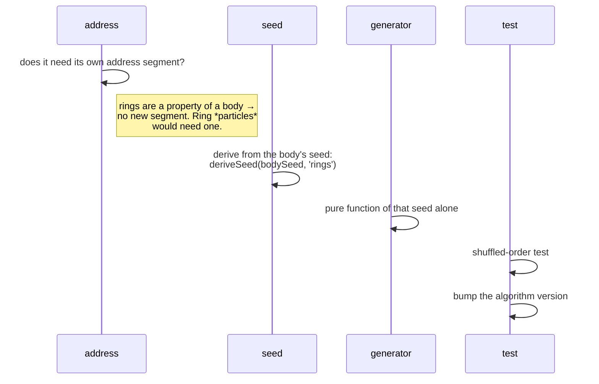
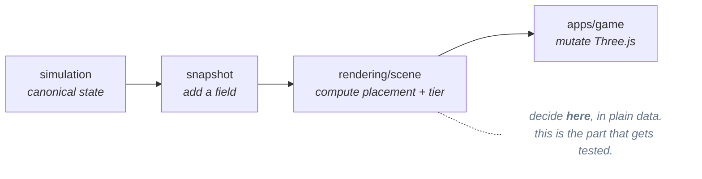
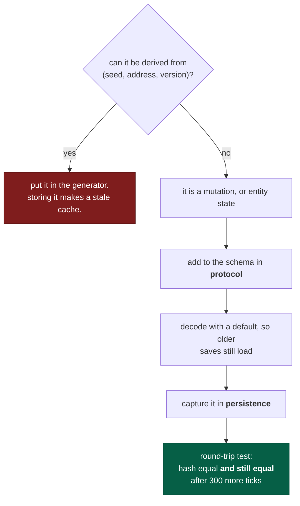

# Extending

How to add things without breaking an invariant. Each section names the seam,
the steps, and the trap.

> Read [AGENTS.md](../../AGENTS.md) first — it is the rules. This is the
> how-to. The agent handbook is [docs/agents/](../agents/README.md).

---

## Where does my change go?



The layer rule decides most of it: a package may depend only on strictly lower
layers, and `pnpm graph` will tell you if you got it wrong.

---

## Adding generated content

Say you are adding **rings** to gas giants.



**Steps**

1. Derive a seed from the owning address — never draw from a caller's stream.
2. Write the generator as a pure function of `(seed, parameters)`.
3. Add it to the system generator where the body is built.
4. Bump `SYSTEM_ALGORITHM`'s version, because existing saves now describe a
   different universe.
5. Add a test that generates it in shuffled order and compares.

**The trap.** Anything that reads _sibling_ state — "make this moon bigger if
the previous one was small" — reintroduces order dependence. If you need
correlation between siblings, derive both from the parent in a single pure
function that produces the whole set at once.

---

## Adding a worker task

```ts
export const myTask = defineTask<Request, Response>({
  name: 'universe.myThing',
  version: 1,
  run(payload, context) {
    if (context.cancelled()) return partial
    return result
  },
  transfers: (r) => [r.buffer.buffer], // if it returns a typed array
})
```

**Steps**

1. Define it beside the existing tasks and register it in the registry both
   sides import.
2. Payload and result must be structured-cloneable — plain objects, arrays,
   typed arrays. Seeds travel as hex strings, addresses as their text form.
3. Declare `transfers` for large buffers.
4. Poll `context.cancelled()` at a granularity where the check costs less than
   the work.
5. Test it **inline** and **through a pool**, and assert the results match.

**The trap.** Bumping the payload shape without bumping `version`. A page left
open across a deploy will then mix two algorithm versions in one universe
instead of failing loudly.

---

## Adding a frame kind

Frames are `root` (exactly one, the universe itself), `fixed` (an absolute
position) or `dynamic` (a pure function of time). Adding a kind usually means
adding a dynamic evaluator in `packages/universe/src/frames.ts`.

**Checklist**

- The evaluator must be a **pure function of `t`** — no accumulated state.
- Return all four components: position, orientation, velocity, angular velocity.
  Dropping angular velocity silently breaks the transport theorem for children.
- If the frame can be persisted, its **id must determine it completely** — see
  [the identity trap](../concepts/frames.md#surface-frames-and-the-identity-trap).
- Give it a **parser beside its formatter**, the way `surfaceFrameId` and
  `parseSurfaceFrameId` pair up in `packages/universe/src/frames.ts`, then
  dispatch to it from `World.ensureFrame`. Keeping the two together is what lets
  the round trip be a property test — and what stops a repeat of the `-0` trap,
  where the parser lived a package below the formatter and had no counterpart to
  its sign-collapsing rule.

---

## Adding something to draw



**The trap.** Doing the deciding in the React component. If the component knows
_where_ something is, that logic is untestable and the boundary has moved. The
component's job is to copy numbers onto objects.

Two practical rules from the existing renderer:

- **Mutate imperatively for per-frame work.** A React reconcile per body per
  frame at 144 Hz is a lot of work to arrive at the same matrix.
- **Record the origin generation** on anything you build from render-space
  coordinates, so a rebase invalidates it.

---

## Adding something to persist

Only if it **cannot be regenerated**. If it can, it belongs in the generator.



**The trap.** Capturing a field but not restoring it. The hashes match at rest
and diverge later — which is exactly how the missing control-input bug was
caught, and why the round-trip test steps both worlds afterwards.

---

## Standing a world up: `openSession`

Anything that needs a running world — the browser client, the headless runner,
the capability checks, a test — goes through one function:

```ts
import { openSession } from '@inertialref/devtools'

const session = openSession({
  seed: 'inertialref',
  workers: () => createInlineWorker(registry), // or null for no pool
  store: new MemorySaveStore(),
})
session.harness.orbit('g:milky-way/s:SOL/b:0', 400)
```

It performs seven steps in the one order that works — derive the world from a
seed, load a system, choose a landable body, put a ship above it, stand up a
worker pool, pick a save store, wire the harness — and returns `{ world, player,
harness, pool, store, system, target, dispose }`.

| Option            | For                                                             |
| ----------------- | --------------------------------------------------------------- |
| `seed`, `system`  | what to generate                                                |
| `catalog`         | the star catalog; defaults to Sol alone                         |
| `workers`         | a `WorkerFactory`, or `null` for no pool at all                 |
| `poolSize`, `now` | pool sizing and an injected clock                               |
| `store`           | a `SaveStore`; defaults to in-memory                            |
| `authority`       | an `AuthorityPort`; defaults to a `LocalAuthority` (ADR-0008)   |
| `host`            | the render side: `scene()`, `frameStats()`, `onWorldReplaced()` |

`host` is one parameter rather than three because they are one thing, and a
_named_ one rather than a spread: the render answers used to be spread into the
session object last, so a stray `world` key would silently shadow the getter
`openSession` exists to protect.

Three things about it are load-bearing:

- **`world` is a getter, never a captured reference.** Loading a save replaces
  the world wholesale, and a host that copied the reference kept reporting on the
  discarded one while the frame loop ran the new one.
- **The host port is split.** `SimulationHost` is what every host can answer;
  `PresentationHost` (`scene`, `frameStats`) is optional, so the headless runner
  no longer stubs questions it has no concept of.
- **Spawn policy lives here.** `landingTarget(system)` and `isLandable(body)` are
  the one place a target is chosen. When five call sites each did this
  themselves, two of them drifted to different spawn distances and nothing could
  have noticed.

If a set-up sequence is shared between the app and the runner, it belongs here
rather than in the harness.

---

## Adding a package

1. `packages/<name>/package.json` with `"type": "module"`, `"private": true`,
   `"exports": { ".": "./src/index.ts" }` and `inertialref.layer` set to a number
   strictly above every dependency. Copy `packages/rendering/package.json`.
2. Nothing to do for TypeScript. Packages have no `tsconfig.json` of their own —
   the root project already includes `packages/*/src`, and only the two apps have
   their own config.
3. Add it to the dependents' `dependencies` with `workspace:*`.
4. `pnpm install` then `pnpm graph`.

Note `pnpm graph` also rejects any **third-party** runtime dependency in
`packages/*`. The core has to run unchanged in a browser, a worker and Node, and
depending on nothing but itself is the cheapest way to guarantee that.

**The trap.** Needing a host capability (DOM, IndexedDB, `Worker`). Do not raise
the layer to reach it — declare a **port** and let the host implement it, the
way `workers` and `persistence` do. That is what keeps every package runnable in
Node.

---

## Before you open the diff

```bash
pnpm check
```

And then the honest questions:

- Does a **test** fail if the invariant I relied on breaks?
- Is anything new **inspectable** in the debug overlay or the harness?
- If I changed generation, did I bump the **algorithm version**?
- Did I add a rule that belongs in [AGENTS.md](../../AGENTS.md), or a decision
  that belongs in an [ADR](../adr/README.md)?
- Did I record anything durable in [CONTEXT.md](../../CONTEXT.md)?

---

## Related

- [AGENTS.md](../../AGENTS.md) — the rules
- [Architecture](../architecture.md) — where the seams are
- [Roadmap](../roadmap.md) — what is already planned, with its seam identified
