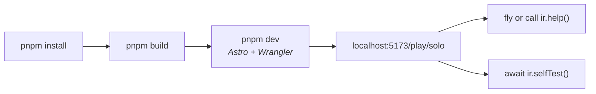
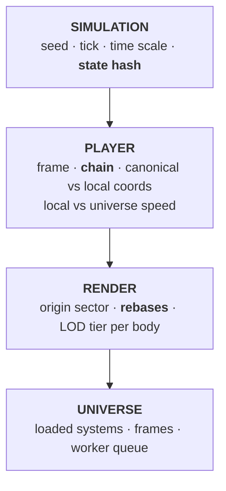

# Getting started

From clone to flying, and the first things worth trying.

---

## Run it

```bash
pnpm install --frozen-lockfile
pnpm build        # creates the assets directory used by Wrangler
pnpm dev          # → http://localhost:5173
```

One command starts both halves — Astro on 5173 and the Cloudflare Worker on 8787,
with `/api` and `/ws` proxied to it. `pnpm dev:client` is Astro alone, which is
how you run solo development without the Worker. After a fresh install, run
`pnpm docs:build` first. This tests server-independent simulation; it does not
exercise the production service worker's offline cache.

From VS Code or Cursor, **Run and Debug → Launch Browser** does the same start
and attaches the debugger. Attach/Launch Node target the headless runner.
[Development](development.md#debugging) has the four configurations.

The home page frames Earth with the ship hidden. Choose Solo or open
`/play/solo` to fly. Flight uses the CC-BY Enterprise-D hull by default; Display
settings also offer the CC-BY Rocinante, with a debug cone during loading.



`pnpm preview` builds and serves through the real Worker on 8787. A warmed
production build can then run without that server, for the routes and assets
already cached. Unvisited documentation and uncached models or textures still
need a connection. The service worker is not registered during development,
where it would interfere with hot reload.
[Persistence](../concepts/persistence.md#offline-first) gives the full boundary.

---

## Controls

| Key         | Action                             |
| ----------- | ---------------------------------- |
| `W` / `S`   | thrusters ahead / astern           |
| `A` / `D`   | thrusters left / right             |
| `R` / `F`   | thrusters up / down                |
| `↑ ↓ ← →`   | pitch / yaw                        |
| `Q` / `E`   | roll                               |
| `T` / `G`   | throttle the main drive up / down  |
| `Shift+T`   | full burn                          |
| `Shift+G`   | cut the drive                      |
| `Z`         | flight assist (rotational damping) |
| `X`         | kill rotation                      |
| `V`         | camera view: chase, or orbit       |
| `Home`      | look where the view aims again     |
| `Space`     | pause                              |
| `[` / `]`   | time warp down / up                |
| `\`         | back to real time                  |
| `F5` / `F9` | save / load                        |
| `/`         | go to — the catalog’s search box   |
| `` ` ``     | disclose the author’s instruments  |
| `P`         | open the perf panel                |
| `H`         | clear both dock panes, or restore  |
| `Shift+H`   | clear every piece of chrome        |
| `,`         | settings                           |
| `?`         | every binding this build has       |
| `Tab`       | move between on-screen controls    |

Flight is full 6-DoF with no artificial "space mode" — the same controls fly
between stars, into orbit, and down to a landing.

A ship has two kinds of engine. The **thrusters** push it any of six ways and
turn it about any of three axes, at under a g: the keys above hold a valve
open for as long as they are down, for docking, station-keeping and a nudge
off the pad. The **main drive** pushes ahead and nowhere else, at three g,
and its throttle is a setting rather than a held key — `T` and `G` walk it a
twentieth at a time, `Shift+T` and `Shift+G` slam it, and it stays where it
is put through a save. A retro is not the drive run backwards: it is the bow
thrusters, or a flip and a burn.

Killing rotation stops the spin immediately and shows a short counter-thrust
burst. **Thruster variation** in Display settings adds uneven valve timing and
tiny, occasional settling puffs while assist holds a stopped ship, or for eight
seconds after a rotation kill. This is visual only: it changes neither the
trajectory nor the controls. Turn it off for uniform valve timing.

The navigation cluster at the bottom of the frame is the instrument the ship
is flown by. The ball in the middle is the horizon of the nearest body seen
from inside the hull — sky over ground, a pitch ladder, the compass along the
horizon, a mark for where the ship is going and a crossed one for where it
came from — with the heading over it and the pitch and bank under it. Left of
it the speed, against the ground near one and in the frame away from it (press
the readout to insist on either), and the drive's throttle on the ring up the
ball's side; right of it the altitude and the rate of climb on the mirrored
ring. Under it all, the high point, the low point and the lap of the orbit.
Clear of every body the ball shows the inertial reference itself and says so.

The camera has two views. The **chase** sits behind the hull and swings with
it; a drag turns your head from there, and `Home` levels it again. The
**orbit** stands off and looks at the ship while it maneuvers — drag to orbit,
wheel or pinch to dolly, the secondary button to look — which is the view to
watch the maneuvering thrusters and the drive from. `V` moves between them,
and the orbit opens where the chase was standing, so the switch is not a jump.

These are the **defaults**. Every act is rebindable at `/settings/controls`, and
`?` prints the live chords rather than this table — a label that names a key
reads the binding, so nothing in the interface can disagree with what the key
actually does.

---

## The author's instruments

Press the bug in the IR menu at the bottom center, or `` ` ``, to reveal four
dockable panels: controls, telemetry, perf and graphics. They are the author’s,
and they are scaffolding — going somewhere is the Catalog, which is a panel of
the product’s own in both the planetarium and the flight workspace, and the eye
is the planetarium’s Camera panel.

Open telemetry to see the architecture made visible. Four groups repay
attention on day one:



Three fields repay attention:

- **chain** — `universe › s:SOL › b:… › bf:… › sf:…`. Where the ship sits in the
  [frame hierarchy](../concepts/frames.md). It changes as you approach and land.
- **speed** — `0.0 m/s local · 51853.5 m/s universe` when landed. Both are true;
  they answer different questions.
- **state hash** — two tabs showing the same hash at the same tick are running
  identical universes.

---

## First things to try

### 1. Prove the architecture

```js
await ir.selfTest()
```

Runs twelve capability checks against the live build and prints measurements —
inch-scale precision at 8 kpc, zero drift over 500 origin rebases, a worker's
terrain matching the main thread's sample for sample.

### 2. Land on a planet

```js
await ir.scenario('surface')
```

Puts the ship on the ground. Watch the `chain` field gain two levels, `state`
become `landed`, and local speed drop to zero while universe speed stays at tens
of kilometers per second.

### 3. Watch a frame transition

```js
const target = ir.bodies().find((b) => b.kind === 'rocky')
ir.orbit(target.address, 100000) // inside the sphere of influence
ir.throttle(1) // burn prograde on the main drive; ir.throttle(0) cuts it
for (let i = 0; i < 30; i++) ir.step(20000)
ir.status().world.events.at(-1) // → { tick, kind: 'frame-change', detail: 'left sphere of influence' }
```

The ship is re-framed from the planet to the system, mid-flight, without moving.

### 4. Break determinism (you can't)

```js
const a = ir.status().world.stateHash
const save = ir.save()
ir.step(500)
ir.load(save)
ir.status().world.stateHash === a // → true
```

### 5. Run it with no browser at all

```bash
pnpm sim --self-test
```

The same core in Node — no DOM, no React, no WebGL. The 3,840 ticks it times
are a ship in a 300 km orbit with its hands off, which coasts: the run reports
tens of millions of ticks a second because the frame jumps them rather than
integrating them ([ADR-0025](../adr/0025-the-rails.md)). `--scenario approach`
puts it under thrust, which is what an integrated tick costs.

---

## Commands

```bash
pnpm dev          # Astro on 5173 and wrangler on 8787, in one terminal
pnpm preview      # build, then serve it through the real Worker on 8787
pnpm test         # vitest, node environment only
pnpm typecheck    # five tsconfig projects and Astro templates
pnpm lint         # oxlint
pnpm graph        # dependency layering + cycle check
pnpm brand        # re-render the icons, the share card and the crawler files
pnpm build
pnpm check        # the gate — graph → brand → presets → format → lint → typecheck → test → test:slow → build

pnpm sim --self-test          # headless run + capability checks
pnpm sim --scenario surface --ticks 2526    # also: --seed, --system, --quiet
pnpm vitest run <substring>   # one test file
```

---

## One gotcha when driving a browser

Chrome throttles `requestAnimationFrame` in **backgrounded tabs**. A freshly
reloaded page that is not focused sits at tick 0 until it is. That is the
browser, not a bug in the clock — but it will cost you ten minutes the first
time if you do not know it.

---

## Where to go next

|                       |                                                              |
| --------------------- | ------------------------------------------------------------ |
| Understand the system | [Architecture](../architecture.md)                           |
| Drive it properly     | [The harness](harness.md)                                    |
| Change it safely      | [AGENTS.md](../../AGENTS.md), then [Extending](extending.md) |
| Agent handbook        | [docs/agents/](../agents/README.md)                          |
| Know what is missing  | [Roadmap](../roadmap.md)                                     |
