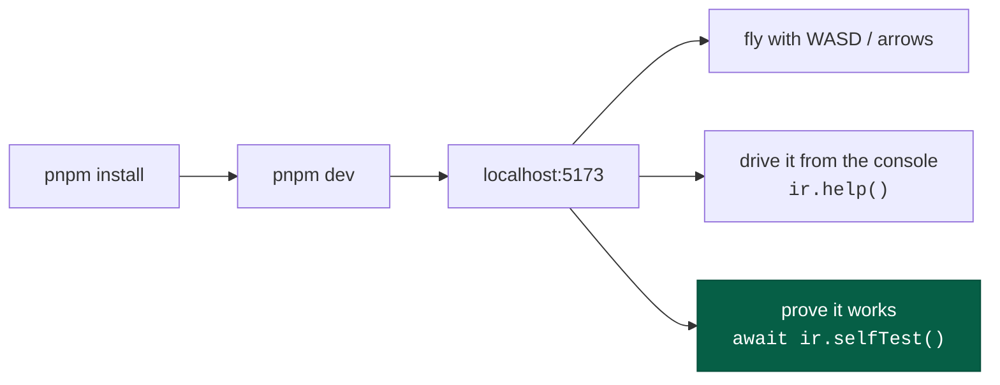
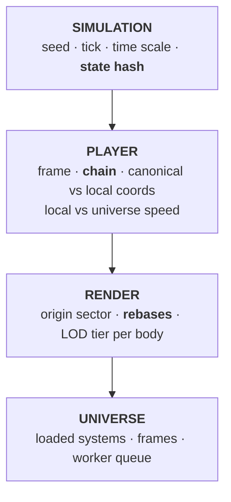

# Getting started

From clone to flying, and the first things worth trying.

---

## Run it

```bash
pnpm install
pnpm dev          # → http://localhost:5173
```

The client opens with a debug spacecraft in a 400 km orbit around the first
solid world of a procedurally generated Sol, facing the planet.



In a **production** build (`pnpm build && pnpm preview`) no server is required
after the first load — a service worker caches the app and content comes from the
seed. It is deliberately not registered under `pnpm dev`, where it would sit in
front of Vite and turn every edit into a caching investigation. See
[persistence](../concepts/persistence.md#offline-first).

---

## Controls

| Key         | Action                             |
| ----------- | ---------------------------------- |
| `W` / `S`   | main drive fore / aft              |
| `A` / `D`   | translate left / right             |
| `R` / `F`   | translate up / down                |
| `↑ ↓ ← →`   | pitch / yaw                        |
| `Q` / `E`   | roll                               |
| `Z`         | flight assist (rotational damping) |
| `X`         | kill rotation                      |
| `Space`     | pause                              |
| `[` / `]`   | time warp down / up                |
| `F5` / `F9` | save / load                        |
| `Tab`       | hide the debug panel               |

Flight is full 6-DoF with no artificial "space mode" — the same controls fly
between stars, into orbit, and down to a landing.

---

## The debug panel

The panel on the right is the architecture made visible. Four sections worth
understanding on day one:



Three fields repay attention:

- **chain** — `universe › s:SOL › b:… › bf:… › sf:…`. Where the ship sits in the
  [frame hierarchy](../concepts/frames.md). It changes as you approach and land.
- **speed** — `0.0 m/s local · 51853.5 m/s universe` when landed. Both are true;
  they answer different questions.
- **state hash** — two tabs showing the same hash at the same tick are running
  identical universes.

---

## First things to try

### 1. Prove the architecture

```js
await ir.selfTest()
```

Runs twelve capability checks against the live build and prints measurements —
inch-scale precision at 8 kpc, zero drift over 500 origin rebases, a worker's
terrain matching the main thread's sample for sample.

### 2. Land on a planet

```js
await ir.scenario('surface')
```

Puts the ship on the ground. Watch the `chain` field gain two levels, `state`
become `landed`, and local speed drop to zero while universe speed stays at tens
of kilometres per second.

### 3. Watch a frame transition

```js
const target = ir.bodies().find((b) => b.kind === 'rocky')
ir.orbit(target.address, 100000) // inside the sphere of influence
ir.control({ translation: [0, 0, 1] }) // burn prograde
for (let i = 0; i < 30; i++) ir.step(20000)
ir.status().world.events.at(-1) // → { tick, kind: 'frame-change', detail: 'left sphere of influence' }
```

The ship is re-framed from the planet to the system, mid-flight, without moving.

### 4. Break determinism (you can't)

```js
const a = ir.status().world.stateHash
const save = ir.save()
ir.step(500)
ir.load(save)
ir.status().world.stateHash === a // → true
```

### 5. Run it with no browser at all

```bash
pnpm sim --self-test
```

The same core in Node — no DOM, no React, no WebGL — at ~110,000 ticks/s.

---

## Commands

```bash
pnpm dev          # vite dev server
pnpm test         # vitest, node environment only
pnpm typecheck    # three tsconfig projects
pnpm lint         # oxlint
pnpm graph        # dependency layering + cycle check
pnpm build
pnpm check        # graph → lint → typecheck → test → build — the gate

pnpm sim --self-test          # headless run + capability checks
pnpm sim --scenario surface --ticks 2526    # also: --seed, --system, --quiet
pnpm vitest run <substring>   # one test file
```

---

## One gotcha when driving a browser

Chrome throttles `requestAnimationFrame` in **backgrounded tabs**. A freshly
reloaded page that is not focused sits at tick 0 until it is. That is the
browser, not a bug in the clock — but it will cost you ten minutes the first
time if you do not know it.

---

## Where to go next

|                       |                                                             |
| --------------------- | ----------------------------------------------------------- |
| Understand the system | [Architecture](../architecture.md)                          |
| Drive it properly     | [The harness](harness.md)                                   |
| Change it safely      | [AGENTS.md](../../AGENTS.md) then [Extending](extending.md) |
| Know what is missing  | [Roadmap](../roadmap.md)                                    |
