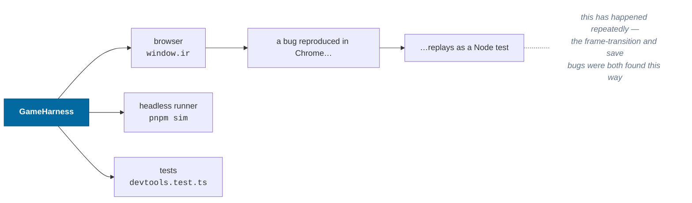
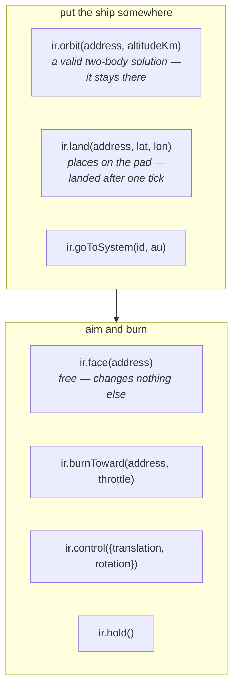
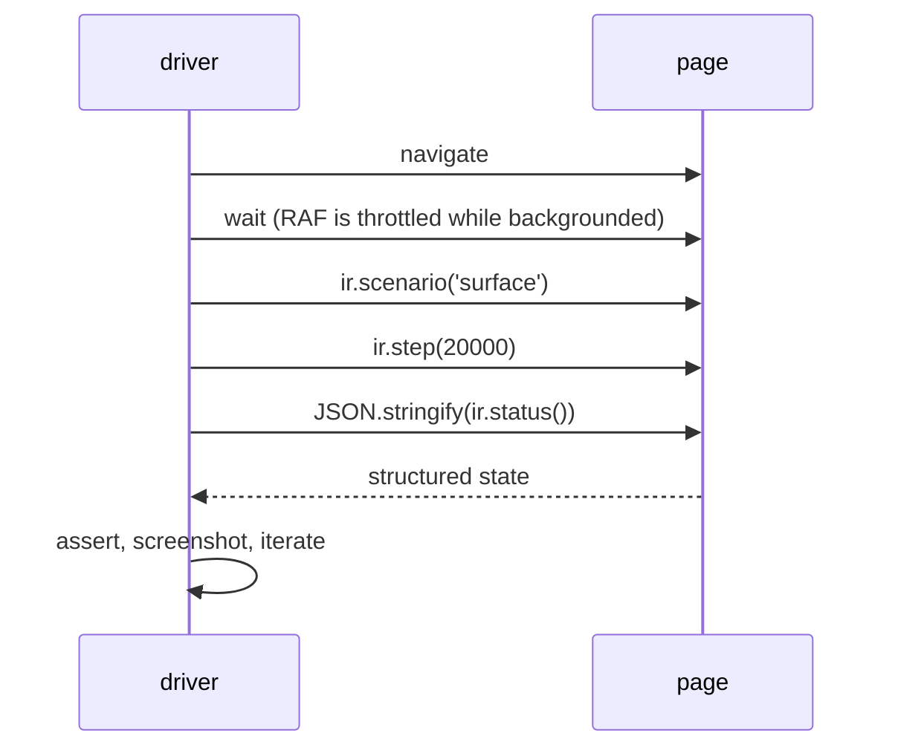

# The harness

A single object that can drive and interrogate the whole simulation without
touching the UI. It is exposed as `window.ir` in the browser and used directly
by the Node runner and the tests.

> `ir.help()` in the console is the quickest list. This page explains the
> supported vocabulary and the distinctions that the one-line help cannot.
>
> Code: `packages/devtools/src/harness.ts`

---

## Why it exists in a package, not the app



Everything it returns is JSON-serializable, for exactly that reason: an agent
driving a browser over the debug protocol gets structured state back, not
pixels.

---

## Reading state

| Call                   | Returns                                                           |
| ---------------------- | ----------------------------------------------------------------- |
| `ir.summary()`         | one line: tick, hash, frame, speed, systems                       |
| `ir.status()`          | everything the debug overlay shows, structured                    |
| `ir.inspect(id?)`      | one entity in full — frames, canonical + local coords, velocities |
| `ir.dossier(address)`  | one star or one body as a page of astronomy                       |
| `ir.snapshot(alpha?)`  | the raw presentation snapshot                                     |
| `ir.bodies(system?)`   | flat listing of a system's bodies with addresses                  |
| `ir.systemsNearby(ly)` | nearest star systems, catalog and procedural                      |
| `ir.logs(n)`           | recent structured log records                                     |

```js
ir.summary()
// tick 2590 (40.47 s, 1x) | hash fdf43017 | Debug One in sf:g:milky-way/s:SOL/b:0@0.350000,-1.100000 | 51849.8 m/s alt 0.000 mm | systems 1, frames 19
```

**`inspect` and `dossier` answer different questions and take different
arguments.** `inspect` takes an entity id and reports a pose and a velocity;
`dossier` takes an address and reports what the thing _is_ — mass, orbit,
rotation, atmosphere, light — in the groups the planetarium's object panel
draws. A body is not an entity, so "what is Europa" has no answer in the entity
store. Fields nothing has measured come back as a `Fact` with a null `value` and
a `pending` reason, and `pendingCount` is how many
([ADR-0014](../adr/0014-the-record-with-holes-in-it.md)). It is lenient about its
input in the same way `ir.look` is, through the same resolver, and returns `null`
for an address that names nothing.

---

## Finding and loading destinations

| Call                | Effect                                                        |
| ------------------- | ------------------------------------------------------------- |
| `ir.targets()`      | destinations near the player, with addresses — start here     |
| `ir.search(text)`   | everywhere matching a name, nearest first — the whole catalog |
| `ir.goTo(target)`   | resolve a human form and move the ship to that system or body |
| `ir.loadSystem(id)` | generate a system without moving the ship                     |

`goTo` is the only verb that accepts all the forms a person types: `SOL`,
`s:SOL/b:2`, or `b:2` relative to the current system. Everywhere else,
`parseAddress` remains strict.

**`targets` and `search` are not the same list narrowed.** `targets` is a star
sweep with a radius and answers "what is near me"; `search` is an index lookup
over the whole catalog and answers "what is called this". Filtering the survey
to serve a name query can only ever find what was already a few light years
away. Both take `{ origin: 'observer' }` when the question is about the
planetarium's camera rather than the ship — in that mode the two are nowhere
near each other.

---

## Driving the clock

| Call                         | Effect                                                                   |
| ---------------------------- | ------------------------------------------------------------------------ |
| `ir.step(ticks)`             | advance exactly N ticks, ignoring wall clock                             |
| `ir.runSeconds(s)`           | advance exactly `s × 64` ticks                                           |
| `ir.pause()` / `ir.resume()` |                                                                          |
| `ir.timeWarp(x)`             | multiplier on how many ticks a second of wall clock buys (1 = real time) |

`step` is the deterministic one — it does not consult the clock at all, which is
what makes scripted scenarios reproducible.

---

## Flying



Two notes worth internalising:

- **`orbit` is not a teleport to coordinates** — it sets a state that solves the
  two-body problem, so the ship stays in that orbit. It also places the ship on
  the **sunward** side, pointing along the orbit, because a debug tool that drops
  you on the night side of an unlit world facing nothing is technically correct
  and useless.
- **`face` and `burnToward` are separate** because looking and accelerating are
  different acts. `face` costs nothing and does not perturb the trajectory.
- **`land` does not land you.** It puts the ship on the pad — local `y = 0` in a
  surface frame _is_ the ground — and the contact test makes it landed on the
  next tick, so `ir.land(...).player.landed` is `false` and one `ir.step()`
  fixes it. `ir.scenario('surface')` hides this because it steps 64 ticks. The
  previous version asserted landedness directly while sitting three meters up;
  because `stepFlight` short-circuits for an entity that is already landed, the
  contact test never ran and the ship hovered there for the whole session while
  the overlay reported an altitude of zero. Landedness is now only ever a
  consequence of touching the ground.
- **`ir.flightAssist(enabled)`** exists and is absent from `ir.help()`. It is
  control input and it is in the state hash, so a test comparing hashes has to
  know it is there. `ir.scenarios()` lists the four scenario names.

---

## Moving only the camera

`ir.look(target, options?)` moves the observatory camera without moving the
ship or changing canonical state. That distinction is deliberate:
`ir.look('s:SOL/b:5')` and `ir.goTo('s:SOL/b:5')` can both fill the frame with
Jupiter, but only `goTo` leaves the ship there.

`ir.observatory` exposes the camera itself for repeated interaction:

```js
ir.observatory.drag(dx, dy)
ir.observatory.zoom(delta)
ir.observatory.setPhase(angle)
ir.observatory.frameTarget()
ir.observatory.clear()
```

Camera bookmarks stage known views:

```js
ir.shots() // names and descriptions
ir.shot('crescent', address)
```

The built-in names include `full-face`, `gibbous`, `half`, `crescent`,
`glint`, `sunset`, and `oblique`.

---

## Standing on a body

The observatory has a second arm, below the orbit camera's 1.5-radii clamp.
`ir.visit` puts the camera on the ground and `ir.ascend` takes it back to the
framing it left; both are camera moves, so `world.stateHash()` is untouched —
`ir.land` is the one that teleports the ship.

```js
ir.sites(address?)                       // the named places on a body
ir.visit(address?, { site, height })     // stand there. Degrees and meters
ir.visit(address?, { latitude, longitude, heading, pitch })
ir.observatory.setStanceScrub(0.5)       // the height slider, logarithmic
ir.ascend()
```

Sites are derived from the body's own terrain rather than authored, so
"the highest ground on this world" survives regeneration and is still the
interesting place afterwards. Four come from a beam search — `summit`, `basin`,
`shore`, `rough` — and two are chosen outright for the renderer: `corner`, where
three faces of the addressing cube meet, and `pole`, where the east/north basis
is singular. On a body with no solid surface `ir.sites` returns an empty list:
a giant's parameters run through the survey without complaint, but every row
would be a place `ir.visit` refuses to stand.

The height is set outright rather than eased, which is what makes a plate loop
work: each `ir.visit` is the frame you asked for, with nothing settling in
between.

```js
for (const height of [40000, 2000, 120, 2]) {
  ir.visit('g:milky-way/s:SOL/b:5.6', { site: 'pole', height })
  // capture here
}
```

---

## Measuring terrain

```js
ir.zoo() // one body per surface archetype, found rather than listed
ir.descend(address?, { site, steps }) // fly a descent on paper
ir.terrain() // what the live streamer holds this frame
ir.terrainBaseline() // the zoo, its descents, and measured patch cost
```

`ir.descend` runs with no world state changed, no worker used and no frame
drawn, so it produces the same level churn, peak burst and cache numbers in a
browser console, in `pnpm sim --terrain-baseline` and in a Node test. It takes
`latitude` and `longitude` in degrees, the same boundary `ir.visit` states —
`ir.sites` output pastes straight in, and radians begin below the harness.
(`ir.land` is the one wart: it takes radians.)
`ir.terrain` is the counterpart: what the streamer actually has, which is
`null` headlessly rather than a zero. Its `patches` counts ground built and
placed this frame, not the selection's length — a cold arrival reports zero
patches over zero vertices rather than six regions still in a worker.

---

## Scripted scenes

```js
ir.cutscenes() // scenes with descriptions and durations
ir.play('tng-intro')
ir.pause()
ir.seekCutscene(1150)
ir.cutsceneStatus()
ir.stopCutscene()
```

Pause before seeking for a frame-exact still. The browser needs to render
after the seek before the sampled cinematic state is current; follow the
capture procedure in [Driving](../agents/driving.md#browser-gotchas).

---

## Scenarios

```js
await ir.scenario('orbit') // circular orbit, 300 km
await ir.scenario('approach') // burning toward a world
await ir.scenario('surface') // parked on the ground
await ir.scenario('interstellar') // holding off Alpha Centauri
await ir.scenario('descent') // orbit to 2 m over every zoo body, on paper
```

Named, repeatable set-ups. Each returns the resulting status, so a test can
assert on it directly.

---

## Proving

```js
const report = await ir.selfTest()
console.log(report.report)
```

Runs the twelve capability checks and returns `{ passed, total, results, report }`.
The `results` array is structured, so a driver can assert on individual checks
rather than parsing text.

```
12/12 capabilities proven
PASS  5. Approach a planet — fell 16.65 m in 60 s at 0.0092 m/s², within 0.03% of free fall
PASS  9. Origin rebasing — 500 rebases, 2560 km of origin travel, zero drift
…
```

Five checks build **scratch worlds**. The rest read the live session — and
capability 3 is not read-only: it loads Alpha Centauri in order to measure the
distance to it, so after a self-test the session has two systems loaded rather
than one. Worth knowing before using the self-test as a mid-session probe.

---

## Persistence

```js
const text = ir.save() // serialized save, ~750 bytes
ir.load(text) // → Result<stateHash, error>
```

`load` returns a `Result` rather than throwing — a save is untrusted input.

---

## Driving from an automated browser session

The pattern that works well:



Read state back as JSON and assert on it. A screenshot tells you something
rendered; `ir.status()` tells you _what_.

---

## Extending the harness

Add a method when a sequence is one you keep retyping — that is the signal it is
part of the vocabulary rather than a one-off. Keep the return JSON-serializable
and add the line to `help()`, which is what people actually read.

If a set-up sequence is shared with the app or the runner, it belongs in
`openSession` instead, which owns standing a world up — see
[extending](extending.md#standing-a-world-up-opensession).

---

## Related

- [Observability](../concepts/observability.md) — what the harness reads from
- [Testing](testing.md) — turning a session into a regression test
