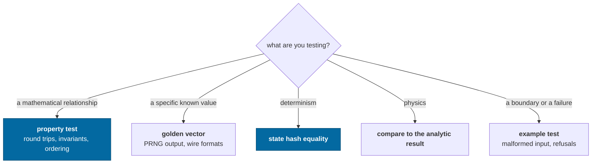
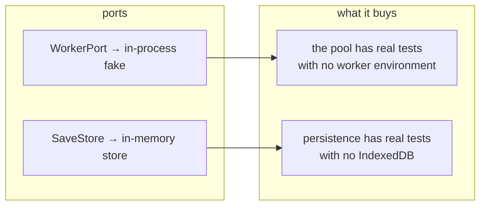

# Testing

What to test here, which style to reach for, and how to write an assertion that
means something.

> Tests live beside the code and run in **plain Node**. That is not a
> convenience — it is the check that the core stays free of DOM, React and
> WebGL. Nothing registers a browser environment.
>
> That now includes the client. `vitest.config.ts` covers `apps/*` as well as
> `packages/*`, and `apps/game/src/engine/gameEngine.test.ts` drives the real
> frame loop, lens resolution, observatory framing, save/load and
> derived-state invalidation under Node — because `GameEngine` takes its worker
> factory and save store as arguments instead of constructing a browser
> `Worker` and IndexedDB itself. Its terrain descent is the one part of that
> file the suite does not currently run; see below.

---

## Choosing a style



Several real bugs in this repository were found by a **property test** and would
not have been found by an example. Reach for `fast-check` whenever the thing
under test is mathematical.

---

## The five patterns

### 1. Property tests

```ts
it('round-trips translate/difference (property)', () => {
  fc.assert(
    fc.property(anyPosition, anyDisplacement, (uv, d) => {
      const back = UV.difference(UV.translate(uv, d), uv)
      // bounded by the representation's ULP, not by the absolute magnitude
      expect(Math.abs(back.x - d.x)).toBeLessThanOrEqual(
        UV.POSITION_RESOLUTION * 4,
      )
    }),
  )
})
```

Good candidates: coordinate round trips, frame re-expression, quaternion
composition, orbital element recovery, address parse/format, wire codecs,
cube-sphere direction mapping.

> **A flaky property test is usually the code telling you something.** The depth-
> compression monotonicity test failed intermittently because the mapping really
> is only _non-decreasing_ past 1e17 m. The fix was to state the true property in
> two tests, not to loosen the tolerance.

### 2. Golden vectors

```ts
expect(formatSeed(ROOT)).toBe('0df87e57180611d601f6e442eb5fc374')
```

Not testing that the value is _right_ — any stream would do. Testing that it
**never changes**, because a silent change regenerates every player's universe.
Changing one is deliberate and comes with an algorithm version bump in the same
commit.

### 3. State-hash equality

The canonical comparison for anything about determinism:

```ts
const jittery = build(),
  steady = build()
while (jittery.clock.tick < 512) jittery.advance(randomFrameTime())
steady.runTicks(jittery.clock.tick)
expect(jittery.stateHash()).toBe(steady.stateHash())
```

### 4. Compare to the analytic result

```ts
const fallen = radius - now
const predicted = 0.5 * gravity * seconds * seconds
expect(Math.abs(fallen - predicted) / predicted).toBeLessThan(0.02)
```

Not "the number went down". Capability check 5 once passed while reporting
_"fell from 57287 km to 57287 km"_ — the ship had fallen 19 m out of 57,000 km
and the assertion was `now <= start`, which equality satisfies.

> A test that cannot fail informatively converts an unknown into a false
> assurance.

### 5. Example tests for boundaries

Malformed JSON, a save from a newer schema, a frame that cannot be rebuilt, an
unknown worker task, a version mismatch. These are the paths where behavior is
a _decision_ (refuse? default? migrate?) and the test documents the decision.

---

## Writing an honest bound

When a tolerance is loose because of a real limit, **name the limit**:

```ts
// says where the number came from
expect(error).toBeLessThan(UV.POSITION_RESOLUTION * 2)

// says nothing; will be "fixed" by loosening when it fails
expect(value).toBeCloseTo(expected, 3)
```

The first survives a refactor with its meaning intact. The second is a magic
number that the next person will adjust rather than investigate.

Related: prefer **relative** comparisons when magnitudes span orders of
magnitude. `expect(Math.abs(a / b - 1)).toBeLessThan(1e-9)` means something at
both 1e-3 and 1e16; an absolute epsilon does not.

**A wall-clock bound has one honest job: catching a collapse.** The catalog's
search bound allows half a second for six queries that cost 1.9 ms, and the
margin is the whole usable range rather than generosity — the same queries cost
an order of magnitude more under vitest than under bare Node, and anything close
enough to the real figure to be interesting is measuring how busy the machine
is. It catches `search` decoding the catalog per query or going quadratic. It
does **not** catch the scan it was written against, and no bound can: a naive
scan of 7,123 stars is 2.9 ms against the index's 1.9, so the index buys a
factor of one and a half. Say what a clock assertion cannot see, in the
assertion's own comment.

### Prove a regression test can fail

Before keeping a regression test, temporarily reintroduce the defect and
watch that test fail for the intended reason. Then restore the fix and watch
it pass. Three ways a test has failed that check here, each different:

- **The assertion did not distinguish the cases.** A terrain-normal regression
  asserted only that normals were unit length; a radial normal is also unit
  length, so it passed both before and after the bug it claimed to guard.
- **The bound was looser than the claim beside it.** A shape-generator property
  test asserted that a body could not exceed `exp(0.6)` — 1.82 times — its
  published extent, while its own comment said "30% larger would be inventing a
  size". The measured inflation topped out at 1.7, so the assertion could not
  fail for any input in its own range and the 37% volume error it was written to
  catch sailed through.
- **The runtime was not the one with the bug.** A module cycle threw
  `ReferenceError: Cannot access 'X' before initialization` under native Node
  ESM. Written as an `import()` inside a vitest test it **passed with the defect
  deliberately reintroduced**, because vitest evaluates modules through its own
  runner and does not enforce the temporal dead zone Node's linker does. The
  working version spawns a Node process per entry point from `apps/headless`.
  If a bug lives in a boundary — a loader, a bundler, a host — the test has to
  cross that boundary too.

### A timeout is a guard against a hang, not a performance budget

`testTimeout` is 20 s in `vitest.config.ts`, not vitest's default 5, and the
reason is written there. Several tests legitimately take a second or more of
pure CPU — a 129-body Solar System stepped for thousands of ticks, a fast-check
property over a quarter of a million noise samples — and the runner puts
eighty-odd files across every core at once. At 5 s the suite failed
intermittently, and **the tests it killed were mostly not the ones that had
grown**: an Rng uniformity property, an atmosphere sweep, the catalog's own
search bound, all pre-existing and green standalone.

The diagnosis is worth remembering because the symptom points somewhere else
entirely: when unrelated tests start failing together and pass on a re-run, the
timeout has stopped measuring the code and started measuring how busy the
machine is. A test that spawns processes is the usual culprit — one here began
as ten parallel `node` invocations under `it.each` and starved everything.

**The other culprit is a browser you started yourself and left running.**
`scripts/drive.mjs` leaves Chrome up between invocations on purpose — boot is
about five seconds and attaching is under one — so a session that has been
verifying in the browser is a session running a GPU process, up to eight worker
threads and a Vite dev server beside the suite. Measured here across two consecutive full runs with
that rig up: one file timed out each time, and it was a **different** file each
time — a terrain descent once, a crater-field property the next — with both
passing clean the moment `pnpm drive --down` had run. Neither was a regression
and both looked exactly like one. `--down` before the gate, and treat a single
timeout that moves between runs as a machine reading rather than a code one.

**A test that needs more says so at the call site, with the same reasoning one
order of magnitude up.** `gameEngine.test.ts` streams a landing — a whole-disk
selection's worth of heightfields through an _inline_ worker, which is to say
serially on the test's own thread — and takes about a hundred seconds for it. Its
timeout is five minutes, not two: two is barely over the idle cost, and this
descent has already run past 120 s under full-suite contention and been killed
for it, so the tighter budget goes red on a green run. The descent is paid once
in a shared `beforeAll` and four assertions read a reading taken there, because
four landings is nearly seven minutes where one is a hundred — and because an
`it` that drives a shared engine is an `it` whose result depends on which one ran
before it. What brings the number down is the GPU tile producer or a pool with
real worker threads in it, not a shorter landing.

**That descent carries `describe.skip`, so the suite does not currently run
it.** One file is ninety percent of `pnpm test`'s wall clock, and all of that
file is this `beforeAll` — so the skip buys the Stop gate its ninety seconds
back and costs `pnpm check` and CI the one place "the ship lands on the ground
it drew" is proved. It is a trade rather than a fix, and the version that keeps
both puts any test that streams a landing in a second vitest project the
per-turn gate does not run: `apps/game/vitest.gpu.config.ts` is already that
shape, a project selected by a file suffix the root config excludes. Until
then, a change under `engine/terrainStreamer.ts` or the terrain path is
unproven by the gate — drop the `.skip` and run the file before shipping one.
[Test speed](../../design/plans/test-speed.md) carries the measurements and the
options.

**The figure moves with the field, which is why it is not a budget.** A bordered
65×65 patch costs 24 to 69 ms across the zoo, and every level the detail floor
gains is another ring of them paid here at full serial cost; the browser has a
pool of up to eight and this has one thread.

### Check a distribution when the claim is about one

`irregularFigure` claims its numbers come from twenty-five measured shape
models. That is a claim about a _population_, and a test that generated one body
and looked at it could not evaluate it. The test generates eighty across the
parameter range and asserts the median and both tails — which is how the
generator was caught delivering 0.03 when asked for 0.18, because an fBm's
standard deviation is a sixth of its range and nothing divided it out.

The same shape appears wherever a generator has a statistical claim: the spin
barrier (nothing may rotate faster than `sqrt(3π/Gρ)`), the retrograde fraction,
the size ladder. Each is one assertion over a population and none of them is
expressible about a single draw.

### Compare derived quantities, not stored ones

`apps/headless/src/solarSystem.test.ts` checks the engine's Solar System against
a JPL reference, and the strongest assertions in it are the ones about numbers
the engine **does not store**. It has no orbital period field — it computes one
from `G(M+m)` and the semi-major axis — and no surface gravity or escape velocity
at all. Matching JPL's published period to four figures says the axis is right,
the star's mass is right, the body's mass is right and `orbitalPeriod` is right,
in one assertion, because there is no way for two of those to be wrong and still
produce it.

It also converts units in only one direction: the reference keeps the kilometers
and days JPL publishes, and the test does the arithmetic, so a check and the
thing it checks cannot share a factor of 86,400 and agree with each other
about it.

---

## Testing across the boundary

Two mechanisms make otherwise-hard things testable in Node:



The inline worker is **not a mock** — it runs the real host loop through the
real envelopes, so a value that is not structured-cloneable still fails.

### Shader behavior runs on the real GPU, from Node

A TSL node graph is compiled and run on the physical GPU by `pnpm test:gpu`,
without a browser. `webgpu` on npm is Dawn — the WebGPU implementation Chrome
ships — built as a Node addon; `apps/game/src/render/gpuSetup.ts` installs
the three globals `three/webgpu` reads at import time, and
`apps/game/src/render/gpuHarness.ts` hands a test a `WebGPURenderer` and five
verbs: `compile`, `shader` (the generated WGSL), `drawGraph` and `draw`
(pixels back from a render target), and `compute` with `readBuffer` (a
storage buffer back from a kernel). The suite is `*.gpu.test.ts`, its config
is `apps/game/vitest.gpu.config.ts`, and the whole of it — every production
material compiled to a Metal pipeline, structural assertions on the WGSL, a
pixel ramp, the orbital bake read back both ways, the ring strips, the terrain
kernels against their CPU originals — runs in about **18 s** on an M5, eight
files and 41 tests. One test is seventeen of those seconds:
`terrainKernel.gpu.test.ts` holds the tile kernel to `generateHeightfield`
across the zoo and the levels, and it walks all fourteen rungs of the crater
ladder on every body. The bands are 3.2 s and the producer 1.4 s, running in
parallel beside it; everything else together, Dawn's boot included, is about a
second, which is why a question that is not about the kernel should name its own
file. Why that config exists and why it sits outside `pnpm check` is its own
header,
[`apps/game/vitest.gpu.config.ts`](../../apps/game/vitest.gpu.config.ts); what
is still open — whether a hosted macOS runner gives Dawn a Metal adapter, and
the two limits on how far these answers travel — is
[the headless WebGPU plan](../../design/plans/headless-webgpu.md).

It is a separate command rather than part of `pnpm test` because it makes a
different portability claim: the rest of the suite runs on any Node, and this
needs a Metal, Vulkan or D3D adapter. It is not in `pnpm check` for the same
reason. Run it during shader work, and before shipping any change under
`render/`.

**Do not write a scalar mirror of a shader and test that instead.** That rule
matters more now, not less: the mirror can pass while the graph it claims to
describe drifts, and the remedy is to test the graph itself.
`terrainKernel.gpu.test.ts` is the whole of it: the GPU tile producer's kernel
against `generateHeightfield` on every zoo body and three Sol bodies at seven
levels each, held to a bound stated as arithmetic about the kernel's two
limits, and `terrainBands.gpu.test.ts` holds each of the eight bands to its own
figure so a red whole names its band. `terrainKernels.gpu.test.ts` is the
seed those grew from — a TSL port of `faceToDirection`
and of the `pcg3d` lattice hash, each run on the GPU and compared with the CPU
function, the float one to a named f32 bound and the integer one bit for bit.

Four things the harness owns, because each cost a round trip to learn:

- **A readback is padded.** `readRenderTargetPixelsAsync` returns the mapped
  staging buffer whole, with every row aligned to 256 bytes — an 8-wide RGBA8
  target reads back with its second row at element 256. `Pixels` unpacks it,
  and puts row 0 at the **top**, which is where WebGPU's texture origin is.
- **A pipeline that will not build does not reject.** A draw builds it inside
  the backend's own validation scope and reports through three's console
  sink; `compileAsync` builds it with `createRenderPipelineAsync`, whose
  rejection carries the failure, and the backend discards that rejection. The
  harness brackets every verb in a validation scope of its own and listens on
  the sink, so a shader Tint refuses is a red test with the compiler's
  message in it.
- **A compute kernel must guard its own index.** A compute node dispatches
  whole workgroups of 64, and WGSL clamps an out-of-range write onto the last
  element, so a 1,547-cell kernel runs 1,600 times and the last cell holds
  whichever excess invocation ran last. A count that happens to divide by 64
  never shows it.
- **A stand-in texture must be filtered like the map it stands in for.**
  `DataTexture` defaults to nearest, the WGSL builder reads a nearest texture
  with `textureLoad` and no sampler, and the gradient sample has no such path
  — so the ground's stand-in referenced a sampler that was never declared, and
  every mapless body's ground was a black frame.
  `materials.gpu.test.ts` holds each stand-in and a real map to the same
  program.

**A headless GPU check is still not a real one.** Nothing here observes
presentation: one renderer failure reproduced only at `devicePixelRatio` 2,
terrain selection is measured in display pixels, and a strobe is a property of
what the compositor presented. Rendering work still ends at the browser
procedure in [Driving](../agents/driving.md). The two layers are ordered, not
alternative — the fast one answers whether a graph is valid and correct, the
browser answers whether a frame is right.

---

## The capability checks

Twelve executable assertions about the architecture, in
`packages/devtools/src/capabilities.ts`. They run in the test suite, in
`pnpm sim --self-test`, and in the browser via `ir.selfTest()`.

They differ from unit tests in two ways:

1. They run against a **whole assembled world**, not a unit.
2. They **report measurements**, so a passing run is still informative.

Add one when a new claim about the architecture becomes something you would
otherwise assert in prose.

---

## What is not covered yet

| Gap                                                                                                                              | Roadmap                                                  |
| -------------------------------------------------------------------------------------------------------------------------------- | -------------------------------------------------------- |
| A fixture captured from a released build, for real compatibility testing (the v0 shape is covered, but from an inline literal)   | [roadmap](../roadmap.md#persistent-mutations)            |
| Recorded input replay                                                                                                            | [roadmap](../roadmap.md#replay-and-reconciliation)       |
| Performance regression benchmarks                                                                                                | [roadmap](../roadmap.md#performance-work)                |
| Shader behavior in CI — `pnpm test:gpu` needs a physical adapter, and whether a hosted macOS runner gives Dawn one is unmeasured | [headless WebGPU](../../design/plans/headless-webgpu.md) |

---

## Running them

```bash
pnpm test                       # everything that runs on any Node
pnpm test:gpu                   # the shader suite, on the real GPU — not in check
pnpm test:coverage              # the same suite, plus coverage/coverage-final.json
pnpm vitest run world.test      # one file
# One GPU file. The root config excludes the suffix, so the plain form above
# answers "No test files found" for anything named *.gpu.test.ts.
pnpm vitest run --config apps/game/vitest.gpu.config.ts materials.gpu
pnpm vitest                     # watch
pnpm check                      # graph, brand, presets, format, lint, typecheck, test, build
```

---

## Related

- [Observability](../concepts/observability.md) — the structures tests assert on
- [Determinism](../concepts/determinism.md) — what the golden vectors protect
- [AGENTS.md](../../AGENTS.md) — the rules a test is defending
- [Agent handbook](../agents/README.md)
