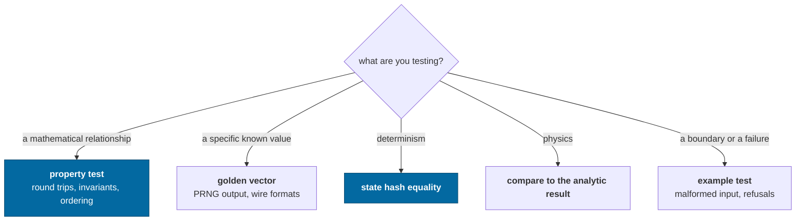
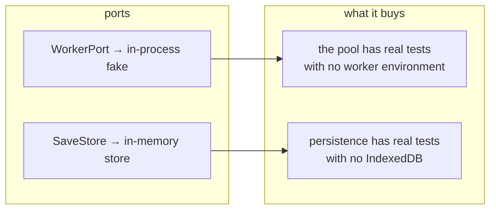

# Testing

What to test here, which style to reach for, and how to write an assertion that
means something.

> Tests live beside the code and run in **plain Node**. That is not a
> convenience — it is the check that the core stays free of DOM, React and
> WebGL. Nothing registers a browser environment.
>
> That now includes the client. `vitest.config.ts` covers `apps/*` as well as
> `packages/*`, and `apps/game/src/engine/gameEngine.test.ts` drives the real
> frame loop, origin rebasing, save/load and derived-state invalidation under
> Node — because `GameEngine` takes its worker factory and save store as
> arguments instead of constructing a browser `Worker` and IndexedDB itself.

---

## Choosing a style



Several real bugs in this repository were found by a **property test** and would
not have been found by an example. Reach for `fast-check` whenever the thing
under test is mathematical.

---

## The five patterns

### 1. Property tests

```ts
it('round-trips translate/difference (property)', () => {
  fc.assert(
    fc.property(anyPosition, anyDisplacement, (uv, d) => {
      const back = UV.difference(UV.translate(uv, d), uv)
      // bounded by the representation's ULP, not by the absolute magnitude
      expect(Math.abs(back.x - d.x)).toBeLessThanOrEqual(
        UV.POSITION_RESOLUTION * 4,
      )
    }),
  )
})
```

Good candidates: coordinate round trips, frame re-expression, quaternion
composition, orbital element recovery, address parse/format, wire codecs,
cube-sphere direction mapping.

> **A flaky property test is usually the code telling you something.** The depth-
> compression monotonicity test failed intermittently because the mapping really
> is only _non-decreasing_ past 1e17 m. The fix was to state the true property in
> two tests, not to loosen the tolerance.

### 2. Golden vectors

```ts
expect(formatSeed(ROOT)).toBe('0df87e57180611d601f6e442eb5fc374')
```

Not testing that the value is _right_ — any stream would do. Testing that it
**never changes**, because a silent change regenerates every player's universe.
Changing one is deliberate and comes with an algorithm version bump in the same
commit.

### 3. State-hash equality

The canonical comparison for anything about determinism:

```ts
const jittery = build(),
  steady = build()
while (jittery.clock.tick < 512) jittery.advance(randomFrameTime())
steady.runTicks(jittery.clock.tick)
expect(jittery.stateHash()).toBe(steady.stateHash())
```

### 4. Compare to the analytic result

```ts
const fallen = radius - now
const predicted = 0.5 * gravity * seconds * seconds
expect(Math.abs(fallen - predicted) / predicted).toBeLessThan(0.02)
```

Not "the number went down". Capability check 5 once passed while reporting
_"fell from 57287 km to 57287 km"_ — the ship had fallen 19 m out of 57,000 km
and the assertion was `now <= start`, which equality satisfies.

> A test that cannot fail informatively converts an unknown into a false
> assurance.

### 5. Example tests for boundaries

Malformed JSON, a save from a newer schema, a frame that cannot be rebuilt, an
unknown worker task, a version mismatch. These are the paths where behavior is
a _decision_ (refuse? default? migrate?) and the test documents the decision.

---

## Writing an honest bound

When a tolerance is loose because of a real limit, **name the limit**:

```ts
// says where the number came from
expect(error).toBeLessThan(UV.POSITION_RESOLUTION * 2)

// says nothing; will be "fixed" by loosening when it fails
expect(value).toBeCloseTo(expected, 3)
```

The first survives a refactor with its meaning intact. The second is a magic
number that the next person will adjust rather than investigate.

Related: prefer **relative** comparisons when magnitudes span orders of
magnitude. `expect(Math.abs(a / b - 1)).toBeLessThan(1e-9)` means something at
both 1e-3 and 1e16; an absolute epsilon does not.

### Prove a regression test can fail

Before keeping a regression test, temporarily reintroduce the defect and
watch that test fail for the intended reason. Then restore the fix and watch
it pass. Three ways a test has failed that check here, each different:

- **The assertion did not distinguish the cases.** A terrain-normal regression
  asserted only that normals were unit length; a radial normal is also unit
  length, so it passed both before and after the bug it claimed to guard.
- **The bound was looser than the claim beside it.** A shape-generator property
  test asserted that a body could not exceed `exp(0.6)` — 1.82 times — its
  published extent, while its own comment said "30% larger would be inventing a
  size". The measured inflation topped out at 1.7, so the assertion could not
  fail for any input in its own range and the 37% volume error it was written to
  catch sailed through.
- **The runtime was not the one with the bug.** A module cycle threw
  `ReferenceError: Cannot access 'X' before initialization` under native Node
  ESM. Written as an `import()` inside a vitest test it **passed with the defect
  deliberately reintroduced**, because vitest evaluates modules through its own
  runner and does not enforce the temporal dead zone Node's linker does. The
  working version spawns a Node process per entry point from `apps/headless`.
  If a bug lives in a boundary — a loader, a bundler, a host — the test has to
  cross that boundary too.

### A timeout is a guard against a hang, not a performance budget

`testTimeout` is 20 s in `vitest.config.ts`, not vitest's default 5, and the
reason is written there. Several tests legitimately take a second or more of
pure CPU — a 129-body Solar System stepped for thousands of ticks, a fast-check
property over a quarter of a million noise samples — and the runner puts
sixty-odd files across every core at once. At 5 s the suite failed
intermittently, and **the tests it killed were mostly not the ones that had
grown**: an Rng uniformity property, an atmosphere sweep, the catalog's own
search bound, all pre-existing and green standalone.

The diagnosis is worth remembering because the symptom points somewhere else
entirely: when unrelated tests start failing together and pass on a re-run, the
timeout has stopped measuring the code and started measuring how busy the
machine is. A test that spawns processes is the usual culprit — one here began
as ten parallel `node` invocations under `it.each` and starved everything.

### Check a distribution when the claim is about one

`irregularFigure` claims its numbers come from twenty-five measured shape
models. That is a claim about a _population_, and a test that generated one body
and looked at it could not evaluate it. The test generates eighty across the
parameter range and asserts the median and both tails — which is how the
generator was caught delivering 0.03 when asked for 0.18, because an fBm's
standard deviation is a sixth of its range and nothing divided it out.

The same shape appears wherever a generator has a statistical claim: the spin
barrier (nothing may rotate faster than `sqrt(3π/Gρ)`), the retrograde fraction,
the size ladder. Each is one assertion over a population and none of them is
expressible about a single draw.

### Compare derived quantities, not stored ones

`apps/headless/src/solarSystem.test.ts` checks the engine's Solar System against
a JPL reference, and the strongest assertions in it are the ones about numbers
the engine **does not store**. It has no orbital period field — it computes one
from `G(M+m)` and the semi-major axis — and no surface gravity or escape velocity
at all. Matching JPL's published period to four figures says the axis is right,
the star's mass is right, the body's mass is right and `orbitalPeriod` is right,
in one assertion, because there is no way for two of those to be wrong and still
produce it.

It also converts units in only one direction: the reference keeps the kilometers
and days JPL publishes, and the test does the arithmetic, so a check and the
thing it checks cannot share a factor of 86,400 and agree with each other
about it.

---

## Testing across the boundary

Two mechanisms make otherwise-hard things testable in Node:



The inline worker is **not a mock** — it runs the real host loop through the
real envelopes, so a value that is not structured-cloneable still fails.

### Shader behavior needs a real GPU

A TSL node graph cannot be evaluated in Node. Do not write a scalar mirror of
a shader and test that instead: the mirror can pass while the graph it claims
to describe drifts. Verify shader behavior on a GPU.

A headless GPU is not equivalent to the real browser target. One renderer
failure reproduced only at `devicePixelRatio` 2, so a headless check could not
prove that path. Use the browser verification procedure in
[Driving](../agents/driving.md) for rendering work.

---

## The capability checks

Twelve executable assertions about the architecture, in
`packages/devtools/src/capabilities.ts`. They run in the test suite, in
`pnpm sim --self-test`, and in the browser via `ir.selfTest()`.

They differ from unit tests in two ways:

1. They run against a **whole assembled world**, not a unit.
2. They **report measurements**, so a passing run is still informative.

Add one when a new claim about the architecture becomes something you would
otherwise assert in prose.

---

## What is not covered yet

| Gap                                                                                                                            | Roadmap                                            |
| ------------------------------------------------------------------------------------------------------------------------------ | -------------------------------------------------- |
| A fixture captured from a released build, for real compatibility testing (the v0 shape is covered, but from an inline literal) | [roadmap](../roadmap.md#persistent-mutations)      |
| Recorded input replay                                                                                                          | [roadmap](../roadmap.md#replay-and-reconciliation) |
| Performance regression benchmarks                                                                                              | [roadmap](../roadmap.md#performance-work)          |
| Shader behavior in the Node suite                                                                                              | verify on a real GPU; do not test a scalar mirror  |

---

## Running them

```bash
pnpm test                       # everything
pnpm vitest run world.test      # one file
pnpm vitest                     # watch
pnpm check                      # graph, brand, presets, format, lint, typecheck, test, build
```

---

## Related

- [Observability](../concepts/observability.md) — the structures tests assert on
- [Determinism](../concepts/determinism.md) — what the golden vectors protect
- [AGENTS.md](../../AGENTS.md) — the rules a test is defending
- [Agent handbook](../agents/README.md)
