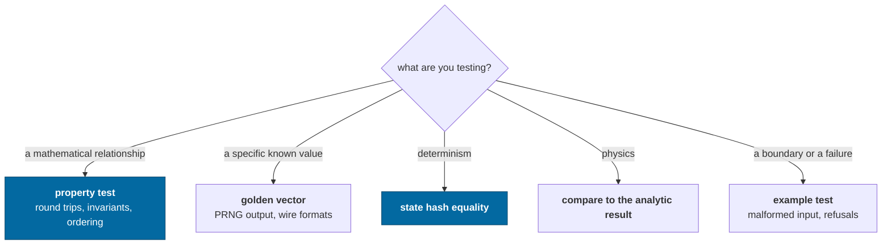
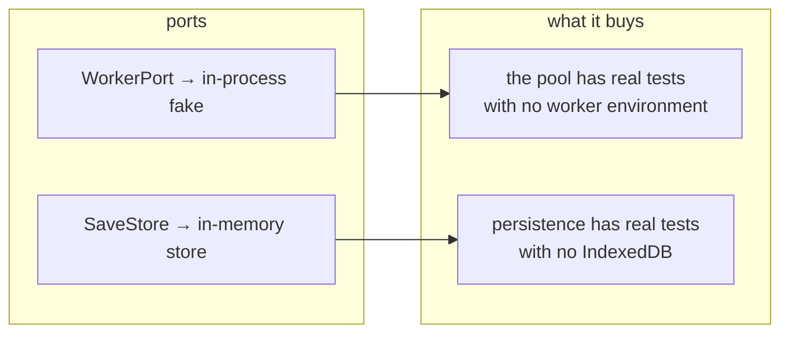

# Testing

What to test here, which style to reach for, and how to write an assertion that
means something.

> Tests live beside the code and run in **plain Node**. That is not a
> convenience — it is the check that the core stays free of DOM, React and
> WebGL. Nothing registers a browser environment.

---

## Choosing a style



Several real bugs in this repository were found by a **property test** and would
not have been found by an example. Reach for `fast-check` whenever the thing
under test is mathematical.

---

## The five patterns

### 1. Property tests

```ts
it('round-trips translate/difference (property)', () => {
  fc.assert(fc.property(anyPosition, anyDisplacement, (uv, d) => {
    const back = UV.difference(UV.translate(uv, d), uv)
    // bounded by the representation's ULP, not by the absolute magnitude
    expect(Math.abs(back.x - d.x)).toBeLessThanOrEqual(UV.POSITION_RESOLUTION * 4)
  }))
})
```

Good candidates: coordinate round trips, frame re-expression, quaternion
composition, orbital element recovery, address parse/format, wire codecs,
cube-sphere direction mapping.

> **A flaky property test is usually the code telling you something.** The depth-
> compression monotonicity test failed intermittently because the mapping really
> is only *non-decreasing* past 1e17 m. The fix was to state the true property in
> two tests, not to loosen the tolerance.

### 2. Golden vectors

```ts
expect(formatSeed(ROOT)).toBe('0df87e57180611d601f6e442eb5fc374')
```

Not testing that the value is *right* — any stream would do. Testing that it
**never changes**, because a silent change regenerates every player's universe.
Changing one is deliberate and comes with an algorithm version bump in the same
commit.

### 3. State-hash equality

The canonical comparison for anything about determinism:

```ts
const jittery = build(), steady = build()
while (jittery.clock.tick < 512) jittery.advance(randomFrameTime())
steady.runTicks(jittery.clock.tick)
expect(jittery.stateHash()).toBe(steady.stateHash())
```

### 4. Compare to the analytic result

```ts
const fallen = radius - now
const predicted = 0.5 * gravity * seconds * seconds
expect(Math.abs(fallen - predicted) / predicted).toBeLessThan(0.02)
```

Not "the number went down". Capability check 5 once passed while reporting
*"fell from 57287 km to 57287 km"* — the ship had fallen 19 m out of 57,000 km
and the assertion was `now <= start`, which equality satisfies.

> A test that cannot fail informatively converts an unknown into a false
> assurance.

### 5. Example tests for boundaries

Malformed JSON, a save from a newer schema, a frame that cannot be rebuilt, an
unknown worker task, a version mismatch. These are the paths where behaviour is
a *decision* (refuse? default? migrate?) and the test documents the decision.

---

## Writing an honest bound

When a tolerance is loose because of a real limit, **name the limit**:

```ts
// says where the number came from
expect(error).toBeLessThan(UV.POSITION_RESOLUTION * 2)

// says nothing; will be "fixed" by loosening when it fails
expect(value).toBeCloseTo(expected, 3)
```

The first survives a refactor with its meaning intact. The second is a magic
number that the next person will adjust rather than investigate.

Related: prefer **relative** comparisons when magnitudes span orders of
magnitude. `expect(Math.abs(a / b - 1)).toBeLessThan(1e-9)` means something at
both 1e-3 and 1e16; an absolute epsilon does not.

---

## Testing across the boundary

Two mechanisms make otherwise-hard things testable in Node:



The inline worker is **not a mock** — it runs the real host loop through the
real envelopes, so a value that is not structured-cloneable still fails.

---

## The capability checks

Twelve executable assertions about the architecture, in
`packages/devtools/src/capabilities.ts`. They run in the test suite, in
`pnpm sim --self-test`, and in the browser via `ir.selfTest()`.

They differ from unit tests in two ways:

1. They run against a **whole assembled world**, not a unit.
2. They **report measurements**, so a passing run is still informative.

Add one when a new claim about the architecture becomes something you would
otherwise assert in prose.

---

## What is not covered yet

| Gap | Roadmap |
|---|---|
| A stored fixture of an old save, for real compatibility testing | [roadmap](../roadmap.md#persistent-mutations) |
| Recorded input replay | [roadmap](../roadmap.md#replay-and-reconciliation) |
| Performance regression benchmarks | [roadmap](../roadmap.md#performance-work) |
| Any rendering test that touches a GPU | out of scope by design — `rendering` is pure data |

---

## Running them

```bash
pnpm test                       # everything
pnpm vitest run world.test      # one file
pnpm vitest                     # watch
pnpm check                      # the gate: graph, lint, typecheck, test, build
```

---

## Related

- [Observability](../concepts/observability.md) — the structures tests assert on
- [Determinism](../concepts/determinism.md) — what the golden vectors protect
- [AGENTS.md](../../AGENTS.md) — the rules a test is defending
