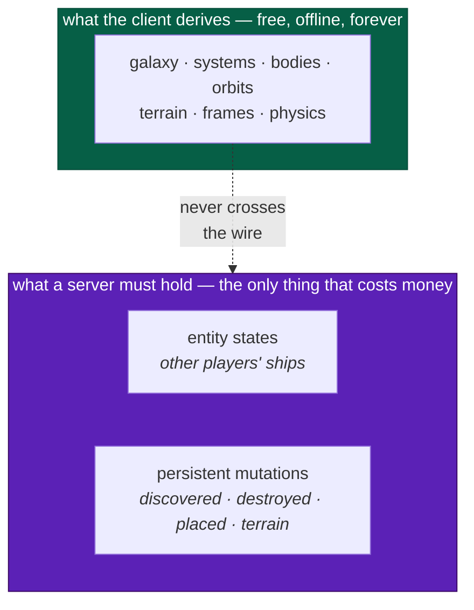
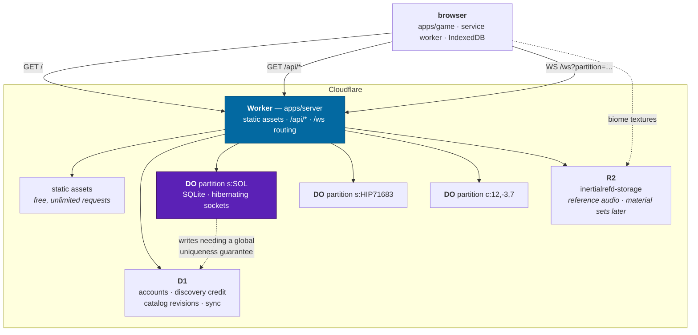

# Hosting

How InertialRef gets from a `dist/` directory to a URL, and what has to exist
behind that URL before the persistent universe is possible.

> **Static hosting, the local authority port, metadata, reference media, and
> the optional Planetarium guide are implemented. Remote simulation authority
> and persistent mutations remain planned.** The client is live at
> <https://inertialref.app> and the retained `inertialref.jonjaques.com` origin.
> `apps/server` serves the static bundle, `/api/health`, and the authenticated
> `/api/tour` service that signs in and creates a GPT Live session. The Worker
> implements no Durable Object; the browser holds the guide conversation over
> WebRTC ([ADR-0042](adr/0042-the-guide-speaks-in-one-voice.md)). The
> multiplayer `/ws` path still returns a deliberate 501; partition authorities
> and D1 are planned, and are where the first Durable Object will land.
>
> [ADR-0008](adr/0008-multiplayer-partitions.md) is the decision it implements,
> [modes](design/modes.md) is what each tier owes the player, and
> [sustainability](design/sustainability.md#the-hosting-question) is who pays.

> **Legend** — ✅ done · 🟡 partial · ⬜ not started · ⛔ deliberately deferred

---

## The private Planetarium guide

The Guide is an optional cloud service within the Planetarium. Missing secrets
or `TOUR_GUIDE_ENABLED=false` make cloud capabilities unavailable; the ordinary
scene and local tour controls do not require provider credentials. See
[ADR-0041](adr/0041-the-guide-requests-the-view.md) for the execution boundary.

Local `pnpm dev` starts the server through `scripts/tour/dev.mjs`. That adapter
passes the repository's gitignored `.env.local` to Wrangler alone. Use
`OPENAI_API_KEY` and `TOUR_GUIDE_PASSWORD` without a `VITE_` prefix. The client
bundle, preference store, and public build variables never receive them.

Production uses Worker secrets, entered through Wrangler's secret prompt:

```bash
pnpm --filter @inertialref/server exec wrangler secret put OPENAI_API_KEY
pnpm --filter @inertialref/server exec wrangler secret put TOUR_GUIDE_PASSWORD
```

The Worker implements no Durable Object. [ADR-0042](adr/0042-the-guide-speaks-in-one-voice.md)
moved the conversation into the browser, and the `tour-v2` migration deletes
the `TourSession` and `TourAdmission` classes the earlier design bound.
Regenerate host declarations with `pnpm --filter @inertialref/server types`
when bindings change. Deployment applies the class-deletion migration; it does
not require a simulation or D1 migration.

| Endpoint                     | Purpose                                                                          |
| ---------------------------- | -------------------------------------------------------------------------------- |
| `GET /api/tour/capabilities` | Availability, admission, and the voices the panel offers; images are disabled    |
| `POST /api/tour/login`       | Password admission with a signed cookie and login throttling                     |
| `POST /api/tour/sessions`    | Creates one GPT Live session: writes the configuration, exchanges the WebRTC SDP |

The browser holds the session over its own WebRTC peer connection and data
channel; there is no application socket, no `/speech`, `/close`, `/status`, or
`/usage` route, and no controlling tab. Tour responses are uncached, and the
mutating routes validate the origin and the session cookie. The cookie lasts
24 hours, is HttpOnly and SameSite Strict, and is Secure on HTTPS. Every holder
of the shared password uses the same alpha principal; clearing cookies does not
create a fresh one.

The Worker keeps no session ledger and no session timer. The spending bound is
the OpenAI project's own limit and the duration bound is the provider's session
expiry, two hours out; a browser that vanishes ends its session within three
seconds without the Worker's help, so there is nothing to time. These are
configured bounds on an experiment, not a measured cost per tour.

The Worker has no conversation log, because it holds no conversation: it never
sees a prompt, a response, a transcript fragment or a tool call. What it does
record is every answer that is not a plain success, and why. Workers Logs keeps
a record per refused request naming the check that refused it, and one per
provider failure carrying the provider's status, error type, error code,
message and request id — the browser sees only the 503, so this record is the
one place a revoked key or a spent project is readable. Workers Traces holds a
span per route with the provider round trip as a child. Both are unsampled and
persisted; `apps/server/wrangler.jsonc` says why. Read them in the dashboard
under the Worker's Logs and Traces tabs, or live:

```bash
pnpm --filter @inertialref/server run tail
```

The message log lives where the messages do. `ir.guideTrace(true)`
enables the browser's application-message log and `ir.guideTrace()` returns its
last 200 entries; it carries no credentials, cookies, SDP or audio. The
[conversation replay](../scripts/tour/README.md#the-conversation-replay) reads a
recorded one back.

Live audio uses browser WebRTC. The server writes the Live configuration —
one voice, Astra as the delegated backend, and a data-channel allow list that
omits `session.update` — and the browser runs the tool loop over that channel.
There is one voice and no controlled clips; the browser's own clock, reading
the remote audio track, decides when a stop has been heard.

Guide admission and operation are separate from public hosting. Do not claim a
provider gate from a successful page build or a `session.started` event. Real
spoken replies, delegation, closure, and repeated listening need explicit
verification. Because the Worker implements no Durable Object, Cloudflare
generates a version preview URL for it, and deployed guide verification uses an
ordinary `pnpm --filter @inertialref/server run versions:upload` preview under
the account's `workers.dev` subdomain — the origin rule admits that subdomain
so a preview can sign in.

---

## The one idea

> **The server's job is small, and the architecture's job is to keep it small.**

Because the universe is a pure function of `(seed, catalog version, address)`,
the simulation server never has to store, serve or simulate the galaxy. Its
authority holds what a client cannot derive — **other entities and persistent mutations** — which is
the same set the save format represents. That is
[ADR-0007](adr/0007-persistence.md) and [ADR-0008](adr/0008-multiplayer-partitions.md)
agreeing with each other, and it is the reason a non-commercial project can
credibly promise a persistent universe at all.

The guide adds session ordering, provider calls, and a spending ledger outside
that simulation contract. It sends bounded object records for an admitted
request and has no authority to create a discovery or mutate a ship.

Every simulation hosting decision below is downstream of that. Where a choice would let the
server grow a responsibility the client could have discharged itself, the choice
is wrong even when it is convenient.



---

## The topology

One Worker is the whole front door. It serves the client's static assets, it
answers `/api/*`, and upgrades the guide socket under `/api/tour`. The
multiplayer topology below remains planned: `/ws` will select a Durable Object
by partition key.



**Why one Worker and not three services.** Same origin means no CORS preflight
on every API call, no second hostname for the WebSocket, and no `SameSite`
gymnastics around whatever token identifies a player. Static asset requests are
free and unlimited and do not invoke the Worker at all, so the shared origin
costs nothing. The alternative — an `api.` subdomain — was considered and is
noted under [things that will bite](#things-that-will-bite), because it would
have sidestepped one real problem for free.

---

## What each Cloudflare primitive is for

| Primitive              | Holds                                                         | Why this one and not another                                                                                                                                                                                       |
| ---------------------- | ------------------------------------------------------------- | ------------------------------------------------------------------------------------------------------------------------------------------------------------------------------------------------------------------ |
| **Workers**            | The client bundle, the API, WebSocket upgrade routing         | Static asset requests are free and never reach the script. One deploy, one origin, one artifact.                                                                                                                   |
| **Durable Objects**    | ⛔ nothing today; partition authorities are planned           | A DO is a single-threaded, addressable, consistent island with its own SQLite. That is precisely the shape of a star system under patched conics — the guide needed none, so the first one lands with multiplayer. |
| **DO SQLite**          | Per-partition durable state, co-located with the authority    | Transactional with the code that owns it. No network round trip. 10 GB per object, which is four orders of magnitude more than a partition will ever need.                                                         |
| **D1**                 | Account-scoped and globally-unique data                       | Cross-partition queries and global uniqueness — "who discovered this first" — need one writer for the whole galaxy, not one per system.                                                                            |
| **R2** ✅              | What the repository will not carry; biome material sets later | Zero egress fees. Today one bucket, `inertialrefd-storage`, holding the cutscene's reference audio ([H-8](#h-8--r2-holds-what-the-repository-will-not-carry)). Material sets are the planned second tenant.        |
| **Workers KV**         | ⛔ nothing                                                    | The catalog is 366 KB brotli across two files and ships in the bundle ([spike 3](spikes.md#3--catalog-bundle-size)). There is no eventually-consistent read tier to fill.                                          |
| **Queues / Workflows** | ⛔ nothing yet                                                | No asynchronous fan-out exists. Revisit if catalog revision publishing becomes a batch job.                                                                                                                        |
| **Cloudflare Pages**   | ⛔ nothing                                                    | Workers static assets is the same capability inside the Worker that already has to exist. Two deploy targets for one site is one too many.                                                                         |

### Numbers, with their source

Every figure below was read from Cloudflare's documentation on **2026-08-20**.
They move; re-check before relying on one.

| Limit                                  | Value                                         |
| -------------------------------------- | --------------------------------------------- |
| Static asset files per Worker version  | 20,000 (Free) / 100,000 (Paid); 25 MiB each   |
| Static asset requests                  | **Free and unlimited**; no storage cost       |
| Worker script size                     | 3 MB gzip (Free) / 10 MB gzip (Paid)          |
| Worker CPU per invocation              | 10 ms (Free) / minutes, configurable (Paid)   |
| Worker memory per isolate              | 128 MB                                        |
| DO storage per object                  | 10 GB                                         |
| DO storage per account                 | 5 GB (Free) / unlimited (Paid)                |
| DO **objects** (instances) per account | **Unlimited**, within an account or a class   |
| DO **classes** (types) per account     | 100 (Free) / 500 (Paid)                       |
| DO CPU per request                     | 30 s default, configurable to 5 min           |
| DO soft request ceiling                | ~1,000 requests/second **per object**         |
| DO outgoing connections per request    | 6                                             |
| WebSocket message received             | 32 MiB max                                    |
| `serializeAttachment` per connection   | 16,384 bytes                                  |
| D1 free tier                           | 5M rows read/day, 100k rows written/day, 5 GB |

**The class/object row is the one people misread, so read it twice.** A
Durable Object _class_ is a type — a blueprint, declared once in
`wrangler.jsonc`. A Durable Object _object_ is a live instance of that class,
addressed by name. **This entire plan defines exactly one class**,
`PartitionAuthority`, and instantiates it once per partition key. Five hundred
players in five hundred different star systems is 500 _objects_ of 1 _class_,
and Cloudflare states plainly that the number of objects is "unlimited (within
an account or of a given class)". The 500 ceiling would only bind if the design
grew 500 distinct _kinds_ of authority, which would be a bizarre thing to want.

The bundle is **736.0 KB gzip** measured 2026-08-25, so the 3 MB script limit is
irrelevant — the bundle is an _asset_, not part of the script.

---

## Decisions

### H-1 · One Worker serves the client and the API

✅ **Built.** `apps/server` owns `wrangler.jsonc` and the Worker entry point,
and points `assets.directory` at `apps/game/dist`. `run_worker_first` sends
`/api`, `/ws` and `/media/*` to the script; everything else is served as a static asset
without invoking it.

The asset routing is configured in `apps/server/wrangler.jsonc`:

```jsonc
{
  "$schema": "./node_modules/wrangler/config-schema.json",
  "name": "inertialrefd",
  "main": "src/index.ts",
  "compatibility_date": "2026-08-20",
  // A custom domain, not a route: it provisions the DNS record and the
  // certificate and points the hostname at this Worker. A route is a pattern
  // over an origin that already exists, and there is no origin here.
  "routes": [{ "pattern": "inertialref.app", "custom_domain": true }],
  "assets": {
    "directory": "../game/dist",
    "binding": "ASSETS",
    // Astro emits route HTML; an unknown address receives a real 404.
    "not_found_handling": "404-page",
    "html_handling": "drop-trailing-slash",
    // `/api` is listed as well as `/api/*` because the glob does not match the
    // bare path. Media names go through the R2 allow-list.
    "run_worker_first": ["/api", "/api/*", "/ws", "/media/*"],
  },
  "version_metadata": { "binding": "CF_VERSION_METADATA" },
  "observability": {
    "enabled": true,
    "logs": { "invocation_logs": true, "head_sampling_rate": 1 },
    "traces": { "enabled": true, "head_sampling_rate": 1 },
  },
}
```

`run_worker_first` needs Wrangler ≥ 4.20.0.

`main` builds every API reference page as HTML. Review builds keep prose HTML
and a shared `/docs/api` loading shell, with exact `_redirects` proxies for
known API pages. The browser fetches their articles from `doc-content`; unknown
addresses still return 404. TypeDoc validation runs in both builds.
`IR_PRERENDER_API=1 pnpm build` verifies the full production output from another
branch. See the [development guide](guides/development.md#toolchain) and
[ADR-0039](adr/0039-the-shell-before-the-scene.md).

The checked-in configuration binds no Durable Object. The guide's original
`TourSession` and `TourAdmission` classes were created by the `tour-v1`
migration and deleted by `tour-v2` once the browser took over the conversation
([ADR-0042](adr/0042-the-guide-speaks-in-one-voice.md)); the deleted-class
migration must stay in the list so a deploy from a version that had them
applies the deletion. Multiplayer partition objects and D1 bindings are the
next `new_sqlite_classes` migration, and are future milestones.

`version_metadata` was not in the original sketch and earns its place: the
health record reports the deployment's version id, so "am I talking to the
build I just shipped" is a question the client answers instead of a log dive.

### H-2 · A Durable Object per partition key, with hibernating sockets

The DO name is the string `partitionForAddress` / `partitionForPosition` already
returns. This is the binding [ADR-0008](adr/0008-multiplayer-partitions.md)
anticipated, and it is a one-line mapping precisely because the seam was built
first:

```ts
const stub = env.PARTITION.getByName(partitionKey) // "s:SOL", "c:12,-3,7"
```

**Hibernation is not an optimization here, it is the cost model.** With
`ctx.acceptWebSocket()` instead of `ws.accept()`, Cloudflare keeps the client
sockets attached to its network while evicting the object from memory, and
**duration charges stop accruing**. That is the property
[sustainability](design/sustainability.md#the-hosting-question) already promised
in public, so it is a requirement rather than a tuning knob.

**Be precise about what it buys, though, because it is easy to overclaim.**
Cloudflare's documentation is explicit that "events such as alarms, incoming
requests, and scheduled callbacks prevent hibernation", and that an object is
evicted only after receiving no events "for a short period" — the threshold is
not published. A partition with players actively _flying_ in it is receiving
intent at 10–20 Hz and therefore **never hibernates**; it bills duration for
every wall-clock second they are there. What hibernation actually buys is:

| State                                   | Hibernating? | Duration cost |
| --------------------------------------- | ------------ | ------------- |
| Nobody in the partition                 | evicted      | none          |
| Connected but idle — alt-tabbed, docked | **yes**      | **none**      |
| Connected and flying, 20 Hz intent      | no           | full          |

**And duration is per object, not per player** — a partition with fifty people
in it bills the same wall-clock second as a partition with one. That single fact
is what makes [tall cheap and wide expensive](#tall-and-wide-500-concurrent-players-two-ways),
and it is why [H-6](#h-6--an-authority-streams-only-when-it-has-someone-to-replicate-to)
exists.

The first row is the one that carries the promise, and it is the common case:
most of the galaxy is empty at any moment. The second row is what makes a
half-attentive player free instead of expensive. The third is the real bill, and
it is priced in [cost model](#cost-model) rather than waved at.

Two consequences that shape the code:

- **No instance fields survive hibernation.** Per-connection state goes in
  `ws.serializeAttachment()` (16 KiB), everything else in `ctx.storage.sql`. A DO
  that keeps a `Map` of players in memory works perfectly in development and
  loses everyone the first time it sleeps.
- **Heartbeats must not wake it.** `ctx.setWebSocketAutoResponse(new
WebSocketRequestResponsePair("ping", "pong"))` answers keepalives in the
  runtime, and the docs are explicit that auto-responses accrue no wall-clock
  time and are not charged.

### H-3 · Two databases, and the rule for choosing

There is exactly one question, and it is not "which is faster":

> **Does this write need an ordering guarantee relative to one partition's
> simulation, or a uniqueness guarantee across the whole galaxy?**

| Data                                         | Where     | Because                                                                             |
| -------------------------------------------- | --------- | ----------------------------------------------------------------------------------- |
| Live entity states in a system               | DO SQLite | Ordered against that partition's tick; meaningless anywhere else                    |
| `placed` / `destroyed` / `terrain` mutations | DO SQLite | Scoped to an address inside one system; the authority that validates them owns them |
| Which players are connected                  | DO SQLite | Same                                                                                |
| **First-discovery claims**                   | **D1**    | "First in the galaxy" is a global uniqueness claim. One writer, one unique index.   |
| Accounts, tokens                             | D1        | Cross-partition by definition                                                       |
| Catalog revisions                            | D1        | Read by every client, written by nobody at runtime                                  |
| Almanac / bookmark sync                      | D1        | Per player, not per place                                                           |

Discovery credit is the interesting one because it is tempting to put it in the
DO that witnessed it. It cannot live there: two players in two different systems
can claim the same address if the catalog ever lets one system's contents be
referenced from another, and more importantly the _query_ — "show me everything
I discovered first" — spans every partition a player has ever visited. In D1 it
is `INSERT … ON CONFLICT DO NOTHING` against a unique index on the address, which
is a genuine atomic first-write-wins because D1 has a single primary.

If claim write rate ever outgrows D1's 50M rows/month, the escape hatch is a
sharded arbiter DO keyed by an address prefix, mirroring into D1 for reads. That
is a change of implementation behind the same API, which is why the API should be
`claimDiscovery(address)` and not `insertDiscoveryRow(...)`.

### H-4 · The vendor stays in `apps/`, and a new package holds the port

✅ **The port and the local implementation are built** (H3). `remote.ts` and
`channel.ts` are not, and deliberately: they have no caller until there is a
socket, and shipping an implementation of a transport nothing transports over is
how a seam becomes fiction. What exists is below; what is missing is marked.

`packages/*` may not import a Cloudflare SDK, and `pnpm graph` now genuinely
enforces it by rejecting **any** third-party runtime dependency below `apps/`.
Nothing on this page changes that. The pattern is the one
[`packages/workers`](../packages/workers/src/transport.ts) already uses for Web
Workers, and the analogy is exact:

| Web Workers (built ✅)                                                         | Networking (to build ⬜)                               |
| ------------------------------------------------------------------------------ | ------------------------------------------------------ |
| `WorkerInbound` / `WorkerOutbound` in `protocol`                               | `ClientToServer` / `ServerToClient` in `protocol`      |
| `WorkerPort` — `post` / `subscribe` / `terminate`                              | `ChannelPort` — `post` / `subscribe` / `close`         |
| `WorkerPool` owns dispatch and cancellation                                    | `RemoteAuthority` owns the session and reconnect       |
| Browser passes a real `Worker`                                                 | Browser passes a real `WebSocket`                      |
| Node tests pass an in-process fake                                             | Node tests pass an in-process fake                     |
| `apps/game/src/engine/browserWorker.ts` is the only place `new Worker` appears | **one file** is the only place `new WebSocket` appears |

New package, mirroring the existing layout:

```
packages/net/          layer 5 — depends on shared, spatial, universe, simulation, protocol
  authority.ts       ✅ AuthorityPort, its messages, clientHello, partitionOfEntity
  local.ts           ✅ LocalAuthority — the single-player case, not a stub
  remote.ts          ⬜ RemoteAuthority over a ChannelPort
  channel.ts         ⬜ ChannelPort — the host boundary
```

Layer 5 is deliberate and slightly awkward: `net` cannot depend on
`persistence`, which is also layer 5, even though both encode entities. They do
not need to — the shared encoding is already in `protocol` (`encodeFrameState`,
`SaveEntity`), which sits at layer 4 under both. If you find yourself wanting
`net` to import `persistence`, the thing you actually want belongs in
`protocol`.

```ts
/* packages/net/src/authority.ts — sketch */
export interface AuthorityPort {
  /** Enter a partition. Resolves once the authority has accepted the client. */
  join(
    partition: PartitionKey,
    hello: ClientHello,
  ): Promise<Result<Joined, string>>
  leave(): void
  /** Control input and mutation proposals. Fire-and-forget; never awaited in the loop. */
  submit(intent: Intent): void
  /** Authoritative state for entities this client does not own. */
  subscribe(handler: (update: AuthorityUpdate) => void): () => void
}
```

`LocalAuthority` implements all four against the in-process `World` and is what
runs in [solo offline](design/modes.md#solo-offline) — **the normal case, not a
mock**. Offline-first is the requirement, so the local implementation is the one
that must never be allowed to rot.

The mechanism that keeps it from rotting turned out to be simpler than a
discipline: `openSession` takes an `AuthorityPort` and defaults to a
`LocalAuthority` over its own world. There is no flag and no branch anywhere, so
the local path is what every host — the browser client, the headless runner, the
capability checks, every test — exercises by default.

Two things about the built version that the sketch did not anticipate, both
worth keeping:

- **`join` returns a `Result`, and refusal is an answer rather than a failure.**
  `LocalAuthority` runs the same `incompatibility()` check a remote one will, so
  the two cannot drift into applying different rules to the same question. It
  additionally refuses a hello carrying a different seed, because the seed _is_
  the universe — a position replicated between two of them refers to a planet
  only one of them has.
- **`status().partition` is recomputed, never remembered.** A remembered one is
  correct until the first frame transition and quietly wrong afterward. Flying
  from Sol to Alpha Centauri moves the reported authority from `s:SOL` to
  `s:HIP71683` with nothing driving it, which makes the
  [handoff question](#open-questions) something you can watch on the overlay a
  milestone before it has to be answered.

### H-5 · The wire protocol is versioned, and the handshake refuses a mismatch

[modes](design/modes.md) states it as a design constraint: _all clients in a
partition must run the same catalog version; it becomes a protocol handshake._
It is stronger than that. A client whose `GENERATION_VERSIONS` differ derives a
**different universe** — different planets, different terrain — so replicating a
position into it is meaningless.

The handshake therefore carries `seed`, `galaxy`, `GENERATION_VERSIONS` and a
`NET_PROTOCOL_VERSION`, and a mismatch is **refused with a reason**, not
best-effort accepted. This is the same rule the save loader already applies to a
newer schema ([ADR-0007](adr/0007-persistence.md)) and for the same reason:
silently proceeding loses data that looks like it was preserved.

Decoders go in `packages/protocol/src/net.ts`, built from the existing codec
combinators. The network is a trust boundary, so every inbound message is
decoded rather than cast — exactly as save files and worker messages already are.

🟡 **Half built.** `net.ts` holds `NET_PROTOCOL_VERSION`, the shared paths, the
`ServerHealth` record with its decoder, and `incompatibility()` — the rule that
compares two version manifests and returns a sentence or `null`. The healthcheck
already refuses on a mismatch, so the rule is exercised in production by every
client on every probe rather than waiting for a socket to be written against it.

One decision inside it is worth recording, because the tempting default is the
wrong one: **an algorithm present on one side and absent on the other is a
mismatch, not a default.** A generator the server runs and the client does not
is a universe the client cannot derive, and the reverse is the same statement.
Ignoring unknown keys would make the handshake pass in exactly the case it
exists to catch.

### H-7 · The front door is a public surface, not just a bundle

✅ **Built.** Everything a person or a machine meets before the WebGPU canvas
does: the share card, the install manifest, the crawler files, the analytics
gate, and the one asset the repository will not carry.

**One canonical hostname.** `inertialref.app` is what
`<link rel="canonical">` names, what the sitemap lists, and the only host
`src/analytics.ts` will load a tag on. Every Wrangler preview URL is the same
deployment under a different name — useful for checking a build, and wrong to
count as visits or to let a crawler index as a duplicate site. The Worker's own
`workers.dev` route is off (`workers_dev: false` in `wrangler.jsonc`), so there
is no additional `workers.dev` address tracking production. Both custom
origins remain live so installed apps keep their storage; a preview URL names
one version.

**Every public route arrives as HTML.** Astro prerenders the React shell,
documentation body and navigation at build time. `src/documentHead.ts` renders
the title, description, canonical URL, robots policy, Open Graph, Twitter and
JSON-LD tags from `src/site.ts` and the article's title and lead. A scraper sees
the page it requested before JavaScript runs. `pages/DocumentMeta.tsx` uses the
same metadata resolver after React Router navigation.

`@astrojs/sitemap` enumerates the rendered routes, including every published
documentation page. `robots.txt` points at `/sitemap-index.xml`; account stubs,
settings and missing pages carry `noindex` and stay out of the sitemap.

**Request-time rendering remains an adapter choice.** The build uses Astro's
static output. A route that needs request data can opt out of prerendering once
an Astro server adapter and its Worker routing are configured. Public HTML and
hashed game assets can keep their static delivery. There is no request-time
renderer deployed by this configuration.

**The simulation stays in the browser.** Hydration starts the optional visuals;
React Router owns subsequent navigation and the persistent runtime keeps its
canvas. Astro does not run the engine or add work to the simulation loop.

**Offline HTML is scoped to a route.** The service worker fetches navigations
from the network first and stores successful HTML by pathname. Camera and seed
queries keep their meaning in the browser while sharing the route's document.
An uncached article receives a clear offline response rather than home-page
markup that cannot hydrate at that address. Installation precaches the home,
solo flight, planetarium and cinema shells, plus the currently open documents.
Hashed assets remain cache-first,
and activation carries them forward before deleting an earlier build's cache.

**The brand is generated.** `design/brand/brandmark.svg` supplies the mark.
`pnpm brand` renders the favicon, the `.ico`, the apple-touch and PWA icons, the
maskable variant, the 1200×630 share card, the install manifest, `robots.txt` and
the `<Logomark>` module. `pnpm brand:check` also validates the shared head
renderer and the service worker's precache paths without requiring a build.

The card's background is the one artifact with a second source:
`design/brand/og-plate.png`, a frame of the real renderer — Earth's limb at
sunrise, with the flare the flight camera actually produces — captured once and
committed. The build composites the type over it with `sharp` and never touches
a GPU, and the picture cannot drift because it is a file in the tree rather
than a screenshot taken at build time. That was the objection to screenshots,
and it is an objection about the build; the drawing it replaced was six bezier
continents on a cyan disk.

**Agents are welcome and are told so.** `robots.txt` allows everything and
points at `/llms.txt`, which is the short prose version of what this project is
— written on the premise that a reader arriving at a WebGPU canvas with no
JavaScript has otherwise been handed nothing. The `<noscript>` block is the same
courtesy for a person.

### H-8 · R2 holds what the repository will not carry

✅ **Built.** The cutscene is cut against a piece of music that is somebody
else's. Its use here is a fair-use claim this project is willing to make in a
deployment and not in a git history — which is permanent, mirrored by every fork
and indexed. So the track lives in `r2://inertialrefd-storage/dropbox/` and
reaches the browser two ways, both of which start from **one table** in
`apps/server/src/media.ts`:

1. **`pnpm media:pull`**, run by `pnpm build` with `--optional`, copies it into
   `apps/game/public/media/` (gitignored as a directory) so it ships in the
   bundle as an ordinary static asset. Free, never wakes the script, and `Range`
   is the asset server's problem.
2. **The `MEDIA` binding**, when the bundle does not have it — a build that ran
   without R2 credentials, which is what a fork gets.

They are not two sources. It is one object under one key, reached by two
transports, and the fallback is what makes a credential-less build a slower
first byte rather than a missing feature.

**`run_worker_first` covers `/media/*`.** The script asks `env.ASSETS` first
and reaches R2 on a miss. The response is `immutable`, so a cache can reuse it
on later plays. Unlisted names return 404 before any bucket read.

**A 404 or an HTML response is a miss.** An absent asset can have a custom HTML
error page or an empty body. Successful HTML cannot be media either, so the
handler rejects it if a proxy or a stale response supplies it.

**`env.ASSETS` does not serve ranges**, which is the second reason the binding
is here rather than only the fallback one. Measured against a deployed review
app: `Range: bytes=0-1023` on this file comes back **200 with all 2.7 MB**. A
browser copes — it buffers the whole track and seeks locally — but the cutscene
overlay drives `currentTime` against a reference clock, so on a slow connection
every seek waits for a download a 206 would have made unnecessary. So when a
range is asked for and the asset store ignores it, R2 answers instead. That is
the one case where the second transport is not a fallback but the better path.

**An allow-list, not a key prefix.** `inertialrefd-storage` is the site's general
storage, not a public directory. Mapping `/media/*` onto a prefix would make
everything under it world-readable and would turn `/media/../` into a bucket
read; `mediaFor` answers for exactly the names in the table.

> **Two things bit here and are worth reading before touching the handler.**
>
> **`R2Range` is published as a union of three exclusive shapes**, so the
> obvious implementation narrows with `'suffix' in range`. The object workerd
> actually hands over has all three keys present with two of them `undefined`,
> so that test is true for a range with no suffix and the arithmetic runs
> `size - undefined`. Everything came out `NaN`, the runtime quietly replaced
> `Content-Length` from the real body size, and the only visible symptom was
> `Content-Range: bytes NaN-NaN/2747091` on a response whose bytes were
> correct. **Narrow on the value.** `routes.test.ts` has the regression.
>
> **`stored.range` is populated whether or not the request carried a `Range`
> header** — an unranged get reports the whole object as its range — so keying
> the status off it answers every plain GET with `206 Partial Content`. Browsers
> mostly cope; caches are entitled not to.

Workers Builds needs R2 read on whatever token it runs `wrangler` with for the
_bundled_ copy to exist. If it does not have one, the deploy still succeeds, the
build log says so in one line, and the Worker serves the track from the bucket
instead — which is the whole point of having both.

---

## The seams that already exist

Worth stating plainly, because most of this plan is wiring rather than
invention:

| Seam                                                     | Status | Where                                           |
| -------------------------------------------------------- | ------ | ----------------------------------------------- |
| Partition keys as opaque strings                         | ✅     | `packages/universe/src/partition.ts`            |
| Authority follows the frame chain, not the address       | ✅     | `devtools/inspect.ts` via `systemOfFrameId`     |
| Storage behind a port, with a memory implementation      | ✅     | `packages/persistence/src/store.ts`             |
| Host capabilities behind a port, with an in-process fake | ✅     | `packages/workers/src/transport.ts`             |
| Versioned, validated, decoded-not-cast wire schemas      | ✅     | `packages/protocol`                             |
| Replication set == save set                              | ✅     | `SaveGame.entities` + `SaveGame.mutations`      |
| No vendor SDK below `apps/`, mechanically enforced       | ✅     | `scripts/check-graph.mjs`                       |
| Session assembled in exactly one place                   | ✅     | `packages/devtools/src/session.ts`              |
| A versioned handshake that refuses a mismatch            | ✅     | `packages/protocol/src/net.ts`                  |
| `AuthorityPort` + `LocalAuthority`                       | ✅     | `packages/net`                                  |
| A session built around a port, with no `if (online)`     | ✅     | `openSession({ authority })`                    |
| Input log for prediction and replay                      | ⬜     | [roadmap](roadmap.md#replay-and-reconciliation) |

**One of those was a lie by coincidence, and H0 fixed it.** `inspect.ts`
computed the authority key by scanning the frame chain for an `s:` prefix
_itself_ rather than calling `partitionForAddress`, and the two agreed only
because the frame-id grammar and the partition-key grammar happen to spell a
system the same way. That was one rename away from a bug in which the debug
overlay and the router disagree about which Durable Object owns a ship — with
the overlay being the tool you would reach for to diagnose it.

The frame grammar's owner now supplies the inverse (`systemOfFrameId` in
`packages/universe/src/frames.ts`), the overlay composes it with
`partitionForAddress`, and `partition.test.ts` asserts the two agree rather than
asserting a literal — because a literal passes for both the right answer and
the coincidence.

---

## What has to be built

```
apps/server/                    ✅ the only place Cloudflare appears
  wrangler.jsonc                ✅
  tsconfig.json                 ✅ the fourth typecheck project
  src/index.ts                  ✅ fetch handler: /api/health, /ws (501), assets
  src/routes.ts                 ✅ pure routing, so it is testable in plain Node
  worker-configuration.d.ts     ✅ generated by `wrangler types`, committed
  src/partition.ts              ⬜ class PartitionAuthority extends DurableObject
  src/api/                      ⬜ discovery, catalog, sync
  migrations/                   ⬜ D1 schema, one file per change

packages/protocol/src/net.ts    🟡 paths, NET_PROTOCOL_VERSION, ServerHealth,
                                   and the compatibility rule — no messages yet
apps/game/src/net/health.ts     ✅ the only place the client fetches /api
apps/game/public/sw.js          ✅ /api and /ws bypassed; see below
apps/game/src/net/socket.ts     ⬜ the only `new WebSocket` in the client

packages/net/                   ✅ layer 5, no vendor import
  authority.ts                  ✅ the port, its messages, clientHello
  local.ts                      ✅ LocalAuthority
  remote.ts · channel.ts        ⬜ H4, when there is something to transport
packages/devtools/src/session.ts ✅ accepts an AuthorityPort, defaults to local
packages/universe/src/partition.ts 🟡 gained `partitionForFrames`, now shared
                                   by the overlay and the authority
```

That last line is the only change H1 and H3 together forced below `apps/`, and
it is a deduplication rather than a feature: the overlay and the authority both
have to know which partition owns a ship, and two open-codings of the same
coincidence is precisely what H0 had just finished removing.

`apps/server` is an **app**, so it may depend on `wrangler`,
`@cloudflare/workers-types` and `cloudflare:workers`. `pnpm graph` reads
`packages/` only, which is correct and deliberate: the vendor is allowed at the
edge of the graph and nowhere else.

### Naming

`apps/server` over `apps/edge` or `apps/api`, because the repo names apps for
what they are — `game` is the browser client, `headless` is the Node runner —
and this one serves. It is also the name a self-hoster would expect, and
[sustainability](design/sustainability.md#the-hosting-question) commits to the
authority server being runnable by anyone.

The **deployed Worker** is `inertialrefd`, with the daemon suffix, so the
running service and the repository are never the same name in a sentence. The
directory keeps the plain name; only the deployment carries the `d`.

---

## Things that will bite

Ordered by how expensive they are to discover late.

### Service-worker storage and updates

Both production domains serve the same application and `/sw.js` directly.
`inertialref.app` is canonical. A redirect between hosts cannot move a service
worker, an installed app, preferences or IndexedDB saves; each origin keeps its
own browser storage. Existing installations can continue using the legacy host.

The service worker uses the following policy:

- `/api`, `/ws`, `/sw.js`, source maps, range requests and explicit `reload` or
  `no-store` requests bypass Cache Storage.
- Navigation tries the network and caches successful HTML by pathname. Network
  failures and server errors fall back to that route's document. A 404 remains
  a 404, and an uncached offline route returns 503 rather than another page's HTML.
- `/assets/*` contains content-hashed scripts, fonts, catalogs, models and
  textures. These are cache-first. The current and previous build caches remain;
  requested assets from the previous build are copied into the current one.
  Older build caches are deleted. Unused files are not copied across every deploy.
- `/media/*` uses cache-first within the current build. Its unhashed paths never
  inherit a previous build's contents. Range requests continue to use the network.
- Other public files use stale-while-revalidate in the current build's cache.

The build id arrives on the registration URL and names `inertialref-${build}`.
Registration bypasses the HTTP script cache. Installation refreshes a short
route/icon list and open documents, then claims clients without forcing a reload.
The page reports loaded hashed assets from buffered resource timing, including
requests completing after claim. The worker warms these serially, so first-visit
scripts, fonts and models can enter Cache Storage without downloading every
available asset. An offline launch requires that this caching has finished;
unvisited modes and unloaded assets are not promised offline.

Only complete, successful, same-origin responses without `private` or `no-store`
are stored. HTML never occupies a data-file key. Storage denial and quota errors
leave online requests usable. Fetch events retain background work from dispatch
through the last cache write, including stale revalidation.

This policy manages downloaded files, not generated terrain or sky data.
Terrain and active sky caches live in the runtime and GPU. Completed sky cubes
also persist in the separate `inertialref-galaxy-sky` IndexedDB database, whose
archive policy retains two entries. Saves use the `inertialref` IndexedDB
database. Service-worker cleanup touches neither database. Cache
Storage can be evicted by the browser, and the two-build retention policy is not
a fixed byte quota. The previous cache protects assets used during a deployment;
it cannot provide an old tab's lazy chunk that neither the tab nor its worker
ever downloaded.

`apps/game/src/net/serviceWorker.test.ts` executes the shipped script against
storage and fetch adapters. Startup-resource and hosting tests cover the browser
handoff and both domain bindings.

> An `api.` subdomain would have avoided this for free, since the handler
> already returns early for cross-origin requests. It was not chosen because
> CORS preflights, a second deploy target and a second hostname for the socket
> are a permanent cost, and this is a three-line one. Recorded here so the
> trade-off is visible rather than implied.

### Wall clock does not drive simulation ticks

It is already banned in canonical code by
[ADR-0006](adr/0006-simulation-clock.md) — generation derives from seeds and
simulation depends on the integer tick, and wall clock enters at exactly one
call, `clock.plan`. **In a Worker it is also not what you think it is.** From
Cloudflare's [security model](https://developers.cloudflare.com/workers/reference/security-model/):
_"the time value returned is not the current time. `Date.now()` returns the time
of the last I/O. It does not advance during code execution."_ That is a Spectre
mitigation, not a bug — a Worker is deliberately denied the ability to time its
own execution. Two reads with no `await` between them return the same value.

The guide uses wall clock in its host adapter for admission, operation expiry,
and session leases. Those are application deadlines evaluated across I/O, not
simulation time or a benchmark of CPU execution.

So a server-side authority cannot drive a tick from wall clock even if the rules
allowed it. It advances the same way the client does — from a fixed cadence — and
the cadence source is `ctx.storage.setAlarm()`.

### One alarm per simulation tick is not viable

The simulation runs at 64 Hz. An alarm per tick is 64 billable requests per
second per partition and is nowhere near that punctual anyway. The shape that
works, and the one the roadmap already anticipates:

| Rate      | Who         | What                                                        |
| --------- | ----------- | ----------------------------------------------------------- |
| 64 Hz     | client      | Full simulation, locally, exactly as it runs today          |
| 10–20 Hz  | client → DO | Batched intent: control input, not per-frame position       |
| 5–10 Hz   | DO → client | Authoritative snapshots of entities the client does not own |
| on demand | DO alarm    | Persistence flush, presence timeout, partition teardown     |

This is why [replay recording](roadmap.md#replay-and-reconciliation) is listed as
a multiplayer prerequisite: the input log `(tick, entityId, controlInput)` **is**
the intent stream, and building it is multiplayer work brought forward cheaply
rather than deferred.

### Incoming WebSocket messages are billed, outgoing ones are not

Cloudflare counts HTTP requests, RPC sessions, WebSocket messages and alarm
invocations as requests. Two details change the design:

- **There is no charge for outgoing WebSocket messages.** Broadcasting state to
  every connected client is free of request cost. Fan-out is cheap.
- **Incoming messages are billed at a 20:1 ratio** — 100 inbound messages bill as
  5 requests.

So the cost driver is client→server message _rate_, and the mitigation is
batching intent at a fixed cadence rather than sending on input change. At 20 Hz
inbound with 10 players in a partition, that is 200 messages/s → 10 billable
requests/s → ~26M billable requests/month for one continuously-busy system, which
is about $4/month of request cost. Duration is the number to watch instead, and
hibernation is what keeps it near zero.

### A Durable Object is single-threaded, with a soft ceiling around 1,000 req/s

Per object. A partition is a star system, and a star system with a thousand
requests per second is a design problem long before it is an infrastructure one.
Worth knowing because it is the number that decides whether "partition by star
system" survives contact with a popular system — and
[ADR-0008](adr/0008-multiplayer-partitions.md) is explicit that
`PARTITION_ENTRY_RADIUS` and the entry rule are **guesses to be validated against
real latency and real player density**, not decisions.

### A Durable Object lives in one place, and never moves

Cloudflare creates an object in a data center near the **first** `get()` for that
name and states plainly that "Durable Objects do not currently change locations
after they are created". `locationHint` biases creation only, and is best-effort.

The consequence for a partition-per-star-system model is not obvious and is not
mentioned in [ADR-0008](adr/0008-multiplayer-partitions.md): **the first player
to enter Sol decides where Sol's authority lives, for everyone, forever.** A
player in Sydney joining a Sol object created in Frankfurt eats ~250 ms round
trip to the authority.

For what H4 builds, that is genuinely fine — ships do not collide, there is no
entity-to-entity physics, and a ghost 250 ms behind where it really is looks
exactly like a ghost. It stops being fine the moment anything is
[contested](design/combat.md), because then the same latency decides who shot
first.

Two things follow, and neither is work for today:

- The partition key may eventually need a **region component** (`s:SOL@apac`),
  which shards a busy system by locality and is a change to
  `partitionForAddress` — a package-level change, not an infrastructure one.
  Worth knowing before the key grammar hardens.
- It is another reason the relay-only posture in H4 is not merely a stopgap.
  A DO's pinned location is a poor foundation for authoritative combat
  arbitration, and the design has already decided the client knows everything
  anyway ([modes](design/modes.md)).

### Three tsconfig projects become four ✅ done

`pnpm typecheck` runs four projects now, one per real environment, and
[AGENTS.md](../AGENTS.md) explains why that is deliberate rather than
accidental. `apps/server` is the fourth.

One correction to the plan: `@cloudflare/workers-types` is not involved.
`wrangler types` emits the runtime types _and_ the `Env` interface into a single
`worker-configuration.d.ts` — 580 KB of it — so the project has `types: []` and
includes that file. It is committed, which means it is also in `.prettierignore`:
reformatting generated output produces a diff nobody wrote.

### Tests run in Node, on purpose, and DO tests cannot

`vitest.config.ts` registers no browser environment deliberately — that is the
check that the core stays free of DOM, React and WebGL. Durable Object tests need
`@cloudflare/vitest-pool-workers`, which runs inside workerd.

Do not change the existing project. Add a **second** Vitest project scoped to
`apps/server/**`, so `pnpm test` still proves the core is environment-free and
additionally proves the adapter works. `runInDurableObject` and
`runDurableObjectAlarm` let an alarm be triggered without waiting for one, which
is what makes hibernation and teardown testable at all. Note that the pool wants
`vitest@^4.1.0` and the repo pins `^4.0.5` — that is a bump, in its own commit.

### The dev loop is two servers, and that is the cheaper option

`pnpm dev` starts Astro on 5173 and Wrangler on 8787. Astro's Vite server
proxies `/api` and `/ws` to the Worker. `scripts/dev.mjs` gives both processes a
shared lifetime; `pnpm dev:client` and `pnpm dev:server` run either half alone.
Astro owns the page build, while the React Compiler and Tailwind remain Vite
plugins inside that build.

**`pnpm preview` is the production emulation.** It builds and runs
`wrangler dev` against the resulting static assets. That exercises the real
`run_worker_first`, per-route HTML and 404 behavior, and registers the service
worker because the assets are a production build.

A property worth keeping rather than fixing: with the Worker **not** running,
the proxy fails and the client reports `no server`. The offline path is
therefore easy to exercise in development, which is the right way round for a
game whose normal case is solo offline — `pnpm dev:client` is now the way to get
it deliberately.

### Cross-origin isolation is a door that is currently open

`SharedArrayBuffer` is listed as unstarted in the
[roadmap](roadmap.md#performance-work) and needs COOP/COEP headers. A Worker can
set them, but `require-corp` breaks every cross-origin resource that does not
opt in — which would include R2-hosted material sets unless they carry
`Cross-Origin-Resource-Policy`. Nothing needs it yet; the note exists so the
requirement is discovered before the material sets are, not after.

---

## Milestones

Each one ends in something demonstrable. The point of the ordering is that
**every component is stood up and testable before any of them is load-bearing**,
which is the same discipline `partitionForPosition` already got: build the seam,
put it on the debug overlay, and look at it for a phase before trusting it.

| #         | Milestone                            | Ends when                                                                                                                                                                                     |
| --------- | ------------------------------------ | --------------------------------------------------------------------------------------------------------------------------------------------------------------------------------------------- |
| **H0** ✅ | Fix the coincidence                  | `inspect.ts` calls `partitionForAddress`; a renamed frame grammar breaks a test rather than production                                                                                        |
| **H1** ✅ | The client is on a URL               | `apps/server` exists, serves `apps/game/dist`, prerendered route HTML and 404s work, service worker excludes `/api` and `/ws`, custom domain live, 12/12 capability checks pass in production |
| **H2** 🟡 | The API exists and is empty          | `/api/version` returns seed, galaxy and `GENERATION_VERSIONS`; D1 bound with one migration; `wrangler types` output committed; fourth tsconfig project green                                  |
| **H3** ✅ | The port exists, still offline       | `packages/net` with `AuthorityPort` + `LocalAuthority`; `openSession` takes one and defaults to local; **no behavioral change**, proven by an unchanged `stateHash`                           |
| **H4**    | The socket exists, carrying presence | One DO per partition with hibernating sockets; two browser tabs in Sol see each other's ship; closing one drops presence within the timeout; state survives an eviction                       |
| **H5**    | The first real mutation              | A `discovered` claim written through the API, atomic in D1, visible to the other tab, and present in a save round trip                                                                        |

H4 introduces remote presence; the current solo runtime uses local authority.

**Current implementation.** H0, H1 and H3 are complete. Both custom domains serve
the client, prerendered route HTML and 404s work, and the service worker excludes
the live API and socket paths. H2 is partial: generated Worker types and type
checks exist, and `/api/health` reports protocol, generation and catalog
identity. There is no `/api/version` endpoint or D1 binding. H4 presence and H5
discovery mutations remain unbuilt. Public metadata and R2 media delivery are
implemented separately, as described in H-7 and H-8 above.

The client shows the result in the telemetry tab under **network**, in five
states: `checking`, `online`, `offline` (the browser says there is no network),
`no server` (the request did not complete) and `mismatch` (something answered,
but not with a health record this build can use). `mismatch` is the one that
earns its place — it is [H-5](#h-5--the-wire-protocol-is-versioned-and-the-handshake-refuses-a-mismatch)
arriving early, and it also catches a captive portal, which answers every
request with a cheerful 200 and is otherwise indistinguishable from a healthy
server.

H3 added an **authority** section above it, and they are deliberately separate
questions. You can be `online` and `alone`, which is the normal case and the one
[H-6](#h-6--an-authority-streams-only-when-it-has-someone-to-replicate-to)
exists to keep free. `partition` appears there _and_ on the player, which is not
redundancy: one is the overlay's own derivation from the frame chain and the
other is what the authority believes, and the whole reason `partitionForFrames`
exists is that those two once agreed only by coincidence.

### The smoke test that proves all four components at once

Worth designing before the code, because it is what makes the whole thing a
capability check rather than a demo:

1. Tab A and tab B both `ir.goTo('SOL')`. Both report `authority: s:SOL` on the
   telemetry overlay. **Proves** partition routing agrees with the debug field.
2. Tab B's ship appears in tab A and moves. **Proves** the socket, the DO, the
   protocol and the replication set.
3. Close tab B. Presence drops in tab A within the timeout. **Proves** the alarm.
4. Leave both idle for longer than the hibernation threshold, then move. State is
   intact. **Proves** nothing important was living in an instance field.
5. `pnpm sim --connect wss://…` joins as a third client from Node. **Proves** the
   protocol has no browser dependency — the same claim `apps/headless` makes for
   the simulation core, made again for the network.

(5) is the one worth building deliberately. Node 26 has a global `WebSocket`, so
the headless runner can be the second player, which means a multiplayer
regression is reproducible in CI without a browser.

---

## Environments, deployment and secrets

**Workers Builds** is the repo-connected deployment path. `main` is production;
other branches upload versions. The guide's Durable Objects prevent automatic
version preview URLs, so an upload is not a deployed review app. That removes the API token from GitHub entirely, which
is why it won out over a deploy workflow in Actions.

| Concern         | Approach                                                                                                                                                                                                                                                                                                                                                                                                             |
| --------------- | -------------------------------------------------------------------------------------------------------------------------------------------------------------------------------------------------------------------------------------------------------------------------------------------------------------------------------------------------------------------------------------------------------------------- |
| Production      | Push to `main` → `wrangler deploy`. One Worker, `inertialrefd`, on both `inertialref.app` and `inertialref.jonjaques.com`, with the former canonical — `workers_dev` is `false`, so there is no additional `workers.dev` address tracking the tip.                                                                                                                                                                   |
| Review apps     | Branch uploads preserve a Worker version. Durable Object classes prevent automatic preview URLs; deployed guide review needs a separately configured staging Worker.                                                                                                                                                                                                                                                 |
| The gate        | `pnpm check` stays in `.github/workflows/check.yml`. **Cloudflare cannot see a GitHub status check**, so branch protection on `main` is what actually prevents a red merge from deploying.                                                                                                                                                                                                                           |
| Build command   | `pnpm build` — an optional R2 media pull, the documentation build, typecheck across five projects, then `astro build` into `apps/game/dist`, which is what `assets.directory` points at. `pnpm docs:build` stages `apps/game/public/doc-content/`, which is gitignored, so the deploy carries the documentation only because the build regenerates it. See [H-8](#h-8--r2-holds-what-the-repository-will-not-carry). |
| Node version    | `.node-version`, read by Cloudflare's build image _and_ by the Actions workflow, so the two cannot disagree about the runtime.                                                                                                                                                                                                                                                                                       |
| Build identity  | `WORKERS_CI_COMMIT_SHA` and `WORKERS_CI_BRANCH` become `__BUILD_ID__`, so a review app's HUD names the branch it was built from.                                                                                                                                                                                                                                                                                     |
| Migrations      | The `tour-v1` Durable Object migration creates `TourSession` and `TourAdmission` on deployment. D1 migrations remain future multiplayer work.                                                                                                                                                                                                                                                                        |
| Secrets         | `wrangler secret put`, never `vars`, and **not** Workers Builds' build variables — those exist only during the build. Nothing in `wrangler.jsonc` may be a credential; it is committed.                                                                                                                                                                                                                              |
| Build variables | `VITE_GA_MEASUREMENT_ID`, set in Workers Builds. Not a secret — it ships in the bundle — but this repository is public, and an id committed in it is an id every fork measures into. A build run from a developer's machine reads the same name out of the gitignored `apps/game/.env.production`; a real environment variable wins over the file. `apps/game/.env.example` is the committed documentation.          |
| Rollback        | `wrangler rollback`, or promote a previous version from the dashboard. DO SQLite migrations are not rolled back by it; write them additively.                                                                                                                                                                                                                                                                        |
| Manual deploy   | `pnpm run deploy:worker` still works and is the escape hatch when CI is the thing that is broken.                                                                                                                                                                                                                                                                                                                    |
| Observability   | Workers Logs and Workers Traces, unsampled and persisted. `apps/server/src/tour/log.ts` writes one object per record in the `scope` / `message` / fields shape `packages/shared` uses, with the level as the console method; the guide section above says what is recorded and how to read it.                                                                                                                       |

### Durable Objects require a different review environment

Cloudflare's [preview URL documentation](https://developers.cloudflare.com/workers/versions-and-deployments/preview-urls/)
states that Workers implementing Durable Objects do not receive version preview
URLs. The guide introduces those classes before multiplayer H4. `preview_urls`
remaining enabled in Wrangler does not remove that platform limitation.

Local review uses `wrangler dev`, which runs workerd and the guide's Durable
Objects. A deployed provider test needs a separately configured staging Worker
and its own namespaces and secrets. That environment is an operational setup
step; the source configuration and a versions upload do not prove it exists.

---

## Cost model

Restating [sustainability](design/sustainability.md#the-hosting-question) with the
2026-08-20 numbers attached.

| Mode                    | What runs                         | Monthly cost shape                                                                  |
| ----------------------- | --------------------------------- | ----------------------------------------------------------------------------------- |
| **Solo offline**        | Nothing. Assets only.             | **$0.** Static asset requests are free and unlimited.                               |
| **Solo online**         | Worker + D1                       | Workers Paid floor of $5. D1's free allowance (5M rows read/day) covers a long way. |
| **Persistent universe** | + one DO per _occupied_ partition | Scales with concurrency, not with galaxy size. An empty partition bills nothing.    |

The floor is the $5 Workers Paid plan and nothing else, and the free plan
(100,000 DO requests/day, 13,000 GB-s/day, SQLite-backed DOs included) is enough
to build and test all of H0–H5 without paying anything.

Two properties are worth protecting because they are what make the promise
credible:

- **No world state is stored or served.** Storage cost does not grow with the
  size of the galaxy or the number of places visited. It grows only with
  mutations, which are deliberate player acts.
- **Empty and idle are free.** Most of the galaxy is empty at any moment, and
  hibernation extends "free" to cover connected-but-not-flying. Neither covers
  connected-and-flying — see below.

Both are consequences of decisions already made, not of anything on this page.
The job here is to avoid spending them.

### What "busy" means, precisely

"Busy" was doing too much work in an earlier draft of this page. The billable
state has an exact definition and it is not "has players in it":

> A partition is **awake** for any wall-clock second in which it has received an
> event — a message, an alarm, a request — recently enough not to have been
> evicted. Duration bills per **awake object-second**, at 128 MB.

The consequence that changes every number below: **duration is charged per
object, not per player.** Cloudflare bills wall-clock time that is "shared
across all requests active on an Object at once". A partition with fifty players
in it costs exactly the same duration as a partition with one. Only _requests_
scale with players, and only inbound ones, at 20:1.

So the cost of a persistent universe is not driven by how many players are
online. It is driven by **how spread out they are.**

### Tall and wide: 500 concurrent players, two ways

Both scenarios below assume 500 players online continuously for a 30-day month —
which nobody ever is, so treat these as ceilings rather than forecasts — each
sending intent at 10 Hz. The only thing that differs is their distribution.

**Constants.** An always-awake partition costs
`2,592,000 s × 0.128 GB = 331,776 GB-s` per month, or **$4.15** at $12.50/M
GB-s. The Paid plan includes 400,000 GB-s, so the allowance covers roughly _one
and a fifth_ always-awake partitions.

#### Tall — all 500 in one system

| Component          | Working                                                      | Monthly  |
| ------------------ | ------------------------------------------------------------ | -------- |
| Awake objects      | 1                                                            |          |
| Duration           | 331,776 GB-s, inside the 400,000 allowance                   | **$0**   |
| Inbound requests   | 500 × 10 Hz = 5,000 msg/s ÷ 20 = 250 billable/s → 648M/month | ~$97     |
| Outbound broadcast | Not billed                                                   | $0       |
| **Total**          | **$0.19 per player per month**                               | **~$97** |

**This case is throughput-bound, not cost-bound.** 5,000 inbound messages/s is
five times the ~1,000 requests/second soft ceiling for a single object, and the
naive fan-out — every input echoed to every other player — is 2.5M outbound
messages/s, which is free to bill and impossible to execute. The levers are
aggregation (one snapshot per tick carrying every entity, not one message per
input) and interest management (replicate only what is near you). With both,
the honest expectation is **order 100–200 concurrent players in one partition**,
and that number wants measuring at H4, not modeling here.

#### Wide — 500 players in 500 different systems

| Component        | Working                                                        | Monthly     |
| ---------------- | -------------------------------------------------------------- | ----------- |
| Awake objects    | 500                                                            |             |
| Duration         | 500 × 331,776 = 165.9M GB-s, less the allowance, at $12.50/M   | **~$2,069** |
| Inbound requests | Identical total message rate — distribution does not change it | ~$97        |
| **Total**        | **$4.33 per player per month**                                 | **~$2,166** |

Same 500 players. **Twenty-two times the cost**, and every object is idling at
10 requests/second — 1% of what it could handle. Nothing is working hard; you
are simply paying rent on 500 mostly-empty rooms.

That is the real ceiling, and it is the one worth designing away.

### H-6 · An authority streams only when it has someone to replicate to

The wide case is expensive for a silly reason: **a solo player in an empty system
is paying for an authority that has nothing to tell them.** There is no second
client, so there is nothing to replicate — which is this page's
[one idea](#the-one-idea) applied to itself.

The rule that follows:

> A partition streams when it holds **two or more** players. With one, it tells
> the client so, the client falls back to `LocalAuthority`, and the object
> hibernates behind a 30-second heartbeat.

A solo occupant then costs about what an empty partition costs — roughly 550
GB-s and 4,300 billable requests per month, which rounds to zero — and the wide
scenario above collapses from $2,166 to inside the free allowance. Mutation
writes do not need the socket either; they are an HTTP `POST` to the API, which
is what makes the fallback complete rather than degraded.

Two things recommend this beyond the money. It needs no new infrastructure — the
heartbeat is the hibernation mechanism working as designed. And it means the
single-player path is exercised continuously in production by every player who
is alone, which is the surest way to keep `LocalAuthority` from rotting into a
stub. [Offline-first is the requirement](design/modes.md), so the local
implementation is the one that must always work.

### The realistic middle

Neither ceiling is a forecast. A plausible shape at 500 peak concurrent — 300
players alone in their own systems, 200 clustered into fifteen popular ones,
under H-6:

| Component                                | Monthly  |
| ---------------------------------------- | -------- |
| Duration — 15 awake objects              | ~$57     |
| Requests — only the 200 clustered stream | ~$39     |
| **Total, at sustained peak**             | **~$96** |

Real average concurrency is a fraction of peak, so the lived number is plausibly
$25–40/month for a 500-player peak. That is a donations-scale bill, and it stays
that way because of H-6 rather than by luck.

**What to instrument at H4**, since all six of these numbers are arithmetic
rather than measurement: awake object-seconds, inbound messages per player per
second, and the distribution of players across partitions. The third one is the
cost driver and it is the one nobody would think to log.

---

## Open questions

Named rather than answered, because guessing at them in a document is how a
guess becomes a citation.

| Question                                                                              | How it gets settled                                                                                               |
| ------------------------------------------------------------------------------------- | ----------------------------------------------------------------------------------------------------------------- |
| Is `PARTITION_ENTRY_RADIUS` (4e12 m) right?                                           | Measure at H4 with real latency and two real clients. ADR-0008 already calls it a guess.                          |
| What does handoff between partitions look like when a ship leaves Sol?                | The frame-transition machinery is the natural home; it already does the local equivalent.                         |
| Does a player need an account at all, or is a device-scoped token enough for the MVP? | H5. Discovery credit is the first thing that needs attributable identity.                                         |
| Where does the client's authoritative-vs-predicted split live?                        | Needs the input log first — [replay](roadmap.md#replay-and-reconciliation).                                       |
| Does the DO ever _simulate_, or only relay and persist?                               | **The load-bearing one.** H4 relays. Everything cheap about this plan depends on it staying that way — see below. |
| Does a busy system need a region-sharded partition key?                               | Only if contested gameplay arrives. Decide before the key grammar hardens.                                        |
| How many concurrent players actually fit in one partition?                            | Measure at H4. The arithmetic says 100–200 against a ~1,000 req/s ceiling, and arithmetic is not a measurement.   |
| What happens to a client whose `GENERATION_VERSIONS` are older than the partition's?  | Refused with a reason, per H-5 — but "what the player sees" is a UX question, not solved.                         |

### The one that decides whether any of this is cheap

Everything on this page is feasible at a hobby project's budget and a single
maintainer's time **because the server never simulates**. A relay that holds
entity states and arbitrates mutation writes is a well-understood, boring thing
that Cloudflare's primitives fit exactly. An authoritative simulation server with
client prediction, reconciliation, lag compensation and partition handoff of live
authority is a different project, with a different cost curve and a different
skill requirement.

The design has already decided in favor of the cheap one, and for a good reason
rather than a budgetary one: [modes](design/modes.md) observes that _the universe
is derivable, so a client knows everything anyway — there are no secrets to
protect. What must be authoritative is mutation writes._ That is a genuinely
coherent position, not a compromise, and it is what makes a Durable Object the
right tool instead of a load-bearing approximation of a game server.

**If that decision ever reverses, this document does not survive it.** Re-derive
the hosting plan from scratch at that point rather than extending this one.

---

## Related

- [ADR-0008](adr/0008-multiplayer-partitions.md) — the partition topology this implements
- [ADR-0007](adr/0007-persistence.md) — why the replication set and the save set are the same set
- [modes](design/modes.md) — what solo offline, solo online and the persistent universe each owe the player
- [sustainability](design/sustainability.md#the-hosting-question) — the promise this has to keep
- [roadmap](roadmap.md#multiplayer) — the engineering gap list, unchanged by this page
- [architecture](architecture.md) — the layering that keeps the vendor at the edge
