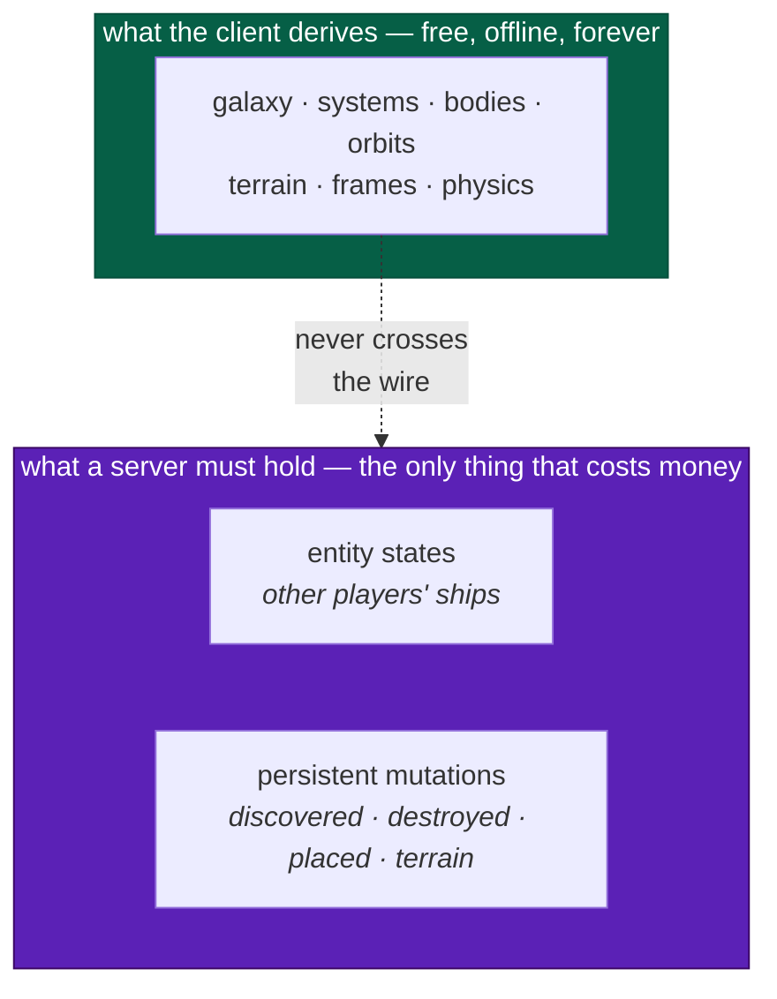
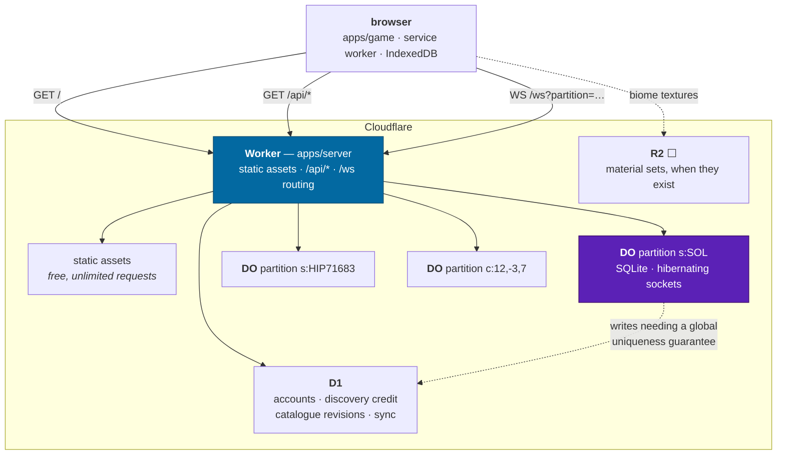

# Hosting

How InertialRef gets from a `dist/` directory to a URL, and what has to exist
behind that URL before the persistent universe is possible.

> This is a **plan**, not a description. Nothing on this page is built yet.
> [ADR-0008](adr/0008-multiplayer-partitions.md) is the decision it implements,
> [modes](design/modes.md) is what each tier owes the player, and
> [sustainability](design/sustainability.md#the-hosting-question) is who pays.

> **Legend** — ✅ done · 🟡 partial · ⬜ not started · ⛔ deliberately deferred

---

## The one idea

> **The server's job is small, and the architecture's job is to keep it small.**

Because the universe is a pure function of `(seed, catalogue version, address)`,
a server never has to store, serve or simulate the galaxy. It holds exactly what
a client cannot derive — **other entities and persistent mutations** — which is
the same set a 696-byte save file holds. That is
[ADR-0007](adr/0007-persistence.md) and [ADR-0008](adr/0008-multiplayer-partitions.md)
agreeing with each other, and it is the reason a non-commercial project can
credibly promise a persistent universe at all.

Every hosting decision below is downstream of that. Where a choice would let the
server grow a responsibility the client could have discharged itself, the choice
is wrong even when it is convenient.



---

## The topology

One Worker is the whole front door. It serves the client's static assets, it
answers `/api/*`, and it routes `/ws` to a Durable Object chosen by partition
key.



**Why one Worker and not three services.** Same origin means no CORS preflight
on every API call, no second hostname for the WebSocket, and no `SameSite`
gymnastics around whatever token identifies a player. Static asset requests are
free and unlimited and do not invoke the Worker at all, so the shared origin
costs nothing. The alternative — an `api.` subdomain — was considered and is
noted under [things that will bite](#things-that-will-bite), because it would
have sidestepped one real problem for free.

---

## What each Cloudflare primitive is for

| Primitive              | Holds                                                                         | Why this one and not another                                                                                                                                 |
| ---------------------- | ----------------------------------------------------------------------------- | ------------------------------------------------------------------------------------------------------------------------------------------------------------ |
| **Workers**            | The client bundle, the API, WebSocket upgrade routing                         | Static asset requests are free and never reach the script. One deploy, one origin, one artefact.                                                             |
| **Durable Objects**    | One authority per partition: connected players, live entity states, mutations | A DO is a single-threaded, addressable, consistent island with its own SQLite. That is precisely the shape of a star system under patched conics.            |
| **DO SQLite**          | Per-partition durable state, co-located with the authority                    | Transactional with the code that owns it. No network round trip. 10 GB per object, which is four orders of magnitude more than a partition will ever need.   |
| **D1**                 | Account-scoped and globally-unique data                                       | Cross-partition queries and global uniqueness — "who discovered this first" — need one writer for the whole galaxy, not one per system.                      |
| **R2** ⬜              | Biome material sets                                                           | The only real asset download the design admits ([modes](design/modes.md), 40–120 MB). Zero egress fees. Not needed until material sets exist.                |
| **Workers KV**         | ⛔ nothing                                                                    | The catalogue is 159 KB brotli and ships in the bundle ([spike 3](spikes.md#3--catalogue-bundle-size)). There is no eventually-consistent read tier to fill. |
| **Queues / Workflows** | ⛔ nothing yet                                                                | No asynchronous fan-out exists. Revisit if catalogue revision publishing becomes a batch job.                                                                |
| **Cloudflare Pages**   | ⛔ nothing                                                                    | Workers static assets is the same capability inside the Worker that already has to exist. Two deploy targets for one site is one too many.                   |

### Numbers, with their source

Every figure below was read from Cloudflare's documentation on **2026-08-20**.
They move; re-check before relying on one.

| Limit                                  | Value                                         |
| -------------------------------------- | --------------------------------------------- |
| Static asset files per Worker version  | 20,000 (Free) / 100,000 (Paid); 25 MiB each   |
| Static asset requests                  | **Free and unlimited**; no storage cost       |
| Worker script size                     | 3 MB gzip (Free) / 10 MB gzip (Paid)          |
| Worker CPU per invocation              | 10 ms (Free) / minutes, configurable (Paid)   |
| Worker memory per isolate              | 128 MB                                        |
| DO storage per object                  | 10 GB                                         |
| DO storage per account                 | 5 GB (Free) / unlimited (Paid)                |
| DO **objects** (instances) per account | **Unlimited**, within an account or a class   |
| DO **classes** (types) per account     | 100 (Free) / 500 (Paid)                       |
| DO CPU per request                     | 30 s default, configurable to 5 min           |
| DO soft request ceiling                | ~1,000 requests/second **per object**         |
| DO outgoing connections per request    | 6                                             |
| WebSocket message received             | 32 MiB max                                    |
| `serializeAttachment` per connection   | 16,384 bytes                                  |
| D1 free tier                           | 5M rows read/day, 100k rows written/day, 5 GB |

**The class/object row is the one people misread, so read it twice.** A
Durable Object _class_ is a type — a blueprint, declared once in
`wrangler.jsonc`. A Durable Object _object_ is a live instance of that class,
addressed by name. **This entire plan defines exactly one class**,
`PartitionAuthority`, and instantiates it once per partition key. Five hundred
players in five hundred different star systems is 500 _objects_ of 1 _class_,
and Cloudflare states plainly that the number of objects is "unlimited (within
an account or of a given class)". The 500 ceiling would only bind if the design
grew 500 distinct _kinds_ of authority, which would be a bizarre thing to want.

The bundle is **501.7 KB gzip** measured 2026-08-20, so the 3 MB script limit is
irrelevant — the bundle is an _asset_, not part of the script.

---

## Decisions

### H-1 · One Worker serves the client and the API

`apps/server` owns `wrangler.jsonc` and the Worker entry point, and points
`assets.directory` at `apps/game/dist`. `run_worker_first` sends `/api/*` and
`/ws` to the script; everything else is served as a static asset without
invoking it.

```jsonc
{
  "$schema": "./node_modules/wrangler/config-schema.json",
  "name": "inertialref",
  "main": "src/index.ts",
  "compatibility_date": "2026-08-20",
  "assets": {
    "directory": "../game/dist",
    "binding": "ASSETS",
    // The client is a single page; every unmatched path is index.html, not a 404.
    "not_found_handling": "single-page-application",
    // Everything else is served straight from the asset store, free and
    // without waking the script.
    "run_worker_first": ["/api/*", "/ws"],
  },
  "durable_objects": {
    "bindings": [{ "name": "PARTITION", "class_name": "PartitionAuthority" }],
  },
  "migrations": [{ "tag": "v1", "new_sqlite_classes": ["PartitionAuthority"] }],
  "d1_databases": [
    { "binding": "DB", "database_name": "inertialref", "database_id": "…" },
  ],
  "observability": { "enabled": true },
}
```

`run_worker_first` needs Wrangler ≥ 4.20.0. `new_sqlite_classes` — not
`new_classes` — is what makes the object SQLite-backed rather than key-value
backed; the key-value backend is not available on the Free plan and has no
reason to be used here.

### H-2 · A Durable Object per partition key, with hibernating sockets

The DO name is the string `partitionForAddress` / `partitionForPosition` already
returns. This is the binding [ADR-0008](adr/0008-multiplayer-partitions.md)
anticipated, and it is a one-line mapping precisely because the seam was built
first:

```ts
const stub = env.PARTITION.getByName(partitionKey) // "s:SOL", "c:12,-3,7"
```

**Hibernation is not an optimisation here, it is the cost model.** With
`ctx.acceptWebSocket()` instead of `ws.accept()`, Cloudflare keeps the client
sockets attached to its network while evicting the object from memory, and
**duration charges stop accruing**. That is the property
[sustainability](design/sustainability.md#the-hosting-question) already promised
in public, so it is a requirement rather than a tuning knob.

**Be precise about what it buys, though, because it is easy to overclaim.**
Cloudflare's documentation is explicit that "events such as alarms, incoming
requests, and scheduled callbacks prevent hibernation", and that an object is
evicted only after receiving no events "for a short period" — the threshold is
not published. A partition with players actively _flying_ in it is receiving
intent at 10–20 Hz and therefore **never hibernates**; it bills duration for
every wall-clock second they are there. What hibernation actually buys is:

| State                                   | Hibernating? | Duration cost |
| --------------------------------------- | ------------ | ------------- |
| Nobody in the partition                 | evicted      | none          |
| Connected but idle — alt-tabbed, docked | **yes**      | **none**      |
| Connected and flying, 20 Hz intent      | no           | full          |

**And duration is per object, not per player** — a partition with fifty people
in it bills the same wall-clock second as a partition with one. That single fact
is what makes [tall cheap and wide expensive](#tall-and-wide-500-concurrent-players-two-ways),
and it is why [H-6](#h-6--an-authority-streams-only-when-it-has-someone-to-replicate-to)
exists.

The first row is the one that carries the promise, and it is the common case:
most of the galaxy is empty at any moment. The second row is what makes a
half-attentive player free instead of expensive. The third is the real bill, and
it is priced in [cost model](#cost-model) rather than waved at.

Two consequences that shape the code:

- **No instance fields survive hibernation.** Per-connection state goes in
  `ws.serializeAttachment()` (16 KiB), everything else in `ctx.storage.sql`. A DO
  that keeps a `Map` of players in memory works perfectly in development and
  loses everyone the first time it sleeps.
- **Heartbeats must not wake it.** `ctx.setWebSocketAutoResponse(new
WebSocketRequestResponsePair("ping", "pong"))` answers keepalives in the
  runtime, and the docs are explicit that auto-responses accrue no wall-clock
  time and are not charged.

### H-3 · Two databases, and the rule for choosing

There is exactly one question, and it is not "which is faster":

> **Does this write need an ordering guarantee relative to one partition's
> simulation, or a uniqueness guarantee across the whole galaxy?**

| Data                                         | Where     | Because                                                                             |
| -------------------------------------------- | --------- | ----------------------------------------------------------------------------------- |
| Live entity states in a system               | DO SQLite | Ordered against that partition's tick; meaningless anywhere else                    |
| `placed` / `destroyed` / `terrain` mutations | DO SQLite | Scoped to an address inside one system; the authority that validates them owns them |
| Which players are connected                  | DO SQLite | Same                                                                                |
| **First-discovery claims**                   | **D1**    | "First in the galaxy" is a global uniqueness claim. One writer, one unique index.   |
| Accounts, tokens                             | D1        | Cross-partition by definition                                                       |
| Catalogue revisions                          | D1        | Read by every client, written by nobody at runtime                                  |
| Almanac / bookmark sync                      | D1        | Per player, not per place                                                           |

Discovery credit is the interesting one because it is tempting to put it in the
DO that witnessed it. It cannot live there: two players in two different systems
can claim the same address if the catalogue ever lets one system's contents be
referenced from another, and more importantly the _query_ — "show me everything
I discovered first" — spans every partition a player has ever visited. In D1 it
is `INSERT … ON CONFLICT DO NOTHING` against a unique index on the address, which
is a genuine atomic first-write-wins because D1 has a single primary.

If claim write rate ever outgrows D1's 50M rows/month, the escape hatch is a
sharded arbiter DO keyed by an address prefix, mirroring into D1 for reads. That
is a change of implementation behind the same API, which is why the API should be
`claimDiscovery(address)` and not `insertDiscoveryRow(...)`.

### H-4 · The vendor stays in `apps/`, and a new package holds the port

`packages/*` may not import a Cloudflare SDK, and `pnpm graph` now genuinely
enforces it by rejecting **any** third-party runtime dependency below `apps/`.
Nothing on this page changes that. The pattern is the one
[`packages/workers`](../packages/workers/src/transport.ts) already uses for Web
Workers, and the analogy is exact:

| Web Workers (built ✅)                                                         | Networking (to build ⬜)                               |
| ------------------------------------------------------------------------------ | ------------------------------------------------------ |
| `WorkerInbound` / `WorkerOutbound` in `protocol`                               | `ClientToServer` / `ServerToClient` in `protocol`      |
| `WorkerPort` — `post` / `subscribe` / `terminate`                              | `ChannelPort` — `post` / `subscribe` / `close`         |
| `WorkerPool` owns dispatch and cancellation                                    | `RemoteAuthority` owns the session and reconnect       |
| Browser passes a real `Worker`                                                 | Browser passes a real `WebSocket`                      |
| Node tests pass an in-process fake                                             | Node tests pass an in-process fake                     |
| `apps/game/src/engine/browserWorker.ts` is the only place `new Worker` appears | **one file** is the only place `new WebSocket` appears |

New package, mirroring the existing layout:

```
packages/net/          layer 5 — depends on shared, spatial, universe, simulation, protocol
  authority.ts         AuthorityPort: join, leave, submitIntent, onState
  local.ts             LocalAuthority — the single-player case, not a stub
  remote.ts            RemoteAuthority over a ChannelPort
  channel.ts           ChannelPort — the host boundary
```

Layer 5 is deliberate and slightly awkward: `net` cannot depend on
`persistence`, which is also layer 5, even though both encode entities. They do
not need to — the shared encoding is already in `protocol` (`encodeFrameState`,
`SaveEntity`), which sits at layer 4 under both. If you find yourself wanting
`net` to import `persistence`, the thing you actually want belongs in
`protocol`.

```ts
/* packages/net/src/authority.ts — sketch */
export interface AuthorityPort {
  /** Enter a partition. Resolves once the authority has accepted the client. */
  join(
    partition: PartitionKey,
    hello: ClientHello,
  ): Promise<Result<Joined, string>>
  leave(): void
  /** Control input and mutation proposals. Fire-and-forget; never awaited in the loop. */
  submit(intent: Intent): void
  /** Authoritative state for entities this client does not own. */
  subscribe(handler: (update: AuthorityUpdate) => void): () => void
}
```

`LocalAuthority` implements all four against the in-process `World` and is what
runs in [solo offline](design/modes.md#solo-offline) — **the normal case, not a
mock**. Offline-first is the requirement, so the local implementation is the one
that must never be allowed to rot.

### H-5 · The wire protocol is versioned, and the handshake refuses a mismatch

[modes](design/modes.md) states it as a design constraint: _all clients in a
partition must run the same catalogue version; it becomes a protocol handshake._
It is stronger than that. A client whose `GENERATION_VERSIONS` differ derives a
**different universe** — different planets, different terrain — so replicating a
position into it is meaningless.

The handshake therefore carries `seed`, `galaxy`, `GENERATION_VERSIONS` and a
`NET_PROTOCOL_VERSION`, and a mismatch is **refused with a reason**, not
best-effort accepted. This is the same rule the save loader already applies to a
newer schema ([ADR-0007](adr/0007-persistence.md)) and for the same reason:
silently proceeding loses data that looks like it was preserved.

Decoders go in `packages/protocol/src/net.ts`, built from the existing codec
combinators. The network is a trust boundary, so every inbound message is
decoded rather than cast — exactly as save files and worker messages already are.

---

## The seams that already exist

Worth stating plainly, because most of this plan is wiring rather than
invention:

| Seam                                                     | Status | Where                                           |
| -------------------------------------------------------- | ------ | ----------------------------------------------- |
| Partition keys as opaque strings                         | ✅     | `packages/universe/src/partition.ts`            |
| Authority follows the frame chain, not the address       | ✅     | `devtools/inspect.ts` (see the caveat below)    |
| Storage behind a port, with a memory implementation      | ✅     | `packages/persistence/src/store.ts`             |
| Host capabilities behind a port, with an in-process fake | ✅     | `packages/workers/src/transport.ts`             |
| Versioned, validated, decoded-not-cast wire schemas      | ✅     | `packages/protocol`                             |
| Replication set == save set                              | ✅     | `SaveGame.entities` + `SaveGame.mutations`      |
| No vendor SDK below `apps/`, mechanically enforced       | ✅     | `scripts/check-graph.mjs`                       |
| Session assembled in exactly one place                   | ✅     | `packages/devtools/src/session.ts`              |
| `AuthorityPort` + `LocalAuthority`                       | ⬜     | this plan                                       |
| Input log for prediction and replay                      | ⬜     | [roadmap](roadmap.md#replay-and-reconciliation) |

**One of those is a lie by coincidence and should be fixed first.**
[ADR-0008](adr/0008-multiplayer-partitions.md) already flags it: `inspect.ts`
computes the authority key by scanning the frame chain for an `s:` prefix
_itself_, rather than calling `partitionForAddress`. The two agree only because
the frame-id grammar and the partition-key grammar happen to be the same string.
That is one rename away from a bug in which the debug overlay and the router
disagree about which Durable Object owns a ship — and the overlay is the tool you
would use to diagnose it. Fix it before it becomes load-bearing.

---

## What has to be built

```
apps/server/                    ⬜ NEW — the only place Cloudflare appears
  wrangler.jsonc
  tsconfig.json                 the fourth typecheck project
  src/index.ts                  fetch handler: assets, /api/*, /ws upgrade
  src/partition.ts              class PartitionAuthority extends DurableObject
  src/api/                      discovery, catalogue, sync
  migrations/                   D1 schema, one file per change
  worker-configuration.d.ts     generated by `wrangler types`, committed

packages/net/                   ⬜ NEW — layer 5, no vendor import
packages/protocol/src/net.ts    ⬜ NEW — versioned net messages + decoders
apps/game/src/net/socket.ts     ⬜ NEW — the only `new WebSocket` in the client
apps/game/public/sw.js          🟡 EDIT — must stop caching /api (see below)
packages/devtools/src/session.ts 🟡 EDIT — accept an AuthorityPort, default LocalAuthority
packages/universe/src/partition.ts ✅ unchanged — this is the point
```

`apps/server` is an **app**, so it may depend on `wrangler`,
`@cloudflare/workers-types` and `cloudflare:workers`. `pnpm graph` reads
`packages/` only, which is correct and deliberate: the vendor is allowed at the
edge of the graph and nowhere else.

### Naming

`apps/server` over `apps/edge` or `apps/api`, because the repo names apps for
what they are — `game` is the browser client, `headless` is the Node runner —
and this one serves. It is also the name a self-hoster would expect, and
[sustainability](design/sustainability.md#the-hosting-question) commits to the
authority server being runnable by anyone.

---

## Things that will bite

Ordered by how expensive they are to discover late.

### The service worker will cache your API responses forever

`apps/game/public/sw.js` is cache-first for **every same-origin GET that is not
a navigation**. That policy is correct today and is correct for content-hashed
assets by construction. The moment `/api/discoveries` exists, the first response
is cached and served for the lifetime of the cache — and because the cache
survives reloads, this presents as "the API is stuck" with a perfectly healthy
server.

Fix it in the same change that adds the first endpoint, not after:

```js
// /api and /ws are live state, not content-addressed assets. Cache-first below
// would pin the first response forever, and the cache outlives a reload — which
// presents as a broken server rather than a broken cache.
if (url.pathname.startsWith('/api/') || url.pathname === '/ws') return
```

> An `api.` subdomain would have avoided this for free, since the handler
> already returns early for cross-origin requests. It was not chosen because
> CORS preflights, a second deploy target and a second hostname for the socket
> are a permanent cost, and this is a three-line one. Recorded here so the
> trade-off is visible rather than implied.

### `Date.now()` is doubly forbidden

It is already banned in canonical code by
[ADR-0006](adr/0006-simulation-clock.md) — generation derives from seeds and
simulation depends on the integer tick, and wall clock enters at exactly one
call, `clock.advance`. **In a Worker it is also not what you think it is.** From
Cloudflare's [security model](https://developers.cloudflare.com/workers/reference/security-model/):
_"the time value returned is not the current time. `Date.now()` returns the time
of the last I/O. It does not advance during code execution."_ That is a Spectre
mitigation, not a bug — a Worker is deliberately denied the ability to time its
own execution. Two reads with no `await` between them return the same value.

So a server-side authority cannot drive a tick from wall clock even if the rules
allowed it. It advances the same way the client does — from a fixed cadence — and
the cadence source is `ctx.storage.setAlarm()`.

### One alarm per simulation tick is not viable

The simulation runs at 64 Hz. An alarm per tick is 64 billable requests per
second per partition and is nowhere near that punctual anyway. The shape that
works, and the one the roadmap already anticipates:

| Rate      | Who         | What                                                        |
| --------- | ----------- | ----------------------------------------------------------- |
| 64 Hz     | client      | Full simulation, locally, exactly as it runs today          |
| 10–20 Hz  | client → DO | Batched intent: control input, not per-frame position       |
| 5–10 Hz   | DO → client | Authoritative snapshots of entities the client does not own |
| on demand | DO alarm    | Persistence flush, presence timeout, partition teardown     |

This is why [replay recording](roadmap.md#replay-and-reconciliation) is listed as
a multiplayer prerequisite: the input log `(tick, entityId, controlInput)` **is**
the intent stream, and building it is multiplayer work brought forward cheaply
rather than deferred.

### Incoming WebSocket messages are billed, outgoing ones are not

Cloudflare counts HTTP requests, RPC sessions, WebSocket messages and alarm
invocations as requests. Two details change the design:

- **There is no charge for outgoing WebSocket messages.** Broadcasting state to
  every connected client is free of request cost. Fan-out is cheap.
- **Incoming messages are billed at a 20:1 ratio** — 100 inbound messages bill as
  5 requests.

So the cost driver is client→server message _rate_, and the mitigation is
batching intent at a fixed cadence rather than sending on input change. At 20 Hz
inbound with 10 players in a partition, that is 200 messages/s → 10 billable
requests/s → ~26M billable requests/month for one continuously-busy system, which
is about $4/month of request cost. Duration is the number to watch instead, and
hibernation is what keeps it near zero.

### A Durable Object is single-threaded, with a soft ceiling around 1,000 req/s

Per object. A partition is a star system, and a star system with a thousand
requests per second is a design problem long before it is an infrastructure one.
Worth knowing because it is the number that decides whether "partition by star
system" survives contact with a popular system — and
[ADR-0008](adr/0008-multiplayer-partitions.md) is explicit that
`PARTITION_ENTRY_RADIUS` and the entry rule are **guesses to be validated against
real latency and real player density**, not decisions.

### A Durable Object lives in one place, and never moves

Cloudflare creates an object in a data centre near the **first** `get()` for that
name and states plainly that "Durable Objects do not currently change locations
after they are created". `locationHint` biases creation only, and is best-effort.

The consequence for a partition-per-star-system model is not obvious and is not
mentioned in [ADR-0008](adr/0008-multiplayer-partitions.md): **the first player
to enter Sol decides where Sol's authority lives, for everyone, forever.** A
player in Sydney joining a Sol object created in Frankfurt eats ~250 ms round
trip to the authority.

For what H4 builds, that is genuinely fine — ships do not collide, there is no
entity-to-entity physics, and a ghost 250 ms behind where it really is looks
exactly like a ghost. It stops being fine the moment anything is
[contested](design/combat.md), because then the same latency decides who shot
first.

Two things follow, and neither is work for today:

- The partition key may eventually need a **region component** (`s:SOL@apac`),
  which shards a busy system by locality and is a change to
  `partitionForAddress` — a package-level change, not an infrastructure one.
  Worth knowing before the key grammar hardens.
- It is another reason the relay-only posture in H4 is not merely a stopgap.
  A DO's pinned location is a poor foundation for authoritative combat
  arbitration, and the design has already decided the client knows everything
  anyway ([modes](design/modes.md)).

### Three tsconfig projects become four

`pnpm typecheck` runs three projects, one per real environment, and
[AGENTS.md](../AGENTS.md) explains why that is deliberate rather than accidental.
`apps/server` is a fourth environment — `@cloudflare/workers-types` plus the
generated `worker-configuration.d.ts`, no DOM, no Node. Add the project, add it
to the `typecheck` script, and update the table in AGENTS.md in the same change.

### Tests run in Node, on purpose, and DO tests cannot

`vitest.config.ts` registers no browser environment deliberately — that is the
check that the core stays free of DOM, React and WebGL. Durable Object tests need
`@cloudflare/vitest-pool-workers`, which runs inside workerd.

Do not change the existing project. Add a **second** Vitest project scoped to
`apps/server/**`, so `pnpm test` still proves the core is environment-free and
additionally proves the adapter works. `runInDurableObject` and
`runDurableObjectAlarm` let an alarm be triggered without waiting for one, which
is what makes hibernation and teardown testable at all. Note that the pool wants
`vitest@^4.1.0` and the repo pins `^4.0.5` — that is a bump, in its own commit.

### The dev loop is two servers, and that is the cheaper option

`@cloudflare/vite-plugin` runs the Worker inside Vite's dev server on real
workerd, which is genuinely nicer. It also takes over the client build — and the
current build is Vite 8 with the Oxc transform, `@rolldown/plugin-babel` running
the React Compiler preset, and Tailwind, which is tuned and load-bearing.

Start with `vite dev` proxying `/api` and `/ws` to `wrangler dev` on 8787. Revisit
the plugin once the two-process loop is annoying enough to be worth the build
risk, and revisit it as a _separate_ change so a build regression has one
suspect.

### Cross-origin isolation is a door that is currently open

`SharedArrayBuffer` is listed as unstarted in the
[roadmap](roadmap.md#performance-work) and needs COOP/COEP headers. A Worker can
set them, but `require-corp` breaks every cross-origin resource that does not
opt in — which would include R2-hosted material sets unless they carry
`Cross-Origin-Resource-Policy`. Nothing needs it yet; the note exists so the
requirement is discovered before the material sets are, not after.

---

## Milestones

Each one ends in something demonstrable. The point of the ordering is that
**every component is stood up and testable before any of them is load-bearing**,
which is the same discipline `partitionForPosition` already got: build the seam,
put it on the debug overlay, and look at it for a phase before trusting it.

| #      | Milestone                            | Ends when                                                                                                                                                                   |
| ------ | ------------------------------------ | --------------------------------------------------------------------------------------------------------------------------------------------------------------------------- |
| **H0** | Fix the coincidence                  | `inspect.ts` calls `partitionForAddress`; a renamed frame grammar breaks a test rather than production                                                                      |
| **H1** | The client is on a URL               | `apps/server` exists, serves `apps/game/dist`, SPA fallback works, service worker excludes `/api` and `/ws`, custom domain live, 12/12 capability checks pass in production |
| **H2** | The API exists and is empty          | `/api/version` returns seed, galaxy and `GENERATION_VERSIONS`; D1 bound with one migration; `wrangler types` output committed; fourth tsconfig project green                |
| **H3** | The port exists, still offline       | `packages/net` with `AuthorityPort` + `LocalAuthority`; `openSession` takes one and defaults to local; **no behavioural change**, proven by an unchanged `stateHash`        |
| **H4** | The socket exists, carrying presence | One DO per partition with hibernating sockets; two browser tabs in Sol see each other's ship; closing one drops presence within the timeout; state survives an eviction     |
| **H5** | The first real mutation              | A `discovered` claim written through the API, atomic in D1, visible to the other tab, and present in a save round trip                                                      |

H4 is the milestone the request actually asks for: everything stood up, nothing
load-bearing.

### The smoke test that proves all four components at once

Worth designing before the code, because it is what makes the whole thing a
capability check rather than a demo:

1. Tab A and tab B both `ir.goTo('SOL')`. Both report `authority: s:SOL` on the
   telemetry overlay. **Proves** partition routing agrees with the debug field.
2. Tab B's ship appears in tab A and moves. **Proves** the socket, the DO, the
   protocol and the replication set.
3. Close tab B. Presence drops in tab A within the timeout. **Proves** the alarm.
4. Leave both idle for longer than the hibernation threshold, then move. State is
   intact. **Proves** nothing important was living in an instance field.
5. `pnpm sim --connect wss://…` joins as a third client from Node. **Proves** the
   protocol has no browser dependency — the same claim `apps/headless` makes for
   the simulation core, made again for the network.

(5) is the one worth building deliberately. Node 26 has a global `WebSocket`, so
the headless runner can be the second player, which means a multiplayer
regression is reproducible in CI without a browser.

---

## Environments, deployment and secrets

| Concern        | Approach                                                                                                                       |
| -------------- | ------------------------------------------------------------------------------------------------------------------------------ |
| Environments   | Wrangler environments: `production` on the custom domain, `staging` on `*.workers.dev`. Separate D1 database per environment.  |
| Preview        | Workers version preview URLs per deployment — a reviewable URL per pull request without a second environment to maintain.      |
| CI             | Keep `.github/workflows/check.yml` exactly as it is. Deployment is a **separate** workflow gated on `check` passing.           |
| Deploy trigger | Push to `main`, plus `workflow_dispatch`. `wrangler deploy` with `CLOUDFLARE_API_TOKEN` as a repository secret.                |
| Migrations     | D1 migrations applied by the deploy job before the Worker rolls, so the schema is never behind the code.                       |
| Secrets        | `wrangler secret put`, never `vars`. Nothing in `wrangler.jsonc` may be a credential — it is committed.                        |
| Rollback       | `wrangler rollback`. DO SQLite migrations are not rolled back by it; write them additively.                                    |
| Observability  | `observability.enabled` for Workers Logs. The client already has structured logging in `packages/shared` — use the same shape. |

The repo has a remote (`git@github.com:jonjaques/inertialref.git`), so Workers
Builds — Cloudflare's own repo-connected CI — is also an option and would remove
the API token from GitHub entirely. `pnpm check` would have to run there too, and
it currently runs in GitHub Actions; keeping the gate where it is and giving
Cloudflare only the deploy step is the smaller change.

---

## Cost model

Restating [sustainability](design/sustainability.md#the-hosting-question) with the
2026-08-20 numbers attached.

| Mode                    | What runs                         | Monthly cost shape                                                                  |
| ----------------------- | --------------------------------- | ----------------------------------------------------------------------------------- |
| **Solo offline**        | Nothing. Assets only.             | **$0.** Static asset requests are free and unlimited.                               |
| **Solo online**         | Worker + D1                       | Workers Paid floor of $5. D1's free allowance (5M rows read/day) covers a long way. |
| **Persistent universe** | + one DO per _occupied_ partition | Scales with concurrency, not with galaxy size. An empty partition bills nothing.    |

The floor is the $5 Workers Paid plan and nothing else, and the free plan
(100,000 DO requests/day, 13,000 GB-s/day, SQLite-backed DOs included) is enough
to build and test all of H0–H5 without paying anything.

Two properties are worth protecting because they are what make the promise
credible:

- **No world state is stored or served.** Storage cost does not grow with the
  size of the galaxy or the number of places visited. It grows only with
  mutations, which are deliberate player acts.
- **Empty and idle are free.** Most of the galaxy is empty at any moment, and
  hibernation extends "free" to cover connected-but-not-flying. Neither covers
  connected-and-flying — see below.

Both are consequences of decisions already made, not of anything on this page.
The job here is to avoid spending them.

### What "busy" means, precisely

"Busy" was doing too much work in an earlier draft of this page. The billable
state has an exact definition and it is not "has players in it":

> A partition is **awake** for any wall-clock second in which it has received an
> event — a message, an alarm, a request — recently enough not to have been
> evicted. Duration bills per **awake object-second**, at 128 MB.

The consequence that changes every number below: **duration is charged per
object, not per player.** Cloudflare bills wall-clock time that is "shared
across all requests active on an Object at once". A partition with fifty players
in it costs exactly the same duration as a partition with one. Only _requests_
scale with players, and only inbound ones, at 20:1.

So the cost of a persistent universe is not driven by how many players are
online. It is driven by **how spread out they are.**

### Tall and wide: 500 concurrent players, two ways

Both scenarios below assume 500 players online continuously for a 30-day month —
which nobody ever is, so treat these as ceilings rather than forecasts — each
sending intent at 10 Hz. The only thing that differs is their distribution.

**Constants.** An always-awake partition costs
`2,592,000 s × 0.128 GB = 331,776 GB-s` per month, or **$4.15** at $12.50/M
GB-s. The Paid plan includes 400,000 GB-s, so the allowance covers roughly _one
and a fifth_ always-awake partitions.

#### Tall — all 500 in one system

| Component          | Working                                                      | Monthly  |
| ------------------ | ------------------------------------------------------------ | -------- |
| Awake objects      | 1                                                            |          |
| Duration           | 331,776 GB-s, inside the 400,000 allowance                   | **$0**   |
| Inbound requests   | 500 × 10 Hz = 5,000 msg/s ÷ 20 = 250 billable/s → 648M/month | ~$97     |
| Outbound broadcast | Not billed                                                   | $0       |
| **Total**          | **$0.19 per player per month**                               | **~$97** |

**This case is throughput-bound, not cost-bound.** 5,000 inbound messages/s is
five times the ~1,000 requests/second soft ceiling for a single object, and the
naive fan-out — every input echoed to every other player — is 2.5M outbound
messages/s, which is free to bill and impossible to execute. The levers are
aggregation (one snapshot per tick carrying every entity, not one message per
input) and interest management (replicate only what is near you). With both,
the honest expectation is **order 100–200 concurrent players in one partition**,
and that number wants measuring at H4, not modelling here.

#### Wide — 500 players in 500 different systems

| Component        | Working                                                        | Monthly     |
| ---------------- | -------------------------------------------------------------- | ----------- |
| Awake objects    | 500                                                            |             |
| Duration         | 500 × 331,776 = 165.9M GB-s, less the allowance, at $12.50/M   | **~$2,069** |
| Inbound requests | Identical total message rate — distribution does not change it | ~$97        |
| **Total**        | **$4.33 per player per month**                                 | **~$2,166** |

Same 500 players. **Twenty-two times the cost**, and every object is idling at
10 requests/second — 1% of what it could handle. Nothing is working hard; you
are simply paying rent on 500 mostly-empty rooms.

That is the real ceiling, and it is the one worth designing away.

### H-6 · An authority streams only when it has someone to replicate to

The wide case is expensive for a silly reason: **a solo player in an empty system
is paying for an authority that has nothing to tell them.** There is no second
client, so there is nothing to replicate — which is this page's
[one idea](#the-one-idea) applied to itself.

The rule that follows:

> A partition streams when it holds **two or more** players. With one, it tells
> the client so, the client falls back to `LocalAuthority`, and the object
> hibernates behind a 30-second heartbeat.

A solo occupant then costs about what an empty partition costs — roughly 550
GB-s and 4,300 billable requests per month, which rounds to zero — and the wide
scenario above collapses from $2,166 to inside the free allowance. Mutation
writes do not need the socket either; they are an HTTP `POST` to the API, which
is what makes the fallback complete rather than degraded.

Two things recommend this beyond the money. It needs no new infrastructure — the
heartbeat is the hibernation mechanism working as designed. And it means the
single-player path is exercised continuously in production by every player who
is alone, which is the surest way to keep `LocalAuthority` from rotting into a
stub. [Offline-first is the requirement](design/modes.md), so the local
implementation is the one that must always work.

### The realistic middle

Neither ceiling is a forecast. A plausible shape at 500 peak concurrent — 300
players alone in their own systems, 200 clustered into fifteen popular ones,
under H-6:

| Component                                | Monthly  |
| ---------------------------------------- | -------- |
| Duration — 15 awake objects              | ~$57     |
| Requests — only the 200 clustered stream | ~$39     |
| **Total, at sustained peak**             | **~$96** |

Real average concurrency is a fraction of peak, so the lived number is plausibly
$25–40/month for a 500-player peak. That is a donations-scale bill, and it stays
that way because of H-6 rather than by luck.

**What to instrument at H4**, since all six of these numbers are arithmetic
rather than measurement: awake object-seconds, inbound messages per player per
second, and the distribution of players across partitions. The third one is the
cost driver and it is the one nobody would think to log.

---

## Open questions

Named rather than answered, because guessing at them in a document is how a
guess becomes a citation.

| Question                                                                              | How it gets settled                                                                                               |
| ------------------------------------------------------------------------------------- | ----------------------------------------------------------------------------------------------------------------- |
| Is `PARTITION_ENTRY_RADIUS` (4e12 m) right?                                           | Measure at H4 with real latency and two real clients. ADR-0008 already calls it a guess.                          |
| What does handoff between partitions look like when a ship leaves Sol?                | The frame-transition machinery is the natural home; it already does the local equivalent.                         |
| Does a player need an account at all, or is a device-scoped token enough for the MVP? | H5. Discovery credit is the first thing that needs attributable identity.                                         |
| Where does the client's authoritative-vs-predicted split live?                        | Needs the input log first — [replay](roadmap.md#replay-and-reconciliation).                                       |
| Does the DO ever _simulate_, or only relay and persist?                               | **The load-bearing one.** H4 relays. Everything cheap about this plan depends on it staying that way — see below. |
| Does a busy system need a region-sharded partition key?                               | Only if contested gameplay arrives. Decide before the key grammar hardens.                                        |
| How many concurrent players actually fit in one partition?                            | Measure at H4. The arithmetic says 100–200 against a ~1,000 req/s ceiling, and arithmetic is not a measurement.   |
| What happens to a client whose `GENERATION_VERSIONS` are older than the partition's?  | Refused with a reason, per H-5 — but "what the player sees" is a UX question, not solved.                         |

### The one that decides whether any of this is cheap

Everything on this page is feasible at a hobby project's budget and a single
maintainer's time **because the server never simulates**. A relay that holds
entity states and arbitrates mutation writes is a well-understood, boring thing
that Cloudflare's primitives fit exactly. An authoritative simulation server with
client prediction, reconciliation, lag compensation and partition handoff of live
authority is a different project, with a different cost curve and a different
skill requirement.

The design has already decided in favour of the cheap one, and for a good reason
rather than a budgetary one: [modes](design/modes.md) observes that _the universe
is derivable, so a client knows everything anyway — there are no secrets to
protect. What must be authoritative is mutation writes._ That is a genuinely
coherent position, not a compromise, and it is what makes a Durable Object the
right tool instead of a load-bearing approximation of a game server.

**If that decision ever reverses, this document does not survive it.** Re-derive
the hosting plan from scratch at that point rather than extending this one.

---

## Related

- [ADR-0008](adr/0008-multiplayer-partitions.md) — the partition topology this implements
- [ADR-0007](adr/0007-persistence.md) — why the replication set and the save set are the same set
- [modes](design/modes.md) — what solo offline, solo online and the persistent universe each owe the player
- [sustainability](design/sustainability.md#the-hosting-question) — the promise this has to keep
- [roadmap](roadmap.md#multiplayer) — the engineering gap list, unchanged by this page
- [architecture](architecture.md) — the layering that keeps the vendor at the edge
