# The Astro Shell

A plan to make the document the product's shell: every page of prose rendered at
build time into real HTML, and the renderer an island that arrives behind it.

> **The inversion in one sentence.** Today the canvas is the floor and the words
> are chrome over it, so a reader waits for a WebGPU device to read a paragraph.
> After this, the words are the document and the canvas is a backdrop that fades
> in when it is ready — and a reader who never gets a GPU still gets the page.

Nothing about the simulation changes. `packages/*` is untouched, the engine is
untouched, and the twelve capabilities the README claims are the same twelve.
What changes is who owns `<html>`.

---

## Why this is worth building

Three things are true today and all three are downstream of one document
serving every path.

**A word of prose costs four round trips.** `not_found_handling` is
`single-page-application`, so `/docs/concepts/frames` is answered with
`index.html`; then the bundle; then the packed star catalog, which
[`main.tsx`](../../apps/game/src/main.tsx) awaits _before the first render_
because a world built without it is a different world; then `manifest.json`;
then `page/<asset>.json`. Five serial fetches before a sentence is on screen,
for a page whose HTML was rendered at build time and has been sitting in
`dist` the whole time.

**None of it is crawlable, and the repository already knows.**
[`site.ts`](../../apps/game/src/site.ts) carries a note saying the static head is
hand-kept because a scraper does not run JavaScript, and
[hosting](../hosting.md) § H-7 records the seam: per-route Open Graph needs
`HTMLRewriter`, which needs `run_worker_first` on `/*`, which turns a free asset
request into a billed invocation on every page load. `sitemap.xml` lists five
URLs for a site with nine hundred and five pages in it.

**Every visitor pays for every mode.** The bundle is 736.0 KB gzip
([hosting](../hosting.md), measured 2026-08-25). A reader who opens
`/docs/concepts/frames` downloads the cinema player, the catalog panel, the dock
and the flight strip to read about reference frames.

Prerendering fixes all three at once, and the third one only partly — which is
the honest half of this page and is stated at [what this costs](#what-this-costs).

| Question                              | Today                                         | After                   |
| ------------------------------------- | --------------------------------------------- | ----------------------- |
| First word of `/docs/concepts/frames` | document → bundle → catalog → manifest → page | **the document**        |
| What a crawler sees at that address   | the home page's static head                   | **the page**            |
| What a reader with no JavaScript sees | a `<noscript>` courtesy                       | **the page**            |
| Per-route Open Graph                  | a billed invocation per page load             | **free, at build time** |
| URLs in `sitemap.xml`                 | 5                                             | **905**                 |

---

## What survives unchanged

Listed first, because it is most of the repository and the plan is only
credible if the blast radius is small.

- **`packages/*`.** All twelve. No layer moves, no dependency is added, and
  `pnpm graph` says the same thing afterward.
- **The engine.** `GameEngine`, the presentation stack, the camera precedence
  in `#step`, the worker pool, `openSession`, the harness. Every invariant in
  [AGENTS.md](../../AGENTS.md) about the simulation holds without an edit.
- **The renderer.** `render/*` and `scene/*` are imported by an island instead
  of by a page. `three/webgpu` never reaches a server build, because the island
  is `client:only`.
- **The Worker.** `apps/server` keeps serving `../game/dist` as static assets.
  Output is `static`; there is no adapter and no on-demand rendering, so no
  navigation ever invokes the script. That is the same trade
  [hosting](../hosting.md) § H-7 already made, kept rather than reversed.
- **`scripts/docs/build.mjs`.** It still renders markdown through `marked`,
  listings through Shiki, and the reference from TypeDoc's serialized
  reflection tree. Only where it writes changes.
- **The toolchain.** Astro 7.2 depends on Vite `^8.0.13`; this repository is on
  Vite `^8.2.0`. The React Compiler pass, Tailwind v4, the `@/` alias, the
  source-map check and the git-lfs model check all move across as Vite
  configuration, because that is what they already are.

---

## The mechanism

### The inversion

```mermaid
flowchart TB
    subgraph NOW["today · one document, five fetches"]
        A1["index.html — the same one for every path"]
        A2["bundle · 736 KB gzip"]
        A3["catalog · awaited before first render"]
        A4["manifest.json → page/&lt;asset&gt;.json"]
        A5["first word"]
        A1 --> A2 --> A3 --> A4 --> A5
    end
    subgraph AFTER["after · the document is the page"]
        B1["/docs/concepts/frames.html — first word"]
        B2["site entry · log sink, analytics, service worker"]
        B3["backdrop island · catalog, engine, canvas, warm-up"]
        B4["backdrop fades in on first light"]
        B1 --> B2 --> B3 --> B4
    end
    style NOW fill:#7f1d1d,stroke:#450a0a,color:#fff
    style AFTER fill:#14532d,stroke:#052e16,color:#fff
```



The lower row is not faster because it does less work. It does the same work in
an order where nothing a reader wants is behind anything a GPU has to finish.

### Two islands, and why not one

`App.tsx` splits along the seam that already exists in it — the `<Canvas>` and
the `.hud-layer` are siblings today, and the file is eight hundred and sixty-five
lines because they share one component.

| Island                | Owns                                                                           | Directive             |
| --------------------- | ------------------------------------------------------------------------------ | --------------------- |
| `SceneBackdrop`       | the catalog, `GameEngine`, `<Canvas>`, `firstLight`, the warm-up, the watchdog | `client:only="react"` |
| the page's own chrome | whatever that page is — the docs rail, the planetarium, the player             | `client:only="react"` |

One island would defeat the point: the chrome cannot paint until the module that
imports `three/webgpu` has evaluated, which is the wait this plan exists to
remove. Two islands share exactly one piece of state — the engine — which moves
out of `App.tsx` into `engine/instance.ts` as a module singleton, the same shape
`engineStore.ts` and `keymapStore.ts` already have.

The providers do **not** duplicate. `KeymapProvider`, `TooltipProvider` and
`MotionConfig` live in the chrome island alone; the backdrop needs none of them,
and `input/keymapStore.ts` still owns the one window `keydown` because it is a
module rather than a context.

### The engine arrives late, and the chrome says so

`state/engineStore.ts` starts empty and is republished at 8 Hz once the sampler
runs. That is already the seam: chrome subscribes to the store, and renders its
engine-shaped parts when there is an engine. The pieces that take `engine` as a
prop — `devPanels`, the mode components — gate on it being non-null. Nothing new
is invented; the null case simply becomes reachable, which is what makes it worth
testing.

### The cover stops being a cover

`BootOverlay` is a full-viewport `z-50` layer today because there is nothing
underneath it worth showing. After the inversion there is: the page.

- **Content pages** (`/`, `/about`, `/docs/**`) have no cover. The backdrop's
  canvas starts at `opacity: 0` and transitions to 1 when `firstLight` reports
  `revealing`. A reader who never waits for it never knows it was late.
- **Interactive modes** (`/planetarium`, `/cinema/:scene`, `/play/:mode`) keep a
  cover, over the **mode's own box** rather than over the document. The IR menu,
  the mark and the way out are server HTML and stay live throughout — so a boot
  that wedges leaves a page somebody can leave, which the full-viewport cover
  does not.

`firstLight`'s state machine, the presentation watchdog and the remount ladder
are untouched. Only the element the phase is spent on changes.

### The stance is data the page supplies

Three places push a presentation stance keyed to the route today: the front
door's phase ramp on Earth, the reading room's per-wing framing, and the
planetarium's observatory. The first two are declarations, not behavior, and an
Astro page knows its own at build time:

```astro
<SceneBackdrop
  client:only="react"
  stance={wing.framing}
  transition:persist="scene"
/>
```

The invariant holds and gets narrower: the island is still the sole caller of
`engine.presentation.push`, and the page hands it a value. The planetarium keeps
pushing its own, because it drives the camera continuously and a continuous
thing is not a declaration.

`stanceForPath(pathname)` joins `modeForPath` as a pure function of the URL, for
the case the prop cannot cover — see [open questions](#open-questions).

---

## What Astro has to be told

Five settings, and every one of them exists to keep something that already works
working.

```js
// apps/game/astro.config.mjs
export default defineConfig({
  srcDir: './astro',
  build: { assets: 'assets' },
  server: { port: 5173 },
  integrations: [react()],
  vite: {/* the four plugins from vite.config.ts, minus react() */},
})
```

| Setting                   | Default  | Why not the default                                                                                                                                                                                                                             |
| ------------------------- | -------- | ----------------------------------------------------------------------------------------------------------------------------------------------------------------------------------------------------------------------------------------------- |
| `srcDir: './astro'`       | `./src`  | `apps/game/src/pages/` exists and means React page components. Astro would claim that directory and try to route twenty `.tsx` files. Moving Astro is one line; renaming the other is twenty files and every import of them.                    |
| `build.assets: 'assets'`  | `_astro` | `public/sw.js`'s `isImmutable` matches `/assets/`, and `requireSourceMaps` reads `dist/assets`. Both are content-hashed-therefore-immutable arguments that would silently stop applying.                                                        |
| `server.port: 5173`       | `4321`   | `scripts/drive.mjs`, `scripts/dev.mjs` and every page of the harness documentation name 5173. The port is cheaper to keep than the prose is to change.                                                                                          |
| `output: 'static'`        | `static` | Stated rather than assumed. It is the difference between a free asset request and a billed invocation on every navigation, and it is the whole reason no adapter is installed.                                                                  |
| `integrations: [react()]` | —        | `@astrojs/react` supplies the JSX transform. `@vitejs/plugin-react` must **not** also appear in `vite.plugins` or JSX is transformed twice; its `reactCompilerPreset` export is still imported, which is why the package stays a devDependency. |

`publicDir` and `outDir` are already right: `./public` and `./dist`, which is
what `apps/server/wrangler.jsonc` points at.

Everything else in `vite.config.ts` moves into `vite:` verbatim — `resolve.alias`
for `@/`, `define` for `__BUILD_ID__`, `worker.format: 'es'`, `build.sourcemap`,
`css.devSourcemap`, and `server.proxy` for `/api` and `/ws`.

---

## Implementation

Six phases. Each one leaves `pnpm check` green and is worth shipping on its own.

### 0 · Measure, and prove the island

The go/no-go, and the reason it is first is that two of this plan's claims are
numbers nobody here has read yet.

**Measure what a boot costs**, because Phase 4 pays it on every navigation until
Phase 5 stops paying it:

```
pnpm drive --url http://localhost:5173/planetarium --js 'performance.now()' --cast 120
node scripts/traceFrames.mjs <trace>
```

Take it twice — cold cache and warm — because the warm number is the one a
second navigation actually pays.

**Measure first paint** on `/docs/concepts/frames` today, so the claim at the
top of this page is a measurement rather than an argument.

**Prove the island**, in a throwaway Astro project with `three/webgpu` behind
`client:only="react"`: that a WebGPU canvas mounts, that `transition:persist`
carries it across a `<ClientRouter />` navigation without a remount, and that
props re-flow to a persisted `client:only` island. The third is the one Phase 5
depends on and the one this plan is least certain of.

> **The threshold.** If a warm boot is under a second, Phase 4 ships on its own
> and Phase 5 is an improvement. If it is over three, Phases 4 and 5 land
> together or not at all.

### 1 · Astro owns the document, and nothing else changes

One page — `astro/pages/[...slug].astro` — rendering exactly what `index.html`
renders: the locked viewport, `class="dark"`, the JSON-LD, and `<div id="root">`
with the current `App` mounted into it as a single `client:only` island.

Nothing about the application changes. This phase is entirely about the
toolchain, which is where the unknowns are, and it isolates them:

- Tailwind v4 through `@tailwindcss/vite`, with `src/index.css` imported from
  the layout's frontmatter.
- The React Compiler pass. `hud/PerfPanel.tsx` carries `'use no memo'` and reads
  mutable state — it is the component that proves the pass ran and respected the
  opt-out.
- `requireRealModels` and `requireSourceMaps`. Astro runs two Vite builds; the
  first already guards on the directory existing, and the second runs its
  `buildStart` twice harmlessly.
- `build.sourcemap.test.ts`, `net/serviceWorker.test.ts` and the whole vitest
  suite, unchanged.
- `import.meta.glob` over `data/models`, `data/shapes` and `data/textures`, and
  `new Worker(new URL('../workers/universe.worker.ts', import.meta.url))` — all
  client-graph only, all still Vite's.

**Done when** `pnpm build` produces a `dist` the existing Worker serves
identically, and `pnpm drive` finds the same page at the same port.

### 2 · The backdrop inverts

Split `App.tsx`. `SceneBackdrop` takes the canvas, the engine, `firstLight`, the
warm-up and the watchdog; the remainder stays the chrome island. `engineInstance`
moves to `engine/instance.ts`.

Then the head goes server-side. `astro/layouts/Base.astro` reads
`pageMetaFor(Astro.url.pathname)` and writes `<title>`, the description, the
canonical link **and the Open Graph and Twitter sets** — per route, at build
time, for nothing.

Three things delete in this phase:

- `pages/DocumentMeta.tsx`, in full. The head is server-rendered and the page
  view fires once per document from the site entry script.
- `index.html`'s hand-kept social head, and the note in `site.ts` explaining why
  it has to be hand-kept.
- The seam in [hosting](../hosting.md) § H-7. Per-route cards arrive without the
  Worker running on a navigation, which is the objection that deferred them.

**The invariant gets stronger.** "Never change what the site says about itself in
only one place" currently names two places and asks you to keep them in step;
after this there is one, and `site.test.ts` asserts against every emitted page.

### 3 · The reading room becomes nine hundred and five documents

`scripts/docs/build.mjs` keeps every decision in it and changes where it writes.
Page bodies and the manifest go to `apps/game/.doc-content/` — a build input, not
a public asset — and an Astro content collection loads them:

```
astro/content.config.ts        a loader over .doc-content/
astro/pages/docs/[...route].astro   getStaticPaths over the manifest
```

The search index stays in `public/doc-content/search.json` and stays a runtime
fetch, because it is half a megabyte for the readers who type and nobody else.

What deletes: `loadManifest`, `loadPage`, the page cache, `useManifest`,
`usePage`, and `fetchJson`'s content-type test for the SPA fallback — that last
one only exists because a missing JSON file came back as `index.html` with a 200,
and there is no SPA fallback to lie about it any more. `DocsMissingError` stays,
moved to build time, where "this build carries no documentation" becomes a build
failure instead of a sentence on a page.

What stays a client island: `DocsSearch`, the rail's drawer toggle, `DocsHorizon`
(the live readout beside the scene), and `mermaid.ts` — still a lazy import on
the twenty pages with a diagram, still with the source as the initial state.

**Done when** `curl -s https://…/docs/concepts/frames | grep -c '<h2'` is
non-zero, and `sitemap.xml` lists every page the wing table publishes.

### 4 · The modes become pages

`/`, `/about`, `/planetarium`, `/cinema`, `/cinema/:scene`, `/play/:mode` each
become an Astro page. The front door's poster is `.astro` — type, figures,
`<a>` elements — with the scene supplied as a stance rather than by a
`useEffect`. The three interactive modes stay islands and change almost nothing.

**react-router goes.** With document navigation there is no background location,
so the machinery built to keep a mode mounted under a dialog has nothing to
keep: `overlayState`, `overlayBackground` and `resolvedLocation` delete, and with
them the invariant "never read the raw pathname when a dialog could be open over
a mode". The path constants and the pure functions in `pages/paths.ts` stay,
because they are the valuable half and they never needed a router.

The dialogs keep both halves of ADR-0011's promise, by being two things:

| Arrival                     | What renders                                             |
| --------------------------- | -------------------------------------------------------- |
| Cold, at `/settings/camera` | an Astro page — the dialog over the menu, as today       |
| Warm, from a mode           | the chrome island's own dialog, with `history.pushState` |

That is a ~40-line store over `history` — zustand is already a dependency — in
place of a router, `AnimatePresence` keyed on `overlaySurface` exactly as now.

**Two hosting settings change with it.** `not_found_handling` becomes
`404-page`, and `astro/pages/404.astro` renders the menu: ADR-0011 is explicit
that a typed URL is a normal event and the menu is the answer to "where am I",
and this keeps that answer while returning the status code that is true.
`public/sw.js`'s `PRECACHE` gains the four mode documents — see
[what this costs](#what-this-costs).

### 5 · The engine survives a navigation again

`<ClientRouter />` in the base layout, and `transition:persist` on the backdrop
island. The canvas is not remounted, the renderer is not rebuilt, the warm-up is
not re-paid, and the world keeps its state hash across a click from the
planetarium to the docs — which is the property ADR-0011 built the persistent
shell for, restored on Astro's terms.

Three details this phase has to get right, in the order they will bite:

1. **Every page must render the same island in the same layout.** A page missing
   it is a page that tears the engine down.
2. **The stance re-flows on `astro:page-load`**, and the previous page's stance
   is released on `astro:before-swap`. That is the push/release pair the
   invariant asks for, moved from a React lifecycle to Astro's.
3. **The site entry script must not run twice.** `logHub.addSink`, `startAnalytics`
   and the service worker registration are process-wide side effects, and a
   client-side navigation is not a new process. They belong in a module the
   router evaluates once, not in an inline script the layout re-emits.

---

## What this costs

### Offline coverage narrows, and it is a real narrowing

`public/sw.js` precaches `/` and `/index.html`, which today is every path,
because every path is that document. After Phase 4 it is one path.

The fix that is tempting and wrong is a generated precache manifest. `sw.js`'s
own header states why it is hand-written — "no build-manifest dependency to go
stale", and being readable matters more than being configurable — and a
nine-hundred-entry manifest is a repudiation of both.

So the precache becomes the four mode documents by hand:

```js
const PRECACHE = [
  '/',
  '/planetarium',
  '/cinema',
  '/docs',
  '/favicon.svg',
  '/manifest.webmanifest',
]
```

**What that preserves:** the game offline, completely. The universe is a pure
function of a seed, the catalog is content-hashed under `/assets/`, and an
installed copy still needs nothing from the network.

**What it does not:** a documentation page nobody has opened. Today an unvisited
page offline gives the reading room and an error inside it; after, it gives the
browser's offline page. Visited pages are unaffected — they were
stale-while-revalidate before and they are stale-while-revalidate now.

### A navigation between modes rebuilds the renderer

Until Phase 5, and this is the cost the user requirement explicitly accepts.
Phase 0 measures it. It is paid on a click between modes and never inside one,
and the boot is progressive rather than behind a cover, so what it looks like is
a backdrop arriving late rather than a page that is not there.

### The bundle does not get smaller by much

Worth saying plainly, because it is the win people assume and it is not the one
on offer. `three/webgpu` and the engine are the bundle, and both stay. What
leaves a docs reader's download is the mode chrome — the catalog panel, the
player, the dock, the flight strip — which is app code, not library code.

**The measurement that matters is time to first word, not bytes.** A document
that renders its own prose has no critical path through the catalog at all.

### `.astro` files are not in the vitest suite

The same boundary ADR-0011 already draws for the mode routes, extended: the
testable surface stays in `.ts` — `pageMetaFor`, `modeForPath`, `stanceForPath`,
the docs route mapping, the overlay store — and `.astro` files stay thin enough
that there is nothing in them to assert. Astro's container API exists and is not
worth the second test runner for what would be covered.

---

## The invariants that change

`AGENTS.md` is canonical and four of its rules are about the shape this plan
changes. Each needs an edit and a matching one in `.claude/rules/`.

| Invariant                                                      | After                                                                                                                   |
| -------------------------------------------------------------- | ----------------------------------------------------------------------------------------------------------------------- |
| Never put the `<Canvas>` inside a route                        | Never put the `<Canvas>` in more than one island. `SceneBackdrop` owns it; no page constructs one.                      |
| Never hold the current mode in React state                     | Unchanged in force, narrower in scope: a page knows its mode at build time, and `modeForPath` serves the island.        |
| Never read the raw pathname when a dialog could be open        | **Retires.** There is no background location, because the background is the document.                                   |
| Never change what the site says about itself in only one place | **Strengthens.** `site.ts` is the only place; `index.html`'s copy is gone and `site.test.ts` checks every emitted page. |

This is an [ADR](../adr/README.md), not a note in a plan: it amends ADR-0011 on
where the shell lives and ADR-0016 on how documentation reaches a reader, and
neither is wrong — both are decisions taken when one document served every path.

---

## Open questions

**Do props re-flow to a persisted `client:only` island?** Astro documents
`transition:persist` as retaining state while allowing a re-render with new
props, and `transition:persist-props` as the opt-out. Whether that holds for
`client:only`, which never rendered on the server, is Phase 0's third
experiment. If it does not, the fallback is `astro:page-load` plus
`stanceForPath(location.pathname)` — a pure function of the URL, which is what
this codebase reaches for anyway.

**Where does `sitemap.xml` come from?** `scripts/brand/build.mjs` writes it
today and `pnpm brand:check` guards it. `@astrojs/sitemap` knows every emitted
page by construction, which is exactly what nine hundred pages needs, and it
means `brand` stops owning a file it has no way to be right about. The cost is a
guard moving from `brand:check` to the build.

**Does the front door keep its ramp?** The phase ramp is a
`requestAnimationFrame` loop pushing `observatory.setPhase` — behavior, not a
declaration, so the stance prop does not cover it. Either the front door keeps a
small island for the ramp alone, or the ramp moves into the backdrop keyed on the
stance carrying a rate. The second is tidier and makes the stance a richer type;
the first is smaller.

**Is `/keys` still a dialog?** It reads the live keymap, so it cannot be
prerendered as prose — the whole point of `useActionTitle` is that no key name
is ever a literal. A prerendered `/keys` would be a page whose table arrives
with the island. That is acceptable and worth stating rather than discovering.

---

## Alternatives

**A separate Astro site beside the application.** Docs at `/docs` on another
origin, the game where it is. Cheapest, and it is the alternative ADR-0016
rejected for a reason that has not changed: the masthead cannot be the engine if
the engine is in the application next door, and it splits the URL surface
ADR-0011 spent its argument on. This plan keeps both by making the engine an
island rather than the site.

**Server-side rendering with `@astrojs/cloudflare`.** Real SSR, per-request. It
buys nothing here — every page's content is known at build time — and costs a
billed invocation on every navigation, which is the trade
[hosting](../hosting.md) declines twice. Revisit only if a page ever depends on
who is asking.

**Keep the SPA and prerender only `/docs`.** Two shells, two heads, two service
worker strategies, and a reader crossing from a document into the planetarium
leaves one application for another. It is the "two sites wearing one palette"
outcome ADR-0016 already rejected, reached from the other direction.

**Vite SSG plugins, or `vite-plugin-ssr`.** Keeps one build and one config, and
the React shell has to render on the server — which means `three/webgpu`,
`navigator.gpu` and a WebGPU canvas in a Node build graph, guarded by hand at
every import. Astro's `client:only` is that guard, declared once per island by
the framework.

---

## Sequencing

| Phase                      | Ships                                     | Depends on | Reversible                     |
| -------------------------- | ----------------------------------------- | ---------- | ------------------------------ |
| 0 · Measure and prove      | three numbers and a throwaway project     | —          | nothing to revert              |
| 1 · Astro owns `<html>`    | identical `dist`, new toolchain           | 0          | revert one commit              |
| 2 · The backdrop inverts   | content-first paint, per-route Open Graph | 1          | yes, `App.tsx` recombines      |
| 3 · The reading room       | 905 real documents, 4 fetches removed     | 1          | yes, independent of 2          |
| 4 · The modes become pages | react-router removed, `404.astro`         | 2          | costly — the overlay store     |
| 5 · Seamless navigation    | the engine survives a click               | 4          | yes, remove `<ClientRouter />` |

Phases 2 and 3 are independent of each other and can run in parallel worktrees.
Phase 4 is the one to land alone, because it is the one that changes what a URL
does.

---

## References

- [Astro configuration reference](https://docs.astro.build/en/reference/configuration-reference/) — `srcDir`, `build.assets`, `vite`
- [Client directives](https://docs.astro.build/en/reference/directives/client/) — `client:only`, and why it is the guard
- [View transitions](https://docs.astro.build/en/guides/view-transitions/) — `<ClientRouter />`, `transition:persist`, `transition:persist-props`
- [Content collections](https://docs.astro.build/en/guides/content-collections/) — the loader Phase 3 writes

## Related

- [ADR-0011](../adr/0011-application-shell-and-modes.md) — the shell this amends
- [ADR-0016](../adr/0016-documentation-as-a-mode.md) — the reading room, and the SSR line it defers
- [Hosting](../hosting.md) — H-7, the static head, and the invocation this avoids
- [Client](../guides/client.md) — the shell as it stands
- [Headless WebGPU](headless-webgpu.md) — the other plan, and unaffected by this one
