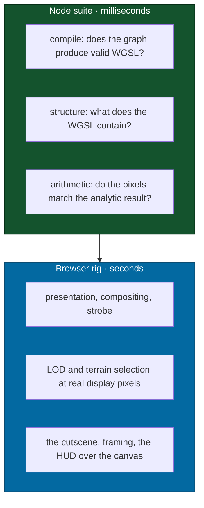

# Headless WebGPU

A plan to compile and run this project's shaders on the real GPU from the Node
test suite, in milliseconds, without a browser.

> **The premise this replaces is measured, not argued.**
> [`docs/guides/testing.md`](../guides/testing.md) and
> [`.claude/rules/rendering.md`](../../.claude/rules/rendering.md) both state
> that a TSL node graph cannot be evaluated in Node. It can. Chrome's own WebGPU
> implementation ships as a Node addon, and on this machine it reports
> `vendor: apple`, `architecture: metal-3`, `device: apple-m5` — the physical
> GPU, from a process with no window.

Measured on an Apple M5 (10-core GPU), macOS 26.6.2 (build 25G83), Node 26.5.0,
`three` r182, vitest 4.1.10, `webgpu` 0.6.0. Every figure below is from that
machine; the ones that would move on another are called out where they appear.

---

## Why this is worth building

Shader work is the one part of this codebase with no fast feedback. Everything
else answers in a Node test in milliseconds; a change to a TSL graph is answered
by [`scripts/drive.mjs`](../../scripts/drive.mjs), which pays about **6 s** to
boot Chrome and the dev server before it can show anything.

| Question                           | Browser rig          | This                 |
| ---------------------------------- | -------------------- | -------------------- |
| Does this material still compile?  | 6 s cold, 80 ms warm | **24–37 ms**         |
| What WGSL does this graph emit?    | not available        | **5 ms**             |
| Is this shader's arithmetic right? | eyeball a screenshot | **4–7 ms**, asserted |

A whole vitest file — four GPU tests, including compiling a production material
to a Metal pipeline — runs in **136 ms**. A standalone Node process that boots
Dawn, builds a renderer, renders a TSL graph and reads the pixels back completes
in **0.06 s** wall clock.



The layers are ordered, not alternative. The fast one answers whether a graph is
**valid and correct**; the browser answers whether a frame is **right**.

---

## What survives unchanged

Two rules currently sit on the false premise and only one of them depends on it.

- **"Do not write a scalar mirror of a shader and test that instead" stands, and
  matters more now.** The terrain-normals test asserted normals were unit
  length, which a radial normal also is, so it passed on both sides of the fix.
  A mirror is still a second thing to keep true. The remedy this plan offers is
  to test the graph itself rather than to loosen that rule.
- **"A headless GPU check is not a real one" stands.** One renderer failure
  reproduces only at `devicePixelRatio` 2, and terrain selection is measured in
  display pixels. Nothing here observes presentation. Rendering work still ends
  at the browser procedure in [Driving](../agents/driving.md).

What changes is only the sentence claiming the evaluation is impossible.

---

## The mechanism

`webgpu` on npm is Dawn — the same implementation Chrome ships — built as a Node
native addon. It provides `navigator.gpu` and nothing else about the web
platform, which is exactly the part Three's WebGPU backend needs.

Three things stand between that and a working `WebGPURenderer`, and none is
guessable from the error it produces.

1. **`navigator` is a read-only global from Node 21 on.** The
   `globalThis.navigator = { gpu }` line that every WebGPU-in-Node example
   prints throws `TypeError: Cannot set property navigator`. Define the property
   onto the existing object instead.
2. **Three binds its animation loop to `self` in the renderer constructor and
   starts it inside `init()`.** Without a `self` carrying
   `requestAnimationFrame`, `init()` dies reading `requestAnimationFrame` of
   `null` — an error about an animation loop, thrown by a call that is
   allocating a device. Both globals must exist _before_ `three/webgpu` is
   imported, which is what makes the setup file load-bearing rather than tidy.
3. **The constructor reaches for `document.createElementNS` unless it is handed
   a canvas.** A stub satisfies it. Its `getContext('webgpu')` needs `configure`
   and `unconfigure`; `getCurrentTexture` should **throw**, because every test
   renders to a `RenderTarget` and a test that forgets `setRenderTarget` must
   fail loudly rather than draw into a plausible-looking dummy.

---

## Implementation

### 1 · The dependency

```bash
pnpm --filter @inertialref/game add -D webgpu@0.6.0
```

`apps/game` rather than the root, because that is where `three` resolves from.
`packages/*` cannot take it — [`scripts/check-graph.mjs`](../../scripts/check-graph.mjs)
enforces that the core carries no third-party dependency at all — and it does
not need to: `packages/rendering` is arithmetic and imports no Three.js.

**It costs 91 MB in `node_modules`.** The package ships prebuilt binaries for
all five platforms it supports and prunes none of them; `darwin-universal` alone
is 20 MB. That is the single largest objection to this plan and the reason the
suite it enables is opt-in rather than part of `pnpm test`.

### 2 · The harness

`apps/game/src/render/gpuHarness.ts` — the globals, the canvas stub, and one
function that hands back a renderer. Imported only by `*.gpu.test.ts`, so it is
tree-shaken out of the client bundle.

```ts
/**
 * A `WebGPURenderer` on the real GPU, in Node.
 *
 * The globals live in a vitest setup file rather than here, because
 * `three/webgpu` reads `self` at import time and a function cannot run
 * before its own module's imports.
 */
export async function openGpu(width = 64, height = 64) {
  const renderer = new WebGPURenderer({
    antialias: false,
    canvas: canvasStub(width, height),
  })
  renderer.setSize(width, height, false)
  await renderer.init()
  // There is no `forceWebGPU` parameter: the renderer takes WebGPU when
  // `navigator.gpu` answers and WebGL 2 when it does not, so the fallback is
  // what the setup file not having run looks like. Name it here rather than
  // let it fail later on the `document` this process does not have.
  if (!renderer.backend.isWebGPUBackend) throw new Error('WebGL fallback')
  // Nothing here waits for a frame; every frame is an explicit `render()`.
  // A test that waits for a rAF tick is a test that hangs.
  renderer.setAnimationLoop(null)
  return renderer
}
```

The file adds five verbs over that — `compile`, `shader`, `drawGraph`, `draw`,
`compute`/`readBuffer` — and owns four traps the sketch above does not show:
the 256-byte row padding on a pixel readback, the validation scope that turns
a refused shader module into a rejection, the index guard a compute kernel
needs against its rounded-up dispatch, and the filter a stand-in texture needs
to compile the same program as the map it replaces. Each is stated where it
bites, in [testing](../guides/testing.md) § "Shader behavior runs on the real
GPU".

### 3 · The setup file

`apps/game/src/render/gpuSetup.ts`, carrying the three globals from
[The mechanism](#the-mechanism) and the comments explaining why each exists.

### 4 · A second vitest project

`apps/game/vitest.gpu.config.ts`. Separate from the root config, because
[`vitest.config.ts`](../../vitest.config.ts) states in its own header that
nothing registers a browser environment on purpose, and that every test runs in
plain Node. This suite does not violate that — it registers no browser — but it
does require a GPU, which is a different portability claim and belongs behind a
different command.

```ts
export default defineConfig({
  test: {
    environment: 'node',
    include: ['apps/game/src/**/*.gpu.test.ts'],
    setupFiles: ['apps/game/src/render/gpuSetup.ts'],
    // Dawn is a native addon; `forks` keeps it out of worker threads.
    pool: 'forks',
  },
})
```

The root config needs the matching exclusion, or `pnpm test` picks these up
through `apps/*/src/**/*.test.ts` and fails on a machine with no GPU:

```ts
exclude: [...configDefaults.exclude, '**/*.gpu.test.ts'],
```

### 5 · The script

```json
"test:gpu": "vitest run --config apps/game/vitest.gpu.config.ts"
```

**Not added to `pnpm check`.** The gate runs on every stop and in CI, and
coupling it to the presence of a GPU trades a fast, portable gate for a slow,
machine-dependent one. `test:gpu` runs on demand during shader work, and in the
CI lane described under [Open questions](#open-questions) once that is settled.

### 6 · The tests worth writing first

| File                    | Assertion                                                       | Catches                                    |
| ----------------------- | --------------------------------------------------------------- | ------------------------------------------ |
| `materials.gpu.test.ts` | every production material compiles to a pipeline                | a graph that emits WGSL Tint rejects       |
| `materials.gpu.test.ts` | the WGSL binds exactly two `texture_2d`                         | an atmosphere that stops sampling its LUTs |
| `warmup.gpu.test.ts`    | the pipeline `warmCompile` builds is the one a frame draws with | the gap named in `warmup.test.ts`          |
| `terrain.gpu.test.ts`   | a patch mesh supplies every attribute its material reads        | `terrainMorph` missing from the geometry   |

The last row is not hypothetical. A probe that paired the terrain material with
a plain `SphereGeometry` reported
`THREE.AttributeNode: Vertex attribute "terrainMorph" not found on geometry`
before rendering a single pixel.

Two facilities make these assertions possible:

- **`renderer.debug.getShaderAsync(scene, camera, mesh)`** returns the generated
  WGSL. The atmosphere fragment shader is 5,731 characters and declares two
  `texture_2d<f32>` bindings.
- **`renderer.readRenderTargetPixelsAsync(rt, x, y, w, h)`** returns the drawn
  pixels, so a graph can be compared against an analytic expectation.

### 7 · The documentation that becomes wrong

Landing this makes four passages false. All four are corrections to a present
claim, not history, so they are rewritten in place rather than annotated.

| File                                                             | What changes                                                                                                                 |
| ---------------------------------------------------------------- | ---------------------------------------------------------------------------------------------------------------------------- |
| [`docs/guides/testing.md`](../guides/testing.md)                 | § "Shader behavior needs a real GPU" — the graph is evaluable; the scalar-mirror ban and the `devicePixelRatio` 2 limit stay |
| [`docs/guides/testing.md`](../guides/testing.md)                 | § "What is not covered yet" — the "Shader behavior in the Node suite" row                                                    |
| [`.claude/rules/rendering.md`](../../.claude/rules/rendering.md) | the bullet asserting a TSL graph cannot be evaluated in Node                                                                 |
| [`scripts/drive.mjs`](../../scripts/drive.mjs)                   | the header's software-adapter claim — see below                                                                              |

---

## A second correction: headless Chrome holds the GPU

[`scripts/drive.mjs`](../../scripts/drive.mjs) gives four reasons it launches a
real window, and the fourth is that "headless macOS Chrome falls back to a
software WebGPU adapter." Measured across three launches against a page served
over `http://localhost`:

| Launch                        | Adapter             |
| ----------------------------- | ------------------- |
| `--headless=new`              | `apple` / `metal-3` |
| `--headless=new --enable-gpu` | `apple` / `metal-3` |
| windowed                      | `apple` / `metal-3` |

SwiftShader has no macOS support, so Chrome keeps the physical GPU with or
without a window. **Only adapter identity is measured here** — not presentation,
occlusion, rAF scheduling under `--headless`, or frame timing, and the other
three reasons in that header are untouched and still hold. The correction is to
the stated reason, not to the decision: a real window remains right, because
`--cast` records what a compositor presents and a headless one presents nothing.

Recording it matters because the claim reads as a reason not to try, and it is
the kind of sentence that decides an approach without being re-measured.

> `navigator.gpu` is `undefined` on `about:blank` and on `data:` URLs —
> `isSecureContext` is false for both. A WebGPU probe has to be served from
> `localhost` or a real origin, or it reports an absent API rather than a
> missing GPU.

---

## Precision, and what a bound here means

An `RGBA8` render target quantizes to 1/255, which is the floor on any assertion
made against read-back pixels. Two measurements, both against `Math.sin` on the
same inputs:

| Path                                  | Max absolute error | Bounded by                 |
| ------------------------------------- | ------------------ | -------------------------- |
| Compute shader → storage buffer (f32) | 1.88e-4            | f32 `sin` on Metal         |
| TSL graph → `RGBA8` target → pixels   | 1.16e-3            | the target's 1/255 quantum |

**Name the limit in the assertion.** A bound of 1.16e-3 written against the
render path is a statement about the render target, not about the shader; a
numeric claim about the arithmetic wants a float target, where the honest bound
is the f32 one. This is the same trap as a bound derived from arithmetic rather
than measured — the derived figure describes a floor, and the defect lives above
it.

---

## Sequencing

Each step is independently useful and independently revertible.

1. **Harness and one test.** `materials.gpu.test.ts` compiling one material.
   Proves the dependency and the config on this machine.
2. **The compile smoke test across every production material.** The cheapest
   real coverage: it is a loop, and it catches the whole class of graph errors
   that currently reach a browser.
3. **The documentation corrections.** Once the suite exists, the four passages
   above describe a system that no longer matches them.
4. **WGSL structural assertions**, where a graph has a property worth stating.
5. **Pixel assertions against analytic results**, on a float target, for the
   graphs that are mathematics — the atmosphere integral first.
6. **CI**, once the question below is answered.

Steps 1–3 are a session. Steps 4–5 accrue with the shader work that needs them,
and writing them all up front would be writing tests for graphs nobody is
changing.

---

## Open questions

- **Does a GitHub macOS runner give Dawn a Metal adapter?** The Apple-silicon
  runners have GPU acceleration enabled but explicitly no Metal Performance
  Shaders under Apple's Virtualization framework, and that says nothing directly
  about a plain `MTLDevice`. One workflow run answers it. Until it does, CI is
  not part of this plan. Linux runners are the wrong fallback — Dawn would take
  a software adapter there, and a software adapter is not the thing under test.
- **How far can Dawn drift from the Chrome the game targets?** `webgpu` tracks a
  Dawn release; Chrome ships its own. A graph that compiles under one and not
  the other is possible, which is a further reason the browser rig stays the
  arbiter rather than a formality.
- **`renderer.debug.getShaderAsync` carries no stability guarantee.** Assert on
  structure — a binding count, the presence of a function — never on a byte-for-
  byte snapshot, which a `three` upgrade would break without anything being
  wrong.
- **`renderer.backend.adapter` is not a public path** and is `undefined` on
  r182. A test that wants to prove it is on hardware should call
  `navigator.gpu.requestAdapter()` and read `info` from that — `vendor` and
  `architecture`, which a software adapter leaves empty. `isFallbackAdapter`
  is not on `GPUAdapter` in the typings this app carries.

---

## Alternatives

| Option                                           | Why not                                                                                                                                                                                                                  |
| ------------------------------------------------ | ------------------------------------------------------------------------------------------------------------------------------------------------------------------------------------------------------------------------ |
| **Deno's built-in WebGPU** (`--unstable-webgpu`) | Works with zero installation, in 0.21 s. It is wgpu — Firefox's implementation — and this game ships to Chrome, which is Dawn. Its `adapter.info` also comes back empty, so a test cannot assert it is on hardware.      |
| **A native Swift or Metal harness**              | Requires hand-porting each TSL graph to MSL, which is a scalar mirror with extra steps and fails for the reason mirrors always fail.                                                                                     |
| **Headless Chrome under Playwright or CDP**      | Highest fidelity, and already available through `drive.mjs`. It costs seconds per question rather than milliseconds, which is what makes it the second layer rather than the first.                                      |
| **`@rendergl/headless-three-webgpu`**            | Packages this same Dawn-plus-Three arrangement for offscreen rendering. Worth reading; taking it as a dependency buys a render loop this project already owns and hides the three globals that are the interesting part. |

---

## References

| Source                                                                                                                      | What it settles                                                            |
| --------------------------------------------------------------------------------------------------------------------------- | -------------------------------------------------------------------------- |
| [Dawn — Node bindings README](https://dawn.googlesource.com/dawn/+/HEAD/src/dawn/node/README.md)                            | What `dawn.node` is and what it deliberately omits                         |
| [`dawn-gpu/node-webgpu`](https://github.com/dawn-gpu/node-webgpu)                                                           | The source of the `webgpu` npm package; backend flags, platform builds     |
| [`webgpu` on npm](https://www.npmjs.com/package/webgpu)                                                                     | Version 0.6.0, the prebuilt binaries, the `create`/`globals` entry points  |
| [Chromium — Using Chromium with SwiftShader](https://chromium.googlesource.com/chromium/src/+/main/docs/gpu/swiftshader.md) | That SwiftShader is unsupported on macOS                                   |
| [Chrome — WebGPU and headless testing](https://developer.chrome.com/blog/supercharge-web-ai-testing)                        | Headless Chrome's GPU behavior and the flags that change it                |
| [Chrome — WebGPU troubleshooting](https://developer.chrome.com/docs/web-platform/webgpu/troubleshooting-tips)               | Adapter selection and forcing a fallback                                   |
| [`actions/runner-images` #7085](https://github.com/actions/runner-images/issues/7085)                                       | GPU passthrough on hosted macOS runners, and the MPS limitation            |
| [Deno — WebGPU](https://docs.deno.com/runtime/desktop/webgpu/)                                                              | The `--unstable-webgpu` flag and the wgpu backend                          |
| [`juniorxsound/headless-three-webgpu`](https://github.com/juniorxsound/headless-three-webgpu)                               | Prior art for Three.js plus Dawn without a browser                         |
| [Three.js — WebGPURenderer manual](https://threejs.org/manual/en/webgpurenderer.html)                                       | The renderer's parameters, `init()`, and TSL's place in it                 |
| [naga-cli](https://lib.rs/crates/naga-cli)                                                                                  | A WGSL validator, if shader validation is ever wanted without a GPU at all |

---

## Related

- [Testing](../guides/testing.md) — the five patterns, and where this fits
- [Driving the simulation](../agents/driving.md) — the browser layer this sits under
- [Rendering](../concepts/rendering.md) — how coordinates become something a GPU draws
- [Spikes](../spikes.md) — the format this measurement follows
