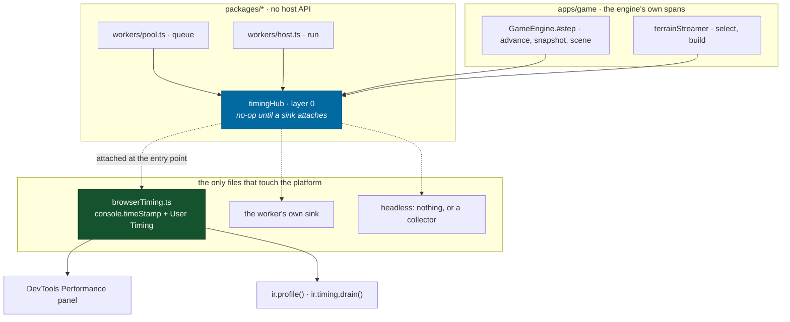
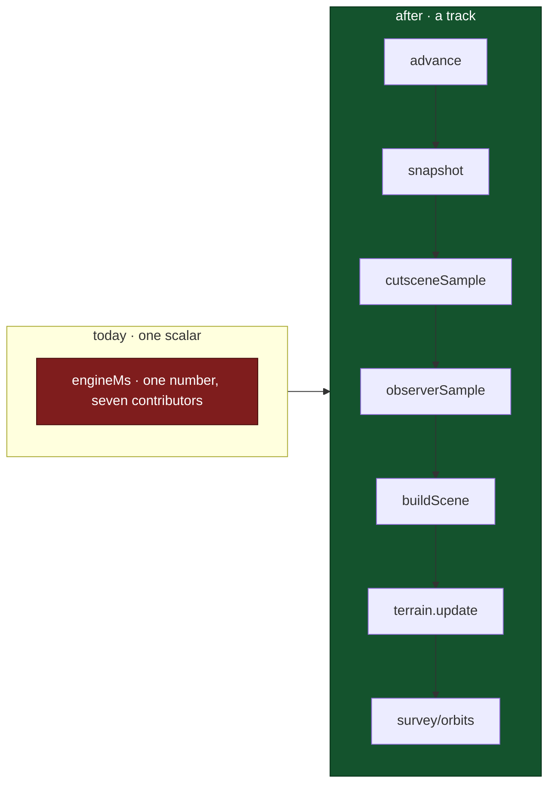
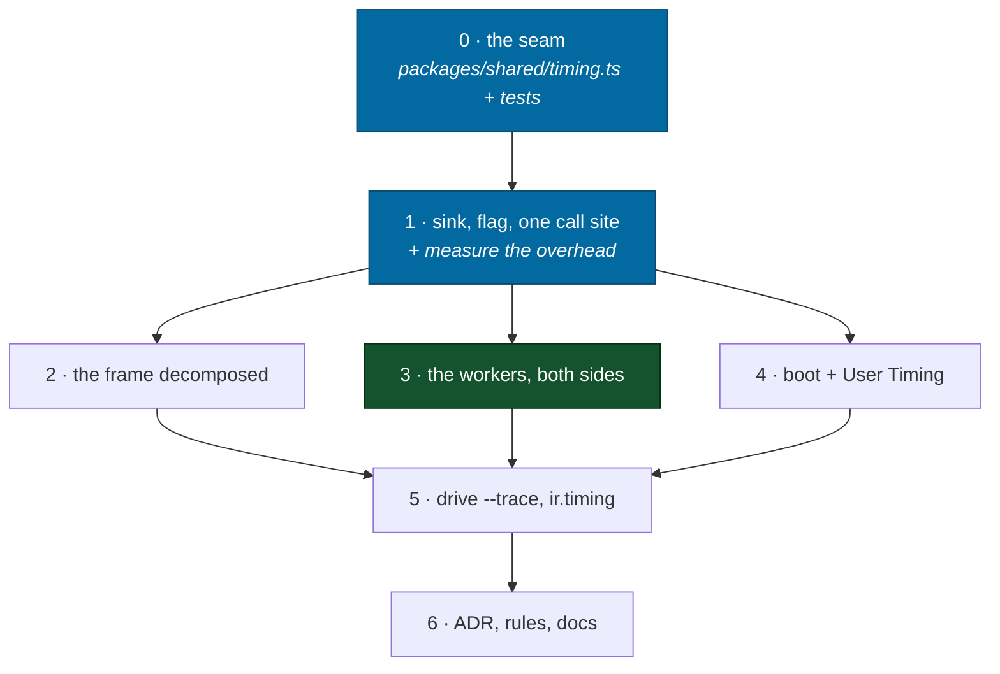

# The Timeline

A plan to make every phase of a frame, a boot and a worker job visible on the
browser's own performance timeline — through one port, off by default, and
without a single wall-clock read reaching canonical code.

> **The premise:** this project already measures itself well and can only show
> the answers as scalars. `engineMs` is one number covering ticks, snapshot,
> scene build and terrain reconciliation; the frame budget in
> [`docs/design/technical.md`](../design/technical.md) has **seven** lines under
> it. A heightfield takes 9–37 ms in a worker and the frame that starved waiting
> for it has no way to say so. Both facts are visible in Chrome's Performance
> panel the moment something writes them there.

Two platform APIs do that, and they are not two ways to do one thing:

|                               | `console.timeStamp`                        | `performance.mark` / `measure`                |
| ----------------------------- | ------------------------------------------ | --------------------------------------------- |
| Where it goes                 | an **active DevTools trace**, nowhere else | the page's **performance timeline**, retained |
| Readable back from JS         | no                                         | `getEntriesByType`, `PerformanceObserver`     |
| Takes explicit start/end      | yes — emit after the fact                  | `measure` only                                |
| Carries metadata              | **label, track, group, color — no more**   | a properties table and a tooltip              |
| Cost when nobody is recording | a disabled-category check                  | allocation plus buffer growth                 |
| Right for                     | the hot path: frames, ticks, patches       | the coarse path: boot, saves, jobs, shots     |

So `timeStamp` is the default and User Timing is the flag, which is what the
brief asked for and also what the costs argue for on their own.

**The metadata row is a constraint on the whole plan, not a footnote.**
`console.timeStamp(label, start, end, track, group, color)` is the entire
signature — there is no channel on it for a properties table or a tooltip, and
those exist only on the `devtools` object inside a `performance.measure`
detail. So every "and the entry carries `droppedTicks`" below is a claim about
`full` and never about `trace`. Where a property is genuinely load-bearing at
the hot path, the only thing `trace` can do is fold it into the label —
`terrain.build ×4` rather than a `patches` row — and the plan says so at each
site rather than promising a table the API cannot deliver.

---

## The one hard constraint

[`AGENTS.md`](../../AGENTS.md), rule 2:

> Never use `Math.random()`, `Date.now()`, or `performance.now()` in canonical
> code. Generation derives from seeds. Simulation depends on the integer tick.
> Wall clock enters at exactly one call, `clock.advance`.

Instrumenting "as deeply as possible" reads at first like an argument with that
rule. It is not, and the distinction is the whole design:

**The rule forbids canonical code from _depending on_ the wall clock. It does
not forbid canonical code from _emitting_ to it.** The check that keeps the two
apart is a type:

```ts
interface Span {
  end(): void // never `: number`
}
```

A span hands nothing back. There is no expression a canonical caller can write
that observes how long anything took, so no canonical value can be a function of
wall time. The invariant survives by construction rather than by discipline.

**Where that actually buys something, stated precisely.** The spans this plan
proposes inside `packages/*` are all in `workers` — `pool.ts` and `host.ts` —
and the layering makes that the interesting case: the pool is dispatch and
queueing rather than canonical state, but it sits below `apps/` where
`performance.now()` is out of scope, so it needs the port either way. **No span
is proposed inside `packages/simulation`.** The `advance` entry in phase 2 is
taken in `GameEngine.#step`, on the outside of `world.advance`, where the wall
clock is already legal and already read.

So the `void` return is not load-bearing for anything in this diff — it is what
keeps the door shut for the next change, which is the one that will want to time
a tick from inside. That is a smaller claim than "this makes it safe to
instrument the simulation", and it is the one the plan can support.

The precedent is already here: `getLogger` lives at layer 0 and is called from
`world.ts`, `pool.ts` and `host.ts`. Logging from canonical code is accepted
because a log record is write-only. Timing is the same shape with a stricter
signature.

---

## Layering: a host capability is a port

[`.claude/rules/packages.md`](../../.claude/rules/packages.md) is unambiguous —
`packages/*` has no third-party runtime dependency, no DOM lib, no Node lib.
`performance` and `console.timeStamp` are host globals; their types are not even
in scope down there. The brief's exception ("technically part of the platform")
is real but it is an exception to the **dependency** rule, not to the **portability**
one: `packages/*` still has to run in a browser, a worker and Node, and Node's
`console.timeStamp` is not Chrome's.

The established answer is the one to use. `WorkerPort`, `SaveStore`,
`PoolOptions.now`, `ServeOptions.now` — declare the interface in `packages/`,
let the host implement it.



`pnpm graph` keeps this honest for free: it already fails on any non-workspace
dependency under `packages/`, and a new grep test (below) covers the half it
cannot see — a bare `performance.` reference in core source.

---

## Phase 0 — the seam

**New: `packages/shared/src/timing.ts`.** Layer 0, so everything can import it.
Modeled on `log.ts` deliberately, down to the module-global hub whose default
does nothing, because the property that file establishes is the one that matters
most here: _importing a package never causes output._

```ts
export interface Timer {
  /** Cheap enough to read in a per-frame branch. False until a sink attaches. */
  readonly on: boolean
  /** An instant. `detail` is only built when `on`. */
  mark(name: string, detail?: TimingDetail): void
  /** A closed interval from numbers the caller already has. */
  measure(
    name: string,
    startMs: number,
    endMs: number,
    detail?: TimingDetail,
  ): void
  /** An open interval. `end()` returns void, and that is load-bearing. */
  span(name: string, detail?: TimingDetail): Span
  child(scope: string): Timer
}

export interface TimingRecord {
  readonly scope: string
  readonly name: string
  readonly startMs: number
  readonly endMs: number
  readonly detail: TimingDetail | undefined
}

export interface TimingSink {
  write(record: TimingRecord): void
}

export interface AttachOptions {
  /**
   * The host's clock. `span()` has to timestamp itself and the grep test below
   * forbids `performance.` inside `packages/`, so the clock arrives the way
   * `PoolOptions.now` and `ServeOptions.now` already do.
   *
   * **No zero default.** Those two default to `() => 0` and it is harmless
   * there — a stat reads 0 ms and is obviously untimed. Here it would stack
   * every entry at t=0 on the timeline, which looks like a recording rather
   * than like a missing argument. Attaching a sink without a clock throws.
   */
  readonly now: () => number
}
```

### `on` is a getter over the live hub, not a captured boolean

A hot call site reads it before building anything, which is the one thing
`log.ts` does not do — `LogHub.emit` filters by level _inside_ `emit`, so
`log.debug('x', { a, b })` allocates `{ a, b }` on every call and throws it
away. Right at log rates, wrong at 60 Hz across a dozen sites:

```ts
if (timer.on) timer.measure('terrain.build', started, ended, TERRAIN_BUILD)
```

**It has to be a getter delegating to the hub, and a snapshot would be a silent
no-op forever.** `main.tsx` attaches the sink at line 24, but
`import App from './App.tsx'` is line 8 — and ES modules evaluate every static
import to completion before the importing module's first statement runs. So any
module-scope `const timer = getTimer('game.engine')` in the engine, a scene
component or `packages/*` is constructed while the hub still has no sink. A
plain boolean field captured at that moment is `false` for the life of the
process, the instrumentation records nothing, and nothing fails.

A getter that reads one boolean off the hub costs the same at the call site —
still a property read on a monomorphic object, still no allocation — and cannot
go stale. The enabled path is where allocation is allowed, and the flag is how
you consent to it.

### The disabled implementations must be shared, frozen singletons

`span()` returning a fresh object per call would allocate at frame rate even
switched off. Disabled, it returns one frozen `NO_SPAN` whose `end` is an empty
function. Nesting is meaningless on a no-op, so sharing costs nothing.

### `TimingDetail` is the DevTools payload, spelled portably

```ts
export interface TimingDetail {
  readonly track?: string
  readonly group?: string
  readonly color?: TimingColor
  /** Rendered as the entry's key/value table. Values are strings; see below. */
  readonly properties?: readonly (readonly [string, string])[]
  readonly tooltip?: string
}
```

`TimingColor` is the union Chrome documents — `primary`, `primary-light`,
`primary-dark`, `secondary`, …, `error` — written out in `packages/shared` as a
string union so a call site is checked, and consumed only by the browser sink.
A host that does not understand it ignores it.

**`properties` is a User-Timing-only field and the type cannot say so.** It
reaches DevTools through the `measure` detail payload and has no channel on
`console.timeStamp`, so a detail carrying properties is silently reduced to
label, track, group and colour at `trace`. The sink drops them rather than
failing, because the alternative is a call site that has to know the level.

The pairs are `[string, string]` because that is what the panel renders, and a
call site converts at the edge — `['patches', String(built)]`. That conversion
is the reason `properties` never appears on a per-frame entry: formatting a
number allocates a string sixty times a second to fill a table that `trace`
discards anyway.

### Tests (Node, no host)

A recording fake sink — the pattern `log.test.ts` already uses for `LogSink`,
and `warmup`'s census tests for its producer list:

- the disabled timer's `span()` returns the identical object every call
  (`toBe`, not `toEqual`) — the allocation claim, asserted
- a `Span.end()` expression is `void`; `const x: number = span.end()` fails to
  compile — enforced with a `@ts-expect-error` in the test file, which is how a
  type invariant gets a test here
- `child('a').child('b')` composes scope exactly as `Logger.child` does
- attach → emit → detach → emit records once
- **a grep test:** no file under `packages/` contains `performance.` or
  `console.timeStamp`. Written the way `dossier.test.ts` greps every no-data
  reason for forbidden vocabulary, and for the same reason — the rule is stated
  in prose in three places and nothing currently fails when it is broken.

  Two details it has to get right, both of which it fails on a naive first
  writing. **It lives in `apps/headless`, not in `packages/`,** because
  `packages/*` may not touch `node:fs` and a test that reads the source tree is
  a test that reads the filesystem. And **it has to exempt comments and test
  files**: `packages/devtools/src/harness.ts:167` names `performance.now()` in
  a doc comment explaining why it does _not_ call it, and
  `packages/devtools/src/metrics.test.ts` uses it as a test clock. A grep that
  goes red on those on day one is a grep somebody deletes on day two

---

## Phase 1 — the sink, the flag, and one call site

**New: `apps/game/src/engine/browserTiming.ts`.** The only file in the
application that names `performance.mark`, `performance.measure` or
`console.timeStamp`.

```ts
console.timeStamp(label, startMs, endMs, track, group, color)
```

```ts
performance.measure(label, {
  start: startMs,
  end: endMs,
  detail: {
    devtools: {
      dataType: 'track-entry',
      track,
      trackGroup,
      color,
      properties,
      tooltipText,
    },
  },
})
```

**Feature detection cannot be a `typeof`, and that is the trap here.**
`console.timeStamp` is ancient and present in every browser and in Node; the
four track arguments are a recent Chromium extension. So
`typeof console.timeStamp === 'function'` is `true` on Safari, Firefox and Node,
the sink attaches, `timer.on` goes true, and the hot path pays for entries that
land nowhere. That is cost with no output — precisely the failure mode the last
section of this plan says a performance tool must not have.

There is no capability query for the extension, so the honest options are to
detect the engine or to make the user ask. **The flag is the gate**: `off` is the
default everywhere, so the only way to pay the cost is to turn it on, and the
sink logs one line at attach naming what it can actually emit. The `typeof`
guard stays for `performance.mark`/`measure`, where it does mean something.

Where the extension is missing, `trace` degrades to bare
`console.timeStamp(label)` — an instant, no track, no colour, still visible in a
recording — and `full` carries the real information, because User Timing is
standard everywhere. The port is what makes an unsupported host safe; the level
is what makes an under-supported one honest.

### Where the flag lives

Three doors, one switch, which is the shape `setChrome` already argues for
("`Shift+H`, `ir.chrome(false)` and a plate script all reach one switch"):

1. `?timing=trace` in the URL — the level by name, never `=1`, because the flag
   has three values and a boolean cannot select `full`. It goes in the `QUERY`
   registry in [`pages/paths.ts`](../../apps/game/src/pages/paths.ts) with the
   other query keys rather than being read ad hoc; `?seed=` in `App.tsx` is the
   precedent for reading one at boot, not for skipping that registry
2. a preference in [`state/preferences.ts`](../../apps/game/src/state/preferences.ts),
   group `workspace`, beside `DEBUG_ON` — **this file holds the only
   `localStorage` call in `apps/game/src`** and a key declared anywhere else does
   not resolve
3. `ir.timing('trace')` on the harness — the level, not a boolean
4. a row in the performance panel, which the addendum argues for

**It is wired in `main.tsx`, at module scope, beside `logHub.addSink`.** Not in
`App`, and not in the engine's constructor. Two reasons, and the first is fatal
to the alternatives: boot is the most interesting thing on this timeline and boot
happens before React mounts — a flag read in an effect misses the atmosphere
bake, every texture upload and the whole pipeline warm. The second is the reason
already written into `main.tsx` for the log sink: attaching to a module-global
hub is a process-wide side effect and belongs to the process's entry point.

Three levels rather than a boolean, because the two APIs cost differently and
the difference is worth being able to choose:

| Value           | `timeStamp` | User Timing | For                                               |
| --------------- | ----------- | ----------- | ------------------------------------------------- |
| `off` (default) | —           | —           | shipping                                          |
| `trace`         | on          | —           | recording a profile                               |
| `full`          | on          | on          | a bug report, a RUM beacon, `PerformanceObserver` |

### One call site, to prove the wiring

`GameEngine.frame` already computes `started` and `elapsed` with
`performance.now()`. It becomes one `measure` with **no new clock read at all** —
which is the pattern to reach for everywhere the numbers already exist:

```ts
if (timer.on) timer.measure('frame', started, started + elapsed, FRAME_DETAIL)
```

`FRAME_DETAIL` is a frozen module constant — a track, a group and a colour, all
of which are the same on every frame — so `trace` allocates nothing here.

**The colour and the counts cannot live on it, and the plan does not pretend
otherwise.** A frame over `DROPPED_FRAME_MS` wants `error` rather than
`primary`, and the addendum wants `drawCalls` and `triangles` on the entry;
both vary per frame. So there are exactly two constants — `FRAME_DETAIL` and
`FRAME_LATE` — chosen by one comparison, and the counts are a `full`-level
concern where a detail object per frame is already the cost being consented to.
`trace` folds nothing extra in. Two frozen objects and a ternary is the whole
mechanism, and it is written out here because "allocates nothing" is the kind of
claim that quietly stops being true.

### Measure the overhead before going further

Chrome documents `console.timeStamp` as "minimal overhead in production". That is
a claim about their implementation, not a measurement of ours, and this
repository does not promote those. Before phase 2 lands, measure it: `pnpm drive`
with `--cast`, the same scene, at `off` / `trace` / `full`, and read `frameMs`
p95 off the `FrameMetrics` series.

**The entry count to measure against is ~22 a frame**, and it is derived rather
than guessed: 7 on the Engine track, 5 on Terrain (`select`, `build`, `request`,
`evict`, `scatter`), 9 `useFrame` consumers on Render, and 1 for the frame
itself. Worker entries are emitted on their own threads and do not load this
one. Phase 4's boot entries are one-shot. **The number that decides whether
`trace` can ever be on by default is the delta at `off` → `trace` at that
count** — and every figure in this plan that is not cited from an existing file
is a budget rather than a measurement, this one included.

---

## Phase 2 — the frame, decomposed

The point of the whole exercise. `#step` runs seven distinguishable things and
reports one number.



**Track `Engine`**, colored `primary`:

| Span          | Site                     | What it answers                                                                                           |
| ------------- | ------------------------ | --------------------------------------------------------------------------------------------------------- |
| `advance`     | `world.advance(delta)`   | ticks × cost; `droppedTicks` as a property                                                                |
| `snapshot`    | `snapshot(world)`        | the 1.5 ms budget line, split from scene build                                                            |
| `cutscene`    | `harness.cutsceneSample` | whether a beat is what hitched                                                                            |
| `observatory` | `harness.observerSample` | the planetarium's own share                                                                               |
| `scene`       | `buildScene`             | the other half of the 1.5 ms line                                                                         |
| `survey`      | `#maybeSurveyStars`      | a star sweep is 8 ly of hysteresis apart, so it is rare and large — exactly the shape a scalar mean hides |
| `orbits`      | `#maybeTraceOrbits`      | rebuilt only when the loaded set changes                                                                  |

**Track `Terrain`**, colored `secondary`, from `terrainStreamer.update`:

| Span      | Cited cost                                      | Source               |
| --------- | ----------------------------------------------- | -------------------- |
| `select`  | 40–90 µs whole disk; 0.11–0.31 ms               | `terrainStreamer.ts` |
| `build`   | 0.25 ms a patch, four a frame                   | `terrainStreamer.ts` |
| `scatter` | 128 slots a frame — 0.31–0.72 ms across the zoo | `scatterField.ts`    |
| `request` | queue submission                                | —                    |
| `evict`   | —                                               | —                    |

`scatter` is the one that most wants a timeline rather than a mean.
`scatterField.ts` resolves a fixed budget of candidate slots per frame against a
whole region that costs 2.6–5.8 ms, so the work is deliberately smeared across
frames — and a budget spread thin is invisible to a scalar by construction,
while on a track it is the obvious repeating band.

Two of these want to be `error`-colored when they mean something bad: a
`starved` selection and a `saturated` streamer are already fields on
`summary()`, and an entry that turns red when the ground is going coarse is the
one thing a screenshot of a profile can say at a glance.

> **`select` may be under the clock's resolution, and that has to be checked
> first.** 40–90 µs is smaller than the coarsening `performance.now()` is
> subject to in a context that is not cross-origin isolated, and nothing here
> sets COOP/COEP — `frameMetrics.usedHeapMb` reading `performance.memory` is the
> confirmation. If the entry quantizes, the answer is to time the whole
> `terrainStreamer.update` and let `select` be a label on it rather than a span
> of its own. Measure before writing the span, not after.

**Track `Render`.** Nine `useFrame` consumers run per frame that `engineMs`
explicitly excludes — `Bodies`, `TerrainPatches`, `ScatterRocks`, `Starfield`,
`ShipModel`, `OrbitTraces`, `NearFieldProps`, `SunFlare`, `WarpFx` — plus
`CameraRig`, which is the pose rather than a draw, and `EngineTick` itself,
which is the engine span above. `CutsceneOverlay`, `SceneView` and
`render/shapeModels.ts` register their own and are the reason to count from
`rg -l useFrame` rather than from memory. A thin hook:

```ts
useTimedFrame('bodies', (state, delta) => { … }, priority)
```

wrapping `useFrame`, giving one row per component. `frameMetrics.ts`'s comment
is the argument for this being worth having: _"everything the GPU does happens
after this returns, and conflating the two is how a renderer problem gets
diagnosed as a simulation one."_ The same conflation runs the other way for the
scene components, and nothing currently separates them.

**Ticks are marked as a batch, not individually.** 64 marks a second per tick
would be the instrumentation becoming the load. What a reader of a warped
session wants is the tick count and `achievedTimeScale` beside the duration —
and since `trace` has no properties channel, the batch carries them **in the
label**: `advance ×12 @0.6×`. Ugly next to a properties table and legible in a
flame chart, which is where it is read. At `full` the same two numbers also
arrive as properties, because there the table exists.

---

## Phase 3 — the workers, both sides

This is the highest-value section and it needs almost no new measurement code,
because `WorkerPool` already records `enqueuedAt` and `dispatchedAt` and
`serveTasks` already records `started`.

**Pool side** (`packages/workers/src/pool.ts`) — `PoolOptions.timing?: Timer`,
beside the `now` port that is already there for exactly this reason. Two
`measure` calls per job on track `Workers`:

- `queue` — `enqueuedAt` → `dispatchedAt`
- `run` — `dispatchedAt` → completion

The header of that file already states why the split exists: _"slow tasks want
optimization, a deep queue wants more workers or fewer requests."_ Today those
are two rolling means over 64 jobs. On a timeline they are the shape of the
queue, and the difference is that you can see which frame the depth started at.

**Host side** (`packages/workers/src/host.ts`) — `ServeOptions.timing?`, one
track entry per task on the worker's own thread, named `task.name`, with the
region address folded into the label at `trace` and carried as a property at
`full`.

> **The payoff:** a `generateHeightfield` at 37 ms appears on a worker track in
> the same trace as the frame that drew coarse ground because it was still
> waiting. Nothing in this project can currently draw that picture.

### Two traps this section has to solve

**The flag has to cross the worker boundary.** A worker is a separate global
scope and reads neither the URL nor `localStorage` at the same moment the page
does.

The obvious move is to append `?timing=<level>` to the worker URL in
`createBrowserWorkerPort`, which is _the_ place the URL is decided. **It does not
work, for four independent reasons, and all four are worth writing down because
the idea comes back:**

- `browserWorker.ts` uses the statically analyzed
  `new Worker(new URL('../workers/universe.worker.ts', import.meta.url))` form.
  Interpolating a runtime value defeats Vite's detection and the worker chunk
  stops being emitted at all.
- `apps/game/public/sw.js` treats `/assets/` as cache-first with a bare
  `caches.match(request)` and no `ignoreSearch`, so a query-suffixed worker
  misses the cache on an offline launch.
- Inside a module worker the query is on `self.location.search`, not on
  `new URL(import.meta.url).searchParams`.
- The premise is false anyway. "A value that never changes after construction"
  is contradicted by `ir.timing()` and by the panel's switch, both of which flip
  the level mid-session — and a URL read once at spawn would leave the Workers
  track silently empty for the rest of it.

So it is **a message**, and the versioned protocol kind it costs is the price of
a level that can change. It also covers the headless path, where
`createInlineWorker` has no URL to put a query on. The pool broadcasts the level
on attach and on every change; a worker that has not heard yet is `off`, which
is the right default for the one frame it lasts.

**Every worker has its own `timeOrigin`.** `console.timeStamp`'s numeric
arguments are milliseconds relative to `performance.timeOrigin`, and a worker's
differs from the page's — so a start time computed on one thread and emitted on
another lands in the wrong place on the timeline, by however long the worker took
to spawn. Two consequences:

- each side emits only its own numbers; the pool never emits a worker's `run`
  and the worker never emits the pool's `queue`
- a worker's `performance.mark` entries live in the worker's own performance
  timeline and are invisible to the page's `getEntriesByType` — so a `full`-level
  drain (phase 4) has to collect from both, over `postMessage`, or admit it only
  covers the main thread

---

## Phase 4 — boot, and the marks that survive the trace

Boot is where User Timing earns the flag. These are the entries you want to be
able to _read back_ — from a bug report, from a `PerformanceObserver`, from
`ir.timing.drain()` — rather than only look at in a panel that happened to be
recording at the time.

Nearly all of it is already measured and thrown away as a log line:

| Site                       | Already computes                              | Becomes                             |
| -------------------------- | --------------------------------------------- | ----------------------------------- |
| `render/preload.ts`        | `ms: Math.round(performance.now() - started)` | `measure` per producer              |
| `render/warmup.ts`         | per-producer `started` and the census total   | `measure` per pipeline compile      |
| `render/atmosphereLuts.ts` | `ms` for a ~50 ms bake                        | `measure`, `tertiary`               |
| `render/firstLight.ts`     | `booting` → `revealing` → `done`              | three **markers**                   |
| `engine/catalogAsset.ts`   | —                                             | `measure` around the catalog decode |

A **marker** (`dataType: 'marker'`) is the right shape for a phase change: it
draws as a vertical line across every track, so "first light" cuts through the
frame track, the worker tracks and the boot track at once.

The measurement this project cares about most and currently states nowhere:
`performance.timeOrigin` → first light, as one `measure`. `preload.ts` carries
the 98–119 ms figure for a cold first look against a body; what the boot
sequence itself costs is not written down anywhere, and this is the entry that
writes it.

### Retention is a decision, not a default

Two clearing calls, not one, and the distinction is load-bearing:
`performance.clearMarks()` removes marks and **`performance.clearMeasures()`
removes measures**. The table above is almost all measures — only `firstLight`'s
three phase changes are marks — so a drain that calls `clearMarks` alone leaves
behind every entry it was written to bound. Both take an optional name, and
both clear **everything** when called bare, including entries another tool put
there. So:

- the sink keeps the set of names it has emitted, and which kind each is
- `ir.timing.drain()` returns them and clears them **by name**, marks through
  `clearMarks` and measures through `clearMeasures`, never bare
- at `trace` level nothing is retained at all, which is the whole reason the
  levels are separate

Unbounded growth is otherwise real: at `full`, the ~22 entries a frame derived
in phase 1 is 1.3 million retained entries over ten minutes.

### The RUM question, answered narrowly

`analytics.ts` is the gate for anything third-party and it is off unless this is
a production build on the canonical host with no Global Privacy Control. **This
plan ships no beacon.** It ships `drain()`, which returns structured entries a
developer can paste into an issue. Sending them anywhere is a separate decision
with a separate consent story, and it belongs in its own change.

---

## Phase 5 — the tooling that makes it readable from a terminal

A timeline an agent cannot read is a timeline that only helps when a human is
already looking. Two additions close that:

**`scripts/drive.mjs --trace <ms>`** — `Tracing.start` with the timeline
categories, run, `Tracing.end`, write the JSON beside the screenshots in
`.data/drive/`. It composes with the existing steps in order, exactly like
`--js … --wait … --cast …`.

**`scripts/traceFrames.mjs`, a second mode** — that file already parses a Chrome
trace to pull `Screenshot` events; teach it to pull custom track entries and
print a table. The output an agent wants is a per-track p50/p95 over the
recording, which is `Series`-shaped and can reuse `packages/devtools/src/metrics.ts`.

> **Verify the trace-event shape first.** The exact `cat`/`name` pair the
> extended `console.timeStamp` lands under is not asserted here because it has
> not been checked. Step one of this phase is to record one trace with a known
> label in it and dump the distinct `cat`/`name` pairs; the answer belongs in
> the script's header where the `Screenshot` explanation already lives.

`drive.mjs` already carries `--sample` and `--sample-js`, which read a value
once per animation frame from inside the page. `ir.profile` is not a second copy
of that: sampling reads one expression at frame rate, and a profile aggregates
spans the engine emits. Where they overlap is the reporting, so `--sample`'s
table formatting is the thing to reuse.

**`ir.timing`** on the harness — `ir.timing('full')`, `ir.timing.drain()`,
`ir.timing.tracks()`. It goes in `packages/devtools/src/harness.ts` against a
port, so the headless runner gets the same verb and a scenario that profiles in
Chrome profiles in Node.

---

## Phase 6 — what has to be written down

Not optional here, and two of them are mechanical:

- **[`scripts/docs/wings.mjs`](../../scripts/docs/wings.mjs)** — this file is
  listed in the `Plans` group. `pnpm docs:build` fails on an unlisted page and
  takes `pnpm check` with it.
- **An ADR — 0022.** There are three real decisions with real alternatives: the
  port versus direct platform calls; two APIs on one seam versus picking one; the
  flag at the entry point versus in the engine. Each has a losing option worth
  recording.
- **[`AGENTS.md`](../../AGENTS.md)** — one rule: _never call `performance.mark`,
  `performance.measure` or `console.timeStamp` outside the sink._ Same shape as
  the `localStorage` rule, same reason — the set has to be known in one place for
  the level, the drain and the clear to be possible at all.
- **[`.claude/rules/`](../../.claude/rules/README.md)** — mirror it under
  `packages.md` and a new `timing.md`, with the Cursor glob kept in step. A
  drifted mirror is worse than none.
- **[`docs/concepts/observability.md`](../concepts/observability.md)** — that
  page's thesis is "one structure, four consumers". This adds a fifth, and the
  page should say so.

---

## Ordering, and what each phase buys on its own



Phases 2, 3 and 4 are independent of each other and each is useful alone —
3 is the one to do first if only one gets done, because the frame-versus-worker
correlation is the question this project cannot currently ask at all.

---

## What could go wrong, stated in advance

| Risk                                  | Why it is plausible                          | The check                                                 |
| ------------------------------------- | -------------------------------------------- | --------------------------------------------------------- |
| The instrumentation becomes the load  | ~40 entries a frame at 60 Hz                 | phase 1's measurement gates phase 2                       |
| A span leaks into a canonical value   | a future `end(): number` looks helpful       | the type test; the grep test                              |
| Worker entries land at the wrong time | separate `timeOrigin` per scope              | each side emits only its own numbers                      |
| The timeline fills memory at `full`   | entries are retained by design               | `drain()` clears by name, marks _and_ measures            |
| A second sink attaches in StrictMode  | effects run twice                            | idempotent by label, the way `warmup.register` already is |
| The flag misses boot                  | read in an effect instead of at module scope | wired in `main.tsx` beside the log sink                   |

---

## Addendum — what this joins, and what it must not replace

This project already measures itself carefully. The case for a timeline is not
that nothing is measured; it is that **six instruments measure six things on six
different axes, and none of them share one.**

### The six instruments already here

|     | Instrument                                   | Shape                             | Window                  | Read by                    |
| --- | -------------------------------------------- | --------------------------------- | ----------------------- | -------------------------- |
| 1   | `FrameMetrics` × `Series`                    | distribution over a recent window | **240 samples ≈ 4 s**   | `PerfPanel` at 8 Hz        |
| 2   | `PoolStats`                                  | rolling mean + lifetime counters  | **last 64 jobs**        | `PerfPanel`, `ir.status()` |
| 3   | `measureGpuFrameMs`                          | a one-shot somebody asked for     | **40 submitted frames** | a button                   |
| 4   | boot `ms` log fields                         | a fact printed once               | —                       | `ir.logs()`, as prose      |
| 5   | `terrainBaseline` / `measurePatchGeneration` | an offline reproducible baseline  | a whole zoo walk        | `pnpm sim`, `CONTEXT.md`   |
| 6   | `TerrainStreamer.summary()`                  | instantaneous counts              | this frame              | `ir.terrain()`             |

Two observations fall straight out of that table, and they are the real argument
for this plan.

**The axes do not line up, so correlation is not expressible.** A worker job's
9–37 ms lives in a mean over the last 64 jobs; the frame it starved lives in a
p95 over the last 240 frames. Depending on the queue those two windows can cover
wildly different spans of wall clock, so "the frame at _t_ was slow" and "a
heightfield landed at _t_" cannot be put next to each other — there is no _t_.
The timeline is not a seventh instrument. **It is the shared axis the six are
missing.**

**Almost all of the instrumentation is already written.** Seven sites already
hold both ends of an interval and throw one of them away:

| Site                       | Already computes                         |
| -------------------------- | ---------------------------------------- |
| `GameEngine.frame`         | `started`, `elapsed`                     |
| `render/preload.ts`        | `started`, `ms`                          |
| `render/warmup.ts`         | `started`, `ms`, per producer            |
| `render/atmosphereLuts.ts` | `started`, `ms`                          |
| `render/measure.ts`        | `started`, drained-queue end             |
| `workers/pool.ts`          | `enqueuedAt`, `dispatchedAt`, completion |
| `workers/host.ts`          | `started`, completion                    |

So phases 1–4 are mostly **routing numbers that already exist**, not adding
clock reads. That is what makes the overhead question tractable and it is why
phase 1's measurement is the gate rather than a formality.

### What `PerfPanel` does well, and must keep doing

It is a good panel and the plan does not touch its job. Four things it gets
right that a timeline is bad at:

- **p95 over max, with the reason written down.** One 90 ms stall in four
  seconds is a defect; a mean hides it and a max cannot be told from a one-off.
- **The budget is drawn on the plot, not written beside it** — "how close is
  this to it" rather than "what is it".
- **It separates the budget from the measurement.** 16.6 ms is a budget of
  _work_; the sampled period is pinned at 17.8 ms p95 by vsync while nothing is
  wrong, so the warning line is `DROPPED_FRAME_MS = 25`, which jitter cannot
  reach. A timeline reproduces this distinction badly.
- **Absences are honest.** `performance.memory is Chromium-only`,
  `webgpu only`, `not measured` — each is a stated gap rather than a zero.

### What it structurally cannot show

Not defects — consequences of being a set of scalar plots:

- **Composition.** `engineMs` has seven contributors and the panel has one line
  for them. Nothing in a `Series` can say _which_ one moved.
- **Correlation**, for the reason above: different windows, no shared axis.
- **Causality.** The panel can say the frame was late. It cannot say what was on
  the main thread while it was.
- **Rare-and-large events.** A star survey fires once per 8 ly of travel; an
  orbit rebuild fires when the loaded set changes. In a 240-sample window they
  are usually absent, and when present they are one sample in 240 — invisible in
  the mean and indistinguishable from jitter in the p95.
- **Anything before the dock mounts.** Boot is over before the panel exists,
  which is why instrument 4 is a log line.
- **The eight other `requestAnimationFrame` loops.** R3F owns one loop and
  `EngineTick` steps the engine inside it at priority −1. Eight more rAF callers
  run outside it — `HomePage`, `SkyLabels`, `TrackOverlay`, `CutsceneOverlay`,
  `useDocsFraming`, `firstLight`, `createRenderer` and `warmup`. Not all are
  steady-state loops; the last three are boot-time, which is its own argument,
  since boot is where the panel cannot look. None is in `FrameMetrics`. That is
  real main-thread work no current instrument sees at all.

> **The split to hold on to:** the panel answers _"is it fast right now"_ while
> you fly. The timeline answers _"why was that frame slow"_ afterwards. They are
> complements, and the boundary is the same one `frameMetrics.ts` already draws
> between engine time and everything the GPU does after `frame` returns.

### Synthesis: one definition of "over budget"

The panel already knows what over-budget means and cannot tell anyone.
`FRAME_BUDGET_MS`, `DROPPED_FRAME_MS`, `ENGINE_BUDGET_MS` and
`DRAW_CALL_BUDGET` are module constants **inside `PerfPanel.tsx`**, so the only
thing that can act on them is the plot.

Move them to `hud/perfBudgets.ts`. This is not tidying — `perfFormat.ts` is the
precedent for the file split ("a `.tsx` that exports plain functions alongside
components is a file Fast Refresh gives up on"), though the reason here is the
weaker one: a `.ts` sibling holding four numbers is simply somewhere the sink
can import from, and the Fast Refresh argument does not apply to constants.

**The direction of the dependency is the part to get right.** `hud/` sits above
`engine/`, so the sink must not import the panel's module. The budgets belong
wherever both can reach them — beside `FrameMetrics` in `engine/`, with the
panel importing them rather than the reverse. That is a smaller move than it
sounds and it is what buys the thing that makes this a synthesis rather than an
addition:

**One definition of over-budget colors the plot _and_ colors the trace entry.**
A frame over `DROPPED_FRAME_MS`, a `starved` terrain selection, a `saturated`
streamer, a `droppedTicks` frame — each emits `color: 'error'`, and a profile
becomes scannable without reading a single number. Today "over budget" exists in
exactly one place and is available to nothing else.

Two more small joins in the same spirit:

- **`renderer.info.render` becomes properties on the frame entry at `full`.**
  The counts are already sampled per frame and `autoReset` is already off for
  that reason. It is a `full`-level join rather than a free one, because
  properties do not exist at `trace` and formatting two integers into strings
  sixty times a second is exactly the allocation `trace` is trying to avoid.
- **A `Timing` row in the panel** — level `off` / `trace` / `full` through
  `hud/SwitchRow.tsx`, because the registry rule is that you never hand-roll a
  control it already has. It is the fourth door onto the one switch, and it puts
  the control where somebody watching a p95 climb is already looking.

### The platform surface this app already stands on

The app is a careful platform citizen, and nearly every API it already uses is a
piece of timeline _context_ it currently keeps to itself:

| Platform API                           | Where                                              | What a marker would say                                                   |
| -------------------------------------- | -------------------------------------------------- | ------------------------------------------------------------------------- |
| `visibilitychange` / `visibilityState` | `firstLight`, `presentationWatchdog`, `net/health` | why the frame track has a 60-second hole                                  |
| `ResizeObserver`                       | `hud/TrackOverlay.tsx`, `docs/DocsMode.tsx`        | terrain selection is measured in **display pixels**, so a resize moves it |
| `matchMedia`                           | `viewport.ts`, `render/capability.ts`              | a DPR change, for the same reason                                         |
| `navigator.gpu` adapter info           | `render/capability.ts`, `TelemetryPanel`           | which GPU this trace is of                                                |
| `navigator.hardwareConcurrency`        | `browserWorker.poolSize`                           | how many worker tracks to expect                                          |
| `performance.memory`                   | `frameMetrics.usedHeapMb`                          | already per-frame; a marker on a heap step                                |
| service worker install/activate        | `net/registerServiceWorker.ts`                     | a boot cost nobody attributes                                             |
| `navigator.onLine`, health probes      | `net/health.ts`                                    | a probe records `checkedAt` but never its own duration                    |
| Global Privacy Control                 | `analytics.ts`                                     | the gate, and the reason no beacon ships                                  |

**The gap worth naming:** nothing in this codebase uses `PerformanceObserver`,
and nothing reads Navigation Timing or `performance.timeOrigin`. Boot is measured
as `performance.now()` deltas that are never related to the navigation — so
_"how long from opening the link to first light"_, the one duration a player
actually experiences, is a number this project cannot currently state. One
`measure` from `timeOrigin` to first light fixes that, and it is the single
highest-value entry in phase 4.

### The harness — `ir.profile()`

The agent story here is already strong: `ir.status()` is JSON, `ir.terrain()` is
a report, `ir.terrainBaseline().text` is a block for `CONTEXT.md`, and
`ir.selfTest()` reports **measurements rather than "OK"** because
[`capabilities.ts`](../../packages/devtools/src/capabilities.ts) argues that a
check which cannot fail informatively is worse than none. Timing should arrive in
that idiom, not beside it.

```ts
ir.timing('trace' | 'full' | 'off') // the level — the harness door of the three
ir.timing.tracks() // what is registered, so a driver can discover it
ir.timing.mark('label') // an agent plants its own marker mid-script
ir.timing.drain() // retained User Timing entries, cleared by name
ir.profile(2000) // arm · record · disarm · report
```

**`ir.profile(ms)` is the verb that matters.** It returns structured data _and_ a
`.text` block, the shape `terrainBaseline` already established, because the whole
point is a terminal-readable answer from one `--js` call:

```
node scripts/drive.mjs --js "ir.land('s:SOL/b:2', 27.98, 86.92)" --wait 3000 \
                       --js "ir.profile(2000)" --down
```

What the report carries, aggregated with `Series` from
[`packages/devtools/src/metrics.ts`](../../packages/devtools/src/metrics.ts) —
reused rather than reinvented, since nearest-rank p95 over a few hundred samples
is exactly what it is for:

- per track and span: count, total, mean, **p95**
- each span's **share of frame time, summing** — the thing the panel structurally
  cannot do
- frames over `DROPPED_FRAME_MS`, **with the span that dominated them**

That last line is the deliverable. An agent asks "why is it slow" and gets back
_"9 frames over 25 ms; `terrain.build` dominated 7 of them at 8.4 ms mean"_
instead of a screenshot and a p95.

The aggregation belongs in `packages/devtools` (layer 6) while the hub is in
`packages/shared` (layer 0). That is layer-legal and it is also right:
`metrics.ts`'s own header says arithmetic belongs where Node can test it, and
_what_ to sample belongs to the host.

### The headless half, and the thirteenth check

Because the spans live in `packages/*`, the Node runner sees the same span names
the browser does — the "same harness, both hosts" property this project already
has for scenarios, extended to profiling:

- **`pnpm sim --profile`.** The runner already prints
  `${ticks} ticks in ${elapsed} ms`; a Node collector turns that into the
  simulation-side breakdown — `advance`, `snapshot`, `scene` — with no browser
  at all, and it is the half `terrainBaseline` explicitly says it cannot measure.
- **A thirteenth capability check: _the timing port is inert when off._** With
  the level `off`, a recording sink receives zero entries across N frames and
  `span()` returns the identical object every call. It reports the entry count
  and the identity result, not a tick. This is the invariant that most needs a
  live check, because breaking it costs frame time silently — which is precisely
  the failure mode a performance tool must not have.

  **It is a thirteenth of twelve, and that is a documentation change rather than
  an arithmetic one.** `README.md` carries a `12/12 capabilities` badge, a
  section headed "The twelve capabilities, proven", and two more references in
  prose; `docs/concepts/observability.md` says twelve as well. The twelve are
  the _first milestone's_ list, which is a closed historical set — so the right
  move is probably a check that runs beside them rather than inside the count,
  and the decision belongs in ADR-0022 rather than being made by whoever writes
  the check.

**Do not assert timings in CI.** `pnpm sim --self-test` runs there, and a
wall-clock budget in a shared runner is a flaky test that gets muted and then
ignored. Report the numbers in the self-test output the way the capability checks
report theirs, and let a human or an agent compare two runs. A measurement nobody
trusts is worse than no measurement, which is the same argument check 5 already
carries.

---

## Every number in this document

Two kinds, kept apart on purpose.

**Cited.** Measured elsewhere, in this repository, by somebody else:

| Figure                                                       | Source                                 |
| ------------------------------------------------------------ | -------------------------------------- |
| Frame budget 16.6 ms; snapshot + scene build 1.5 ms          | `docs/design/technical.md`             |
| Whole frame 2.04 ms at 63.9 fps, on Miranda's summit         | `docs/design/technical.md`, 2026-08-27 |
| Engine budget 2.0 ms; warn line 25 ms; draw calls 1,200      | `hud/PerfPanel.tsx`                    |
| Period p95 17.8 ms at a comfortable 60 fps                   | `hud/PerfPanel.tsx`                    |
| Heap budget 900 MB peak                                      | `docs/design/technical.md`             |
| Terrain selection 40–90 µs whole disk                        | `engine/terrainStreamer.ts`            |
| Terrain selection 0.11–0.31 ms; mesh build 0.25 ms a patch   | `docs/design/technical.md`             |
| Heightfield generation 9–37 ms a patch                       | `engine/terrainStreamer.ts`            |
| Scatter 128 slots a frame, 0.31–0.72 ms; a region 2.6–5.8 ms | `engine/scatterField.ts`               |
| Cold first look 98–119 ms; atmosphere bake ~50 ms            | `render/preload.ts`                    |
| Star survey hysteresis 8 ly                                  | `engine/GameEngine.ts`                 |
| `Series` window 240 samples ≈ 4 s at 60 fps                  | `engine/frameMetrics.ts`               |
| `PoolStats` rolling means over the last 64 jobs              | `packages/workers/src/pool.ts`         |
| GPU measure: 40 submitted frames                             | `render/measure.ts`                    |
| Tick rate 64 Hz                                              | `packages/simulation/src/clock.ts`     |
| Panel reads at 8 Hz                                          | `apps/game/src/state/engineStore.ts`   |

**Budgeted.** Derived or assumed _by this plan_, and therefore the numbers to
distrust until phase 1 reports:

| Figure                                            | Where it comes from                               |
| ------------------------------------------------- | ------------------------------------------------- |
| ~22 entries a frame at `trace`                    | 7 Engine + 5 Terrain + 9 Render + 1 frame         |
| 1.3 M retained entries over ten minutes at `full` | 22 × 60 × 600                                     |
| The sample `ir.profile` output                    | invented — the shape of the report, not a reading |

The overhead of an entry is deliberately absent from both tables. Chrome's
"minimal overhead in production" is their claim about their implementation;
until phase 1 measures it here there is no number to write down.

---

## Related

- [Observability](../concepts/observability.md) — the four consumers this adds a fifth to
- [Determinism](../concepts/determinism.md) — the rule the `void` return preserves
- [Workers](../concepts/workers.md) — the pool this instruments on both sides
- [ADR-0006](../adr/0006-simulation-clock.md) — the one call wall clock enters at
- [ADR-0021](../adr/0021-the-ground.md) — the terrain the `scatter` and `build`
  spans are taken over
- [Headless WebGPU](headless-webgpu.md) — the other plan in this wing
