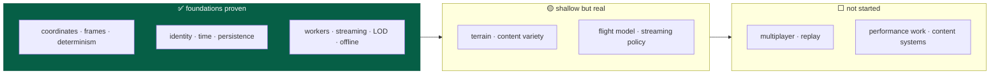
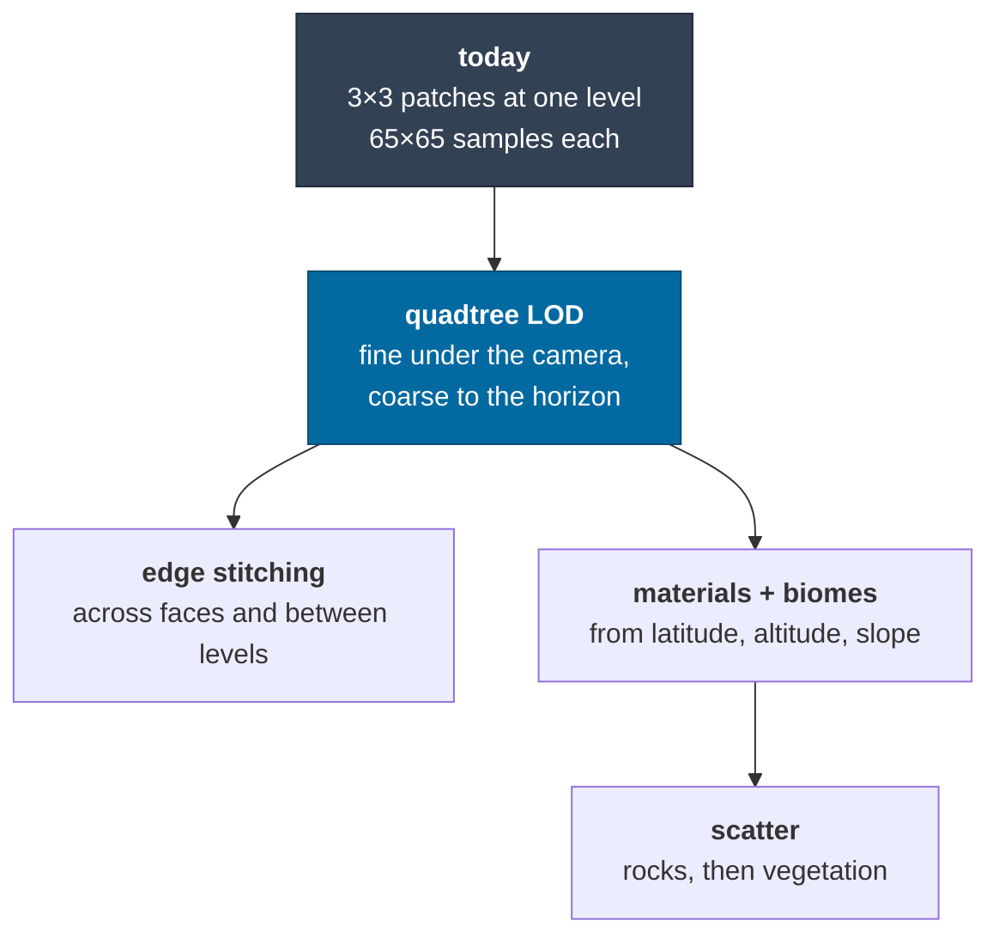
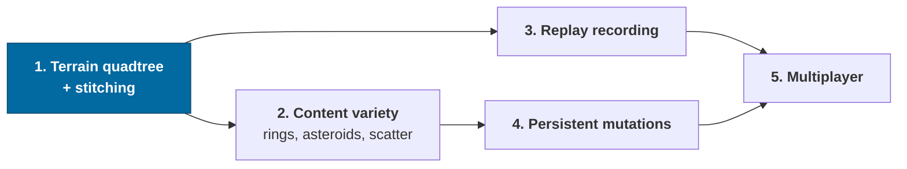

# Roadmap

What is **not built yet**, with the seam that already exists for it and an honest
note on what it would take.

Scope and principles are in [vision](vision.md); what exists is in
[architecture](architecture.md); what was learned building it is in
[CONTEXT.md](../CONTEXT.md).

> **Legend** — ✅ done · 🟡 partial · ⬜ not started · ⛔ deliberately deferred

---

## Where things stand



Milestone 1 — the [vertical architectural proof](vision.md#what-is-proven-today)
— is complete: 12/12 capability checks pass in Node and in Chrome, in dev and in
a production build. What follows is depth, not foundations.

---

## Status at a glance

| Area | Status | Notes |
|---|---|---|
| Universe coordinates and precision | ✅ | [ADR-0001](adr/0001-universe-coordinates.md) |
| Reference frames and transitions | ✅ | [ADR-0002](adr/0002-reference-frames.md) |
| Render coordinates, floating origin | ✅ | [ADR-0003](adr/0003-render-coordinates.md) |
| Stable identity and addressing | ✅ | [ADR-0004](adr/0004-entity-addressing.md) |
| Deterministic generation | ✅ | Core proven; most *content types* unbuilt — see [content](#content-the-rest-of-the-vision) |
| Simulation clock and determinism | 🟡 | All of it except [replay](#replay-and-reconciliation) |
| Simulation / rendering separation | ✅ | Proven by `apps/headless` |
| Worker architecture | ✅ | Pool, contracts, cancellation, instrumentation |
| Offline-first | ✅ | Service worker + IndexedDB + migrations |
| Persistence model | 🟡 | Proven; [mutations](#persistent-mutations) unbuilt |
| Streaming | 🟡 | Systems and terrain stream; [policy is naive](#streaming-and-scale) |
| Level of detail | 🟡 | Tiers exist; [terrain LOD](#terrain) is single-level |
| Units and conventions | ✅ | |
| Repository structure and layering | ✅ | Enforced by `pnpm graph` |
| Protocols and serialization | 🟡 | Worker + save done; net, replay and binary unbuilt |
| Observability | ✅ | All twelve inspectable fields |
| Automation and DX | 🟡 | Commands and docs done; [no CI](#automation-gaps) |
| Testing | 🟡 | Strong; [replay and fixtures](#automation-gaps) missing |
| Performance | 🟡 | Designed for, [barely measured](#performance-work) |
| Multiplayer | ⛔ | Deferred. Seams only — [ADR-0008](adr/0008-multiplayer-partitions.md); the partition key is a live debug field |

---

## Content: the rest of the vision

The [vision](vision.md) names the eventual inhabitants of the galaxy. Most are
not built. The important thing is that **none of them need architectural
change** — they are generators plus representations.

| Thing | Status | Seam |
|---|---|---|
| Galaxy, systems, stars | ✅ | |
| Planets, moons | ✅ | |
| Planetary terrain | 🟡 | Heightfields only; no biomes or materials |
| Ships | 🟡 | One debug spacecraft, no variants or subsystems |
| Rings | ⬜ | A body property + an instanced renderer |
| Asteroids / belts | ⬜ | Wants a *population* generator: many small bodies from one cell seed, addressed as `o:` objects within a region |
| Star clusters, nebulae | ⬜ | Density modulation in the galaxy generator + volumetric rendering |
| Black holes | ⬜ | A body kind; the interesting part is rendering, not simulation |
| Vegetation, flora, fauna | ⬜ | Region-seeded scatter on terrain — the `o:` address segment exists for this |
| Structures, settlements | ⬜ | First real consumer of [persistent mutations](#persistent-mutations) |
| Humanoids | ⬜ | Needs a character controller on a surface frame |
| Small physical objects | 🟡 | Debug cubes render at the right scale; no interaction |

**Gameplay verbs**: piloting ✅, in-system travel ✅, approach and orbit ✅,
landing ✅. Interstellar travel is 🟡 — possible but takes hours of
simulated time, so it wants either a warp/jump mechanic or much higher
acceleration. Atmospheric entry is 🟡: drag and an exponential atmosphere are
modelled, but there is no heating, no plasma, no structural stress. Surface
exploration is 🟡 — you can land and fly around, but there is nothing to explore
yet.

---

## Terrain

The most visible shallowness, and the natural next milestone.



| Gap | Consequence today | Seam |
|---|---|---|
| Single LOD level | The visible horizon is a few patches wide | `terrainLevelFor` already picks a level from altitude; the streamer needs a per-patch level |
| No edge stitching | Hairline seams between patches | `buildPatch` uses one-sided differences at edges; it needs the neighbours' edge rows |
| No cube-face wrapping | Patches at a face boundary are skipped | The streamer skips out-of-range `i`/`j` rather than crossing to the adjacent face |
| Spherical-only normals for the datum sphere | Fallback sphere is featureless | Acceptable; it is only visible beyond the streamed set |
| No terrain materials | One flat colour | Elevation and slope are already available per vertex |

---

## Streaming and scale

| Gap | Consequence | Seam |
|---|---|---|
| Interest is a radius scan over cells | Fine at 6 ly; a 100 ly query touches ~1,000 cells | `systemsWithin` already bounds and refuses oversized queries; a spatial index goes behind the same call |
| No predictive loading | Patches pop in rather than pre-loading | The streamer knows camera velocity; extrapolate the request set |
| No budget on generation per frame | A fast descent can queue a burst | The pool measures queue latency; a budget belongs in the streamer |
| Simulation interest = render interest | Distant systems do not simulate at all | `updateInterest` is the seam; a coarser tier for "simulated but not rendered" is the next step |

### Simulation in a worker

The core is provably framework-free — `apps/headless` runs it in Node with no
DOM. Moving it to a Web Worker is therefore mechanical rather than
architectural: the snapshot is already structured-cloneable and the renderer
already only reads snapshots.

Not done because nothing needs it yet. The single-entity simulation runs at
~1.25M ticks/s in the browser. It becomes interesting when entity counts rise.

---

## Persistent mutations

The model is proven; the data is not built.

```
{ address, kind: 'discovered' | 'destroyed' | 'placed' | 'terrain', data, tick }
```

The field exists and validates today, so adding the first real mutation is a
migration of *data* rather than a change of *model*. What each needs:

| Mutation | Needs |
|---|---|
| `discovered` | A player-state blob; trivial |
| `destroyed` | A generated entity to be suppressible at generation time — the generator must consult a mutation set |
| `placed` | Dynamic entities that persist, which already works for the ship |
| `terrain` | A sparse height delta keyed by region address, applied after `elevationAt` |

The one to design carefully is `destroyed`, because it inverts the direction of
dependence: generation currently knows nothing about saved state, and it must
stay a pure function. The likely shape is a filter applied *after* generation,
not a branch inside it.

---

## Replay and reconciliation

Deterministic stepping ✅ exists; **recorded** replay does not.

Everything needed is present: the tick is canonical, the state hash compares
universes, and control input is already persisted. What is missing is an input
**log** — `(tick, entityId, controlInput)` — plus a driver that replays it.

That would also give: a bug report format that reproduces exactly, a regression
test format for flight behaviour, and the foundation for client prediction if
multiplayer arrives.

---

## Multiplayer ⛔

Deliberately deferred to a later phase. What exists:

- `partitionForAddress` / `partitionForPosition` map to opaque string keys.
- Authority follows an entity's **frame chain**, so a ship in Sol belongs to
  Sol's partition even though it has no address.
- No vendor SDK anywhere in `packages/*`, enforced by the layer check.
- [ADR-0008](adr/0008-multiplayer-partitions.md) sketches the topology.

What it will need, none of it started: an `AuthorityPort` interface with a local
implementation, entity replication, client prediction and reconciliation,
interest management, handoff between partitions, conflict resolution for
mutations, and protocol versioning for net messages.

The one piece of design worth restating: because the base universe is
deterministic, an authority only has to replicate what a client cannot derive —
entity states and persistent mutations. That is the same set a save file
contains, which is not a coincidence and is worth preserving.

---

## Performance work

The principle is *design for these, measure before optimising*
([vision](vision.md#measure-before-optimising)). The design admits all of them;
almost none are applied, and almost nothing is measured.

| Technique | Status | Where it would go first |
|---|---|---|
| Typed arrays | ✅ | Heightfields, vertex buffers |
| Transferable buffers | ✅ | Worker results |
| Worker pools | ✅ | |
| Instanced rendering | ⬜ | Asteroids, scatter, star fields |
| Object pooling | ⬜ | `Vec3` allocation in the flight inner loop |
| Spatial indexes | ⬜ | Interest queries |
| WASM | ⬜ | Noise generation, if profiling justifies it |
| WebGPU | ⬜ | A renderer decision, not an architecture one |
| `SharedArrayBuffer` | ⬜ | Requires cross-origin isolation; nothing needs it yet |

**What is measured today:** simulation throughput (~100–105k ticks/s headless,
~1.25M ticks/s browser for one entity), worker queue latency and execution time,
frame time. **What is not:** allocation rate, GC pressure, draw calls, or any
regression baseline. A benchmark harness is a prerequisite for taking any of the
above seriously.

Also unaddressed: the client bundle is ~1.15 MB (324 KB gzipped), dominated by
Three.js, with no code splitting.

---

## Automation gaps

| Gap | Note |
|---|---|
| No CI configuration | `pnpm check` is designed to be the whole CI job — non-interactive, useful exit code |
| No formatter | oxlint only; no prettier or dprint. Deliberate so far, but a formatter is cheap consistency |
| No stored save fixture | Compatibility testing currently synthesises old saves in-test rather than loading a real one from disk |
| No performance regression tests | See above |
| No visual regression testing | Would need a GPU in CI; the harness's structured output covers more than screenshots would |

---

## Known simplifications in the physics

Not roadmap items so much as honest labels on what is modelled:

| Simplification | Reality |
|---|---|
| Multiple-star systems modelled as single stars | The catalogue records true component counts — α Cen, Sirius, Procyon and 61 Cyg are all multiples |
| Patched conics, no n-body | Lagrange points, resonances and perturbations do not exist |
| No collision except ground contact | No hull, no entity-to-entity, no terrain slope response |
| Circular-ish orbits, coplanar-ish systems | Generated inclinations and eccentricities are small |
| Atmospheres are isothermal exponential | No layers, no weather, no wind |
| Bodies are spheres | No oblateness, so no J2 precession |

---

## What would be next

If the goal is the most architectural value per unit of work:



Terrain first: it is the visible ceiling on everything surface-related, it
exercises the streaming and LOD systems properly, and every later content system
(scatter, structures, terrain mutations) sits on top of it.

---

## Related

- [`CONTEXT.md`](../CONTEXT.md) — the build log and the bugs not to reintroduce
- [Architecture](architecture.md) — where each seam lives
- [ADRs](adr/README.md) — the decisions these build on
