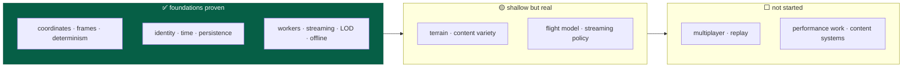
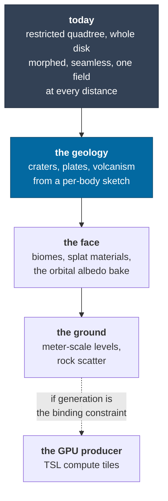
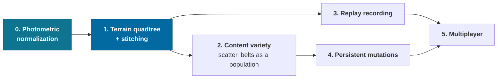

# Roadmap

What is **not built yet**, with the seam that already exists for it and an honest
note on what it would take.

Scope and principles are in [vision](vision.md); what exists is in
[architecture](architecture.md); what was learned building it is in
[CONTEXT.md](../CONTEXT.md).

> **Legend** — ✅ done · 🟡 partial · ⬜ not started · ⛔ deliberately deferred

---

## Where things stand



Milestone 1 — the [vertical architectural proof](vision.md#what-is-proven-today)
— is complete: 12/12 capability checks pass in Node and in Chrome, in dev and in
a production build. What follows is depth, not foundations.

---

## Status at a glance

| Area                                | Status | Notes                                                                                                                                                             |
| ----------------------------------- | ------ | ----------------------------------------------------------------------------------------------------------------------------------------------------------------- |
| Universe coordinates and precision  | ✅     | [ADR-0001](adr/0001-universe-coordinates.md)                                                                                                                      |
| Reference frames and transitions    | ✅     | [ADR-0002](adr/0002-reference-frames.md)                                                                                                                          |
| Render coordinates, floating origin | ✅     | [ADR-0003](adr/0003-render-coordinates.md)                                                                                                                        |
| Stable identity and addressing      | ✅     | [ADR-0004](adr/0004-entity-addressing.md)                                                                                                                         |
| Deterministic generation            | ✅     | Core proven; two inputs now — seed _and_ catalog version                                                                                                          |
| Real astronomical data              | ✅     | 7,123 systems and 702 planets within 150 ly; 129 Solar System bodies; [guide](guides/catalogue.md)                                                                |
| Measured body figures               | ✅     | 25 shape models from the PDS; generated figures everywhere else — [ADR-0013](adr/0013-measured-figures.md)                                                        |
| Simulation clock and determinism    | 🟡     | All of it except [replay](#replay-and-reconciliation)                                                                                                             |
| Simulation / rendering separation   | ✅     | Proven by `apps/headless`                                                                                                                                         |
| Worker architecture                 | ✅     | Pool, contracts, cancellation, instrumentation                                                                                                                    |
| Offline-first                       | ✅     | Service worker + IndexedDB + migrations                                                                                                                           |
| Persistence model                   | 🟡     | Proven; [mutations](#persistent-mutations) unbuilt                                                                                                                |
| Streaming                           | 🟡     | Systems and terrain stream; [policy is naive](#streaming-and-scale)                                                                                               |
| Level of detail                     | 🟡     | Tiers exist; [terrain](#terrain) is a restricted morphing quadtree; no scatter below a patch cell                                                                 |
| Units and conventions               | ✅     |                                                                                                                                                                   |
| Repository structure and layering   | ✅     | Enforced by `pnpm graph`                                                                                                                                          |
| Protocols and serialization         | 🟡     | Worker + save done; net, replay and binary unbuilt                                                                                                                |
| Observability                       | ✅     | All twelve inspectable fields                                                                                                                                     |
| Automation and DX                   | 🟡     | Commands, docs, CI and the formatter done; [no save fixture](#automation-gaps)                                                                                    |
| Testing                             | 🟡     | Strong; [replay and fixtures](#automation-gaps) missing                                                                                                           |
| Performance                         | 🟡     | Designed for, [barely measured](#performance-work)                                                                                                                |
| Multiplayer                         | ⛔     | Deferred. Seams only — [ADR-0008](adr/0008-multiplayer-partitions.md); the partition key is a live debug field                                                    |
| Application shell and modes         | ✅     | Five modes, routes as the public surface — [ADR-0011](adr/0011-application-shell-and-modes.md)                                                                    |
| Planetarium                         | ✅     | Free navigation, a folding and filterable catalog, the body record, orbit traces, labels, composed shots, standing on a surface — [design](design/planetarium.md) |
| Cinema player                       | ✅     | Transport, timecode and a frame-exact link over the cutscene format — [design](design/cinema.md)                                                                  |
| Dockable panels                     | ✅     | Four zones, property-tested layout algebra — [ADR-0012](adr/0012-dockable-panels.md)                                                                              |
| Mobile                              | 🟡     | Looking works and is verified; piloting on a touchscreen is not designed                                                                                          |

---

## Content: the rest of the vision

The [vision](vision.md) names the eventual inhabitants of the galaxy. Most are
not built. The important thing is that **none of them need architectural
change** — they are generators plus representations.

| Thing                    | Status | Seam                                                                                                                                                                                                                            |
| ------------------------ | ------ | ------------------------------------------------------------------------------------------------------------------------------------------------------------------------------------------------------------------------------- |
| Galaxy, systems, stars   | ✅     | Real out to 150 ly, procedural beyond — [catalog guide](guides/catalogue.md)                                                                                                                                                    |
| Planets, moons           | ✅     | Confirmed exoplanets and the Solar System are `observed`; the rest is `projected`                                                                                                                                               |
| Moons of real planets    | 🟡     | Sol's 62 are `observed` and measured; every exoplanet's moon is a projection, and `PackedPlanet` still has no moon list to change that                                                                                          |
| Catalog revision diff    | ✅     | `versionDrift` in `packages/protocol` — one verdict, read by the handshake, the save loader and the health panel                                                                                                                |
| Planetary terrain        | 🟡     | Whole-disk heightfields, seamless; three noise bands and no materials                                                                                                                                                           |
| Ships                    | 🟡     | One modeled hull (a CC-BY Enterprise-D in `data/models/`, debug cone as fallback), no variants or subsystems                                                                                                                    |
| Rings                    | ✅     | All four giants, with Saturn's shadow on its own and theirs on it; Haumea, Quaoar, Chariklo and Chiron carry theirs; procedural giants get a 1-in-6 chance                                                                      |
| Asteroids / belts        | 🟡     | 50 real asteroids and comets in Sol, and 6–18 generated per system — but they are `b:` bodies at system scale, not the `o:` region population a _visible_ belt would need (see [belts as a population](#belts-as-a-population)) |
| Small-body figures       | ✅     | 92 of Sol's 129 bodies are not spheroids; 25 have published shape models and the rest are seeded — [ADR-0013](adr/0013-measured-figures.md)                                                                                     |
| Star clusters, nebulae   | ⬜     | Density modulation in the galaxy generator + volumetric rendering                                                                                                                                                               |
| Black holes              | ⬜     | A body kind; the interesting part is rendering, not simulation                                                                                                                                                                  |
| Vegetation, flora, fauna | ⬜     | Region-seeded scatter on terrain — the `o:` address segment exists for this                                                                                                                                                     |
| Structures, settlements  | ⬜     | First real consumer of [persistent mutations](#persistent-mutations)                                                                                                                                                            |
| Humanoids                | ⬜     | Needs a character controller on a surface frame                                                                                                                                                                                 |
| Small physical objects   | 🟡     | Debug cubes render at the right scale; no interaction                                                                                                                                                                           |

**Gameplay verbs**: piloting ✅, in-system travel ✅, approach and orbit ✅,
landing ✅. Interstellar travel is 🟡 — possible but takes hours of
simulated time, so it wants either a warp/jump mechanic or much higher
acceleration. Atmospheric entry is 🟡: drag and an exponential atmosphere are
modeled, but there is no heating, no plasma, no structural stress. Surface
exploration is 🟡 — you can land and fly around, but there is nothing to explore
yet.

---

## Terrain

The most visible shallowness, and the milestone in progress —
[TERRAIN-PLAN](../TERRAIN-PLAN.md) sequences it.



Phase 1 landed 27 Aug 2026: per-patch level selection, whole-disk coverage,
cross-face sampling, bordered patches, the CDLOD morph, prefetch and budget.
[ADR-0015](adr/0015-terrain-level-of-detail.md) is the decision record and
[`CONTEXT.md`](../CONTEXT.md) has the measurements. What it closed: the horizon
is terrain rather than the datum sphere, cube-face edges are not holes, patch
boundaries have no seam, and the three defects that came from measuring altitude
from the datum are gone — every one of the zoo's twenty-four survey sites now
bottoms out at its own detail floor, where two of Miranda's could not be drawn
at any altitude at all.

Phase 1.5 landed 28 Aug 2026: the camera has a lens, and the refinement
predicate reads it instead of assuming 60° over 1080 px.
[ADR-0017](adr/0017-the-lens.md) is the decision record. It matters here because
every patch count in the plan is a function of that one number — the flight lens
is 848 px/rad against the guess's 935, and the telephoto end of the
field-of-view slider saturates the patch cap on most of a descent's steps.
Phase 2's acceptance criterion is a plate review, and the plates are now composed
through the optics the game is played with.

| Gap                                        | Consequence today                                                                       | Seam                                                                                                                              |
| ------------------------------------------ | --------------------------------------------------------------------------------------- | --------------------------------------------------------------------------------------------------------------------------------- |
| Three noise bands                          | No craters, no tectonics — every world is the same rolling fBm at a different amplitude | The band stack and the per-body sketch, [TERRAIN-PLAN § 6](../TERRAIN-PLAN.md); `surfaceDetailFloor` deepens with them on its own |
| One flat color per body                    | Terrain reads as geometry, never as a place                                             | Elevation, slope and latitude are already available per vertex                                                                    |
| A mapped body's terrain is not its map     | Procedural ground under a photographic albedo, near the surface only                    | The DEM ingest ends the carve-out; Phase 3's material is what makes the patches wear the published map meanwhile                  |
| The sphere-tier shell needs an albedo bake | Terrain is switched off past 8 px of relief, so an approach shows the sphere            | A per-face normal + albedo tile, baked in workers like any patch                                                                  |
| The selection is not frustum-culled        | A whole disk is generated, of which the renderer draws about a third                    | The streamer has the camera; a generous cone would keep a turn from bursting                                                      |
| Vertex attributes are float32              | 203 KB a patch, so a whole-disk selection is 60–91 MB at the flight lens                | Int8 normals and Int16 morph deltas are worth about half                                                                          |
| The mesh is built on the main thread       | 0.25 ms a patch, four a frame                                                           | The worker already has the field; the mesh arithmetic has to move to `packages/universe` first, for the layer rule                |
| Patch generation is over its budget        | 14.5 ms per bordered 65×65 patch against a documented ≤ 8 ms, before any geology        | `pnpm sim --terrain-baseline` is the measurement; amplitude floors and a GPU producer are the levers                              |
| A coarse patch costs more than a fine one  | 20.7 ms at level 1 against 14.3 at level 12, for the same 4,761 samples                 | Consecutive samples of a coarse patch land in different noise lattice cells; a whole-disk selection pays it on the shell          |

---

## Streaming and scale

| Gap                                   | Consequence                                       | Seam                                                                                                    |
| ------------------------------------- | ------------------------------------------------- | ------------------------------------------------------------------------------------------------------- |
| Interest is a radius scan over cells  | Fine at 6 ly; a 100 ly query touches ~1,000 cells | `systemsWithin` already bounds and refuses oversized queries; a spatial index goes behind the same call |
| Simulation interest = render interest | Distant systems do not simulate at all            | `updateInterest` is the seam; a coarser tier for "simulated but not rendered" is the next step          |

### Simulation in a worker

The core is provably framework-free — `apps/headless` runs it in Node with no
DOM. Moving it to a Web Worker is therefore mechanical rather than
architectural: the snapshot is already structured-cloneable and the renderer
already only reads snapshots.

Not done because nothing needs it yet. The single-entity simulation runs at
~1.25M ticks/s in the browser. It becomes interesting when entity counts rise.

---

## Persistent mutations

The model is proven; the data is not built.

```
{ address, kind: 'discovered' | 'destroyed' | 'placed' | 'terrain', data, tick }
```

The field exists and validates today, so adding the first real mutation is a
migration of _data_ rather than a change of _model_. What each needs:

| Mutation     | Needs                                                                                                |
| ------------ | ---------------------------------------------------------------------------------------------------- |
| `discovered` | A player-state blob; trivial                                                                         |
| `destroyed`  | A generated entity to be suppressible at generation time — the generator must consult a mutation set |
| `placed`     | Dynamic entities that persist, which already works for the ship                                      |
| `terrain`    | A sparse height delta keyed by region address, applied after `elevationAt`                           |

The one to design carefully is `destroyed`, because it inverts the direction of
dependence: generation currently knows nothing about saved state, and it must
stay a pure function. The likely shape is a filter applied _after_ generation,
not a branch inside it.

---

## Replay and reconciliation

Deterministic stepping ✅ exists; **recorded** replay does not.

Everything needed is present: the tick is canonical, the state hash compares
universes, and control input is already persisted. What is missing is an input
**log** — `(tick, entityId, controlInput)` — plus a driver that replays it.

That would also give: a bug report format that reproduces exactly, a regression
test format for flight behavior, and the foundation for client prediction if
multiplayer arrives.

---

## Multiplayer

⛔ **Deliberately deferred.**

Deliberately deferred to a later phase. What exists:

- `partitionForAddress` / `partitionForPosition` map to opaque string keys.
- Authority follows an entity's **frame chain**, so a ship in Sol belongs to
  Sol's partition even though it has no address.
- No vendor SDK anywhere in `packages/*`, enforced by the layer check.
- [ADR-0008](adr/0008-multiplayer-partitions.md) sketches the topology.

What it will need, none of it started: an `AuthorityPort` interface with a local
implementation, entity replication, client prediction and reconciliation,
interest management, handoff between partitions, conflict resolution for
mutations, and protocol versioning for net messages.

The one piece of design worth restating: because the base universe is
deterministic, an authority only has to replicate what a client cannot derive —
entity states and persistent mutations. That is the same set a save file
contains, which is not a coincidence and is worth preserving.

---

## Performance work

The principle is _design for these, measure before optimising_
([vision](vision.md#measure-before-optimizing)). The design admits all of them;
almost none are applied, and almost nothing is measured.

| Technique            | Status | Where it would go first                                                                                                           |
| -------------------- | ------ | --------------------------------------------------------------------------------------------------------------------------------- |
| Typed arrays         | ✅     | Heightfields, vertex buffers                                                                                                      |
| Transferable buffers | ✅     | Worker results                                                                                                                    |
| Worker pools         | ✅     |                                                                                                                                   |
| Instanced rendering  | 🟡     | Star field is instanced sprites — WebGPU has no point size. Asteroids and scatter are not                                         |
| Object pooling       | ⬜     | `Vec3` allocation in the flight inner loop                                                                                        |
| Spatial indexes      | ⬜     | Interest queries                                                                                                                  |
| WASM                 | ⬜     | Noise generation, if profiling justifies it                                                                                       |
| WebGPU               | 🟡     | `WebGPURenderer` + TSL shipped, WebGL 2 retained as fallback. Compute shaders, storage buffers and indirect draw are not used yet |
| `SharedArrayBuffer`  | ⬜     | Requires cross-origin isolation; nothing needs it yet                                                                             |

**What is measured today:** simulation throughput (~100–105k ticks/s headless,
~1.25M ticks/s browser for one entity), worker queue latency and execution time,
frame time, engine time, draw calls, triangles, JS heap, and GPU milliseconds per
frame — the last measured across a drained queue rather than from
`renderer.info.render.timestamp`, which
[lies](spikes.md#2--tsl-and-the-atmosphere-integral). All of it is live in the
dev dock's **perf** panel. **What is not:** allocation rate, GC pressure, cold load
to interactive, anything at all on the target machine, and any stored baseline —
so there is still nothing that can fail a pull request for getting slower.

The overlay earned itself on the first day: it found that the simulation clock
capped time warp at 7.5× while the UI offered 100,000×.

Also unaddressed: the entry chunk is 2.48 MB raw (**747.0 KB gzip / 583.8 KB
brotli**, measured 2026-08-27), dominated by Three.js. Roughly 150 KB raw of it
is dead weight: React Three Fiber imports `three`, which pulls in the classic
`WebGLRenderer` that nothing uses, because the WebGL _fallback_ here is
`WebGPURenderer`'s own backend. Dropping R3F or splitting the renderer out would
both recover it. The budget is 900 KB gzip, so this is inside it.

**One split exists, and it is not the application's.** The documentation's
diagrams import Mermaid dynamically, which brings 116 further chunks —
3.28 MB raw, 954.0 KB gzip, Mermaid's own parsers plus cytoscape, dagre and
KaTeX. None carries a first-party module, and nobody fetches one until they open
a documentation page that has a diagram on it. Nothing in `apps/game/src` is
lazily loaded, so a reader arriving at `/` still pays the whole entry chunk.

**Two numbers arrived from [the spikes](spikes.md) and both belong here.**

- A single-scattering atmosphere raymarch at 256 samples per pixel costs
  **7.27 ms at 1080p on an Apple M5** — 2.4× the frame budget's atmosphere line on
  a GPU well above target. Precomputed LUTs are a requirement, not an
  optimization.
- The whole 150 ly catalog is **159 KB brotli**. It is not a performance
  problem and does not need streaming.

> ⚠️ **When the benchmark harness is built, do not use
> `renderer.info.render.timestamp`.** It double-counts on the canvas path — it
> reported 14.6 ms for a frame whose true cost is 7.27 ms. Wall clock across
> `queue.onSubmittedWorkDone()`, or a raw `timestamp-query`, agree with each other
> and with reality.

---

## The overlay refactor — landed (22 Aug 2026)

The UI foundations arrived first — `lucide-react`, shadcn/ui, `motion`, `zustand`
and `react-router` in `apps/game` — with one real use each, so the wiring was
proven before anything was rewritten onto them. The rewrite is now done.
[`CONTEXT.md`](../CONTEXT.md) has the build log entry; [`DESIGN.md`](../DESIGN.md)
has the token mapping.

**What the hand-rolled controls became.**

| Was                                     | Is                                                        |
| --------------------------------------- | --------------------------------------------------------- |
| `hud/widgets.tsx` → `Action`            | `hud/Action.tsx`, a `Button` preset — see the note below  |
| `hud/widgets.tsx` → `Section`           | `Collapsible`, still controlled by `usePersistentState`   |
| `hud/widgets.tsx` → `Row`               | `hud/Row.tsx`, unchanged — it is a readout, not a control |
| `HudDock`'s hand-rolled tablist         | `Tabs` / `TabsList` / `TabsTrigger` / `TabsContent`       |
| `CameraPanel`'s `<input type="range">`  | `Slider`, via the shared `hud/LensSlider.tsx`             |
| Both transports' `<input type="range">` | `Slider`, via the shared `hud/FrameScrubber.tsx`          |
| `GraphicsPanel`'s and `ViewPanel`'s two | one `hud/SwitchRow.tsx` over `Switch`                     |
| different `Toggle`s                     |                                                           |
| `GraphicsPanel`'s `Cycle`               | `ToggleGroup` — see "one correction" below                |
| `ShellBar`'s `<button role="switch">`   | `Toggle`                                                  |
| The catalog's address field             | `Input`, via `hud/AddressForm.tsx`                        |
| The `w-px bg-slate-800` dividers        | `Separator`                                               |
| The status chips                        | `Badge`                                                   |
| Icon-only controls' `title` attribute   | `Tooltip` — the rest keep `title`; see below              |

**One correction to the plan.** It listed the anti-aliasing `Cycle` as having
"no registry form", which was true of a cycle-through _control_ and false of the
problem: the set is `off · 2× · 4×` and it is closed and small, so it is a radio
group. `ToggleGroup` is that, it puts all three on screen at once, and it reaches
a specific level in one press instead of up to three.

**Two things it deliberately did not do.**

- **`ScrollArea` is not used, and should not be.** Radix's viewport wraps its
  content in a `display: table` box that grows past 100% to fit the widest line —
  and every readout in the dock is `truncate` inside a 27 rem column, so the
  ellipsis would simply stop happening. `index.css` already paints the native
  gutter in this system's colors for exactly this surface. The row in the old
  plan was wrong.
- **`OverlayPage` keeps its hand-rolled dialog.** Radix's `Dialog` with
  `modal={false}` is genuinely the shape this wants, and the ~60 lines it would
  replace are the ones carrying the focus-restore rules, the scrim's
  drag-release exception and the `AnimatePresence` keying — each written against
  a bug that shipped. That swap is worth doing and it is worth doing _on its
  own_, with those cases as its acceptance criteria.

**Tooltips were listed as blocked on the portal. They are not.** The reasoning
was that shadcn overlays portal to `document.body`, outside `.hud-layer` and so
outside `dynamic-range-limit: standard`, and would wash out against a star. The
clamp exists because the dock and the flight strip are `backdrop-filter`
surfaces and a backdrop filter _samples what is behind it_; `TooltipContent` is
an opaque `bg-foreground` box with no backdrop filter, so it has nothing to
sample. They are used only where the control is icon-only and the hint is
therefore the label — the dock rail, the panel close buttons, the transports,
the shell bar. Everywhere a control has readable text the `title` stays, because
there it is doing a different job: recovering a value that truncated. Give a
tooltip a translucent ground and the clamp is load-bearing again, at which point
Radix's `Portal` takes a `container`.

**The three carry-across risks all held.**

1. **`releaseFocus` is load-bearing** — every control blurs itself on a
   _pointer_ click and not on a keyboard activation, because flight input is a
   window-level keydown listener. It is now inside `hud/Action.tsx`,
   `hud/SwitchRow.tsx` and `hud/TransportButton.tsx` rather than at sixty call
   sites, which is the shape that stops it being forgotten. See
   [CONTEXT.md](../CONTEXT.md) § "The focus contract, which is subtler than it
   looks".
2. **`PerfPanel` still carries `'use no memo'`**, and so do the pieces split out
   of it. Moving a panel onto `useEngine` selectors is what would make that
   opt-out unnecessary; moving it onto shadcn components alone does not.
3. **The accent is still never a fill behind text.** `Button`'s `default`
   variant is a solid `bg-primary` plate, which `index.css` rules out; the
   primary tone is `outline` plus the `sky-500/15` wash, in one place.

**Still not in scope**, and worth restating because the temptation is real: this
refactored the _dev dock_, which is scaffolding. It does not move it toward the
cockpit in [ux.md](design/ux.md) — that starts from where an element physically
sits on a canopy, not from this layout.

---

## Small bodies and their figures

Landed 25 Aug 2026 — [ADR-0013](adr/0013-measured-figures.md), and the build log
entry for what it cost. What follows is what it left open, in the order the
value is.

### Photometric normalization

**The largest single thing standing between the renderer and "photographic".**

A surface map's mean linear luminance ranges from 0.048 (Callisto) to 0.32 (the
Moon) across the shipped set, and it does not track the published geometric
albedo at all — Vesta's map is four times darker than Mercury's on a body three
times brighter. Every body's tint compensates by hand, which is a per-body
constant standing in for a per-body measurement.

| Gap                                    | Consequence                                                      | Seam                                                                                                                                                 |
| -------------------------------------- | ---------------------------------------------------------------- | ---------------------------------------------------------------------------------------------------------------------------------------------------- |
| Maps are not normalized to albedo      | Each body's brightness is hand-tuned and a new map arrives wrong | `apps/ingest/src/textures.ts` already decodes every map; recording its mean linear luminance in the manifest is a few lines                          |
| The renderer has no target reflectance | Nothing converts a published `p` into a rendered brightness      | `PlanetMaterial.albedoScale` already exists and is already driven per body by `adaptationFor`; a normalization term multiplies into the same uniform |

The reason it is not done: it changes how **every planet** is lit, including the
eight that are currently right. That makes it a deliberate pass with its own
before-and-after plates, not a patch. The measurement that would drive it is in
[`CONTEXT.md`](../CONTEXT.md) under the 25 Aug entry.

### Shape models the ingest cannot reach

`pnpm shapes:build` speaks PDS, and two of the most recognizable silhouettes in
the Solar System are archived elsewhere.

| Body                                 | Archive                                                  | Why it matters                                                                                                                                  |
| ------------------------------------ | -------------------------------------------------------- | ----------------------------------------------------------------------------------------------------------------------------------------------- |
| 67P/Churyumov–Gerasimenko            | ESA Planetary Science Archive                            | The duck. The single most recognizable small-body outline there is, and it currently renders as a generated figure on its measured half-extents |
| 162173 Ryugu                         | JAXA DARTS                                               | A spinning top like Bennu, and the other sample-return target                                                                                   |
| 433 Eros, 25143 Itokawa surface maps | NEAR and Hayabusa archived images, not projected mosaics | Both have their figure vendored; neither has a map, and no public archive holds one                                                             |

The seam is a second fetcher shape in `shapeSources.ts` — the readers
(`grid`, `obj`, `vertex`) already cover every format those archives publish.

### What `radius` means

**Unresolved on purpose, and the trade-off is the interesting part.**

For a body with a shipped model, `radius` is the measured bounding box, so
nothing ever exceeds it. For a generated body it is the reference _ellipsoid's_
semi-axis, and the lumps stand above it — about 17% at the median roughness and
up to 55% at the top of the range.

The two cannot be reconciled: a lumpy body with an ellipsoid's volume has a
**larger** bounding box than that ellipsoid, so a figure can preserve the volume
or match the bounding box and not both. `irregularFigure` picks volume, because
the mass and the class density depend on it and nothing depends on the bounding
box except which LOD tier gets picked — a tier boundary rather than a fact.
Changing it means carrying both, which is a third set of numbers on every body
for a cosmetic gain.

### Gravity is still a point mass

The bodies this added are exactly the ones where that stops being true. Bennu's
gravity field is dominated by its _shape_ — the equatorial ridge is centrifugal,
material migrates along a slope field that a point mass does not have, and the
OSIRIS-REx team published the gravity model precisely because the point-mass
answer is wrong at the surface. Nothing in the game is close enough to a small
body for long enough for it to matter yet, and the seam is real: the shape field
is already a polyhedron and the polyhedral gravity integral is a known closed
form.

### Belts as a population

Generated systems get 6–18 small bodies each, and Sol has 50 real ones. That is
a _sample_ of a population that in reality runs to millions, and it is deliberate
— they are `b:` bodies at system scale, addressed and traceable like planets.

A belt you can **see** is a different object: many thousands of instanced points
from one cell seed, addressed as `o:` objects within a region, culled and drawn
as a cloud rather than as bodies. The `o:` address segment exists for it. The
two are complements, not alternatives: the named ones stay addressable
destinations and the population is the scenery between them.

---

## Automation gaps

| Gap                             | Note                                                                                                                                                                                                    |
| ------------------------------- | ------------------------------------------------------------------------------------------------------------------------------------------------------------------------------------------------------- |
| ~~No CI configuration~~ ✅      | `.github/workflows/check.yml` runs `pnpm check` and the capability self-test on every pull request                                                                                                      |
| ~~No formatter~~ ✅             | prettier, with `format:check` inside `pnpm check`, so a badly formatted file fails the gate rather than being noticed in review                                                                         |
| No stored save fixture          | Compatibility testing currently synthesises old saves in-test rather than loading a real one from disk                                                                                                  |
| No performance regression tests | See above                                                                                                                                                                                               |
| No visual regression testing    | The seam now exists: the `tng-intro` cutscene (ADR-0010) is frame-seekable against a frame-analyzed reference edit, so render → dump → re-measure → diff is a script away. Would still need a GPU in CI |

---

## Known simplifications in the physics

Not roadmap items so much as honest labels on what is modeled:

| Simplification                                | Reality                                                                                                                                                                                                                                                                            |
| --------------------------------------------- | ---------------------------------------------------------------------------------------------------------------------------------------------------------------------------------------------------------------------------------------------------------------------------------- |
| Multiple-star systems modeled as single stars | The catalog records true component counts for all 375 of them within 150 ly                                                                                                                                                                                                        |
| No vendored maps for most small bodies        | Titan, Enceladus, Iapetus, Triton, the Uranian moons, Deimos, Eros, Itokawa, Ryugu and everything below Bennu render from measured albedo and tint. Twenty-five of them do have a measured _figure_, which for a body a few kilometers across is the half that shows               |
| Patched conics, no n-body                     | Lagrange points, resonances and perturbations do not exist                                                                                                                                                                                                                         |
| No collision except ground contact            | No hull, no entity-to-entity, no terrain slope response                                                                                                                                                                                                                            |
| Circular-ish orbits, coplanar-ish systems     | Generated inclinations and eccentricities are small                                                                                                                                                                                                                                |
| Atmospheres are isothermal exponential        | No layers, no weather, no wind                                                                                                                                                                                                                                                     |
| Bodies are spheroids or measured figures      | Oblateness is carried and drawn, and 92 Solar System bodies have a real figure — but nothing acts on either. No J2 precession, and gravity is a point mass everywhere, so the 500-meter bodies whose _shape_ dominates their gravity field are attracted to as if they were points |
| The collision datum is an ellipsoid           | `surfaceRadius` evaluates the measured ellipsoid for a figured body, not its shape model — `packages/universe` may not read a file. The residual is the body's own roughness, a median 9% of its mean radius                                                                       |

---

## What would be next

If the goal is the most architectural value per unit of work:



Terrain first: it is the visible ceiling on everything surface-related, it
exercises the streaming and LOD systems properly, and every later content system
(scatter, structures, terrain mutations) sits on top of it.

[Photometric normalization](#photometric-normalization) is numbered zero because
it is smaller than any of these and is the difference between a renderer that is
correct and one that is convincing. It is a day's work behind a measurement that
already exists, and it is the last thing that would be easy to do _before_ the
number of bodies grows again.

---

## Related

- [`CONTEXT.md`](../CONTEXT.md) — the build log and the bugs not to reintroduce
- [Architecture](architecture.md) — where each seam lives
- [ADRs](adr/README.md) — the decisions these build on
