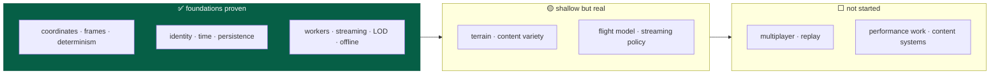
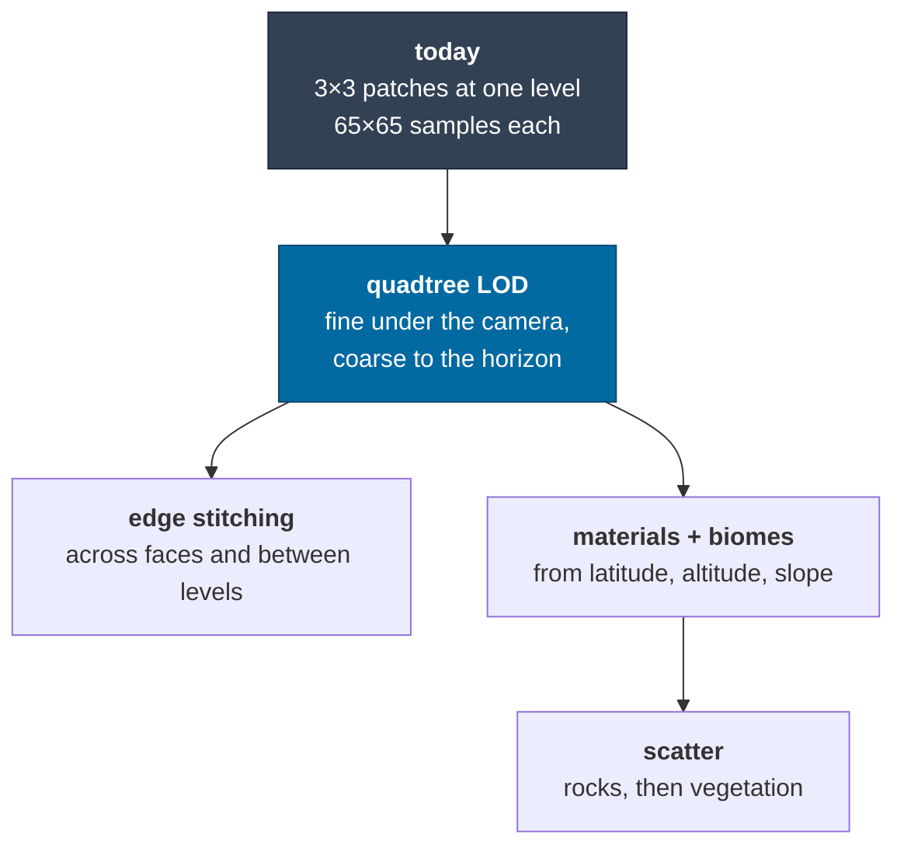
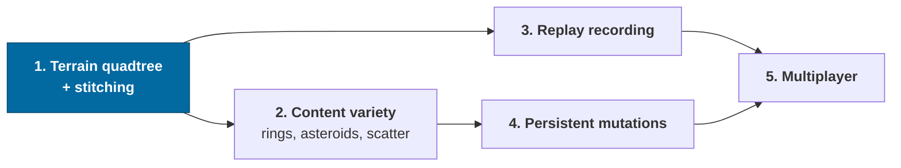

# Roadmap

What is **not built yet**, with the seam that already exists for it and an honest
note on what it would take.

Scope and principles are in [vision](vision.md); what exists is in
[architecture](architecture.md); what was learned building it is in
[CONTEXT.md](../CONTEXT.md).

> **Legend** — ✅ done · 🟡 partial · ⬜ not started · ⛔ deliberately deferred

---

## Where things stand



Milestone 1 — the [vertical architectural proof](vision.md#what-is-proven-today)
— is complete: 12/12 capability checks pass in Node and in Chrome, in dev and in
a production build. What follows is depth, not foundations.

---

## Status at a glance

| Area                                | Status | Notes                                                                                                          |
| ----------------------------------- | ------ | -------------------------------------------------------------------------------------------------------------- |
| Universe coordinates and precision  | ✅     | [ADR-0001](adr/0001-universe-coordinates.md)                                                                   |
| Reference frames and transitions    | ✅     | [ADR-0002](adr/0002-reference-frames.md)                                                                       |
| Render coordinates, floating origin | ✅     | [ADR-0003](adr/0003-render-coordinates.md)                                                                     |
| Stable identity and addressing      | ✅     | [ADR-0004](adr/0004-entity-addressing.md)                                                                      |
| Deterministic generation            | ✅     | Core proven; two inputs now — seed _and_ catalog version                                                       |
| Real astronomical data              | ✅     | 7,123 systems and 702 planets within 150 ly; [guide](guides/catalogue.md)                                      |
| Simulation clock and determinism    | 🟡     | All of it except [replay](#replay-and-reconciliation)                                                          |
| Simulation / rendering separation   | ✅     | Proven by `apps/headless`                                                                                      |
| Worker architecture                 | ✅     | Pool, contracts, cancellation, instrumentation                                                                 |
| Offline-first                       | ✅     | Service worker + IndexedDB + migrations                                                                        |
| Persistence model                   | 🟡     | Proven; [mutations](#persistent-mutations) unbuilt                                                             |
| Streaming                           | 🟡     | Systems and terrain stream; [policy is naive](#streaming-and-scale)                                            |
| Level of detail                     | 🟡     | Tiers exist; [terrain LOD](#terrain) is single-level                                                           |
| Units and conventions               | ✅     |                                                                                                                |
| Repository structure and layering   | ✅     | Enforced by `pnpm graph`                                                                                       |
| Protocols and serialization         | 🟡     | Worker + save done; net, replay and binary unbuilt                                                             |
| Observability                       | ✅     | All twelve inspectable fields                                                                                  |
| Automation and DX                   | 🟡     | Commands, docs and [CI](#automation-gaps) done; no formatter, no save fixture                                  |
| Testing                             | 🟡     | Strong; [replay and fixtures](#automation-gaps) missing                                                        |
| Performance                         | 🟡     | Designed for, [barely measured](#performance-work)                                                             |
| Multiplayer                         | ⛔     | Deferred. Seams only — [ADR-0008](adr/0008-multiplayer-partitions.md); the partition key is a live debug field |
| Application shell and modes         | ✅     | Five modes, routes as the public surface — [ADR-0011](adr/0011-application-shell-and-modes.md)                 |
| Planetarium                         | ✅     | Free navigation, catalog, orbit traces, labels, presets — [design](design/planetarium.md)                      |
| Cinema player                       | ✅     | Transport, timecode and a frame-exact link over the cutscene format — [design](design/cinema.md)               |
| Dockable panels                     | ✅     | Four zones, property-tested layout algebra — [ADR-0012](adr/0012-dockable-panels.md)                           |
| Mobile                              | 🟡     | Looking works and is verified; piloting on a touchscreen is not designed                                       |

---

## Content: the rest of the vision

The [vision](vision.md) names the eventual inhabitants of the galaxy. Most are
not built. The important thing is that **none of them need architectural
change** — they are generators plus representations.

| Thing                    | Status | Seam                                                                                                            |
| ------------------------ | ------ | --------------------------------------------------------------------------------------------------------------- |
| Galaxy, systems, stars   | ✅     | Real out to 150 ly, procedural beyond — [catalog guide](guides/catalogue.md)                                    |
| Planets, moons           | ✅     | Confirmed exoplanets and the Solar System are `observed`; the rest is `projected`                               |
| Moons of real planets    | ⬜     | `PackedPlanet` needs a moon list; every moon in the game is currently a projection, including Luna              |
| Catalog revision diff    | ⬜     | Both versions are recorded — in every save and every manifest — and nothing compares them yet                   |
| Planetary terrain        | 🟡     | Heightfields only; no biomes or materials                                                                       |
| Ships                    | 🟡     | One modeled hull (a CC-BY Enterprise-D in `data/models/`, debug cone as fallback), no variants or subsystems    |
| Rings                    | ✅     | Saturn's, with the planet's shadow on them and theirs on the planet; procedural giants get a 1-in-6 chance      |
| Asteroids / belts        | ⬜     | Wants a _population_ generator: many small bodies from one cell seed, addressed as `o:` objects within a region |
| Star clusters, nebulae   | ⬜     | Density modulation in the galaxy generator + volumetric rendering                                               |
| Black holes              | ⬜     | A body kind; the interesting part is rendering, not simulation                                                  |
| Vegetation, flora, fauna | ⬜     | Region-seeded scatter on terrain — the `o:` address segment exists for this                                     |
| Structures, settlements  | ⬜     | First real consumer of [persistent mutations](#persistent-mutations)                                            |
| Humanoids                | ⬜     | Needs a character controller on a surface frame                                                                 |
| Small physical objects   | 🟡     | Debug cubes render at the right scale; no interaction                                                           |

**Gameplay verbs**: piloting ✅, in-system travel ✅, approach and orbit ✅,
landing ✅. Interstellar travel is 🟡 — possible but takes hours of
simulated time, so it wants either a warp/jump mechanic or much higher
acceleration. Atmospheric entry is 🟡: drag and an exponential atmosphere are
modeled, but there is no heating, no plasma, no structural stress. Surface
exploration is 🟡 — you can land and fly around, but there is nothing to explore
yet.

---

## Terrain

The most visible shallowness, and the natural next milestone.



| Gap                                         | Consequence today                         | Seam                                                                                        |
| ------------------------------------------- | ----------------------------------------- | ------------------------------------------------------------------------------------------- |
| Single LOD level                            | The visible horizon is a few patches wide | `terrainLevelFor` already picks a level from altitude; the streamer needs a per-patch level |
| No edge stitching                           | Hairline seams between patches            | `buildPatch` uses one-sided differences at edges; it needs the neighbors' edge rows         |
| No cube-face wrapping                       | Patches at a face boundary are skipped    | The streamer skips out-of-range `i`/`j` rather than crossing to the adjacent face           |
| Spherical-only normals for the datum sphere | Fallback sphere is featureless            | Acceptable; it is only visible beyond the streamed set                                      |
| No terrain materials                        | One flat color                            | Elevation and slope are already available per vertex                                        |

---

## Streaming and scale

| Gap                                   | Consequence                                       | Seam                                                                                                    |
| ------------------------------------- | ------------------------------------------------- | ------------------------------------------------------------------------------------------------------- |
| Interest is a radius scan over cells  | Fine at 6 ly; a 100 ly query touches ~1,000 cells | `systemsWithin` already bounds and refuses oversized queries; a spatial index goes behind the same call |
| No predictive loading                 | Patches pop in rather than pre-loading            | The streamer knows camera velocity; extrapolate the request set                                         |
| No budget on generation per frame     | A fast descent can queue a burst                  | The pool measures queue latency; a budget belongs in the streamer                                       |
| Simulation interest = render interest | Distant systems do not simulate at all            | `updateInterest` is the seam; a coarser tier for "simulated but not rendered" is the next step          |

### Simulation in a worker

The core is provably framework-free — `apps/headless` runs it in Node with no
DOM. Moving it to a Web Worker is therefore mechanical rather than
architectural: the snapshot is already structured-cloneable and the renderer
already only reads snapshots.

Not done because nothing needs it yet. The single-entity simulation runs at
~1.25M ticks/s in the browser. It becomes interesting when entity counts rise.

---

## Persistent mutations

The model is proven; the data is not built.

```
{ address, kind: 'discovered' | 'destroyed' | 'placed' | 'terrain', data, tick }
```

The field exists and validates today, so adding the first real mutation is a
migration of _data_ rather than a change of _model_. What each needs:

| Mutation     | Needs                                                                                                |
| ------------ | ---------------------------------------------------------------------------------------------------- |
| `discovered` | A player-state blob; trivial                                                                         |
| `destroyed`  | A generated entity to be suppressible at generation time — the generator must consult a mutation set |
| `placed`     | Dynamic entities that persist, which already works for the ship                                      |
| `terrain`    | A sparse height delta keyed by region address, applied after `elevationAt`                           |

The one to design carefully is `destroyed`, because it inverts the direction of
dependence: generation currently knows nothing about saved state, and it must
stay a pure function. The likely shape is a filter applied _after_ generation,
not a branch inside it.

---

## Replay and reconciliation

Deterministic stepping ✅ exists; **recorded** replay does not.

Everything needed is present: the tick is canonical, the state hash compares
universes, and control input is already persisted. What is missing is an input
**log** — `(tick, entityId, controlInput)` — plus a driver that replays it.

That would also give: a bug report format that reproduces exactly, a regression
test format for flight behavior, and the foundation for client prediction if
multiplayer arrives.

---

## Multiplayer

⛔ **Deliberately deferred.**

Deliberately deferred to a later phase. What exists:

- `partitionForAddress` / `partitionForPosition` map to opaque string keys.
- Authority follows an entity's **frame chain**, so a ship in Sol belongs to
  Sol's partition even though it has no address.
- No vendor SDK anywhere in `packages/*`, enforced by the layer check.
- [ADR-0008](adr/0008-multiplayer-partitions.md) sketches the topology.

What it will need, none of it started: an `AuthorityPort` interface with a local
implementation, entity replication, client prediction and reconciliation,
interest management, handoff between partitions, conflict resolution for
mutations, and protocol versioning for net messages.

The one piece of design worth restating: because the base universe is
deterministic, an authority only has to replicate what a client cannot derive —
entity states and persistent mutations. That is the same set a save file
contains, which is not a coincidence and is worth preserving.

---

## Performance work

The principle is _design for these, measure before optimising_
([vision](vision.md#measure-before-optimizing)). The design admits all of them;
almost none are applied, and almost nothing is measured.

| Technique            | Status | Where it would go first                                                                                                           |
| -------------------- | ------ | --------------------------------------------------------------------------------------------------------------------------------- |
| Typed arrays         | ✅     | Heightfields, vertex buffers                                                                                                      |
| Transferable buffers | ✅     | Worker results                                                                                                                    |
| Worker pools         | ✅     |                                                                                                                                   |
| Instanced rendering  | 🟡     | Star field is instanced sprites — WebGPU has no point size. Asteroids and scatter are not                                         |
| Object pooling       | ⬜     | `Vec3` allocation in the flight inner loop                                                                                        |
| Spatial indexes      | ⬜     | Interest queries                                                                                                                  |
| WASM                 | ⬜     | Noise generation, if profiling justifies it                                                                                       |
| WebGPU               | 🟡     | `WebGPURenderer` + TSL shipped, WebGL 2 retained as fallback. Compute shaders, storage buffers and indirect draw are not used yet |
| `SharedArrayBuffer`  | ⬜     | Requires cross-origin isolation; nothing needs it yet                                                                             |

**What is measured today:** simulation throughput (~100–105k ticks/s headless,
~1.25M ticks/s browser for one entity), worker queue latency and execution time,
frame time, engine time, draw calls, triangles, JS heap, and GPU milliseconds per
frame — the last measured across a drained queue rather than from
`renderer.info.render.timestamp`, which
[lies](spikes.md#2--tsl-and-the-atmosphere-integral). All of it is live in the
dev dock's **perf** tab. **What is not:** allocation rate, GC pressure, cold load
to interactive, anything at all on the target machine, and any stored baseline —
so there is still nothing that can fail a pull request for getting slower.

The overlay earned itself on the first day: it found that the simulation clock
capped time warp at 7.5× while the UI offered 100,000×.

Also unaddressed: the client bundle is 1.90 MB raw (**541.4 KB gzip / 412.7 KB
brotli**, measured 2026-08-21), dominated by Three.js, with no code splitting. It
grew 177 KB gzip
with the WebGPU migration — the node system and the WebGPU backend — and roughly
150 KB raw of that is dead weight: React Three Fiber imports `three`, which pulls
in the classic `WebGLRenderer` that nothing uses, because the WebGL _fallback_
here is `WebGPURenderer`'s own backend. Dropping R3F or code-splitting would both
recover it. The budget is 900 KB gzip with splitting, so this is inside it.

**Two numbers arrived from [the spikes](spikes.md) and both belong here.**

- A single-scattering atmosphere raymarch at 256 samples per pixel costs
  **7.27 ms at 1080p on an Apple M5** — 2.4× the frame budget's atmosphere line on
  a GPU well above target. Precomputed LUTs are a requirement, not an
  optimization.
- The whole 150 ly catalog is **159 KB brotli**. It is not a performance
  problem and does not need streaming.

> ⚠️ **When the benchmark harness is built, do not use
> `renderer.info.render.timestamp`.** It double-counts on the canvas path — it
> reported 14.6 ms for a frame whose true cost is 7.27 ms. Wall clock across
> `queue.onSubmittedWorkDone()`, or a raw `timestamp-query`, agree with each other
> and with reality.

---

## The overlay refactor — landed (22 Aug 2026)

The UI foundations arrived first — `lucide-react`, shadcn/ui, `motion`, `zustand`
and `react-router` in `apps/game` — with one real use each, so the wiring was
proven before anything was rewritten onto them. The rewrite is now done.
[`CONTEXT.md`](../CONTEXT.md) has the build log entry; [`DESIGN.md`](../DESIGN.md)
has the token mapping.

**What the hand-rolled controls became.**

| Was                                     | Is                                                        |
| --------------------------------------- | --------------------------------------------------------- |
| `hud/widgets.tsx` → `Action`            | `hud/Action.tsx`, a `Button` preset — see the note below  |
| `hud/widgets.tsx` → `Section`           | `Collapsible`, still controlled by `usePersistentState`   |
| `hud/widgets.tsx` → `Row`               | `hud/Row.tsx`, unchanged — it is a readout, not a control |
| `HudDock`'s hand-rolled tablist         | `Tabs` / `TabsList` / `TabsTrigger` / `TabsContent`       |
| `CameraPanel`'s `<input type="range">`  | `Slider`, via the shared `hud/FovSlider.tsx`              |
| Both transports' `<input type="range">` | `Slider`, via the shared `hud/FrameScrubber.tsx`          |
| `GraphicsPanel`'s and `ViewPanel`'s two | one `hud/SwitchRow.tsx` over `Switch`                     |
| different `Toggle`s                     |                                                           |
| `GraphicsPanel`'s `Cycle`               | `ToggleGroup` — see "one correction" below                |
| `ShellBar`'s `<button role="switch">`   | `Toggle`                                                  |
| `NavPanel`'s address field              | `Input`, via `hud/AddressForm.tsx`                        |
| The `w-px bg-slate-800` dividers        | `Separator`                                               |
| The status chips                        | `Badge`                                                   |
| Icon-only controls' `title` attribute   | `Tooltip` — the rest keep `title`; see below              |

**One correction to the plan.** It listed the anti-aliasing `Cycle` as having
"no registry form", which was true of a cycle-through _control_ and false of the
problem: the set is `off · 2× · 4×` and it is closed and small, so it is a radio
group. `ToggleGroup` is that, it puts all three on screen at once, and it reaches
a specific level in one press instead of up to three.

**Two things it deliberately did not do.**

- **`ScrollArea` is not used, and should not be.** Radix's viewport wraps its
  content in a `display: table` box that grows past 100% to fit the widest line —
  and every readout in the dock is `truncate` inside a 27 rem column, so the
  ellipsis would simply stop happening. `index.css` already paints the native
  gutter in this system's colors for exactly this surface. The row in the old
  plan was wrong.
- **`OverlayPage` keeps its hand-rolled dialog.** Radix's `Dialog` with
  `modal={false}` is genuinely the shape this wants, and the ~60 lines it would
  replace are the ones carrying the focus-restore rules, the scrim's
  drag-release exception and the `AnimatePresence` keying — each written against
  a bug that shipped. That swap is worth doing and it is worth doing _on its
  own_, with those cases as its acceptance criteria.

**Tooltips were listed as blocked on the portal. They are not.** The reasoning
was that shadcn overlays portal to `document.body`, outside `.hud-layer` and so
outside `dynamic-range-limit: standard`, and would wash out against a star. The
clamp exists because the dock and the flight strip are `backdrop-filter`
surfaces and a backdrop filter _samples what is behind it_; `TooltipContent` is
an opaque `bg-foreground` box with no backdrop filter, so it has nothing to
sample. They are used only where the control is icon-only and the hint is
therefore the label — the dock rail, the panel close buttons, the transports,
the shell bar. Everywhere a control has readable text the `title` stays, because
there it is doing a different job: recovering a value that truncated. Give a
tooltip a translucent ground and the clamp is load-bearing again, at which point
Radix's `Portal` takes a `container`.

**The three carry-across risks all held.**

1. **`releaseFocus` is load-bearing** — every control blurs itself on a
   _pointer_ click and not on a keyboard activation, because flight input is a
   window-level keydown listener. It is now inside `hud/Action.tsx`,
   `hud/SwitchRow.tsx` and `hud/TransportButton.tsx` rather than at sixty call
   sites, which is the shape that stops it being forgotten. See
   [CONTEXT.md](../CONTEXT.md) § "The focus contract, which is subtler than it
   looks".
2. **`PerfPanel` still carries `'use no memo'`**, and so do the pieces split out
   of it. Moving a panel onto `useEngine` selectors is what would make that
   opt-out unnecessary; moving it onto shadcn components alone does not.
3. **The accent is still never a fill behind text.** `Button`'s `default`
   variant is a solid `bg-primary` plate, which `index.css` rules out; the
   primary tone is `outline` plus the `sky-500/15` wash, in one place.

**Still not in scope**, and worth restating because the temptation is real: this
refactored the _dev dock_, which is scaffolding. It does not move it toward the
cockpit in [ux.md](design/ux.md) — that starts from where an element physically
sits on a canopy, not from this layout.

---

## Automation gaps

| Gap                             | Note                                                                                                                                                                                                    |
| ------------------------------- | ------------------------------------------------------------------------------------------------------------------------------------------------------------------------------------------------------- |
| ~~No CI configuration~~ ✅      | `.github/workflows/check.yml` runs `pnpm check` and the capability self-test on every pull request                                                                                                      |
| ~~No formatter~~ ✅             | prettier, with `format:check` inside `pnpm check`, so a badly formatted file fails the gate rather than being noticed in review                                                                         |
| No stored save fixture          | Compatibility testing currently synthesises old saves in-test rather than loading a real one from disk                                                                                                  |
| No performance regression tests | See above                                                                                                                                                                                               |
| No visual regression testing    | The seam now exists: the `tng-intro` cutscene (ADR-0010) is frame-seekable against a frame-analysed reference edit, so render → dump → re-measure → diff is a script away. Would still need a GPU in CI |

---

## Known simplifications in the physics

Not roadmap items so much as honest labels on what is modeled:

| Simplification                                | Reality                                                                       |
| --------------------------------------------- | ----------------------------------------------------------------------------- |
| Multiple-star systems modeled as single stars | The catalog records true component counts for all 375 of them within 150 ly   |
| No vendored maps for seven Solar System moons | They render from their measured albedo and tint; USGS has mosaics for several |
| Patched conics, no n-body                     | Lagrange points, resonances and perturbations do not exist                    |
| No collision except ground contact            | No hull, no entity-to-entity, no terrain slope response                       |
| Circular-ish orbits, coplanar-ish systems     | Generated inclinations and eccentricities are small                           |
| Atmospheres are isothermal exponential        | No layers, no weather, no wind                                                |
| Bodies are spheres                            | No oblateness, so no J2 precession                                            |

---

## What would be next

If the goal is the most architectural value per unit of work:



Terrain first: it is the visible ceiling on everything surface-related, it
exercises the streaming and LOD systems properly, and every later content system
(scatter, structures, terrain mutations) sits on top of it.

---

## Related

- [`CONTEXT.md`](../CONTEXT.md) — the build log and the bugs not to reintroduce
- [Architecture](architecture.md) — where each seam lives
- [ADRs](adr/README.md) — the decisions these build on
