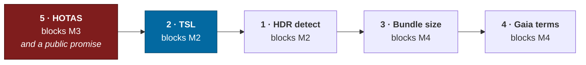

# Spikes

Five questions that need a **measurement rather than an opinion**. Each blocks
something specific, each is small, and each is written so that someone — human or
agent — who has never seen this repository can pick one up and finish it.

> [Roadmap](roadmap.md) is what is not built yet. This is what cannot be
> *planned* yet, because the answer is unknown and guessing it would put a number
> in a design document that nobody measured.

---

## How to run one

Every spike below has the same shape, and the shape matters more than the
individual answers:

1. **Read the context.** Start with [AGENTS.md](../AGENTS.md), then the page each
   spike links. Do not start by reading the whole codebase.
2. **Build the smallest thing that answers the question.** A spike is throwaway.
   It does not need tests, it does not need to be pretty, and it does not go
   through `pnpm check`. Put it in `spikes/<name>/` and expect to delete it.
3. **Write down the number**, not the impression. "It works" is not a result.
   "89 ms p50 over 200 frames on an M2 Air at 1440p" is.
4. **Record the answer where the guess currently lives** — the `[OPEN QUESTION]`
   tag named in each spike. Replace the tag with the finding, and delete the
   spike directory.
5. **If the answer changes a design decision, say so.** Several of these can come
   back negative, and a negative result that is written down is worth as much as
   a positive one. Three of the five have a stated fallback; take it rather than
   inventing a fourth option.

**Do not** land production code from a spike. The point is to buy information, and
information bought is cheaper than code kept.

---

## Priority



**Spike 5 first**, even though M3 is further out than M2. It is the only one whose
answer constrains what may be said publicly, and the cost of promising HOTAS
support and then withdrawing it is much higher than the cost of finding out now.
It is also the cheapest of the five.

---

## 1 · HDR display detection

| | |
|---|---|
| **Blocks** | [M2](design/production.md#m2--the-believable-world) |
| **Question** | Can the page reliably tell whether it is on an extended-range display, and can the user override it in both directions? |
| **Lives in** | [`design/art.md` § HDR](design/art.md#hdr) |
| **Size** | Half a day |

### Why it matters

The game renders and **outputs** in HDR, not merely an HDR internal pipeline that
tonemaps to SDR. Three.js's WebGPU renderer supports this today:

```js
const renderer = new THREE.WebGPURenderer({ outputType: THREE.HalfFloatType })
renderer.outputColorSpace = ExtendedSRGBColorSpace
THREE.ColorManagement.define({ [ExtendedSRGBColorSpace]: ExtendedSRGBColorSpaceImpl })
```

That much is verified — there is a `webgpu_hdr` example in the three.js
repository. What is **not** verified is the surrounding browser machinery: if the
page outputs extended range to a display that cannot show it, highlights clip
badly; if it fails to when the display can, the headline visual feature silently
does not happen.

### What to find out

- Does the `(dynamic-range: high)` media query report accurately, per-display, and
  does it update when a window moves between monitors?
- What does CSS `dynamic-range-limit` actually do to a WebGPU canvas?
- Is `screen.isExtended` useful here, or does it only describe multi-monitor
  topology?
- How do all three behave on: macOS with an XDR display, macOS with a non-HDR
  display, Windows with HDR on, Windows with HDR off, and a Linux/Chrome baseline?

### What a good answer looks like

A table of `browser × OS × display` against what each signal reported and whether
it was correct, plus a recommendation for the detection expression.

### Fallback if it comes back negative

**Ship a manual three-state setting — auto / force HDR / force SDR — regardless of
what detection turns out to be capable of.** This is not contingent on the
result; it is required either way, because auto-detection will be wrong for
somebody. The spike only decides what `auto` does.

---

## 2 · TSL and the atmosphere integral

| | |
|---|---|
| **Blocks** | [M2](design/production.md#m2--the-believable-world) |
| **Question** | Does Three.js's shading language cost anything material on a multiple-scattering atmosphere, or is a hand-written WebGPU pass needed? |
| **Lives in** | [`design/technical.md` § The WebGPU migration](design/technical.md#the-webgpu-migration) |
| **Size** | Two to three days. **The largest of the five.** |

### Why it matters

The migration plan is deliberately *Three.js `WebGPURenderer` with TSL first*
rather than a hand-written renderer, because `packages/rendering` already emits
plain data and never imports Three.js — so the swap is confined to `apps/game`
and can be incremental.

The atmosphere is the one place that bet might not pay. It must be **correct from
orbit and from the ground in a single shader**, because two shaders means a
visible switch and
[pillar 1](design/charter.md#pillar-1--one-continuous-space) forbids that. It is
also the most arithmetically dense pass in the renderer, and it is on the
[frame budget](design/technical.md#performance-budgets) for 3.0 ms alongside all
other post.

### What to find out

Implement a Bruneton-style precomputed transmittance + multiple-scattering
atmosphere twice: once in TSL, once as a hand-written WGSL pass. Same algorithm,
same LUT resolutions, same output.

Measure, on the [target machine](design/technical.md#performance-budgets) — a
2023-class laptop with integrated or entry discrete graphics, at 1920×1080:

- Per-frame cost of the sky pass, p50 and p95, from orbit and from the ground
- LUT precomputation cost and whether it can be amortised across frames
- Generated WGSL size and register pressure, if the tooling will show it
- Compile time, since it feeds the
  [shader pre-warm](design/technical.md#browser-specific-constraints) budget

### What a good answer looks like

Two numbers and a ratio. If TSL is within ~15% of hand-written, take TSL and stop
thinking about it. If it is 2× off, the atmosphere becomes a custom pass inside an
otherwise-TSL renderer and the migration plan needs a note saying so.

### Fallback if it comes back negative

A hybrid is explicitly allowed and already anticipated: terrain, atmosphere and
the star field are named as the three passes that may eventually justify custom
pipelines. A negative result here does not invalidate the migration — it just
moves one pass.

---

## 3 · Catalogue bundle size

| | |
|---|---|
| **Blocks** | [M4](design/production.md#m4--the-explorer--mvp) |
| **Question** | What does a packed catalogue sphere actually cost over the wire, at 25 ly and at 150 ly? |
| **Lives in** | [`design/galaxy.md` § Ingest pipeline](design/galaxy.md#ingest-pipeline) |
| **Size** | One day |

### Why it matters

The client is **1.15 MB, 324 KB gzipped** today, with no code splitting. "It's a
link" is the distribution advantage the whole project rests on, and the catalogue
is the first thing that could take that away.

The design assumes the local tier — every catalogued star drawn individually at
true position — extends to 150 ly. Whether that is affordable is currently a
guess, and the guess is load-bearing for how the galaxy map is specified.

### What to find out

Take the HYG v4 dataset. For spheres of 25, 50, 100 and 150 ly around Sol:

- Star count
- Naive JSON size
- Packed binary size — quantised position, spectral class as an enum, mass and
  radius as float16 or scaled integers
- Gzip and Brotli of the packed form
- The same, chunked by galactic cell, since that is how it will actually stream

### What a good answer looks like

A four-row table of `radius → stars → packed → brotli`, and a recommendation for
where the bundled/streamed boundary sits.

### Fallback if it comes back negative

If 150 ly is too large to bundle, it streams by cell — the interest system and
`systemsWithin` already exist for exactly this shape of query. The consequence is
for the [offline preparation](design/modes.md#solo-offline) screen, which then has
to be honest about the download rather than treating it as incidental.

---

## 4 · Gaia and HYG attribution terms

| | |
|---|---|
| **Blocks** | [M4](design/production.md#m4--the-explorer--mvp) |
| **Question** | What exactly do the licences require, and where must the attribution appear? |
| **Lives in** | [`design/sustainability.md` § Data licensing](design/sustainability.md#licensing) |
| **Size** | Half a day. **Not a coding task.** |

### Why it matters

The repository is [Apache-2.0](../LICENSE), but ingested data is not ours to
relicense. **HYG is CC BY-SA**, and share-alike is viral for derived data — the
packed binary format produced by spike 3 is a derivative work and inherits the
obligation. Getting this wrong is the one failure mode on this page with legal
rather than technical consequences.

### What to find out

- The exact ESA/Gaia terms and the **verbatim** attribution string they require
- Whether HYG's CC BY-SA applies to a heavily transformed, quantised binary
  derivative, and what attribution that derivative must carry
- Whether CC BY-SA on the data conflicts with Apache-2.0 on the code — it should
  not, since they cover different things, but the boundary must be written down
- Confirmation that NASA Exoplanet Archive data is public domain and unencumbered
- Whether a `NOTICE` file becomes required. Apache-2.0 §4(d) only mandates one
  where the work already carries attribution notices, which is why the repository
  has none today; the first ingest is likely to change that.

### What a good answer looks like

The attribution strings, written out verbatim, and a decision on where each
appears: in `NOTICE`, in the repository README, and — for Gaia — **in-product**,
on the catalogue panel that shows a star's data. The last of those is both a
licence requirement and something
[pillar 2](design/charter.md#pillar-2--the-sky-is-real) wants anyway, which is a
rare case of an obligation and a design goal agreeing.

### Fallback if it comes back negative

If HYG's share-alike proves genuinely awkward, the ingest can be rebuilt from
Gaia and the NASA archive directly. It is more work and it loses HYG's
pre-merged cross-catalogue identity resolution, which is
[the hardest part of the pipeline](design/galaxy.md#ingest-pipeline).

---

## 5 · WebHID and Gamepad for HOTAS

| | |
|---|---|
| **Blocks** | [M3](design/production.md#m3--the-pilot), and a public promise |
| **Question** | Is many-axis HOTAS support achievable in a browser at all? |
| **Lives in** | [`design/ux.md` § Controls](design/ux.md#controls) |
| **Size** | One day. **The cheapest, and it should be done first.** |

### Why it matters

The design states three first-class control schemes — mouse and keyboard, gamepad,
and HOTAS/HOSAS with full 6-DoF axis binding and no emulation layer. The first two
are certain. The third is genuinely uncertain in a browser, and HOTAS devices with
many axes and many buttons are the worst case for both APIs.

The bible already carries the instruction **"do not promise HOTAS before it is
proven"**. This spike is what lifts or confirms that.

### What to find out

On at least two real devices — ideally a stick-and-throttle pair, since dual-device
is where this usually breaks:

- Does the Gamepad API enumerate them, and does it expose **all** axes or clamp to
  a standard mapping?
- Does WebHID work without a permission prompt so hostile that nobody completes
  it? What does the prompt actually look like?
- Are axis resolution and polling rate good enough for flight, or is there
  quantisation visible in a slow roll?
- What is the input latency, end to end, versus the same device natively?
- Do two devices enumerate independently and stay stable across a reconnect?

### What a good answer looks like

A yes/no with evidence, and if yes, which API to build on and what the setup
experience costs the player.

### Fallback if it comes back negative

Mouse and keyboard and gamepad must be **genuinely good** regardless — the bible
already says mouse-and-keyboard has to be good rather than tolerated, because it
is what most players will use. If HOTAS is not viable, remove it from
[ux.md](design/ux.md#controls) rather than leaving it as an aspiration, and say so
plainly wherever the project describes itself.

---

## Related

- [Roadmap](roadmap.md) — what is not built yet, and the seam for each
- [Design bible](design/README.md) — where each of these numbers is currently a guess
- [`design/appendix.md`](design/appendix.md#still-open--five-engineering-spikes) — the same five, from the design side
- [AGENTS.md](../AGENTS.md) — the rules that apply to anything that outlives a spike
